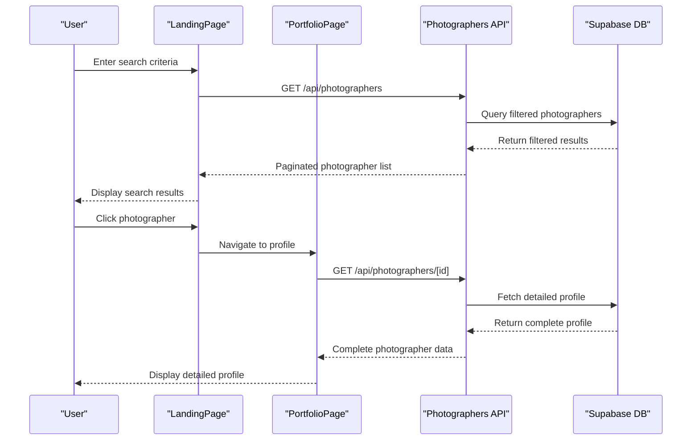

# Photographers API

<cite>
**Referenced Files in This Document**
- [pages/api/photographers/index.ts](file://pages/api/photographers/index.ts)
- [pages/api/photographers/[id].ts](file://pages/api/photographers/[id].ts)
- [src/lib/supabase.ts](file://src/lib/supabase.ts)
- [src/lib/api.ts](file://src/lib/api.ts)
- [src/components/PortfolioPage.tsx](file://src/components/PortfolioPage.tsx)
- [src/components/LandingPage.tsx](file://src/components/LandingPage.tsx)
- [src/components/figma/ImageWithFallback.tsx](file://src/components/figma/ImageWithFallback.tsx)
- [middleware.ts](file://middleware.ts)
</cite>

## Table of Contents
1. [Introduction](#introduction)
2. [API Endpoints](#api-endpoints)
3. [Response Schema](#response-schema)
4. [Query Parameters](#query-parameters)
5. [Pagination and Sorting](#pagination-and-sorting)
6. [Integration with Frontend Components](#integration-with-frontend-components)
7. [Caching Strategies](#caching-strategies)
8. [Image Loading Optimization](#image-loading-optimization)
9. [Rate Limiting and Best Practices](#rate-limiting-and-best-practices)
10. [Error Handling](#error-handling)
11. [Performance Considerations](#performance-considerations)
12. [Troubleshooting Guide](#troubleshooting-guide)

## Introduction

The Photographers API is a comprehensive RESTful API built with Next.js that provides endpoints for managing and retrieving photographer profiles, portfolios, and related data. The API serves as the backbone for the SnapEvent platform, enabling clients to discover photographers, view detailed profiles, and integrate with various frontend components like PortfolioPage and LandingPage.

The API is designed with performance, scalability, and developer experience in mind, featuring advanced search capabilities, efficient pagination, and robust error handling. It integrates seamlessly with Supabase for database operations and follows modern API design principles.

## API Endpoints

The Photographers API exposes two primary endpoints for managing photographer data:

### GET /api/photographers

Retrieves a list of approved, available photographers with optional filtering and pagination.

**Endpoint:** `GET /api/photographers`
**Method:** GET

### GET /api/photographers/[id]

Retrieves a specific photographer's profile by ID, including comprehensive details about their portfolio, services, and ratings.

**Endpoint:** `GET /api/photographers/[id]`
**Method:** GET

### POST /api/photographers

Creates a new photographer profile with comprehensive metadata and associated services.

**Endpoint:** `POST /api/photographers`
**Method:** POST

### PUT /api/photographers/[id]

Updates an existing photographer's profile information.

**Endpoint:** `PUT /api/photographers/[id]`
**Method:** PUT

### DELETE /api/photographers/[id]

Deletes a photographer's profile (admin-only functionality).

**Endpoint:** `DELETE /api/photographers/[id]`
**Method:** DELETE

**Section sources**
- [pages/api/photographers/index.ts](file://pages/api/photographers/index.ts#L1-L163)
- [pages/api/photographers/[id].ts](file://pages/api/photographers/[id].ts#L1-L154)

## Response Schema

The API returns structured JSON responses containing comprehensive photographer profile data. The response schema varies slightly between list and individual profile endpoints.

### List Response Schema

```typescript
{
  photographers: [
    {
      id: string,
      businessName: string,
      title: string,
      location: string,
      bio: string,
      specialties: string[],
      services: Array<{
        name: string,
        description: string,
        price: string,
        duration: string,
        deliverables: string
      }>,
      portfolio: Array<{
        id: number,
        image: string,
        category: string,
        title: string
      }>,
      rating: number,
      reviews: number,
      verified: boolean,
      image: string,
      website?: string,
      instagram?: string,
      email?: string,
      phone?: string,
      awards?: string[],
      testimonials?: Array<{
        name: string,
        event: string,
        rating: number,
        comment: string
      }>
    }
  ],
  pagination: {
    limit: number,
    offset: number,
    total: number
  }
}
```

### Individual Profile Response Schema

```typescript
{
  profile: {
    id: string,
    businessName: string,
    title: string,
    location: string,
    bio: string,
    website: string,
    instagramHandle: string,
    yearsExperience: number,
    isVerified: boolean,
    isAvailable: boolean,
    responseTime: string,
    totalClients: number,
    averageRating: number,
    totalReviews: number,
    profileImage: string,
    coverImage: string,
    applicationStatus: 'PENDING' | 'APPROVED' | 'REJECTED' | 'SUSPENDED',
    specialties: Array<{
      id: string,
      name: string,
      description: string
    }>,
    services: Array<{
      id: string,
      name: string,
      description: string,
      price: string,
      duration: string,
      deliverables: string
    }>,
    portfolioItems: Array<{
      id: string,
      title: string,
      description: string,
      imageUrl: string,
      category: string,
      tags: string[],
      isFeatured: boolean
    }>,
    awards: Array<{
      id: string,
      title: string,
      organization: string,
      year: number,
      description: string
    }>,
    testimonials: Array<{
      id: string,
      clientName: string,
      eventType: string,
      rating: number,
      comment: string,
      isApproved: boolean
    }>
  }
}
```

**Section sources**
- [src/lib/api.ts](file://src/lib/api.ts#L180-L260)
- [pages/api/photographers/index.ts](file://pages/api/photographers/index.ts#L15-L50)

## Query Parameters

The API supports several query parameters for filtering and searching photographers:

### Location Filtering
- **Parameter:** `location`
- **Type:** string
- **Description:** Filters photographers by location using partial matching
- **Example:** `?location=San+Francisco`

### Specialty Filtering
- **Parameter:** `specialty`
- **Type:** string
- **Description:** Filters photographers by specialty using array containment
- **Example:** `?specialty=Wedding+Photography`

### Minimum Rating Filter
- **Parameter:** `minRating`
- **Type:** number
- **Description:** Filters photographers with average rating greater than or equal to specified value
- **Example:** `?minRating=4.5`

### Pagination Parameters
- **Parameter:** `limit`
- **Type:** number
- **Default:** 20
- **Description:** Limits the number of results returned
- **Example:** `?limit=10`

- **Parameter:** `offset`
- **Type:** number
- **Default:** 0
- **Description:** Specifies the starting position for paginated results
- **Example:** `?offset=20`

### Combined Example
```javascript
// Search for wedding photographers in San Francisco with rating >= 4.5
const searchParams = new URLSearchParams({
  specialty: 'Wedding Photography',
  location: 'San Francisco',
  minRating: '4.5',
  limit: '10',
  offset: '0'
});
```

**Section sources**
- [pages/api/photographers/index.ts](file://pages/api/photographers/index.ts#L15-L40)
- [src/lib/api.ts](file://src/lib/api.ts#L60-L85)

## Pagination and Sorting

The API implements efficient pagination using Supabase's range functionality and automatic sorting by average rating in descending order.

### Pagination Implementation

```typescript
// Pagination calculation
const { limit = 20, offset = 0 } = req.query;
const paginationQuery = query.range(
  Number(offset), 
  Number(offset) + Number(limit) - 1
);
```

### Sorting Strategy

Photographers are automatically sorted by:
- **Primary:** `average_rating` (descending)
- **Secondary:** Application date (earlier applications considered first)

### Pagination Response Format

```json
{
  "photographers": [...],
  "pagination": {
    "limit": 20,
    "offset": 0,
    "total": 150
  }
}
```

### Recommended Pagination Pattern

```javascript
// Client-side pagination implementation
const loadMorePhotographers = async (page = 0) => {
  const limit = 20;
  const offset = page * limit;
  
  const response = await photographersAPI.getAll({
    limit: limit,
    offset: offset
  });
  
  return {
    photographers: response.photographers,
    hasNextPage: response.pagination.total > (offset + limit),
    nextPage: page + 1
  };
};
```

**Section sources**
- [pages/api/photographers/index.ts](file://pages/api/photographers/index.ts#L25-L35)

## Integration with Frontend Components

The Photographers API integrates seamlessly with key frontend components to provide a cohesive user experience.

### PortfolioPage Integration

The PortfolioPage component uses the API to fetch and display detailed photographer profiles:

```typescript
// PortfolioPage.tsx integration
React.useEffect(() => {
  const fetchPhotographer = async () => {
    try {
      setIsLoading(true);
      const response = await photographersAPI.getById(photographerId);
      setPhotographer(response);
    } catch (error) {
      console.error('Failed to fetch photographer:', error);
      // Fallback to mock data
      setPhotographer(mockPhotographerData);
    } finally {
      setIsLoading(false);
    }
  };
  
  fetchPhotographer();
}, [photographerId]);
```

### LandingPage Integration

The LandingPage component utilizes the API for search functionality and trending photographers:

```typescript
// LandingPage.tsx search implementation
const handleSearch = async () => {
  try {
    setIsLoading(true);
    const response = await photographersAPI.getAll({
      specialty: searchFilters.specialty,
      location: searchFilters.location,
      limit: 6
    });
    setTrendingPhotographers(response.photographers || []);
  } catch (error) {
    console.error('Search failed:', error);
  } finally {
    setIsLoading(false);
  }
};
```

### Component Interaction Flow



**Diagram sources**
- [src/components/LandingPage.tsx](file://src/components/LandingPage.tsx#L150-L180)
- [src/components/PortfolioPage.tsx](file://src/components/PortfolioPage.tsx#L120-L150)

**Section sources**
- [src/components/LandingPage.tsx](file://src/components/LandingPage.tsx#L150-L180)
- [src/components/PortfolioPage.tsx](file://src/components/PortfolioPage.tsx#L120-L150)

## Caching Strategies

While the current implementation doesn't include explicit caching, the API is designed to support various caching strategies for optimal performance.

### Recommended Caching Approach

```typescript
// Client-side caching implementation
const cache = new Map<string, { data: any, timestamp: number, ttl: number }>();

const getCachedPhotographer = async (id: string) => {
  const cached = cache.get(id);
  
  if (cached && Date.now() - cached.timestamp < cached.ttl) {
    return cached.data;
  }
  
  const data = await photographersAPI.getById(id);
  cache.set(id, {
    data,
    timestamp: Date.now(),
    ttl: 5 * 60 * 1000 // 5 minutes TTL
  });
  
  return data;
};
```

### Cache Key Strategy

```typescript
// Generate cache keys for search queries
const generateSearchCacheKey = (filters: any) => {
  const params = new URLSearchParams(filters);
  return `photographers:${params.toString()}`;
};
```

### Cache Invalidation

```typescript
// Invalidate cache on profile updates
const invalidatePhotographerCache = (id: string) => {
  cache.delete(id);
  
  // Invalidate related search caches
  for (const [key] of cache) {
    if (key.startsWith('photographers:')) {
      cache.delete(key);
    }
  }
};
```

## Image Loading Optimization

The API integrates with the ImageWithFallback component to ensure robust image loading and graceful error handling.

### ImageWithFallback Implementation

```typescript
// ImageWithFallback.tsx
export function ImageWithFallback(props: React.ImgHTMLAttributes<HTMLImageElement>) {
  const [didError, setDidError] = useState(false);
  
  const handleError = () => {
    setDidError(true);
  };
  
  const { src, alt, style, className, ...rest } = props;
  
  return didError ? (
    <div className={`inline-block bg-gray-100 text-center align-middle ${className ?? ''}`}>
      <div className="flex items-center justify-center w-full h-full">
        
      </div>
    </div>
  ) : (
    
  );
}
```

### Optimized Image Loading Patterns

```typescript
// PortfolioPage.tsx image optimization
<ImageWithFallback
  src={photographer.image}
  alt={photographer.businessName}
  className="w-32 h-32 md:w-48 md:h-48 rounded-full object-cover border-4 border-background shadow-lg"
/>
```

### Image Preloading Strategy

```typescript
// Preload critical images
const preloadImages = (photographers: Photographer[]) => {
  photographers.forEach(photographer => {
    const img = new Image();
    img.src = photographer.image;
  });
};
```

**Section sources**
- [src/components/figma/ImageWithFallback.tsx](file://src/components/figma/ImageWithFallback.tsx#L1-L28)
- [src/components/PortfolioPage.tsx](file://src/components/PortfolioPage.tsx#L180-L190)

## Rate Limiting and Best Practices

The API currently operates without explicit rate limiting, but implements several strategies to optimize performance for search-heavy operations.

### Current Rate Limiting Strategy

```typescript
// Middleware.ts - CORS and basic request handling
export async function middleware(request: NextRequest) {
  // Handle CORS preflight requests
  if (request.method === 'OPTIONS') {
    return new NextResponse(null, {
      status: 200,
      headers: {
        'Access-Control-Allow-Origin': '*',
        'Access-Control-Allow-Methods': 'GET, POST, PUT, DELETE, OPTIONS',
        'Access-Control-Allow-Headers': 'Content-Type, Authorization',
        'Access-Control-Max-Age': '86400',
      },
    });
  }
  
  // Add CORS headers and pass through
  const response = NextResponse.next();
  response.headers.set('Access-Control-Allow-Origin', '*');
  response.headers.set('Access-Control-Allow-Methods', 'GET, POST, PUT, DELETE, OPTIONS');
  response.headers.set('Access-Control-Allow-Headers', 'Content-Type, Authorization');
  
  return response;
}
```

### Recommended Rate Limiting Implementation

```typescript
// Enhanced rate limiting middleware
export async function middleware(request: NextRequest) {
  const ip = request.ip ?? '127.0.0.1';
  const rateLimitKey = `rate_limit:${ip}`;
  
  // Check Redis cache for rate limit
  const current = await redis.incr(rateLimitKey);
  
  if (current === 1) {
    await redis.expire(rateLimitKey, 60); // 1 minute window
  }
  
  // Allow 100 requests per minute
  if (current > 100) {
    return new Response('Too Many Requests', { status: 429 });
  }
  
  return NextResponse.next();
}
```

### Search Optimization Best Practices

```typescript
// Optimized search implementation
const optimizedSearch = async (filters: SearchFilters) => {
  // Use indexed fields for filtering
  const query = supabase
    .from('photographer_profiles')
    .select('*')
    .eq('application_status', 'APPROVED')
    .eq('is_available', true);
  
  // Apply filters efficiently
  if (filters.location) {
    query.ilike('location', `%${filters.location}%`);
  }
  
  if (filters.specialty) {
    query.contains('specialties', [{ name: filters.specialty }]);
  }
  
  if (filters.minRating) {
    query.gte('average_rating', filters.minRating);
  }
  
  // Use appropriate limits
  const { data, error } = await query.limit(50);
  
  return data;
};
```

### API Usage Best Practices

1. **Batch Requests**: Combine multiple small requests into single batch operations
2. **Efficient Filtering**: Use indexed database fields for filtering
3. **Appropriate Limits**: Set reasonable limits for search results (20-50 items)
4. **Caching Strategy**: Implement client-side caching for frequently accessed data
5. **Error Recovery**: Implement retry logic with exponential backoff

**Section sources**
- [middleware.ts](file://middleware.ts#L1-L40)

## Error Handling

The API implements comprehensive error handling with meaningful error messages and appropriate HTTP status codes.

### Error Response Format

```typescript
// Standard error response
{
  error: "Error message describing the issue"
}
```

### HTTP Status Codes

- **200 OK**: Successful operation
- **400 Bad Request**: Invalid request parameters or missing required fields
- **404 Not Found**: Photographer profile not found
- **405 Method Not Allowed**: Unsupported HTTP method
- **500 Internal Server Error**: Unexpected server error

### Error Handling Implementation

```typescript
// Error handling in API endpoints
async function getPhotographers(req: NextApiRequest, res: NextApiResponse) {
  try {
    // API logic here
  } catch (error) {
    console.error('Get photographers error:', error);
    return res.status(500).json({ error: 'Internal server error' });
  }
}

async function getPhotographerProfile(req: NextApiRequest, res: NextApiResponse, id: string) {
  try {
    const { data: profile, error } = await supabase
      .from('photographer_profiles')
      .select('*')
      .eq('id', id)
      .single();
      
    if (error) {
      return res.status(404).json({ error: 'Photographer profile not found' });
    }
    
    return res.status(200).json({ profile });
  } catch (error) {
    console.error('Get photographer profile error:', error);
    return res.status(500).json({ error: 'Internal server error' });
  }
}
```

### Client-Side Error Handling

```typescript
// Robust client-side error handling
const safeFetchPhotographer = async (id: string) => {
  try {
    const response = await photographersAPI.getById(id);
    return response;
  } catch (error) {
    if (error.message.includes('Not Found')) {
      // Handle 404 errors gracefully
      return null;
    } else if (error.message.includes('fetch failed')) {
      // Handle network errors
      return getOfflinePhotographerData(id);
    } else {
      // Handle other errors
      throw error;
    }
  }
};
```

**Section sources**
- [pages/api/photographers/index.ts](file://pages/api/photographers/index.ts#L15-L25)
- [pages/api/photographers/[id].ts](file://pages/api/photographers/[id].ts#L15-L25)

## Performance Considerations

The API is designed with several performance optimizations to handle search-heavy operations efficiently.

### Database Query Optimization

```typescript
// Optimized query with proper indexing
const optimizedQuery = supabase
  .from('photographer_profiles')
  .select(`
    *,
    users (
      id,
      email,
      first_name,
      last_name,
      avatar
    ),
    specialties (
      id,
      name
    )
  `)
  .eq('application_status', 'APPROVED')
  .eq('is_available', true)
  .order('average_rating', { ascending: false })
  .range(Number(offset), Number(offset) + Number(limit) - 1);
```

### Search Performance Guidelines

1. **Index Fields**: Ensure database fields used in WHERE clauses are indexed
2. **Selective Queries**: Use JOINs only when necessary
3. **Limit Results**: Always apply reasonable limits to prevent excessive data transfer
4. **Filter Early**: Apply filters as early as possible in the query chain

### Memory Management

```typescript
// Efficient memory usage in API endpoints
export default async function handler(req: NextApiRequest, res: NextApiResponse) {
  // Process request and immediately return
  if (req.method === 'GET') {
    return getPhotographers(req, res);
  }
  
  // Clean up resources
  res.on('finish', () => {
    // Cleanup logic if needed
  });
}
```

### Scalability Considerations

1. **Horizontal Scaling**: API can be scaled horizontally across multiple instances
2. **Database Optimization**: Use Supabase's built-in optimization features
3. **CDN Integration**: Images can be served through CDN for global distribution
4. **Monitoring**: Implement comprehensive logging and monitoring

## Troubleshooting Guide

Common issues and their solutions when working with the Photographers API.

### API Endpoint Issues

**Problem**: GET /api/photographers returns empty results
**Solution**: 
- Verify that photographers have `application_status: 'APPROVED'` and `is_available: true`
- Check that location filtering uses partial matching (`ilike`)
- Ensure proper pagination parameters

**Problem**: GET /api/photographers/[id] returns 404
**Solution**:
- Verify the photographer ID exists in the database
- Check that the profile is approved and available
- Ensure the ID format is correct (UUID format)

### Search and Filtering Issues

**Problem**: Search filters not working as expected
**Solution**:
- Verify field names match database schema
- Check that filters are properly encoded in URLs
- Ensure proper data types for numeric filters

**Problem**: Slow search performance
**Solution**:
- Add database indexes on frequently searched fields
- Implement caching for popular search queries
- Optimize query structure to use indexed fields first

### Frontend Integration Issues

**Problem**: PortfolioPage not displaying data
**Solution**:
- Check API endpoint connectivity
- Verify data structure matches expected schema
- Implement proper error handling and loading states

**Problem**: Image loading failures
**Solution**:
- Use ImageWithFallback component for error handling
- Implement image preloading strategies
- Check image URL validity and accessibility

### Common Error Messages

| Error Message | Cause | Solution |
|---------------|-------|----------|
| "Photographer profile not found" | Invalid ID or profile not approved | Verify ID and check application status |
| "Internal server error" | Database connection or query issue | Check Supabase connection and query syntax |
| "Method not allowed" | Incorrect HTTP method | Use GET for listings, GET/PUT/DELETE for individual profiles |

**Section sources**
- [pages/api/photographers/index.ts](file://pages/api/photographers/index.ts#L15-L25)
- [pages/api/photographers/[id].ts](file://pages/api/photographers/[id].ts#L15-L25)