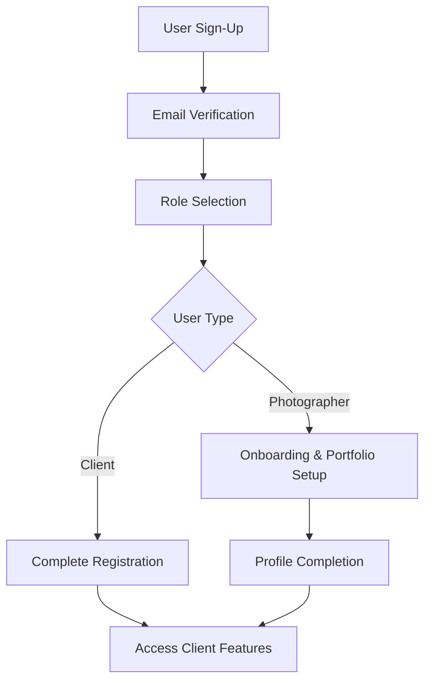
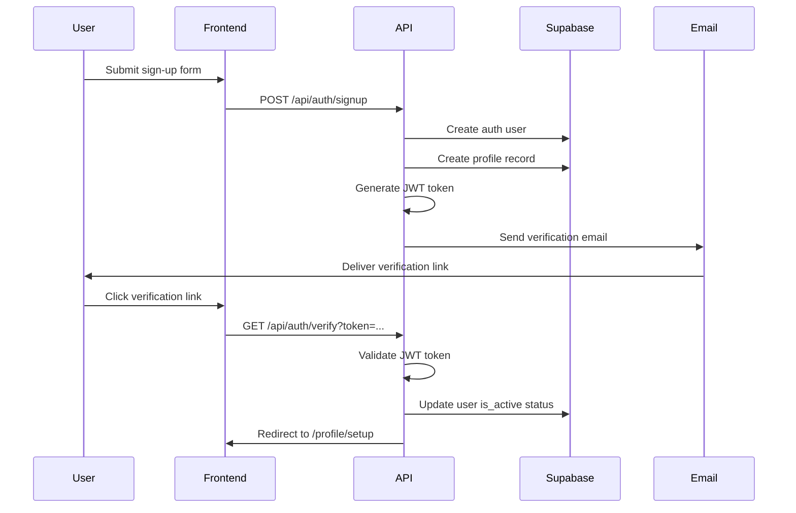
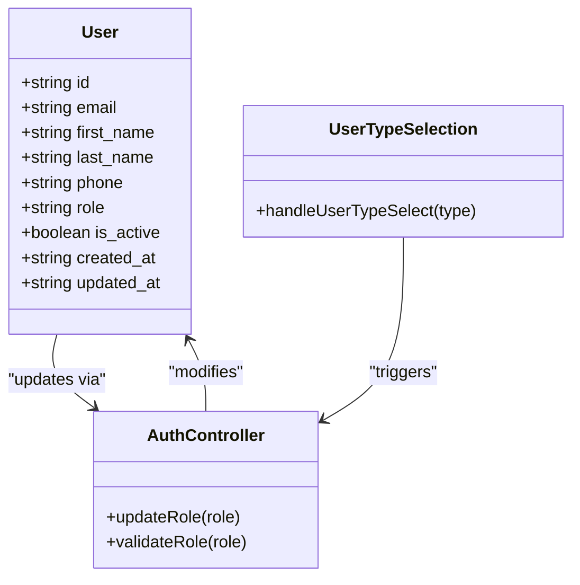

# Authentication System

<cite>
**Referenced Files in This Document**   
- [signin.ts](file://pages/api/auth/signin.ts)
- [signout.ts](file://pages/api/auth/signout.ts)
- [signup.ts](file://pages/api/auth/signup.ts)
- [update-role.ts](file://pages/api/auth/update-role.ts)
- [verify.ts](file://pages/api/auth/verify.ts)
- [supabase.ts](file://src/lib/supabase.ts)
- [auth.ts](file://src/middleware/auth.ts)
- [mailer.ts](file://src/utils/mailer.ts)
- [email-verify.tsx](file://pages/auth/email-verify.tsx)
- [setup.tsx](file://pages/profile/setup.tsx)
- [GeneralizedSignupFlow.tsx](file://src/components/GeneralizedSignupFlow.tsx)
- [UserTypeSelection.tsx](file://src/components/UserTypeSelection.tsx)
</cite>

## Table of Contents
1. [Introduction](#introduction)
2. [Authentication Flow Overview](#authentication-flow-overview)
3. [Sign-Up Process](#sign-up-process)
4. [Email Verification Workflow](#email-verification-workflow)
5. [Sign-In and Session Management](#sign-in-and-session-management)
6. [Role-Based Access Control](#role-based-access-control)
7. [JWT Token Handling and Protected Routes](#jwt-token-handling-and-protected-routes)
8. [Sign-Out Mechanism](#sign-out-mechanism)
9. [Client-Side Authentication Usage](#client-side-authentication-usage)
10. [Common Issues and Troubleshooting](#common-issues-and-troubleshooting)

## Introduction
The SnapEvent authentication system is built on Supabase Auth, providing a secure and scalable solution for user management. The system supports sign-up, sign-in, email verification, and role-based access control for two primary user types: clients and photographers. This document details the implementation of the authentication flow, including JWT token handling, session persistence, and protected route patterns.

**Section sources**
- [supabase.ts](file://src/lib/supabase.ts#L1-L242)

## Authentication Flow Overview
The authentication system follows a multi-step process from user registration to role assignment. New users begin with sign-up, receive an email verification link, and proceed through a role selection flow. Upon successful verification, users are directed to profile setup where photographers can build their portfolios. The system uses Supabase for authentication and maintains user profiles in a custom database table.

**Diagram sources**
- [signup.ts](file://pages/api/auth/signup.ts#L1-L80)
- [verify.ts](file://pages/api/auth/verify.ts#L1-L65)
- [GeneralizedSignupFlow.tsx](file://src/components/GeneralizedSignupFlow.tsx#L1-L192)

## Sign-Up Process
The sign-up process begins with user registration through the `/api/auth/signup` endpoint. Users provide email, password, name, phone, and optionally a role (defaulting to CLIENT). Supabase Auth creates the user account with email verification enabled, while the system simultaneously creates a corresponding record in the custom users table with the provided profile data.

If user creation fails in the database, the system performs cleanup by removing the auth user to maintain data consistency. The response informs users to check their email for verification instructions.

**Section sources**
- [signup.ts](file://pages/api/auth/signup.ts#L1-L80)
- [GeneralizedSignupFlow.tsx](file://src/components/GeneralizedSignupFlow.tsx#L1-L192)

## Email Verification Workflow
The email verification system uses JWT tokens to validate user emails securely. When a user signs up, the system generates a time-limited token (30 minutes TTL) containing the user's email. This token is embedded in a verification URL sent via email using Gmail SMTP through Nodemailer.

Clicking the verification link directs users to `/auth/email-verify`, which calls the `/api/auth/verify` endpoint with the token. The server validates the JWT, updates the user's `is_active` status in the database, and redirects to the profile setup page. This ensures only verified users can access profile creation features.

**Diagram sources**
- [verify.ts](file://pages/api/auth/verify.ts#L1-L65)
- [mailer.ts](file://src/utils/mailer.ts#L1-L39)
- [email-verify.tsx](file://pages/auth/email-verify.tsx#L1-L34)

## Sign-In and Session Management
The sign-in process is handled by the `/api/auth/signin` endpoint, which validates user credentials against Supabase Auth. Upon successful authentication, the system retrieves the user's profile from the custom users table and returns both user information and the Supabase session. The client-side Supabase library automatically manages session persistence using browser storage.

Supabase's session management includes automatic token refresh, persistent sessions across browser restarts, and session detection from URL parameters (for email link authentication flows). The system is configured with `autoRefreshToken: true` and `persistSession: true` to ensure seamless user experience.

**Section sources**
- [signin.ts](file://pages/api/auth/signin.ts#L1-L79)
- [supabase.ts](file://src/lib/supabase.ts#L1-L242)

## Role-Based Access Control
The system implements role-based access control with two primary roles: CLIENT and PHOTOGRAPHER. Users can update their role through the `/api/auth/update-role` endpoint after authentication. The system validates that the requested role is one of the allowed values before updating the user's role in the database.

Role assignment occurs during the post-sign-up flow where users select their user type. The `GeneralizedSignupFlow` component calls the update-role API after user selection, ensuring the role is properly recorded in the database. Administrators can also modify roles as needed.

**Diagram sources**
- [update-role.ts](file://pages/api/auth/update-role.ts#L1-L49)
- [UserTypeSelection.tsx](file://src/components/UserTypeSelection.tsx#L1-L188)
- [GeneralizedSignupFlow.tsx](file://src/components/GeneralizedSignupFlow.tsx#L1-L192)

## JWT Token Handling and Protected Routes
The system uses Supabase's JWT-based authentication for securing API routes. The `withAuth` middleware in `auth.ts` intercepts requests to protected endpoints, extracting the Bearer token from the Authorization header and validating it with Supabase. Upon successful validation, the middleware enriches the request with user profile data from the custom users table.

For role-specific access, the system provides `withRole` and `withRoles` middleware functions that extend the authentication middleware with role-based authorization. These middleware functions ensure users have the required permissions before accessing protected resources.

**Section sources**
- [auth.ts](file://src/middleware/auth.ts#L1-L96)
- [supabase.ts](file://src/lib/supabase.ts#L1-L242)

## Sign-Out Mechanism
The sign-out process is implemented through the `/api/auth/signout` endpoint, which calls Supabase's `signOut` method to invalidate the user's session. The client-side application calls this endpoint when users initiate sign-out, clearing the authentication state and redirecting to the appropriate page.

The sign-out process is straightforward and does not require additional parameters. Upon successful sign-out, the server returns a confirmation message, and the client-side Supabase library automatically clears the stored session data.

**Section sources**
- [signout.ts](file://pages/api/auth/signout.ts#L1-L28)

## Client-Side Authentication Usage
The client-side authentication flow is managed through the `GeneralizedSignupFlow` component, which orchestrates the multi-step registration process. After sign-up, users proceed to `UserTypeSelection` where they choose between client and photographer roles. The flow uses React state management to track progress through signup, role selection, and onboarding steps.

The `supabase` client from `supabase.ts` is used throughout the application for authentication operations. The library is configured with automatic session persistence and token refresh, reducing the need for manual token management in the client code.

**Section sources**
- [GeneralizedSignupFlow.tsx](file://src/components/GeneralizedSignupFlow.tsx#L1-L192)
- [UserTypeSelection.tsx](file://src/components/UserTypeSelection.tsx#L1-L188)
- [supabase.ts](file://src/lib/supabase.ts#L1-L242)

## Common Issues and Troubleshooting
Common authentication issues include token expiration, email verification link expiration, and role update failures. The system addresses token expiration through Supabase's automatic refresh mechanism, which silently obtains new tokens before expiration.

Email verification links expire after 30 minutes, requiring users to request a new verification email if the link has expired. The system should provide clear error messages to guide users through re-sending verification emails.

Role update failures typically occur due to invalid role values or authentication issues. The API validates role inputs and requires authentication before processing updates, returning appropriate error codes (400 for invalid roles, 401 for unauthenticated requests).

For debugging authentication issues, developers should check server logs for error messages, verify environment variables (Supabase URL and keys), and ensure email credentials are properly configured for the mailer service.

**Section sources**
- [signin.ts](file://pages/api/auth/signin.ts#L1-L79)
- [signup.ts](file://pages/api/auth/signup.ts#L1-L80)
- [update-role.ts](file://pages/api/auth/update-role.ts#L1-L49)
- [verify.ts](file://pages/api/auth/verify.ts#L1-L65)
- [mailer.ts](file://src/utils/mailer.ts#L1-L39)