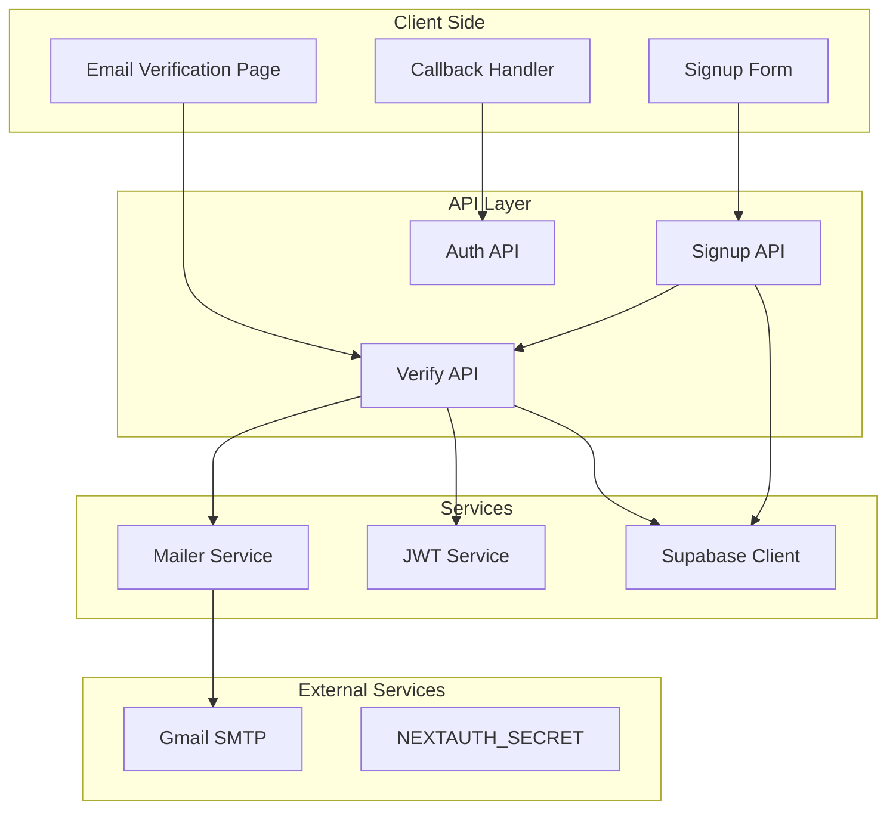
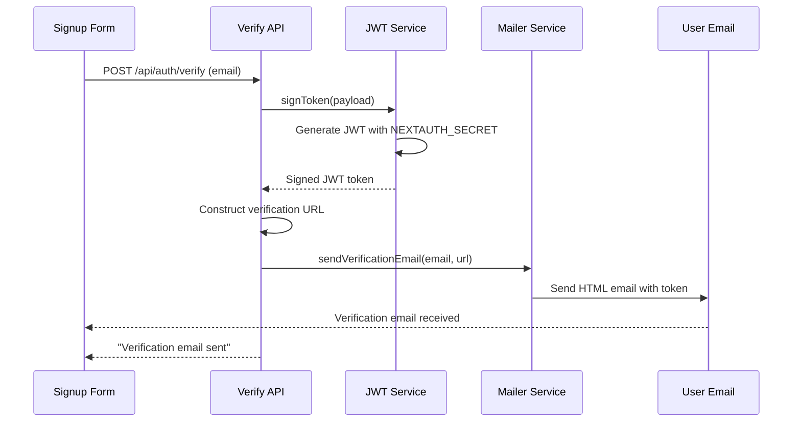
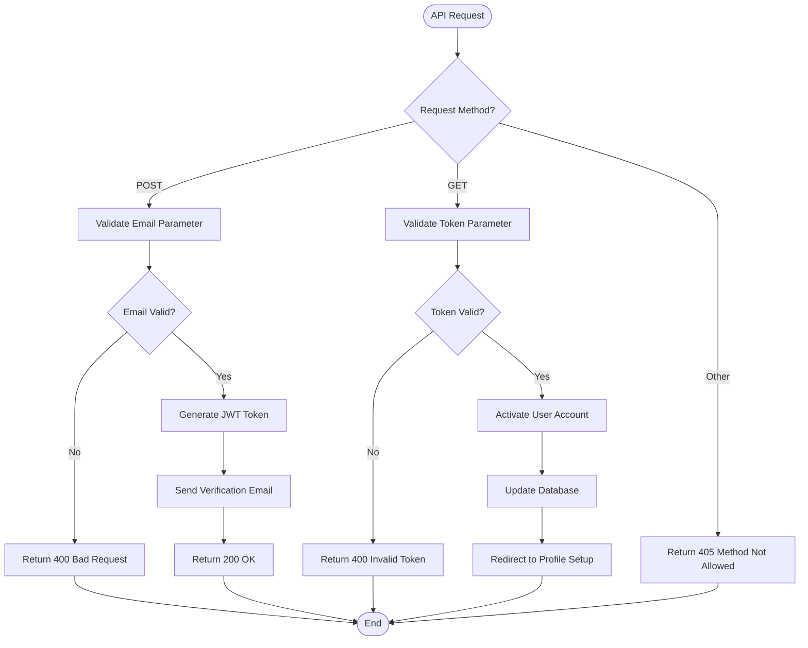
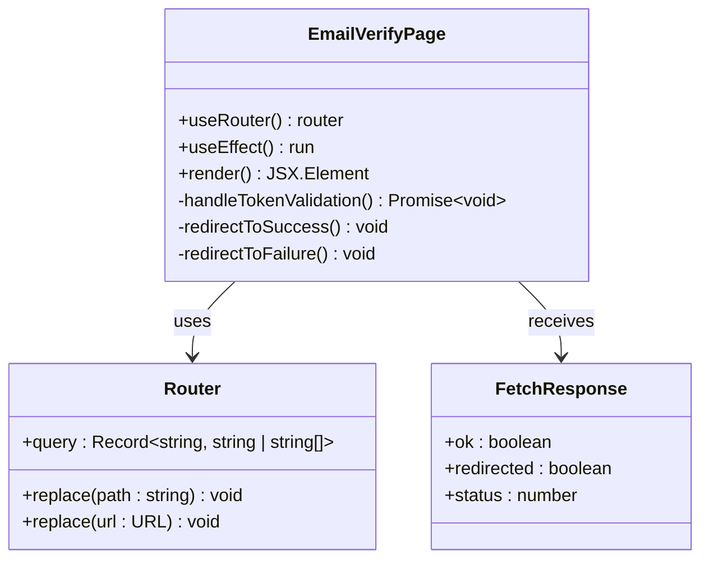
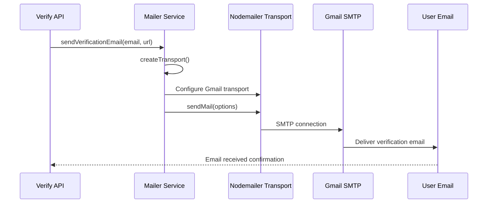
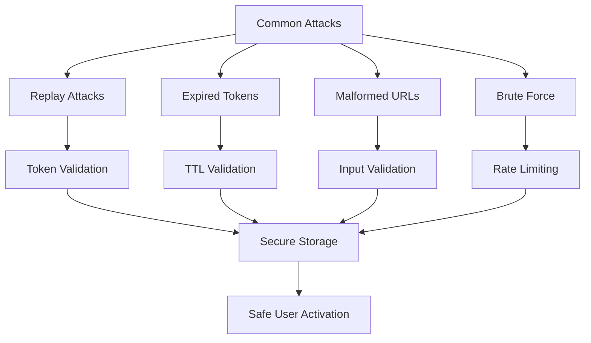
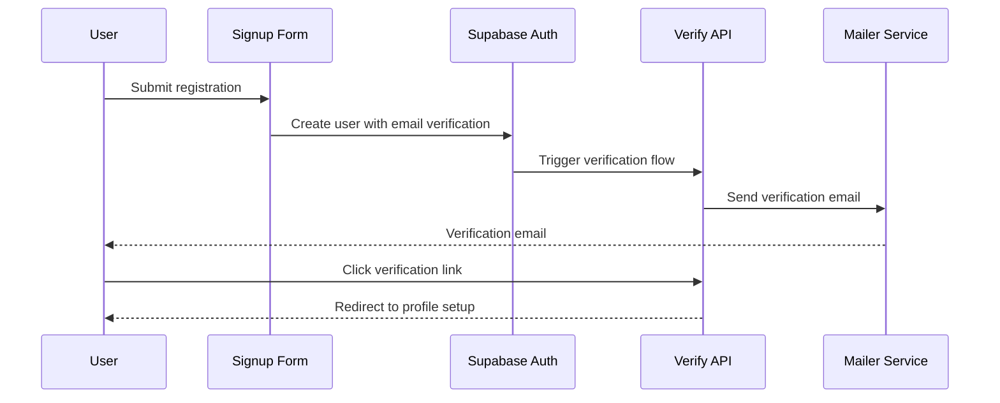

# Email Verification Workflow

<cite>
**Referenced Files in This Document**
- [pages/api/auth/verify.ts](file://pages/api/auth/verify.ts)
- [pages/auth/email-verify.tsx](file://pages/auth/email-verify.tsx)
- [src/utils/mailer.ts](file://src/utils/mailer.ts)
- [pages/api/auth/signup.ts](file://pages/api/auth/signup.ts)
- [src/lib/supabase.ts](file://src/lib/supabase.ts)
- [src/lib/supabase-server.ts](file://src/lib/supabase-server.ts)
- [src/middleware/validation.ts](file://src/middleware/validation.ts)
- [package.json](file://package.json)
</cite>

## Table of Contents
1. [Introduction](#introduction)
2. [System Architecture](#system-architecture)
3. [Token-Based Verification System](#token-based-verification-system)
4. [API Endpoint Implementation](#api-endpoint-implementation)
5. [Client-Side Verification Handler](#client-side-verification-handler)
6. [Email Delivery Mechanism](#email-delivery-mechanism)
7. [Security Considerations](#security-considerations)
8. [Common Issues and Solutions](#common-issues-and-solutions)
9. [Integration Patterns](#integration-patterns)
10. [Best Practices](#best-practices)

## Introduction

The SnapEvent platform implements a robust email verification workflow using JWT tokens for secure user account activation. This system ensures that new users can only access their accounts after verifying their email addresses, enhancing security and preventing unauthorized access. The verification process involves token generation, email delivery, client-side validation, and automatic user activation upon successful verification.

The email verification system consists of several interconnected components:
- Token-based JWT generation and validation using NEXTAUTH_SECRET
- API endpoints for verification requests and token validation
- Client-side React components for handling verification flows
- Email delivery service using Nodemailer with Gmail transport
- Database integration for user status updates

## System Architecture

The email verification workflow follows a client-server architecture with clear separation of concerns:



**Diagram sources**
- [pages/api/auth/signup.ts](file://pages/api/auth/signup.ts#L1-L80)
- [pages/api/auth/verify.ts](file://pages/api/auth/verify.ts#L1-L65)
- [pages/auth/email-verify.tsx](file://pages/auth/email-verify.tsx#L1-L34)

## Token-Based Verification System

The email verification system relies on JSON Web Tokens (JWT) for secure token generation and validation. The system uses the NEXTAUTH_SECRET environment variable as the cryptographic key for signing and verifying tokens.

### Token Generation Process



**Diagram sources**
- [pages/api/auth/verify.ts](file://pages/api/auth/verify.ts#L18-L35)
- [src/utils/mailer.ts](file://src/utils/mailer.ts#L15-L38)

### Token Structure and Properties

The JWT tokens generated for email verification contain the following structure:

```typescript
interface VerificationTokenPayload {
  email: string;
  iat: number;           // Issued at timestamp
  exp: number;           // Expiration timestamp
}
```

The tokens have the following characteristics:
- **Time-to-Live (TTL)**: 30 minutes (configurable via TOKEN_TTL_MINUTES constant)
- **Secret Key**: NEXTAUTH_SECRET environment variable
- **Algorithm**: HS256 (default for jsonwebtoken library)
- **Payload**: Contains only the user's email address for minimal data exposure

**Section sources**
- [pages/api/auth/verify.ts](file://pages/api/auth/verify.ts#L5-L15)

## API Endpoint Implementation

The `/api/auth/verify` endpoint serves dual purposes: generating verification tokens and validating them during the verification process.

### POST Request Handler

The POST handler generates verification tokens and sends them via email:

```typescript
// Token generation and email sending logic
const token = signToken({ email })
const baseUrl = process.env.NEXT_PUBLIC_APP_URL || 'http://localhost:3000'
const verifyUrl = `${baseUrl}/auth/email-verify?token=${token}`
await sendVerificationEmail(email, verifyUrl)
```

### GET Request Handler

The GET handler validates tokens and activates user accounts:

```typescript
// Token validation and user activation
try {
  const payload = verifyToken(token)
  const email = payload.email as string
  
  // Activate user account
  await supabase
    .from('users')
    .update({ is_active: true })
    .eq('email', email)
  
  // Redirect to profile setup
  const redirect = encodeURI((process.env.NEXT_PUBLIC_APP_URL || 'http://localhost:3000') + '/profile/setup')
  res.writeHead(302, { Location: redirect })
  res.end()
} catch (e) {
  return res.status(400).send('Verification link invalid or expired')
}
```

### Error Handling and Validation

The API endpoint implements comprehensive error handling:



**Diagram sources**
- [pages/api/auth/verify.ts](file://pages/api/auth/verify.ts#L16-L65)

**Section sources**
- [pages/api/auth/verify.ts](file://pages/api/auth/verify.ts#L1-L65)

## Client-Side Verification Handler

The client-side verification component handles the user experience during email verification:

### Component Architecture



**Diagram sources**
- [pages/auth/email-verify.tsx](file://pages/auth/email-verify.tsx#L1-L34)

### Verification Flow

The client-side verification follows this sequence:

```typescript
// Extract token from URL query parameters
const token = router.query.token

// Validate token presence and type
if (!token || typeof token !== 'string') return

// Make API call to validate token
const res = await fetch(`/api/auth/verify?token=${encodeURIComponent(token)}`)

// Handle response based on status
if (res.ok) {
  router.replace('/profile/setup')  // Success: redirect to profile setup
} else {
  router.replace('/auth/signin?error=verify')  // Failure: redirect to signin
}
```

### Loading State Management

The component displays a loading indicator while verification occurs:

```jsx
return (
  <div style={{ display:'flex', alignItems:'center', justifyContent:'center', height:'100vh' }}>
    <p>Verifying your email...</p>
  </div>
)
```

**Section sources**
- [pages/auth/email-verify.tsx](file://pages/auth/email-verify.tsx#L1-L34)

## Email Delivery Mechanism

The email verification system uses Nodemailer with Gmail SMTP for reliable email delivery.

### Transport Configuration

```typescript
export function createTransport() {
  const user = process.env.EMAIL_USER
  const pass = process.env.EMAIL_PASS

  if (!user || !pass) {
    throw new Error('EMAIL_USER or EMAIL_PASS is not set')
  }

  return nodemailer.createTransport({
    service: 'gmail',
    auth: { user, pass },
  })
}
```

### Email Template Structure

The verification email template includes:

```html
<div style="font-family:Inter,system-ui,-apple-system,Segoe UI,Roboto,Helvetica,Arial,sans-serif;max-width:560px;margin:0 auto;padding:24px">
  <h2 style="margin:0 0 16px">Verify your email</h2>
  <p style="margin:0 0 16px">Click the button below to verify your email and continue setting up your SnapEvent profile.</p>
  <p style="margin:24px 0">
    <a href="${verifyUrl}" style="background:#111827;color:#fff;border-radius:8px;padding:12px 16px;text-decoration:none;display:inline-block">
      Verify Email
    </a>
  </p>
  <p style="color:#6b7280;margin:16px 0">Or copy and paste this link into your browser:<br/>${verifyUrl}</p>
  <p style="color:#9ca3af;margin-top:24px;font-size:12px">If you did not request this, you can ignore this email.</p>
</div>
```

### Email Sending Process



**Diagram sources**
- [src/utils/mailer.ts](file://src/utils/mailer.ts#L15-L38)

**Section sources**
- [src/utils/mailer.ts](file://src/utils/mailer.ts#L1-L39)

## Security Considerations

The email verification system implements several security measures to protect against common threats:

### Token Security Features

1. **Short TTL**: Tokens expire after 30 minutes to limit window of opportunity for attackers
2. **Environment Secret**: Uses NEXTAUTH_SECRET for cryptographic signing
3. **Minimal Payload**: Only contains email address, reducing data exposure
4. **HTTPS Requirement**: Requires secure connections for token transmission

### Protection Against Common Attacks



### Implementation Details

**Token Expiration Handling**:
```typescript
// Token validation catches expired tokens
try {
  const payload = verifyToken(token)
  // Token is valid and not expired
} catch (e) {
  // Handle expired or invalid tokens
  return res.status(400).send('Verification link invalid or expired')
}
```

**Input Validation**:
```typescript
// Validate token parameter presence and type
if (!token || typeof token !== 'string') return res.status(400).send('Invalid token')

// Validate email parameter presence
if (!email) return res.status(400).json({ error: 'email is required' })
```

**Section sources**
- [pages/api/auth/verify.ts](file://pages/api/auth/verify.ts#L37-L65)
- [pages/auth/email-verify.tsx](file://pages/auth/email-verify.tsx#L8-L20)

## Common Issues and Solutions

### Issue 1: Expired Tokens

**Symptoms**: Users receive "Verification link invalid or expired" messages
**Causes**: 
- Token TTL exceeded (30 minutes)
- System clock synchronization issues
- Incorrect NEXTAUTH_SECRET configuration

**Solutions**:
```typescript
// Increase token TTL if needed
const TOKEN_TTL_MINUTES = 60  // From 30 to 60 minutes

// Ensure consistent NEXTAUTH_SECRET across all environments
const secret = process.env.NEXTAUTH_SECRET || 'dev-secret'
```

### Issue 2: Malformed URLs

**Symptoms**: Users encounter "Invalid token" errors despite clicking valid links
**Causes**:
- URL encoding issues
- Extra whitespace in tokens
- Browser caching problems

**Solutions**:
```typescript
// Proper URL encoding in client-side code
const verifyUrl = `${baseUrl}/auth/email-verify?token=${encodeURIComponent(token)}`

// Token extraction with validation
const token = router.query.token
if (!token || typeof token !== 'string') return
```

### Issue 3: Email Delivery Failures

**Symptoms**: Users don't receive verification emails
**Causes**:
- Incorrect email credentials
- Gmail SMTP restrictions
- Network connectivity issues

**Solutions**:
```typescript
// Add comprehensive error handling
try {
  const { sendVerificationEmail } = await import('../../../src/utils/mailer')
  await sendVerificationEmail(email, verifyUrl)
  return res.status(200).json({ message: 'Verification email sent' })
} catch (e: any) {
  console.error('Email delivery failed:', e)
  return res.status(500).json({ error: e.message || 'Failed to send email' })
}
```

### Issue 4: Redirect Loop Problems

**Symptoms**: Users stuck in infinite redirect loops
**Causes**:
- Incorrect redirect URL construction
- Session persistence issues
- Middleware conflicts

**Solutions**:
```typescript
// Proper redirect construction with encoding
const redirect = encodeURI((process.env.NEXT_PUBLIC_APP_URL || 'http://localhost:3000') + '/profile/setup')

// Check for existing session before redirect
if (!res.headersSent) {
  res.writeHead(302, { Location: redirect })
  res.end()
}
```

## Integration Patterns

### Signup Integration

The email verification system integrates seamlessly with the signup process:



**Diagram sources**
- [pages/api/auth/signup.ts](file://pages/api/auth/signup.ts#L10-L40)
- [pages/api/auth/verify.ts](file://pages/api/auth/verify.ts#L18-L35)

### Database Integration

The system maintains user state through the Supabase database:

```typescript
// User creation during signup
const { data: userData, error: userError } = await supabase
  .from('users')
  .insert({
    id: authData.user.id,
    email,
    first_name: firstName,
    last_name: lastName,
    phone: phone,
    role: role.toUpperCase(),
    is_active: false  // Initially inactive until verified
  })

// User activation during verification
await supabase
  .from('users')
  .update({ is_active: true })
  .eq('email', email)
```

**Section sources**
- [pages/api/auth/signup.ts](file://pages/api/auth/signup.ts#L35-L50)
- [pages/api/auth/verify.ts](file://pages/api/auth/verify.ts#L45-L50)

## Best Practices

### Environment Configuration

1. **NEXTAUTH_SECRET**: Use strong, randomly generated secrets
2. **Email Credentials**: Store email credentials securely using environment variables
3. **URL Configuration**: Set appropriate NEXT_PUBLIC_APP_URL for production

### Error Handling

1. **Graceful Degradation**: Provide fallback mechanisms for email failures
2. **User Feedback**: Clear error messages for different failure scenarios
3. **Logging**: Comprehensive logging for debugging and monitoring

### Performance Optimization

1. **Asynchronous Operations**: Use async/await for non-blocking operations
2. **Connection Pooling**: Reuse SMTP connections when possible
3. **Caching**: Cache frequently accessed user data

### Testing Strategies

1. **Unit Tests**: Test token generation and validation logic
2. **Integration Tests**: Test complete verification workflows
3. **End-to-End Tests**: Simulate real user verification flows

### Monitoring and Maintenance

1. **Health Checks**: Monitor email delivery service availability
2. **Metrics Collection**: Track verification success rates
3. **Alerting**: Set up alerts for verification system failures

The email verification workflow in SnapEvent demonstrates a well-architected solution that balances security, usability, and reliability. By following the patterns and practices outlined in this documentation, developers can maintain and extend the verification system effectively while ensuring optimal user experience and security posture.