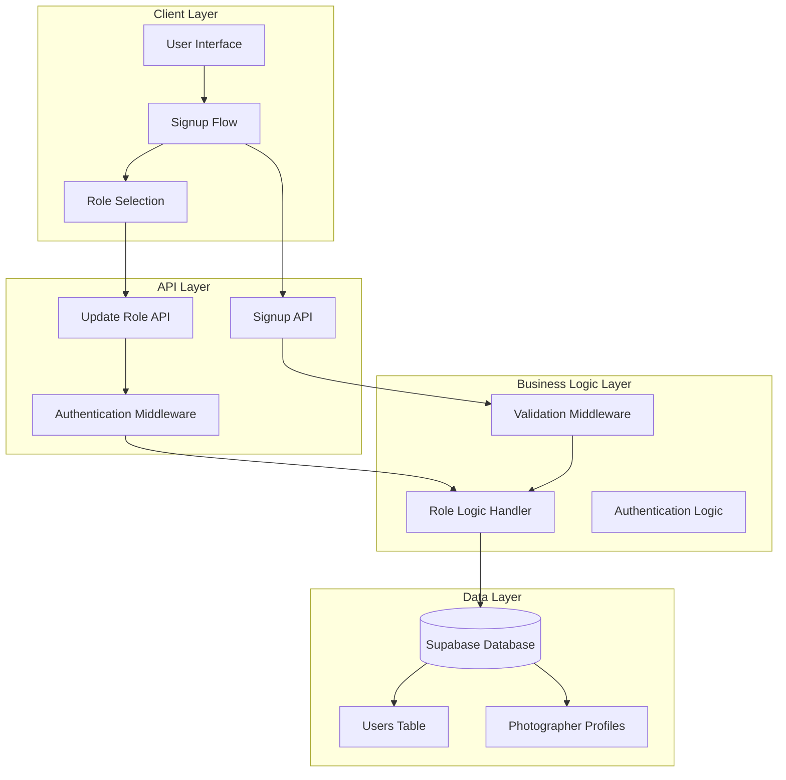
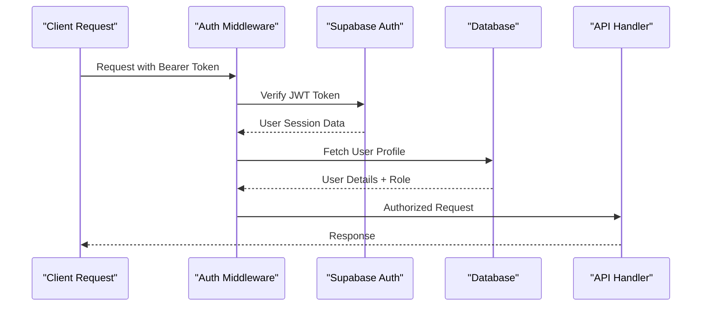
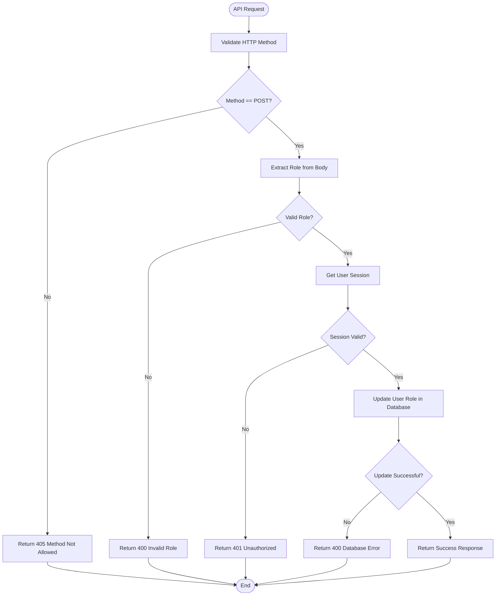
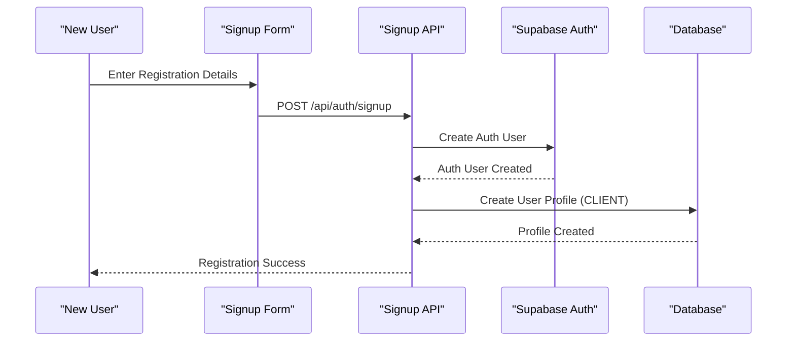
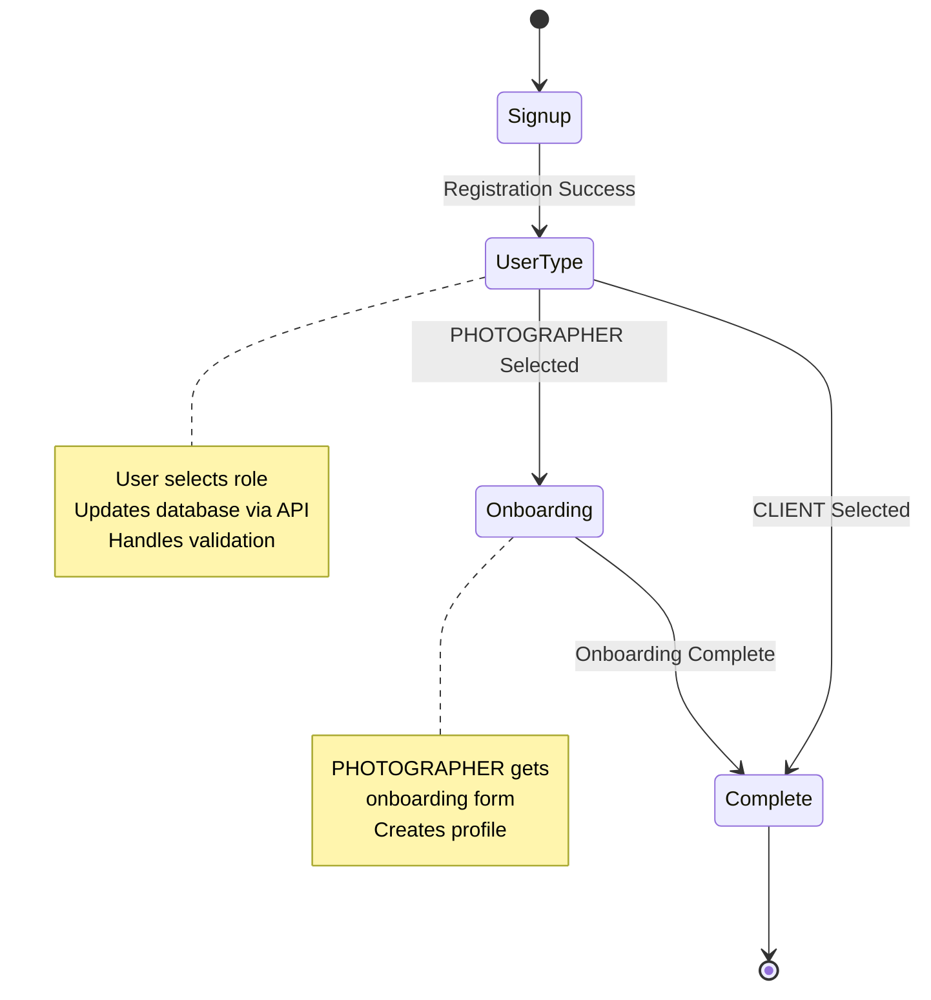

# Role Management System

<cite>
**Referenced Files in This Document**
- [pages/api/auth/update-role.ts](file://pages/api/auth/update-role.ts)
- [src/components/GeneralizedSignupFlow.tsx](file://src/components/GeneralizedSignupFlow.tsx)
- [src/components/UserTypeSelection.tsx](file://src/components/UserTypeSelection.tsx)
- [src/components/SignupForm.tsx](file://src/components/SignupForm.tsx)
- [src/components/OnboardingForm.tsx](file://src/components/OnboardingForm.tsx)
- [src/middleware/auth.ts](file://src/middleware/auth.ts)
- [src/middleware/validation.ts](file://src/middleware/validation.ts)
- [src/lib/supabase.ts](file://src/lib/supabase.ts)
- [pages/api/auth/signup.ts](file://pages/api/auth/signup.ts)
- [src/pages.tsx](file://src/pages.tsx)
</cite>

## Table of Contents
1. [Introduction](#introduction)
2. [System Architecture](#system-architecture)
3. [Role-Based Access Control Implementation](#role-based-access-control-implementation)
4. [Update Role API Endpoint](#update-role-api-endpoint)
5. [User Registration and Role Assignment](#user-registration-and-role-assignment)
6. [Role Selection Workflow](#role-selection-workflow)
7. [Security Considerations](#security-considerations)
8. [Common Issues and Solutions](#common-issues-and-solutions)
9. [Performance and Scalability](#performance-and-scalability)
10. [Troubleshooting Guide](#troubleshooting-guide)

## Introduction

The SnapEvent role management system implements a sophisticated Role-Based Access Control (RBAC) mechanism that distinguishes between two primary user roles: CLIENT and PHOTOGRAPHER. This system ensures secure, role-appropriate access to platform features while maintaining data integrity and user experience consistency.

The role management architecture consists of multiple interconnected components: a centralized API endpoint for role updates, a comprehensive signup flow with role selection, middleware-based authentication and authorization, and a robust validation system that protects against unauthorized role changes and maintains system security.

## System Architecture

The role management system follows a layered architecture with clear separation of concerns:



**Diagram sources**
- [pages/api/auth/update-role.ts](file://pages/api/auth/update-role.ts#L1-L49)
- [src/middleware/auth.ts](file://src/middleware/auth.ts#L1-L96)
- [src/middleware/validation.ts](file://src/middleware/validation.ts#L1-L161)

## Role-Based Access Control Implementation

The RBAC system is built around three core roles: CLIENT, PHOTOGRAPHER, and ADMIN. The system implements role-based authorization through middleware decorators that protect endpoints and enforce access controls.

### Role Definition and Validation

The system defines roles as string constants with strict validation:

```typescript
// Role validation in update-role.ts
if (!role || !['CLIENT', 'PHOTOGRAPHER'].includes(role)) {
  return res.status(400).json({ error: 'Invalid role. Must be CLIENT or PHOTOGRAPHER' })
}
```

### Authentication Middleware

The authentication middleware provides comprehensive session validation and user profile retrieval:



**Diagram sources**
- [src/middleware/auth.ts](file://src/middleware/auth.ts#L12-L50)

### Authorization Decorators

The system provides specialized middleware decorators for role-based access control:

```typescript
// Single role authorization
export function withRole(requiredRole: string) {
  return function(handler: (req: AuthenticatedRequest, res: NextApiResponse) => Promise<void>) {
    return withAuth(async (req: AuthenticatedRequest, res: NextApiResponse) => {
      if (!req.user) {
        return res.status(401).json({ error: 'User not authenticated' })
      }
      
      if (req.user.role !== requiredRole && req.user.role !== 'ADMIN') {
        return res.status(403).json({ error: 'Insufficient permissions' })
      }
      
      return handler(req, res)
    })
  }
}
```

**Section sources**
- [src/middleware/auth.ts](file://src/middleware/auth.ts#L52-L65)
- [src/middleware/auth.ts](file://src/middleware/auth.ts#L67-L82)

## Update Role API Endpoint

The `/api/auth/update-role` endpoint serves as the central mechanism for changing user roles after initial registration. This endpoint implements comprehensive validation, authentication, and error handling.

### Endpoint Implementation



**Diagram sources**
- [pages/api/auth/update-role.ts](file://pages/api/auth/update-role.ts#L5-L48)

### Request and Response Structure

The endpoint expects a POST request with the following structure:

**Request Body:**
```json
{
  "role": "CLIENT" | "PHOTOGRAPHER"
}
```

**Successful Response:**
```json
{
  "message": "User role updated successfully",
  "user": {
    "id": "user-id",
    "email": "user@example.com",
    "role": "PHOTOGRAPHER"
  }
}
```

### Error Handling

The endpoint implements comprehensive error handling for various failure scenarios:

1. **Method Not Allowed**: Returns 405 for non-POST requests
2. **Invalid Role**: Returns 400 for unsupported role values
3. **Authentication Failure**: Returns 401 for invalid or missing sessions
4. **Database Errors**: Returns 400 for database operation failures
5. **Internal Server Error**: Returns 500 for unexpected exceptions

**Section sources**
- [pages/api/auth/update-role.ts](file://pages/api/auth/update-role.ts#L1-L49)

## User Registration and Role Assignment

The registration process integrates role assignment seamlessly, ensuring that users receive appropriate roles based on their initial selection while maintaining system security and data consistency.

### Initial Registration Flow



**Diagram sources**
- [pages/api/auth/signup.ts](file://pages/api/auth/signup.ts#L6-L45)
- [src/components/SignupForm.tsx](file://src/components/SignupForm.tsx#L70-L95)

### Role Assignment During Signup

During the initial registration process, users are automatically assigned the CLIENT role:

```typescript
// Default role assignment in signup
const { data: userData, error: userError } = await supabase
  .from('users')
  .insert({
    id: authData.user.id,
    email,
    first_name: firstName,
    last_name: lastName,
    phone: phone,
    role: role.toUpperCase() // Default: 'CLIENT'
  })
```

### Role Update After Registration

After successful registration, users proceed to the role selection phase where they can change their role to PHOTOGRAPHER:

```typescript
// Role update in GeneralizedSignupFlow
const handleUserTypeSelect = async (selectedUserType: 'CLIENT' | 'PHOTOGRAPHER') => {
  setUserType(selectedUserType);
  
  try {
    const response = await fetch('/api/auth/update-role', {
      method: 'POST',
      headers: {
        'Content-Type': 'application/json',
      },
      body: JSON.stringify({
        role: selectedUserType
      }),
    });

    if (!response.ok) {
      throw new Error('Failed to update user role');
    }
    
    // Proceed based on role selection
    if (selectedUserType === 'PHOTOGRAPHER') {
      setCurrentStep('onboarding');
    } else {
      setCurrentStep('complete');
      onComplete(selectedUserType);
    }
  } catch (error) {
    // Graceful fallback if role update fails
    if (selectedUserType === 'PHOTOGRAPHER') {
      setCurrentStep('onboarding');
    } else {
      setCurrentStep('complete');
      onComplete(selectedUserType);
    }
  }
};
```

**Section sources**
- [pages/api/auth/signup.ts](file://pages/api/auth/signup.ts#L35-L45)
- [src/components/GeneralizedSignupFlow.tsx](file://src/components/GeneralizedSignupFlow.tsx#L30-L60)

## Role Selection Workflow

The role selection workflow provides a seamless user experience for choosing between CLIENT and PHOTOGRAPHER roles after initial registration. This process involves multiple components working together to ensure proper role assignment and navigation.

### Generalized Signup Flow Architecture



**Diagram sources**
- [src/components/GeneralizedSignupFlow.tsx](file://src/components/GeneralizedSignupFlow.tsx#L15-L192)

### User Type Selection Component

The UserTypeSelection component presents users with clear choices and intuitive interfaces:

```typescript
// Role selection interface
interface UserTypeSelectionProps {
  onUserTypeSelect: (userType: 'CLIENT' | 'PHOTOGRAPHER') => void;
  onBack: () => void;
}

// Role validation and selection
const handleUserTypeSelect = async (selectedUserType: 'CLIENT' | 'PHOTOGRAPHER') => {
  setUserType(selectedUserType);
  
  try {
    const response = await fetch('/api/auth/update-role', {
      method: 'POST',
      headers: {
        'Content-Type': 'application/json',
      },
      body: JSON.stringify({
        role: selectedUserType
      }),
    });

    if (!response.ok) {
      throw new Error('Failed to update user role');
    }

    if (selectedUserType === 'PHOTOGRAPHER') {
      setCurrentStep('onboarding');
    } else {
      setCurrentStep('complete');
      onComplete(selectedUserType);
    }
  } catch (error) {
    // Graceful fallback continues flow
    if (selectedUserType === 'PHOTOGRAPHER') {
      setCurrentStep('onboarding');
    } else {
      setCurrentStep('complete');
      onComplete(selectedUserType);
    }
  }
};
```

### Navigation Logic Based on Role

The system implements intelligent navigation logic that directs users to appropriate post-registration flows:

1. **CLIENT Role**: Directs to completion screen with immediate access to booking features
2. **PHOTOGRAPHER Role**: Triggers onboarding process for profile creation and portfolio setup

```typescript
// Navigation logic implementation
const handleUserTypeSelect = async (selectedUserType: 'CLIENT' | 'PHOTOGRAPHER') => {
  setUserType(selectedUserType);
  
  try {
    // Update role in database
    const response = await fetch('/api/auth/update-role', {
      method: 'POST',
      headers: {
        'Content-Type': 'application/json',
      },
      body: JSON.stringify({
        role: selectedUserType
      }),
    });

    // Handle navigation based on role
    if (selectedUserType === 'PHOTOGRAPHER') {
      setCurrentStep('onboarding'); // Trigger photographer onboarding
    } else {
      setCurrentStep('complete');   // Complete CLIENT flow
      onComplete(selectedUserType);
    }
  } catch (error) {
    // Graceful fallback continues flow
    if (selectedUserType === 'PHOTOGRAPHER') {
      setCurrentStep('onboarding');
    } else {
      setCurrentStep('complete');
      onComplete(selectedUserType);
    }
  }
};
```

**Section sources**
- [src/components/UserTypeSelection.tsx](file://src/components/UserTypeSelection.tsx#L10-L25)
- [src/components/GeneralizedSignupFlow.tsx](file://src/components/GeneralizedSignupFlow.tsx#L30-L60)

## Security Considerations

The role management system implements multiple layers of security to prevent unauthorized role changes, protect against injection attacks, and maintain data integrity.

### Authentication Security

The system employs JWT-based authentication with Supabase:

```typescript
// Secure token validation
const authHeader = req.headers.authorization
if (!authHeader || !authHeader.startsWith('Bearer ')) {
  return res.status(401).json({ error: 'Missing or invalid authorization header' })
}

const token = authHeader.substring(7) // Remove 'Bearer ' prefix

// Verify JWT token with Supabase
const { data: { user }, error } = await supabase.auth.getUser(token)

if (error || !user) {
  return res.status(401).json({ error: 'Invalid or expired token' })
}
```

### Role Validation Security

Strict role validation prevents unauthorized role changes:

```typescript
// Comprehensive role validation
if (!role || !['CLIENT', 'PHOTOGRAPHER'].includes(role)) {
  return res.status(400).json({ error: 'Invalid role. Must be CLIENT or PHOTOGRAPHER' })
}

// Role enforcement in middleware
if (req.user.role !== requiredRole && req.user.role !== 'ADMIN') {
  return res.status(403).json({ error: 'Insufficient permissions' })
}
```

### Race Condition Protection

The system handles potential race conditions gracefully:

```typescript
// Graceful error handling for role updates
try {
  const response = await fetch('/api/auth/update-role', {
    method: 'POST',
    headers: {
      'Content-Type': 'application/json',
    },
    body: JSON.stringify({
      role: selectedUserType
    }),
  });

  if (!response.ok) {
    throw new Error('Failed to update user role');
  }
} catch (error) {
  // Continue flow even if role update fails
  // This prevents blocking legitimate users
  if (selectedUserType === 'PHOTOGRAPHER') {
    setCurrentStep('onboarding');
  } else {
    setCurrentStep('complete');
    onComplete(selectedUserType);
  }
}
```

### Input Sanitization

The validation middleware ensures all inputs are properly sanitized:

```typescript
// Input validation rules
export const commonValidations = {
  email: {
    field: 'email',
    required: true,
    type: 'email' as const
  },
  password: {
    field: 'password',
    required: true,
    type: 'string' as const,
    minLength: 6
  },
  firstName: {
    field: 'firstName',
    required: true,
    type: 'string' as const,
    minLength: 1,
    maxLength: 50
  }
}
```

**Section sources**
- [src/middleware/auth.ts](file://src/middleware/auth.ts#L18-L35)
- [pages/api/auth/update-role.ts](file://pages/api/auth/update-role.ts#L12-L15)
- [src/middleware/validation.ts](file://src/middleware/validation.ts#L130-L160)

## Common Issues and Solutions

### Unauthorized Role Changes

**Problem**: Users attempting to change roles without proper authentication or authorization.

**Solution**: The system implements multiple layers of protection:

```typescript
// Authentication check
if (!authHeader || !authHeader.startsWith('Bearer ')) {
  return res.status(401).json({ error: 'Missing or invalid authorization header' })
}

// Role validation
if (!role || !['CLIENT', 'PHOTOGRAPHER'].includes(role)) {
  return res.status(400).json({ error: 'Invalid role. Must be CLIENT or PHOTOGRAPHER' })
}

// Permission check
if (req.user.role !== requiredRole && req.user.role !== 'ADMIN') {
  return res.status(403).json({ error: 'Insufficient permissions' })
}
```

### Race Conditions Between Authentication and Role Assignment

**Problem**: Timing issues where role updates occur before authentication is fully established.

**Solution**: The system implements graceful fallback mechanisms:

```typescript
// Graceful error handling
try {
  const response = await fetch('/api/auth/update-role', {
    method: 'POST',
    headers: {
      'Content-Type': 'application/json',
    },
    body: JSON.stringify({
      role: selectedUserType
    }),
  });

  if (!response.ok) {
    throw new Error('Failed to update user role');
  }
} catch (error) {
  // Continue flow even if role update fails
  // This prevents blocking legitimate users
  if (selectedUserType === 'PHOTOGRAPHER') {
    setCurrentStep('onboarding');
  } else {
    setCurrentStep('complete');
    onComplete(selectedUserType);
  }
}
```

### Proper Validation of Role Values

**Problem**: Malformed or unexpected role values causing system instability.

**Solution**: Comprehensive validation at multiple levels:

```typescript
// Frontend validation
const handleUserTypeSelect = (selectedUserType: 'CLIENT' | 'PHOTOGRAPHER') => {
  if (!['CLIENT', 'PHOTOGRAPHER'].includes(selectedUserType)) {
    console.error('Invalid role selection:', selectedUserType);
    return;
  }
  // Proceed with role update
};

// Backend validation
if (!role || !['CLIENT', 'PHOTOGRAPHER'].includes(role)) {
  return res.status(400).json({ error: 'Invalid role. Must be CLIENT or PHOTOGRAPHER' })
}
```

### Database Consistency Issues

**Problem**: Role updates failing to propagate consistently across the system.

**Solution**: Atomic operations and transaction-like patterns:

```typescript
// Atomic role update with error handling
const { data: userData, error: userError } = await supabase
  .from('users')
  .update({ role: role })
  .eq('id', session.user.id)
  .select()
  .single();

if (userError) {
  return res.status(400).json({ error: userError.message });
}
```

**Section sources**
- [pages/api/auth/update-role.ts](file://pages/api/auth/update-role.ts#L12-L15)
- [src/components/GeneralizedSignupFlow.tsx](file://src/components/GeneralizedSignupFlow.tsx#L30-L60)
- [pages/api/auth/update-role.ts](file://pages/api/auth/update-role.ts#L25-L35)

## Performance and Scalability

The role management system is designed for optimal performance and scalability through several architectural decisions:

### Database Optimization

The system uses Supabase's optimized database queries with proper indexing:

```typescript
// Efficient database operations
const { data: userProfile, error: profileError } = await supabase
  .from('users')
  .select('*')
  .eq('id', user.id)
  .single()
```

### Caching Strategy

While not explicitly implemented in the current codebase, the system architecture supports caching strategies for frequently accessed role data:

```typescript
// Potential caching layer
const getCachedUserRole = async (userId: string) => {
  const cacheKey = `user:${userId}:role`;
  const cachedRole = await redis.get(cacheKey);
  
  if (cachedRole) {
    return cachedRole;
  }
  
  const { data: user, error } = await supabase
    .from('users')
    .select('role')
    .eq('id', userId)
    .single();
    
  await redis.setex(cacheKey, 300, user.role); // 5-minute cache
  return user.role;
};
```

### Horizontal Scaling Considerations

The system is designed to support horizontal scaling through stateless API design and external database storage:

```typescript
// Stateless API design
export default async function handler(req: NextApiRequest, res: NextApiResponse) {
  // No local state maintained
  // All state stored in Supabase
}
```

## Troubleshooting Guide

### Role Update Failures

**Symptoms**: User role not updating despite successful API calls.

**Diagnosis Steps**:
1. Check authentication token validity
2. Verify database connectivity
3. Review role validation logic
4. Examine error logs

**Resolution**:
```typescript
// Debugging role update
console.log('Updating role:', { userId: session.user.id, role });
const { data: userData, error: userError } = await supabase
  .from('users')
  .update({ role: role })
  .eq('id', session.user.id)
  .select()
  .single();

if (userError) {
  console.error('Database error:', userError);
  return res.status(400).json({ error: userError.message });
}
```

### Authentication Issues

**Symptoms**: Users unable to access protected endpoints.

**Diagnosis Steps**:
1. Verify JWT token format
2. Check token expiration
3. Validate user session
4. Review middleware configuration

**Resolution**:
```typescript
// Authentication debugging
const authHeader = req.headers.authorization;
console.log('Auth header:', authHeader);

if (!authHeader || !authHeader.startsWith('Bearer ')) {
  return res.status(401).json({ error: 'Missing or invalid authorization header' });
}

const token = authHeader.substring(7);
console.log('Extracted token:', token);

const { data: { user }, error } = await supabase.auth.getUser(token);
console.log('User from token:', user);
```

### Role-Based Access Control Problems

**Symptoms**: Users accessing unauthorized resources.

**Diagnosis Steps**:
1. Verify role assignment in database
2. Check middleware implementation
3. Review permission logic
4. Test with different user roles

**Resolution**:
```typescript
// Role-based access debugging
console.log('User role:', req.user?.role);
console.log('Required role:', requiredRole);

if (req.user.role !== requiredRole && req.user.role !== 'ADMIN') {
  console.log('Access denied: insufficient permissions');
  return res.status(403).json({ error: 'Insufficient permissions' });
}
```

**Section sources**
- [pages/api/auth/update-role.ts](file://pages/api/auth/update-role.ts#L25-L35)
- [src/middleware/auth.ts](file://src/middleware/auth.ts#L18-L35)
- [src/middleware/auth.ts](file://src/middleware/auth.ts#L52-L65)