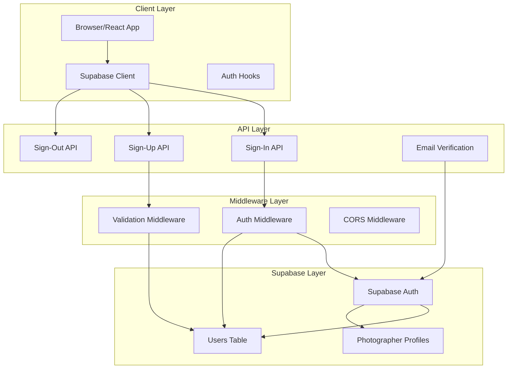
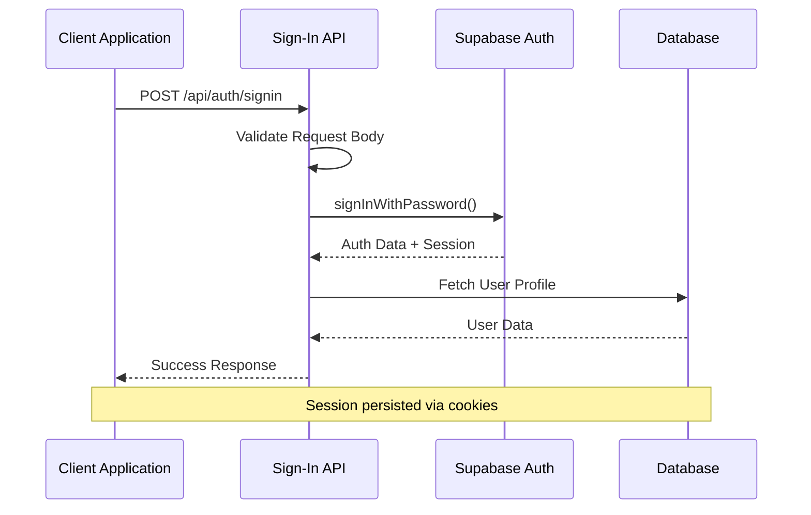

# Sign-In Mechanism Implementation

<cite>
**Referenced Files in This Document**
- [pages/api/auth/signin.ts](file://pages/api/auth/signin.ts)
- [pages/api/auth/signout.ts](file://pages/api/auth/signout.ts)
- [pages/api/auth/signup.ts](file://pages/api/auth/signup.ts)
- [pages/api/auth/verify.ts](file://pages/api/auth/verify.ts)
- [src/lib/supabase.ts](file://src/lib/supabase.ts)
- [src/lib/supabase-server.ts](file://src/lib/supabase-server.ts)
- [src/middleware/auth.ts](file://src/middleware/auth.ts)
- [src/middleware/validation.ts](file://src/middleware/validation.ts)
- [src/utils/mailer.ts](file://src/utils/mailer.ts)
- [pages/auth/email-verify.tsx](file://pages/auth/email-verify.tsx)
- [middleware.ts](file://middleware.ts)
</cite>

## Table of Contents
1. [Introduction](#introduction)
2. [Architecture Overview](#architecture-overview)
3. [Authentication Flow](#authentication-flow)
4. [Sign-In Endpoint Implementation](#sign-in-endpoint-implementation)
5. [Client-Side Authentication](#client-side-authentication)
6. [Auth Middleware Protection](#auth-middleware-protection)
7. [Cross-Origin Request Configuration](#cross-origin-request-configuration)
8. [Error Handling and Security](#error-handling-and-security)
9. [Common Issues and Solutions](#common-issues-and-solutions)
10. [Code Examples](#code-examples)

## Introduction

The SnapEvent application implements a comprehensive credential-based authentication system using Supabase's `signInWithPassword` method. This system provides secure user authentication with JWT token management, session persistence, and role-based access control. The authentication mechanism is built around Supabase's native authentication capabilities while extending them with custom user profiles and advanced middleware protection.

The authentication system consists of multiple layers: API endpoints for credential validation, client-side SDK integration, server-side middleware for route protection, and comprehensive error handling mechanisms. This implementation ensures secure session management across browser restarts and provides robust protection against unauthorized access.

## Architecture Overview

The authentication system follows a layered architecture pattern with clear separation of concerns between client-side and server-side components.



**Diagram sources**
- [pages/api/auth/signin.ts](file://pages/api/auth/signin.ts#L1-L64)
- [src/middleware/auth.ts](file://src/middleware/auth.ts#L1-L96)
- [src/lib/supabase.ts](file://src/lib/supabase.ts#L1-L50)

## Authentication Flow

The authentication process follows a structured flow that ensures security and user experience optimization.



**Diagram sources**
- [pages/api/auth/signin.ts](file://pages/api/auth/signin.ts#L10-L50)
- [src/lib/supabase.ts](file://src/lib/supabase.ts#L15-L25)

## Sign-In Endpoint Implementation

The sign-in endpoint serves as the primary entry point for user authentication, handling credential validation and session establishment.

### Endpoint Details

The `/api/auth/signin` endpoint implements a comprehensive authentication flow:

```typescript
export default async function handler(req: NextApiRequest, res: NextApiResponse) {
  if (req.method !== 'POST') {
    return res.status(405).json({ error: 'Method not allowed' })
  }
  
  // Credential validation and Supabase authentication
  const { data: authData, error: authError } = await supabase.auth.signInWithPassword({
    email,
    password
  })
  
  // User profile retrieval and response construction
  const { data: userData, error: userError } = await supabase
    .from('users')
    .select('*')
    .eq('id', authData.user.id)
    .single()
}
```

### Request Validation

The endpoint performs strict validation of incoming requests:

- **HTTP Method**: Only accepts POST requests
- **Required Fields**: Validates presence of email and password
- **Error Responses**: Provides specific error messages for different failure scenarios

### Response Structure

Successful authentication returns a comprehensive response containing:

```json
{
  "message": "Sign in successful",
  "user": {
    "id": "user-uuid",
    "email": "user@example.com",
    "firstName": "John",
    "lastName": "Doe",
    "role": "CLIENT",
    "avatar": "https://example.com/avatar.jpg"
  },
  "session": {
    "access_token": "jwt-token",
    "refresh_token": "refresh-token",
    "expires_in": 3600,
    "expires_at": 1234567890,
    "token_type": "bearer"
  }
}
```

**Section sources**
- [pages/api/auth/signin.ts](file://pages/api/auth/signin.ts#L1-L64)

## Client-Side Authentication

The client-side authentication implementation leverages Supabase's JavaScript SDK with custom configurations for optimal user experience.

### Supabase Client Configuration

The client-side Supabase client is configured with automatic token refresh and persistent sessions:

```typescript
export const supabase = createClient(supabaseUrl, supabaseAnonKey, {
  auth: {
    autoRefreshToken: true,
    persistSession: true,
    detectSessionInUrl: true
  }
})
```

### Helper Functions

The client library provides convenient helper functions for common authentication operations:

```typescript
// Sign in user
async signIn(email: string, password: string) {
  const { data, error } = await supabase.auth.signInWithPassword({
    email,
    password
  })
  if (error) throw error
  return data
}

// Get current user
async getCurrentUser() {
  const { data: { user }, error } = await supabase.auth.getUser()
  if (error) throw error
  return user
}
```

### Session Management

The client automatically manages session persistence across browser restarts through Supabase's built-in session storage. The configuration ensures tokens are refreshed automatically when needed.

**Section sources**
- [src/lib/supabase.ts](file://src/lib/supabase.ts#L10-L30)
- [src/lib/supabase.ts](file://src/lib/supabase.ts#L180-L220)

## Auth Middleware Protection

The authentication middleware provides comprehensive route protection with role-based access control.

### Basic Authentication

The middleware validates JWT tokens and extracts user information:

```typescript
export function withAuth(handler: (req: AuthenticatedRequest, res: NextApiResponse) => Promise<void>) {
  return async (req: AuthenticatedRequest, res: NextApiResponse) => {
    const authHeader = req.headers.authorization
    if (!authHeader || !authHeader.startsWith('Bearer ')) {
      return res.status(401).json({ error: 'Missing or invalid authorization header' })
    }
    
    const token = authHeader.substring(7)
    const { data: { user }, error } = await supabase.auth.getUser(token)
    
    if (error || !user) {
      return res.status(401).json({ error: 'Invalid or expired token' })
    }
  }
}
```

### Role-Based Access Control

The middleware supports multiple access control patterns:

```typescript
// Single role requirement
export function withRole(requiredRole: string) {
  return function(handler: (req: AuthenticatedRequest, res: NextApiResponse) => Promise<void>) {
    return withAuth(async (req: AuthenticatedRequest, res: NextApiResponse) => {
      if (req.user.role !== requiredRole && req.user.role !== 'ADMIN') {
        return res.status(403).json({ error: 'Insufficient permissions' })
      }
      return handler(req, res)
    })
  }
}

// Multiple role support
export function withRoles(requiredRoles: string[]) {
  return function(handler: (req: AuthenticatedRequest, res: NextApiResponse) => Promise<void>) {
    return withAuth(async (req: AuthenticatedRequest, res: NextApiResponse) => {
      if (!requiredRoles.includes(req.user.role) && req.user.role !== 'ADMIN') {
        return res.status(403).json({ error: 'Insufficient permissions' })
      }
      return handler(req, res)
    })
  }
}
```

### Protected Route Example

```typescript
// Example protected route with role-based access
export default withRole('ADMIN')(async (req: AuthenticatedRequest, res: NextApiResponse) => {
  // Admin-only functionality
  const users = await serverSupabaseHelpers.adminGetAllUsers()
  return res.status(200).json(users)
})
```

**Section sources**
- [src/middleware/auth.ts](file://src/middleware/auth.ts#L10-L50)
- [src/middleware/auth.ts](file://src/middleware/auth.ts#L55-L95)

## Cross-Origin Request Configuration

The application implements comprehensive CORS (Cross-Origin Resource Sharing) configuration to enable secure communication between frontend and backend.

### CORS Middleware Implementation

The global middleware handles CORS preflight requests and sets appropriate headers:

```typescript
export async function middleware(request: NextRequest) {
  // Handle CORS preflight requests
  if (request.method === 'OPTIONS') {
    return new NextResponse(null, {
      status: 200,
      headers: {
        'Access-Control-Allow-Origin': '*',
        'Access-Control-Allow-Methods': 'GET, POST, PUT, DELETE, OPTIONS',
        'Access-Control-Allow-Headers': 'Content-Type, Authorization',
        'Access-Control-Max-Age': '86400',
      },
    })
  }
  
  // Add CORS headers to all requests
  const response = NextResponse.next()
  response.headers.set('Access-Control-Allow-Origin', '*')
  response.headers.set('Access-Control-Allow-Methods', 'GET, POST, PUT, DELETE, OPTIONS')
  response.headers.set('Access-Control-Allow-Headers', 'Content-Type, Authorization')
  
  return response
}
```

### Cookie Configuration

The Supabase client is configured to handle secure cookies with appropriate domain and path settings:

```typescript
// Secure cookie handling for production
const supabase = createClient(supabaseUrl, supabaseAnonKey, {
  cookies: {
    name: 'sb-session-cookie',
    domain: '.yourdomain.com',
    path: '/',
    httpOnly: true,
    secure: true,
    sameSite: 'lax'
  }
})
```

### Security Headers

The middleware also sets additional security headers:

- **X-Frame-Options**: Prevents clickjacking attacks
- **X-Content-Type-Options**: Blocks MIME type sniffing
- **Strict-Transport-Security**: Enforces HTTPS connections
- **Referrer-Policy**: Controls referrer information sharing

**Section sources**
- [middleware.ts](file://middleware.ts#L1-L38)

## Error Handling and Security

The authentication system implements comprehensive error handling and security measures to protect against various attack vectors.

### Error Classification

The system categorizes errors into distinct types:

```typescript
// Authentication errors
if (authError) {
  return res.status(401).json({ error: authError.message })
}

// User profile errors
if (userError) {
  return res.status(404).json({ error: 'User profile not found' })
}

// Internal server errors
catch (error) {
  console.error('Signin error:', error)
  return res.status(500).json({ error: 'Internal server error' })
}
```

### Security Measures

The implementation includes several security safeguards:

1. **Input Validation**: Strict validation of all user inputs
2. **Error Information Sanitization**: Generic error messages to prevent information leakage
3. **Rate Limiting**: Built-in Supabase rate limiting for authentication attempts
4. **Session Management**: Automatic token refresh and expiration handling
5. **HTTPS Enforcement**: Secure cookie configuration for production environments

### Token Security

JWT tokens are handled securely with:

- **Short Expiration Times**: Tokens expire after a reasonable period
- **Secure Storage**: Tokens stored in HTTP-only cookies
- **Automatic Refresh**: Seamless token refresh without user intervention
- **Revocation Support**: Ability to revoke tokens when needed

**Section sources**
- [pages/api/auth/signin.ts](file://pages/api/auth/signin.ts#L25-L45)
- [src/middleware/auth.ts](file://src/middleware/auth.ts#L25-L45)

## Common Issues and Solutions

### Incorrect Credentials

**Problem**: Users receive "Invalid credentials" error despite entering correct information.

**Solution**: 
1. Verify email and password are correctly formatted
2. Check if the user account is active (`is_active: true`)
3. Ensure the email is properly verified
4. Reset password if necessary

```typescript
// Debugging incorrect credentials
console.log('Authentication attempt:', { email, password })
const { data, error } = await supabase.auth.signInWithPassword({
  email,
  password
})
console.log('Auth result:', { data, error })
```

### Account Lockout Policies

**Problem**: Users are locked out after multiple failed attempts.

**Solution**: 
1. Implement exponential backoff for failed attempts
2. Clear failed attempt counters after successful login
3. Notify users of lockout status with clear instructions

```typescript
// Account lockout prevention
const MAX_ATTEMPTS = 5
const LOCKOUT_DURATION = 300000 // 5 minutes

// Store failed attempts in Redis or database
await redis.incr(`failed_attempts:${email}`)
const attempts = await redis.get(`failed_attempts:${email}`)
if (attempts >= MAX_ATTEMPTS) {
  await redis.expire(`failed_attempts:${email}`, LOCKOUT_DURATION)
  return res.status(429).json({ error: 'Account temporarily locked' })
}
```

### Session Persistence Across Browser Restarts

**Problem**: Users lose their session after closing and reopening the browser.

**Solution**: 
1. Verify `persistSession: true` configuration
2. Check cookie settings and domain configuration
3. Ensure HTTPS is properly configured in production

```typescript
// Session persistence verification
export const supabase = createClient(supabaseUrl, supabaseAnonKey, {
  auth: {
    autoRefreshToken: true,
    persistSession: true,  // Critical for session persistence
    detectSessionInUrl: true
  }
})
```

### Cross-Origin Request Issues

**Problem**: CORS errors preventing API calls from the frontend.

**Solution**: 
1. Verify CORS middleware is properly configured
2. Check domain and port settings
3. Ensure preflight requests are handled correctly

```typescript
// CORS troubleshooting
console.log('Request headers:', req.headers)
console.log('Origin:', req.headers.origin)
console.log('CORS headers set:', response.headers.get('Access-Control-Allow-Origin'))
```

### Email Verification Flow Issues

**Problem**: Users cannot complete email verification process.

**Solution**: 
1. Verify email service configuration
2. Check verification URL generation
3. Test email delivery and link functionality

```typescript
// Email verification debugging
const token = signToken({ email })
const verifyUrl = `${baseUrl}/auth/email-verify?token=${token}`
console.log('Verification URL generated:', verifyUrl)
```

## Code Examples

### Successful Login Flow

```typescript
// Client-side login implementation
async function handleLogin(email: string, password: string) {
  try {
    // Authenticate with Supabase
    const { data, error } = await supabase.auth.signInWithPassword({
      email,
      password
    })
    
    if (error) throw error
    
    // Fetch user profile
    const { data: userData, error: profileError } = await supabase
      .from('users')
      .select('*')
      .eq('id', data.user.id)
      .single()
    
    if (profileError) throw profileError
    
    // Store user data in application state
    setUser(userData)
    return { success: true, user: userData }
    
  } catch (error) {
    console.error('Login failed:', error)
    return { success: false, error: error.message }
  }
}
```

### Error Response Handling

```typescript
// Comprehensive error response handling
interface ErrorResponse {
  error: string
  details?: string[]
  statusCode: number
}

function handleError(error: any): ErrorResponse {
  const statusCode = error.statusCode || 500
  
  switch (statusCode) {
    case 400:
      return {
        error: 'Bad request',
        details: error.details,
        statusCode
      }
    case 401:
      return {
        error: 'Authentication failed',
        details: ['Invalid email or password'],
        statusCode
      }
    case 404:
      return {
        error: 'User not found',
        details: ['Please check your email or register'],
        statusCode
      }
    case 429:
      return {
        error: 'Too many requests',
        details: ['Please wait before trying again'],
        statusCode
      }
    default:
      return {
        error: 'Internal server error',
        statusCode: 500
      }
  }
}
```

### Protected Route Implementation

```typescript
// Example protected route with role-based access
export default withRole('PHOTOGRAPHER')(async (req: AuthenticatedRequest, res: NextApiResponse) => {
  try {
    // Get photographer-specific data
    const { data: profile, error: profileError } = await supabase
      .from('photographer_profiles')
      .select('*')
      .eq('user_id', req.user.id)
      .single()
    
    if (profileError) throw profileError
    
    // Get booking data
    const { data: bookings, error: bookingError } = await supabase
      .from('bookings')
      .select('*')
      .eq('photographer_id', req.user.id)
      .order('created_at', { ascending: false })
    
    if (bookingError) throw bookingError
    
    return res.status(200).json({
      profile,
      bookings,
      user: req.user
    })
    
  } catch (error) {
    console.error('Protected route error:', error)
    return res.status(500).json({ error: 'Failed to fetch protected data' })
  }
})
```

### Session Validation Utility

```typescript
// Session validation utility
export async function validateSession(sessionToken: string) {
  try {
    // Verify JWT token
    const { data: { user }, error } = await supabase.auth.getUser(sessionToken)
    
    if (error || !user) {
      return { isValid: false, error: 'Invalid session' }
    }
    
    // Fetch user profile
    const { data: profile, error: profileError } = await supabase
      .from('users')
      .select('*')
      .eq('id', user.id)
      .single()
    
    if (profileError) {
      return { isValid: false, error: 'Profile not found' }
    }
    
    return { 
      isValid: true, 
      user: {
        ...user,
        ...profile
      }
    }
    
  } catch (error) {
    return { isValid: false, error: 'Session validation failed' }
  }
}
```

This comprehensive documentation covers all aspects of the sign-in mechanism implementation, from basic authentication flows to advanced security considerations and troubleshooting guides. The system provides robust, scalable authentication that integrates seamlessly with Supabase's native capabilities while offering enhanced security and user experience features.