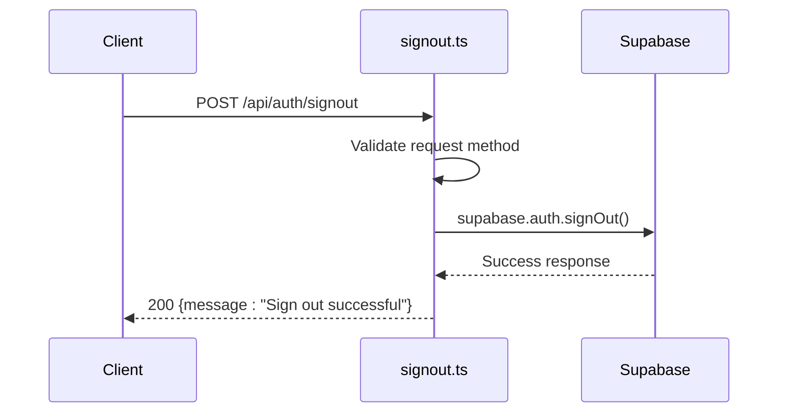
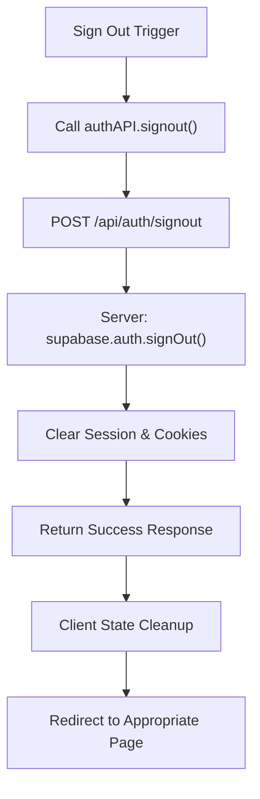
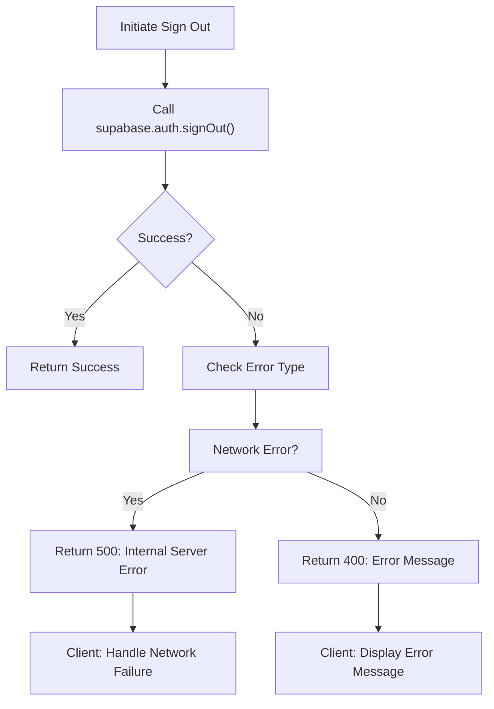

# Sign Out Process

<cite>
**Referenced Files in This Document**   
- [signout.ts](file://pages/api/auth/signout.ts)
- [supabase.ts](file://src/lib/supabase.ts)
- [api.ts](file://src/lib/api.ts)
- [supabase-server.ts](file://src/lib/supabase-server.ts)
</cite>

## Table of Contents
1. [Introduction](#introduction)
2. [API Endpoint Implementation](#api-endpoint-implementation)
3. [Client-Side Sign-Out Flow](#client-side-sign-out-flow)
4. [Session Termination and Cleanup](#session-termination-and-cleanup)
5. [Error Handling and Recovery](#error-handling-and-recovery)
6. [Common Issues and Best Practices](#common-issues-and-best-practices)

## Introduction
The sign-out process in the SnapEvent application is designed to securely terminate user sessions using Supabase's authentication system. This document details the implementation of the sign-out functionality, covering both server-side API endpoints and client-side integration. The process ensures complete session invalidation, proper state cleanup, and appropriate user redirection after logout.

**Section sources**
- [signout.ts](file://pages/api/auth/signout.ts#L1-L27)
- [supabase.ts](file://src/lib/supabase.ts#L1-L241)

## API Endpoint Implementation
The sign-out functionality is implemented as a Next.js API route that handles POST requests to invalidate the current user session. The endpoint is located at `/api/auth/signout` and follows RESTful principles by only accepting POST requests for security reasons.

The implementation uses Supabase's `signOut` method to terminate the user's authentication session. Upon successful sign-out, the server responds with a 200 status code and a success message. The endpoint includes proper error handling for invalid request methods, authentication errors, and internal server issues.

**Diagram sources**
- [signout.ts](file://pages/api/auth/signout.ts#L1-L27)

**Section sources**
- [signout.ts](file://pages/api/auth/signout.ts#L1-L27)

## Client-Side Sign-Out Flow
The client-side sign-out process is facilitated through the `authAPI` service in `api.ts`, which provides a dedicated `signout` method. This method makes a POST request to the `/api/auth/signout` endpoint, abstracting the direct API call from components.

The Supabase client in `supabase.ts` exposes a `signOut` helper function that wraps the Supabase `auth.signOut` method with error handling. This function is used both directly and through the API service layer, providing a consistent interface for session termination across the application.

**Diagram sources**
- [api.ts](file://src/lib/api.ts#L50-L54)
- [supabase.ts](file://src/lib/supabase.ts#L230-L235)

**Section sources**
- [api.ts](file://src/lib/api.ts#L50-L54)
- [supabase.ts](file://src/lib/supabase.ts#L230-L235)

## Session Termination and Cleanup
The sign-out process thoroughly terminates user sessions by leveraging Supabase's built-in authentication mechanisms. When `supabase.auth.signOut()` is called, Supabase automatically invalidates the user's session tokens and clears authentication cookies.

The implementation follows a multi-layered approach to session cleanup:
1. Server-side session invalidation through Supabase Auth
2. Removal of authentication tokens from browser storage
3. Clearing of any local user state in the application

The process is designed to be comprehensive, ensuring that no residual authentication data remains after sign-out. This prevents potential security vulnerabilities and ensures users must re-authenticate to access protected resources.

**Section sources**
- [signout.ts](file://pages/api/auth/signout.ts#L1-L27)
- [supabase.ts](file://src/lib/supabase.ts#L230-L235)

## Error Handling and Recovery
The sign-out implementation includes robust error handling at both the API and client levels. The server-side endpoint catches and logs any errors during the sign-out process, returning appropriate HTTP status codes and error messages.

On the client side, the `signOut` helper function in `supabase.ts` throws errors if the sign-out operation fails, allowing calling code to handle the failure appropriately. The API service layer in `api.ts` also includes error handling that logs failed requests and propagates errors to the caller.

Common error scenarios include network connectivity issues, server errors, and unexpected authentication state. The implementation ensures that even if the sign-out request fails, the application can still clear local state and prompt the user to try again or manually navigate to the sign-in page.

**Diagram sources**
- [signout.ts](file://pages/api/auth/signout.ts#L1-L27)
- [supabase.ts](file://src/lib/supabase.ts#L230-L235)

**Section sources**
- [signout.ts](file://pages/api/auth/signout.ts#L1-L27)
- [supabase.ts](file://src/lib/supabase.ts#L230-L235)

## Common Issues and Best Practices
Several common issues can arise during the sign-out process, including incomplete session cleanup, network failures, and race conditions in state updates. The current implementation addresses these through several best practices:

1. **Complete Session Invalidation**: Using Supabase's `signOut` method ensures server-side session termination, not just client-side token removal.

2. **Error Resilience**: The implementation gracefully handles network failures and server errors, ensuring users can still navigate away from authenticated pages.

3. **State Consistency**: By centralizing sign-out logic in the Supabase helper and API service, the application maintains consistent state management across components.

4. **Security Considerations**: The endpoint only accepts POST requests to prevent CSRF attacks, and all authentication operations are performed over HTTPS in production.

5. **User Experience**: After sign-out, users should be redirected to an appropriate page (typically the home page or sign-in page), though the specific redirection logic is not included in the analyzed files.

Best practices for extending this implementation include adding confirmation dialogs for sign-out actions, implementing loading states during the sign-out process, and providing clear feedback about successful sign-out.

**Section sources**
- [signout.ts](file://pages/api/auth/signout.ts#L1-L27)
- [supabase.ts](file://src/lib/supabase.ts#L230-L235)
- [api.ts](file://src/lib/api.ts#L50-L54)