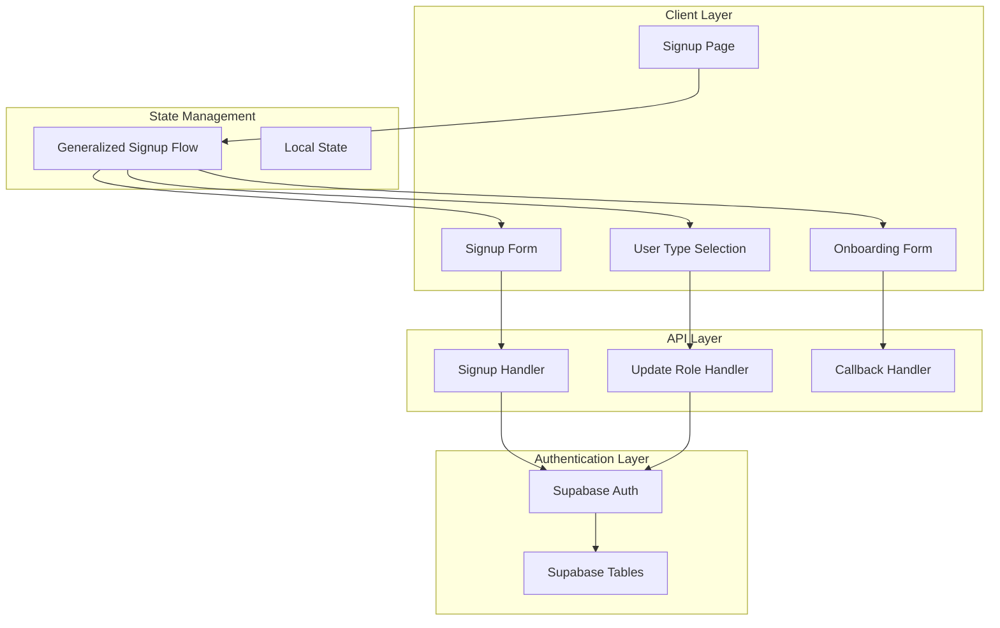
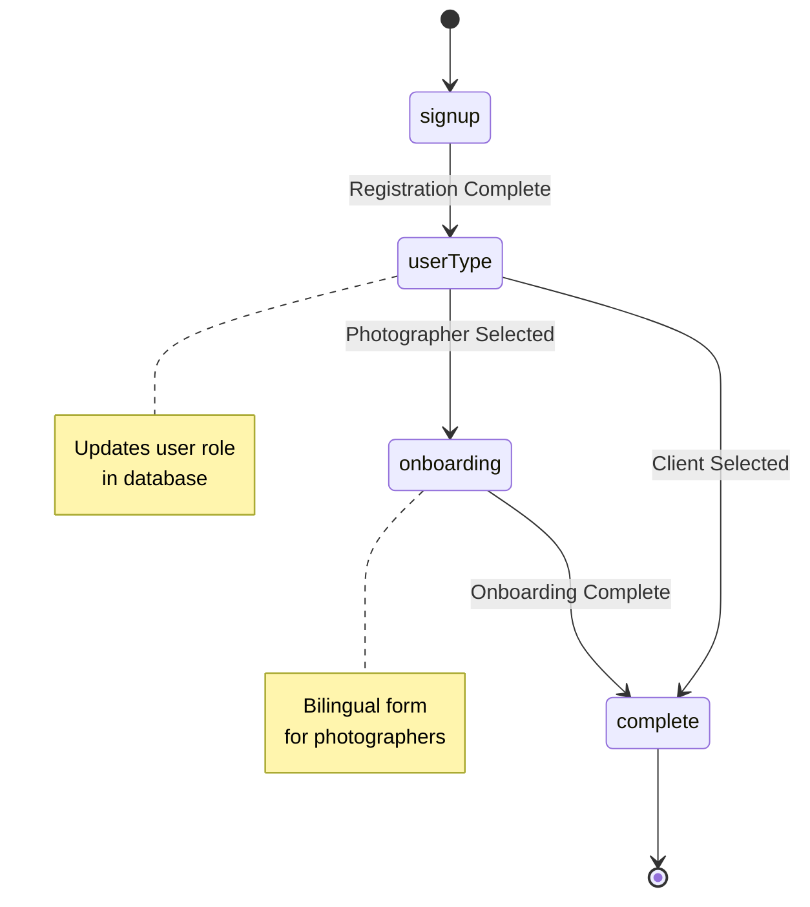
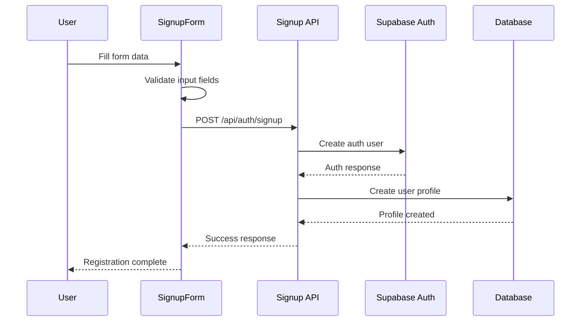
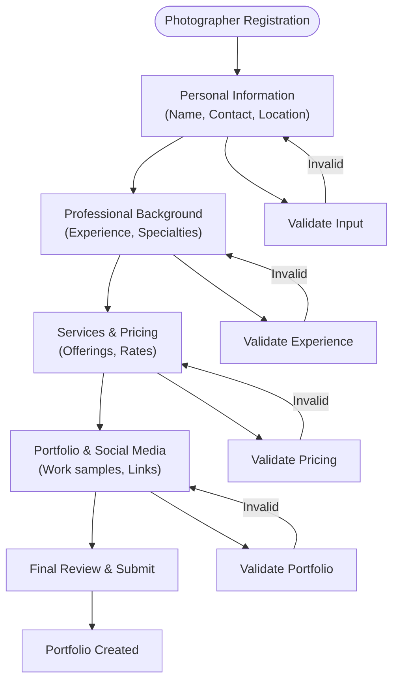
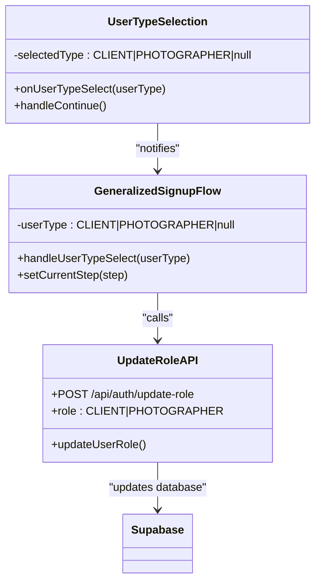
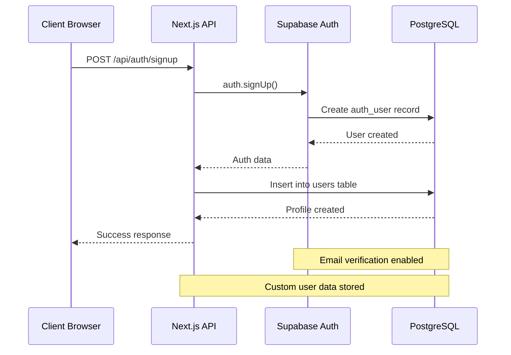

# Sign Up Flow Implementation

<cite>
**Referenced Files in This Document**
- [pages/signup.tsx](file://pages/signup.tsx)
- [src/components/SignupForm.tsx](file://src/components/SignupForm.tsx)
- [pages/api/auth/signup.ts](file://pages/api/auth/signup.ts)
- [src/components/GeneralizedSignupFlow.tsx](file://src/components/GeneralizedSignupFlow.tsx)
- [src/components/UserTypeSelection.tsx](file://src/components/UserTypeSelection.tsx)
- [src/components/OnboardingForm.tsx](file://src/components/OnboardingForm.tsx)
- [src/middleware/validation.ts](file://src/middleware/validation.ts)
- [src/lib/supabase.ts](file://src/lib/supabase.ts)
- [src/lib/api.ts](file://src/lib/api.ts)
- [pages/auth/callback.tsx](file://pages/auth/callback.tsx)
</cite>

## Table of Contents
1. [Introduction](#introduction)
2. [System Architecture](#system-architecture)
3. [Core Components](#core-components)
4. [Multi-Step Registration Process](#multi-step-registration-process)
5. [Form Validation and Data Collection](#form-validation-and-data-collection)
6. [Role Assignment and User Type Selection](#role-assignment-and-user-type-selection)
7. [Supabase Authentication Integration](#supabase-authentication-integration)
8. [Error Handling and Network Failures](#error-handling-and-network-failures)
9. [Responsive UI Design](#responsive-ui-design)
10. [Common Issues and Troubleshooting](#common-issues-and-troubleshooting)
11. [Performance Considerations](#performance-considerations)
12. [Conclusion](#conclusion)

## Introduction

The SnapEvent sign-up flow is a sophisticated multi-step registration process designed to seamlessly onboard new users while collecting essential information for both clients and photographers. Built with Next.js and React, this implementation leverages Supabase for authentication and PostgreSQL for data storage, providing a robust foundation for user management.

The sign-up process consists of three primary phases: initial user registration, role selection, and specialized onboarding for photographers. This architecture ensures that users receive appropriate experiences based on their intended use of the platform, whether they're seeking photography services or offering them.

## System Architecture

The sign-up flow follows a layered architecture that separates concerns between presentation, business logic, and data persistence:



**Diagram sources**
- [pages/signup.tsx](file://pages/signup.tsx#L1-L110)
- [src/components/GeneralizedSignupFlow.tsx](file://src/components/GeneralizedSignupFlow.tsx#L1-L192)
- [pages/api/auth/signup.ts](file://pages/api/auth/signup.ts#L1-L80)

## Core Components

### Signup Page Component

The main signup page serves as the orchestrator for the entire registration process. It manages authentication state and conditionally renders different components based on user status and flow progression.

```typescript
// Key features of the signup page:
// - Authentication state checking
// - Conditional component rendering
// - Step-based navigation
// - Role-based redirection
```

**Section sources**
- [pages/signup.tsx](file://pages/signup.tsx#L1-L110)

### Generalized Signup Flow

This component manages the overall flow state and coordinates between different registration steps:



**Diagram sources**
- [src/components/GeneralizedSignupFlow.tsx](file://src/components/GeneralizedSignupFlow.tsx#L1-L192)

**Section sources**
- [src/components/GeneralizedSignupFlow.tsx](file://src/components/GeneralizedSignupFlow.tsx#L1-L192)

## Multi-Step Registration Process

The sign-up flow implements a sophisticated multi-step process that adapts to user roles and provides contextual experiences:

### Step 1: Initial Registration

The first step captures basic user information through the SignupForm component:



**Diagram sources**
- [src/components/SignupForm.tsx](file://src/components/SignupForm.tsx#L80-L120)
- [pages/api/auth/signup.ts](file://pages/api/auth/signup.ts#L8-L45)

### Step 2: User Type Selection

After initial registration, users are presented with a choice between becoming a client or photographer:

```typescript
// Default role assignment during signup:
const response = await fetch('/api/auth/signup', {
  method: 'POST',
  headers: { 'Content-Type': 'application/json' },
  body: JSON.stringify({
    firstName: formData.firstName,
    lastName: formData.lastName,
    email: formData.email,
    phone: formData.phone || null,
    password: formData.password,
    role: 'CLIENT' // Default role assigned
  }),
});
```

**Section sources**
- [src/components/SignupForm.tsx](file://src/components/SignupForm.tsx#L80-L120)
- [pages/api/auth/signup.ts](file://pages/api/auth/signup.ts#L8-L45)

### Step 3: Onboarding for Photographers

Photographers undergo a comprehensive onboarding process that collects detailed professional information:



**Diagram sources**
- [src/components/OnboardingForm.tsx](file://src/components/OnboardingForm.tsx#L1-L933)

**Section sources**
- [src/components/OnboardingForm.tsx](file://src/components/OnboardingForm.tsx#L1-L933)

## Form Validation and Data Collection

The sign-up system implements comprehensive validation at both the client and server levels to ensure data quality and prevent errors.

### Client-Side Validation

The SignupForm component provides immediate feedback through comprehensive validation:

```typescript
// Validation rules implemented:
const validateForm = () => {
  if (!formData.firstName.trim()) {
    setError('First name is required');
    return false;
  }
  if (!/\S+@\S+\.\S+/.test(formData.email)) {
    setError('Please enter a valid email address');
    return false;
  }
  if (formData.password.length < 6) {
    setError('Password must be at least 6 characters');
    return false;
  }
  if (formData.password !== formData.confirmPassword) {
    setError('Passwords do not match');
    return false;
  }
  return true;
};
```

### Server-Side Validation

The backend employs a middleware-based validation system:

```typescript
// Validation middleware implementation:
export function withValidation(rules: ValidationRule[]) {
  return function(handler: (req: NextApiRequest, res: NextApiResponse) => Promise<void>) {
    return async (req: NextApiRequest, res: NextApiResponse) => {
      const errors: string[] = [];
      
      for (const rule of rules) {
        const value = body[rule.field];
        
        // Type validation
        if (rule.type) {
          switch (rule.type) {
            case 'email':
              const emailPattern = /^[^\s@]+@[^\s@]+\.[^\s@]+$/;
              if (!emailPattern.test(value)) {
                errors.push(`${fieldName} must be a valid email address`);
              }
              break;
            case 'string':
              if (typeof value !== 'string') {
                errors.push(`${fieldName} must be a string`);
              }
              break;
          }
        }
        
        // Pattern validation
        if (rule.pattern && !rule.pattern.test(value)) {
          errors.push(`${fieldName} format is invalid`);
        }
      }
      
      if (errors.length > 0) {
        return res.status(400).json({ error: 'Validation failed', details: errors });
      }
      
      return handler(req, res);
    };
  };
}
```

**Section sources**
- [src/components/SignupForm.tsx](file://src/components/SignupForm.tsx#L40-L70)
- [src/middleware/validation.ts](file://src/middleware/validation.ts#L1-L161)

## Role Assignment and User Type Selection

The system implements a flexible role-based architecture that determines user capabilities and navigation paths:

### Default Role Assignment

During initial registration, all users are assigned the CLIENT role by default:

```typescript
// Default role assignment in signup process:
const { data: authData, error: authError } = await supabase.auth.signUp({
  email,
  password,
  options: {
    emailRedirectTo: `${process.env.NEXT_PUBLIC_APP_URL}/auth/callback`,
    data: {
      first_name: firstName,
      last_name: lastName,
      phone: phone
    }
  }
});

// User profile creation with default role:
const { data: userData, error: userError } = await supabase
  .from('users')
  .insert({
    id: authData.user.id,
    email,
    first_name: firstName,
    last_name: lastName,
    phone: phone,
    role: 'CLIENT' // Default role assignment
  })
```

### Role Update Process

After registration completion, users select their role through the UserTypeSelection component:



**Diagram sources**
- [src/components/UserTypeSelection.tsx](file://src/components/UserTypeSelection.tsx#L1-L188)
- [src/components/GeneralizedSignupFlow.tsx](file://src/components/GeneralizedSignupFlow.tsx#L25-L50)

**Section sources**
- [pages/api/auth/signup.ts](file://pages/api/auth/signup.ts#L8-L45)
- [src/components/GeneralizedSignupFlow.tsx](file://src/components/GeneralizedSignupFlow.tsx#L25-L50)

## Supabase Authentication Integration

The sign-up flow integrates deeply with Supabase for secure authentication and user management:

### Authentication Workflow



**Diagram sources**
- [pages/api/auth/signup.ts](file://pages/api/auth/signup.ts#L8-L45)
- [src/lib/supabase.ts](file://src/lib/supabase.ts#L1-L50)

### Database Schema Integration

The system maintains synchronization between Supabase auth tables and custom user profiles:

```typescript
// Supabase client configuration:
export const supabase = createClient(supabaseUrl, supabaseAnonKey, {
  auth: {
    autoRefreshToken: true,
    persistSession: true,
    detectSessionInUrl: true
  }
})

// Database types definition:
export type Database = {
  public: {
    Tables: {
      users: {
        Row: {
          id: string
          email: string
          first_name: string
          last_name: string
          phone: string | null
          role: 'CLIENT' | 'PHOTOGRAPHER' | 'ADMIN'
          is_active: boolean
          created_at: string
          updated_at: string
        }
      }
    }
  }
}
```

**Section sources**
- [pages/api/auth/signup.ts](file://pages/api/auth/signup.ts#L8-L45)
- [src/lib/supabase.ts](file://src/lib/supabase.ts#L1-L242)

## Error Handling and Network Failures

The sign-up flow implements comprehensive error handling to manage various failure scenarios gracefully:

### Client-Side Error Management

```typescript
// Error handling in signup form:
const handleSubmit = async (e: React.FormEvent) => {
  e.preventDefault();
  
  if (!validateForm()) return;
  
  setIsLoading(true);
  setError('');
  
  try {
    const response = await fetch('/api/auth/signup', {
      method: 'POST',
      headers: { 'Content-Type': 'application/json' },
      body: JSON.stringify({
        firstName: formData.firstName,
        lastName: formData.lastName,
        email: formData.email,
        phone: formData.phone || null,
        password: formData.password,
        role: 'CLIENT'
      }),
    });
    
    const data = await response.json();
    
    if (!response.ok) {
      throw new Error(data.error || 'Signup failed');
    }
    
    onSignupSuccess();
  } catch (error) {
    setError(error instanceof Error ? error.message : 'An error occurred during signup');
  } finally {
    setIsLoading(false);
  }
};
```

### Server-Side Error Recovery

The backend implements cleanup mechanisms for failed operations:

```typescript
// Error recovery in signup handler:
if (userError) {
  // Clean up auth user if profile creation fails
  await supabase.auth.admin.deleteUser(authData.user.id);
  return res.status(400).json({ error: userError.message });
}

// Graceful handling of role update failures:
try {
  const response = await fetch('/api/auth/update-role', {
    method: 'POST',
    headers: { 'Content-Type': 'application/json' },
    body: JSON.stringify({ role: selectedUserType }),
  });
  
  if (!response.ok) {
    throw new Error('Failed to update user role');
  }
} catch (error) {
  console.error('Error updating user role:', error);
  // Proceed with flow even if role update fails
  handleSignupComplete(selectedUserType);
}
```

**Section sources**
- [src/components/SignupForm.tsx](file://src/components/SignupForm.tsx#L80-L120)
- [src/components/GeneralizedSignupFlow.tsx](file://src/components/GeneralizedSignupFlow.tsx#L30-L50)

## Responsive UI Design

The sign-up flow features a modern, responsive design that adapts to various screen sizes and provides engaging user interactions:

### Animation and Transitions

The system uses Framer Motion for smooth transitions between form steps:

```typescript
// Animation variants for form transitions:
const pageVariants = {
  initial: { opacity: 0, x: 20 },
  in: { opacity: 1, x: 0 },
  out: { opacity: 0, x: -20 }
};

const pageTransition = {
  type: "tween",
  ease: "anticipate",
  duration: 0.3
};

// Interactive animations for buttons and cards:
const scaleOnHover = {
  whileHover: { scale: 1.02 },
  whileTap: { scale: 0.98 },
  transition: { type: "spring", stiffness: 400, damping: 17 }
};
```

### Mobile-First Design

The interface adapts seamlessly to mobile devices:

```typescript
// Responsive layout implementation:
<div className="min-h-screen bg-background text-foreground flex items-center justify-center px-4">
  <motion.div 
    className="w-full max-w-md"
    initial={{ opacity: 0, y: 30 }}
    animate={{ opacity: 1, y: 0 }}
    transition={{ duration: 0.6, ease: "easeOut" }}
  >
    {/* Form content */}
  </motion.div>
</motion.div>
```

**Section sources**
- [src/components/GeneralizedSignupFlow.tsx](file://src/components/GeneralizedSignupFlow.tsx#L100-L150)
- [src/components/SignupForm.tsx](file://src/components/SignupForm.tsx#L120-L170)

## Common Issues and Troubleshooting

### Validation Errors

**Issue**: Form submission fails due to validation errors
**Solution**: The system provides immediate feedback with specific error messages:
- First name and last name are required
- Valid email format required
- Password must be at least 6 characters
- Phone number format validation
- Password confirmation mismatch

### Duplicate Email Handling

**Issue**: Attempting to register with an existing email
**Solution**: Supabase handles duplicate emails automatically and returns appropriate error messages. The system displays these errors to users without exposing implementation details.

### Network Failures During Submission

**Issue**: Intermittent network connectivity during form submission
**Solution**: The system implements retry logic and graceful degradation:
- Loading states prevent multiple submissions
- Error messages are displayed clearly
- Local state is preserved during network interruptions

### Role Update Failures

**Issue**: User type selection fails to update role in database
**Solution**: The system continues the flow even if role updates fail:
- Immediate UI feedback
- Logging of errors for debugging
- Graceful fallback to default behavior

**Section sources**
- [src/components/SignupForm.tsx](file://src/components/SignupForm.tsx#L40-L70)
- [src/components/GeneralizedSignupFlow.tsx](file://src/components/GeneralizedSignupFlow.tsx#L30-L50)

## Performance Considerations

### Optimistic UI Updates

The sign-up flow implements optimistic UI updates to improve perceived performance:

```typescript
// Optimistic loading states:
const [isLoading, setIsLoading] = useState(false);

const handleSubmit = async (e: React.FormEvent) => {
  e.preventDefault();
  
  // Set loading state immediately
  setIsLoading(true);
  
  try {
    // Perform async operation
    const response = await fetch('/api/auth/signup', { /* ... */ });
    
    // Handle success optimistically
    onSignupSuccess();
  } catch (error) {
    // Reset state on error
    setIsLoading(false);
    setError('Registration failed');
  }
};
```

### Lazy Loading

Critical components are loaded lazily to improve initial page load performance:

```typescript
// Dynamic imports for optimal bundle splitting:
const GeneralizedSignupFlow = dynamic(
  () => import('../src/components/GeneralizedSignupFlow').then(mod => ({
    default: mod.GeneralizedSignupFlow 
  })),
  { ssr: false }
);

const UserTypeSelection = dynamic(
  () => import('../src/components/UserTypeSelection').then(mod => ({
    default: mod.UserTypeSelection
  })),
  { ssr: false }
);
```

**Section sources**
- [src/components/SignupForm.tsx](file://src/components/SignupForm.tsx#L80-L120)
- [pages/signup.tsx](file://pages/signup.tsx#L6-L15)

## Conclusion

The SnapEvent sign-up flow represents a sophisticated implementation of modern web application user onboarding. Through its multi-step architecture, comprehensive validation, and seamless integration with Supabase authentication, it provides a robust foundation for user acquisition and engagement.

Key strengths of the implementation include:

- **Modular Architecture**: Clear separation of concerns with dedicated components for each registration phase
- **Robust Validation**: Comprehensive client and server-side validation ensuring data quality
- **Flexible Role System**: Dynamic role assignment that adapts to user needs
- **Graceful Error Handling**: Sophisticated error management that maintains user experience during failures
- **Responsive Design**: Modern UI that works across all device types
- **Performance Optimization**: Lazy loading and optimistic updates for fast user interactions

The system successfully balances functionality with usability, providing both developers and end-users with a reliable and intuitive registration experience. Future enhancements could include additional validation rules, internationalization support, and enhanced analytics tracking to further optimize the user onboarding process.