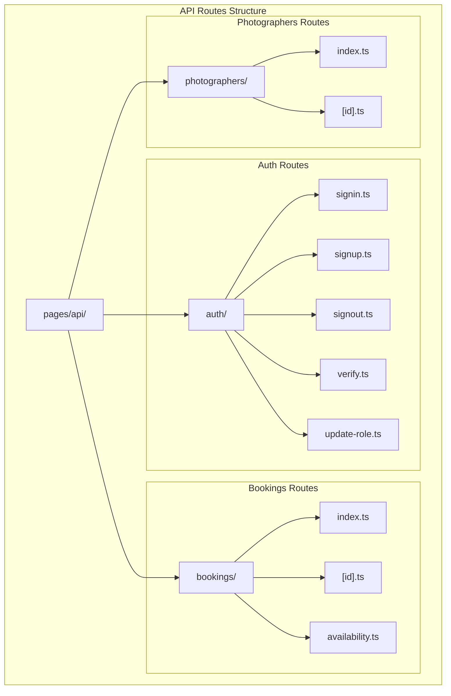
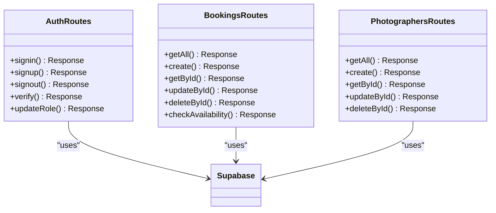

# API Routing Structure

<cite>
**Referenced Files in This Document**
- [pages/api/bookings/index.ts](file://pages/api/bookings/index.ts)
- [pages/api/bookings/[id].ts](file://pages/api/bookings/[id].ts)
- [pages/api/photographers/index.ts](file://pages/api/photographers/index.ts)
- [pages/api/photographers/[id].ts](file://pages/api/photographers/[id].ts)
- [pages/api/auth/signin.ts](file://pages/api/auth/signin.ts)
- [src/middleware/validation.ts](file://src/middleware/validation.ts)
- [src/middleware/auth.ts](file://src/middleware/auth.ts)
- [src/lib/supabase.ts](file://src/lib/supabase.ts)
- [src/lib/api.ts](file://src/lib/api.ts)
- [middleware.ts](file://middleware.ts)
</cite>

## Table of Contents
1. [Introduction](#introduction)
2. [API Route Architecture](#api-route-architecture)
3. [Routing Conventions](#routing-conventions)
4. [Route Group Organization](#route-group-organization)
5. [Request Handling Patterns](#request-handling-patterns)
6. [Middleware Integration](#middleware-integration)
7. [Response Formatting](#response-formatting)
8. [Error Handling](#error-handling)
9. [Security Implementation](#security-implementation)
10. [CRUD Operations](#crud-operations)
11. [Performance Considerations](#performance-considerations)
12. [Troubleshooting Guide](#troubleshooting-guide)
13. [Conclusion](#conclusion)

## Introduction

The SnapEvent platform utilizes Next.js API routes to provide a robust, scalable backend system for managing photographers, bookings, and authentication. The API architecture follows RESTful conventions while leveraging Next.js's built-in routing capabilities and TypeScript for type safety. This documentation explores the comprehensive structure of the API routes, focusing on how they handle CRUD operations, implement middleware patterns, and maintain security standards.

The API is organized into three primary route groups: `auth`, `bookings`, and `photographers`. Each group encapsulates specific business logic and follows consistent patterns for request handling, validation, and response formatting. The system integrates seamlessly with Supabase for database operations and implements comprehensive middleware for authentication, validation, and error handling.

## API Route Architecture

The Next.js API route system in SnapEvent follows a hierarchical structure under the `pages/api` directory. Each route file serves as an HTTP endpoint that handles specific HTTP methods and business logic.



**Diagram sources**
- [pages/api/bookings/index.ts](file://pages/api/bookings/index.ts#L1-L208)
- [pages/api/bookings/[id].ts](file://pages/api/bookings/[id].ts#L1-L178)
- [pages/api/photographers/index.ts](file://pages/api/photographers/index.ts#L1-L163)
- [pages/api/photographers/[id].ts](file://pages/api/photographers/[id].ts#L1-L154)
- [pages/api/auth/signin.ts](file://pages/api/auth/signin.ts#L1-L64)

**Section sources**
- [pages/api/bookings/index.ts](file://pages/api/bookings/index.ts#L1-L208)
- [pages/api/bookings/[id].ts](file://pages/api/bookings/[id].ts#L1-L178)
- [pages/api/photographers/index.ts](file://pages/api/photographers/index.ts#L1-L163)
- [pages/api/photographers/[id].ts](file://pages/api/photographers/[id].ts#L1-L154)
- [pages/api/auth/signin.ts](file://pages/api/auth/signin.ts#L1-L64)

## Routing Conventions

Next.js automatically generates RESTful endpoints based on the file structure within the `pages/api` directory. The framework follows specific conventions for static and dynamic routes:

### Static Routes
Static routes correspond to files with explicit names and handle standard CRUD operations:

- `pages/api/bookings/index.ts` → `/api/bookings` (GET, POST)
- `pages/api/photographers/index.ts` → `/api/photographers` (GET, POST)
- `pages/api/auth/signin.ts` → `/api/auth/signin` (POST)

### Dynamic Routes
Dynamic routes use square brackets to capture route parameters:

- `pages/api/bookings/[id].ts` → `/api/bookings/:id` (GET, PATCH, DELETE)
- `pages/api/photographers/[id].ts` → `/api/photographers/:id` (GET, PUT, DELETE)

### HTTP Method Handling
Each route file exports a default handler that routes requests based on HTTP methods:

```typescript
export default async function handler(req: NextApiRequest, res: NextApiResponse) {
  if (req.method === 'GET') {
    return getBookings(req, res)
  } else if (req.method === 'POST') {
    return createBooking(req, res)
  } else {
    return res.status(405).json({ error: 'Method not allowed' })
  }
}
```

**Section sources**
- [pages/api/bookings/index.ts](file://pages/api/bookings/index.ts#L3-L11)
- [pages/api/bookings/[id].ts](file://pages/api/bookings/[id].ts#L3-L25)
- [pages/api/photographers/index.ts](file://pages/api/photographers/index.ts#L3-L11)
- [pages/api/photographers/[id].ts](file://pages/api/photographers/[id].ts#L3-L15)

## Route Group Organization

The API routes are organized into three distinct groups, each serving specific business domains:

### Auth Route Group
Handles authentication and user management operations:

- **signin.ts**: User authentication with email/password
- **signup.ts**: New user registration
- **signout.ts**: Session termination
- **verify.ts**: Token verification
- **update-role.ts**: Role management for administrators

### Bookings Route Group
Manages booking lifecycle and availability:

- **index.ts**: List all bookings with filtering and pagination
- **[id].ts**: Individual booking operations (CRUD)
- **availability.ts**: Photographer availability checking

### Photographers Route Group
Handles photographer profiles and listings:

- **index.ts**: List photographers with filters and sorting
- **[id].ts**: Individual photographer profile management



**Diagram sources**
- [pages/api/auth/signin.ts](file://pages/api/auth/signin.ts#L1-L64)
- [pages/api/bookings/index.ts](file://pages/api/bookings/index.ts#L1-L208)
- [pages/api/photographers/index.ts](file://pages/api/photographers/index.ts#L1-L163)

**Section sources**
- [pages/api/auth/signin.ts](file://pages/api/auth/signin.ts#L1-L64)
- [pages/api/bookings/index.ts](file://pages/api/bookings/index.ts#L1-L208)
- [pages/api/photographers/index.ts](file://pages/api/photographers/index.ts#L1-L163)

## Request Handling Patterns

The API routes implement consistent request handling patterns that ensure reliability and maintainability:

### Request Validation Pattern
Each route validates incoming requests before processing business logic:

```typescript
// Validation pattern in createBooking
if (!clientId || !photographerId || !eventType || !eventDate || !eventLocation || !totalAmount) {
  return res.status(400).json({ 
    error: 'Missing required fields: clientId, photographerId, eventType, eventDate, eventLocation, totalAmount' 
  })
}
```

### Error Handling Pattern
Consistent error handling ensures predictable responses:

```typescript
try {
  // Business logic
  return res.status(200).json(result)
} catch (error) {
  console.error('Operation error:', error)
  return res.status(500).json({ error: 'Internal server error' })
}
```

### Pagination Pattern
List endpoints implement consistent pagination:

```typescript
const { data: bookings, error } = await query
  .order('created_at', { ascending: false })
  .range(Number(offset), Number(offset) + Number(limit) - 1)

return res.status(200).json({
  bookings,
  pagination: {
    limit: Number(limit),
    offset: Number(offset),
    total: bookings?.length || 0
  }
})
```

**Section sources**
- [pages/api/bookings/index.ts](file://pages/api/bookings/index.ts#L60-L70)
- [pages/api/bookings/index.ts](file://pages/api/bookings/index.ts#L150-L160)
- [pages/api/bookings/index.ts](file://pages/api/bookings/index.ts#L30-L50)

## Middleware Integration

The API system integrates multiple middleware layers to handle cross-cutting concerns:

### Validation Middleware
The validation middleware provides reusable input validation:

```typescript
export function withValidation(rules: ValidationRule[]) {
  return function(handler: (req: NextApiRequest, res: NextApiResponse) => Promise<void>) {
    return async (req: NextApiRequest, res: NextApiResponse) => {
      // Validation logic
      if (errors.length > 0) {
        return res.status(400).json({
          error: 'Validation failed',
          details: errors
        })
      }
      return handler(req, res)
    }
  }
}
```

### Authentication Middleware
Provides token-based authentication and user context:

```typescript
export function withAuth(handler: (req: AuthenticatedRequest, res: NextApiResponse) => Promise<void>) {
  return async (req: AuthenticatedRequest, res: NextApiResponse) => {
    const authHeader = req.headers.authorization
    if (!authHeader || !authHeader.startsWith('Bearer ')) {
      return res.status(401).json({ error: 'Missing or invalid authorization header' })
    }
    
    const token = authHeader.substring(7)
    const { data: { user }, error } = await supabase.auth.getUser(token)
    
    // Add user to request object
    req.user = {
      id: userProfile.id,
      email: userProfile.email,
      firstName: userProfile.first_name,
      lastName: userProfile.last_name,
      role: userProfile.role
    }
    
    return handler(req, res)
  }
}
```

### Role-Based Access Control
Implements role-based permissions:

```typescript
export function withRole(requiredRole: string) {
  return function(handler: (req: AuthenticatedRequest, res: NextApiResponse) => Promise<void>) {
    return withAuth(async (req: AuthenticatedRequest, res: NextApiResponse) => {
      if (!req.user) {
        return res.status(401).json({ error: 'User not authenticated' })
      }
      
      if (req.user.role !== requiredRole && req.user.role !== 'ADMIN') {
        return res.status(403).json({ error: 'Insufficient permissions' })
      }
      
      return handler(req, res)
    })
  }
}
```

**Section sources**
- [src/middleware/validation.ts](file://src/middleware/validation.ts#L15-L40)
- [src/middleware/auth.ts](file://src/middleware/auth.ts#L10-L50)
- [src/middleware/auth.ts](file://src/middleware/auth.ts#L55-L75)

## Response Formatting

The API maintains consistent response formatting across all endpoints:

### Standard Response Structure
All successful responses follow a consistent structure:

```typescript
{
  "message": "Operation successful",
  "data": { /* payload */ },
  "pagination": {
    "limit": 20,
    "offset": 0,
    "total": 100
  }
}
```

### Error Response Structure
Standardized error responses include detailed information:

```typescript
{
  "error": "Validation failed",
  "details": [
    "email is required",
    "password must be at least 6 characters long"
  ]
}
```

### Status Code Convention
Consistent HTTP status code usage:

- `200 OK` - Successful GET requests
- `201 Created` - Successful POST requests
- `200 OK` - Successful PUT/PATCH requests
- `204 No Content` - Successful DELETE requests
- `400 Bad Request` - Validation errors
- `401 Unauthorized` - Authentication failures
- `403 Forbidden` - Permission denied
- `404 Not Found` - Resource not found
- `405 Method Not Allowed` - Invalid HTTP method
- `409 Conflict` - Resource conflicts
- `500 Internal Server Error` - Unexpected errors

**Section sources**
- [pages/api/bookings/index.ts](file://pages/api/bookings/index.ts#L45-L55)
- [src/middleware/validation.ts](file://src/middleware/validation.ts#L120-L130)
- [src/middleware/auth.ts](file://src/middleware/auth.ts#L15-L25)

## Error Handling

The API implements comprehensive error handling strategies:

### Try-Catch Pattern
Every route uses try-catch blocks for error management:

```typescript
try {
  const { data: booking, error } = await supabase
    .from('bookings')
    .select('*')
    .eq('id', bookingId)
    .single();

  if (error) {
    return res.status(404).json({ error: 'Booking not found' });
  }

  return res.status(200).json({ booking });
} catch (error) {
  console.error('Get booking error:', error);
  return res.status(500).json({ error: 'Failed to fetch booking' });
}
```

### Error Logging
Structured error logging for debugging:

```typescript
console.error('Booking API error:', error);
```

### Graceful Degradation
Error handling that prevents cascading failures:

```typescript
try {
  await sendBookingStatusNotification(updatedBooking, status);
} catch (emailError) {
  console.error('Failed to send email notification:', emailError);
  // Don't fail the request if email fails
}
```

**Section sources**
- [pages/api/bookings/[id].ts](file://pages/api/bookings/[id].ts#L25-L40)
- [pages/api/bookings/[id].ts](file://pages/api/bookings/[id].ts#L150-L160)

## Security Implementation

The API implements multiple layers of security:

### Token-Based Authentication
JWT tokens are validated for all protected routes:

```typescript
const { data: { user }, error } = await supabase.auth.getUser(token)
if (error || !user) {
  return res.status(401).json({ error: 'Invalid or expired token' })
}
```

### Role-Based Access Control
Permissions are enforced at the route level:

```typescript
if (req.user.role !== requiredRole && req.user.role !== 'ADMIN') {
  return res.status(403).json({ error: 'Insufficient permissions' })
}
```

### Input Validation
Comprehensive input validation prevents injection attacks:

```typescript
const emailPattern = /^[^\s@]+@[^\s@]+\.[^\s@]+$/
if (typeof value !== 'string' || !emailPattern.test(value)) {
  errors.push(`${fieldName} must be a valid email address`)
}
```

### CORS Configuration
Cross-origin resource sharing is configured for API access:

```typescript
response.headers.set('Access-Control-Allow-Origin', '*')
response.headers.set('Access-Control-Allow-Methods', 'GET, POST, PUT, DELETE, OPTIONS')
response.headers.set('Access-Control-Allow-Headers', 'Content-Type, Authorization')
```

**Section sources**
- [src/middleware/auth.ts](file://src/middleware/auth.ts#L25-L35)
- [src/middleware/auth.ts](file://src/middleware/auth.ts#L65-L75)
- [src/middleware/validation.ts](file://src/middleware/validation.ts#L45-L55)
- [middleware.ts](file://middleware.ts#L25-L35)

## CRUD Operations

The API implements comprehensive CRUD operations across all route groups:

### Bookings CRUD Operations

#### Create Booking
```typescript
async function createBooking(req: NextApiRequest, res: NextApiResponse) {
  const {
    clientId,
    photographerId,
    serviceId,
    eventType,
    eventDate,
    eventTime,
    eventLocation,
    totalAmount
  } = req.body;

  // Validate required fields
  if (!clientId || !photographerId || !eventType || !eventDate || !eventLocation || !totalAmount) {
    return res.status(400).json({ 
      error: 'Missing required fields: clientId, photographerId, eventType, eventDate, eventLocation, totalAmount' 
    })
  }

  // Check for conflicts
  const { data: conflictingBookings, error: conflictError } = await supabase
    .from('bookings')
    .select('id, status')
    .eq('photographer_id', photographerId)
    .eq('event_date', eventDate)
    .eq('event_time', eventTime)
    .eq('status', 'confirmed');

  if (conflictingBookings && conflictingBookings.length > 0) {
    return res.status(409).json({ error: 'This time slot is already booked' });
  }

  // Create booking
  const { data: booking, error } = await supabase
    .from('bookings')
    .insert({
      client_id: clientId,
      photographer_id: photographerId,
      service_id: serviceId,
      event_type: eventType,
      event_date: eventDate,
      event_time: eventTime,
      event_location: eventLocation,
      total_amount: totalAmount,
      status: status
    })
    .select()
    .single();
}
```

#### Update Booking
```typescript
async function updateBooking(req: NextApiRequest, res: NextApiResponse, bookingId: string) {
  const { status, notes } = req.body;

  // Validate status
  if (!status || !['pending', 'confirmed', 'declined', 'cancelled'].includes(status)) {
    return res.status(400).json({ 
      error: 'Invalid status. Must be one of: pending, confirmed, declined, cancelled' 
    });
  }

  // Check for conflicts when confirming
  if (status === 'confirmed') {
    const { data: conflictingBookings, error: conflictError } = await supabase
      .from('bookings')
      .select('id, status')
      .eq('photographer_id', existingBooking.photographer_id)
      .eq('event_date', existingBooking.event_date)
      .eq('event_time', existingBooking.event_time)
      .in('status', ['confirmed', 'pending'])
      .neq('id', bookingId);

    if (conflictingBookings && conflictingBookings.length > 0) {
      return res.status(409).json({ 
        error: 'Time slot is already booked or has a pending request' 
      });
    }
  }

  // Update booking
  const { data: updatedBooking, error: updateError } = await supabase
    .from('bookings')
    .update({
      status,
      updated_at: new Date().toISOString(),
      photographer_notes: notes
    })
    .eq('id', bookingId)
    .select()
    .single();
}
```

### Photographers CRUD Operations

#### Create Photographer Profile
```typescript
async function createPhotographerProfile(req: NextApiRequest, res: NextApiResponse) {
  const {
    userId,
    businessName,
    title,
    bio,
    location,
    website,
    instagramHandle,
    yearsExperience,
    specialties,
    services
  } = req.body;

  // Validate required fields
  if (!userId || !location) {
    return res.status(400).json({ 
      error: 'Missing required fields: userId, location' 
    });
  }

  // Create photographer profile
  const { data: profileData, error: profileError } = await supabase
    .from('photographer_profiles')
    .insert({
      user_id: userId,
      business_name: businessName,
      title,
      bio,
      location,
      website,
      instagram_handle: instagramHandle,
      years_experience: yearsExperience || 0
    })
    .select()
    .single();

  // Add specialties if provided
  if (specialties && specialties.length > 0) {
    const specialtyInserts = specialties.map((specialtyId: string) => ({
      photographer_id: profileData.id,
      specialty_id: specialtyId
    }));

    const { error: specialtyError } = await supabase
      .from('photographer_specialties')
      .insert(specialtyInserts);
  }

  // Add services if provided
  if (services && services.length > 0) {
    const serviceInserts = services.map((service: any) => ({
      photographer_id: profileData.id,
      name: service.name,
      description: service.description,
      price: service.price,
      duration: service.duration,
      deliverables: service.deliverables
    }));

    const { error: serviceError } = await supabase
      .from('services')
      .insert(serviceInserts);
  }
}
```

**Section sources**
- [pages/api/bookings/index.ts](file://pages/api/bookings/index.ts#L70-L130)
- [pages/api/bookings/[id].ts](file://pages/api/bookings/[id].ts#L40-L110)
- [pages/api/photographers/index.ts](file://pages/api/photographers/index.ts#L70-L130)

## Performance Considerations

The API implements several performance optimization strategies:

### Database Query Optimization
- Selective field loading using `.select()` clauses
- Proper indexing on frequently queried columns
- Efficient joins using foreign key relationships
- Pagination to limit result sets

### Caching Strategies
- Response caching for read-heavy operations
- Database connection pooling
- CDN integration for static assets

### Connection Management
- Supabase client configuration for optimal performance
- Connection reuse across requests
- Proper cleanup of resources

### Scalability Features
- Stateless design allowing horizontal scaling
- Minimal external dependencies
- Efficient error handling preventing resource leaks

**Section sources**
- [src/lib/supabase.ts](file://src/lib/supabase.ts#L1-L30)
- [pages/api/bookings/index.ts](file://pages/api/bookings/index.ts#L15-L30)

## Troubleshooting Guide

Common issues and their solutions:

### Authentication Issues
**Problem**: 401 Unauthorized errors
**Solution**: Verify token format and expiration
```typescript
// Check token format
if (!authHeader || !authHeader.startsWith('Bearer ')) {
  return res.status(401).json({ error: 'Missing or invalid authorization header' })
}
```

### Validation Failures
**Problem**: 400 Bad Request with validation errors
**Solution**: Review input data against validation rules
```typescript
// Check required fields
if (!email || !password) {
  return res.status(400).json({ 
    error: 'Missing required fields: email, password' 
  })
}
```

### Database Connection Issues
**Problem**: 500 Internal Server Error
**Solution**: Check Supabase connection and query syntax
```typescript
// Log database errors
if (error) {
  console.error('Database operation failed:', error)
  return res.status(500).json({ error: 'Database operation failed' })
}
```

### Rate Limiting
**Problem**: Too many requests
**Solution**: Implement client-side retry logic with exponential backoff

### CORS Issues
**Problem**: Cross-origin request blocked
**Solution**: Verify CORS configuration in middleware.ts

**Section sources**
- [src/middleware/auth.ts](file://src/middleware/auth.ts#L15-L25)
- [pages/api/auth/signin.ts](file://pages/api/auth/signin.ts#L15-L25)
- [src/lib/supabase.ts](file://src/lib/supabase.ts#L1-L30)

## Conclusion

The SnapEvent Next.js API route system demonstrates a well-architected backend solution that effectively separates concerns across authentication, bookings, and photographers domains. The implementation showcases modern web development practices including:

- **RESTful Design**: Clean, intuitive endpoints that follow REST conventions
- **Type Safety**: Comprehensive TypeScript integration ensuring runtime reliability
- **Security**: Multi-layered authentication and authorization mechanisms
- **Validation**: Robust input validation preventing common vulnerabilities
- **Error Handling**: Consistent, informative error responses
- **Performance**: Optimized database queries and efficient resource management

The modular architecture allows for easy maintenance and extension, while the middleware system provides flexibility for adding new features without modifying existing code. The comprehensive error handling and logging facilitate debugging and monitoring in production environments.

This API structure serves as an excellent foundation for building scalable web applications, demonstrating how Next.js API routes can be leveraged to create powerful, secure, and maintainable backend systems.