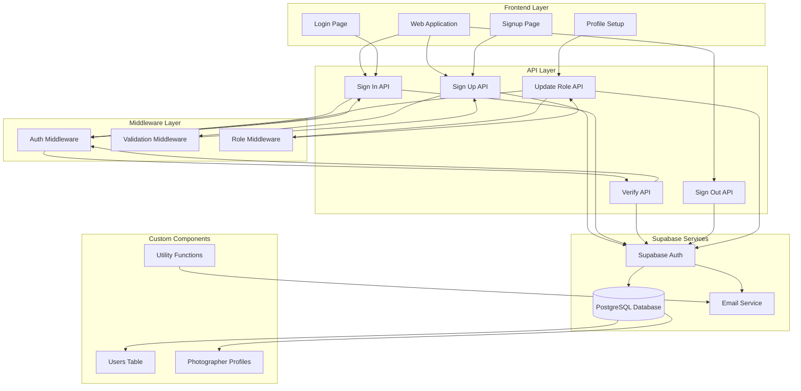
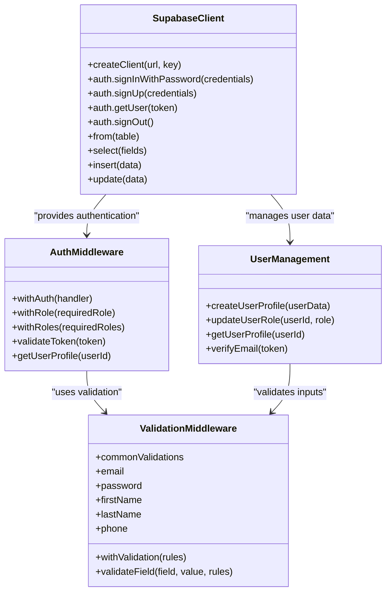
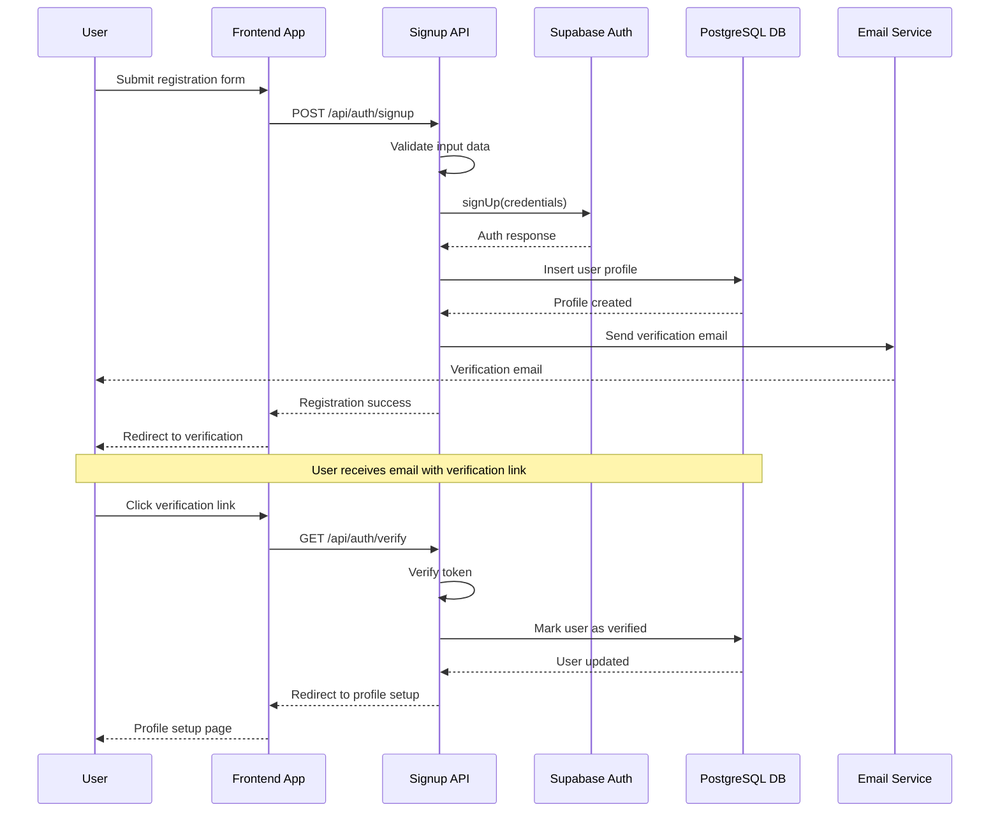
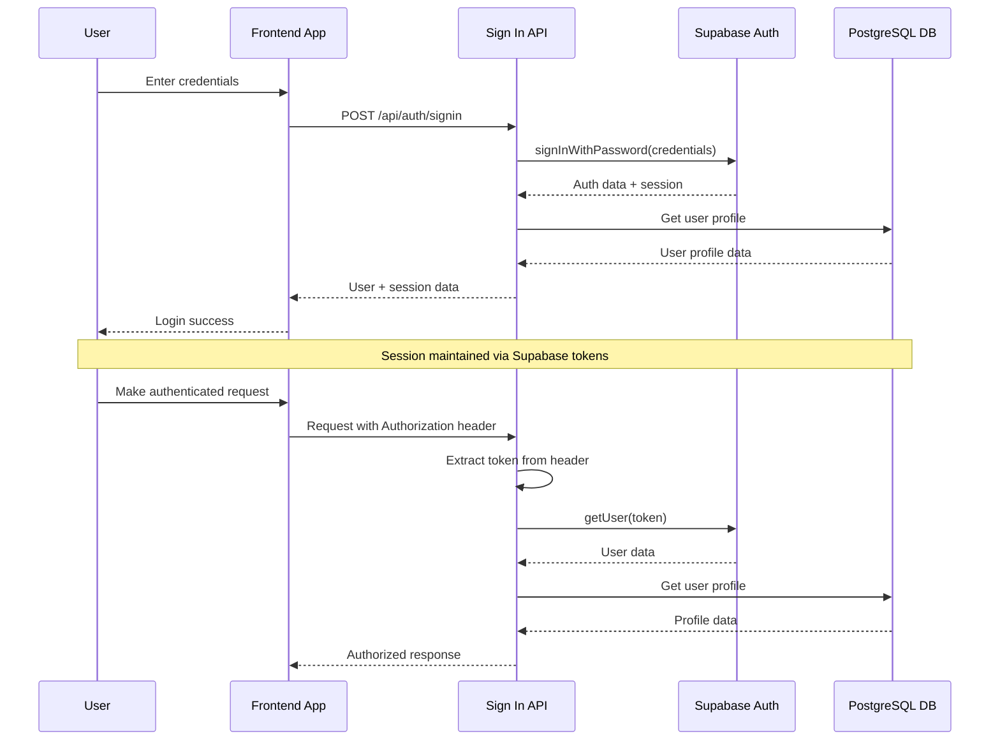
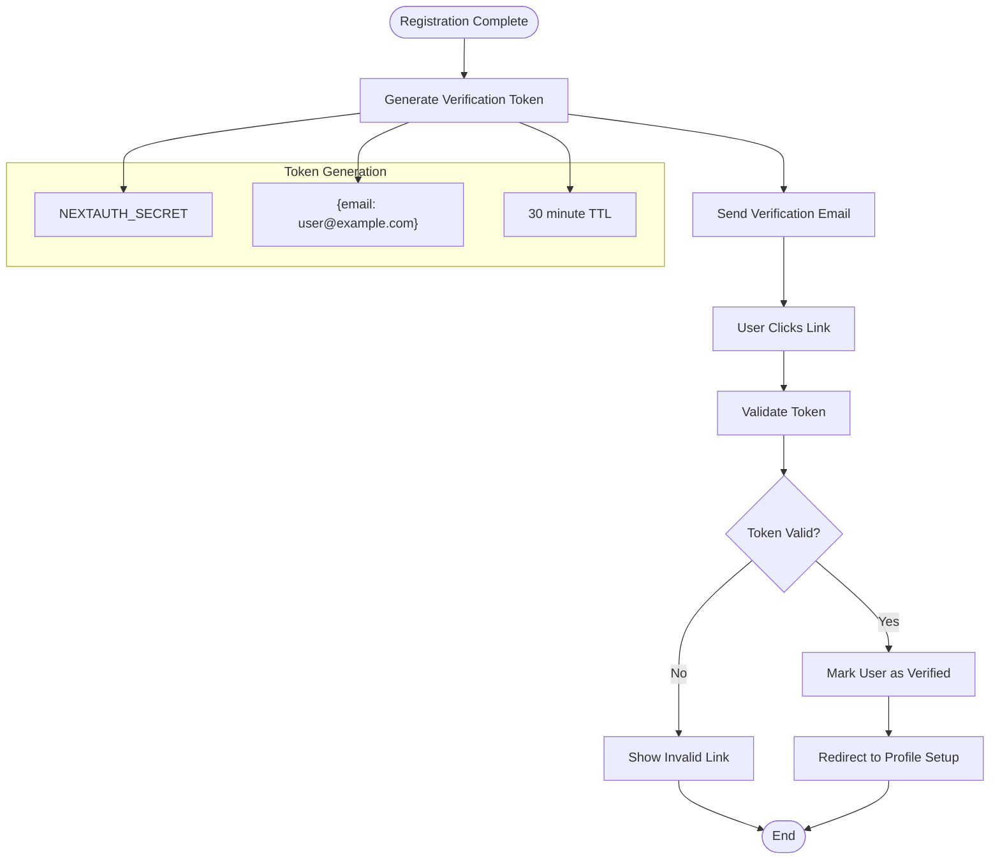
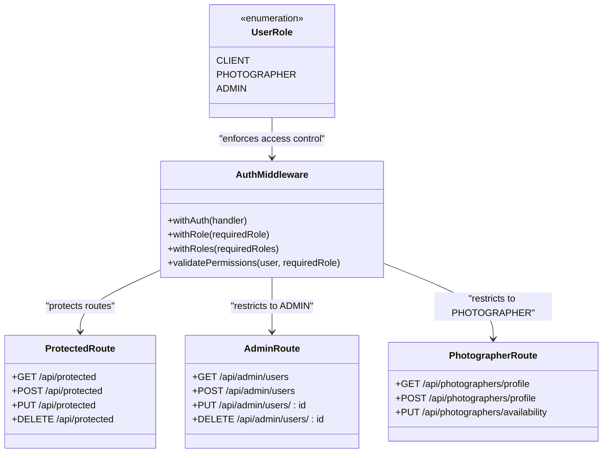
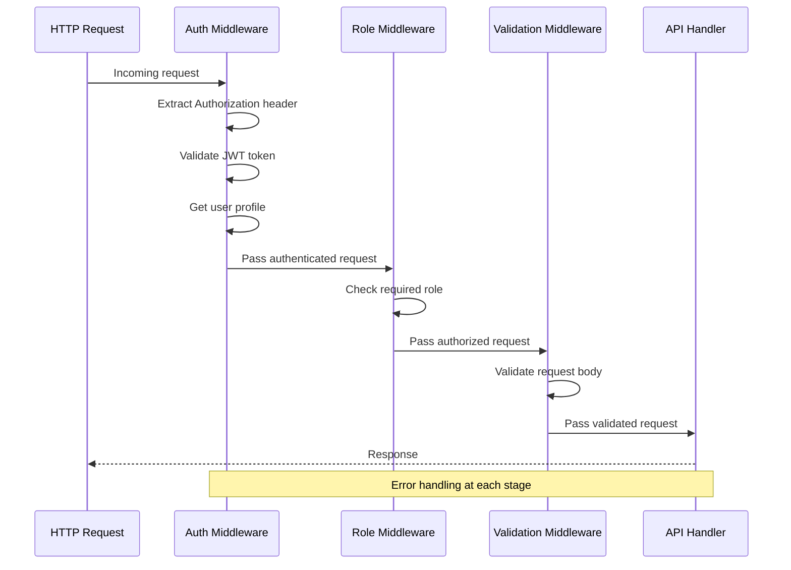

# Authentication Flow

<cite>
**Referenced Files in This Document**
- [pages/api/auth/signin.ts](file://pages/api/auth/signin.ts)
- [pages/api/auth/signup.ts](file://pages/api/auth/signup.ts)
- [pages/api/auth/verify.ts](file://pages/api/auth/verify.ts)
- [pages/api/auth/signout.ts](file://pages/api/auth/signout.ts)
- [pages/api/auth/update-role.ts](file://pages/api/auth/update-role.ts)
- [src/middleware/auth.ts](file://src/middleware/auth.ts)
- [src/middleware/validation.ts](file://src/middleware/validation.ts)
- [src/lib/supabase.ts](file://src/lib/supabase.ts)
- [src/lib/supabase-server.ts](file://src/lib/supabase-server.ts)
- [src/utils/mailer.ts](file://src/utils/mailer.ts)
- [pages/auth/email-verify.tsx](file://pages/auth/email-verify.tsx)
- [pages/signup.tsx](file://pages/signup.tsx)
- [middleware.ts](file://middleware.ts)
</cite>

## Table of Contents
1. [Introduction](#introduction)
2. [System Architecture](#system-architecture)
3. [Authentication Components](#authentication-components)
4. [User Registration Flow](#user-registration-flow)
5. [Login and Session Management](#login-and-session-management)
6. [Email Verification Process](#email-verification-process)
7. [Role-Based Access Control](#role-based-access-control)
8. [Middleware Implementation](#middleware-implementation)
9. [Security Measures](#security-measures)
10. [Error Handling](#error-handling)
11. [Integration Examples](#integration-examples)
12. [Troubleshooting Guide](#troubleshooting-guide)

## Introduction

The SnapEvent authentication system is built on top of Supabase Auth, providing a comprehensive user management solution with role-based access control, email verification, and secure session management. The system integrates seamlessly with Next.js API routes and implements robust validation, middleware protection, and multi-layered security measures.

The authentication architecture follows a hybrid approach combining Supabase's managed authentication services with custom backend logic for enhanced user profiles, role management, and business-specific requirements. This design ensures scalability, security, and maintainability while providing a seamless user experience.

## System Architecture

The authentication system consists of several interconnected components that work together to provide secure user management:



**Diagram sources**
- [pages/api/auth/signin.ts](file://pages/api/auth/signin.ts#L1-L64)
- [pages/api/auth/signup.ts](file://pages/api/auth/signup.ts#L1-L80)
- [src/middleware/auth.ts](file://src/middleware/auth.ts#L1-L96)
- [src/lib/supabase.ts](file://src/lib/supabase.ts#L1-L50)

## Authentication Components

### Supabase Integration

The system leverages Supabase's managed authentication services while maintaining custom user profiles in a separate PostgreSQL table. This dual-layer approach provides the benefits of Supabase's robust authentication infrastructure with the flexibility of custom user data.



**Diagram sources**
- [src/lib/supabase.ts](file://src/lib/supabase.ts#L1-L50)
- [src/middleware/auth.ts](file://src/middleware/auth.ts#L1-L96)
- [src/middleware/validation.ts](file://src/middleware/validation.ts#L1-L161)

**Section sources**
- [src/lib/supabase.ts](file://src/lib/supabase.ts#L1-L242)
- [src/lib/supabase-server.ts](file://src/lib/supabase-server.ts#L1-L108)

## User Registration Flow

The user registration process involves multiple steps, from initial signup to profile completion and role assignment:



**Diagram sources**
- [pages/api/auth/signup.ts](file://pages/api/auth/signup.ts#L1-L80)
- [pages/api/auth/verify.ts](file://pages/api/auth/verify.ts#L1-L65)
- [pages/auth/email-verify.tsx](file://pages/auth/email-verify.tsx#L1-L34)

### Registration Process Details

The registration flow begins when a user submits their information through the signup form. The system performs comprehensive validation before proceeding with Supabase authentication:

1. **Input Validation**: Uses the validation middleware to ensure all required fields are present and properly formatted
2. **Supabase Authentication**: Creates a new user account with Supabase Auth, enabling automatic email verification
3. **Profile Creation**: Inserts a corresponding record into the custom users table with additional profile data
4. **Email Notification**: Sends a verification email with a signed token for secure email confirmation
5. **Role Assignment**: Sets the initial user role (default: CLIENT) and allows for role updates during onboarding

**Section sources**
- [pages/api/auth/signup.ts](file://pages/api/auth/signup.ts#L1-L80)
- [src/middleware/validation.ts](file://src/middleware/validation.ts#L1-L161)

## Login and Session Management

The login process utilizes Supabase's managed authentication while integrating with custom user profiles for enhanced functionality:



**Diagram sources**
- [pages/api/auth/signin.ts](file://pages/api/auth/signin.ts#L1-L64)
- [src/middleware/auth.ts](file://src/middleware/auth.ts#L1-L96)

### Session Management Features

The authentication system implements several session management features:

- **Automatic Token Refresh**: Supabase handles token refresh automatically
- **Session Persistence**: Tokens are persisted across browser sessions
- **Secure Headers**: Implements proper CORS and security headers
- **Multi-device Support**: Supports simultaneous sessions across devices

**Section sources**
- [pages/api/auth/signin.ts](file://pages/api/auth/signin.ts#L1-L64)
- [src/lib/supabase.ts](file://src/lib/supabase.ts#L1-L50)

## Email Verification Process

The email verification system provides secure account activation through token-based verification:



**Diagram sources**
- [pages/api/auth/verify.ts](file://pages/api/auth/verify.ts#L1-L65)
- [src/utils/mailer.ts](file://src/utils/mailer.ts#L1-L39)

### Verification Security Measures

The email verification process implements several security measures:

1. **Token Expiration**: Verification tokens expire after 30 minutes
2. **Secret Key Protection**: Uses NEXTAUTH_SECRET for token signing
3. **HTTPS Requirement**: Requires HTTPS for secure token transmission
4. **Single-use Tokens**: Tokens can only be used once for verification

**Section sources**
- [pages/api/auth/verify.ts](file://pages/api/auth/verify.ts#L1-L65)
- [src/utils/mailer.ts](file://src/utils/mailer.ts#L1-L39)

## Role-Based Access Control

The system implements a sophisticated role-based access control mechanism with support for multiple user roles and hierarchical permissions:



**Diagram sources**
- [src/middleware/auth.ts](file://src/middleware/auth.ts#L1-L96)
- [pages/api/auth/update-role.ts](file://pages/api/auth/update-role.ts#L1-L49)

### Role Management Implementation

The role-based access control system provides three distinct user roles:

1. **CLIENT**: Standard users who book photography services
2. **PHOTOGRAPHER**: Users who offer photography services and manage their profiles
3. **ADMIN**: System administrators with full access to all features

The middleware system enforces role restrictions at multiple levels:

- **Route-level protection**: Specific routes require particular roles
- **Function-level protection**: Individual API endpoints can have role restrictions
- **Hierarchical access**: Admin users bypass role restrictions

**Section sources**
- [src/middleware/auth.ts](file://src/middleware/auth.ts#L1-L96)
- [pages/api/auth/update-role.ts](file://pages/api/auth/update-role.ts#L1-L49)

## Middleware Implementation

The authentication system relies heavily on custom middleware for security enforcement and request processing:



**Diagram sources**
- [src/middleware/auth.ts](file://src/middleware/auth.ts#L1-L96)
- [src/middleware/validation.ts](file://src/middleware/validation.ts#L1-L161)

### Middleware Architecture

The middleware system provides three primary layers of protection:

1. **Authentication Middleware**: Validates JWT tokens and attaches user data to requests
2. **Authorization Middleware**: Enforces role-based access control
3. **Validation Middleware**: Ensures request data meets business requirements

Each middleware component is designed to be composable and reusable across different API endpoints.

**Section sources**
- [src/middleware/auth.ts](file://src/middleware/auth.ts#L1-L96)
- [src/middleware/validation.ts](file://src/middleware/validation.ts#L1-L161)

## Security Measures

The authentication system implements multiple layers of security to protect user data and prevent unauthorized access:

### Password Security

- **Supabase Managed**: Passwords are hashed and stored securely by Supabase
- **Strong Password Policy**: Minimum 6-character requirement enforced
- **Secure Transmission**: All authentication occurs over HTTPS

### Token Security

- **JWT Tokens**: Secure token-based authentication
- **Short Expiration**: Tokens expire after 30 minutes of inactivity
- **Secure Storage**: Tokens stored in HTTP-only cookies
- **Automatic Refresh**: Seamless token refresh without user intervention

### Input Validation

The validation middleware provides comprehensive input sanitization:

- **Type Checking**: Ensures data types match expectations
- **Length Validation**: Limits input lengths to prevent injection attacks
- **Format Validation**: Validates email addresses, phone numbers, and other formats
- **Custom Validators**: Allows for business-specific validation rules

### Database Security

- **Row Level Security**: Enables fine-grained access control
- **Parameterized Queries**: Prevents SQL injection attacks
- **Separate Tables**: Keeps authentication data separate from user data

**Section sources**
- [src/middleware/validation.ts](file://src/middleware/validation.ts#L1-L161)
- [pages/api/auth/signup.ts](file://pages/api/auth/signup.ts#L1-L80)

## Error Handling

The authentication system implements comprehensive error handling across all components:

### Common Error Scenarios

1. **Invalid Credentials**: Clear messaging for incorrect email/password combinations
2. **Expired Tokens**: Automatic handling of expired or invalid JWT tokens
3. **Missing Permissions**: Specific error messages for insufficient role access
4. **Database Errors**: Graceful handling of database connectivity issues
5. **Validation Failures**: Detailed error messages for input validation problems

### Error Response Format

All API endpoints return standardized error responses:

```typescript
interface ErrorResponse {
  error: string;
  details?: string[];
}
```

### Logging and Monitoring

- **Structured Logging**: All errors logged with appropriate severity levels
- **Error Tracking**: Integration with monitoring systems for error tracking
- **Debug Information**: Detailed error information available in development mode

**Section sources**
- [pages/api/auth/signin.ts](file://pages/api/auth/signin.ts#L1-L64)
- [pages/api/auth/signup.ts](file://pages/api/auth/signup.ts#L1-L80)
- [src/middleware/auth.ts](file://src/middleware/auth.ts#L1-L96)

## Integration Examples

### Basic Authentication Usage

```typescript
// Protecting an API route
import { withAuth } from '../../../src/middleware/auth'

export default withAuth(async (req, res) => {
  // req.user contains authenticated user data
  const { id, email, role } = req.user
  
  // Your protected logic here
  res.json({ message: 'Authorized', user: req.user })
})
```

### Role-Specific Protection

```typescript
// Require ADMIN role
import { withRole } from '../../../src/middleware/auth'

export default withRole('ADMIN')(async (req, res) => {
  // Only accessible by admins
  res.json({ message: 'Admin functionality' })
})

// Require multiple roles
import { withRoles } from '../../../src/middleware/auth'

export default withRoles(['CLIENT', 'PHOTOGRAPHER'])(async (req, res) => {
  // Accessible by clients and photographers
  res.json({ message: 'User functionality' })
})
```

### Form Validation Integration

```typescript
import { withValidation, commonValidations } from '../../../src/middleware/validation'

export default withValidation([
  commonValidations.email,
  commonValidations.password,
  commonValidations.firstName,
  commonValidations.lastName,
  {
    field: 'phone',
    required: true,
    type: 'string',
    pattern: /^\+?[\d\s\-\(\)]+$/
  }
])(async (req, res) => {
  // Validation middleware ensures data is valid
  const { email, password, firstName, lastName, phone } = req.body
  
  // Proceed with business logic
  res.json({ message: 'Validation passed', user: { email, firstName } })
})
```

**Section sources**
- [src/middleware/auth.ts](file://src/middleware/auth.ts#L1-L96)
- [src/middleware/validation.ts](file://src/middleware/validation.ts#L1-L161)

## Troubleshooting Guide

### Common Authentication Issues

#### 1. Token Validation Failures

**Symptoms**: 401 Unauthorized responses despite valid credentials
**Causes**: 
- Expired or invalid JWT tokens
- Incorrect Supabase configuration
- Clock synchronization issues

**Solutions**:
- Clear browser cookies and re-authenticate
- Verify Supabase URL and API keys in environment variables
- Check system clock synchronization

#### 2. Email Verification Problems

**Symptoms**: Users cannot verify their accounts
**Causes**:
- Incorrect email configuration
- Firewall blocking email delivery
- Token expiration issues

**Solutions**:
- Verify email service credentials in environment variables
- Check email service logs for delivery failures
- Test token generation and verification manually

#### 3. Role Permission Issues

**Symptoms**: Users receive 403 Forbidden responses
**Causes**:
- Incorrect role assignment
- Role mismatch between Supabase and custom database
- Middleware configuration errors

**Solutions**:
- Verify user role in database matches expected role
- Check middleware configuration for role requirements
- Review role hierarchy and permissions

#### 4. Database Connection Issues

**Symptoms**: Authentication works but user data retrieval fails
**Causes**:
- Database connectivity problems
- Row Level Security misconfiguration
- Schema mismatch

**Solutions**:
- Test database connection independently
- Verify RLS policies are correctly configured
- Check database schema matches expected structure

### Debugging Tools

#### Environment Variable Verification

```bash
# Check Supabase configuration
echo $NEXT_PUBLIC_SUPABASE_URL
echo $NEXT_PUBLIC_SUPABASE_ANON_KEY
echo $SUPABASE_SERVICE_ROLE_KEY

# Test database connection
npm run db:test
```

#### Middleware Testing

```typescript
// Test authentication middleware
const testAuth = withAuth(async (req, res) => {
  console.log('User:', req.user)
  res.json({ success: true })
})
```

#### Database Health Checks

```sql
-- Check user table
SELECT id, email, role, is_active FROM users LIMIT 10;

-- Check Supabase auth users
SELECT id, email, created_at FROM auth.users LIMIT 10;

-- Verify RLS policies
SELECT policyname, tablename, schemaname FROM pg_policies WHERE schemaname = 'public';
```

**Section sources**
- [pages/api/auth/signin.ts](file://pages/api/auth/signin.ts#L1-L64)
- [src/lib/supabase.ts](file://src/lib/supabase.ts#L1-L50)
- [src/utils/mailer.ts](file://src/utils/mailer.ts#L1-L39)