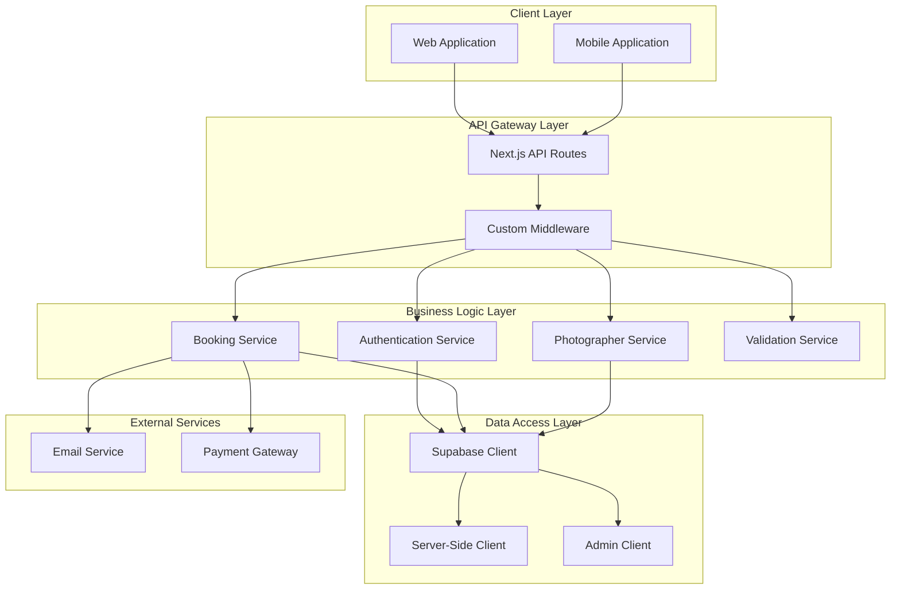
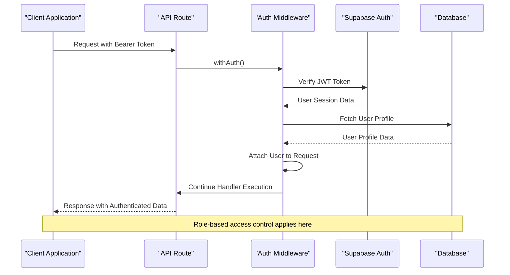
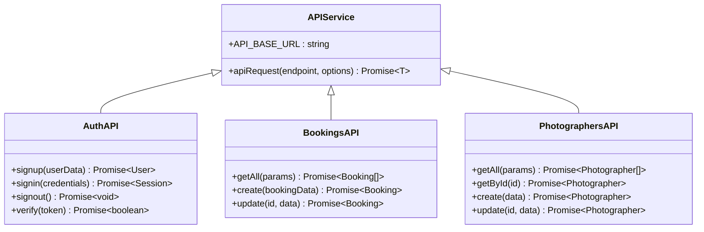
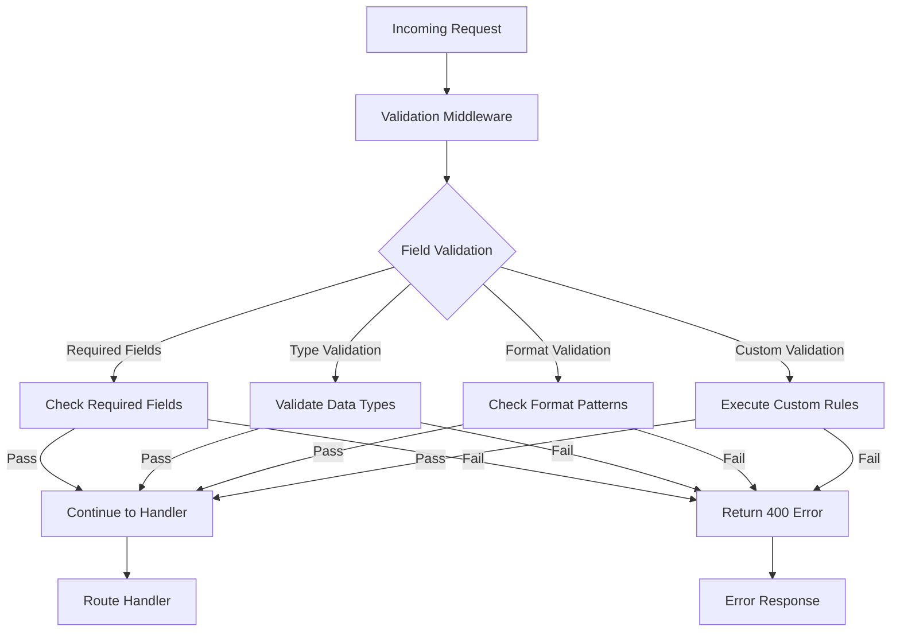
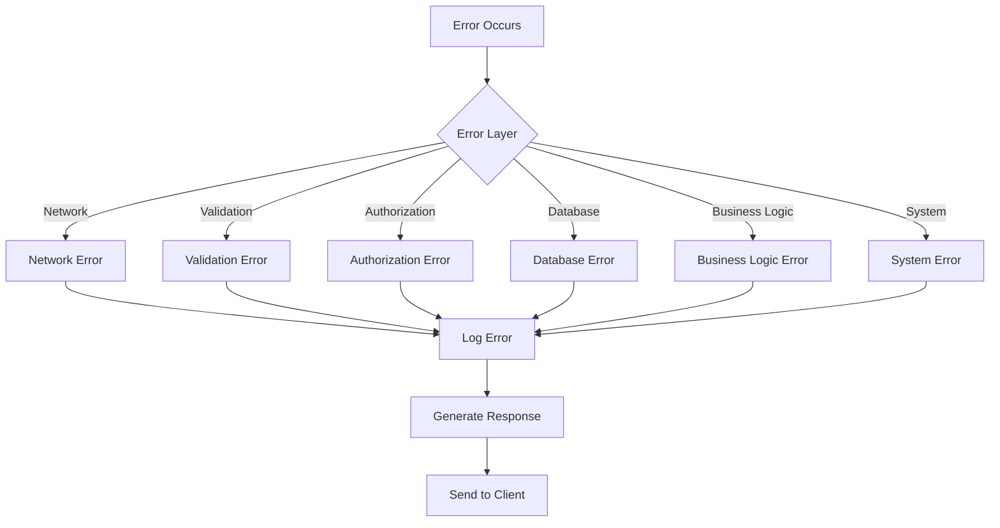

# Backend Architecture Documentation

<cite>
**Referenced Files in This Document**
- [package.json](file://package.json)
- [src/middleware/auth.ts](file://src/middleware/auth.ts)
- [src/lib/supabase.ts](file://src/lib/supabase.ts)
- [src/lib/api.ts](file://src/lib/api.ts)
- [src/middleware/validation.ts](file://src/middleware/validation.ts)
- [src/lib/supabase-server.ts](file://src/lib/supabase-server.ts)
- [pages/api/auth/signin.ts](file://pages/api/auth/signin.ts)
- [pages/api/auth/signup.ts](file://pages/api/auth/signup.ts)
- [pages/api/auth/update-role.ts](file://pages/api/auth/update-role.ts)
- [pages/api/bookings/index.ts](file://pages/api/bookings/index.ts)
- [pages/api/bookings/availability.ts](file://pages/api/bookings/availability.ts)
- [pages/api/bookings/[id].ts](file://pages/api/bookings/[id].ts)
- [pages/api/photographers/index.ts](file://pages/api/photographers/index.ts)
- [pages/api/photographers/[id].ts](file://pages/api/photographers/[id].ts)
</cite>

## Table of Contents
1. [Introduction](#introduction)
2. [System Architecture Overview](#system-architecture-overview)
3. [Next.js API Routes Structure](#nextjs-api-routes-structure)
4. [Authentication and Authorization](#authentication-and-authorization)
5. [API Organization by Domain](#api-organization-by-domain)
6. [Service Layer Pattern](#service-layer-pattern)
7. [Supabase Integration](#supabase-integration)
8. [Middleware and Validation](#middleware-and-validation)
9. [Security Considerations](#security-considerations)
10. [Error Handling Strategies](#error-handling-strategies)
11. [Performance and Scalability](#performance-and-scalability)
12. [Conclusion](#conclusion)

## Introduction

The SnapEvent platform utilizes a modern backend architecture built on Next.js API routes, leveraging Supabase as the primary database and authentication provider. This architecture implements a service layer pattern for client-server communication while maintaining strict role-based access control and comprehensive validation mechanisms.

The system is designed around three core domains: authentication (auth), bookings management (bookings), and photographer profiles (photographers). Each domain operates independently yet integrates seamlessly through shared Supabase infrastructure and common middleware patterns.

## System Architecture Overview

The backend follows a layered architecture pattern with clear separation of concerns:



**Diagram sources**
- [src/middleware/auth.ts](file://src/middleware/auth.ts#L1-L96)
- [src/lib/supabase.ts](file://src/lib/supabase.ts#L1-L242)
- [src/lib/api.ts](file://src/lib/api.ts#L1-L261)

## Next.js API Routes Structure

The backend implements Next.js API routes as the primary backend layer, organized into three main domains:

### Directory Structure

```
pages/api/
├── auth/
│   ├── signin.ts
│   ├── signup.ts
│   ├── signout.ts
│   ├── update-role.ts
│   └── verify.ts
├── bookings/
│   ├── [id].ts
│   ├── availability.ts
│   └── index.ts
└── photographers/
    ├── [id].ts
    └── index.ts
```

### Route Patterns

The API routes follow Next.js convention with support for dynamic routing:

- **Static Routes**: `/api/auth/signin`, `/api/auth/signup`
- **Dynamic Routes**: `/api/bookings/[id]`, `/api/photographers/[id]`
- **Parameterized Routes**: `/api/bookings?status=pending&limit=10`

### Request/Response Pattern

Each API route follows a consistent pattern:

```typescript
export default async function handler(req: NextApiRequest, res: NextApiResponse) {
  if (req.method === 'GET') {
    return getHandler(req, res);
  } else if (req.method === 'POST') {
    return postHandler(req, res);
  }
  // Handle other methods...
}
```

**Section sources**
- [pages/api/auth/signin.ts](file://pages/api/auth/signin.ts#L1-L64)
- [pages/api/bookings/index.ts](file://pages/api/bookings/index.ts#L1-L208)
- [pages/api/photographers/index.ts](file://pages/api/photographers/index.ts#L1-L163)

## Authentication and Authorization

The authentication system is built on Supabase Auth with custom middleware for role-based access control:

### Authentication Flow



**Diagram sources**
- [src/middleware/auth.ts](file://src/middleware/auth.ts#L15-L50)
- [src/lib/supabase.ts](file://src/lib/supabase.ts#L1-L50)

### Role-Based Access Control

The system implements hierarchical role-based access control:

```typescript
// Role-based middleware decorators
export function withRole(requiredRole: string) {
  return function(handler: (req: AuthenticatedRequest, res: NextApiResponse) => Promise<void>) {
    return withAuth(async (req: AuthenticatedRequest, res: NextApiResponse) => {
      if (!req.user) {
        return res.status(401).json({ error: 'User not authenticated' })
      }

      if (req.user.role !== requiredRole && req.user.role !== 'ADMIN') {
        return res.status(403).json({ error: 'Insufficient permissions' })
      }

      return handler(req, res)
    })
  }
}
```

### Supported Roles

- **CLIENT**: Basic user with booking and profile access
- **PHOTOGRAPHER**: Content creator with profile management
- **ADMIN**: Full administrative access across all domains

**Section sources**
- [src/middleware/auth.ts](file://src/middleware/auth.ts#L52-L96)
- [src/lib/supabase.ts](file://src/lib/supabase.ts#L20-L35)

## API Organization by Domain

### Authentication Domain (/api/auth)

Handles user authentication and authorization:

#### Endpoints

- **POST /api/auth/signup**: Creates new user accounts with email verification
- **POST /api/auth/signin**: Authenticates users and returns session data
- **POST /api/auth/signout**: Ends user sessions
- **POST /api/auth/update-role**: Updates user roles (admin-only)
- **POST /api/auth/verify**: Verifies email addresses

#### Implementation Details

```typescript
// Example signup handler with validation
export default withValidation([
  commonValidations.email,
  commonValidations.password,
  commonValidations.firstName,
  commonValidations.lastName,
  {
    field: 'phone',
    required: true,
    type: 'string',
    pattern: /^\+?[\d\s\-\(\)]+$/
  }
])(signupHandler)
```

### Bookings Domain (/api/bookings)

Manages booking lifecycle and availability:

#### Endpoints

- **GET /api/bookings**: Retrieves paginated bookings with filtering
- **POST /api/bookings**: Creates new bookings with conflict detection
- **GET /api/bookings/[id]**: Retrieves individual booking details
- **PATCH /api/bookings/[id]**: Updates booking status with notifications
- **DELETE /api/bookings/[id]**: Deletes bookings
- **GET /api/bookings/availability**: Checks photographer availability

#### Booking Management Features

- **Conflict Detection**: Prevents double booking by checking existing confirmed/pending bookings
- **Real-time Notifications**: Sends email notifications for status changes
- **Status Tracking**: Supports PENDING, CONFIRMED, DECLINED, CANCELLED statuses
- **Pagination**: Implements cursor-based pagination for large datasets

### Photographers Domain (/api/photographers)

Handles photographer profiles and listings:

#### Endpoints

- **GET /api/photographers**: Lists approved photographers with filters
- **POST /api/photographers**: Creates photographer profiles
- **GET /api/photographers/[id]**: Retrieves individual profiles
- **PUT /api/photographers/[id]**: Updates photographer profiles
- **DELETE /api/photographers/[id]**: Deletes profiles

#### Photographer Features

- **Application Status**: Tracks PENDING, APPROVED, REJECTED, SUSPENDED statuses
- **Specialties**: Supports multiple photography specialties
- **Services**: Manages customizable service offerings
- **Portfolio**: Handles image galleries and featured content
- **Ratings**: Maintains review and rating systems

**Section sources**
- [pages/api/auth/signup.ts](file://pages/api/auth/signup.ts#L1-L80)
- [pages/api/bookings/index.ts](file://pages/api/bookings/index.ts#L1-L208)
- [pages/api/photographers/index.ts](file://pages/api/photographers/index.ts#L1-L163)

## Service Layer Pattern

The application implements a service layer pattern through the `src/lib/api.ts` module, providing a centralized interface for client-server communication:

### API Service Architecture



**Diagram sources**
- [src/lib/api.ts](file://src/lib/api.ts#L1-L261)

### Service Implementation

```typescript
// Generic API request function
async function apiRequest<T>(
  endpoint: string,
  options: RequestInit = {}
): Promise<T> {
  const url = `${API_BASE_URL}/api${endpoint}`;
  
  const config: RequestInit = {
    headers: {
      'Content-Type': 'application/json',
      ...options.headers,
    },
    ...options,
  };

  try {
    const response = await fetch(url, config);
    
    if (!response.ok) {
      const errorData = await response.json().catch(() => ({}));
      throw new Error(errorData.error || `HTTP error! status: ${response.status}`);
    }
    
    return await response.json();
  } catch (error) {
    console.error(`API request failed for ${endpoint}:`, error);
    throw error;
  }
}
```

### Benefits of Service Layer

1. **Centralized Error Handling**: Consistent error processing across all API calls
2. **Type Safety**: Strong typing with TypeScript interfaces
3. **Environment Abstraction**: Base URL configuration for different environments
4. **Request Normalization**: Standardized headers and request formatting
5. **Error Propagation**: Clear error messages with stack traces

**Section sources**
- [src/lib/api.ts](file://src/lib/api.ts#L1-L50)

## Supabase Integration

The system leverages Supabase as the primary database and authentication provider, utilizing both client-side and server-side configurations:

### Supabase Client Configuration

```typescript
// Client-side configuration
export const supabase = createClient(supabaseUrl, supabaseAnonKey, {
  auth: {
    autoRefreshToken: true,
    persistSession: true,
    detectSessionInUrl: true
  }
})

// Server-side configuration
export const supabaseAdmin = createClient(
  supabaseUrl,
  process.env.SUPABASE_SERVICE_ROLE_KEY!,
  {
    auth: {
      autoRefreshToken: false,
      persistSession: false
    }
  }
)
```

### Database Schema Integration

The system defines comprehensive database types for type safety:

```typescript
export type Database = {
  public: {
    Tables: {
      users: {
        Row: {
          id: string
          email: string
          first_name: string
          last_name: string
          phone: string | null
          avatar: string | null
          role: 'CLIENT' | 'PHOTOGRAPHER' | 'ADMIN'
          is_active: boolean
          created_at: string
          updated_at: string
        }
        // ... insert and update types
      }
      // ... other table definitions
    }
  }
}
```

### Real-time Capabilities

Supabase provides real-time features through webhooks and subscriptions:

- **Real-time Notifications**: Automatic notifications for booking status changes
- **Presence Tracking**: Online/offline status for photographers
- **Change Streams**: Real-time updates for profile modifications

**Section sources**
- [src/lib/supabase.ts](file://src/lib/supabase.ts#L1-L242)
- [src/lib/supabase-server.ts](file://src/lib/supabase-server.ts#L1-L108)

## Middleware and Validation

The system implements comprehensive middleware for request validation and processing:

### Validation Middleware



**Diagram sources**
- [src/middleware/validation.ts](file://src/middleware/validation.ts#L1-L161)

### Validation Rules

The validation system supports multiple validation types:

```typescript
export interface ValidationRule {
  field: string
  required?: boolean
  type?: 'string' | 'number' | 'boolean' | 'email' | 'date' | 'array'
  minLength?: number
  maxLength?: number
  min?: number
  max?: number
  pattern?: RegExp
  custom?: (value: any) => string | null
}
```

### Common Validation Patterns

```typescript
export const commonValidations = {
  email: {
    field: 'email',
    required: true,
    type: 'email' as const
  },
  password: {
    field: 'password',
    required: true,
    type: 'string' as const,
    minLength: 6
  },
  firstName: {
    field: 'firstName',
    required: true,
    type: 'string' as const,
    minLength: 1,
    maxLength: 50
  }
}
```

**Section sources**
- [src/middleware/validation.ts](file://src/middleware/validation.ts#L1-L161)

## Security Considerations

### Authentication Security

1. **JWT Token Validation**: All requests require valid Bearer tokens
2. **Token Expiration**: Automatic token refresh with secure storage
3. **Session Management**: Secure session handling with persistence controls
4. **CSRF Protection**: Built-in CSRF protection through Supabase

### Authorization Security

1. **Role-Based Access Control**: Strict permission checks for each endpoint
2. **Resource Ownership**: Users can only modify their own resources
3. **Admin Escalation**: Administrative actions require ADMIN role
4. **Audit Logging**: Comprehensive logging for security events

### Data Security

1. **Encryption**: Data encrypted in transit and at rest
2. **Input Sanitization**: Comprehensive input validation prevents injection attacks
3. **Output Encoding**: Proper encoding for all responses
4. **CORS Configuration**: Strict CORS policies for cross-origin requests

### Rate Limiting Potential

While not explicitly implemented, the system can benefit from:

1. **Request Rate Limiting**: Per-user and per-endpoint limits
2. **IP-based Throttling**: Protection against abuse
3. **Burst Protection**: Handling traffic spikes gracefully
4. **Quota Management**: Resource usage monitoring and limits

## Error Handling Strategies

### Error Classification

The system implements comprehensive error handling across multiple layers:



### Error Response Patterns

```typescript
// Standard error response format
interface ErrorResponse {
  error: string;
  details?: string[];
  statusCode: number;
}

// Example error handling in API routes
try {
  // Business logic
} catch (error) {
  console.error('API error:', error);
  return res.status(500).json({ 
    error: 'Internal server error',
    details: process.env.NODE_ENV === 'development' ? [error.message] : undefined 
  });
}
```

### Error Categories

1. **Client Errors (4xx)**: Validation failures, authentication issues
2. **Server Errors (5xx)**: Internal server errors, database failures
3. **Business Logic Errors**: Conflict detection, validation failures
4. **System Errors**: Infrastructure issues, external service failures

**Section sources**
- [pages/api/auth/signin.ts](file://pages/api/auth/signin.ts#L40-L64)
- [pages/api/bookings/index.ts](file://pages/api/bookings/index.ts#L180-L208)

## Performance and Scalability

### Database Optimization

1. **Indexing Strategy**: Strategic indexing on frequently queried fields
2. **Query Optimization**: Efficient queries with proper joins and selects
3. **Caching**: Implement caching for frequently accessed data
4. **Connection Pooling**: Optimized database connection management

### API Performance

1. **Response Caching**: Cacheable responses for static data
2. **Pagination**: Efficient pagination for large datasets
3. **Selective Loading**: Load only required data with proper projections
4. **Batch Operations**: Group related operations when possible

### Scalability Considerations

1. **Horizontal Scaling**: Stateless API routes support horizontal scaling
2. **Load Balancing**: Distribute traffic across multiple instances
3. **CDN Integration**: Static assets served through CDN
4. **Database Replication**: Read replicas for improved performance

### Monitoring and Observability

1. **Request Tracing**: Track requests through the system
2. **Performance Metrics**: Monitor response times and throughput
3. **Error Rates**: Track and alert on error rates
4. **Resource Utilization**: Monitor CPU, memory, and database usage

## Conclusion

The SnapEvent backend architecture demonstrates a modern, scalable approach to building API-driven applications with Next.js and Supabase. The system successfully implements:

- **Clean Architecture**: Clear separation of concerns with well-defined layers
- **Security First**: Comprehensive authentication, authorization, and validation
- **Developer Experience**: Strong typing, consistent patterns, and comprehensive error handling
- **Scalability**: Designed for growth with proper optimization strategies
- **Maintainability**: Modular design with reusable components and middleware

The service layer pattern in `src/lib/api.ts` provides excellent abstraction for client-server communication, while the middleware system ensures consistent validation and security across all endpoints. The integration with Supabase offers robust database capabilities with minimal operational overhead.

Future enhancements could include implementing rate limiting, adding comprehensive monitoring, and expanding the real-time capabilities for improved user experience. The current architecture provides a solid foundation for continued development and scaling.