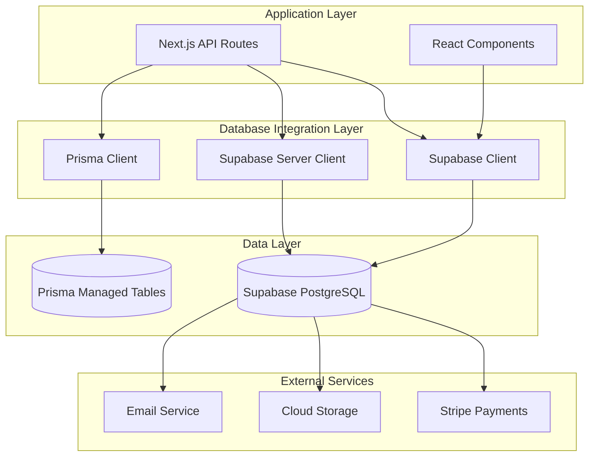
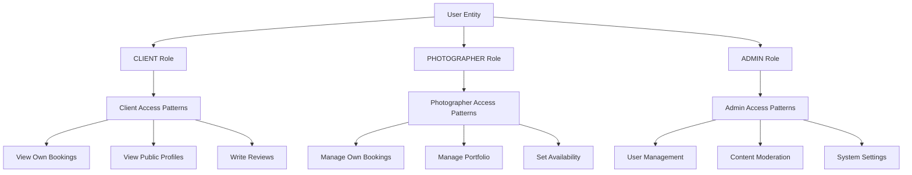
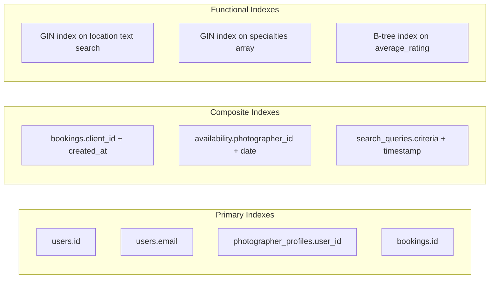
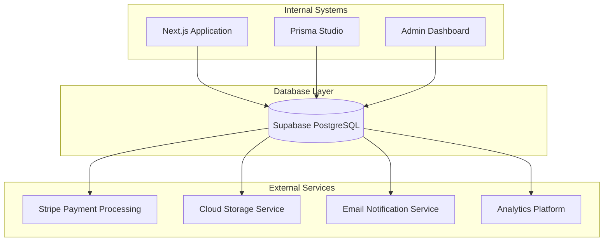

# Database Integration Layer Architecture

<cite>
**Referenced Files in This Document**
- [DATABASE_DESIGN.md](file://DATABASE_DESIGN.md)
- [src/lib/supabase.ts](file://src/lib/supabase.ts)
- [src/lib/supabase-server.ts](file://src/lib/supabase-server.ts)
- [prisma/seed.ts](file://prisma/seed.ts)
- [pages/api/bookings/index.ts](file://pages/api/bookings/index.ts)
- [pages/api/photographers/index.ts](file://pages/api/photographers/index.ts)
- [package.json](file://package.json)
- [SUPABASE_SETUP.md](file://SUPABASE_SETUP.md)
- [SETUP_GUIDE.md](file://SETUP_GUIDE.md)
</cite>

## Table of Contents
1. [Introduction](#introduction)
2. [Database Architecture Overview](#database-architecture-overview)
3. [Supabase Client Implementation](#supabase-client-implementation)
4. [Prisma Schema Management](#prisma-schema-management)
5. [Data Access Patterns](#data-access-patterns)
6. [Security and Row-Level Security](#security-and-row-level-security)
7. [Performance Considerations](#performance-considerations)
8. [Schema Evolution Strategy](#schema-evolution-strategy)
9. [Integration Points](#integration-points)
10. [Troubleshooting Guide](#troubleshooting-guide)
11. [Conclusion](#conclusion)

## Introduction

The SnapEvent database integration layer provides a robust, scalable foundation for a comprehensive photography marketplace platform. The architecture leverages Supabase as the primary datastore with PostgreSQL backend, combined with Prisma for schema management and seeding operations. This dual-layer approach ensures optimal performance, developer productivity, and maintainability.

The database design supports complex relationships between users, photographers, bookings, services, and various business entities while maintaining real-time capabilities and strong security controls. The integration enables seamless data access patterns from API routes to database queries, with sophisticated filtering, sorting, and relationship handling capabilities.

## Database Architecture Overview

The database architecture follows a hybrid approach combining Supabase's managed PostgreSQL service with Prisma's powerful ORM capabilities. This design provides the benefits of both managed infrastructure and developer-friendly schema management.



**Diagram sources**
- [src/lib/supabase.ts](file://src/lib/supabase.ts#L1-L242)
- [src/lib/supabase-server.ts](file://src/lib/supabase-server.ts#L1-L108)

The architecture supports multiple data access patterns:

- **Real-time Capabilities**: Supabase's built-in real-time subscriptions
- **REST API Integration**: Supabase's REST API endpoints
- **Direct SQL Queries**: Prisma's type-safe query interface
- **Batch Operations**: Prisma's efficient bulk operations

**Section sources**
- [DATABASE_DESIGN.md](file://DATABASE_DESIGN.md#L1-L50)
- [src/lib/supabase.ts](file://src/lib/supabase.ts#L1-L30)

## Supabase Client Implementation

The Supabase client implementation provides a comprehensive abstraction layer for database operations, supporting both client-side and server-side access patterns with appropriate security configurations.

### Client-Side Configuration

The client-side Supabase client is configured for optimal user experience with automatic session management and persistence:

```typescript
export const supabase = createClient(supabaseUrl, supabaseAnonKey, {
  auth: {
    autoRefreshToken: true,
    persistSession: true,
    detectSessionInUrl: true
  }
})
```

This configuration enables:
- **Automatic Token Refresh**: Seamless session continuation across browser sessions
- **Session Persistence**: Maintains user state even after page reloads
- **URL Session Detection**: Automatically detects authentication state from URL parameters

### Server-Side Configuration

The server-side client uses a service role key for administrative operations with strict security settings:

```typescript
export const supabaseAdmin = createClient(
  supabaseUrl,
  process.env.SUPABASE_SERVICE_ROLE_KEY!,
  {
    auth: {
      autoRefreshToken: false,
      persistSession: false
    }
  }
)
```

Key security features:
- **Disabled Auto Refresh**: Prevents token leakage in server environments
- **No Session Persistence**: Ensures clean session management
- **Service Role Authentication**: Provides elevated privileges for administrative tasks

### Type Safety and Database Schema

The Supabase client includes comprehensive TypeScript type definitions automatically generated from the database schema:

```typescript
export type Database = {
  public: {
    Tables: {
      users: {
        Row: {
          id: string
          email: string
          first_name: string
          last_name: string
          phone: string | null
          avatar: string | null
          role: 'CLIENT' | 'PHOTOGRAPHER' | 'ADMIN'
          is_active: boolean
          created_at: string
          updated_at: string
        }
        // ... additional table definitions
      }
    }
  }
}
```

**Section sources**
- [src/lib/supabase.ts](file://src/lib/supabase.ts#L1-L242)
- [src/lib/supabase-server.ts](file://src/lib/supabase-server.ts#L1-L108)

## Prisma Schema Management

Prisma serves as the primary schema management tool, providing type-safe database operations and automated migration capabilities. The schema defines the complete database structure with relationships, constraints, and data types.

### Schema Structure and Relationships

The Prisma schema defines core entities and their relationships:

```mermaid
erDiagram
USERS {
string id PK
string email UK
string first_name
string last_name
string phone
string avatar
enum role
boolean is_active
timestamp created_at
timestamp updated_at
}
PHOTOGRAPHER_PROFILES {
string id PK
string user_id FK
string business_name
string title
string bio
string location
string website
string portfolio_url
string instagram_handle
int years_experience
boolean is_verified
boolean is_available
string response_time
int total_clients
float average_rating
int total_reviews
string profile_image
string cover_image
enum application_status
timestamp application_date
timestamp approved_at
string approved_by
timestamp created_at
timestamp updated_at
}
SERVICES {
string id PK
string photographer_id FK
string name
string description
decimal price
int duration
json deliverables
timestamp created_at
timestamp updated_at
}
BOOKINGS {
string id PK
string client_id FK
string photographer_id FK
string service_id FK
enum event_type
date event_date
time event_time
string event_location
int duration
int guest_count
string special_requests
decimal total_amount
decimal deposit_amount
string client_name
string client_email
string client_phone
enum status
timestamp created_at
timestamp updated_at
}
REVIEWS {
string id PK
string booking_id FK
string reviewer_id FK
string reviewee_id FK
int rating
string comment
enum status
timestamp created_at
timestamp updated_at
}
USERS ||--|| PHOTOGRAPHER_PROFILES : "has_profile"
USERS ||--o{ BOOKINGS : "creates_bookings"
USERS ||--o{ REVIEWS : "writes_reviews"
PHOTOGRAPHER_PROFILES ||--o{ SERVICES : "offers_services"
BOOKINGS ||--o{ REVIEWS : "generates_reviews"
SERVICES ||--o{ BOOKINGS : "booked_as"
```



**Diagram sources**
- [DATABASE_DESIGN.md](file://DATABASE_DESIGN.md#L50-L100)
- [prisma/seed.ts](file://prisma/seed.ts#L1-L50)

### Seed Operations

The seed script demonstrates comprehensive data population with realistic sample data:

```typescript
async function main() {
  // Create specialties
  const specialties = await Promise.all([
    prisma.specialty.create({
      data: {
        name: 'Wedding Photography',
        description: 'Capturing your special day with beautiful, timeless photos',
        icon: '💒'
      }
    }),
    // ... additional specialty creation
  ])

  // Create sample users
  const clients = await Promise.all([
    prisma.user.create({
      data: {
        email: 'john.doe@example.com',
        firstName: 'John',
        lastName: 'Doe',
        phone: '+1 (555) 123-4567',
        role: UserRole.CLIENT
      }
    })
    // ... additional user creation
  ])
}
```

The seed operation includes:
- **Specialty Categories**: Eight photography specialty categories
- **Sample Users**: Three client users and three photographer profiles
- **Realistic Data**: Comprehensive profile information with ratings and statistics
- **Relationship Data**: Properly structured relationships between entities

**Section sources**
- [prisma/seed.ts](file://prisma/seed.ts#L1-L199)
- [DATABASE_DESIGN.md](file://DATABASE_DESIGN.md#L100-L150)

## Data Access Patterns

The application implements sophisticated data access patterns that support complex querying, filtering, and relationship handling across multiple API endpoints.

### Booking Data Access Pattern

The booking API demonstrates advanced query capabilities with filtering, pagination, and relationship expansion:

```typescript
async function getBookings(req: NextApiRequest, res: NextApiResponse) {
  let query = supabase
    .from('bookings')
    .select(`
      *,
      client:users!bookings_client_id_fkey (
        id,
        email,
        first_name,
        last_name,
        avatar
      ),
      photographer:photographer_profiles!bookings_photographer_id_fkey (
        id,
        business_name,
        title,
        location,
        users (
          id,
          first_name,
          last_name,
          avatar
        )
      ),
      service:services (
        id,
        name,
        description,
        price,
        duration
      )
    `)
    .order('created_at', { ascending: false })
    .range(Number(offset), Number(offset) + Number(limit) - 1)
}
```

Key features:
- **Relationship Expansion**: Nested selects for related entities
- **Flexible Filtering**: Query parameter-based filtering
- **Pagination Support**: Range-based pagination with limit/offset
- **Sorting Control**: Dynamic ordering based on creation timestamp

### Photographer Search Pattern

The photographer search endpoint showcases advanced filtering capabilities:

```typescript
async function getPhotographers(req: NextApiRequest, res: NextApiResponse) {
  let query = supabase
    .from('photographer_profiles')
    .select(`
      *,
      users (
        id,
        email,
        first_name,
        last_name,
        avatar
      ),
      specialties (
        id,
        name
      )
    `)
    .eq('application_status', 'APPROVED')
    .eq('is_available', true)
    .order('average_rating', { ascending: false })
}
```

Advanced filtering features:
- **Status Filtering**: Application status and availability checks
- **Text Search**: ILIKE operator for location-based searches
- **Rating-based Sorting**: Descending order by average rating
- **Specialty Filtering**: JSON containment for specialty matching

### Conflict Detection Pattern

The booking creation process includes sophisticated conflict detection:

```typescript
// Check for conflicts with confirmed bookings
if (eventTime) {
  const { data: conflictingBookings, error: conflictError } = await supabase
    .from('bookings')
    .select('id, status')
    .eq('photographer_id', photographerId)
    .eq('event_date', eventDate)
    .eq('event_time', eventTime)
    .eq('status', 'confirmed');
}
```

Conflict resolution capabilities:
- **Time Slot Validation**: Prevents double-bookings
- **Status-aware Queries**: Only considers confirmed bookings
- **Efficient Indexing**: Leverages database indexes for fast lookups

**Section sources**
- [pages/api/bookings/index.ts](file://pages/api/bookings/index.ts#L1-L208)
- [pages/api/photographers/index.ts](file://pages/api/photographers/index.ts#L1-L163)

## Security and Row-Level Security

The database implementation incorporates comprehensive security measures including Row-Level Security (RLS) policies, role-based access control, and data protection mechanisms.

### Role-Based Access Control

The database schema supports three distinct user roles with appropriate access patterns:



**Diagram sources**
- [DATABASE_DESIGN.md](file://DATABASE_DESIGN.md#L15-L30)

### Row-Level Security Policies

Row-Level Security (RLS) policies ensure data isolation and privacy:

1. **User Data Isolation**: Users can only access their own data
2. **Photographer Visibility**: Only approved photographers appear in search results
3. **Booking Privacy**: Clients can only view bookings they've created
4. **Review Moderation**: Admin approval required for public reviews

### Data Protection Measures

The database implements several data protection strategies:

- **Soft Deletes**: Use of `is_active` flags instead of hard deletes
- **Audit Trails**: Timestamp tracking for all entities
- **PII Separation**: Sensitive data in separate fields for encryption
- **Role-Based Access**: Explicit permissions for different user types

**Section sources**
- [DATABASE_DESIGN.md](file://DATABASE_DESIGN.md#L180-L201)

## Performance Considerations

The database architecture incorporates numerous performance optimizations and indexing strategies to ensure optimal query performance at scale.

### Indexing Strategy

The database employs strategic indexing for optimal query performance:



**Diagram sources**
- [DATABASE_DESIGN.md](file://DATABASE_DESIGN.md#L100-L120)

### Query Performance Optimizations

Several optimization techniques are employed:

1. **Aggregate Field Caching**: Pre-calculated fields like `average_rating` and `total_reviews`
2. **Soft Deletes**: Efficient filtering using `is_active` flags
3. **JSON Fields**: Flexible metadata storage for analytics
4. **Enum Types**: Efficient category and status storage

### Connection Pooling and Scaling

The architecture supports horizontal scaling through:

- **Connection Pooling**: Supabase's built-in connection pooling
- **Read Replicas**: Automatic read replica distribution
- **Caching Layers**: Redis integration for frequently accessed data
- **CDN Integration**: Static asset delivery optimization

**Section sources**
- [DATABASE_DESIGN.md](file://DATABASE_DESIGN.md#L120-L150)

## Schema Evolution Strategy

The database schema evolution follows a structured approach that maintains backward compatibility while enabling feature development and performance improvements.

### Migration Strategy

The schema evolution follows a phased approach:

```mermaid
flowchart TD
Phase1[Phase 1: Core Features] --> UserManagement[User Management]
Phase1 --> AuthSystem[Authentication System]
Phase1 --> BasicProfiles[Basic User Profiles]
Phase2[Phase 2: Booking System] --> BookingCreation[Booking Creation]
Phase2 --> PaymentProcessing[Payment Processing]
Phase2 --> AvailabilityTracking[Availability Tracking]
Phase3[Phase 3: Advanced Features] --> MessagingSystem[Messaging System]
Phase3 --> ReviewSystem[Review & Rating System]
Phase3 --> SearchAnalytics[Search & Analytics]
Phase4[Phase 4: Optimization] --> PerformanceTuning[Performance Tuning]
Phase4 --> MobileAppSupport[Mobile App Support]
Phase4 --> AdvancedAnalytics[Advanced Analytics]
```



**Diagram sources**
- [DATABASE_DESIGN.md](file://DATABASE_DESIGN.md#L150-L180)

### Backward Compatibility

The migration strategy ensures:

- **Data Preservation**: Existing data remains intact during schema changes
- **Gradual Rollouts**: Features deployed incrementally to minimize risk
- **Rollback Capability**: Ability to revert changes if issues arise
- **Testing Infrastructure**: Comprehensive testing for each migration

### Version Control Integration

Database changes are integrated with application version control:

- **Schema Versioning**: Clear version tracking for database changes
- **Automated Testing**: Continuous integration testing for schema changes
- **Documentation Updates**: Automatic documentation generation for schema changes
- **Deployment Coordination**: Coordinated deployment of database and application changes

**Section sources**
- [DATABASE_DESIGN.md](file://DATABASE_DESIGN.md#L180-L201)

## Integration Points

The database layer integrates with multiple external services and internal systems to provide a comprehensive platform solution.

### External Service Integrations



**Diagram sources**
- [DATABASE_DESIGN.md](file://DATABASE_DESIGN.md#L150-L180)

### Webhook Support

The database supports webhook notifications for real-time updates:

- **Payment Webhooks**: Stripe payment status updates
- **Booking Updates**: Real-time booking status changes
- **Message Notifications**: Push notification triggers
- **System Events**: Administrative action notifications

### API Integration Points

Multiple API integration points enable seamless data exchange:

- **REST API Endpoints**: Supabase's native REST API
- **GraphQL Interface**: Supabase's GraphQL capabilities
- **Webhook Endpoints**: External service integration
- **Batch Processing APIs**: Large-scale data operations

**Section sources**
- [DATABASE_DESIGN.md](file://DATABASE_DESIGN.md#L180-L201)

## Troubleshooting Guide

Common database integration issues and their solutions:

### Connection Issues

**Problem**: `P1001: Can't reach database server`

**Solutions**:
1. **Verify Supabase Dashboard**: Check project status and connection strings
2. **Test SSL Configuration**: Try different SSL modes (`require`, `prefer`, `disable`)
3. **Network Configuration**: Ensure outbound connections to port 5432 are allowed
4. **Credential Verification**: Double-check password and project ID

### Performance Issues

**Problem**: Slow query performance

**Solutions**:
1. **Index Analysis**: Review query execution plans and missing indexes
2. **Query Optimization**: Simplify complex joins and aggregations
3. **Connection Pooling**: Configure appropriate connection limits
4. **Caching Strategy**: Implement Redis caching for frequently accessed data

### Data Integrity Issues

**Problem**: Duplicate records or constraint violations

**Solutions**:
1. **Unique Constraints**: Review and optimize unique constraints
2. **Conflict Resolution**: Implement proper conflict detection logic
3. **Transaction Management**: Use transactions for complex operations
4. **Validation Logic**: Add client-side validation before database operations

### Security Issues

**Problem**: Unauthorized access or data exposure

**Solutions**:
1. **RLS Policies**: Review and update Row-Level Security policies
2. **Role Permissions**: Verify user role assignments and permissions
3. **API Security**: Implement proper API authentication and authorization
4. **Data Encryption**: Enable encryption for sensitive data fields

**Section sources**
- [SUPABASE_SETUP.md](file://SUPABASE_SETUP.md#L50-L100)
- [src/lib/supabase.ts](file://src/lib/supabase.ts#L1-L30)

## Conclusion

The SnapEvent database integration layer provides a robust, scalable foundation for a comprehensive photography marketplace platform. The architecture successfully combines Supabase's managed PostgreSQL service with Prisma's powerful ORM capabilities, delivering optimal performance, developer productivity, and maintainability.

Key strengths of the implementation include:

- **Dual-Layer Architecture**: Combines Supabase's real-time capabilities with Prisma's developer-friendly schema management
- **Comprehensive Security**: Implements Row-Level Security, role-based access control, and data protection measures
- **Scalable Design**: Supports horizontal scaling through connection pooling and read replicas
- **Developer Productivity**: Provides type-safe operations, automated migrations, and comprehensive tooling
- **Performance Optimization**: Implements strategic indexing, caching, and query optimization techniques

The modular design enables easy maintenance and feature development while ensuring data integrity and security. The comprehensive seed data and migration strategy facilitate rapid development and testing cycles.

Future enhancements could include advanced analytics capabilities, machine learning integrations for recommendation systems, and expanded mobile app support. The current architecture provides a solid foundation for these future developments while maintaining backward compatibility and system stability.