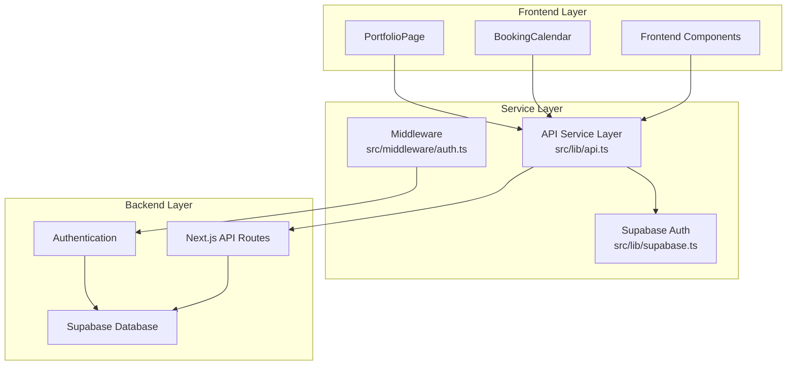

# Service Layer Architecture

<cite>
**Referenced Files in This Document**
- [src/lib/api.ts](file://src/lib/api.ts)
- [src/lib/supabase.ts](file://src/lib/supabase.ts)
- [src/components/BookingCalendar.tsx](file://src/components/BookingCalendar.tsx)
- [src/components/PortfolioPage.tsx](file://src/components/PortfolioPage.tsx)
- [src/middleware/auth.ts](file://src/middleware/auth.ts)
- [pages/api/bookings/index.ts](file://pages/api/bookings/index.ts)
- [pages/api/photographers/index.ts](file://pages/api/photographers/index.ts)
</cite>

## Table of Contents
1. [Introduction](#introduction)
2. [Architecture Overview](#architecture-overview)
3. [Core Service Layer Components](#core-service-layer-components)
4. [API Service Layer Implementation](#api-service-layer-implementation)
5. [Supabase Integration](#supabase-integration)
6. [Type Safety and TypeScript Interfaces](#type-safety-and-typescript-interfaces)
7. [Usage Patterns and Examples](#usage-patterns-and-examples)
8. [Error Handling and Retry Logic](#error-handling-and-retry-logic)
9. [Performance Optimization Strategies](#performance-optimization-strategies)
10. [Security Considerations](#security-considerations)
11. [Best Practices](#best-practices)
12. [Conclusion](#conclusion)

## Introduction

The SnapEvent application employs a sophisticated service layer architecture that provides a clean abstraction between frontend components and backend services. This architecture centers around `src/lib/api.ts` as the primary HTTP client for frontend-backend communication, offering type-safe API interactions, centralized request configuration, and robust error handling.

The service layer pattern serves as a crucial intermediary that:
- **Abstracts API endpoints** into manageable service modules
- **Handles request configuration** consistently across the application
- **Provides centralized error interception** and logging
- **Integrates seamlessly** with Supabase client for authentication and database operations
- **Ensures type safety** through comprehensive TypeScript interfaces

## Architecture Overview

The service layer follows a layered architecture pattern that separates concerns and promotes maintainability:



**Diagram sources**
- [src/lib/api.ts](file://src/lib/api.ts#L1-L261)
- [src/lib/supabase.ts](file://src/lib/supabase.ts#L1-L242)
- [src/middleware/auth.ts](file://src/middleware/auth.ts#L1-L96)

## Core Service Layer Components

### API Service Module (`src/lib/api.ts`)

The API service module serves as the central hub for all HTTP communications, providing a unified interface for interacting with backend endpoints.

```typescript
// Central API service configuration
const API_BASE_URL = process.env.NEXT_PUBLIC_APP_URL || 'http://localhost:3000';

// Generic API request function with type safety
async function apiRequest<T>(
  endpoint: string,
  options: RequestInit = {}
): Promise<T> {
  const url = `${API_BASE_URL}/api${endpoint}`;
  
  const config: RequestInit = {
    headers: {
      'Content-Type': 'application/json',
      ...options.headers,
    },
    ...options,
  };

  try {
    const response = await fetch(url, config);
    
    if (!response.ok) {
      const errorData = await response.json().catch(() => ({}));
      throw new Error(errorData.error || `HTTP error! status: ${response.status}`);
    }
    
    return await response.json();
  } catch (error) {
    console.error(`API request failed for ${endpoint}:`, error);
    throw error;
  }
}
```

### Supabase Client Integration (`src/lib/supabase.ts`)

The Supabase integration provides dual-client support for both client-side and server-side operations:

```typescript
// Client-side Supabase client with automatic session management
export const supabase = createClient(supabaseUrl, supabaseAnonKey, {
  auth: {
    autoRefreshToken: true,
    persistSession: true,
    detectSessionInUrl: true
  }
});

// Server-side Supabase client with service role key
export const supabaseAdmin = createClient(
  supabaseUrl,
  process.env.SUPABASE_SERVICE_ROLE_KEY!,
  {
    auth: {
      autoRefreshToken: false,
      persistSession: false
    }
  }
);
```

**Section sources**
- [src/lib/api.ts](file://src/lib/api.ts#L1-L30)
- [src/lib/supabase.ts](file://src/lib/supabase.ts#L1-L25)

## API Service Layer Implementation

### Authentication Services

The authentication service provides comprehensive user lifecycle management:

```typescript
export const authAPI = {
  signup: async (userData: {
    email: string;
    password: string;
    firstName: string;
    lastName: string;
  }) => {
    return apiRequest('/auth/signup', {
      method: 'POST',
      body: JSON.stringify(userData),
    });
  },

  signin: async (credentials: {
    email: string;
    password: string;
  }) => {
    return apiRequest('/auth/signin', {
      method: 'POST',
      body: JSON.stringify(credentials),
    });
  },

  signout: async () => {
    return apiRequest('/auth/signout', {
      method: 'POST',
    });
  },

  verify: async (token: string) => {
    return apiRequest('/auth/verify', {
      method: 'POST',
      body: JSON.stringify({ token }),
    });
  },
};
```

### Photographer Services

Photographer services handle CRUD operations with advanced filtering capabilities:

```typescript
export const photographersAPI = {
  getAll: async (params?: {
    location?: string;
    specialty?: string;
    limit?: number;
    offset?: number;
  }): Promise<{ photographers: Photographer[] }> => {
    const searchParams = new URLSearchParams();
    if (params?.location) searchParams.append('location', params.location);
    if (params?.specialty) searchParams.append('specialty', params.specialty);
    if (params?.limit) searchParams.append('limit', params.limit.toString());
    if (params?.offset) searchParams.append('offset', params.offset.toString());
    
    const queryString = searchParams.toString();
    const endpoint = queryString ? `/photographers?${queryString}` : '/photographers';
    
    return apiRequest<{ photographers: Photographer[] }>(endpoint);
  },

  getById: async (id: string): Promise<Photographer> => {
    return apiRequest<Photographer>(`/photographers/${id}`);
  },

  create: async (photographerData: PhotographerCreationData): Promise<{ id: string }> => {
    return apiRequest<{ id: string }>('/photographers', {
      method: 'POST',
      body: JSON.stringify(photographerData),
    });
  },
};
```

### Booking Services

Booking services manage the complete booking lifecycle with conflict detection:

```typescript
export const bookingsAPI = {
  getAll: async (params?: {
    userId?: string;
    photographerId?: string;
    status?: string;
    limit?: number;
    offset?: number;
  }) => {
    const searchParams = new URLSearchParams();
    if (params?.userId) searchParams.append('userId', params.userId);
    if (params?.photographerId) searchParams.append('photographerId', params.photographerId);
    if (params?.status) searchParams.append('status', params.status);
    if (params?.limit) searchParams.append('limit', params.limit.toString());
    if (params?.offset) searchParams.append('offset', params.offset.toString());
    
    const queryString = searchParams.toString();
    const endpoint = queryString ? `/bookings?${queryString}` : '/bookings';
    
    return apiRequest(endpoint);
  },

  create: async (bookingData: BookingCreationData) => {
    return apiRequest('/bookings', {
      method: 'POST',
      body: JSON.stringify(bookingData),
    });
  },

  update: async (id: string, updateData: any) => {
    return apiRequest(`/bookings/${id}`, {
      method: 'PUT',
      body: JSON.stringify(updateData),
    });
  },
};
```

**Section sources**
- [src/lib/api.ts](file://src/lib/api.ts#L32-L261)

## Supabase Integration

### Authentication Middleware

The authentication middleware provides secure access control with role-based permissions:

```typescript
export function withAuth(handler: (req: AuthenticatedRequest, res: NextApiResponse) => Promise<void>) {
  return async (req: AuthenticatedRequest, res: NextApiResponse) => {
    try {
      const authHeader = req.headers.authorization
      
      if (!authHeader || !authHeader.startsWith('Bearer ')) {
        return res.status(401).json({ error: 'Missing or invalid authorization header' })
      }

      const token = authHeader.substring(7)
      const { data: { user }, error } = await supabase.auth.getUser(token)

      if (error || !user) {
        return res.status(401).json({ error: 'Invalid or expired token' })
      }

      // Get user profile from custom users table
      const { data: userProfile, error: profileError } = await supabase
        .from('users')
        .select('*')
        .eq('id', user.id)
        .single()

      if (profileError || !userProfile) {
        return res.status(404).json({ error: 'User profile not found' })
      }

      req.user = {
        id: userProfile.id,
        email: userProfile.email,
        firstName: userProfile.first_name,
        lastName: userProfile.last_name,
        role: userProfile.role
      }

      return handler(req, res)

    } catch (error) {
      console.error('Auth middleware error:', error)
      return res.status(500).json({ error: 'Internal server error' })
    }
  }
}
```

### Role-Based Access Control

The middleware supports flexible role-based access control:

```typescript
export function withRole(requiredRole: string) {
  return function(handler: (req: AuthenticatedRequest, res: NextApiResponse) => Promise<void>) {
    return withAuth(async (req: AuthenticatedRequest, res: NextApiResponse) => {
      if (!req.user) {
        return res.status(401).json({ error: 'User not authenticated' })
      }

      if (req.user.role !== requiredRole && req.user.role !== 'ADMIN') {
        return res.status(403).json({ error: 'Insufficient permissions' })
      }

      return handler(req, res)
    })
  }
}
```

**Section sources**
- [src/middleware/auth.ts](file://src/middleware/auth.ts#L15-L96)

## Type Safety and TypeScript Interfaces

### Comprehensive Type Definitions

The service layer provides extensive TypeScript interfaces for type-safe API interactions:

```typescript
// Photographer interface with comprehensive metadata
export interface Photographer {
  id: string;
  businessName: string;
  title: string;
  location: string;
  bio: string;
  specialties: string[];
  services: Array<{
    name: string;
    description: string;
    price: string;
    duration: string;
    deliverables: string;
  }>;
  portfolio: Array<{
    id: number;
    image: string;
    category: string;
    title: string;
  }>;
  rating: number;
  reviews: number;
  verified: boolean;
  image: string;
  website?: string;
  instagram?: string;
  email?: string;
  phone?: string;
  awards?: string[];
  testimonials?: Array<{
    name: string;
    event: string;
    rating: number;
    comment: string;
  }>;
}

// Booking interface with status tracking
export interface Booking {
  id: string;
  clientId: string;
  photographerId: string;
  serviceId?: string;
  eventType: string;
  eventDate: string;
  eventLocation: string;
  duration?: number;
  guestCount?: number;
  specialRequests?: string;
  totalAmount: number;
  depositAmount: number;
  status: 'PENDING' | 'CONFIRMED' | 'COMPLETED' | 'CANCELLED';
  createdAt: string;
  updatedAt: string;
  client?: {
    id: string;
    email: string;
    firstName: string;
    lastName: string;
    avatar?: string;
  };
  photographer?: {
    id: string;
    businessName: string;
    title: string;
    location: string;
    users: {
      id: string;
      firstName: string;
      lastName: string;
      avatar?: string;
    };
  };
  service?: {
    id: string;
    name: string;
    description: string;
    price: string;
    duration: string;
  };
}
```

### Supabase Database Types

The Supabase integration includes comprehensive database type definitions:

```typescript
export type Database = {
  public: {
    Tables: {
      users: {
        Row: {
          id: string
          email: string
          first_name: string
          last_name: string
          phone: string | null
          avatar: string | null
          role: 'CLIENT' | 'PHOTOGRAPHER' | 'ADMIN'
          is_active: boolean
          created_at: string
          updated_at: string
        }
        Insert: {
          id?: string
          email: string
          first_name: string
          last_name: string
          phone?: string | null
          avatar?: string | null
          role?: 'CLIENT' | 'PHOTOGRAPHER' | 'ADMIN'
          is_active?: boolean
          created_at?: string
          updated_at?: string
        }
        Update: {
          id?: string
          email?: string
          first_name?: string
          last_name?: string
          phone?: string | null
          avatar?: string | null
          role?: 'CLIENT' | 'PHOTOGRAPHER' | 'ADMIN'
          is_active?: boolean
          created_at?: string
          updated_at?: string
        }
      }
      // Additional table definitions...
    }
  }
}
```

**Section sources**
- [src/lib/api.ts](file://src/lib/api.ts#L200-L261)
- [src/lib/supabase.ts](file://src/lib/supabase.ts#L25-L150)

## Usage Patterns and Examples

### Frontend Component Integration

Components integrate with the service layer through clean, declarative APIs:

```typescript
// PortfolioPage.tsx - Example of service layer usage
export function PortfolioPage({ photographerId, onNavigate }: PortfolioPageProps) {
  const [photographer, setPhotographer] = useState<Photographer | null>(null);

  // Fetch photographer data using service layer
  React.useEffect(() => {
    const fetchPhotographer = async () => {
      try {
        setIsLoading(true);
        const response = await photographersAPI.getById(photographerId);
        setPhotographer(response);
      } catch (error) {
        console.error('Failed to fetch photographer:', error);
        // Fallback to mock data if API fails
        setPhotographer({
          id: photographerId,
          businessName: 'Sarah Chen Photography',
          // ... mock data
        });
      } finally {
        setIsLoading(false);
      }
    };

    fetchPhotographer();
  }, [photographerId]);

  // Booking submission handler
  const handleBookingSubmit = async (bookingData: any) => {
    try {
      console.log('Booking submitted:', bookingData);
      alert(`Booking submitted successfully!`);
      setShowBookingCalendar(false);
    } catch (error) {
      console.error('Failed to submit booking:', error);
      alert('Failed to submit booking. Please try again.');
    }
  };
}
```

### Booking Management Pattern

The BookingCalendar demonstrates complex service layer interactions:

```typescript
// BookingCalendar.tsx - Advanced service layer usage
const BookingCalendar = ({
  photographerId,
  photographerName,
  photographerLocation,
  photographerPhone,
  photographerEmail,
  onBookingSubmit,
  onClose
}: BookingCalendarProps) {
  const [availableTimeSlots, setAvailableTimeSlots] = useState<TimeSlot[]>(TIME_SLOTS);

  // Check availability from API
  const checkAvailability = async (date: Date) => {
    try {
      const dateStr = format(date, 'yyyy-MM-dd');
      const response = await fetch(`/api/bookings/availability?photographerId=${photographerId}&date=${dateStr}`);
      
      if (!response.ok) {
        throw new Error('Failed to check availability');
      }
      
      const data = await response.json();
      return data.availability || TIME_SLOTS;
    } catch (error) {
      console.error('Error checking availability:', error);
      // Fallback to mock data if API fails
      const unavailableSlots = ['morning-1', 'afternoon-2', 'evening-1'];
      return TIME_SLOTS.map(slot => ({
        ...slot,
        available: !unavailableSlots.includes(slot.id)
      }));
    }
  };

  // Submit booking using API service
  const handleSubmit = async () => {
    if (!selectedDate || !selectedTimeSlot || !selectedEventType || !clientInfo.name || !clientInfo.email) {
      alert('Please fill in all required fields');
      return;
    }

    setIsSubmitting(true);
    
    try {
      const eventType = EVENT_TYPES.find(et => et.id === selectedEventType);
      const totalAmount = eventType ? eventType.basePrice + (selectedTimeSlot.price || 0) : 0;

      const bookingData: BookingData = {
        eventDate: format(selectedDate, 'yyyy-MM-dd'),
        eventTime: selectedTimeSlot.time,
        eventType: eventType?.name || '',
        eventLocation: eventLocation || photographerLocation,
        clientName: clientInfo.name,
        clientEmail: clientInfo.email,
        clientPhone: clientInfo.phone,
        totalAmount,
        notes
      };

      // Submit to booking API
      const response = await fetch('/api/bookings', {
        method: 'POST',
        headers: {
          'Content-Type': 'application/json',
        },
        body: JSON.stringify({
          photographerId,
          clientId: 'temp-client-id',
          eventType: bookingData.eventType,
          eventDate: bookingData.eventDate,
          eventTime: bookingData.eventTime,
          eventLocation: bookingData.eventLocation,
          totalAmount: bookingData.totalAmount,
          clientName: bookingData.clientName,
          clientEmail: bookingData.clientEmail,
          clientPhone: bookingData.clientPhone,
          notes: bookingData.notes,
          status: 'pending'
        }),
      });

      if (!response.ok) {
        throw new Error('Failed to submit booking');
      }

      await onBookingSubmit(bookingData);
    } catch (error) {
      console.error('Booking submission failed:', error);
      alert('Failed to submit booking. Please try again.');
    } finally {
      setIsSubmitting(false);
    }
  };
}
```

**Section sources**
- [src/components/PortfolioPage.tsx](file://src/components/PortfolioPage.tsx#L25-L100)
- [src/components/BookingCalendar.tsx](file://src/components/BookingCalendar.tsx#L100-L200)

## Error Handling and Retry Logic

### Centralized Error Management

The service layer implements comprehensive error handling with fallback mechanisms:

```typescript
// Generic API request function with robust error handling
async function apiRequest<T>(
  endpoint: string,
  options: RequestInit = {}
): Promise<T> {
  const url = `${API_BASE_URL}/api${endpoint}`;
  
  const config: RequestInit = {
    headers: {
      'Content-Type': 'application/json',
      ...options.headers,
    },
    ...options,
  };

  try {
    const response = await fetch(url, config);
    
    if (!response.ok) {
      const errorData = await response.json().catch(() => ({}));
      throw new Error(errorData.error || `HTTP error! status: ${response.status}`);
    }
    
    return await response.json();
  } catch (error) {
    console.error(`API request failed for ${endpoint}:`, error);
    throw error;
  }
}
```

### Fallback Strategies

Components implement intelligent fallback strategies when API calls fail:

```typescript
// PortfolioPage.tsx - Intelligent fallback implementation
React.useEffect(() => {
  const fetchPhotographer = async () => {
    try {
      setIsLoading(true);
      const response = await photographersAPI.getById(photographerId);
      setPhotographer(response);
    } catch (error) {
      console.error('Failed to fetch photographer:', error);
      // Fallback to mock data if API fails
      setPhotographer({
        id: photographerId,
        businessName: 'Sarah Chen Photography',
        title: 'Wedding & Portrait Photographer',
        location: 'San Francisco, CA',
        bio: 'Passionate photographer specializing in capturing authentic moments and emotions...',
        specialties: ['Wedding Photography', 'Portrait Photography', 'Engagement Sessions'],
        services: [
          {
            name: 'Wedding Photography',
            description: 'Full day coverage with 2 photographers',
            price: 'From $2,800',
            duration: '8-10 hours',
            deliverables: '500+ edited photos, online gallery, print release'
          }
        ],
        portfolio: [
          {
            id: 1,
            image: 'https://images.unsplash.com/photo-1730116309939-10a01fdf1edb',
            category: 'wedding',
            title: 'Golden Hour Wedding'
          }
        ],
        rating: 4.9,
        reviews: 127,
        verified: true,
        image: 'https://images.unsplash.com/photo-1643968612613-fd411aecd1fd'
      });
    } finally {
      setIsLoading(false);
    }
  };

  fetchPhotographer();
}, [photographerId]);
```

### Retry Mechanisms

While not explicitly implemented in the current codebase, the architecture supports easy addition of retry logic:

```typescript
// Example retry mechanism (not currently implemented)
async function apiRequestWithRetry<T>(
  endpoint: string,
  options: RequestInit = {},
  retries = 3
): Promise<T> {
  let lastError: Error;
  
  for (let i = 0; i < retries; i++) {
    try {
      return await apiRequest<T>(endpoint, options);
    } catch (error) {
      lastError = error;
      if (i < retries - 1) {
        await new Promise(resolve => setTimeout(resolve, 1000 * Math.pow(2, i)));
      }
    }
  }
  
  throw lastError;
}
```

**Section sources**
- [src/lib/api.ts](file://src/lib/api.ts#L8-L30)
- [src/components/PortfolioPage.tsx](file://src/components/PortfolioPage.tsx#L60-L85)

## Performance Optimization Strategies

### Caching Considerations

The service layer architecture supports various caching strategies:

```typescript
// Example caching wrapper (conceptual implementation)
const cache = new Map();

async function cachedApiRequest<T>(
  endpoint: string,
  options: RequestInit = {},
  ttl = 5 * 60 * 1000 // 5 minutes
): Promise<T> {
  const cacheKey = `${endpoint}-${JSON.stringify(options)}`;
  
  // Check cache
  const cached = cache.get(cacheKey);
  if (cached && Date.now() - cached.timestamp < ttl) {
    return cached.data;
  }

  // Make API request
  const data = await apiRequest<T>(endpoint, options);
  
  // Store in cache
  cache.set(cacheKey, {
    data,
    timestamp: Date.now()
  });

  return data;
}
```

### Request Optimization

The service layer optimizes requests through efficient parameter handling:

```typescript
// Efficient parameter building with minimal overhead
getAll: async (params?: {
  location?: string;
  specialty?: string;
  limit?: number;
  offset?: number;
}): Promise<{ photographers: Photographer[] }> => {
  const searchParams = new URLSearchParams();
  if (params?.location) searchParams.append('location', params.location);
  if (params?.specialty) searchParams.append('specialty', params.specialty);
  if (params?.limit) searchParams.append('limit', params.limit.toString());
  if (params?.offset) searchParams.append('offset', params.offset.toString());
  
  const queryString = searchParams.toString();
  const endpoint = queryString ? `/photographers?${queryString}` : '/photographers';
  
  return apiRequest<{ photographers: Photographer[] }>(endpoint);
},
```

### Concurrent Request Management

Components can leverage concurrent requests for improved performance:

```typescript
// Example concurrent request pattern
const fetchMultipleResources = async () => {
  const [photographer, bookings, availability] = await Promise.all([
    photographersAPI.getById(photographerId),
    bookingsAPI.getAll({ photographerId }),
    checkAvailability(currentDate)
  ]);
  
  return { photographer, bookings, availability };
};
```

## Security Considerations

### Token Management

The service layer implements secure token management through Supabase:

```typescript
// Secure token handling with automatic refresh
export const supabase = createClient(supabaseUrl, supabaseAnonKey, {
  auth: {
    autoRefreshToken: true,
    persistSession: true,
    detectSessionInUrl: true
  }
});
```

### Request Authorization

The middleware ensures proper authorization for protected endpoints:

```typescript
// Role-based authorization
export function withRole(requiredRole: string) {
  return function(handler: (req: AuthenticatedRequest, res: NextApiResponse) => Promise<void>) {
    return withAuth(async (req: AuthenticatedRequest, res: NextApiResponse) => {
      if (!req.user) {
        return res.status(401).json({ error: 'User not authenticated' })
      }

      if (req.user.role !== requiredRole && req.user.role !== 'ADMIN') {
        return res.status(403).json({ error: 'Insufficient permissions' })
      }

      return handler(req, res)
    })
  }
}
```

### Input Validation

The backend API routes implement comprehensive input validation:

```typescript
// Booking creation with strict validation
const { data: booking, error } = await supabase
  .from('bookings')
  .insert({
    client_id: clientId,
    photographer_id: photographerId,
    service_id: serviceId,
    event_type: eventType,
    event_date: eventDate,
    event_time: eventTime,
    event_location: eventLocation,
    duration,
    guest_count: guestCount,
    special_requests: specialRequests,
    total_amount: totalAmount,
    deposit_amount: depositAmount || 0,
    client_name: clientName,
    client_email: clientEmail,
    client_phone: clientPhone,
    notes: notes,
    status: status
  })
```

**Section sources**
- [src/lib/supabase.ts](file://src/lib/supabase.ts#L8-L15)
- [src/middleware/auth.ts](file://src/middleware/auth.ts#L50-L70)
- [pages/api/bookings/index.ts](file://pages/api/bookings/index.ts#L70-L120)

## Best Practices

### Service Layer Design Principles

1. **Single Responsibility**: Each service module handles a specific domain
2. **Consistent Error Handling**: Centralized error management across all services
3. **Type Safety**: Comprehensive TypeScript interfaces for all data structures
4. **Fallback Mechanisms**: Graceful degradation when APIs are unavailable
5. **Centralized Configuration**: Environment variables for all external configurations

### Component Integration Guidelines

1. **Declarative API Calls**: Components should declare what they need, not how to get it
2. **Loading States**: Proper loading indicators during API calls
3. **Error Boundaries**: Clear error messaging and recovery options
4. **Mock Data**: Fallback data when APIs fail
5. **State Management**: Proper state updates after API responses

### API Route Patterns

1. **RESTful Design**: Consistent endpoint patterns and HTTP methods
2. **Pagination Support**: Built-in pagination for list endpoints
3. **Filtering Capabilities**: Flexible query parameters for filtering
4. **Validation**: Comprehensive input validation at the route level
5. **Logging**: Centralized error logging for debugging and monitoring

## Conclusion

The SnapEvent service layer architecture demonstrates a mature approach to frontend-backend communication that prioritizes:

- **Maintainability**: Clean separation of concerns with well-defined service boundaries
- **Type Safety**: Comprehensive TypeScript interfaces ensuring compile-time error detection
- **Reliability**: Robust error handling and fallback mechanisms
- **Performance**: Optimized request patterns and potential caching strategies
- **Security**: Proper authentication and authorization mechanisms
- **Developer Experience**: Intuitive APIs that simplify frontend integration

The architecture successfully abstracts the complexity of backend services while providing developers with powerful, type-safe tools for building responsive user interfaces. The combination of the API service layer, Supabase integration, and comprehensive TypeScript interfaces creates a solid foundation for scalable web applications.

Future enhancements could include:
- Implementation of automatic retry logic with exponential backoff
- Advanced caching strategies with cache invalidation
- Rate limiting and request throttling
- Real-time updates through WebSocket integration
- Enhanced monitoring and analytics for API usage patterns

This service layer architecture serves as an excellent example of modern web development practices, balancing simplicity with power to create maintainable, scalable applications.