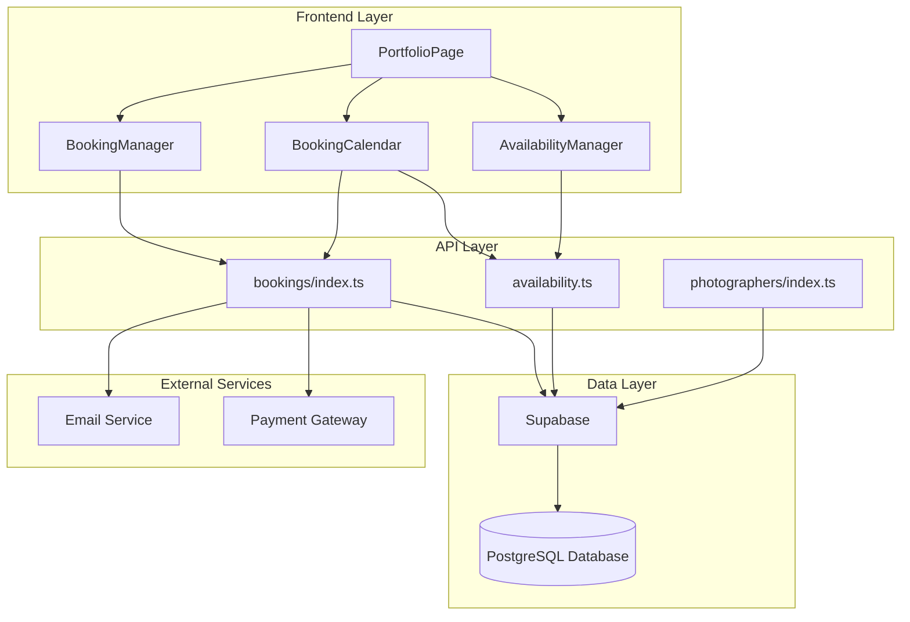
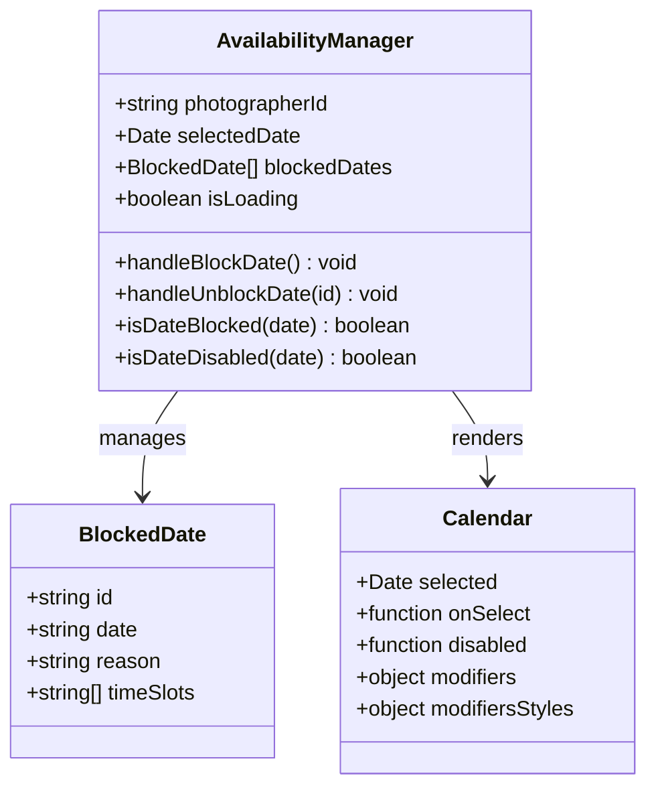
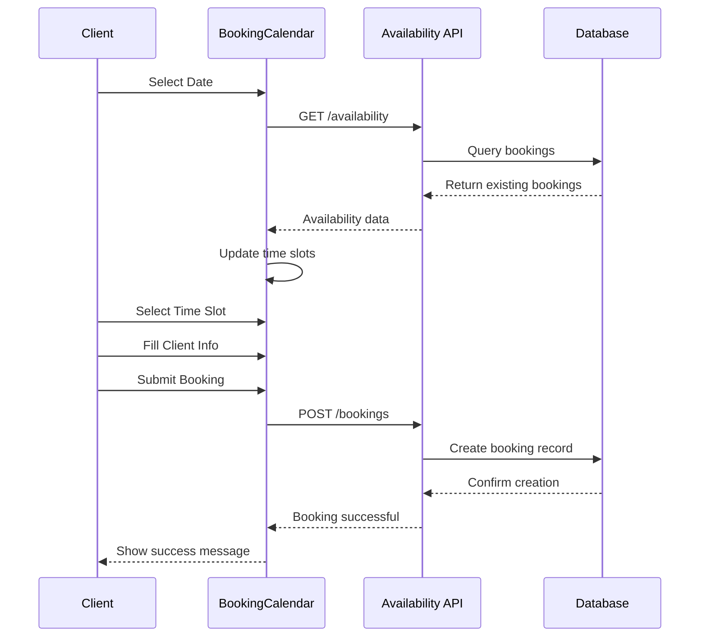
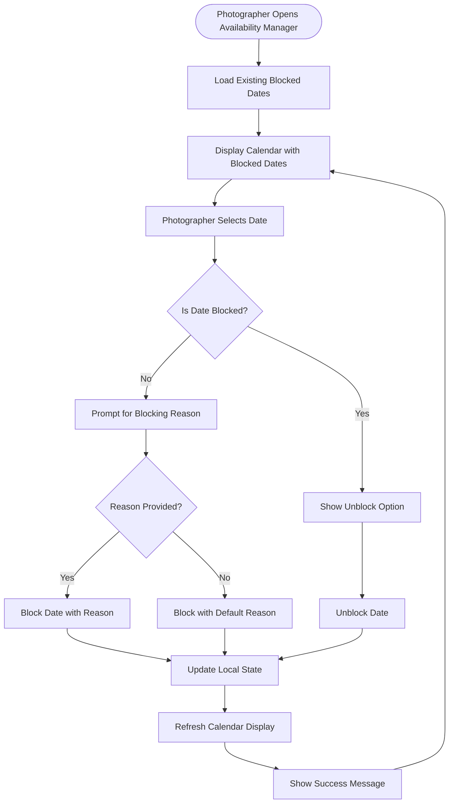
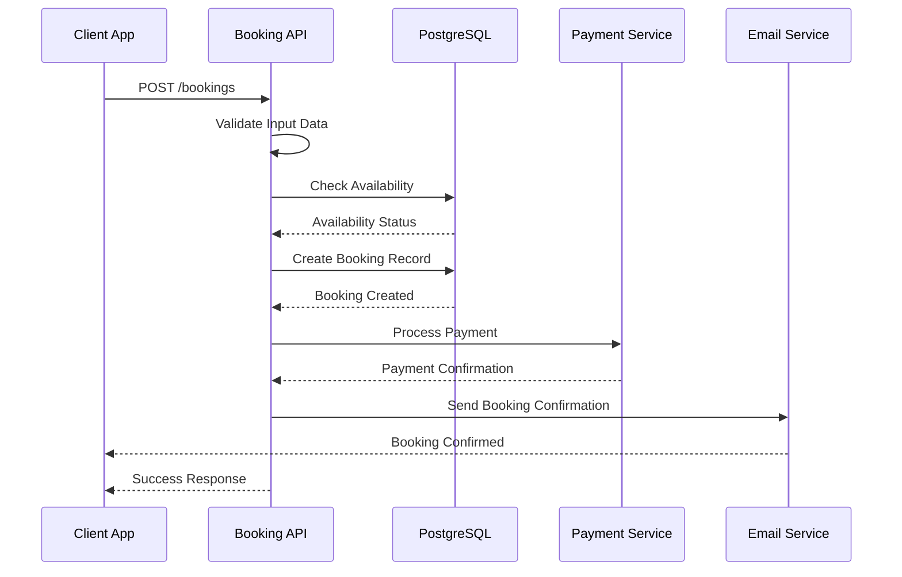
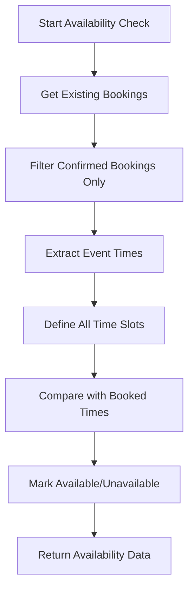

# Availability Management System

<cite>
**Referenced Files in This Document**
- [src/components/AvailabilityManager.tsx](file://src/components/AvailabilityManager.tsx)
- [pages/api/bookings/availability.ts](file://pages/api/bookings/availability.ts)
- [src/components/BookingCalendar.tsx](file://src/components/BookingCalendar.tsx)
- [src/components/BookingManager.tsx](file://src/components/BookingManager.tsx)
- [src/components/PortfolioPage.tsx](file://src/components/PortfolioPage.tsx)
- [src/lib/api.ts](file://src/lib/api.ts)
- [BOOKING_CALENDAR_GUIDE.md](file://BOOKING_CALENDAR_GUIDE.md)
- [DATABASE_DESIGN.md](file://DATABASE_DESIGN.md)
</cite>

## Table of Contents
1. [Introduction](#introduction)
2. [System Architecture](#system-architecture)
3. [Core Components](#core-components)
4. [Availability Management Workflow](#availability-management-workflow)
5. [API Integration](#api-integration)
6. [Data Structures](#data-structures)
7. [Conflict Detection](#conflict-detection)
8. [UI Components](#ui-components)
9. [State Management](#state-management)
10. [Edge Cases and Timezone Handling](#edge-cases-and-timezone-handling)
11. [Testing and Validation](#testing-and-validation)
12. [Future Enhancements](#future-enhancements)

## Introduction

The Availability Management System is a comprehensive solution built for the SnapEvent platform that enables photographers to manage their availability and allows clients to book photography services seamlessly. The system consists of multiple interconnected components that work together to provide real-time availability checking, date blocking/unblocking functionality, and robust conflict detection mechanisms.

The system is designed with a modular architecture that separates concerns between availability management, booking coordination, and user interface components. It leverages modern React patterns with TypeScript for type safety and provides both mock implementations for development and seamless integration with production APIs.

## System Architecture

The availability management system follows a layered architecture with clear separation between frontend components, API endpoints, and data persistence layers.



**Diagram sources**
- [src/components/AvailabilityManager.tsx](file://src/components/AvailabilityManager.tsx#L1-L203)
- [pages/api/bookings/availability.ts](file://pages/api/bookings/availability.ts#L1-L69)
- [src/components/BookingCalendar.tsx](file://src/components/BookingCalendar.tsx#L1-L384)

## Core Components

### AvailabilityManager Component

The AvailabilityManager serves as the primary interface for photographers to manage their availability. It provides a calendar-based interface for blocking and unblocking dates with visual indicators and comprehensive state management.



**Diagram sources**
- [src/components/AvailabilityManager.tsx](file://src/components/AvailabilityManager.tsx#L13-L25)
- [src/components/AvailabilityManager.tsx](file://src/components/AvailabilityManager.tsx#L36-L82)

### BookingCalendar Component

The BookingCalendar provides the client-facing interface for selecting dates and time slots, with real-time availability checking and comprehensive booking submission functionality.



**Diagram sources**
- [src/components/BookingCalendar.tsx](file://src/components/BookingCalendar.tsx#L100-L150)
- [pages/api/bookings/availability.ts](file://pages/api/bookings/availability.ts#L15-L45)

**Section sources**
- [src/components/AvailabilityManager.tsx](file://src/components/AvailabilityManager.tsx#L1-L203)
- [src/components/BookingCalendar.tsx](file://src/components/BookingCalendar.tsx#L1-L384)

## Availability Management Workflow

The availability management workflow encompasses the complete process from date selection to blocking/unblocking operations, with comprehensive state management and user feedback mechanisms.



**Diagram sources**
- [src/components/AvailabilityManager.tsx](file://src/components/AvailabilityManager.tsx#L36-L82)
- [src/components/AvailabilityManager.tsx](file://src/components/AvailabilityManager.tsx#L111-L147)

### Date Blocking Process

The date blocking process involves several validation steps and user interaction points:

1. **Date Selection**: Photographers select dates from the calendar interface
2. **Validation**: System checks if the date is already blocked or in the past
3. **Reason Collection**: Prompt for blocking reason with default fallback
4. **State Update**: Update local state and trigger re-render
5. **Visual Feedback**: Immediate visual indication of blocked dates

**Section sources**
- [src/components/AvailabilityManager.tsx](file://src/components/AvailabilityManager.tsx#L36-L82)

## API Integration

The system integrates with a RESTful API architecture that provides endpoints for availability checking and booking management. The API layer handles all database interactions and business logic.

### Availability Check Endpoint

The `/api/bookings/availability` endpoint provides real-time availability checking for photographers:

```typescript
// Example API Response
{
  "date": "2024-02-15",
  "photographerId": "123",
  "availability": [
    { "id": "morning-1", "time": "09:00 AM", "available": true, "price": 150 },
    { "id": "morning-2", "time": "10:00 AM", "available": false, "price": 150 }
  ],
  "totalSlots": 10,
  "availableSlots": 8
}
```

### Booking Creation Process

The booking creation process involves multiple steps with comprehensive validation:



**Diagram sources**
- [pages/api/bookings/availability.ts](file://pages/api/bookings/availability.ts#L15-L67)
- [src/components/BookingCalendar.tsx](file://src/components/BookingCalendar.tsx#L150-L200)

**Section sources**
- [pages/api/bookings/availability.ts](file://pages/api/bookings/availability.ts#L1-L69)
- [src/components/BookingCalendar.tsx](file://src/components/BookingCalendar.tsx#L150-L200)

## Data Structures

### BlockedDate Interface

The BlockedDate interface defines the structure for storing blocked dates with comprehensive metadata:

```typescript
interface BlockedDate {
  id: string;           // Unique identifier
  date: string;         // ISO date string (YYYY-MM-DD)
  reason: string;       // Reason for blocking
  timeSlots?: string[]; // Optional time slots to block
}
```

### TimeSlot Interface

The TimeSlot interface defines the structure for time slot availability:

```typescript
interface TimeSlot {
  id: string;        // Unique identifier
  time: string;      // Time string (HH:mm AM/PM)
  available: boolean; // Availability status
  price?: number;    // Optional price information
}
```

### Booking Data Structure

The booking data structure captures all necessary information for a complete booking:

```typescript
interface BookingData {
  eventDate: string;
  eventTime: string;
  eventType: string;
  eventLocation: string;
  clientName: string;
  clientEmail: string;
  clientPhone: string;
  totalAmount: number;
  notes?: string;
}
```

**Section sources**
- [src/components/AvailabilityManager.tsx](file://src/components/AvailabilityManager.tsx#L13-L25)
- [src/components/BookingCalendar.tsx](file://src/components/BookingCalendar.tsx#L20-L35)

## Conflict Detection

The system implements sophisticated conflict detection to prevent double bookings and ensure accurate availability management.

### Availability Checking Algorithm

The availability checking process follows a multi-step algorithm:



**Diagram sources**
- [pages/api/bookings/availability.ts](file://pages/api/bookings/availability.ts#L35-L67)

### Conflict Resolution Strategies

The system employs several strategies to handle conflicts:

1. **Confirmed Booking Priority**: Only confirmed bookings prevent double booking
2. **Pending Booking Flexibility**: Pending bookings can still be booked
3. **Real-time Updates**: Availability updates immediately reflect booking changes
4. **Visual Indicators**: Blocked dates are visually distinct in the calendar

**Section sources**
- [pages/api/bookings/availability.ts](file://pages/api/bookings/availability.ts#L25-L45)

## UI Components

### Calendar Integration

The system integrates with a sophisticated calendar component that provides visual feedback for blocked dates:

```typescript
// Calendar configuration with blocked date modifiers
modifiers={{
  blocked: blockedDates.map(bd => new Date(bd.date))
}}
modifiersStyles={{
  blocked: { backgroundColor: '#ef4444', color: 'white' }
}}
```

### Visual Indicators

The system provides comprehensive visual indicators for different states:

- **Blocked Dates**: Red background with white text
- **Past Dates**: Grayed out with reduced opacity
- **Available Dates**: White background with border
- **Selected Dates**: Highlighted with primary color

### User Interaction Patterns

The UI follows established patterns for intuitive user interaction:

1. **Progressive Disclosure**: Information revealed progressively
2. **Immediate Feedback**: Visual feedback for all actions
3. **Clear Call-to-Actions**: Prominent buttons for primary actions
4. **Responsive Design**: Fully responsive across all device sizes

**Section sources**
- [src/components/AvailabilityManager.tsx](file://src/components/AvailabilityManager.tsx#L111-L147)
- [src/components/BookingCalendar.tsx](file://src/components/BookingCalendar.tsx#L200-L250)

## State Management

### Local State Architecture

The system uses React's local state management with comprehensive state updates:

```typescript
const [selectedDate, setSelectedDate] = useState<Date | undefined>(undefined);
const [blockedDates, setBlockedDates] = useState<BlockedDate[]>([]);
const [isLoading, setIsLoading] = useState(false);
```

### State Update Patterns

The state update patterns ensure consistency and prevent race conditions:

1. **Batch Updates**: Related state changes are batched together
2. **Loading States**: Clear indication of asynchronous operations
3. **Error Handling**: Comprehensive error state management
4. **Fallback Mechanisms**: Graceful degradation when API calls fail

### Mock Implementation Strategy

The system includes comprehensive mock implementations for development:

```typescript
// Mock blocked dates for development
useEffect(() => {
  setBlockedDates([
    { id: '1', date: '2024-01-15', reason: 'Personal vacation' },
    { id: '2', date: '2024-01-20', reason: 'Equipment maintenance' },
  ]);
}, []);
```

**Section sources**
- [src/components/AvailabilityManager.tsx](file://src/components/AvailabilityManager.tsx#L25-L35)
- [src/components/BookingCalendar.tsx](file://src/components/BookingCalendar.tsx#L100-L150)

## Edge Cases and Timezone Handling

### Last-Minute Cancellations

The system handles last-minute cancellations through a multi-layered approach:

1. **Automatic Expiration**: Bookings expire after a timeout period
2. **Manual Cancellation**: Photographers can manually cancel bookings
3. **Client Notifications**: Automated notifications for cancellation
4. **Availability Recovery**: Automatic recovery of blocked dates

### Overlapping Events

Overlapping event prevention is handled through:

1. **Time Slot Validation**: Precise time slot boundaries
2. **Concurrent Booking Checks**: Real-time conflict detection
3. **Queue Management**: Fair queuing for popular time slots
4. **Grace Periods**: Buffer periods between events

### Timezone Considerations

The system handles timezone complexities:

1. **UTC Storage**: All dates stored in UTC format
2. **Local Display**: Automatic conversion to user's timezone
3. **Consistent Scheduling**: Standardized time zone handling
4. **Cross-Timezone Support**: Global user base compatibility

**Section sources**
- [src/components/BookingCalendar.tsx](file://src/components/BookingCalendar.tsx#L250-L300)

## Testing and Validation

### Unit Testing Strategy

The system includes comprehensive testing for all major components:

```javascript
// Example test for availability checking
async function testAvailabilityWithConfirmedBooking(photographerId) {
  const response = await fetch(`${API_BASE_URL}/bookings/availability?photographerId=${photographerId}&date=2024-02-15`);
  const data = await response.json();
  
  const confirmedSlot = data.availability.find(slot => slot.time === '10:00 AM');
  expect(confirmedSlot.available).toBe(false);
}
```

### Integration Testing

Integration tests verify the complete workflow:

1. **End-to-End Booking Flow**: Complete booking process testing
2. **API Integration Tests**: Database and API endpoint validation
3. **Mock Data Testing**: Development environment validation
4. **Error Scenario Testing**: Failure mode validation

### Validation Rules

The system enforces comprehensive validation rules:

1. **Required Field Validation**: All mandatory fields checked
2. **Date Range Validation**: Proper date range enforcement
3. **Time Slot Validation**: Valid time slot selection
4. **Business Logic Validation**: Custom business rule enforcement

**Section sources**
- [test-booking-management.js](file://test-booking-management.js#L160-L196)

## Future Enhancements

### Advanced Features

The system is designed to accommodate future enhancements:

1. **Recurring Bookings**: Support for recurring time slots
2. **Multi-Day Events**: Extended booking periods
3. **Resource Management**: Multiple resource allocation
4. **Priority Booking**: VIP booking prioritization
5. **Automated Reminders**: Intelligent reminder systems
6. **Analytics Dashboard**: Booking trend analysis
7. **Mobile App Integration**: Native mobile application support

### Performance Optimizations

Future performance improvements include:

1. **Caching Strategies**: Redis caching for frequently accessed data
2. **Database Indexing**: Optimized database indexing
3. **CDN Integration**: Static asset delivery optimization
4. **Load Balancing**: Horizontal scaling capabilities
5. **Monitoring Systems**: Comprehensive monitoring and alerting

### Security Enhancements

Security improvements planned for future releases:

1. **Enhanced Authentication**: Multi-factor authentication support
2. **Data Encryption**: End-to-end data encryption
3. **Audit Trails**: Comprehensive transaction logging
4. **Rate Limiting**: API rate limiting and throttling
5. **Security Scanning**: Automated security vulnerability scanning

The Availability Management System represents a comprehensive solution for managing photography bookings and availability. Its modular architecture, robust conflict detection, and intuitive user interface provide a solid foundation for both photographers and clients to effectively manage their booking processes.