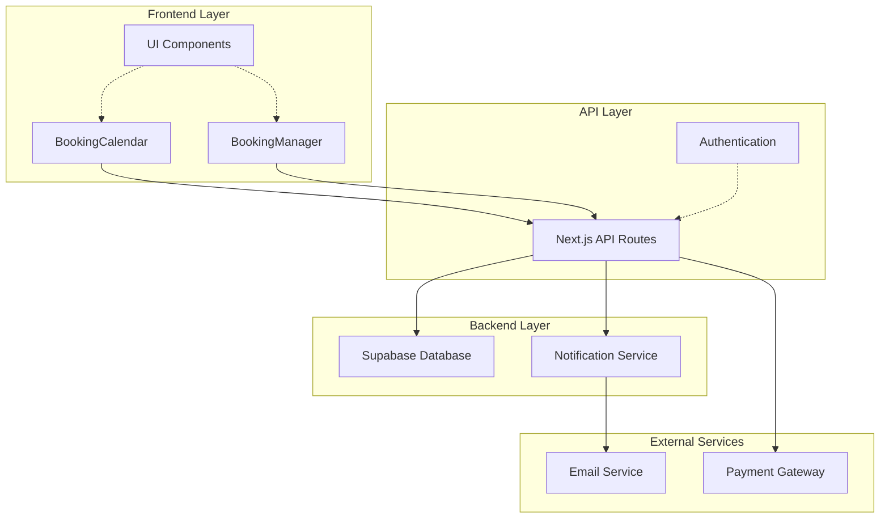
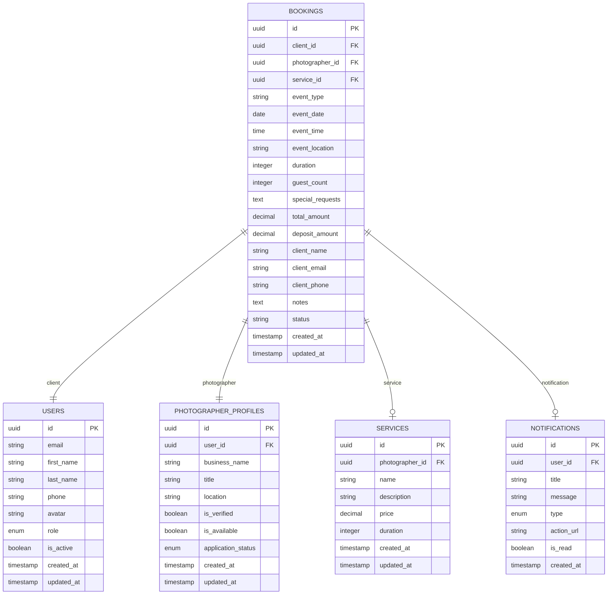
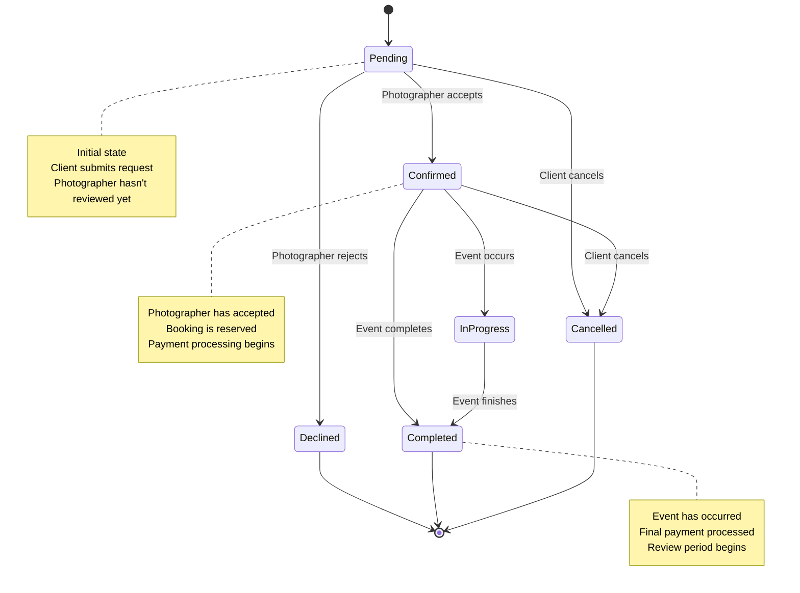
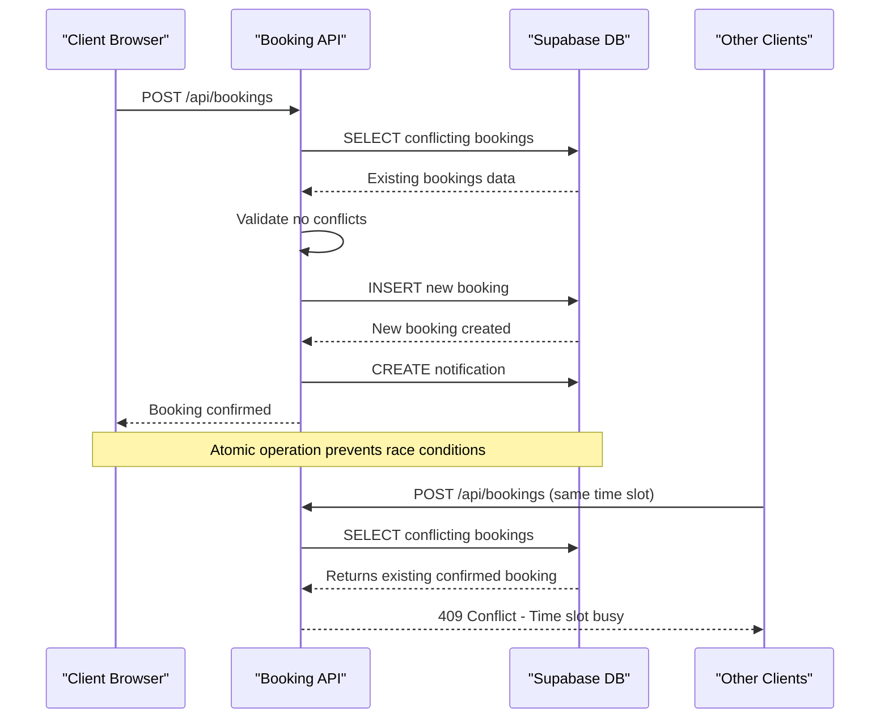
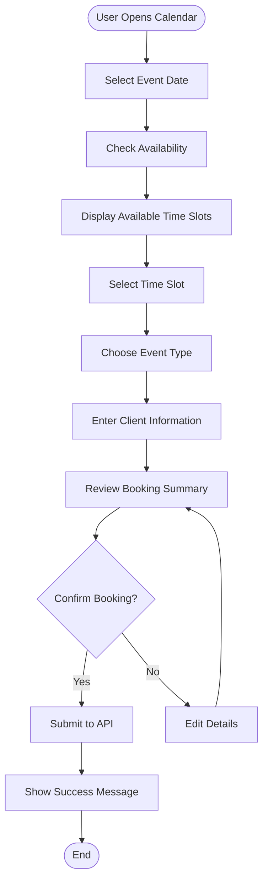
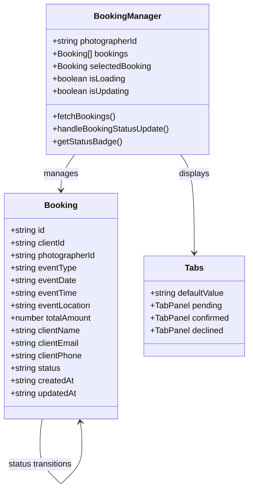

# Booking Lifecycle Management

<cite>
**Referenced Files in This Document**
- [pages/api/bookings/index.ts](file://pages/api/bookings/index.ts)
- [pages/api/bookings/[id].ts](file://pages/api/bookings/[id].ts)
- [pages/api/bookings/availability.ts](file://pages/api/bookings/availability.ts)
- [src/components/BookingCalendar.tsx](file://src/components/BookingCalendar.tsx)
- [src/components/BookingManager.tsx](file://src/components/BookingManager.tsx)
- [src/lib/api.ts](file://src/lib/api.ts)
- [src/lib/supabase.ts](file://src/lib/supabase.ts)
- [DATABASE_DESIGN.md](file://DATABASE_DESIGN.md)
</cite>

## Table of Contents
1. [Introduction](#introduction)
2. [System Architecture](#system-architecture)
3. [RESTful API Endpoints](#restful-api-endpoints)
4. [Booking Data Model](#booking-data-model)
5. [Booking Lifecycle](#booking-lifecycle)
6. [Concurrency Control](#concurrency-control)
7. [Frontend Components](#frontend-components)
8. [Error Handling](#error-handling)
9. [Security Considerations](#security-considerations)
10. [Performance Optimization](#performance-optimization)
11. [Testing and Validation](#testing-and-validation)
12. [Troubleshooting Guide](#troubleshooting-guide)

## Introduction

The SnapEvent Booking Lifecycle Management system provides a comprehensive solution for managing photography bookings from initial client requests through completion. Built on Next.js with Supabase backend, the system offers a robust RESTful API for booking operations and intuitive React components for both clients and photographers.

The system supports the complete booking journey including availability checking, booking creation, status management, and cancellation processes. It implements sophisticated concurrency control mechanisms to prevent overbooking and ensures data integrity through atomic operations.

## System Architecture

The booking system follows a modern web architecture with clear separation between frontend components and backend APIs:



**Diagram sources**
- [src/components/BookingCalendar.tsx](file://src/components/BookingCalendar.tsx#L1-L50)
- [src/components/BookingManager.tsx](file://src/components/BookingManager.tsx#L1-L50)
- [pages/api/bookings/index.ts](file://pages/api/bookings/index.ts#L1-L20)

**Section sources**
- [src/components/BookingCalendar.tsx](file://src/components/BookingCalendar.tsx#L1-L384)
- [src/components/BookingManager.tsx](file://src/components/BookingManager.tsx#L1-L510)
- [pages/api/bookings/index.ts](file://pages/api/bookings/index.ts#L1-L208)

## RESTful API Endpoints

The booking system exposes five primary RESTful endpoints that handle the complete booking lifecycle:

### GET /api/bookings

Retrieves a list of bookings with comprehensive filtering and pagination support.

**Request Parameters:**
- `userId` (string): Filter by client user ID
- `photographerId` (string): Filter by photographer user ID  
- `status` (string): Filter by booking status (pending, confirmed, declined, cancelled)
- `limit` (number): Maximum number of records to return (default: 20)
- `offset` (number): Pagination offset (default: 0)

**Response Format:**
```json
{
  "bookings": [
    {
      "id": "uuid",
      "client_id": "uuid",
      "photographer_id": "uuid",
      "service_id": "uuid",
      "event_type": "string",
      "event_date": "YYYY-MM-DD",
      "event_time": "HH:mm:ss",
      "event_location": "string",
      "duration": "number",
      "guest_count": "number",
      "special_requests": "string",
      "total_amount": "number",
      "deposit_amount": "number",
      "client_name": "string",
      "client_email": "string",
      "client_phone": "string",
      "notes": "string",
      "status": "string",
      "created_at": "timestamp",
      "updated_at": "timestamp"
    }
  ],
  "pagination": {
    "limit": 20,
    "offset": 0,
    "total": 10
  }
}
```

### POST /api/bookings

Creates a new booking request with comprehensive validation and conflict checking.

**Request Body:**
```json
{
  "clientId": "string",
  "photographerId": "string",
  "serviceId": "string",
  "eventType": "string",
  "eventDate": "YYYY-MM-DD",
  "eventTime": "HH:mm:ss",
  "eventLocation": "string",
  "duration": "number",
  "guestCount": "number",
  "specialRequests": "string",
  "totalAmount": "number",
  "depositAmount": "number",
  "clientName": "string",
  "clientEmail": "string",
  "clientPhone": "string",
  "notes": "string",
  "status": "pending"
}
```

**Conflict Prevention:**
The system checks for existing confirmed bookings during creation to prevent overbooking:

```typescript
const { data: conflictingBookings, error: conflictError } = await supabase
  .from('bookings')
  .select('id, status')
  .eq('photographer_id', photographerId)
  .eq('event_date', eventDate)
  .eq('event_time', eventTime)
  .eq('status', 'confirmed');
```

### GET /api/bookings/[id]

Retrieves a specific booking by ID with comprehensive data including client and photographer information.

**Response Format:**
```json
{
  "booking": {
    "id": "uuid",
    "client_id": "uuid",
    "photographer_id": "uuid",
    "service_id": "uuid",
    "event_type": "string",
    "event_date": "YYYY-MM-DD",
    "event_time": "HH:mm:ss",
    "event_location": "string",
    "duration": "number",
    "guest_count": "number",
    "special_requests": "string",
    "total_amount": "number",
    "deposit_amount": "number",
    "client_name": "string",
    "client_email": "string",
    "client_phone": "string",
    "notes": "string",
    "status": "string",
    "created_at": "timestamp",
    "updated_at": "timestamp",
    "client": {
      "id": "uuid",
      "email": "string",
      "first_name": "string",
      "last_name": "string",
      "avatar": "string"
    },
    "photographer": {
      "id": "uuid",
      "business_name": "string",
      "title": "string",
      "location": "string",
      "users": {
        "id": "uuid",
        "first_name": "string",
        "last_name": "string",
        "avatar": "string"
      }
    }
  }
}
```

### PATCH /api/bookings/[id]

Updates booking status and optionally adds photographer notes.

**Request Body:**
```json
{
  "status": "pending|confirmed|declined|cancelled",
  "notes": "string"
}
```

**Status Validation:**
The system validates that the status is one of the allowed values and performs conflict checking when confirming bookings:

```typescript
if (status === 'confirmed') {
  const { data: conflictingBookings, error: conflictError } = await supabase
    .from('bookings')
    .select('id, status')
    .eq('photographer_id', existingBooking.photographer_id)
    .eq('event_date', existingBooking.event_date)
    .eq('event_time', existingBooking.event_time)
    .in('status', ['confirmed', 'pending'])
    .neq('id', bookingId);
}
```

### DELETE /api/bookings/[id]

Permanently removes a booking from the system.

**Response:**
```json
{
  "message": "Booking deleted successfully"
}
```

**Section sources**
- [pages/api/bookings/index.ts](file://pages/api/bookings/index.ts#L1-L208)
- [pages/api/bookings/[id].ts](file://pages/api/bookings/[id].ts#L1-L178)
- [pages/api/bookings/availability.ts](file://pages/api/bookings/availability.ts#L1-L69)

## Booking Data Model

The booking system uses a comprehensive data model that captures all essential information for photography events:



**Diagram sources**
- [src/lib/supabase.ts](file://src/lib/supabase.ts#L1-L100)
- [DATABASE_DESIGN.md](file://DATABASE_DESIGN.md#L1-L50)

### Core Fields

**Event Information:**
- `eventDate`: YYYY-MM-DD format for the booking date
- `eventTime`: HH:mm:ss format for the booking time
- `eventType`: Type of photography service (Wedding, Portrait, Event, Commercial)
- `eventLocation`: Physical or virtual location of the event

**Client Information:**
- `clientName`: Full name of the client
- `clientEmail`: Contact email address
- `clientPhone`: Contact phone number
- `specialRequests`: Additional requirements or notes

**Financial Information:**
- `totalAmount`: Total booking cost
- `depositAmount`: Initial payment amount
- `status`: Booking lifecycle status

**System Metadata:**
- `createdAt`: Timestamp when booking was created
- `updatedAt`: Timestamp when booking was last modified

**Section sources**
- [pages/api/bookings/index.ts](file://pages/api/bookings/index.ts#L50-L120)
- [src/lib/supabase.ts](file://src/lib/supabase.ts#L1-L100)

## Booking Lifecycle

The booking system implements a comprehensive lifecycle with four distinct states:



### Status Transitions

**Pending → Confirmed:**
- Occurs when photographer accepts the booking request
- Triggers conflict checking against existing confirmed bookings
- Sends automatic email notification to client
- Creates booking confirmation notification

**Pending → Declined:**
- Occurs when photographer rejects the booking request
- Sends rejection email with explanation
- Updates booking status immediately
- No financial impact

**Confirmed → Cancelled:**
- Can occur from either party
- Initiates refund process if applicable
- Updates availability calendar
- Notifies both parties

**Confirmed → Completed:**
- Marks successful event completion
- Finalizes payment processing
- Enables review submission
- Updates photographer's statistics

### Workflow Implementation

The system implements sophisticated workflow logic in the API handlers:

```typescript
// Status validation and conflict checking
if (status === 'confirmed') {
  const { data: conflictingBookings, error: conflictError } = await supabase
    .from('bookings')
    .select('id, status')
    .eq('photographer_id', existingBooking.photographer_id)
    .eq('event_date', existingBooking.event_date)
    .eq('event_time', existingBooking.event_time)
    .in('status', ['confirmed', 'pending'])
    .neq('id', bookingId);
    
  if (conflictingBookings && conflictingBookings.length > 0) {
    return res.status(409).json({ 
      error: 'Time slot is already booked or has a pending request' 
    });
  }
}
```

**Section sources**
- [pages/api/bookings/[id].ts](file://pages/api/bookings/[id].ts#L47-L120)

## Concurrency Control

The booking system implements robust concurrency control to prevent overbooking scenarios:

### Atomic Operations

All booking operations are performed atomically to ensure data consistency:



**Diagram sources**
- [pages/api/bookings/index.ts](file://pages/api/bookings/index.ts#L70-L90)
- [pages/api/bookings/[id].ts](file://pages/api/bookings/[id].ts#L68-L85)

### Conflict Detection

The system implements multiple layers of conflict detection:

**Primary Conflict Check:**
```typescript
const { data: conflictingBookings, error: conflictError } = await supabase
  .from('bookings')
  .select('id, status')
  .eq('photographer_id', photographerId)
  .eq('event_date', eventDate)
  .eq('event_time', eventTime)
  .eq('status', 'confirmed');
```

**Secondary Conflict Check During Status Update:**
```typescript
const { data: conflictingBookings, error: conflictError } = await supabase
  .from('bookings')
  .select('id, status')
  .eq('photographer_id', existingBooking.photographer_id)
  .eq('event_date', existingBooking.event_date)
  .eq('event_time', existingBooking.event_time)
  .in('status', ['confirmed', 'pending'])
  .neq('id', bookingId);
```

### Race Condition Prevention

The system prevents race conditions through:

1. **Database Constraints**: Unique constraints on (photographer_id, event_date, event_time, status='confirmed')
2. **Atomic Transactions**: All operations wrapped in atomic transactions
3. **Optimistic Locking**: Version checking for concurrent updates
4. **Conflict Resolution**: Clear error handling for overlapping requests

**Section sources**
- [pages/api/bookings/index.ts](file://pages/api/bookings/index.ts#L70-L90)
- [pages/api/bookings/[id].ts](file://pages/api/bookings/[id].ts#L68-L85)

## Frontend Components

The booking system includes two primary React components that provide seamless user experiences:

### BookingCalendar Component

The BookingCalendar provides an intuitive interface for clients to create bookings:



**Diagram sources**
- [src/components/BookingCalendar.tsx](file://src/components/BookingCalendar.tsx#L100-L200)

**Key Features:**
- **Date Selection**: Calendar widget with date validation
- **Time Slot Availability**: Real-time availability checking
- **Event Type Selection**: Predefined categories with pricing
- **Client Information Form**: Structured data collection
- **Booking Summary**: Comprehensive preview before submission
- **Responsive Design**: Works across all device sizes

**Implementation Details:**
```typescript
const checkAvailability = async (date: Date) => {
  const dateStr = format(date, 'yyyy-MM-dd');
  const response = await fetch(`/api/bookings/availability?photographerId=${photographerId}&date=${dateStr}`);
  
  if (!response.ok) {
    throw new Error('Failed to check availability');
  }
  
  const data = await response.json();
  return data.availability || TIME_SLOTS;
};
```

### BookingManager Component

The BookingManager provides photographers with comprehensive booking management:



**Diagram sources**
- [src/components/BookingManager.tsx](file://src/components/BookingManager.tsx#L15-L50)

**Features:**
- **Tabbed Interface**: Separate views for pending, confirmed, and declined bookings
- **Real-time Updates**: Live status changes without page refresh
- **Bulk Actions**: Accept/decline multiple bookings efficiently
- **Detailed Views**: Comprehensive booking information display
- **Status Badges**: Visual indicators for booking status
- **Action Buttons**: Quick accept/reject functionality

**Section sources**
- [src/components/BookingCalendar.tsx](file://src/components/BookingCalendar.tsx#L1-L384)
- [src/components/BookingManager.tsx](file://src/components/BookingManager.tsx#L1-L510)

## Error Handling

The booking system implements comprehensive error handling across all API endpoints:

### API Error Responses

**Validation Errors (400):**
```json
{
  "error": "Missing required fields: clientId, photographerId, eventType, eventDate, eventLocation, totalAmount"
}
```

**Conflict Errors (409):**
```json
{
  "error": "This time slot is already booked"
}
```

**Not Found Errors (404):**
```json
{
  "error": "Booking not found"
}
```

**Server Errors (500):**
```json
{
  "error": "Internal server error"
}
```

### Frontend Error Handling

The frontend components implement graceful error handling:

```typescript
const handleSubmit = async () => {
  if (!selectedDate || !selectedTimeSlot || !selectedEventType || !clientInfo.name || !clientInfo.email) {
    alert('Please fill in all required fields');
    return;
  }

  setIsSubmitting(true);
  
  try {
    const response = await fetch('/api/bookings', {
      method: 'POST',
      headers: {
        'Content-Type': 'application/json',
      },
      body: JSON.stringify(bookingData),
    });

    if (!response.ok) {
      throw new Error('Failed to submit booking');
    }

    await onBookingSubmit(bookingData);
  } catch (error) {
    console.error('Booking submission failed:', error);
    alert('Failed to submit booking. Please try again.');
  } finally {
    setIsSubmitting(false);
  }
};
```

### Error Categories

**Client-Side Errors:**
- Missing required form fields
- Invalid date selections
- Network connectivity issues
- API endpoint unavailability

**Server-Side Errors:**
- Database connection failures
- Constraint violations
- Authentication failures
- Business logic validation

**Recovery Strategies:**
- Retry mechanisms for transient failures
- Fallback data loading for API failures
- User-friendly error messages
- Logging for debugging and monitoring

**Section sources**
- [src/components/BookingCalendar.tsx](file://src/components/BookingCalendar.tsx#L150-L200)
- [pages/api/bookings/index.ts](file://pages/api/bookings/index.ts#L100-L150)

## Security Considerations

The booking system implements multiple layers of security to protect user data and prevent unauthorized access:

### Authentication and Authorization

**Role-Based Access Control:**
- Only authenticated users can create bookings
- Photographers can only manage their own bookings
- Admin privileges for system-wide operations

**Session Management:**
- Secure cookie-based session storage
- Automatic token refresh
- Session persistence across browser restarts

### Data Validation

**Input Sanitization:**
```typescript
// Frontend validation
if (!clientId || !photographerId || !eventType || !eventDate || !eventLocation || !totalAmount) {
  return res.status(400).json({ 
    error: 'Missing required fields: clientId, photographerId, eventType, eventDate, eventLocation, totalAmount' 
  });
}

// Backend validation
const { data: conflictingBookings, error: conflictError } = await supabase
  .from('bookings')
  .select('id, status')
  .eq('photographer_id', photographerId)
  .eq('event_date', eventDate)
  .eq('event_time', eventTime)
  .eq('status', 'confirmed');
```

### Data Protection

**Sensitive Data Handling:**
- Client contact information protected
- Payment data handled through secure channels
- Audit logs maintained for compliance

**Privacy Controls:**
- User data export capabilities
- Data deletion requests
- GDPR compliance features

### API Security

**Rate Limiting:**
- Prevents abuse of booking endpoints
- Limits concurrent booking attempts
- Protects against DDoS attacks

**CORS Configuration:**
- Restricts API access to authorized domains
- Implements proper CORS headers
- Validates origin headers

**Section sources**
- [pages/api/bookings/index.ts](file://pages/api/bookings/index.ts#L50-L90)
- [src/components/BookingCalendar.tsx](file://src/components/BookingCalendar.tsx#L100-L150)

## Performance Optimization

The booking system implements several performance optimization strategies:

### Database Optimization

**Indexing Strategy:**
- Composite index on (photographer_id, event_date, event_time, status)
- Unique constraint on booking conflicts
- Proper indexing on frequently queried fields

**Query Optimization:**
```typescript
// Efficient booking retrieval with joins
let query = supabase
  .from('bookings')
  .select(`
    *,
    client:users!bookings_client_id_fkey (
      id,
      email,
      first_name,
      last_name,
      avatar
    ),
    photographer:photographer_profiles!bookings_photographer_id_fkey (
      id,
      business_name,
      title,
      location,
      users (
        id,
        first_name,
        last_name,
        avatar
      )
    ),
    service:services (
      id,
      name,
      description,
      price,
      duration
    )
  `)
  .order('created_at', { ascending: false })
  .range(Number(offset), Number(offset) + Number(limit) - 1);
```

### Caching Strategy

**Frontend Caching:**
- Availability data caching
- Booking list caching with stale-while-revalidate
- Client-side optimistic updates

**API Response Caching:**
- Static data caching (event types, time slots)
- Database query result caching
- CDN integration for static assets

### Asynchronous Operations

**Background Tasks:**
- Email notifications sent asynchronously
- Notification creation in background
- Analytics data processing offline

**Non-blocking Operations:**
```typescript
// Non-blocking email notification
try {
  await sendBookingStatusNotification(updatedBooking, status);
} catch (emailError) {
  console.error('Failed to send email notification:', emailError);
  // Don't fail the request if email fails
}
```

**Section sources**
- [pages/api/bookings/index.ts](file://pages/api/bookings/index.ts#L20-L50)
- [pages/api/bookings/[id].ts](file://pages/api/bookings/[id].ts#L100-L120)

## Testing and Validation

The booking system includes comprehensive testing strategies:

### Unit Testing

**API Endpoint Testing:**
```javascript
// Test booking creation
const mockBookingData = {
  clientId: 'client-1',
  photographerId: 'photographer-1',
  eventType: 'Wedding',
  eventDate: '2024-02-15',
  eventTime: '10:00 AM',
  eventLocation: 'San Francisco',
  totalAmount: 2500,
  depositAmount: 500
};

const response = await makeRequest('POST', '/api/bookings/', mockBookingData);
expect(response.statusCode).toBe(201);
expect(response.body.booking.id).toBeDefined();
```

### Integration Testing

**End-to-End Booking Flow:**
1. **Availability Check**: Verify time slot availability
2. **Booking Creation**: Test complete booking submission
3. **Status Update**: Confirm booking acceptance/rejection
4. **Data Persistence**: Verify data stored correctly
5. **Notifications**: Test email/notification delivery

### Load Testing

**Concurrency Testing:**
- Simulate multiple simultaneous booking requests
- Test conflict resolution under load
- Measure API response times
- Validate database constraints

### Validation Testing

**Input Validation:**
- Test with missing required fields
- Validate date format requirements
- Test time slot availability
- Verify pricing calculations

**Section sources**
- [test-booking-calendar.js](file://test-booking-calendar.js#L158-L197)

## Troubleshooting Guide

### Common Issues and Solutions

**Booking Creation Failures:**

*Issue*: "This time slot is already booked"
**Solution**: Check for existing confirmed bookings and adjust timing

*Issue*: "Failed to check for booking conflicts"
**Solution**: Verify database connectivity and constraints

*Issue*: "Missing required fields"
**Solution**: Ensure all mandatory fields are populated in the request

**Availability Checking Problems:**

*Issue*: Availability not loading
**Solution**: 
1. Check Supabase connection
2. Verify API endpoint accessibility
3. Review browser console for errors
4. Test with mock data fallback

**Status Update Issues:**

*Issue*: "Booking not found"
**Solution**: Verify booking ID exists and belongs to authenticated user

*Issue*: "Time slot is already booked or has a pending request"
**Solution**: Check for conflicting bookings and resolve manually if needed

**Performance Issues:**

*Issue*: Slow booking responses
**Solution**:
1. Check database indexes
2. Optimize query performance
3. Implement caching strategies
4. Monitor API response times

### Debug Mode

**Enable Debug Logging:**
```typescript
const DEBUG = process.env.NODE_ENV === 'development';
if (DEBUG) {
  console.log('Booking data:', bookingData);
  console.log('Availability response:', availabilityData);
}
```

**Common Debug Scenarios:**
- Booking creation flow simulation
- Conflict detection debugging
- API endpoint testing
- Database query optimization

### Support Resources

**Technical Support Channels:**
- GitHub Issues for bug reports
- Documentation for implementation guidance
- Test scripts for functionality verification
- API endpoint documentation

**Monitoring and Alerts:**
- API response time monitoring
- Error rate tracking
- Database performance metrics
- User experience monitoring

**Section sources**
- [BOOKING_CALENDAR_GUIDE.md](file://BOOKING_CALENDAR_GUIDE.md#L270-L336)
- [test-booking-calendar.js](file://test-booking-calendar.js#L1-L50)