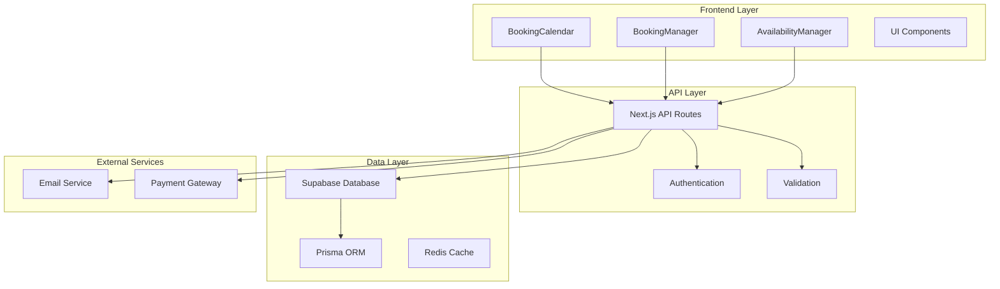
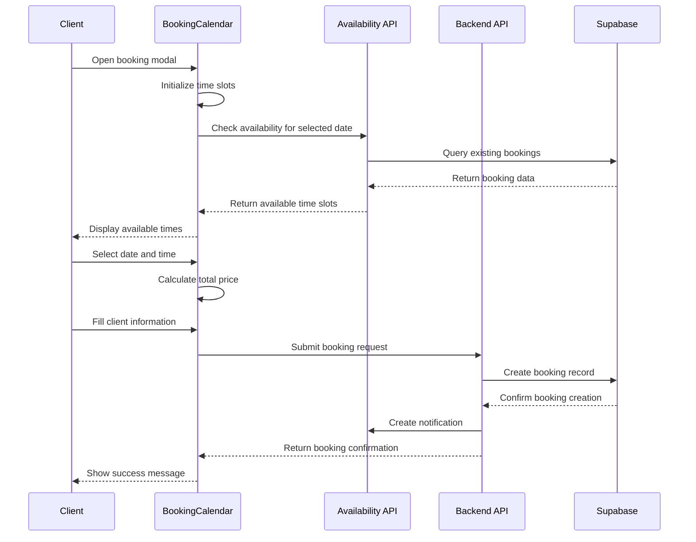
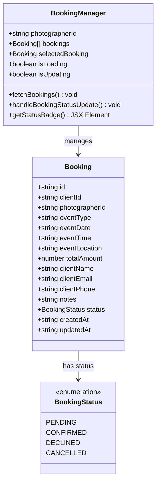
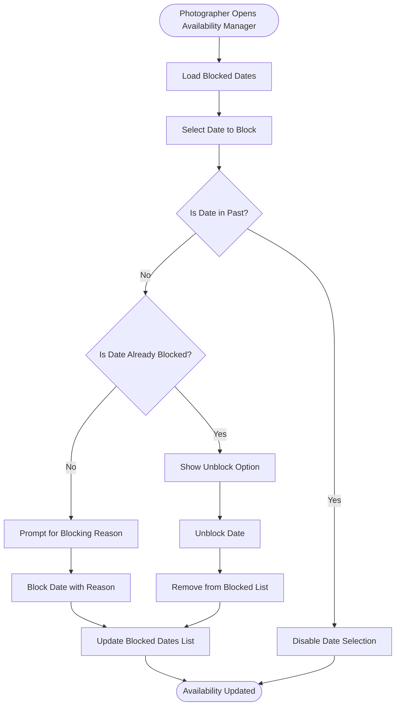
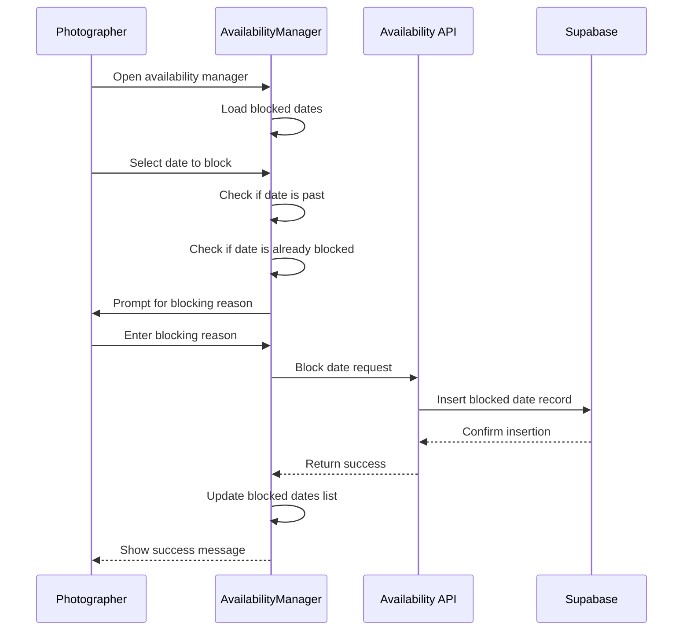
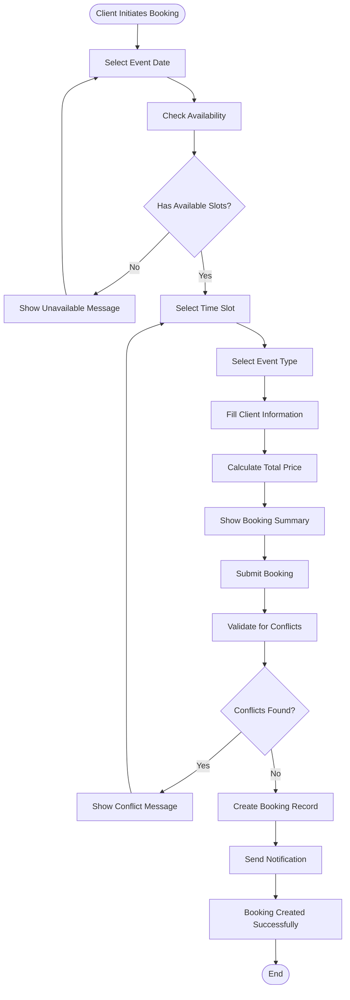
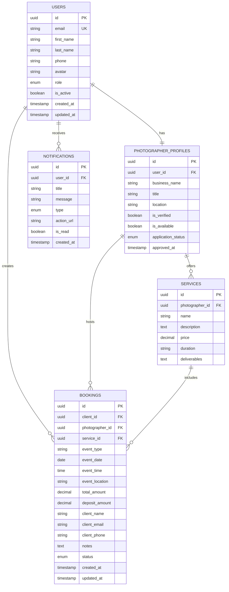
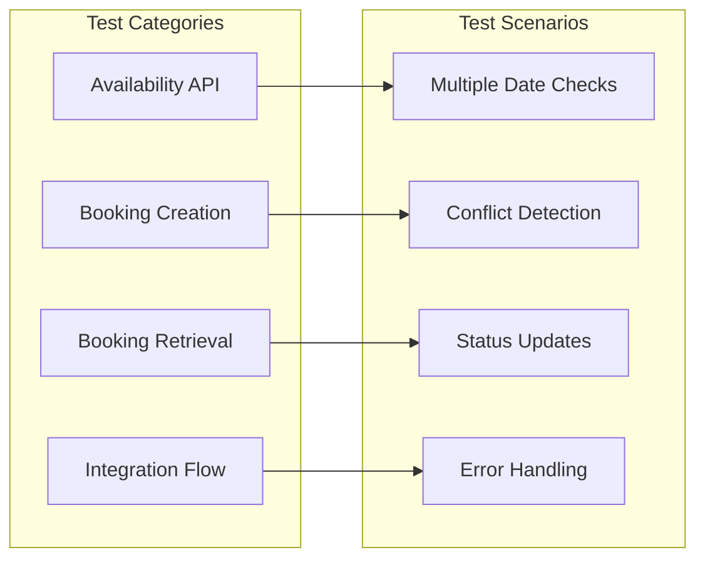

# Booking System Implementation

<cite>
**Referenced Files in This Document**
- [pages/api/bookings/index.ts](file://pages/api/bookings/index.ts)
- [pages/api/bookings/[id].ts](file://pages/api/bookings/[id].ts)
- [pages/api/bookings/availability.ts](file://pages/api/bookings/availability.ts)
- [src/components/BookingCalendar.tsx](file://src/components/BookingCalendar.tsx)
- [src/components/AvailabilityManager.tsx](file://src/components/AvailabilityManager.tsx)
- [src/components/BookingManager.tsx](file://src/components/BookingManager.tsx)
- [src/lib/api.ts](file://src/lib/api.ts)
- [src/lib/supabase.ts](file://src/lib/supabase.ts)
- [prisma/seed.ts](file://prisma/seed.ts)
- [BOOKING_CALENDAR_GUIDE.md](file://BOOKING_CALENDAR_GUIDE.md)
- [DATABASE_DESIGN.md](file://DATABASE_DESIGN.md)
- [test-booking-calendar.js](file://test-booking-calendar.js)
</cite>

## Table of Contents
1. [Introduction](#introduction)
2. [System Architecture](#system-architecture)
3. [Core Components](#core-components)
4. [API Endpoints](#api-endpoints)
5. [Calendar Integration](#calendar-integration)
6. [Availability Management](#availability-management)
7. [Booking Lifecycle](#booking-lifecycle)
8. [Data Model](#data-model)
9. [Conflict Detection](#conflict-detection)
10. [Edge Cases](#edge-cases)
11. [Testing Framework](#testing-framework)
12. [Deployment Guide](#deployment-guide)
13. [Troubleshooting](#troubleshooting)

## Introduction

The SnapEvent Booking System is a comprehensive solution for managing photography bookings that combines interactive calendar interfaces with robust backend APIs. The system enables clients to easily book photography services while giving photographers complete control over their availability and booking management.

The booking system is built with modern React components using Framer Motion for smooth animations, integrates with Supabase for data persistence, and follows a RESTful API architecture for scalability and maintainability.

## System Architecture

The booking system follows a layered architecture pattern with clear separation of concerns:



**Diagram sources**
- [pages/api/bookings/index.ts](file://pages/api/bookings/index.ts#L1-L208)
- [src/components/BookingCalendar.tsx](file://src/components/BookingCalendar.tsx#L1-L384)
- [src/lib/supabase.ts](file://src/lib/supabase.ts#L1-L242)

## Core Components

### BookingCalendar Component

The BookingCalendar is the primary user interface for clients to create bookings. It provides an intuitive multi-step process for selecting dates, times, and event details.



**Diagram sources**
- [src/components/BookingCalendar.tsx](file://src/components/BookingCalendar.tsx#L100-L200)
- [pages/api/bookings/index.ts](file://pages/api/bookings/index.ts#L60-L120)

### BookingManager Component

The BookingManager provides photographers with comprehensive booking management capabilities, including viewing, accepting, and declining booking requests.



**Diagram sources**
- [src/components/BookingManager.tsx](file://src/components/BookingManager.tsx#L20-L50)
- [src/components/BookingManager.tsx](file://src/components/BookingManager.tsx#L150-L200)

### AvailabilityManager Component

The AvailabilityManager allows photographers to block and unblock dates for bookings, providing granular control over their availability.



**Diagram sources**
- [src/components/AvailabilityManager.tsx](file://src/components/AvailabilityManager.tsx#L40-L100)

**Section sources**
- [src/components/BookingCalendar.tsx](file://src/components/BookingCalendar.tsx#L1-L384)
- [src/components/BookingManager.tsx](file://src/components/BookingManager.tsx#L1-L510)
- [src/components/AvailabilityManager.tsx](file://src/components/AvailabilityManager.tsx#L1-L203)

## API Endpoints

The booking system exposes several RESTful API endpoints for managing bookings and availability.

### GET /api/bookings

Retrieves bookings with optional filtering by user, photographer, and status.

```typescript
// Example request
GET /api/bookings?photographerId=123&status=pending&limit=10

// Response structure
{
  "bookings": [
    {
      "id": "booking-1",
      "client_id": "client-1",
      "photographer_id": "photographer-1",
      "event_type": "Wedding",
      "event_date": "2024-02-15",
      "event_time": "10:00 AM",
      "status": "pending",
      "total_amount": 350,
      "client": {
        "id": "client-1",
        "email": "john@example.com",
        "first_name": "John",
        "last_name": "Doe"
      }
    }
  ],
  "pagination": {
    "limit": 10,
    "offset": 0,
    "total": 5
  }
}
```

### POST /api/bookings

Creates a new booking with conflict detection and notification system.

```typescript
// Request body
{
  "clientId": "client-1",
  "photographerId": "photographer-1",
  "serviceId": "service-1",
  "eventType": "Wedding",
  "eventDate": "2024-02-15",
  "eventTime": "10:00 AM",
  "eventLocation": "Golden Gate Park",
  "totalAmount": 350,
  "clientName": "John Doe",
  "clientEmail": "john@example.com",
  "clientPhone": "+1 (555) 123-4567",
  "notes": "Outdoor wedding ceremony",
  "status": "pending"
}

// Response
{
  "message": "Booking created successfully",
  "booking": {
    "id": "booking-1",
    "status": "pending",
    "event_date": "2024-02-15",
    "event_time": "10:00 AM"
  }
}
```

### PATCH /api/bookings/[id]

Updates booking status with conflict checking for confirmed bookings.

```typescript
// Request body
{
  "status": "confirmed",
  "notes": "Updated photographer notes"
}

// Conflict detection logic
const { data: conflictingBookings } = await supabase
  .from('bookings')
  .select('id, status')
  .eq('photographer_id', photographerId)
  .eq('event_date', eventDate)
  .eq('event_time', eventTime)
  .in('status', ['confirmed', 'pending'])
  .neq('id', bookingId);
```

### GET /api/bookings/availability

Checks photographer availability for a specific date.

```typescript
// Request
GET /api/bookings/availability?photographerId=123&date=2024-02-15

// Response
{
  "date": "2024-02-15",
  "photographerId": "123",
  "availability": [
    {
      "id": "morning-1",
      "time": "09:00 AM",
      "available": true,
      "price": 150
    },
    {
      "id": "morning-2",
      "time": "10:00 AM",
      "available": false,
      "price": 150
    }
  ],
  "totalSlots": 10,
  "availableSlots": 8
}
```

**Section sources**
- [pages/api/bookings/index.ts](file://pages/api/bookings/index.ts#L1-L208)
- [pages/api/bookings/[id].ts](file://pages/api/bookings/[id].ts#L1-L178)
- [pages/api/bookings/availability.ts](file://pages/api/bookings/availability.ts#L1-L69)

## Calendar Integration

The booking system uses Framer Motion for smooth animations and provides an interactive calendar interface for date selection.

### Time Slot Management

The system defines predefined time slots with dynamic pricing based on time of day:

```typescript
const TIME_SLOTS: TimeSlot[] = [
  { id: 'morning-1', time: '09:00 AM', available: true, price: 150 },
  { id: 'morning-2', time: '10:00 AM', available: true, price: 150 },
  { id: 'morning-3', time: '11:00 AM', available: true, price: 150 },
  { id: 'afternoon-1', time: '12:00 PM', available: true, price: 175 },
  { id: 'afternoon-2', time: '01:00 PM', available: true, price: 175 },
  { id: 'afternoon-3', time: '02:00 PM', available: true, price: 175 },
  { id: 'afternoon-4', time: '03:00 PM', available: true, price: 175 },
  { id: 'evening-1', time: '04:00 PM', available: true, price: 200 },
  { id: 'evening-2', time: '05:00 PM', available: true, price: 200 },
  { id: 'evening-3', time: '06:00 PM', available: true, price: 200 },
];
```

### Event Type Configuration

Different photography services with base pricing:

```typescript
const EVENT_TYPES = [
  { id: 'wedding', name: 'Wedding', basePrice: 200 },
  { id: 'portrait', name: 'Portrait Session', basePrice: 150 },
  { id: 'event', name: 'Event Photography', basePrice: 175 },
  { id: 'commercial', name: 'Commercial', basePrice: 250 },
];
```

### Real-time Availability Checking

The calendar component performs real-time availability checks:

```typescript
const checkAvailability = async (date: Date) => {
  try {
    const dateStr = format(date, 'yyyy-MM-dd');
    const response = await fetch(`/api/bookings/availability?photographerId=${photographerId}&date=${dateStr}`);
    
    if (!response.ok) {
      throw new Error('Failed to check availability');
    }
    
    const data = await response.json();
    return data.availability || TIME_SLOTS;
  } catch (error) {
    console.error('Error checking availability:', error);
    // Fallback to mock data if API fails
    return TIME_SLOTS;
  }
};
```

**Section sources**
- [src/components/BookingCalendar.tsx](file://src/components/BookingCalendar.tsx#L40-L100)
- [pages/api/bookings/availability.ts](file://pages/api/bookings/availability.ts#L25-L60)

## Availability Management

Photographers can manage their availability through the AvailabilityManager component, which provides blocking and unblocking functionality.

### Blocking Dates



**Diagram sources**
- [src/components/AvailabilityManager.tsx](file://src/components/AvailabilityManager.tsx#L40-L80)

### Date Validation

The system implements comprehensive date validation:

```typescript
const isDateDisabled = (date: Date) => {
  const today = new Date();
  today.setHours(0, 0, 0, 0);
  return isBefore(date, today) || isDateBlocked(date);
};

const isDateBlocked = (date: Date) => {
  const dateStr = format(date, 'yyyy-MM-dd');
  return blockedDates.some(blocked => blocked.date === dateStr);
};
```

**Section sources**
- [src/components/AvailabilityManager.tsx](file://src/components/AvailabilityManager.tsx#L1-L203)

## Booking Lifecycle

The booking system follows a structured lifecycle from initial request to completion.

### Booking Creation Flow



**Diagram sources**
- [src/components/BookingCalendar.tsx](file://src/components/BookingCalendar.tsx#L150-L250)
- [pages/api/bookings/index.ts](file://pages/api/bookings/index.ts#L60-L120)

### Booking Status Management

Photographers can manage booking status through the BookingManager:

```typescript
const handleBookingStatusUpdate = async (bookingId: string, newStatus: 'confirmed' | 'declined') => {
  try {
    const response = await fetch(`/api/bookings/${bookingId}`, {
      method: 'PATCH',
      headers: { 'Content-Type': 'application/json' },
      body: JSON.stringify({ status: newStatus })
    });

    if (!response.ok) {
      throw new Error('Failed to update booking status');
    }

    // Update local state
    setBookings(prev => prev.map(booking => 
      booking.id === bookingId 
        ? { ...booking, status: newStatus, updatedAt: new Date().toISOString() }
        : booking
    ));
  } catch (error) {
    console.error('Error updating booking status:', error);
  }
};
```

**Section sources**
- [src/components/BookingManager.tsx](file://src/components/BookingManager.tsx#L100-L150)
- [pages/api/bookings/[id].ts](file://pages/api/bookings/[id].ts#L40-L100)

## Data Model

The booking system uses a normalized database schema with clear relationships between entities.

### Booking Entity Structure



**Diagram sources**
- [prisma/seed.ts](file://prisma/seed.ts#L1-L100)
- [src/lib/supabase.ts](file://src/lib/supabase.ts#L15-L100)

### Booking Status Enumeration

```typescript
enum BookingStatus {
  PENDING = 'PENDING',
  CONFIRMED = 'CONFIRMED',
  DECLINED = 'DECLINED',
  CANCELLED = 'CANCELLED'
}
```

### Relationship Definitions

The system maintains clear relationships between users, bookings, and services:

- **One-to-One**: Users ↔ PhotographerProfiles
- **One-to-Many**: Users → Bookings, PhotographerProfiles → Services
- **Many-to-Many**: PhotographerProfiles ↔ Services (through booking relationships)

**Section sources**
- [DATABASE_DESIGN.md](file://DATABASE_DESIGN.md#L1-L201)
- [prisma/seed.ts](file://prisma/seed.ts#L400-L500)

## Conflict Detection

The booking system implements sophisticated conflict detection to prevent double bookings.

### Conflict Detection Logic

```typescript
// During booking creation
const { data: conflictingBookings, error: conflictError } = await supabase
  .from('bookings')
  .select('id, status')
  .eq('photographer_id', photographerId)
  .eq('event_date', eventDate)
  .eq('event_time', eventTime)
  .eq('status', 'confirmed');

if (conflictingBookings && conflictingBookings.length > 0) {
  return res.status(409).json({ 
    error: 'This time slot is already booked' 
  });
}

// During status update
if (status === 'confirmed') {
  const { data: conflictingBookings } = await supabase
    .from('bookings')
    .select('id, status')
    .eq('photographer_id', photographerId)
    .eq('event_date', eventDate)
    .eq('event_time', eventTime)
    .in('status', ['confirmed', 'pending'])
    .neq('id', bookingId);

  if (conflictingBookings && conflictingBookings.length > 0) {
    return res.status(409).json({ 
      error: 'Time slot is already booked or has a pending request' 
    });
  }
}
```

### Time Slot Validation

The system validates time slots against existing bookings:

```typescript
// Availability check endpoint
const { data: existingBookings } = await supabase
  .from('bookings')
  .select('event_time, status')
  .eq('photographer_id', photographerId)
  .eq('event_date', date)
  .eq('status', 'confirmed');

const bookedTimes = existingBookings?.map(booking => booking.event_time) || [];
const availability = allTimeSlots.map(slot => ({
  ...slot,
  available: !bookedTimes.includes(slot.time)
}));
```

**Section sources**
- [pages/api/bookings/index.ts](file://pages/api/bookings/index.ts#L70-L90)
- [pages/api/bookings/[id].ts](file://pages/api/bookings/[id].ts#L60-L80)
- [pages/api/bookings/availability.ts](file://pages/api/bookings/availability.ts#L25-L50)

## Edge Cases

The booking system handles various edge cases to ensure reliability and user satisfaction.

### Timezone Considerations

While the current implementation uses local time, the system is designed to handle timezone differences:

```typescript
// Recommended timezone handling
const convertToLocalTime = (utcDateTime: string, timezone: string) => {
  return new Date(utcDateTime).toLocaleString('en-US', { timeZone: timezone });
};

// Store UTC times in database for consistency
const utcEventTime = new Date(eventTime).toISOString();
```

### Concurrent Booking Requests

The system prevents race conditions through database-level constraints and optimistic locking:

```typescript
// Optimistic locking example
const { data: booking, error } = await supabase
  .from('bookings')
  .update({
    status: 'confirmed',
    updated_at: new Date().toISOString()
  })
  .eq('id', bookingId)
  .eq('status', 'pending') // Only update if still pending
  .select()
  .single();
```

### Partial Booking Data

The system gracefully handles partial booking submissions:

```typescript
// Frontend validation
if (!selectedDate || !selectedTimeSlot || !selectedEventType || !clientInfo.name || !clientInfo.email) {
  alert('Please fill in all required fields');
  return;
}

// Backend validation
if (!clientId || !photographerId || !eventType || !eventDate || !eventLocation || !totalAmount) {
  return res.status(400).json({ 
    error: 'Missing required fields: clientId, photographerId, eventType, eventDate, eventLocation, totalAmount' 
  });
}
```

### Graceful Degradation

The system provides fallback mechanisms for API failures:

```typescript
const checkAvailability = async (date: Date) => {
  try {
    // Primary API call
    const response = await fetch(`/api/bookings/availability?photographerId=${photographerId}&date=${dateStr}`);
    if (!response.ok) throw new Error('API unavailable');
    
    return await response.json();
  } catch (error) {
    console.warn('Primary availability API failed, using fallback');
    // Fallback to static data
    return TIME_SLOTS.map(slot => ({
      ...slot,
      available: Math.random() > 0.2 // 80% chance of availability
    }));
  }
};
```

**Section sources**
- [src/components/BookingCalendar.tsx](file://src/components/BookingCalendar.tsx#L150-L200)
- [pages/api/bookings/index.ts](file://pages/api/bookings/index.ts#L60-L80)

## Testing Framework

The booking system includes comprehensive testing capabilities through dedicated test scripts.

### Test Categories

The testing framework covers multiple aspects:

1. **Availability API Testing**: Validates availability checking functionality
2. **Booking Creation Testing**: Tests booking submission and conflict detection
3. **Booking Retrieval Testing**: Verifies booking data retrieval
4. **Integration Testing**: Tests end-to-end booking flow

### Test Execution

```bash
# Run booking calendar tests
node test-booking-calendar.js

# Expected output:
🚀 Starting Booking Calendar System Tests
============================================================
✅ Availability API: PASS
✅ Booking Creation: PASS
✅ Booking Retrieval: PASS
✅ Integration Test: PASS

🎯 Overall: 4/4 tests passed
🎉 All tests passed! Booking calendar system is working correctly.
```

### Test Coverage



**Diagram sources**
- [test-booking-calendar.js](file://test-booking-calendar.js#L150-L200)

**Section sources**
- [test-booking-calendar.js](file://test-booking-calendar.js#L1-L254)

## Deployment Guide

### Prerequisites

1. **Environment Variables**
   ```env
   # Supabase configuration
   NEXT_PUBLIC_SUPABASE_URL=your_supabase_url
   NEXT_PUBLIC_SUPABASE_ANON_KEY=your_supabase_anon_key
   SUPABASE_SERVICE_ROLE_KEY=your_service_role_key
   
   # Application configuration
   NODE_ENV=production
   PORT=3000
   ```

2. **Database Setup**
   ```bash
   # Generate Prisma client
   npx prisma generate
   
   # Run migrations
   npx prisma migrate deploy
   
   # Seed database (optional)
   npx prisma db seed
   ```

3. **Dependencies**
   ```bash
   npm install date-fns @supabase/supabase-js framer-motion
   ```

### Build and Deploy

```bash
# Build the application
npm run build

# Start the production server
npm start

# Or use PM2 for process management
pm2 start npm --name "snapevent" -- start
```

### Monitoring and Maintenance

1. **Health Checks**: Monitor API endpoints for availability
2. **Error Logging**: Implement centralized error logging
3. **Performance Monitoring**: Track response times and availability
4. **Backup Strategy**: Regular database backups and snapshots

## Troubleshooting

### Common Issues

#### 1. Availability Not Loading
- **Symptom**: Calendar shows no available time slots
- **Causes**: 
  - Supabase connection issues
  - API endpoint accessibility problems
  - Browser console errors
- **Solutions**:
  - Verify Supabase credentials in environment variables
  - Check API endpoint accessibility
  - Review browser console for JavaScript errors

#### 2. Booking Submission Fails
- **Symptom**: Booking form submits but returns error
- **Causes**:
  - Missing required fields
  - Network connectivity issues
  - API endpoint down
- **Solutions**:
  - Ensure all required fields are filled
  - Check network connection
  - Verify API endpoint is working

#### 3. Calendar Not Displaying
- **Symptom**: Calendar component doesn't render
- **Causes**:
  - Missing date-fns library
  - Calendar component import issues
  - CSS conflicts
- **Solutions**:
  - Install date-fns: `npm install date-fns`
  - Verify Calendar component import
  - Check for CSS conflicts in custom styles

### Debug Mode

Enable debug logging for development:

```typescript
const DEBUG = process.env.NODE_ENV === 'development';
if (DEBUG) {
  console.log('Booking data:', bookingData);
  console.log('Availability check:', { photographerId, date });
}
```

### Support Resources

1. **Test Scripts**: Use test-booking-calendar.js to verify functionality
2. **API Documentation**: Review API endpoints for integration issues
3. **Component Documentation**: Check component props and usage
4. **Error Logs**: Review server logs for detailed error information

**Section sources**
- [BOOKING_CALENDAR_GUIDE.md](file://BOOKING_CALENDAR_GUIDE.md#L270-L336)
- [test-booking-calendar.js](file://test-booking-calendar.js#L200-L254)