# Database Design

<cite>
**Referenced Files in This Document**
- [prisma/schema.prisma](file://prisma/schema.prisma)
- [prisma/seed.ts](file://prisma/seed.ts)
- [pages/api/bookings/index.ts](file://pages/api/bookings/index.ts)
- [pages/api/photographers/index.ts](file://pages/api/photographers/index.ts)
- [src/lib/supabase.ts](file://src/lib/supabase.ts)
- [DATABASE_DESIGN.md](file://DATABASE_DESIGN.md)
- [package.json](file://package.json)
</cite>

## Table of Contents
1. [Introduction](#introduction)
2. [Database Architecture Overview](#database-architecture-overview)
3. [Core Entity Model](#core-entity-model)
4. [Entity Relationship Diagram](#entity-relationship-diagram)
5. [Field Definitions and Constraints](#field-definitions-and-constraints)
6. [Data Validation Rules](#data-validation-rules)
7. [Seeding Process](#seeding-process)
8. [Data Access Patterns](#data-access-patterns)
9. [Indexing Strategies](#indexing-strategies)
10. [Performance Considerations](#performance-considerations)
11. [Data Lifecycle and Retention](#data-lifecycle-and-retention)
12. [Security and Privacy](#security-and-privacy)
13. [API Integration Points](#api-integration-points)
14. [Migration Strategy](#migration-strategy)
15. [Troubleshooting Guide](#troubleshooting-guide)
16. [Conclusion](#conclusion)

## Introduction

The SnapEvent database design is built on PostgreSQL with Prisma ORM, supporting a comprehensive photography marketplace platform that connects clients with professional photographers. The database schema is designed to handle user management, photographer profiles, bookings, payments, reviews, messaging, and analytics while maintaining scalability and performance.

The database supports multiple user roles including Clients, Photographers, and Admins, with sophisticated relationships between entities that enable complex business logic for booking management, portfolio display, and communication systems.

## Database Architecture Overview

The database follows a normalized relational design with the following key characteristics:

- **Primary Technology**: PostgreSQL with Prisma ORM
- **Connection Management**: Supabase for production deployment
- **Data Modeling**: Entity-Relationship modeling with explicit foreign key relationships
- **Scalability**: Designed for horizontal scaling with appropriate indexing
- **Flexibility**: Supports JSON fields for dynamic metadata and extensible enums

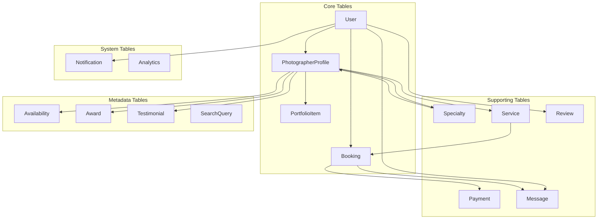

**Diagram sources**
- [prisma/schema.prisma](file://prisma/schema.prisma#L16-L463)

## Core Entity Model

### User Entity

The User entity serves as the foundation for all user accounts in the system, supporting role-based access control and authentication.

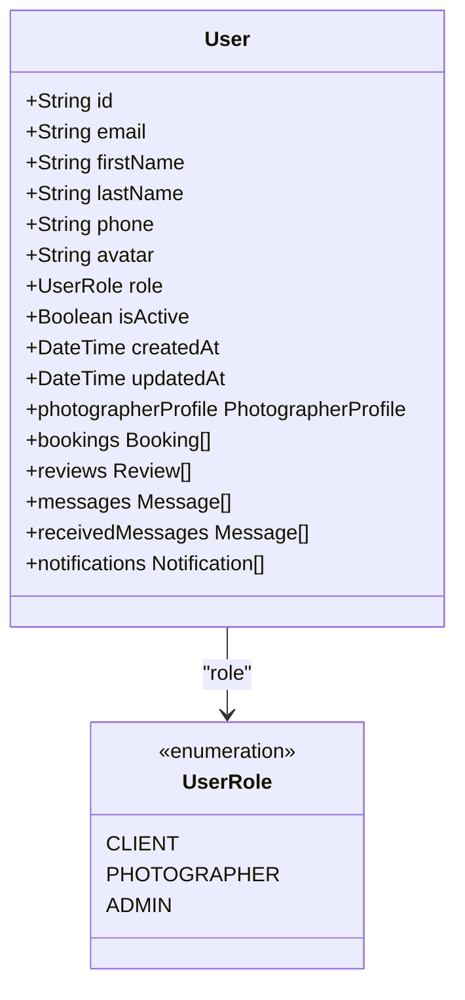

**Diagram sources**
- [prisma/schema.prisma](file://prisma/schema.prisma#L16-L32)

### PhotographerProfile Entity

PhotographerProfile extends the basic User entity with professional information and application status tracking.

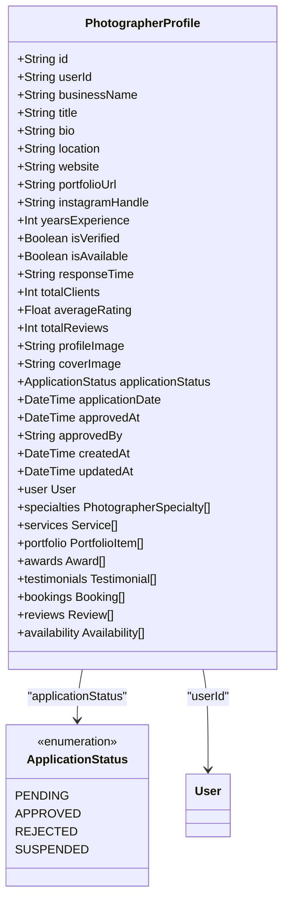

**Diagram sources**
- [prisma/schema.prisma](file://prisma/schema.prisma#L49-L110)

### Booking Entity

The Booking entity manages the complete lifecycle of photography services, from initial request to completion.

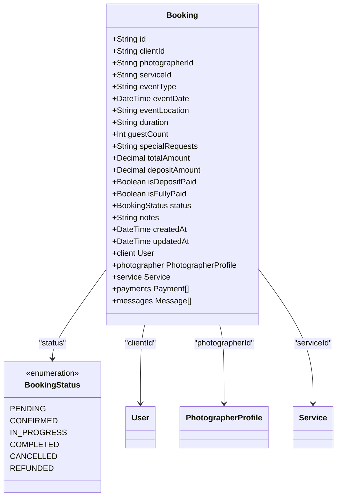

**Diagram sources**
- [prisma/schema.prisma](file://prisma/schema.prisma#L231-L270)

**Section sources**
- [prisma/schema.prisma](file://prisma/schema.prisma#L16-L270)

## Entity Relationship Diagram

The complete entity relationship diagram illustrates all major relationships in the database:

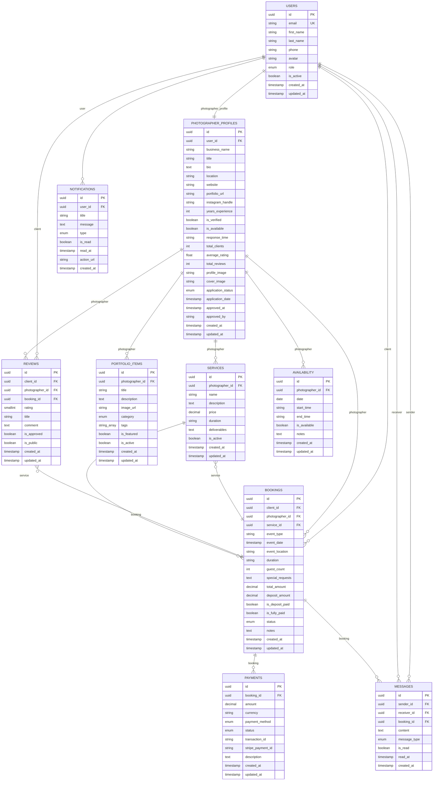

**Diagram sources**
- [prisma/schema.prisma](file://prisma/schema.prisma#L16-L463)

## Field Definitions and Constraints

### Primary Data Types

The database uses PostgreSQL native data types with Prisma-specific constraints:

- **String**: Variable-length character strings with length limits
- **Int**: 32-bit integer values
- **Float**: 64-bit floating-point numbers
- **Boolean**: True/false values
- **DateTime**: Timestamp with timezone support
- **Decimal**: Fixed-point decimal numbers for financial calculations
- **Json**: Flexible JSON storage for dynamic metadata
- **String[]**: Array of strings for tags and categories

### Primary Keys and Foreign Keys

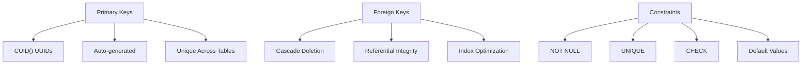

### Constraint Examples

1. **Unique Constraints**: `email` in Users table, `userId` in PhotographerProfile
2. **Foreign Key Constraints**: All relationships with cascade deletion
3. **Check Constraints**: Price >= 0, Rating between 1-5
4. **Default Values**: `role: CLIENT`, `isActive: true`, `createdAt: now()`

**Section sources**
- [prisma/schema.prisma](file://prisma/schema.prisma#L16-L463)

## Data Validation Rules

### Business Logic Enforcement

The database enforces business rules through multiple mechanisms:

1. **Database-Level Constraints**: Primary keys, foreign keys, unique constraints
2. **Domain-Specific Rules**: Enum types for statuses and categories
3. **Numeric Validation**: Price and rating constraints
4. **Temporal Logic**: Event date validation and availability checks

### Validation Examples

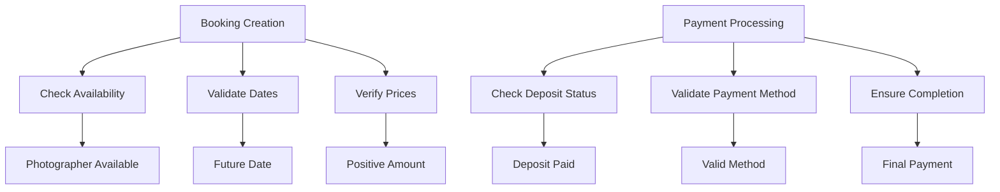

### Example Validation Rules

1. **Booking Validation**:
   - Event date must be in the future
   - Total amount must be greater than zero
   - Deposit amount cannot exceed total amount
   - Photographer must be available on selected date

2. **Review Validation**:
   - Rating must be between 1 and 5
   - Client can only review once per booking
   - Reviews require admin approval for public visibility

3. **Payment Validation**:
   - Payment amounts must match booking totals
   - Multiple payments allowed for partial payments
   - Payment status transitions follow business logic

**Section sources**
- [pages/api/bookings/index.ts](file://pages/api/bookings/index.ts#L70-L95)

## Seeding Process

The database seeding process creates realistic sample data for development and testing environments.

### Seed Script Architecture

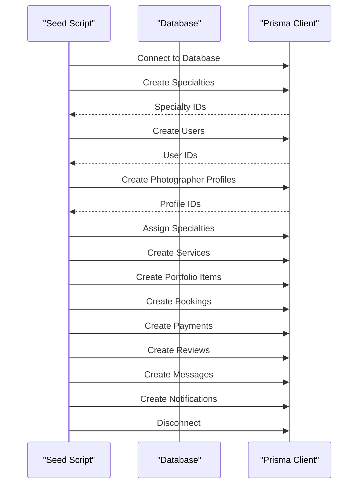

**Diagram sources**
- [prisma/seed.ts](file://prisma/seed.ts#L1-L700)

### Sample Data Structure

The seed script creates comprehensive sample data:

1. **Specialties**: 8 photography categories with icons
2. **Users**: 3 clients and 3 photographers
3. **Profiles**: Professional photographer information
4. **Services**: 6 services across 3 photographers
5. **Portfolio**: 6 portfolio items with categorized images
6. **Bookings**: 2 completed bookings with payments
7. **Reviews**: 2 client reviews for completed bookings
8. **Messages**: 2 sample conversations
9. **Search Queries**: 3 sample search patterns

### Seed Data Categories

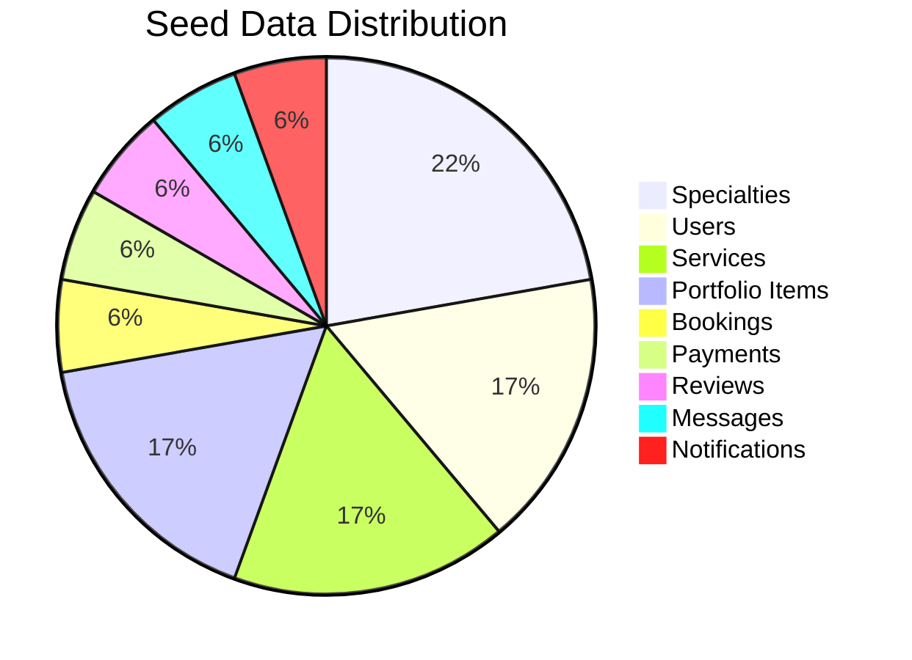

**Section sources**
- [prisma/seed.ts](file://prisma/seed.ts#L1-L700)

## Data Access Patterns

### API Layer Integration

The database integrates with Next.js API routes through Supabase client:

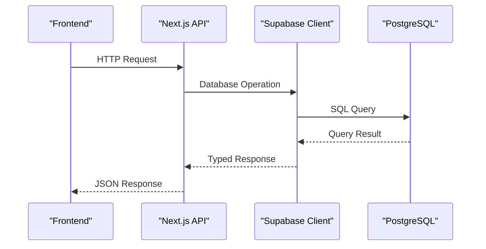

**Diagram sources**
- [pages/api/bookings/index.ts](file://pages/api/bookings/index.ts#L1-L208)
- [pages/api/photographers/index.ts](file://pages/api/photographers/index.ts#L1-L163)

### Query Patterns

1. **Pagination Queries**: Range-based pagination with offset/limit
2. **Filter Queries**: Location, specialty, rating filters
3. **Join Queries**: Complex joins for related data
4. **Aggregation Queries**: Count and statistics calculations

### Example API Operations

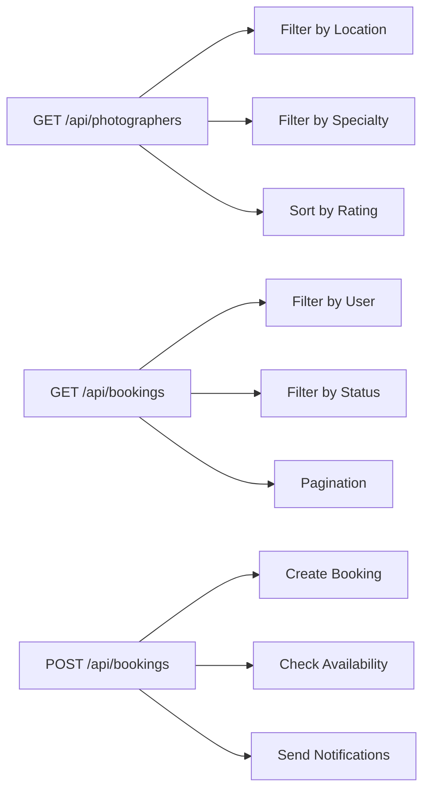

**Section sources**
- [pages/api/bookings/index.ts](file://pages/api/bookings/index.ts#L15-L50)
- [pages/api/photographers/index.ts](file://pages/api/photographers/index.ts#L15-L50)

## Indexing Strategies

### Primary Indexes

The database uses strategic indexing for optimal performance:

1. **Primary Key Indexes**: Automatically created for all tables
2. **Unique Indexes**: Email uniqueness in Users, userId uniqueness in PhotographerProfile
3. **Composite Indexes**: Photographer availability by date
4. **Partial Indexes**: Active records only for soft delete scenarios

### Performance-Optimized Indexes

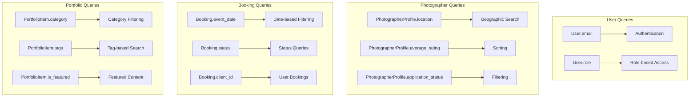

### Indexing Best Practices

1. **Covering Indexes**: Include frequently queried columns
2. **Functional Indexes**: Support case-insensitive searches
3. **Expression Indexes**: Enable complex filtering logic
4. **Maintenance**: Regular index statistics updates

## Performance Considerations

### Database Optimization

The database design incorporates several performance optimization strategies:

1. **Soft Deletes**: Instead of hard deletes, use `isActive` flags
2. **Aggregate Caching**: Pre-computed fields like `averageRating`
3. **JSON Fields**: Flexible metadata storage without schema changes
4. **Enum Types**: Efficient storage for categorical data

### Query Performance

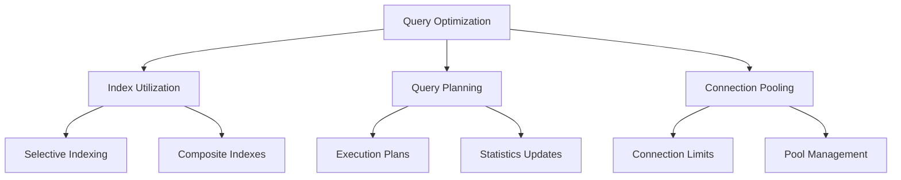

### Scalability Features

1. **Horizontal Scaling**: Sharding potential for large datasets
2. **Read Replicas**: Separate read/write databases
3. **Caching Layers**: Redis integration for hot data
4. **Partitioning**: Time-based partitioning for analytics

## Data Lifecycle and Retention

### Data Management Policies

The database implements comprehensive data lifecycle management:

1. **Active Data**: Frequently accessed current data
2. **Archival Data**: Historical data moved to cold storage
3. **Temporary Data**: Session and cache data with TTL
4. **Deleted Data**: Soft deletion with retention periods

### Retention Strategies

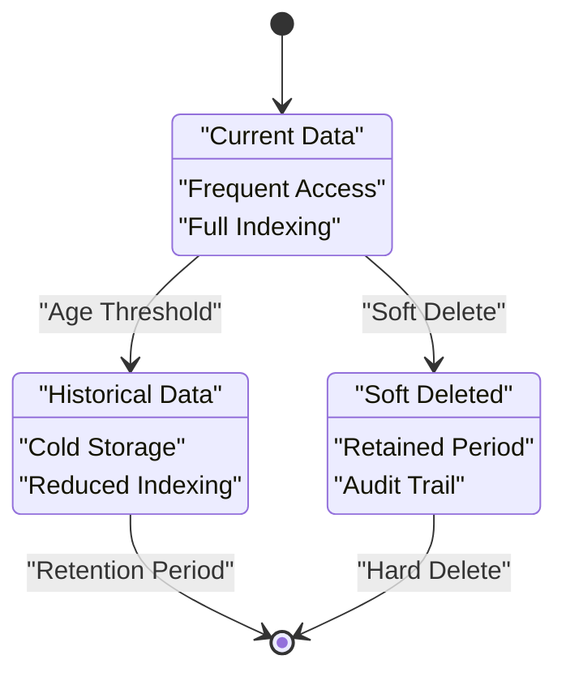

### Data Archival Process

1. **Automated Archival**: Scheduled jobs for data aging
2. **Compression**: Reduced storage footprint
3. **Metadata Preservation**: Maintained for compliance
4. **Access Control**: Restricted access to archived data

## Security and Privacy

### Data Protection Measures

The database implements robust security measures:

1. **Encryption**: At-rest and in-transit encryption
2. **Access Control**: Role-based permissions
3. **Audit Trails**: Comprehensive logging
4. **Data Masking**: Sensitive data protection

### Privacy Compliance

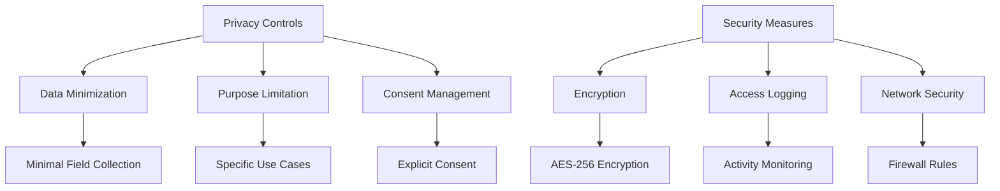

### Compliance Features

1. **GDPR Compliance**: Right to erasure and data portability
2. **CCPA Compliance**: California consumer rights
3. **SOC 2 Type II**: Security controls certification
4. **PCI DSS**: Payment card industry standards

## API Integration Points

### External Service Integrations

The database supports multiple external service integrations:

1. **Stripe Payment Processing**: Secure payment handling
2. **Cloud Storage**: Image and media file hosting
3. **Email Services**: Notification delivery
4. **Analytics Platforms**: Business intelligence

### Integration Architecture

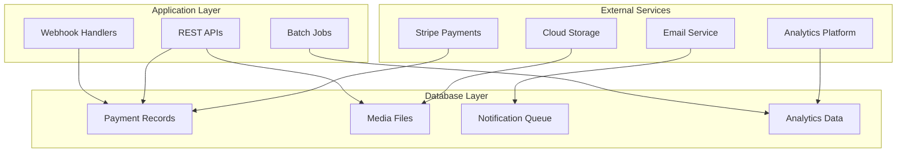

### Webhook Support

1. **Payment Webhooks**: Stripe payment status updates
2. **Booking Updates**: Real-time booking status changes
3. **Message Notifications**: Push notification triggers
4. **System Events**: Administrative actions

**Section sources**
- [src/lib/supabase.ts](file://src/lib/supabase.ts#L1-L242)

## Migration Strategy

### Phased Implementation Approach

The database migration follows a structured phased approach:

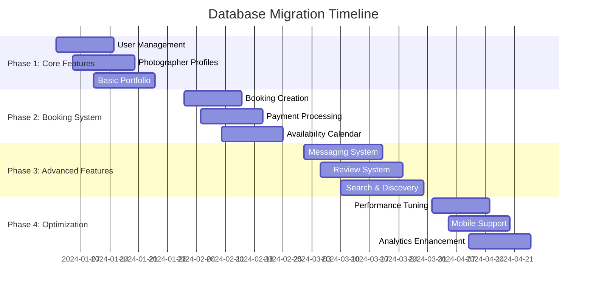

### Migration Tools and Processes

1. **Prisma Migrations**: Version-controlled schema changes
2. **Seed Scripts**: Automated data population
3. **Rollback Procedures**: Safe rollback mechanisms
4. **Testing Framework**: Comprehensive migration testing

### Deployment Considerations

1. **Zero-Downtime Deployments**: Blue-green deployments
2. **Data Validation**: Pre-deployment data integrity checks
3. **Monitoring**: Real-time migration monitoring
4. **Backup Strategies**: Pre-migration backups

## Troubleshooting Guide

### Common Issues and Solutions

1. **Connection Issues**:
   - Verify DATABASE_URL environment variable
   - Check network connectivity to database
   - Validate SSL/TLS configuration

2. **Migration Failures**:
   - Review migration logs for errors
   - Check for constraint violations
   - Verify data integrity before migration

3. **Performance Issues**:
   - Analyze slow query logs
   - Review index utilization
   - Check connection pool settings

4. **Data Integrity Problems**:
   - Validate foreign key constraints
   - Check for orphaned records
   - Review cascade deletion rules

### Debugging Tools

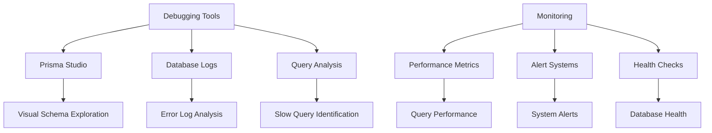

### Maintenance Tasks

1. **Index Maintenance**: Regular index rebuilds
2. **Statistics Updates**: Query planner optimization
3. **Vacuum Operations**: Space reclamation
4. **Backup Verification**: Restore testing

## Conclusion

The SnapEvent database design provides a robust, scalable foundation for a comprehensive photography marketplace platform. The schema design balances flexibility with performance, supporting complex business logic while maintaining data integrity and security.

### Key Strengths

1. **Comprehensive Coverage**: Supports all core platform features
2. **Scalable Architecture**: Designed for growth and expansion
3. **Performance Optimization**: Strategic indexing and caching
4. **Security Focus**: Multi-layered security and privacy controls
5. **Developer-Friendly**: Clear relationships and intuitive data access

### Future Enhancements

1. **Advanced Analytics**: Real-time analytics and reporting
2. **Machine Learning Integration**: Recommendation systems
3. **Mobile Optimization**: Offline-first mobile support
4. **International Expansion**: Multi-language and multi-currency support
5. **AI-Powered Features**: Automated content moderation and recommendations

The database design successfully addresses the current requirements while remaining flexible enough to accommodate future growth and feature additions. The combination of PostgreSQL's robustness, Prisma's developer productivity, and Supabase's managed services creates an optimal platform for the SnapEvent marketplace.