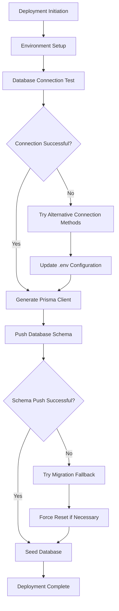
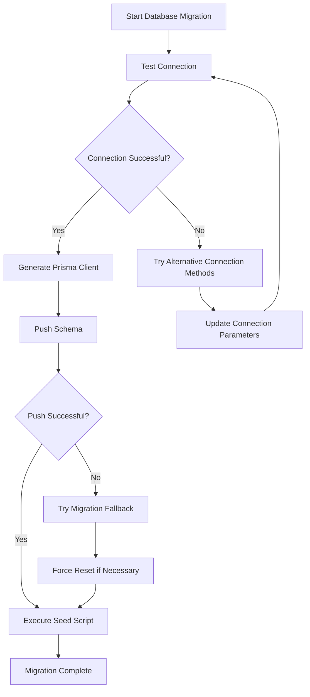

# Deployment Guide

<cite>
**Referenced Files in This Document**   
- [package.json](file://package.json)
- [next.config.js](file://next.config.js)
- [prisma/seed.ts](file://prisma/seed.ts)
- [scripts/migrate-push.js](file://scripts/migrate-push.js)
- [scripts/final-push.js](file://scripts/final-push.js)
- [scripts/push-database.js](file://scripts/push-database.js)
- [src/lib/supabase.ts](file://src/lib/supabase.ts)
- [src/lib/supabase-server.ts](file://src/lib/supabase-server.ts)
- [src/middleware/auth.ts](file://src/middleware/auth.ts)
- [src/middleware/validation.ts](file://src/middleware/validation.ts)
</cite>

## Table of Contents
1. [Introduction](#introduction)
2. [Build Process and Output Optimization](#build-process-and-output-optimization)
3. [Environment Variable Configuration](#environment-variable-configuration)
4. [Deployment Workflow](#deployment-workflow)
5. [Platform-Specific Deployment](#platform-specific-deployment)
6. [Database Migration and Seed Execution](#database-migration-and-seed-execution)
7. [Monitoring and Logging Recommendations](#monitoring-and-logging-recommendations)
8. [Rollback Procedures and Version Management](#rollback-procedures-and-version-management)

## Introduction
This guide provides comprehensive instructions for deploying the SnapEvent application to production. It covers the complete deployment lifecycle including build optimization, environment configuration, database management, platform-specific considerations, and operational procedures. The SnapEvent application is a Next.js-based platform for connecting clients with photographers, featuring booking management, portfolio展示, and user authentication through Supabase.

## Build Process and Output Optimization

The SnapEvent application uses Next.js for its frontend framework, which provides built-in optimization features for production deployment. The build process is configured through the `next.config.js` file and package.json scripts.

The application's build process utilizes the `next build` command, which performs several optimization steps:
- Automatic code splitting to minimize initial bundle size
- Tree shaking to eliminate unused code
- Image optimization (though unoptimized in this configuration due to the `images: { unoptimized: true }` setting)
- Minification of JavaScript, CSS, and HTML
- Generation of static HTML where possible

The build output is optimized for performance with trailing slashes enabled in the configuration, which can improve URL consistency and SEO. The build process also generates optimized assets for different screen sizes and devices.

To execute the build process, run:
```bash
npm run build
```

This command will create an optimized production build in the `.next` directory, ready for deployment to any hosting platform.

**Section sources**
- [next.config.js](file://next.config.js#L1-L9)
- [package.json](file://package.json#L110-L120)

## Environment Variable Configuration

The SnapEvent application relies on environment variables for configuration across different deployment stages. These variables are critical for connecting to the Supabase backend, managing authentication, and configuring application behavior.

The application uses the following key environment variables:

| Environment Variable | Purpose | Required in Production |
|----------------------|-------|----------------------|
| NEXT_PUBLIC_SUPABASE_URL | Supabase project URL for client-side connections | Yes |
| NEXT_PUBLIC_SUPABASE_ANON_KEY | Supabase anonymous key for client-side API access | Yes |
| SUPABASE_SERVICE_ROLE_KEY | Supabase service role key for server-side privileged operations | Yes |
| DATABASE_URL | Direct database connection string for Prisma operations | Yes |

For different deployment stages, maintain separate environment configurations:
- **Development**: Use a dedicated Supabase project for testing
- **Staging**: Use a staging database with sample data
- **Production**: Use the production Supabase project with proper security settings

The application's scripts automatically configure the DATABASE_URL for Supabase connections, using the pooler connection format with SSL requirements for secure database access.

**Section sources**
- [src/lib/supabase.ts](file://src/lib/supabase.ts#L3-L10)
- [src/lib/supabase-server.ts](file://src/lib/supabase-server.ts#L4-L10)
- [scripts/push-database.js](file://scripts/push-database.js#L40-L50)

## Deployment Workflow

The SnapEvent application includes a comprehensive deployment workflow managed through custom scripts in the `scripts/` directory. These scripts handle database schema management, connection testing, and deployment operations.

### Core Deployment Scripts

The deployment workflow consists of several Node.js scripts that automate the deployment process:



**Diagram sources**
- [scripts/push-database.js](file://scripts/push-database.js#L1-L225)
- [scripts/migrate-push.js](file://scripts/migrate-push.js#L1-L46)

### Script Functionality

The deployment workflow includes multiple scripts for different scenarios:

- **push-database.js**: Comprehensive setup script that tests connections, updates environment variables, generates Prisma client, and pushes the database schema
- **migrate-push.js**: Migration-focused script that attempts to apply Prisma migrations to the Supabase database
- **final-push.js**: Fallback script that tries multiple connection string formats to ensure schema deployment
- **simple-push.js**: Basic script for pushing the schema with minimal configuration
- **test-connection-simple.js**: Connection testing script to verify database accessibility

The workflow is designed to be resilient, with fallback mechanisms when primary connection methods fail. The scripts implement timeout settings (up to 5 minutes) to accommodate potential network latency when connecting to Supabase.

**Section sources**
- [scripts/push-database.js](file://scripts/push-database.js#L1-L225)
- [scripts/migrate-push.js](file://scripts/migrate-push.js#L1-L46)
- [scripts/final-push.js](file://scripts/final-push.js#L1-L60)

## Platform-Specific Considerations

### Vercel Deployment

Vercel is a natural choice for deploying Next.js applications like SnapEvent. When deploying to Vercel:

1. Connect your GitHub repository to Vercel
2. Set the build command to `next build`
3. Set the output directory to `.next`
4. Configure environment variables in the Vercel dashboard
5. Enable Serverless Functions for API routes

Vercel automatically optimizes Next.js applications, providing features like:
- Automatic HTTPS
- Global CDN for static assets
- Serverless function scaling
- Preview deployments for pull requests

### Netlify Deployment

For Netlify deployment:

1. Connect your repository and set the build command to `next build`
2. Set the publish directory to `.next`
3. Configure environment variables in Netlify settings
4. Install the Next.js plugin for Netlify

Note that Netlify requires additional configuration for Next.js API routes and server-side rendering. You may need to include a `netlify.toml` configuration file to properly route requests.

### Custom Server Deployment

When deploying to a custom server:

1. Ensure Node.js 18+ is installed
2. Run `npm run build` to generate the production build
3. Start the server with `npm run start`
4. Configure a process manager like PM2 to keep the application running
5. Set up reverse proxy with Nginx or Apache

For custom servers, you'll need to manually configure:
- SSL certificates
- Load balancing for high traffic
- Log rotation and monitoring
- Backup procedures for the application and database

**Section sources**
- [package.json](file://package.json#L110-L120)
- [next.config.js](file://next.config.js#L1-L9)

## Database Migration and Seed Execution

### Database Migration Strategy

The SnapEvent application uses Prisma as its ORM, with a migration strategy designed for Supabase. The migration process follows these steps:

1. **Prisma Client Generation**: The scripts first generate the Prisma client based on the schema
2. **Schema Push**: Attempt to push the schema directly to the database using `prisma db push`
3. **Migration Fallback**: If direct push fails, attempt `prisma migrate dev` as a fallback
4. **Force Reset**: As a last resort, use `prisma db push --force-reset --accept-data-loss` to reset the schema

The application's scripts implement multiple connection string formats to overcome common Supabase connection issues, including:
- Standard pooler connection
- Connection with PgBouncer disabled
- Connection with explicit timeout settings
- Connection with application name parameter

### Seed Execution in Production

The database seeding process is implemented in `prisma/seed.ts` and includes comprehensive sample data for testing and demonstration purposes.

The seed process creates:
- User accounts (clients and photographers)
- Photographer profiles with specialties
- Services with pricing and descriptions
- Portfolio items with categories and tags
- Availability schedules
- Bookings and payments
- Reviews and testimonials
- Messages and notifications

In production, seed execution should be handled carefully:
- Only run seeding on initial deployment or when explicitly needed
- Ensure proper backups exist before running seed operations
- Consider using a separate seeding script for production with realistic data volumes

The seed script is configured in package.json with `"prisma": { "seed": "tsx prisma/seed.ts" }`, allowing it to be run with `npx prisma db seed`.



**Diagram sources**
- [prisma/seed.ts](file://prisma/seed.ts#L1-L699)
- [scripts/push-database.js](file://scripts/push-database.js#L180-L200)
- [package.json](file://package.json#L105-L107)

**Section sources**
- [prisma/seed.ts](file://prisma/seed.ts#L1-L699)
- [scripts/push-database.js](file://scripts/push-database.js#L1-L225)

## Monitoring and Logging Recommendations

### Application Monitoring

For effective monitoring of the SnapEvent application in production:

1. **Error Tracking**: Implement a service like Sentry or LogRocket to capture and analyze client-side and server-side errors
2. **Performance Monitoring**: Use tools like New Relic or Datadog to monitor application performance, API response times, and database queries
3. **Uptime Monitoring**: Set up uptime checks with services like UptimeRobot or Pingdom to receive alerts when the application becomes unavailable
4. **User Analytics**: Implement analytics to track user behavior, conversion rates, and feature usage

### Logging Strategy

The application should implement a comprehensive logging strategy:

- **Client-Side Logging**: Log significant user interactions and errors, with proper privacy considerations
- **Server-Side Logging**: Log API requests, database operations, and system events
- **Error Logging**: Capture detailed error information including stack traces, user context, and request data
- **Security Logging**: Log authentication attempts, permission changes, and sensitive operations

The existing codebase includes basic console logging in the deployment scripts, which should be enhanced in production with structured logging and log aggregation.

### Supabase Integration

Leverage Supabase's built-in monitoring features:
- Database performance metrics
- Authentication logs
- Real-time subscription monitoring
- Storage usage analytics

Set up alerts for:
- Database connection limits
- Storage quota usage
- Authentication rate limits
- API request limits

**Section sources**
- [src/middleware/auth.ts](file://src/middleware/auth.ts#L1-L95)
- [src/middleware/validation.ts](file://src/middleware/validation.ts#L1-L160)

## Rollback Procedures and Version Management

### Rollback Strategy

A robust rollback strategy is essential for maintaining application availability:

1. **Database Rollback**: Before major schema changes, create a database backup using Supabase's backup features
2. **Application Rollback**: Maintain previous deployment versions in your hosting platform
3. **Configuration Rollback**: Keep versioned copies of environment variables and configuration files

For Vercel deployments, utilize the built-in rollback feature to quickly revert to a previous deployment. For custom servers, implement a deployment script that can switch between versioned application directories.

### Version Management

Implement semantic versioning for the application:
- **Major versions** for breaking changes
- **Minor versions** for new features
- **Patch versions** for bug fixes

Use Git tags to mark releases and maintain a changelog documenting changes in each version.

### Deployment Safety Measures

1. **Staging Environment**: Always test deployments in a staging environment that mirrors production
2. **Database Backups**: Create backups before deploying schema changes
3. **Gradual Rollout**: For large user bases, consider gradual rollout strategies
4. **Health Checks**: Implement health check endpoints to verify application status after deployment

The deployment scripts should be updated to include pre-deployment checks and post-deployment verification steps to ensure a smooth deployment process.

**Section sources**
- [package.json](file://package.json#L110-L120)
- [scripts/push-database.js](file://scripts/push-database.js#L1-L225)