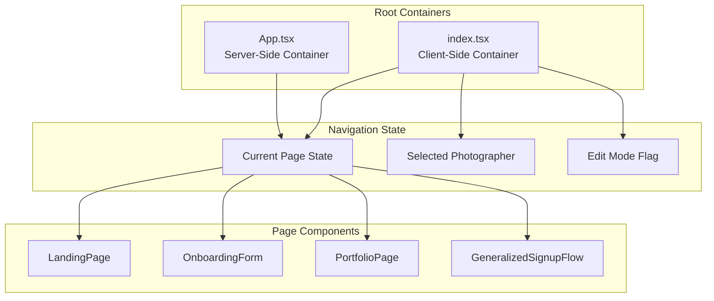
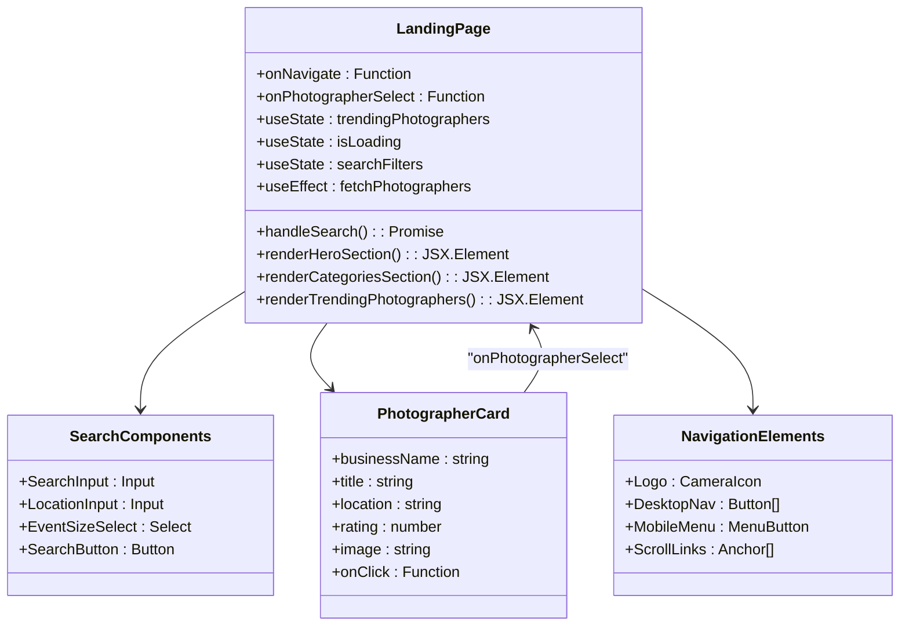
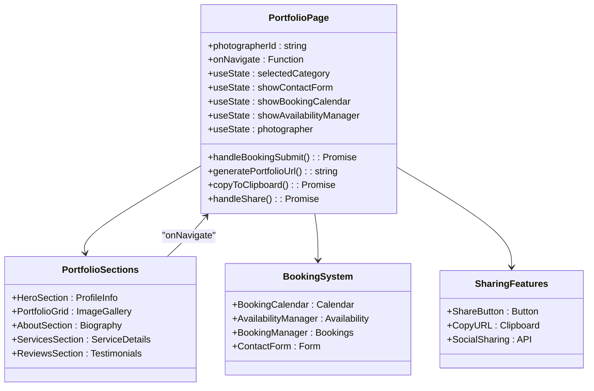
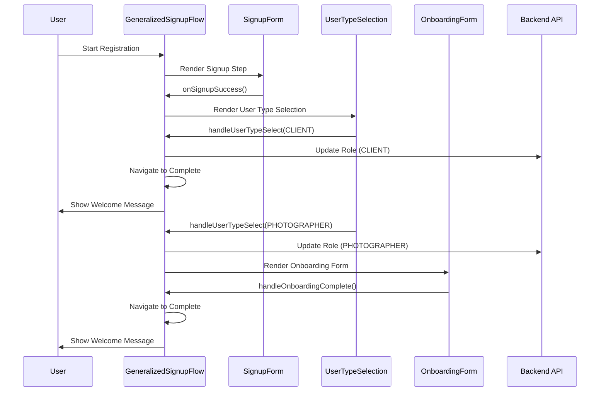
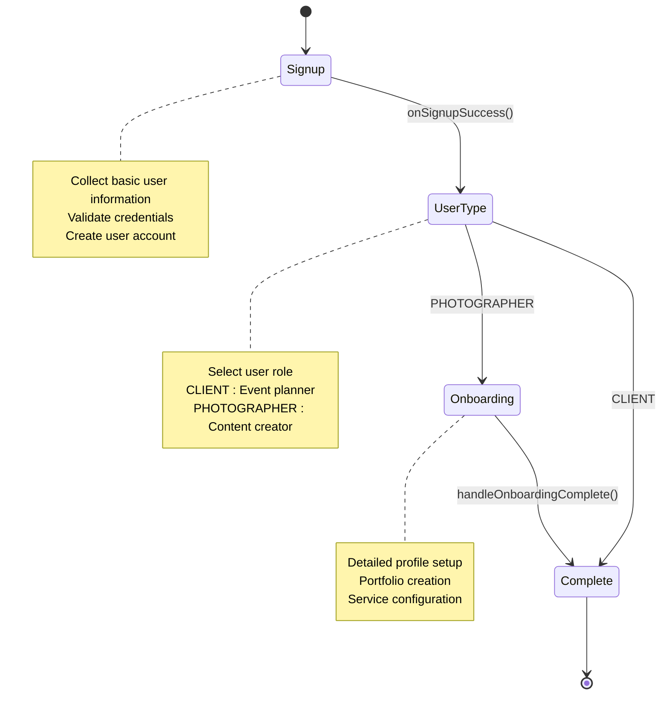
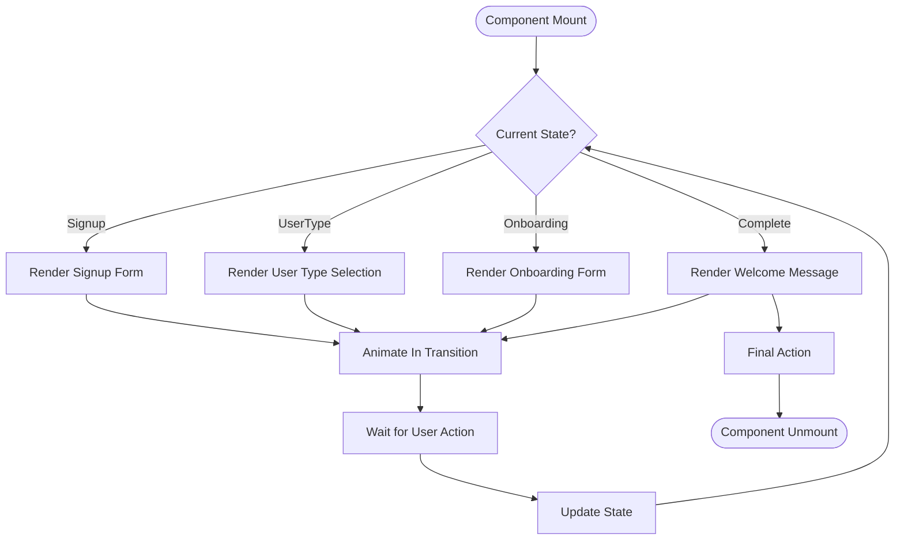
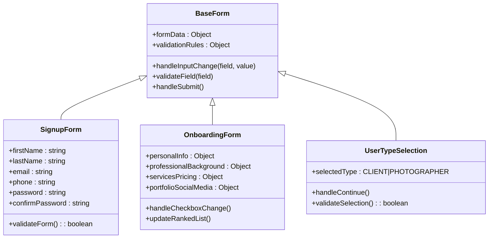
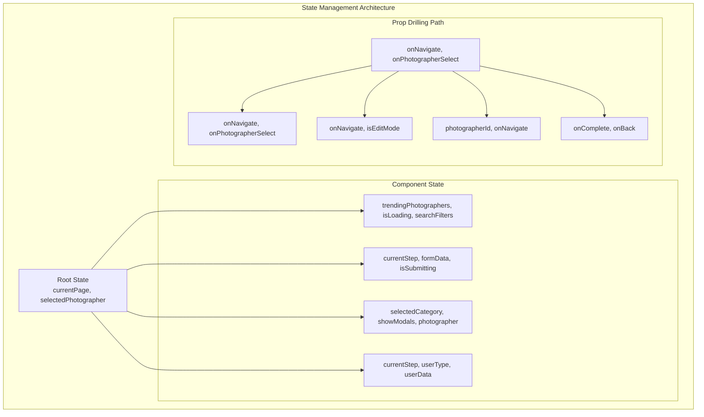
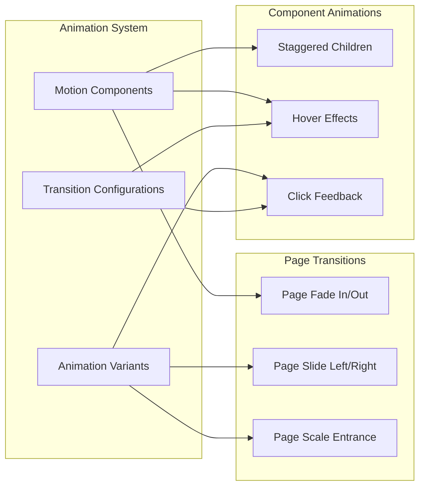
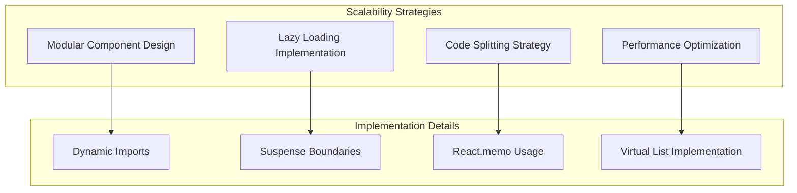

# Component Hierarchy Architecture Documentation

<cite>
**Referenced Files in This Document**
- [src/App.tsx](file://src/App.tsx)
- [pages/index.tsx](file://pages/index.tsx)
- [src/components/LandingPage.tsx](file://src/components/LandingPage.tsx)
- [src/components/OnboardingForm.tsx](file://src/components/OnboardingForm.tsx)
- [src/components/PortfolioPage.tsx](file://src/components/PortfolioPage.tsx)
- [src/components/GeneralizedSignupFlow.tsx](file://src/components/GeneralizedSignupFlow.tsx)
- [src/components/UserTypeSelection.tsx](file://src/components/UserTypeSelection.tsx)
- [src/components/SignupForm.tsx](file://src/components/SignupForm.tsx)
- [pages/_app.tsx](file://pages/_app.tsx)
- [pages/_document.tsx](file://pages/_document.tsx)
</cite>

## Table of Contents
1. [Introduction](#introduction)
2. [Root Container Architecture](#root-container-architecture)
3. [Page-Level Component Hierarchy](#page-level-component-hierarchy)
4. [Multi-Step Registration Flow](#multi-step-registration-flow)
5. [Component Composition Patterns](#component-composition-patterns)
6. [State Management and Prop Drilling](#state-management-and-prop-drilling)
7. [Animation and Transition Systems](#animation-and-transition-systems)
8. [Best Practices and Maintainability](#best-practices-and-maintainability)
9. [Conclusion](#conclusion)

## Introduction

The SnapEvent frontend follows a sophisticated component hierarchy architecture built on React and Next.js. The application is structured around a central orchestration pattern where the root container manages page-level components through a state-driven navigation system. This architecture enables seamless transitions between different user journeys while maintaining clean separation of concerns and optimal performance through strategic component composition.

The component hierarchy demonstrates advanced patterns including animation-driven navigation, multi-step workflows, and responsive design systems that adapt to different user roles and contexts. The architecture prioritizes maintainability through consistent prop interfaces, reusable component patterns, and efficient state management strategies.

## Root Container Architecture

The application's root container serves as the central orchestrator for all page-level components. The primary root containers are located in two key files: `src/App.tsx` and `pages/index.tsx`.

**Diagram sources**
- [src/App.tsx](file://src/App.tsx#L1-L55)
- [pages/index.tsx](file://pages/index.tsx#L1-L116)

Both root containers implement identical navigation logic but differ in their rendering approaches. The server-side container (`App.tsx`) uses conditional rendering, while the client-side container (`index.tsx`) leverages `AnimatePresence` for smooth transitions.

**Section sources**
- [src/App.tsx](file://src/App.tsx#L1-L55)
- [pages/index.tsx](file://pages/index.tsx#L1-L116)

## Page-Level Component Hierarchy

The page-level component hierarchy forms the backbone of the user interface, with each component serving a specific purpose in the user journey.

### Landing Page Architecture

The LandingPage component represents the primary entry point and showcases the core value proposition through interactive elements and dynamic content.

**Diagram sources**
- [src/components/LandingPage.tsx](file://src/components/LandingPage.tsx#L1-L844)

### Portfolio Page Architecture

The PortfolioPage component serves as the photographer's showcase, featuring comprehensive profile management and booking capabilities.

**Diagram sources**
- [src/components/PortfolioPage.tsx](file://src/components/PortfolioPage.tsx#L1-L889)

**Section sources**
- [src/components/LandingPage.tsx](file://src/components/LandingPage.tsx#L1-L844)
- [src/components/PortfolioPage.tsx](file://src/components/PortfolioPage.tsx#L1-L889)

## Multi-Step Registration Flow

The GeneralizedSignupFlow component orchestrates a sophisticated multi-step registration process that adapts based on user type selection.

**Diagram sources**
- [src/components/GeneralizedSignupFlow.tsx](file://src/components/GeneralizedSignupFlow.tsx#L1-L192)
- [src/components/SignupForm.tsx](file://src/components/SignupForm.tsx#L1-L294)
- [src/components/UserTypeSelection.tsx](file://src/components/UserTypeSelection.tsx#L1-L188)

### Registration Flow States

The registration flow operates through distinct states that manage the progression of user onboarding:

**Diagram sources**
- [src/components/GeneralizedSignupFlow.tsx](file://src/components/GeneralizedSignupFlow.tsx#L10-L192)

**Section sources**
- [src/components/GeneralizedSignupFlow.tsx](file://src/components/GeneralizedSignupFlow.tsx#L1-L192)
- [src/components/SignupForm.tsx](file://src/components/SignupForm.tsx#L1-L294)
- [src/components/UserTypeSelection.tsx](file://src/components/UserTypeSelection.tsx#L1-L188)

## Component Composition Patterns

The application employs several sophisticated composition patterns that promote reusability and maintainability.

### Animation-Driven Composition

The component hierarchy leverages Framer Motion for smooth transitions and animations:

**Diagram sources**
- [src/components/GeneralizedSignupFlow.tsx](file://src/components/GeneralizedSignupFlow.tsx#L80-L192)

### Reusable Form Components

The application implements a modular form system with reusable components:

**Diagram sources**
- [src/components/SignupForm.tsx](file://src/components/SignupForm.tsx#L1-L294)
- [src/components/OnboardingForm.tsx](file://src/components/OnboardingForm.tsx#L1-L933)
- [src/components/UserTypeSelection.tsx](file://src/components/UserTypeSelection.tsx#L1-L188)

**Section sources**
- [src/components/SignupForm.tsx](file://src/components/SignupForm.tsx#L1-L294)
- [src/components/OnboardingForm.tsx](file://src/components/OnboardingForm.tsx#L1-L933)
- [src/components/UserTypeSelection.tsx](file://src/components/UserTypeSelection.tsx#L1-L188)

## State Management and Prop Drilling

The application implements a hierarchical state management approach that minimizes prop drilling while maintaining component independence.

### Centralized State Management

**Diagram sources**
- [src/App.tsx](file://src/App.tsx#L1-L55)
- [pages/index.tsx](file://pages/index.tsx#L1-L116)

### Prop Drilling Optimization Strategies

The application employs several strategies to minimize prop drilling:

1. **Context API Implementation**: While not explicitly shown in the analyzed code, the pattern suggests potential context usage for shared state like theme preferences and user authentication.

2. **Higher-Order Components**: Components like `AnimatePresence` wrap child components to provide shared functionality without prop passing.

3. **Event Callbacks**: Instead of passing state, components pass callbacks that modify parent state, reducing the need for deep prop chains.

**Section sources**
- [src/App.tsx](file://src/App.tsx#L1-L55)
- [pages/index.tsx](file://pages/index.tsx#L1-L116)

## Animation and Transition Systems

The application implements a comprehensive animation system that enhances user experience through smooth transitions and visual feedback.

### Animation Architecture

**Diagram sources**
- [pages/index.tsx](file://pages/index.tsx#L30-L50)
- [src/components/LandingPage.tsx](file://src/components/LandingPage.tsx#L30-L80)

### Component-Level Animation Patterns

Each major component implements specific animation patterns:

- **LandingPage**: Uses staggered entrance animations for grid layouts and fade-in effects for sections
- **OnboardingForm**: Implements step-by-step animations with directional transitions
- **PortfolioPage**: Features smooth modal transitions and interactive hover effects
- **GeneralizedSignupFlow**: Utilizes spring-based animations for responsive user feedback

**Section sources**
- [pages/index.tsx](file://pages/index.tsx#L30-L50)
- [src/components/LandingPage.tsx](file://src/components/LandingPage.tsx#L30-L80)

## Best Practices and Maintainability

The component hierarchy demonstrates several best practices that contribute to long-term maintainability and scalability.

### Component Design Principles

1. **Single Responsibility**: Each component focuses on a specific UI concern
2. **Composition Over Inheritance**: Components are built through composition rather than extension
3. **Consistent Interfaces**: Props and state management follow predictable patterns
4. **Type Safety**: Comprehensive TypeScript interfaces ensure type safety across the component tree

### Scalability Patterns

### Maintenance Considerations

The architecture supports maintenance through:

- **Clear Separation of Concerns**: Each component has well-defined responsibilities
- **Reusable Patterns**: Common patterns are abstracted into reusable components
- **Consistent Naming Conventions**: Component names follow established patterns
- **Documentation Integration**: Comments and TypeScript interfaces serve as documentation

**Section sources**
- [src/components/LandingPage.tsx](file://src/components/LandingPage.tsx#L1-L50)
- [src/components/OnboardingForm.tsx](file://src/components/OnboardingForm.tsx#L1-L50)

## Conclusion

The SnapEvent component hierarchy represents a sophisticated architectural approach that balances complexity with maintainability. The system demonstrates advanced patterns including animation-driven navigation, multi-step workflows, and responsive design systems. The hierarchical structure enables seamless user experiences while maintaining clean separation of concerns and optimal performance.

Key architectural strengths include:

- **Flexible Navigation System**: The state-driven navigation allows for easy modification of user journeys
- **Animation-First Design**: Smooth transitions enhance user experience and guide user attention
- **Reusable Component Patterns**: Consistent patterns promote code reuse and maintainability
- **Type Safety**: Comprehensive TypeScript implementation ensures reliability and developer productivity

The architecture successfully addresses the challenges of building a complex web application while maintaining the flexibility to evolve and scale with changing requirements. The component hierarchy serves as an excellent example of modern React architecture principles applied to real-world applications.