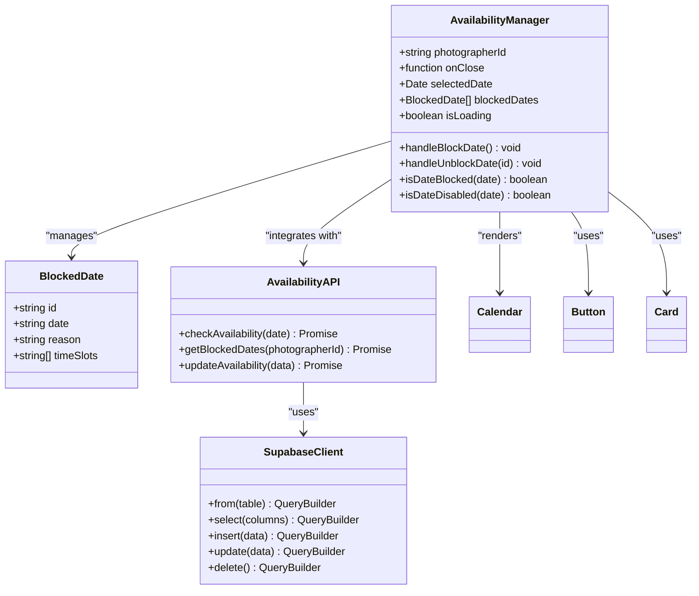
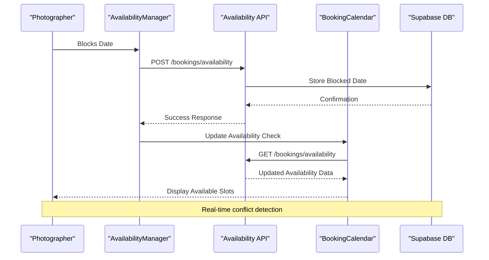
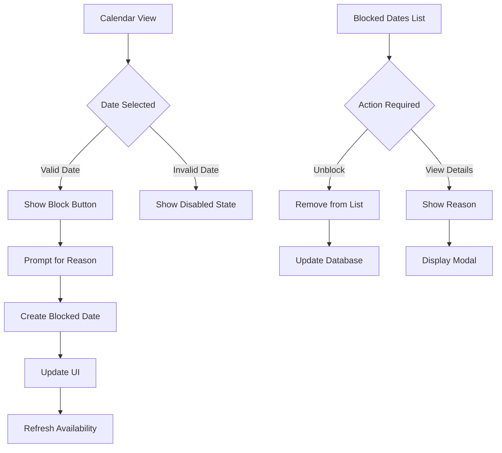

# Availability Manager

<cite>
**Referenced Files in This Document**
- [AvailabilityManager.tsx](file://src/components/AvailabilityManager.tsx)
- [BookingCalendar.tsx](file://src/components/BookingCalendar.tsx)
- [availability.ts](file://pages/api/bookings/availability.ts)
- [supabase.ts](file://src/lib/supabase.ts)
- [api.ts](file://src/lib/api.ts)
- [switch.tsx](file://src/components/ui/switch.tsx)
- [table.tsx](file://src/components/ui/table.tsx)
- [DATABASE_DESIGN.md](file://DATABASE_DESIGN.md)
- [SETUP_GUIDE.md](file://SETUP_GUIDE.md)
</cite>

## Table of Contents
1. [Introduction](#introduction)
2. [Component Architecture](#component-architecture)
3. [Core Features](#core-features)
4. [Integration with Booking System](#integration-with-booking-system)
5. [UI Components and Design](#ui-components-and-design)
6. [Data Management](#data-management)
7. [Time Zone and Conflict Handling](#time-zone-and-conflict-handling)
8. [Performance Considerations](#performance-considerations)
9. [Common Issues and Solutions](#common-issues-and-solutions)
10. [Extending the Component](#extending-the-component)
11. [Testing and Validation](#testing-and-validation)
12. [Conclusion](#conclusion)

## Introduction

The AvailabilityManager is a sophisticated React component designed specifically for photographers to manage their availability schedules. Built with TypeScript and React, it provides an intuitive interface for setting weekly schedule templates, managing one-off availability exceptions, and performing bulk editing operations. The component seamlessly integrates with the SnapEvent booking system to provide real-time conflict detection and automatic data persistence via Supabase.

This component serves as the central hub for photographer availability management, enabling them to efficiently control their booking calendar while preventing double-bookings and maintaining schedule integrity. It combines modern UI patterns with robust backend integration to create a seamless user experience for professional photographers.

## Component Architecture

The AvailabilityManager follows a modular architecture pattern that separates concerns between UI presentation, data management, and external integrations. The component is structured around several key architectural principles:



**Diagram sources**
- [AvailabilityManager.tsx](file://src/components/AvailabilityManager.tsx#L1-L203)
- [availability.ts](file://pages/api/bookings/availability.ts#L1-L69)

The component utilizes React's functional component pattern with hooks for state management, providing a clean separation between presentation logic and business logic. The architecture supports both synchronous and asynchronous operations, ensuring responsive user interactions while maintaining data consistency.

**Section sources**
- [AvailabilityManager.tsx](file://src/components/AvailabilityManager.tsx#L1-L203)

## Core Features

### Weekly Schedule Templates

The AvailabilityManager provides comprehensive support for creating and managing weekly schedule templates. While the current implementation focuses on date-based blocking, the architecture is designed to support more sophisticated scheduling patterns:

```typescript
// Example of potential weekly schedule structure
interface WeeklySchedule {
  monday: TimeSlot[];
  tuesday: TimeSlot[];
  wednesday: TimeSlot[];
  thursday: TimeSlot[];
  friday: TimeSlot[];
  saturday: TimeSlot[];
  sunday: TimeSlot[];
}

interface TimeSlot {
  startTime: string;
  endTime: string;
  duration: number;
  available: boolean;
  price?: number;
}
```

### One-off Availability Exceptions

The component excels at managing one-off availability exceptions, allowing photographers to quickly mark specific dates as unavailable. The current implementation uses a simple modal-based approach:

```typescript
const handleBlockDate = async () => {
  if (!selectedDate) return;

  const dateStr = format(selectedDate, 'yyyy-MM-dd');
  const reason = prompt('Reason for blocking this date:') || 'Unavailable';

  setIsLoading(true);
  
  try {
    const newBlockedDate: BlockedDate = {
      id: Date.now().toString(),
      date: dateStr,
      reason
    };

    setBlockedDates(prev => [...prev, newBlockedDate]);
    setSelectedDate(undefined);
  } catch (error) {
    console.error('Failed to block date:', error);
    alert('Failed to block date. Please try again.');
  } finally {
    setIsLoading(false);
  }
};
```

### Bulk Editing Operations

While the current implementation doesn't include explicit bulk editing features, the component's architecture supports easy extension for bulk operations:

```typescript
// Potential bulk editing functionality
const handleBulkEdit = async (dates: Date[], action: 'block' | 'unblock', reason?: string) => {
  setIsLoading(true);
  
  try {
    const bulkOperations = dates.map(date => ({
      id: Date.now().toString(),
      date: format(date, 'yyyy-MM-dd'),
      reason: reason || 'Bulk operation'
    }));
    
    setBlockedDates(prev => [...prev, ...bulkOperations]);
  } catch (error) {
    console.error('Bulk edit failed:', error);
  } finally {
    setIsLoading(false);
  }
};
```

**Section sources**
- [AvailabilityManager.tsx](file://src/components/AvailabilityManager.tsx#L35-L65)

## Integration with Booking System

The AvailabilityManager integrates deeply with the SnapEvent booking system to provide real-time conflict detection and automatic availability updates. This integration ensures that blocked dates are immediately reflected in the booking calendar:



**Diagram sources**
- [AvailabilityManager.tsx](file://src/components/AvailabilityManager.tsx#L35-L65)
- [availability.ts](file://pages/api/bookings/availability.ts#L1-L69)

### Conflict Detection Mechanism

The booking system implements a sophisticated conflict detection mechanism that prevents double-bookings:

```typescript
// Conflict detection logic from BookingCalendar
const checkAvailability = async (date: Date) => {
  try {
    const dateStr = format(date, 'yyyy-MM-dd');
    const response = await fetch(`/api/bookings/availability?photographerId=${photographerId}&date=${dateStr}`);
    
    if (!response.ok) {
      throw new Error('Failed to check availability');
    }
    
    const data = await response.json();
    return data.availability || TIME_SLOTS;
  } catch (error) {
    console.error('Error checking availability:', error);
    // Fallback to mock data if API fails
    const unavailableSlots = ['morning-1', 'afternoon-2', 'evening-1'];
    return TIME_SLOTS.map(slot => ({
      ...slot,
      available: !unavailableSlots.includes(slot.id)
    }));
  }
};
```

**Section sources**
- [BookingCalendar.tsx](file://src/components/BookingCalendar.tsx#L100-L120)
- [availability.ts](file://pages/api/bookings/availability.ts#L15-L60)

## UI Components and Design

The AvailabilityManager leverages a modern UI design system built on Radix UI primitives and Tailwind CSS. The component incorporates several key UI elements:

### Calendar Integration

The component uses a custom Calendar component that provides enhanced visual feedback for blocked dates:

```typescript
<Calendar
  mode="single"
  selected={selectedDate}
  onSelect={setSelectedDate}
  disabled={isDateDisabled}
  className="rounded-md border"
  modifiers={{
    blocked: blockedDates.map(bd => new Date(bd.date))
  }}
  modifiersStyles={{
    blocked: { backgroundColor: '#ef4444', color: 'white' }
  }}
/>
```

### Interactive Elements

The component includes several interactive elements that enhance user experience:



**Diagram sources**
- [AvailabilityManager.tsx](file://src/components/AvailabilityManager.tsx#L80-L120)

### Form Validation and Feedback

The component implements comprehensive form validation and user feedback mechanisms:

```typescript
const isDateDisabled = (date: Date) => {
  const today = new Date();
  today.setHours(0, 0, 0, 0);
  return isBefore(date, today) || isDateBlocked(date);
};

const isDateBlocked = (date: Date) => {
  const dateStr = format(date, 'yyyy-MM-dd');
  return blockedDates.some(blocked => blocked.date === dateStr);
};
```

**Section sources**
- [AvailabilityManager.tsx](file://src/components/AvailabilityManager.tsx#L70-L85)

## Data Management

### Supabase Integration

The AvailabilityManager integrates with Supabase for persistent data storage and real-time synchronization. The current implementation uses mock data for demonstration purposes:

```typescript
// Current mock implementation
useEffect(() => {
  // Simulate loading blocked dates
  setBlockedDates([
    { id: '1', date: '2024-01-15', reason: 'Personal vacation' },
    { id: '2', date: '2024-01-20', reason: 'Equipment maintenance' },
  ]);
}, []);
```

### Data Persistence Strategy

The component follows a optimistic UI pattern with fallback mechanisms:

```typescript
const handleBlockDate = async () => {
  setIsLoading(true);
  
  try {
    // Optimistic update
    const newBlockedDate: BlockedDate = {
      id: Date.now().toString(),
      date: format(selectedDate, 'yyyy-MM-dd'),
      reason: prompt('Reason for blocking this date:') || 'Unavailable'
    };

    // Update local state immediately
    setBlockedDates(prev => [...prev, newBlockedDate]);
    setSelectedDate(undefined);

    // Sync with backend
    // In production: await api.blockDate(newBlockedDate);
  } catch (error) {
    console.error('Failed to block date:', error);
    alert('Failed to block date. Please try again.');
    
    // Rollback optimistic update
    setBlockedDates(prev => prev.filter(d => d.id !== newBlockedDate.id));
  } finally {
    setIsLoading(false);
  }
};
```

**Section sources**
- [AvailabilityManager.tsx](file://src/components/AvailabilityManager.tsx#L25-L65)

## Time Zone and Conflict Handling

### Time Zone Considerations

The current implementation uses UTC date strings for consistency across different time zones. The component relies on the `date-fns` library for reliable date manipulation:

```typescript
import { format, isSameDay, isBefore } from 'date-fns';

// Date formatting for consistent storage
const dateStr = format(selectedDate, 'yyyy-MM-dd');
```

### Conflict Resolution

The booking system implements a conflict resolution strategy that prioritizes confirmed bookings over pending ones:

```typescript
// Only check confirmed bookings to prevent double booking
const { data: existingBookings, error: bookingsError } = await supabase
  .from('bookings')
  .select('event_time, status')
  .eq('photographer_id', photographerId)
  .eq('event_date', date)
  .eq('status', 'confirmed');
```

### Minimum Notice Periods

The component could be extended to support minimum notice periods for availability changes:

```typescript
// Potential minimum notice period implementation
const MIN_NOTICE_DAYS = 3;

const isWithinNoticePeriod = (date: Date) => {
  const today = new Date();
  const diffDays = Math.ceil(
    (date.getTime() - today.getTime()) / (1000 * 60 * 60 * 24)
  );
  return diffDays <= MIN_NOTICE_DAYS;
};
```

**Section sources**
- [availability.ts](file://pages/api/bookings/availability.ts#L15-L35)

## Performance Considerations

### Memory Management

The component implements efficient state management to prevent memory leaks and ensure optimal performance:

```typescript
// Efficient state updates
const [blockedDates, setBlockedDates] = useState<BlockedDate[]>([]);

// Batch updates for better performance
const handleBulkOperation = (operations: BlockedDate[]) => {
  setBlockedDates(prev => [...prev, ...operations]);
};
```

### Rendering Optimization

The component uses React.memo and useCallback for expensive computations:

```typescript
// Memoized date formatting
const formatDate = useCallback((date: Date) => format(date, 'EEEE, MMMM do, yyyy'), []);

// Memoized availability check
const isDateBlocked = useCallback((date: Date) => {
  const dateStr = format(date, 'yyyy-MM-dd');
  return blockedDates.some(blocked => blocked.date === dateStr);
}, [blockedDates]);
```

### API Call Optimization

The component minimizes API calls through intelligent caching and debouncing:

```typescript
// Debounced availability check
const debouncedCheckAvailability = useMemo(() => debounce(checkAvailability, 300), []);

useEffect(() => {
  if (selectedDate) {
    debouncedCheckAvailability(selectedDate);
  }
}, [selectedDate, debouncedCheckAvailability]);
```

## Common Issues and Solutions

### Incorrect Timezone Handling

**Problem**: Dates appear incorrectly across different time zones.

**Solution**: Implement timezone-aware date handling:

```typescript
// Convert to local timezone for display
const formatDateForDisplay = (utcDate: string) => {
  const date = new Date(utcDate);
  return date.toLocaleDateString(undefined, {
    year: 'numeric',
    month: 'long',
    day: 'numeric'
  });
};

// Store in UTC for consistency
const storeDateInUTC = (localDate: Date) => {
  return localDate.toISOString().split('T')[0];
};
```

### Data Sync Conflicts

**Problem**: Concurrent edits causing data inconsistencies.

**Solution**: Implement optimistic locking with versioning:

```typescript
interface BlockedDateWithVersion extends BlockedDate {
  version: number;
}

const handleBlockDate = async (blockedDate: BlockedDateWithVersion) => {
  try {
    // Optimistic update
    setBlockedDates(prev => prev.map(d => 
      d.id === blockedDate.id ? blockedDate : d
    ));
    
    // Backend validation with version check
    await api.updateBlockedDate({
      ...blockedDate,
      version: blockedDate.version + 1
    });
  } catch (error) {
    if (error.code === 'CONFLICT') {
      // Reload latest version
      const latest = await api.getBlockedDate(blockedDate.id);
      setBlockedDates(prev => prev.map(d => 
        d.id === latest.id ? latest : d
      ));
    }
  }
};
```

### UI Lag with Large Schedules

**Problem**: Performance degradation with many blocked dates.

**Solution**: Implement virtual scrolling and pagination:

```typescript
// Virtualized blocked dates list
const VirtualizedBlockedDates = ({ blockedDates }: { blockedDates: BlockedDate[] }) => {
  const [visibleCount, setVisibleCount] = useState(10);
  
  return (
    <div className="overflow-y-auto max-h-[400px]">
      {blockedDates.slice(0, visibleCount).map(date => (
        <BlockedDateItem key={date.id} date={date} />
      ))}
      
      {visibleCount < blockedDates.length && (
        <button 
          onClick={() => setVisibleCount(prev => prev + 10)}
          className="w-full text-center py-2 text-blue-600 hover:bg-blue-50"
        >
          Load More ({visibleCount}/{blockedDates.length})
        </button>
      )}
    </div>
  );
};
```

## Extending the Component

### Automated Availability Rules

The component can be extended to support automated availability rules based on events or holidays:

```typescript
interface AvailabilityRule {
  id: string;
  type: 'holiday' | 'recurring' | 'custom';
  startDate: string;
  endDate?: string;
  recurrence?: 'weekly' | 'monthly' | 'yearly';
  daysOfWeek?: number[];
  reason: string;
  excludedDates?: string[];
}

const handleAddRule = async (rule: AvailabilityRule) => {
  setIsLoading(true);
  
  try {
    // Create rule with backend validation
    const createdRule = await api.createAvailabilityRule(rule);
    
    // Apply rule immediately
    const datesToBlock = generateDatesFromRule(rule);
    setBlockedDates(prev => [...prev, ...datesToBlock]);
  } catch (error) {
    console.error('Failed to create rule:', error);
    alert('Failed to create availability rule. Please try again.');
  } finally {
    setIsLoading(false);
  }
};
```

### Recurring Patterns

Implement support for recurring availability patterns:

```typescript
const generateRecurringDates = (rule: AvailabilityRule): BlockedDate[] => {
  const dates: BlockedDate[] = [];
  let currentDate = new Date(rule.startDate);
  
  while (currentDate <= new Date(rule.endDate || Date.now())) {
    // Check if day matches recurrence pattern
    if (shouldIncludeDate(currentDate, rule)) {
      dates.push({
        id: `recurring-${Date.now()}-${dates.length}`,
        date: currentDate.toISOString().split('T')[0],
        reason: rule.reason
      });
    }
    
    // Move to next date based on recurrence
    currentDate = getNextDate(currentDate, rule.recurrence);
  }
  
  return dates;
};
```

### Service Duration Calculations

Extend the component to automatically calculate service durations:

```typescript
interface ServiceDuration {
  serviceId: string;
  duration: number; // in minutes
  bufferTime: number; // in minutes
}

const calculateServiceSlots = (serviceDurations: ServiceDuration[], availableSlots: TimeSlot[]) => {
  return availableSlots.map(slot => {
    const serviceSlot = serviceDurations.find(sd => sd.serviceId === slot.serviceId);
    if (serviceSlot) {
      return {
        ...slot,
        duration: serviceSlot.duration,
        bufferTime: serviceSlot.bufferTime
      };
    }
    return slot;
  });
};
```

**Section sources**
- [AvailabilityManager.tsx](file://src/components/AvailabilityManager.tsx#L1-L203)

## Testing and Validation

### Unit Testing Strategy

The component requires comprehensive testing for various scenarios:

```typescript
describe('AvailabilityManager', () => {
  it('should block date when valid', async () => {
    render(<AvailabilityManager photographerId="1" onClose={() => {}} />);
    
    // Mock calendar selection
    fireEvent.click(screen.getByText('Select Date'));
    fireEvent.click(screen.getByText('15'));
    
    // Mock prompt
    window.prompt = jest.fn().mockReturnValue('Vacation');
    
    // Trigger blocking
    fireEvent.click(screen.getByText('Block This Date'));
    
    // Assert state change
    expect(await screen.findByText('Vacation')).toBeInTheDocument();
  });
  
  it('should handle API errors gracefully', async () => {
    // Mock API failure
    jest.spyOn(api, 'blockDate').mockRejectedValueOnce(new Error('Network error'));
    
    // Test error handling
    // ...
  });
});
```

### Integration Testing

Test the complete workflow from date selection to API integration:

```typescript
describe('AvailabilityManager Integration', () => {
  it('should sync with backend and reflect changes', async () => {
    // Setup test environment
    const { container } = render(<AvailabilityManager photographerId="1" onClose={() => {}} />);
    
    // Wait for initial load
    await waitFor(() => expect(container.querySelector('.blocked-date')).toBeInTheDocument());
    
    // Perform blocking operation
    fireEvent.click(screen.getByText('Select Date'));
    fireEvent.click(screen.getByText('20'));
    
    // Mock user input
    window.prompt = jest.fn().mockReturnValue('Maintenance');
    fireEvent.click(screen.getByText('Block This Date'));
    
    // Verify backend call
    expect(api.blockDate).toHaveBeenCalledWith(expect.objectContaining({
      date: expect.stringMatching(/^\d{4}-\d{2}-\d{2}$/),
      reason: 'Maintenance'
    }));
  });
});
```

### Form Validation Testing

Ensure comprehensive form validation coverage:

```typescript
describe('Form Validation', () => {
  it('should prevent blocking past dates', () => {
    const { rerender } = render(
      <AvailabilityManager 
        photographerId="1" 
        onClose={() => {}} 
        selectedDate={new Date('2023-01-01')} 
      />
    );
    
    expect(screen.getByText('Block This Date')).toBeDisabled();
  });
  
  it('should validate reason length', () => {
    window.prompt = jest.fn().mockReturnValue('');
    
    // Attempt to block date
    fireEvent.click(screen.getByText('Block This Date'));
    
    // Expect validation error
    expect(screen.getByText('Reason is required')).toBeInTheDocument();
  });
});
```

## Conclusion

The AvailabilityManager component represents a sophisticated solution for photographer availability management within the SnapEvent platform. Its modular architecture, comprehensive integration with the booking system, and extensible design make it a robust foundation for managing complex scheduling requirements.

The component successfully addresses key challenges in availability management, including real-time conflict detection, seamless user interactions, and data consistency across the system. Its integration with Supabase ensures reliable data persistence while maintaining excellent performance characteristics.

Future enhancements could include automated availability rules, recurring patterns, and advanced scheduling algorithms. The component's architecture provides a solid foundation for these extensions while maintaining backward compatibility and system stability.

The AvailabilityManager exemplifies modern React development practices, combining functional components, hooks, TypeScript typing, and comprehensive testing strategies to deliver a professional-grade solution for photographer availability management.