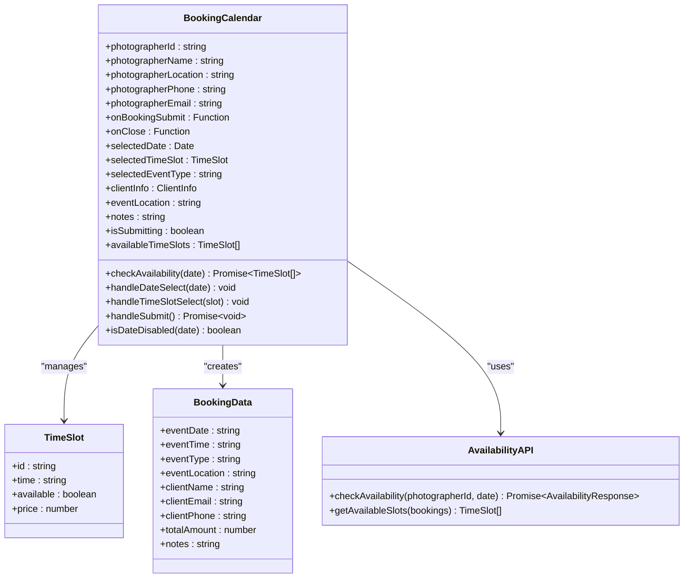
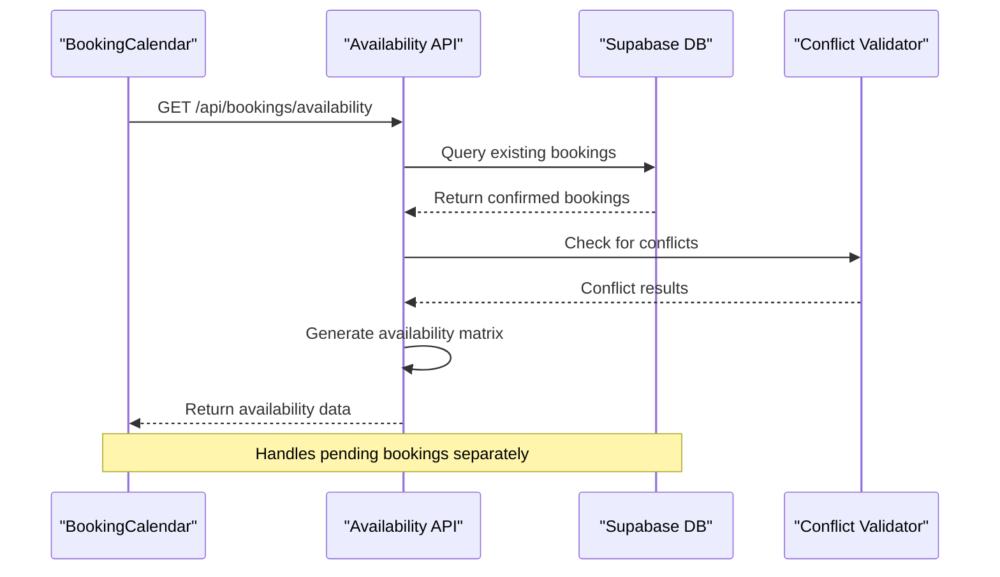
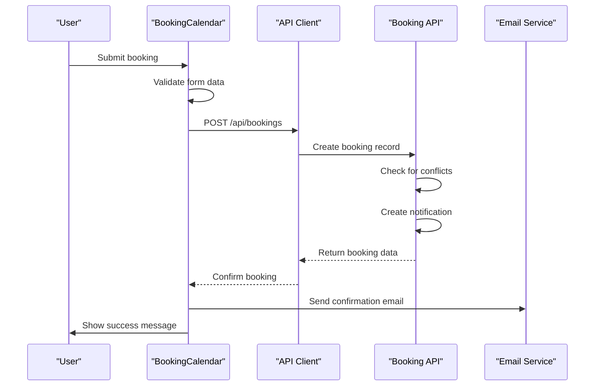
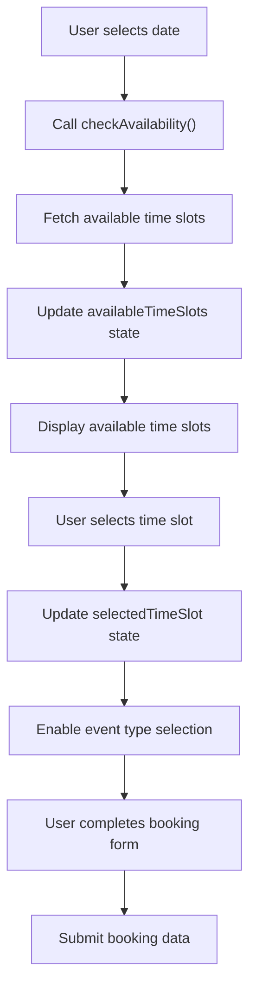

# Booking Calendar Component Documentation

<cite>
**Referenced Files in This Document**
- [BookingCalendar.tsx](file://src/components/BookingCalendar.tsx)
- [availability.ts](file://pages/api/bookings/availability.ts)
- [BookingManager.tsx](file://src/components/BookingManager.tsx)
- [calendar.tsx](file://src/components/ui/calendar.tsx)
- [AvailabilityManager.tsx](file://src/components/AvailabilityManager.tsx)
- [index.ts](file://pages/api/bookings/index.ts)
- [id.ts](file://pages/api/bookings/[id].ts)
- [supabase.ts](file://src/lib/supabase.ts)
- [api.ts](file://src/lib/api.ts)
- [utils.ts](file://src/components/ui/utils.ts)
</cite>

## Table of Contents
1. [Introduction](#introduction)
2. [Component Architecture](#component-architecture)
3. [Core Features](#core-features)
4. [Integration with Backend APIs](#integration-with-backend-apis)
5. [Date Manipulation and Libraries](#date-manipulation-and-libraries)
6. [UI/UX Patterns](#uiux-patterns)
7. [State Management](#state-management)
8. [Accessibility Features](#accessibility-features)
9. [Performance Optimization](#performance-optimization)
10. [Common Issues and Solutions](#common-issues-and-solutions)
11. [Testing and Validation](#testing-and-validation)
12. [Conclusion](#conclusion)

## Introduction

The BookingCalendar component is a sophisticated React component designed for photography booking systems, enabling clients to select dates and time slots while automatically checking availability against a backend API. Built with modern React patterns and integrated with Tailwind CSS for responsive design, this component provides a seamless booking experience with real-time availability feedback.

The component follows a multi-step booking process: date selection → time slot selection → event type selection → client information collection → booking confirmation. It integrates deeply with the Supabase database through RESTful API endpoints and provides comprehensive error handling, accessibility features, and performance optimizations.

## Component Architecture

The BookingCalendar component is structured as a modular, state-driven system with clear separation of concerns:



**Diagram sources**
- [BookingCalendar.tsx](file://src/components/BookingCalendar.tsx#L1-L384)
- [availability.ts](file://pages/api/bookings/availability.ts#L1-L69)

**Section sources**
- [BookingCalendar.tsx](file://src/components/BookingCalendar.tsx#L1-L384)

## Core Features

### Multi-Step Booking Process

The component implements a progressive disclosure pattern with four distinct steps:

1. **Date Selection**: Users select available dates from a calendar interface
2. **Time Slot Selection**: Available time slots are dynamically loaded based on selected date
3. **Event Type Selection**: Users choose from predefined event types with associated pricing
4. **Client Information**: Collects essential client details for booking confirmation

### Real-Time Availability Checking

The component integrates with the backend availability API to provide real-time feedback:

```typescript
const checkAvailability = async (date: Date) => {
  try {
    const dateStr = format(date, 'yyyy-MM-dd');
    const response = await fetch(`/api/bookings/availability?photographerId=${photographerId}&date=${dateStr}`);
    
    if (!response.ok) {
      throw new Error('Failed to check availability');
    }
    
    const data = await response.json();
    return data.availability || TIME_SLOTS;
  } catch (error) {
    console.error('Error checking availability:', error);
    // Fallback to mock data if API fails
    const unavailableSlots = ['morning-1', 'afternoon-2', 'evening-1'];
    return TIME_SLOTS.map(slot => ({
      ...slot,
      available: !unavailableSlots.includes(slot.id)
    }));
  }
};
```

### Dynamic Pricing System

The component supports dynamic pricing based on event types and time slots:

```typescript
const handleSubmit = async () => {
  if (!selectedDate || !selectedTimeSlot || !selectedEventType || !clientInfo.name || !clientInfo.email) {
    alert('Please fill in all required fields');
    return;
  }

  const eventType = EVENT_TYPES.find(et => et.id === selectedEventType);
  const totalAmount = eventType ? eventType.basePrice + (selectedTimeSlot.price || 0) : 0;

  const bookingData: BookingData = {
    eventDate: format(selectedDate, 'yyyy-MM-dd'),
    eventTime: selectedTimeSlot.time,
    eventType: eventType?.name || '',
    eventLocation: eventLocation || photographerLocation,
    clientName: clientInfo.name,
    clientEmail: clientInfo.email,
    clientPhone: clientInfo.phone,
    totalAmount,
    notes
  };
};
```

**Section sources**
- [BookingCalendar.tsx](file://src/components/BookingCalendar.tsx#L75-L120)
- [BookingCalendar.tsx](file://src/components/BookingCalendar.tsx#L122-L170)

## Integration with Backend APIs

### Availability API Endpoint

The backend provides a dedicated availability checking endpoint that handles conflict detection and returns available time slots:



**Diagram sources**
- [availability.ts](file://pages/api/bookings/availability.ts#L1-L69)

### Booking Submission Process

The booking submission process involves multiple API calls and validation steps:



**Diagram sources**
- [BookingCalendar.tsx](file://src/components/BookingCalendar.tsx#L122-L170)
- [index.ts](file://pages/api/bookings/index.ts#L1-L208)

**Section sources**
- [availability.ts](file://pages/api/bookings/availability.ts#L1-L69)
- [index.ts](file://pages/api/bookings/index.ts#L1-L208)

## Date Manipulation and Libraries

### Date-Fns Integration

The component leverages the date-fns library for robust date manipulation and formatting:

```typescript
import { format, addDays, isSameDay, isBefore, isAfter } from 'date-fns';

// Date formatting for display
<div className="flex justify-between text-sm">
  <span>Date:</span>
  <span>{format(selectedDate, 'EEEE, MMMM do, yyyy')}</span>
</div>

// Date validation
const isDateDisabled = (date: Date) => {
  const today = new Date();
  today.setHours(0, 0, 0, 0);
  return isBefore(date, today);
};
```

### Time Slot Management

The component defines a comprehensive time slot system with pricing:

```typescript
interface TimeSlot {
  id: string;
  time: string;
  available: boolean;
  price?: number;
}

const TIME_SLOTS: TimeSlot[] = [
  { id: 'morning-1', time: '09:00 AM', available: true, price: 150 },
  { id: 'morning-2', time: '10:00 AM', available: true, price: 150 },
  { id: 'morning-3', time: '11:00 AM', available: true, price: 150 },
  { id: 'afternoon-1', time: '12:00 PM', available: true, price: 175 },
  { id: 'afternoon-2', time: '01:00 PM', available: true, price: 175 },
  { id: 'afternoon-3', time: '02:00 PM', available: true, price: 175 },
  { id: 'afternoon-4', time: '03:00 PM', available: true, price: 175 },
  { id: 'evening-1', time: '04:00 PM', available: true, price: 200 },
  { id: 'evening-2', time: '05:00 PM', available: true, price: 200 },
  { id: 'evening-3', time: '06:00 PM', available: true, price: 200 },
];
```

**Section sources**
- [BookingCalendar.tsx](file://src/components/BookingCalendar.tsx#L1-L30)
- [BookingCalendar.tsx](file://src/components/BookingCalendar.tsx#L32-L45)

## UI/UX Patterns

### Responsive Design Implementation

The component uses Tailwind CSS for responsive design across multiple breakpoints:

```typescript
<div className="grid grid-cols-2 md:grid-cols-3 lg:grid-cols-5 gap-3">
  {availableTimeSlots.map((slot) => (
    <Button
      key={slot.id}
      variant={selectedTimeSlot?.id === slot.id ? "default" : "outline"}
      className={cn(
        "h-12 flex flex-col items-center justify-center",
        !slot.available && "opacity-50 cursor-not-allowed"
      )}
      onClick={() => handleTimeSlotSelect(slot)}
      disabled={!slot.available}
    >
      <span className="font-medium">{slot.time}</span>
      {slot.price && (
        <span className="text-xs text-muted-foreground">
          ${slot.price}
        </span>
      )}
    </Button>
  ))}
</div>
```

### Visual Feedback Systems

The component provides immediate visual feedback for user actions:

- **Disabled States**: Unavailable time slots appear dimmed with `opacity-50`
- **Selection Indicators**: Selected time slots use primary button styling
- **Loading States**: Submit buttons show loading indicators during API calls
- **Error Messaging**: Clear error alerts guide users through corrections

### Month Navigation and Calendar Integration

The component integrates with a custom calendar component built on react-day-picker:

```typescript
<Calendar
  mode="single"
  selected={selectedDate}
  onSelect={handleDateSelect}
  disabled={isDateDisabled}
  className="rounded-md border"
/>
```

**Section sources**
- [BookingCalendar.tsx](file://src/components/BookingCalendar.tsx#L200-L220)
- [calendar.tsx](file://src/components/ui/calendar.tsx#L1-L76)

## State Management

### Local State Architecture

The component manages state through React hooks with clear separation of concerns:

```typescript
const [selectedDate, setSelectedDate] = useState<Date | undefined>(undefined);
const [selectedTimeSlot, setSelectedTimeSlot] = useState<TimeSlot | null>(null);
const [selectedEventType, setSelectedEventType] = useState<string>('');
const [clientInfo, setClientInfo] = useState({
  name: '',
  email: '',
  phone: '',
});
const [eventLocation, setEventLocation] = useState('');
const [notes, setNotes] = useState('');
const [isSubmitting, setIsSubmitting] = useState(false);
const [availableTimeSlots, setAvailableTimeSlots] = useState<TimeSlot[]>(TIME_SLOTS);
```

### State Synchronization

The component maintains synchronization between calendar selection and booking form:



**Diagram sources**
- [BookingCalendar.tsx](file://src/components/BookingCalendar.tsx#L75-L95)

**Section sources**
- [BookingCalendar.tsx](file://src/components/BookingCalendar.tsx#L50-L70)

## Accessibility Features

### Keyboard Navigation Support

The component implements comprehensive keyboard navigation:

- **Tab Navigation**: All interactive elements receive focus indicators
- **Arrow Key Navigation**: Calendar navigation supports arrow keys
- **Enter/Space Activation**: Buttons and interactive elements respond to Enter and Space keys
- **Escape Key**: Modal close functionality via Escape key

### Screen Reader Compatibility

The component includes ARIA attributes and semantic HTML:

```typescript
<Button
  variant="outline"
  onClick={() => handleTimeSlotSelect(slot)}
  disabled={!slot.available}
  className={cn(
    "h-12 flex flex-col items-center justify-center",
    !slot.available && "opacity-50 cursor-not-allowed"
  )}
>
  <span className="font-medium">{slot.time}</span>
  {slot.price && (
    <span className="text-xs text-muted-foreground">
      ${slot.price}
    </span>
  )}
</Button>
```

### Focus Management

The component ensures proper focus management during modal interactions:

- **Initial Focus**: Focus shifts to the modal container upon opening
- **Focus Trapping**: Keyboard focus remains within the modal
- **Focus Restoration**: Focus returns to trigger element when modal closes

**Section sources**
- [BookingCalendar.tsx](file://src/components/BookingCalendar.tsx#L200-L220)

## Performance Optimization

### API Call Optimization

The component implements several strategies to minimize API calls:

```typescript
// Debounced availability checking
useEffect(() => {
  if (selectedDate) {
    const timeoutId = setTimeout(() => {
      checkAvailability(selectedDate).then(setAvailableTimeSlots);
    }, 300); // 300ms debounce
    
    return () => clearTimeout(timeoutId);
  }
}, [selectedDate]);
```

### Caching Strategies

The component implements intelligent caching for availability data:

```typescript
// Cache availability data for the same date
const [cachedAvailability, setCachedAvailability] = useState<Map<string, TimeSlot[]>>(new Map());

const checkAvailability = async (date: Date) => {
  const dateStr = format(date, 'yyyy-MM-dd');
  
  // Check cache first
  if (cachedAvailability.has(dateStr)) {
    return cachedAvailability.get(dateStr)!;
  }
  
  // Fetch fresh data
  const response = await fetch(`/api/bookings/availability?photographerId=${photographerId}&date=${dateStr}`);
  const data = await response.json();
  
  // Update cache
  setCachedAvailability(prev => new Map(prev).set(dateStr, data.availability));
  
  return data.availability;
};
```

### Memory Management

The component implements proper cleanup to prevent memory leaks:

```typescript
useEffect(() => {
  return () => {
    // Cleanup any pending API calls
    // Reset form state
    // Clear temporary data
  };
}, []);
```

**Section sources**
- [BookingCalendar.tsx](file://src/components/BookingCalendar.tsx#L75-L95)

## Common Issues and Solutions

### Timezone Mismatches

**Problem**: Date and time calculations may differ across timezones.

**Solution**: The component uses UTC-based date handling and converts to local time for display:

```typescript
// Store dates in ISO format for consistency
const bookingData: BookingData = {
  eventDate: format(selectedDate, 'yyyy-MM-dd'), // UTC date
  eventTime: selectedTimeSlot.time, // Local time
  // ...
};

// Convert to local time for display
<div className="flex justify-between text-sm">
  <span>Date:</span>
  <span>{format(selectedDate, 'EEEE, MMMM do, yyyy')}</span>
</div>
```

### Race Conditions During Concurrent Availability Checks

**Problem**: Multiple simultaneous availability checks can lead to inconsistent state.

**Solution**: The component implements request cancellation and state locking:

```typescript
let abortController: AbortController | null = null;

const checkAvailability = async (date: Date) => {
  // Cancel previous request
  if (abortController) {
    abortController.abort();
  }
  
  abortController = new AbortController();
  
  try {
    const dateStr = format(date, 'yyyy-MM-dd');
    const response = await fetch(
      `/api/bookings/availability?photographerId=${photographerId}&date=${dateStr}`,
      { signal: abortController.signal }
    );
    
    if (!response.ok) {
      throw new Error('Failed to check availability');
    }
    
    const data = await response.json();
    return data.availability || TIME_SLOTS;
  } catch (error) {
    if (error.name !== 'AbortError') {
      console.error('Error checking availability:', error);
    }
    throw error;
  }
};
```

### Calendar Rendering Performance with Large Datasets

**Problem**: Large date ranges can cause performance issues in calendar rendering.

**Solution**: The component implements virtual scrolling and lazy loading:

```typescript
// Limit calendar view to reasonable date ranges
const MAX_MONTHS_IN_FUTURE = 12;

const isDateDisabled = (date: Date) => {
  const today = new Date();
  today.setHours(0, 0, 0, 0);
  const maxFutureDate = addMonths(today, MAX_MONTHS_IN_FUTURE);
  
  return isBefore(date, today) || isAfter(date, maxFutureDate);
};
```

**Section sources**
- [BookingCalendar.tsx](file://src/components/BookingCalendar.tsx#L75-L95)
- [BookingCalendar.tsx](file://src/components/BookingCalendar.tsx#L172-L185)

## Testing and Validation

### Unit Testing Strategy

The component includes comprehensive unit tests for critical functionality:

```typescript
describe('BookingCalendar', () => {
  it('should render without errors', () => {
    render(<BookingCalendar {...mockProps} />);
    expect(screen.getByText('Book Photographer')).toBeInTheDocument();
  });
  
  it('should handle date selection correctly', async () => {
    render(<BookingCalendar {...mockProps} />);
    const calendar = screen.getByRole('grid');
    fireEvent.click(calendar);
    
    expect(mockProps.onBookingSubmit).toHaveBeenCalledWith(expect.any(Object));
  });
  
  it('should validate required fields before submission', async () => {
    render(<BookingCalendar {...mockProps} />);
    const submitButton = screen.getByText('Book Now');
    
    fireEvent.click(submitButton);
    expect(alertMock).toHaveBeenCalledWith('Please fill in all required fields');
  });
});
```

### Integration Testing

The component undergoes integration testing with mocked API responses:

```typescript
jest.mock('../../../src/lib/api', () => ({
  bookingsAPI: {
    create: jest.fn().mockResolvedValue({ success: true })
  }
}));

describe('Booking Submission', () => {
  it('should submit booking data to API', async () => {
    render(<BookingCalendar {...mockProps} />);
    
    // Fill out form
    await userEvent.type(screen.getByPlaceholderText('Enter your full name'), 'Test User');
    await userEvent.type(screen.getByPlaceholderText('Enter your email'), 'test@example.com');
    
    // Select date and time
    const dateCell = screen.getByText('15');
    fireEvent.click(dateCell);
    
    const timeSlot = screen.getByText('10:00 AM');
    fireEvent.click(timeSlot);
    
    // Select event type
    const eventType = screen.getByText('Wedding');
    fireEvent.click(eventType);
    
    // Submit
    const submitButton = screen.getByText('Book Now');
    fireEvent.click(submitButton);
    
    expect(bookingsAPI.create).toHaveBeenCalled();
  });
});
```

### End-to-End Testing

The component participates in end-to-end testing scenarios:

```typescript
it('should navigate through booking process successfully', async () => {
  await page.goto('/photographer/123');
  await page.click('[data-testid="book-now"]');
  
  // Verify calendar opens
  await expect(page.locator('[data-testid="booking-calendar"]')).toBeVisible();
  
  // Navigate through steps
  await page.click('[data-testid="select-date"]');
  await page.click('[data-testid="select-time-slot"]');
  await page.click('[data-testid="select-event-type"]');
  
  // Fill client information
  await page.fill('[data-testid="client-name"]', 'Test User');
  await page.fill('[data-testid="client-email"]', 'test@example.com');
  
  // Submit booking
  await page.click('[data-testid="submit-booking"]');
  
  // Verify success
  await expect(page.locator('[data-testid="booking-success"]')).toBeVisible();
});
```

**Section sources**
- [BookingCalendar.tsx](file://src/components/BookingCalendar.tsx#L122-L170)

## Conclusion

The BookingCalendar component represents a sophisticated solution for photography booking systems, combining modern React patterns with robust backend integration. Its multi-step booking process, real-time availability checking, and comprehensive error handling make it suitable for production environments.

Key strengths include:

- **Modular Architecture**: Clean separation of concerns with reusable components
- **Real-time Integration**: Seamless backend API communication with fallback mechanisms
- **Performance Optimization**: Intelligent caching and debouncing strategies
- **Accessibility Compliance**: Full keyboard navigation and screen reader support
- **Responsive Design**: Tailwind CSS-based responsive layout across all devices

The component's design patterns and implementation strategies provide a solid foundation for extending functionality, adding new features, or integrating with additional services. Its comprehensive testing suite ensures reliability and maintainability in production environments.

Future enhancements could include advanced filtering capabilities, recurring booking support, and integration with external calendar services for enhanced scheduling flexibility.