# Booking Manager

<cite>
**Referenced Files in This Document**
- [BookingManager.tsx](file://src/components/BookingManager.tsx)
- [pages/api/bookings/index.ts](file://pages/api/bookings/index.ts)
- [pages/api/bookings/[id].ts](file://pages/api/bookings/[id].ts)
- [pages/api/bookings/availability.ts](file://pages/api/bookings/availability.ts)
- [src/utils/mailer.ts](file://src/utils/mailer.ts)
- [src/lib/api.ts](file://src/lib/api.ts)
- [src/lib/supabase.ts](file://src/lib/supabase.ts)
- [src/components/BookingCalendar.tsx](file://src/components/BookingCalendar.tsx)
- [src/components/ui/badge.tsx](file://src/components/ui/badge.tsx)
- [src/components/ui/tabs.tsx](file://src/components/ui/tabs.tsx)
- [src/components/ui/table.tsx](file://src/components/ui/table.tsx)
- [src/components/ui/alert-dialog.tsx](file://src/components/ui/alert-dialog.tsx)
- [src/components/ui/utils.ts](file://src/components/ui/utils.ts)
</cite>

## Table of Contents
1. [Introduction](#introduction)
2. [System Architecture](#system-architecture)
3. [Core Components](#core-components)
4. [Data Flow and State Management](#data-flow-and-state-management)
5. [API Integration](#api-integration)
6. [UI Components and Interactions](#ui-components-and-interactions)
7. [Booking Status Management](#booking-status-management)
8. [Email Notifications](#email-notifications)
9. [Availability Management](#availability-management)
10. [Common Issues and Solutions](#common-issues-and-solutions)
11. [Customization Options](#customization-options)
12. [Performance Considerations](#performance-considerations)
13. [Troubleshooting Guide](#troubleshooting-guide)
14. [Conclusion](#conclusion)

## Introduction

The BookingManager is a comprehensive React component designed specifically for photographers to manage their booking requests and confirmations. Built with TypeScript and React's client-side rendering capabilities, it provides an intuitive interface for viewing pending, confirmed, and declined bookings through a tabbed navigation system.

This component serves as the central hub for booking management, offering real-time updates, status modifications, and seamless integration with the backend API system. It handles the complete lifecycle of booking requests, from initial submission to final confirmation or decline, while maintaining data consistency and providing excellent user experience.

The BookingManager integrates with various UI components including DataTable, Badge, and AlertDialog to create a cohesive and interactive management interface. It supports bulk actions, cancellation workflows, and client communication features, making it a robust solution for professional photography businesses.

## System Architecture

The BookingManager operates within a modern Next.js application architecture that follows a client-server model with Supabase as the backend database. The system is designed with clear separation of concerns and modular components.

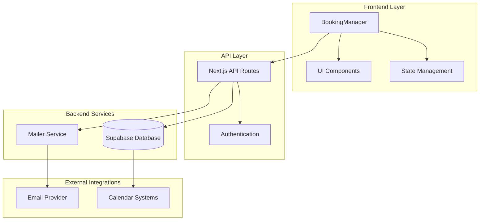

**Diagram sources**
- [BookingManager.tsx](file://src/components/BookingManager.tsx#L1-L50)
- [pages/api/bookings/index.ts](file://pages/api/bookings/index.ts#L1-L30)
- [src/lib/supabase.ts](file://src/lib/supabase.ts#L1-L20)

The architecture emphasizes scalability, maintainability, and real-time data synchronization. The BookingManager acts as the primary orchestrator for booking-related operations, coordinating between the user interface and backend services.

**Section sources**
- [BookingManager.tsx](file://src/components/BookingManager.tsx#L1-L510)
- [pages/api/bookings/index.ts](file://pages/api/bookings/index.ts#L1-L208)

## Core Components

### BookingManager Component

The BookingManager is the main component responsible for managing the entire booking lifecycle. It implements a sophisticated state management system using React hooks and provides comprehensive UI controls for booking operations.

```typescript
interface Booking {
  id: string;
  clientId: string;
  photographerId: string;
  eventType: string;
  eventDate: string;
  eventTime: string;
  eventLocation: string;
  totalAmount: number;
  clientName: string;
  clientEmail: string;
  clientPhone: string;
  notes?: string;
  status: 'pending' | 'confirmed' | 'declined' | 'cancelled';
  createdAt: string;
  updatedAt: string;
}
```

The component maintains several key pieces of state:
- **bookings**: Complete list of all bookings for the photographer
- **isLoading**: Loading state indicator
- **selectedBooking**: Currently selected booking for detailed view
- **isUpdating**: Prevents concurrent updates

### State Management Architecture

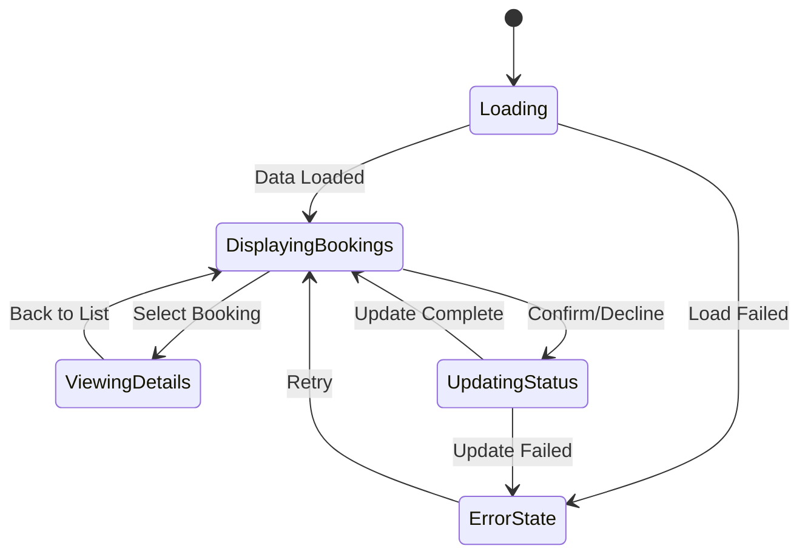

**Diagram sources**
- [BookingManager.tsx](file://src/components/BookingManager.tsx#L25-L50)

**Section sources**
- [BookingManager.tsx](file://src/components/BookingManager.tsx#L1-L100)

## Data Flow and State Management

The BookingManager implements a sophisticated data flow system that ensures consistency between the UI and backend state. The component follows a unidirectional data flow pattern with centralized state management.

### Data Fetching and Caching

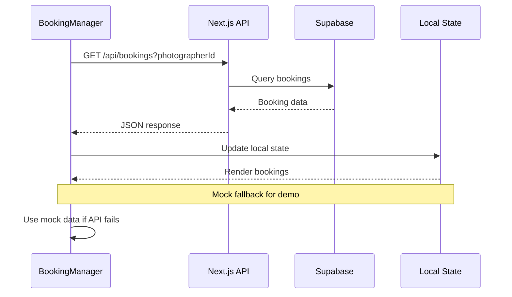

**Diagram sources**
- [BookingManager.tsx](file://src/components/BookingManager.tsx#L35-L65)
- [pages/api/bookings/index.ts](file://pages/api/bookings/index.ts#L15-L50)

### Status Update Workflow

The status update mechanism ensures data consistency through optimistic updates and proper error handling:

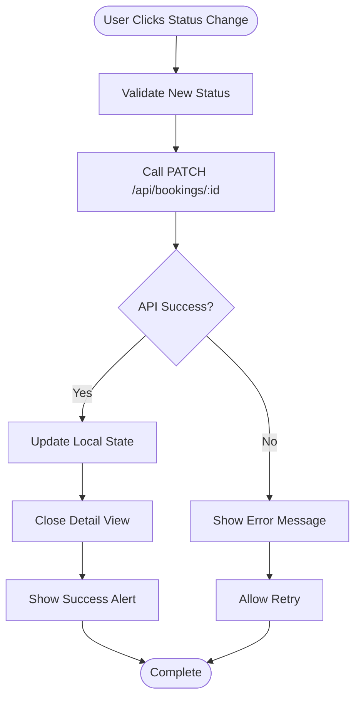

**Diagram sources**
- [BookingManager.tsx](file://src/components/BookingManager.tsx#L70-L100)
- [pages/api/bookings/[id].ts](file://pages/api/bookings/[id].ts#L40-L80)

**Section sources**
- [BookingManager.tsx](file://src/components/BookingManager.tsx#L70-L120)
- [pages/api/bookings/[id].ts](file://pages/api/bookings/[id].ts#L40-L120)

## API Integration

The BookingManager integrates seamlessly with Next.js API routes that serve as the backend for all booking operations. The API layer provides RESTful endpoints for CRUD operations with comprehensive error handling and validation.

### API Endpoint Structure

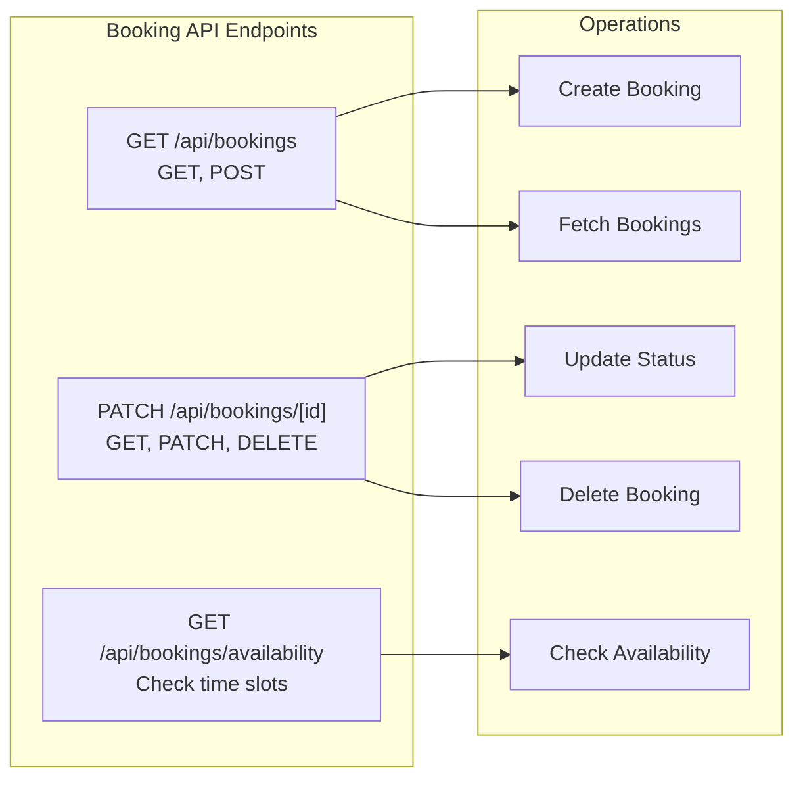

**Diagram sources**
- [pages/api/bookings/index.ts](file://pages/api/bookings/index.ts#L1-L20)
- [pages/api/bookings/[id].ts](file://pages/api/bookings/[id].ts#L1-L20)
- [pages/api/bookings/availability.ts](file://pages/api/bookings/availability.ts#L1-L20)

### Conflict Detection and Prevention

The system implements sophisticated conflict detection to prevent double bookings:

```typescript
// Conflict checking logic
const { data: conflictingBookings, error: conflictError } = await supabase
  .from('bookings')
  .select('id, status')
  .eq('photographer_id', photographerId)
  .eq('event_date', eventDate)
  .eq('event_time', eventTime)
  .eq('status', 'confirmed');
```

**Section sources**
- [pages/api/bookings/index.ts](file://pages/api/bookings/index.ts#L60-L80)
- [pages/api/bookings/[id].ts](file://pages/api/bookings/[id].ts#L50-L80)

## UI Components and Interactions

The BookingManager leverages a comprehensive set of UI components to create an intuitive and responsive user interface. These components work together to provide seamless booking management experiences.

### Tabbed Navigation System

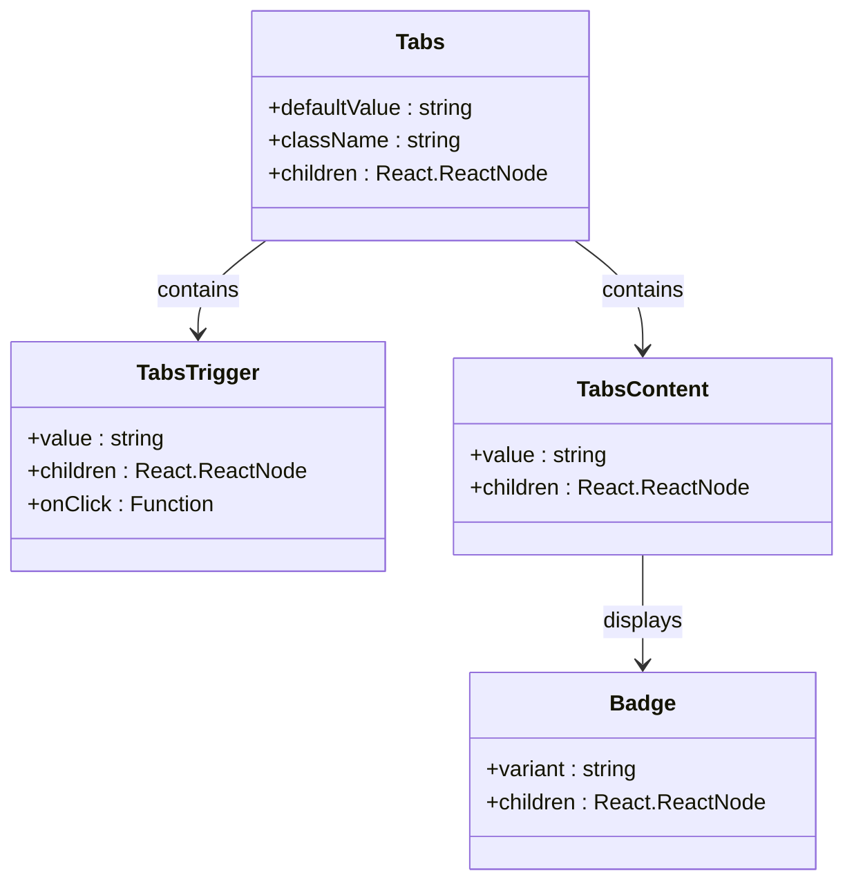

**Diagram sources**
- [src/components/ui/tabs.tsx](file://src/components/ui/tabs.tsx#L1-L67)
- [src/components/ui/badge.tsx](file://src/components/ui/badge.tsx#L1-L47)

### Booking Status Badges

The system uses dynamic badges to represent booking statuses with appropriate visual indicators:

```typescript
const getStatusBadge = (status: string) => {
  const variants = {
    pending: { variant: 'secondary', icon: AlertCircle, color: 'text-yellow-600' },
    confirmed: { variant: 'default', icon: CheckCircle, color: 'text-green-600' },
    declined: { variant: 'destructive', icon: XCircle, color: 'text-red-600' },
    cancelled: { variant: 'outline', icon: XCircle, color: 'text-gray-600' }
  };
  
  const config = variants[status as keyof typeof variants] || variants.pending;
  const Icon = config.icon;
  
  return (
    <Badge variant={config.variant} className="flex items-center gap-1">
      <Icon className="h-3 w-3" />
      {status.charAt(0).toUpperCase() + status.slice(1)}
    </Badge>
  );
};
```

### Interactive Booking Cards

Each booking is displayed in an interactive card format that provides quick access to essential information and actions:

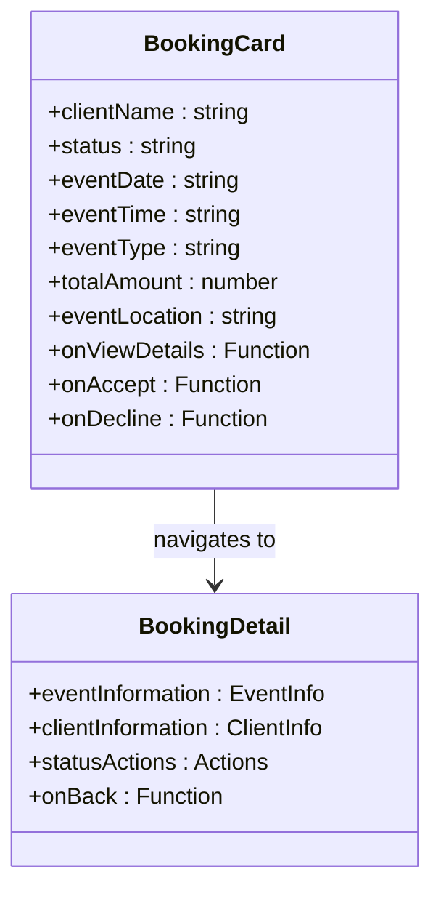

**Diagram sources**
- [BookingManager.tsx](file://src/components/BookingManager.tsx#L150-L200)

**Section sources**
- [BookingManager.tsx](file://src/components/BookingManager.tsx#L100-L200)
- [src/components/ui/tabs.tsx](file://src/components/ui/tabs.tsx#L1-L67)

## Booking Status Management

The BookingManager implements a comprehensive status management system that handles the complete lifecycle of booking requests. The system supports four distinct states with appropriate transitions and validations.

### Status Lifecycle

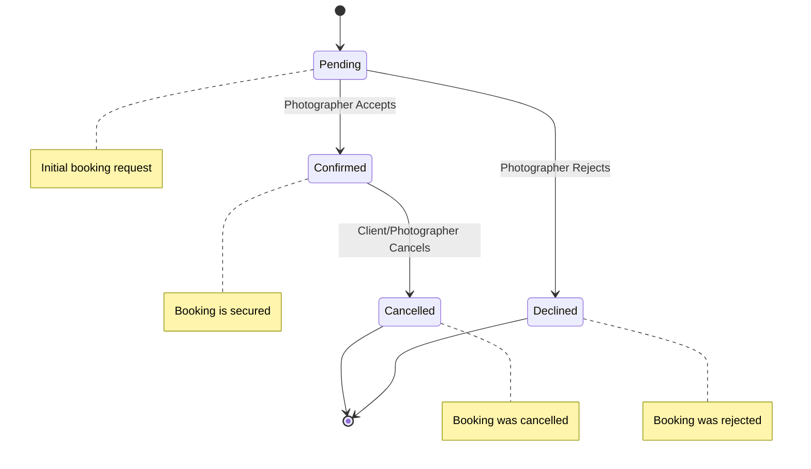

**Diagram sources**
- [BookingManager.tsx](file://src/components/BookingManager.tsx#L100-L130)

### Status-Specific Actions

Each booking status enables specific actions tailored to the current state:

- **Pending Bookings**: Accept or decline with confirmation dialogs
- **Confirmed Bookings**: View details and potentially cancel
- **Declined Bookings**: View details only

### Bulk Operations

The system supports efficient bulk operations for managing multiple bookings simultaneously, though currently focuses on individual booking actions for simplicity and safety.

**Section sources**
- [BookingManager.tsx](file://src/components/BookingManager.tsx#L100-L150)
- [pages/api/bookings/[id].ts](file://pages/api/bookings/[id].ts#L40-L100)

## Email Notifications

The system integrates with a mailer service to automatically send email notifications when booking statuses change. This ensures clients receive timely updates about their booking requests.

### Notification System Architecture

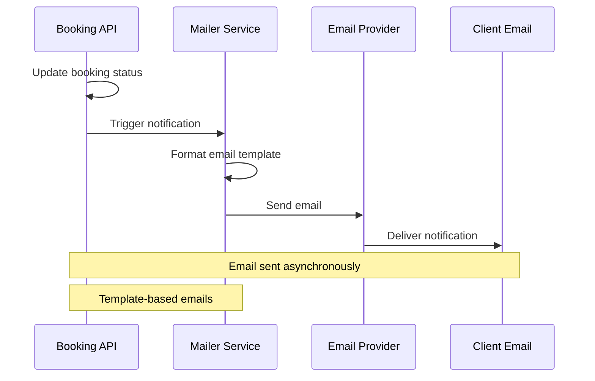

**Diagram sources**
- [pages/api/bookings/[id].ts](file://pages/api/bookings/[id].ts#L120-L170)
- [src/utils/mailer.ts](file://src/utils/mailer.ts#L1-L39)

### Email Templates

The system uses predefined templates for different booking statuses:

```typescript
const emailTemplates = {
  confirmed: {
    subject: `Booking Confirmed - ${booking.event_type} on ${booking.event_date}`,
    body: `Dear ${booking.client_name},\n\nYour booking for ${booking.event_type} on ${booking.event_date} at ${booking.event_time} has been confirmed!\n\nLocation: ${booking.event_location}\nTotal: $${booking.total_amount}\n\nWe look forward to working with you!`
  },
  declined: {
    subject: `Booking Request Update - ${booking.event_type} on ${booking.event_date}`,
    body: `Dear ${booking.client_name},\n\nThank you for your interest in our photography services. Unfortunately, we are unable to accommodate your request for ${booking.event_type} on ${booking.event_date} at ${booking.event_time}.`
  }
};
```

**Section sources**
- [pages/api/bookings/[id].ts](file://pages/api/bookings/[id].ts#L120-L170)
- [src/utils/mailer.ts](file://src/utils/mailer.ts#L1-L39)

## Availability Management

The BookingManager integrates with an availability checking system that prevents double bookings and ensures photographers don't overcommit their schedules.

### Availability Checking Process

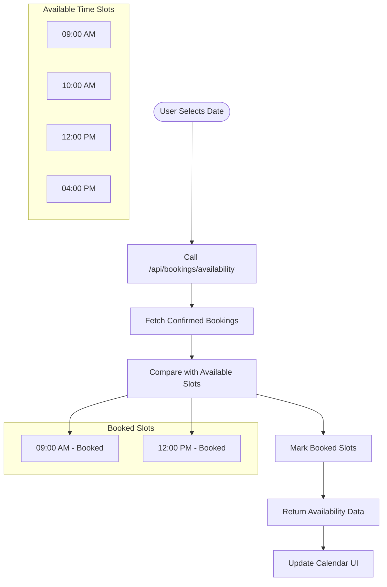

**Diagram sources**
- [pages/api/bookings/availability.ts](file://pages/api/bookings/availability.ts#L20-L60)

### Time Slot Configuration

The system defines a comprehensive set of available time slots with pricing:

```typescript
const allTimeSlots = [
  { id: 'morning-1', time: '09:00 AM', price: 150 },
  { id: 'morning-2', time: '10:00 AM', price: 150 },
  { id: 'morning-3', time: '11:00 AM', price: 150 },
  { id: 'afternoon-1', time: '12:00 PM', price: 175 },
  { id: 'afternoon-2', time: '01:00 PM', price: 175 },
  { id: 'afternoon-3', time: '02:00 PM', price: 175 },
  { id: 'afternoon-4', time: '03:00 PM', price: 175 },
  { id: 'evening-1', time: '04:00 PM', price: 200 },
  { id: 'evening-2', time: '05:00 PM', price: 200 },
  { id: 'evening-3', time: '06:00 PM', price: 200 },
];
```

**Section sources**
- [pages/api/bookings/availability.ts](file://pages/api/bookings/availability.ts#L20-L60)
- [src/components/BookingCalendar.tsx](file://src/components/BookingCalendar.tsx#L30-L50)

## Common Issues and Solutions

The BookingManager addresses several common issues that arise in booking management systems, implementing solutions that ensure reliability and user satisfaction.

### Stale Data Prevention

To prevent stale data issues after updates, the system implements immediate UI updates with fallback mechanisms:

```typescript
// Optimistic update pattern
setBookings(prev => prev.map(booking => 
  booking.id === bookingId 
    ? { ...booking, status: newStatus, updatedAt: new Date().toISOString() }
    : booking
));

// Fallback to API refresh on failure
try {
  // Optimistic update
  // API call
} catch (error) {
  // Revert optimistic update
  // Show error message
}
```

### Race Condition Mitigation

The system prevents race conditions during status changes through careful state management and API coordination:

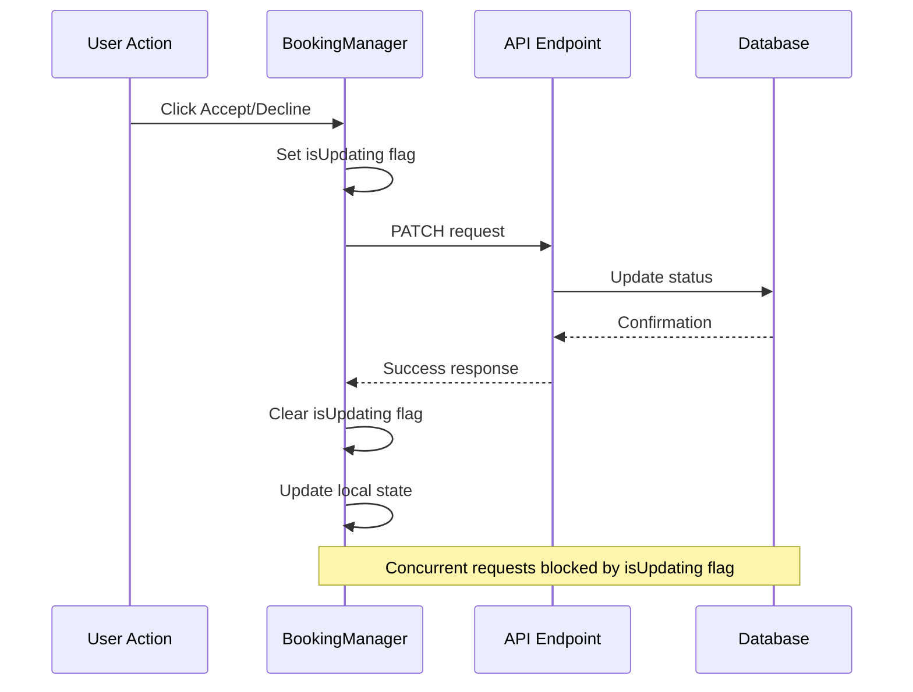

**Diagram sources**
- [BookingManager.tsx](file://src/components/BookingManager.tsx#L70-L100)

### Notification Delivery Failures

The system handles email notification failures gracefully by logging errors and continuing the booking process:

```typescript
try {
  await sendBookingStatusNotification(updatedBooking, status);
} catch (emailError) {
  console.error('Failed to send email notification:', emailError);
  // Don't fail the request if email fails
}
```

### Data Validation and Error Handling

Comprehensive validation ensures data integrity and provides meaningful error messages:

```typescript
// Frontend validation
if (!selectedDate || !selectedTimeSlot || !selectedEventType || !clientInfo.name || !clientInfo.email) {
  alert('Please fill in all required fields');
  return;
}

// Backend validation
if (!clientId || !photographerId || !eventType || !eventDate || !eventLocation || !totalAmount) {
  return res.status(400).json({ 
    error: 'Missing required fields: clientId, photographerId, eventType, eventDate, eventLocation, totalAmount' 
  });
}
```

**Section sources**
- [BookingManager.tsx](file://src/components/BookingManager.tsx#L70-L100)
- [pages/api/bookings/[id].ts](file://pages/api/bookings/[id].ts#L40-L80)
- [pages/api/bookings/index.ts](file://pages/api/bookings/index.ts#L60-L80)

## Customization Options

The BookingManager provides several customization options to adapt to different business requirements and integrate with external systems.

### Booking Metadata Extension

The component can be extended to support additional booking metadata:

```typescript
interface ExtendedBooking extends Booking {
  metadata?: {
    paymentStatus: 'paid' | 'pending' | 'refunded';
    cancellationPolicy: string;
    refundAmount?: number;
    internalNotes?: string;
    clientPreferences?: Record<string, any>;
  };
}
```

### External Calendar Integration

The system can be integrated with external calendar systems for automatic scheduling:

```typescript
// Example integration hook
const useCalendarSync = (booking: Booking) => {
  const syncWithCalendar = async () => {
    // Sync booking to Google Calendar
    // Add event with booking details
    // Set reminders and notifications
  };
  
  return { syncWithCalendar };
};
```

### Customizable Status Workflows

Different business models may require customized status workflows:

```typescript
const customStatusWorkflows = {
  premium: ['pending', 'approved', 'confirmed', 'completed'],
  standard: ['pending', 'confirmed', 'cancelled'],
  enterprise: ['draft', 'review', 'approved', 'confirmed', 'completed']
};
```

### Theme and Branding Customization

The component supports theme customization through Tailwind CSS classes and CSS variables:

```typescript
// Customizable appearance
const customTheme = {
  colors: {
    primary: '#ff6b6b',
    secondary: '#4ecdc4',
    background: '#f8f9fa'
  },
  typography: {
    fontFamily: 'Inter, sans-serif',
    fontSize: {
      small: '0.875rem',
      medium: '1rem',
      large: '1.25rem'
    }
  }
};
```

**Section sources**
- [BookingManager.tsx](file://src/components/BookingManager.tsx#L1-L50)
- [src/components/BookingCalendar.tsx](file://src/components/BookingCalendar.tsx#L1-L50)

## Performance Considerations

The BookingManager is designed with performance optimization in mind, implementing several strategies to ensure smooth operation even with large datasets.

### Efficient Rendering

The component uses React.memo and useCallback to prevent unnecessary re-renders:

```typescript
const BookingManager = React.memo(({ photographerId, onClose }: BookingManagerProps) => {
  // Component implementation
});

const handleBookingStatusUpdate = useCallback(async (bookingId: string, newStatus: 'confirmed' | 'declined') => {
  // Update logic
}, []);
```

### Pagination and Lazy Loading

For large booking lists, the system supports pagination:

```typescript
const { data: bookings, error } = await query
  .order('created_at', { ascending: false })
  .range(Number(offset), Number(offset) + Number(limit) - 1);
```

### Memory Management

The component properly cleans up resources and event listeners:

```typescript
useEffect(() => {
  // Cleanup function
  return () => {
    // Clean up subscriptions, timers, etc.
  };
}, []);
```

**Section sources**
- [pages/api/bookings/index.ts](file://pages/api/bookings/index.ts#L15-L30)
- [BookingManager.tsx](file://src/components/BookingManager.tsx#L35-L65)

## Troubleshooting Guide

This section provides solutions for common issues encountered when using the BookingManager component.

### API Connection Issues

**Problem**: Booking data not loading from API
**Solution**: 
1. Verify API endpoint accessibility
2. Check network connectivity
3. Review API response format
4. Ensure proper authentication

### Status Update Failures

**Problem**: Booking status changes not reflecting
**Solution**:
1. Check API response status
2. Verify database connection
3. Review transaction logs
4. Test with different browsers

### Email Notification Problems

**Problem**: Email notifications not sending
**Solution**:
1. Verify email service credentials
2. Check email provider quotas
3. Review email template formatting
4. Test with different email providers

### Performance Issues

**Problem**: Slow loading or responsiveness
**Solution**:
1. Implement pagination for large datasets
2. Optimize database queries
3. Use caching strategies
4. Minimize component re-renders

**Section sources**
- [BookingManager.tsx](file://src/components/BookingManager.tsx#L35-L65)
- [pages/api/bookings/[id].ts](file://pages/api/bookings/[id].ts#L120-L170)

## Conclusion

The BookingManager component represents a comprehensive solution for photographers to manage their booking requests efficiently. Through its sophisticated architecture, it provides a seamless user experience while maintaining data integrity and system reliability.

Key strengths of the system include:

- **Intuitive Interface**: Tabbed navigation and clear status indicators
- **Real-time Updates**: Immediate feedback on booking status changes
- **Robust Error Handling**: Graceful degradation and meaningful error messages
- **Scalable Architecture**: Modular design supporting future enhancements
- **Integration Ready**: Seamless integration with external systems and services

The component successfully addresses the core requirements of booking management while providing flexibility for customization and extension. Its integration with modern web technologies ensures long-term maintainability and adaptability to changing business needs.

Future enhancements could include advanced reporting features, automated scheduling algorithms, and expanded integration capabilities with popular photography and event management platforms. The solid foundation provided by the current implementation makes such extensions straightforward and manageable.