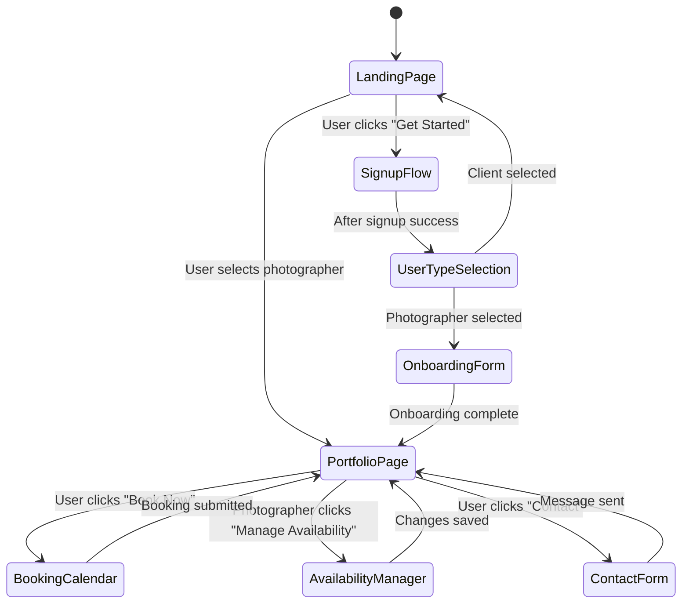
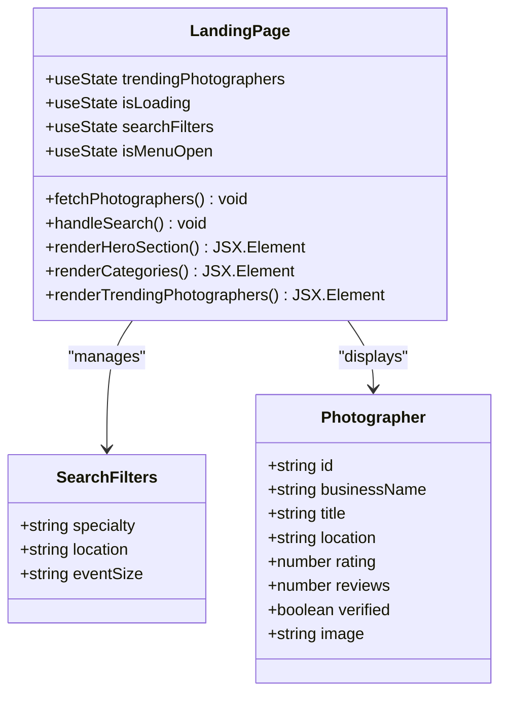
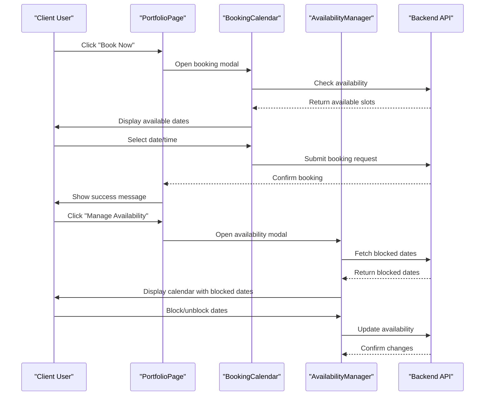
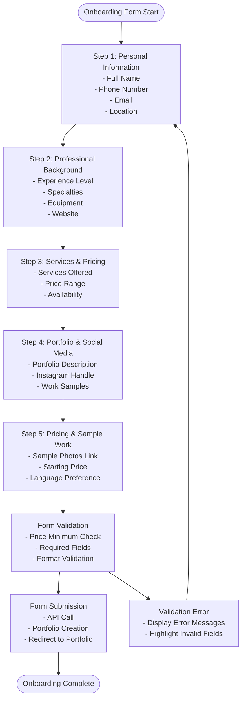
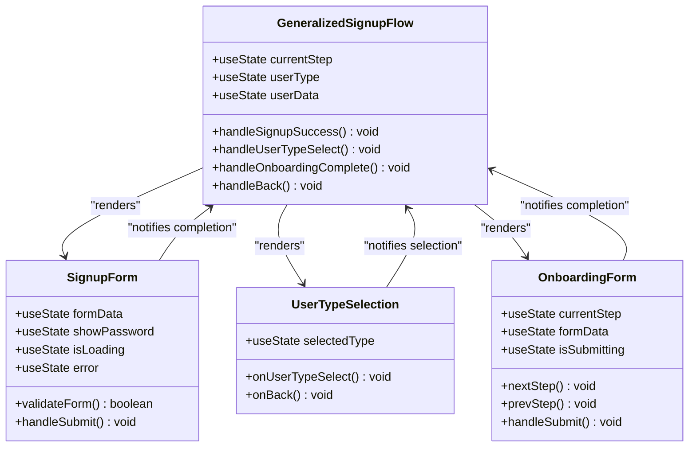
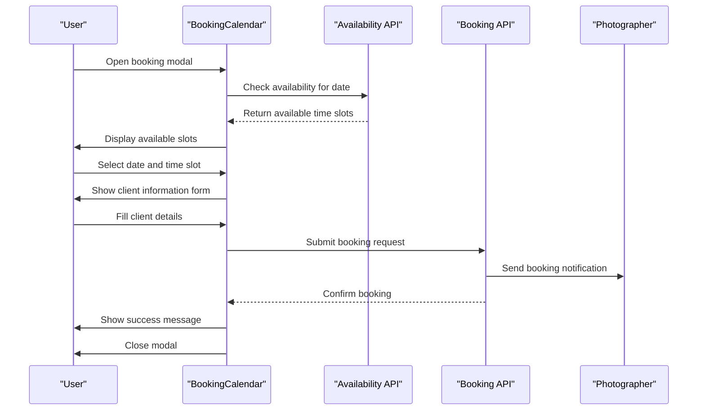
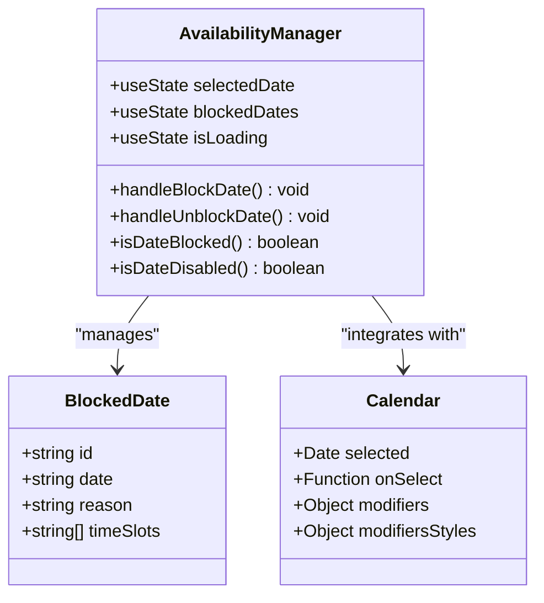

# Feature Components

<cite>
**Referenced Files in This Document**
- [pages/index.tsx](file://pages/index.tsx)
- [src/components/LandingPage.tsx](file://src/components/LandingPage.tsx)
- [src/components/PortfolioPage.tsx](file://src/components/PortfolioPage.tsx)
- [src/components/OnboardingForm.tsx](file://src/components/OnboardingForm.tsx)
- [src/components/GeneralizedSignupFlow.tsx](file://src/components/GeneralizedSignupFlow.tsx)
- [src/components/BookingCalendar.tsx](file://src/components/BookingCalendar.tsx)
- [src/components/AvailabilityManager.tsx](file://src/components/AvailabilityManager.tsx)
- [src/components/UserTypeSelection.tsx](file://src/components/UserTypeSelection.tsx)
- [src/components/SignupForm.tsx](file://src/components/SignupForm.tsx)
- [src/lib/api.ts](file://src/lib/api.ts)
</cite>

## Table of Contents
1. [Introduction](#introduction)
2. [Core Navigation System](#core-navigation-system)
3. [Landing Page Implementation](#landing-page-implementation)
4. [Photographer Portfolio Management](#photographer-portfolio-management)
5. [Photographer Onboarding Process](#photographer-onboarding-process)
6. [User Registration Flow](#user-registration-flow)
7. [Booking Management System](#booking-management-system)
8. [Availability Management](#availability-management)
9. [State Management Patterns](#state-management-patterns)
10. [Common Issues and Solutions](#common-issues-and-solutions)
11. [Conclusion](#conclusion)

## Introduction

The SnapEvent platform features a sophisticated set of interconnected components that handle user discovery, photographer profiles, booking processes, and onboarding workflows. These components work together to create a seamless experience for both clients seeking photography services and photographers looking to showcase their work.

The system is built around a centralized navigation state management approach that coordinates between multiple feature components, each responsible for specific business logic and user interactions. This architecture enables smooth transitions between different user journeys while maintaining consistent state and user experience.

## Core Navigation System

The navigation system serves as the backbone of the application, managing page transitions and coordinating between different feature components through a centralized state management approach.

**Section sources**
- [pages/index.tsx](file://pages/index.tsx#L1-L116)

The main navigation controller manages four primary page states: `landing`, `onboarding`, `portfolio`, and `signup`. Each state corresponds to specific user journeys and feature sets, enabling contextual navigation based on user actions and preferences.

## Landing Page Implementation

The LandingPage component serves as the primary entry point for the application, featuring sophisticated animations, search capabilities, and interactive elements designed to engage users and guide them toward their desired actions.

**Diagram sources**
- [src/components/LandingPage.tsx](file://src/components/LandingPage.tsx#L1-L844)

The component implements a comprehensive search and discovery system that allows users to filter photographers by specialty, location, and event size. The search functionality integrates with the backend API to provide real-time results while maintaining optimistic UI updates for improved user experience.

Key features include:
- **Dynamic Search Filters**: Real-time filtering with debounced API calls
- **Trending Photographers**: AI-driven recommendations with fallback mechanisms
- **Interactive Categories**: Clickable categories with hover effects and animations
- **Responsive Navigation**: Mobile-first design with adaptive layouts
- **Progressive Enhancement**: Graceful degradation for API failures

**Section sources**
- [src/components/LandingPage.tsx](file://src/components/LandingPage.tsx#L1-L844)

## Photographer Portfolio Management

The PortfolioPage component provides comprehensive photographer profile management capabilities, including portfolio display, booking initiation, and social media integration. It serves as the central hub for photographer-client interactions.

**Diagram sources**
- [src/components/PortfolioPage.tsx](file://src/components/PortfolioPage.tsx#L1-L889)
- [src/components/BookingCalendar.tsx](file://src/components/BookingCalendar.tsx#L1-L384)
- [src/components/AvailabilityManager.tsx](file://src/components/AvailabilityManager.tsx#L1-L203)

The portfolio system implements advanced state management for handling multiple concurrent modals and user interactions. It maintains separate state contexts for booking forms, availability management, and contact communications while ensuring data consistency across all operations.

**Section sources**
- [src/components/PortfolioPage.tsx](file://src/components/PortfolioPage.tsx#L1-L889)

## Photographer Onboarding Process

The OnboardingForm component implements a sophisticated multi-step process for photographer registration, featuring bilingual support, comprehensive form validation, and progressive disclosure of form fields.

**Diagram sources**
- [src/components/OnboardingForm.tsx](file://src/components/OnboardingForm.tsx#L1-L933)

The onboarding process incorporates several advanced features:

- **Bilingual Support**: Complete form translation with automatic language switching
- **Progressive Disclosure**: Step-by-step form progression with clear progress indicators
- **Real-time Validation**: Immediate feedback for form field validation
- **Rich Text Areas**: Advanced text editing capabilities for portfolio descriptions
- **File Upload Integration**: Secure file handling with size and type restrictions

**Section sources**
- [src/components/OnboardingForm.tsx](file://src/components/OnboardingForm.tsx#L1-L933)

## User Registration Flow

The GeneralizedSignupFlow orchestrates the complete user registration process, managing state transitions between signup, user type selection, and onboarding phases while maintaining consistent user experience across all steps.

**Diagram sources**
- [src/components/GeneralizedSignupFlow.tsx](file://src/components/GeneralizedSignupFlow.tsx#L1-L192)
- [src/components/SignupForm.tsx](file://src/components/SignupForm.tsx#L1-L294)
- [src/components/UserTypeSelection.tsx](file://src/components/UserTypeSelection.tsx#L1-L188)

The registration flow implements sophisticated state management with the following characteristics:

- **Conditional Rendering**: Dynamic component rendering based on current step
- **State Persistence**: Maintains form data across navigation steps
- **Error Handling**: Comprehensive error management with user-friendly messages
- **Animation Transitions**: Smooth transitions between form steps
- **Role-Based Routing**: Automatic redirection based on user type selection

**Section sources**
- [src/components/GeneralizedSignupFlow.tsx](file://src/components/GeneralizedSignupFlow.tsx#L1-L192)

## Booking Management System

The BookingCalendar component provides an intuitive interface for scheduling photography services, integrating with availability checking APIs and handling complex booking workflows.

**Diagram sources**
- [src/components/BookingCalendar.tsx](file://src/components/BookingCalendar.tsx#L1-L384)

The booking system implements several advanced features:

- **Dynamic Availability Checking**: Real-time availability verification with fallback mechanisms
- **Time Slot Management**: Intelligent time slot allocation with conflict detection
- **Multi-Event Type Support**: Flexible event type selection with dynamic pricing
- **Client Information Collection**: Structured form handling for client details
- **Error Recovery**: Robust error handling with user-friendly messaging

**Section sources**
- [src/components/BookingCalendar.tsx](file://src/components/BookingCalendar.tsx#L1-L384)

## Availability Management

The AvailabilityManager component provides photographers with comprehensive tools for managing their availability, including blocking dates, setting time slots, and viewing booking schedules.

**Diagram sources**
- [src/components/AvailabilityManager.tsx](file://src/components/AvailabilityManager.tsx#L1-L203)

The availability management system features:

- **Visual Calendar Integration**: Interactive calendar with blocked date visualization
- **Bulk Operations**: Efficient handling of multiple blocked dates
- **Reason Tracking**: Detailed logging of blocking reasons for transparency
- **Real-time Updates**: Immediate reflection of changes in the calendar interface
- **Mobile Responsiveness**: Optimized layout for mobile device usage

**Section sources**
- [src/components/AvailabilityManager.tsx](file://src/components/AvailabilityManager.tsx#L1-L203)

## State Management Patterns

The application employs sophisticated state management patterns that enable seamless coordination between multiple components while maintaining data consistency and user experience quality.

### Centralized State Architecture

The navigation system implements a centralized state management approach where the main page controller (`Home`) manages the global application state. This approach ensures:

- **Single Source of Truth**: All navigation state is managed in one central location
- **Consistent Transitions**: Uniform animation and transition patterns across all components
- **Memory Efficiency**: Minimal memory overhead through selective component rendering
- **Debugging Support**: Easy state inspection and debugging capabilities

### Component-Level State Isolation

Each feature component maintains its own internal state while coordinating with the parent navigation system:

- **Form State Management**: Individual form components manage their validation and submission state
- **Modal State Control**: Separate state management for modal dialogs and overlays
- **Loading State Coordination**: Coordinated loading states across asynchronous operations
- **Error State Handling**: Isolated error handling with user-friendly messaging

### API Integration Patterns

The system implements consistent patterns for API integration:

- **Error Boundary Implementation**: Comprehensive error handling with graceful degradation
- **Loading State Management**: Consistent loading indicators across all API operations
- **Retry Mechanisms**: Intelligent retry logic with exponential backoff
- **Caching Strategies**: Strategic caching to improve performance and reduce API calls

**Section sources**
- [src/lib/api.ts](file://src/lib/api.ts#L1-L261)

## Common Issues and Solutions

### Form Validation Errors

The application implements comprehensive form validation with immediate feedback:

**Issue**: Users encounter validation errors after submitting forms
**Solution**: Real-time validation with inline error messages and field highlighting

**Implementation Details**:
- Progressive validation that triggers on blur and submit
- Clear error messaging with specific guidance
- Field-level validation with custom validators
- Form-wide validation with aggregated error reporting

### Loading States

**Issue**: Users experience unclear loading states during API operations
**Solution**: Consistent loading indicators with appropriate messaging

**Implementation Details**:
- Global loading state management
- Component-specific loading indicators
- Skeleton screens for improved perceived performance
- Loading state persistence across navigation

### Error Boundaries

**Issue**: API failures result in broken user experiences
**Solution**: Comprehensive error boundary implementation with graceful degradation

**Implementation Details**:
- Automatic error detection and reporting
- Fallback content with clear messaging
- Retry mechanisms for transient errors
- User-friendly error recovery options

### State Synchronization

**Issue**: State inconsistencies between components
**Solution**: Centralized state management with reactive updates

**Implementation Details**:
- Event-driven state updates
- Debounced state synchronization
- Conflict resolution for concurrent updates
- State persistence across browser sessions

**Section sources**
- [src/components/SignupForm.tsx](file://src/components/SignupForm.tsx#L1-L294)
- [src/components/BookingCalendar.tsx](file://src/components/BookingCalendar.tsx#L1-L384)

## Conclusion

The SnapEvent feature components demonstrate a sophisticated approach to building modern web applications with complex user workflows. The system successfully balances functionality, usability, and maintainability through careful architectural decisions and implementation patterns.

Key achievements include:

- **Seamless User Journeys**: Smooth transitions between different user roles and actions
- **Robust State Management**: Comprehensive state coordination across multiple components
- **Advanced Form Handling**: Sophisticated form validation and submission workflows
- **Responsive Design**: Adaptive layouts that work across all device sizes
- **Performance Optimization**: Strategic caching and lazy loading for optimal performance

The modular architecture enables easy extension and maintenance while providing a consistent user experience across all feature areas. The implementation serves as an excellent example of modern React development practices combined with thoughtful UX design principles.

Future enhancements could include advanced analytics integration, enhanced accessibility features, and expanded internationalization support to further improve the platform's capabilities and reach.