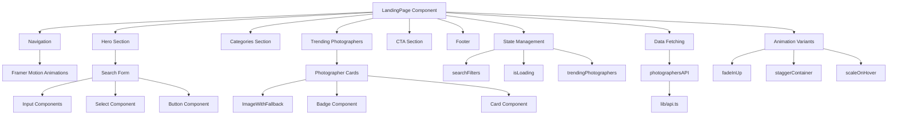
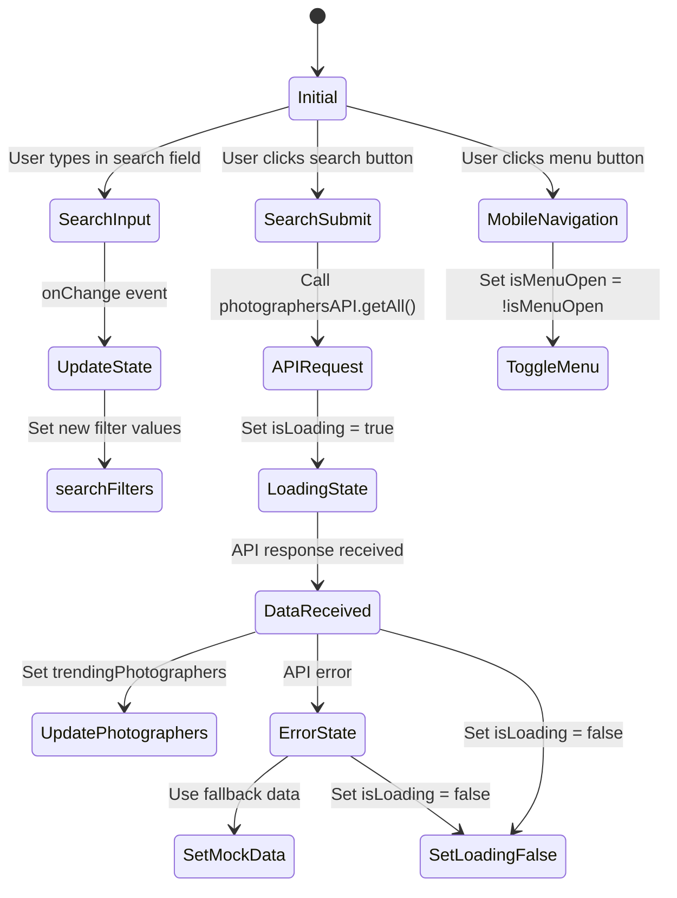
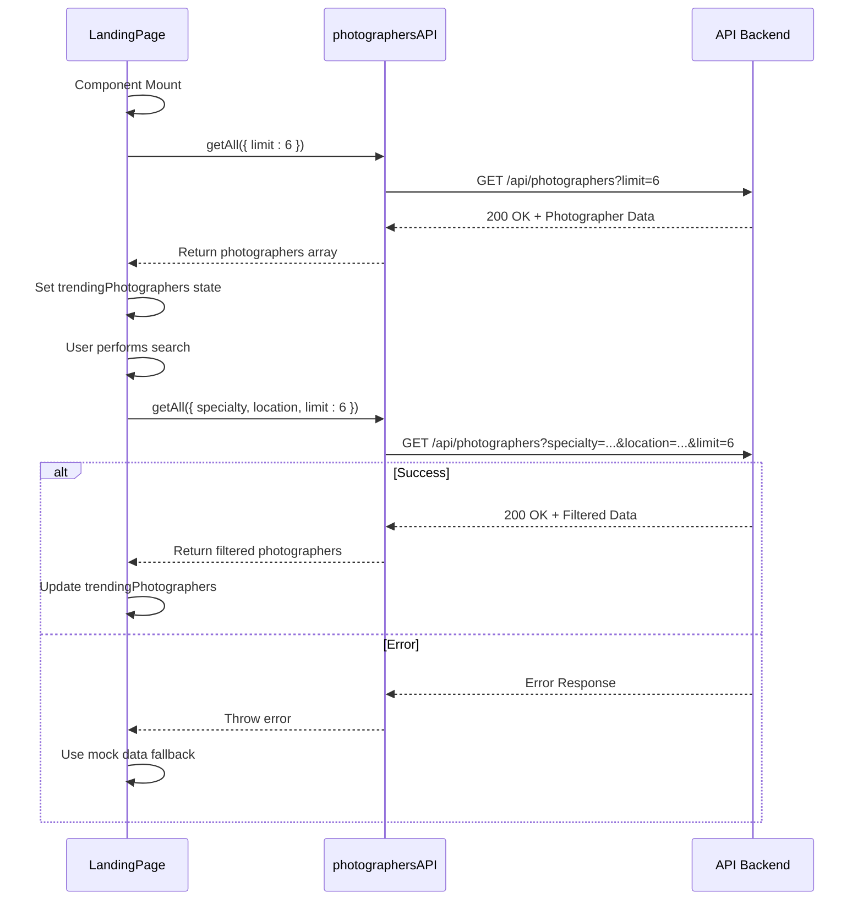
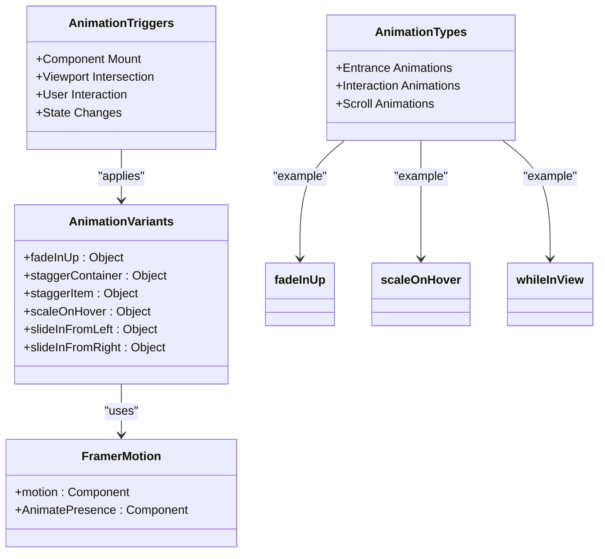
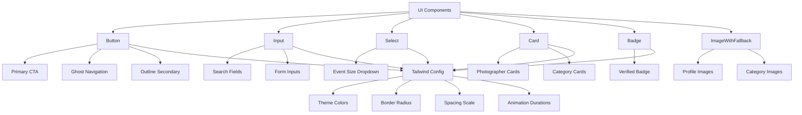
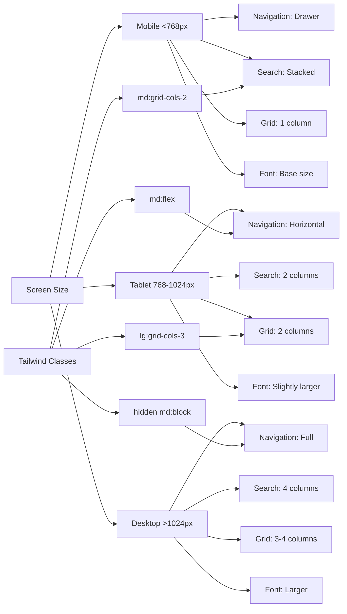

# Landing Page

<cite>
**Referenced Files in This Document**   
- [LandingPage.tsx](file://src/components/LandingPage.tsx)
- [LANDING_PAGE_ANIMATIONS.md](file://LANDING_PAGE_ANIMATIONS.md)
- [api.ts](file://src/lib/api.ts)
- [button.tsx](file://src/components/ui/button.tsx)
- [input.tsx](file://src/components/ui/input.tsx)
- [select.tsx](file://src/components/ui/select.tsx)
- [card.tsx](file://src/components/ui/card.tsx)
- [badge.tsx](file://src/components/ui/badge.tsx)
- [ImageWithFallback.tsx](file://src/components/figma/ImageWithFallback.tsx)
- [tailwind.config.js](file://tailwind.config.js)
</cite>

## Table of Contents
1. [Introduction](#introduction)
2. [Core Components](#core-components)
3. [Architecture Overview](#architecture-overview)
4. [State Management](#state-management)
5. [Data Fetching](#data-fetching)
6. [Animation System](#animation-system)
7. [UI Component Integration](#ui-component-integration)
8. [Responsive Design](#responsive-design)
9. [Accessibility Considerations](#accessibility-considerations)
10. [Common Issues and Solutions](#common-issues-and-solutions)
11. [Customization and Analytics](#customization-and-analytics)

## Introduction
The LandingPage.tsx component serves as the primary entry point for user discovery and navigation in the SnapEvent application. It provides a comprehensive interface for users to search for photographers, browse categories, and explore trending professionals. The component integrates advanced animation systems, responsive design principles, and robust state management to deliver an engaging user experience. As the first impression for new visitors, it plays a critical role in converting visitors into registered users through strategic call-to-action placements and intuitive navigation.

## Core Components

The LandingPage.tsx component is structured around several key sections that work together to create a cohesive user experience. The navigation bar provides sticky positioning with smooth entrance animations, while the hero section features a prominent search interface with animated entrance effects. The categories section displays photography specialties with hover interactions, and the trending photographers carousel showcases top professionals with detailed profiles. Each section is designed with performance and accessibility in mind, using optimized rendering techniques and semantic HTML structure.

**Section sources**
- [LandingPage.tsx](file://src/components/LandingPage.tsx#L1-L844)

## Architecture Overview

**Diagram sources**
- [LandingPage.tsx](file://src/components/LandingPage.tsx#L1-L844)
- [api.ts](file://src/lib/api.ts#L1-L261)

## State Management

The LandingPage component implements a comprehensive state management system using React's useState hook to handle various interactive elements. The search functionality is powered by the searchFilters state object, which tracks user input for specialty, location, and event size parameters. The isLoading state manages loading indicators during API requests, providing visual feedback to users. The trendingPhotographers state stores the collection of photographer profiles retrieved from the backend API, with a fallback to mock data if the API request fails. The isMenuOpen state controls the mobile navigation menu, enabling responsive behavior across device sizes.

**Diagram sources**
- [LandingPage.tsx](file://src/components/LandingPage.tsx#L30-L50)
- [LandingPage.tsx](file://src/components/LandingPage.tsx#L122-L167)

## Data Fetching

The component implements data fetching patterns through the photographersAPI service defined in lib/api.ts. On initial mount, the useEffect hook triggers a call to fetch the first six photographers to populate the trending section. The API service uses a generic request function with proper error handling and JSON parsing. When users perform searches, the handleSearch function calls the same API endpoint with filter parameters for specialty and location. The implementation includes loading states and error fallbacks, with mock data provided when API requests fail. The API base URL is configured through environment variables, allowing for different endpoints in development and production environments.

**Diagram sources**
- [LandingPage.tsx](file://src/components/LandingPage.tsx#L96-L125)
- [api.ts](file://src/lib/api.ts#L1-L261)

## Animation System

The landing page implements a sophisticated animation system using Framer Motion as documented in LANDING_PAGE_ANIMATIONS.md. The component defines several animation variants including fadeInUp for text elements, staggerContainer for grid layouts, and scaleOnHover for interactive elements. Entrance animations are triggered on component mount and when elements enter the viewport using whileInView. The navigation bar slides in from the top, while the hero section elements animate in sequence with calculated delays. Category cards and photographer profiles use staggered animations with 0.1-second delays between items. Interactive elements respond to hover and tap events with spring physics effects, providing tactile feedback.

**Diagram sources**
- [LandingPage.tsx](file://src/components/LandingPage.tsx#L50-L85)
- [LANDING_PAGE_ANIMATIONS.md](file://LANDING_PAGE_ANIMATIONS.md#L1-L165)

## UI Component Integration

The landing page extensively uses UI components from the ui directory to ensure design consistency across the application. The Button component is used for primary actions with various variants including default, ghost, and outline styles. Input fields leverage the Input component with proper styling for focus states and error handling. The Select component provides a styled dropdown for event size selection with accessible keyboard navigation. Photographer cards are built using the Card component with CardContent for the interior layout. Badges are used to highlight verified status, and ImageWithFallback ensures graceful degradation when images fail to load. All components follow the design system defined in tailwind.config.js with consistent spacing, typography, and color schemes.

**Diagram sources**
- [button.tsx](file://src/components/ui/button.tsx#L1-L59)
- [input.tsx](file://src/components/ui/input.tsx#L1-L22)
- [select.tsx](file://src/components/ui/select.tsx#L1-L190)
- [card.tsx](file://src/components/ui/card.tsx#L1-L93)
- [badge.tsx](file://src/components/ui/badge.tsx#L1-L47)
- [ImageWithFallback.tsx](file://src/components/figma/ImageWithFallback.tsx#L1-L28)
- [tailwind.config.js](file://tailwind.config.js#L1-L78)

## Responsive Design

The landing page implements responsive design using Tailwind CSS with a mobile-first approach. The layout adapts to different screen sizes through responsive grid systems and conditional rendering. On mobile devices, the navigation switches from a horizontal menu to a collapsible drawer with a hamburger icon. The search form transforms from a four-column layout on desktop to a stacked single-column layout on mobile. Category and photographer grids adjust their column count based on screen width, displaying one column on mobile, two on tablet, and three or four on desktop. Typography scales appropriately across breakpoints, and touch targets are optimized for mobile interaction. The implementation follows accessibility best practices with proper focus management and keyboard navigation support.

**Diagram sources**
- [LandingPage.tsx](file://src/components/LandingPage.tsx#L376-L403)
- [tailwind.config.js](file://tailwind.config.js#L1-L78)

## Accessibility Considerations

The landing page incorporates several accessibility features to ensure usability for all users. Semantic HTML elements are used throughout, with proper heading hierarchy and ARIA attributes. Interactive elements have visible focus states and sufficient color contrast. The navigation is keyboard accessible with logical tab order and skip links. Screen reader users benefit from appropriate alt text on images and descriptive labels for form controls. The animation system respects user preferences for reduced motion through proper media query detection. Form inputs include proper validation messages and error states. The color palette defined in tailwind.config.js ensures sufficient contrast ratios for text and interactive elements, meeting WCAG 2.1 AA standards.

**Section sources**
- [LandingPage.tsx](file://src/components/LandingPage.tsx#L1-L844)
- [tailwind.config.js](file://tailwind.config.js#L1-L78)
- [LANDING_PAGE_ANIMATIONS.md](file://LANDING_PAGE_ANIMATIONS.md#L1-L165)

## Common Issues and Solutions

The landing page addresses several common issues in Next.js applications. For slow loading of hero images, the ImageWithFallback component provides a placeholder while images load and handles errors gracefully. To prevent hydration mismatches, all animations are triggered after mount using useEffect and whileInView from Framer Motion. Search debounce logic is implemented through state updates that only trigger API calls on explicit user action rather than on every keystroke, though this could be enhanced with actual debounce functionality. The component handles loading states with skeleton screens for the photographer cards, providing immediate feedback during data fetching. Error boundaries are implemented through try-catch blocks in API calls with fallback to mock data when requests fail.

**Section sources**
- [LandingPage.tsx](file://src/components/LandingPage.tsx#L96-L125)
- [ImageWithFallback.tsx](file://src/components/figma/ImageWithFallback.tsx#L1-L28)

## Customization and Analytics

The landing page supports customization of CTA sections through props and state management, allowing different messaging based on user context or marketing campaigns. Integration with analytics is facilitated through the onNavigate and onPhotographerSelect callback props, which can be wrapped with tracking functions to monitor user interactions. The component's modular design allows for easy modification of sections like the hero, categories, and featured photographers without affecting the overall structure. Theme customization is supported through the Tailwind configuration, enabling brand color changes across the entire application. The use of Framer Motion for animations provides a consistent language for adding new animated elements while maintaining performance and accessibility standards.

**Section sources**
- [LandingPage.tsx](file://src/components/LandingPage.tsx#L1-L844)
- [tailwind.config.js](file://tailwind.config.js#L1-L78)