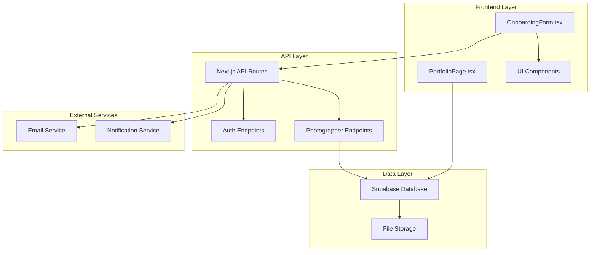
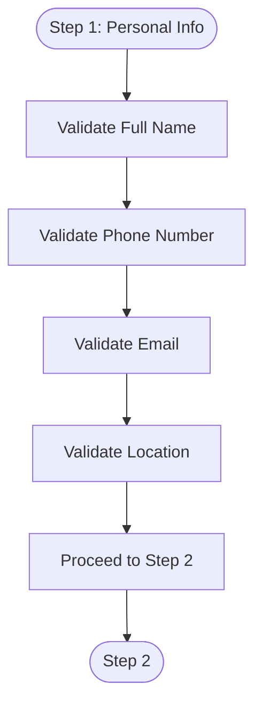
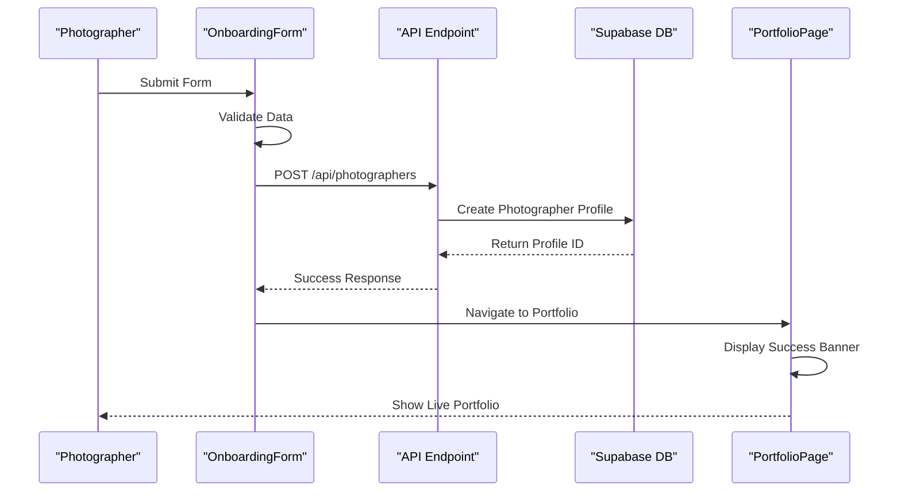
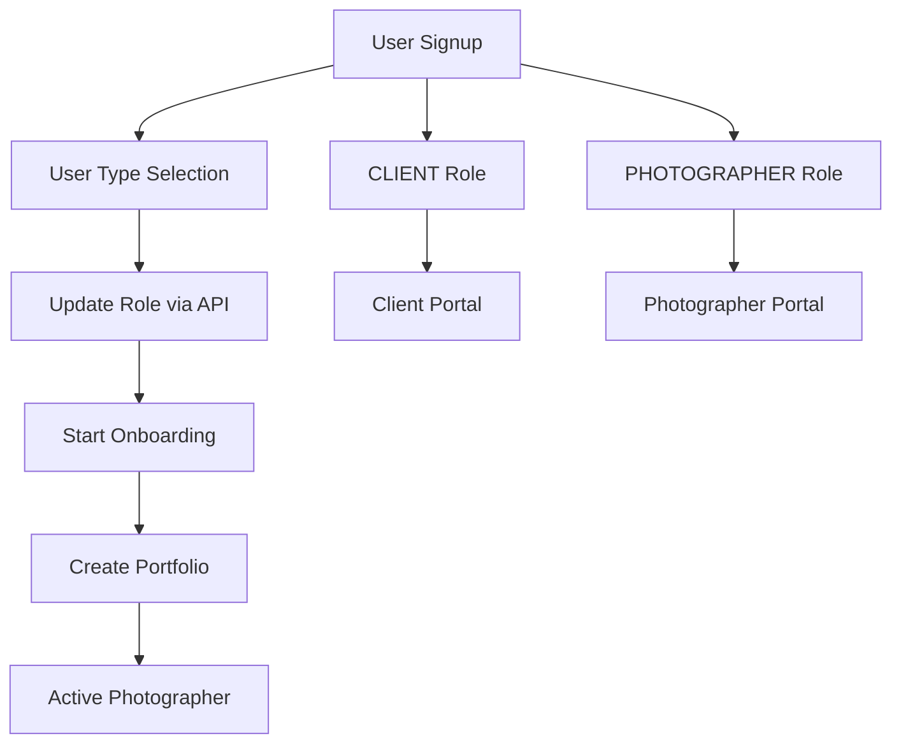

# Onboarding Flow

<cite>
**Referenced Files in This Document**
- [OnboardingForm.tsx](file://src/components/OnboardingForm.tsx)
- [PortfolioPage.tsx](file://src/components/PortfolioPage.tsx)
- [onboarding.tsx](file://pages/onboarding.tsx)
- [INSTANT_PORTFOLIO_FLOW.md](file://INSTANT_PORTFOLIO_FLOW.md)
- [api.ts](file://src/lib/api.ts)
- [supabase.ts](file://src/lib/supabase.ts)
- [update-role.ts](file://pages/api/auth/update-role.ts)
- [portfolio.ts](file://src/utils/portfolio.ts)
- [index.ts](file://pages/api/photographers/index.ts)
- [id.ts](file://pages/api/photographers/[id].ts)
</cite>

## Table of Contents
1. [Introduction](#introduction)
2. [System Architecture](#system-architecture)
3. [OnboardingForm Component](#onboardingform-component)
4. [Multi-Step Form Implementation](#multi-step-form-implementation)
5. [Bilingual Support](#bilingual-support)
6. [Data Validation and Processing](#data-validation-and-processing)
7. [Integration with Portfolio Creation](#integration-with-portfolio-creation)
8. [Role Assignment and Authentication](#role-assignment-and-authentication)
9. [State Management and Persistence](#state-management-and-persistence)
10. [Error Handling and User Feedback](#error-handling-and-user-feedback)
11. [Common Issues and Solutions](#common-issues-and-solutions)
12. [Customization Guide](#customization-guide)
13. [Conclusion](#conclusion)

## Introduction

The OnboardingForm.tsx component serves as the primary interface for new photographers to register and create their portfolios on the SnapEvent platform. This comprehensive system implements an instant portfolio creation flow that eliminates traditional approval bottlenecks, allowing photographers to become active members of the platform immediately upon completing their profile setup.

The onboarding process consists of five distinct steps covering personal information, professional background, services and pricing, portfolio details, and final submission. The system integrates seamlessly with Supabase for data persistence, implements real-time validation, and provides instant feedback to users throughout the registration process.

## System Architecture

The onboarding system follows a modern React architecture with Next.js server-side rendering capabilities and integrates with Supabase for database operations. The system is designed around the principle of instant portfolio creation, where photographers can see their portfolio live immediately after registration.



**Diagram sources**
- [OnboardingForm.tsx](file://src/components/OnboardingForm.tsx#L1-L50)
- [PortfolioPage.tsx](file://src/components/PortfolioPage.tsx#L1-L50)
- [api.ts](file://src/lib/api.ts#L1-L50)

## OnboardingForm Component

The OnboardingForm component is the central hub of the registration process, implementing a sophisticated multi-step form with real-time validation, bilingual support, and instant portfolio generation capabilities.

### Component Structure and Props

```typescript
interface OnboardingFormProps {
  onNavigate: (page: 'landing' | 'onboarding' | 'portfolio', photographerId?: string) => void;
  isEditMode?: boolean;
}

interface FormData {
  fullName: string;
  phoneNumber: string;
  email: string;
  location: string;
  cameraManufacturer: string;
  cameraModel: string;
  lenses: string;
  photographerType: string;
  experience: string;
  photoTypes: string[];
  otherPhotoText: string;
  additionalServices: string[];
  otherSoftwareText: string;
  otherHardwareText: string;
  samplePhotos: string;
  startingPrice: string;
  language: string;
  rankedPhotoTypes: string;
  rankedAdditionalServices: string;
  // Legacy fields for compatibility
  firstName: string;
  lastName: string;
  phone: string;
  profilePicture: File | null;
  specialties: string[];
  equipment: string;
  website: string;
  services: string[];
  priceRange: string;
  availability: string;
  portfolioDescription: string;
  instagramHandle: string;
  workSamples: File[];
}
```

### Core State Management

The component maintains several key pieces of state to manage the onboarding process effectively:

```typescript
const [currentStep, setCurrentStep] = useState(1);
const [isSubmitting, setIsSubmitting] = useState(false);
const [isDarkMode, setIsDarkMode] = useState(true);
const [currentLang, setCurrentLang] = useState<'en' | 'te'>('te');
const [priceError, setPriceError] = useState('');
const [showOtherPhotoText, setShowOtherPhotoText] = useState(false);
const [showOtherSoftwareText, setShowOtherSoftwareText] = useState(false);
const [showOtherHardwareText, setShowOtherHardwareText] = useState(false);
const [formData, setFormData] = useState<FormData>({
  // Initial form data state
});
```

**Section sources**
- [OnboardingForm.tsx](file://src/components/OnboardingForm.tsx#L38-L78)
- [OnboardingForm.tsx](file://src/components/OnboardingForm.tsx#L80-L120)

## Multi-Step Form Implementation

The onboarding form is structured as a five-step wizard that guides photographers through the complete registration process. Each step focuses on specific aspects of their professional profile.

### Step 1: Personal Information

The first step collects essential personal details including full name, phone number, email address, and location. This information forms the foundation of the photographer's profile.



**Diagram sources**
- [OnboardingForm.tsx](file://src/components/OnboardingForm.tsx#L200-L300)

### Step 2: Professional Background

This step captures the photographer's experience level, specialties, camera equipment, and website information. The form includes interactive checkboxes for selecting multiple specialties and a text area for equipment details.

```typescript
const specialtyOptions = [
  'Wedding Photography', 'Portrait Photography', 'Event Photography',
  'Corporate Photography', 'Fashion Photography', 'Landscape Photography',
  'Street Photography', 'Product Photography', 'Food Photography'
];

const serviceOptions = [
  'Photo Shoots', 'Event Coverage', 'Post-Processing', 'Consultation',
  'Album Design', 'Prints & Products', 'Video Services', 'Drone Photography'
];
```

### Step 3: Services and Pricing

The third step focuses on the services offered by the photographer, pricing ranges, and availability schedules. This information helps clients understand what services are available and how to book them.

### Step 4: Portfolio and Social Media

This step allows photographers to describe their work style, provide Instagram handles, and upload work samples. The form includes drag-and-drop functionality for file uploads with size and format restrictions.

### Step 5: Final Details

The final step collects the starting price, language preference, and sample album links. This information is crucial for client discovery and communication preferences.

**Section sources**
- [OnboardingForm.tsx](file://src/components/OnboardingForm.tsx#L150-L250)
- [OnboardingForm.tsx](file://src/components/OnboardingForm.tsx#L300-L400)
- [OnboardingForm.tsx](file://src/components/OnboardingForm.tsx#L400-L500)
- [OnboardingForm.tsx](file://src/components/OnboardingForm.tsx#L500-L600)
- [OnboardingForm.tsx](file://src/components/OnboardingForm.tsx#L600-L700)

## Bilingual Support

The onboarding system implements comprehensive bilingual support for Telugu and English languages, enabling photographers from different linguistic backgrounds to complete the registration process comfortably.

### Language Detection and Management

```typescript
const [currentLang, setCurrentLang] = useState<'en' | 'te'>('te');

const toggleLanguage = () => {
  setCurrentLang(currentLang === 'en' ? 'te' : 'en');
};
```

### Placeholder and Label Management

The system dynamically generates appropriate placeholders and labels based on the selected language:

```typescript
const getPlaceholder = (key: string): string => {
  const placeholders: Record<string, {en: string, te: string}> = {
    lenses: {
      en: "e.g., Canon 24-70mm f/2.8, Sigma 50mm f/1.4 Art",
      te: "ఉదా., కెనాన్ 24-70మిమీ f/2.8, సిగ్మా 50మిమీ f/1.4 ఆర్ట్"
    },
    samplePhotos: {
      en: "Paste your Google Drive link here",
      te: "Google Drive లింక్‌ను ఇక్కడ అతికించండి"
    }
  };
  return placeholders[key]?.[currentLang as keyof typeof placeholders[string]] || '';
};
```

### Dynamic Content Rendering

All form labels, instructions, and error messages are rendered dynamically based on the current language setting, ensuring a seamless user experience across both languages.

**Section sources**
- [OnboardingForm.tsx](file://src/components/OnboardingForm.tsx#L120-L150)
- [OnboardingForm.tsx](file://src/components/OnboardingForm.tsx#L180-L220)

## Data Validation and Processing

The onboarding system implements robust validation mechanisms to ensure data integrity and provide immediate feedback to users.

### Real-Time Field Validation

```typescript
const handleInputChange = (field: string, value: any) => {
  setFormData(prev => ({ ...prev, [field]: value }));
};

const handleFormInputChange = (e: React.ChangeEvent<HTMLInputElement | HTMLTextAreaElement | HTMLSelectElement>) => {
  const { name, value } = e.target;
  setFormData((prev: FormData) => ({ ...prev, [name]: value }));
};
```

### Price Validation

The system implements specialized validation for the starting price field to ensure it meets minimum requirements:

```typescript
const handleSubmit = async (e?: React.FormEvent) => {
  if (e) e.preventDefault();
  
  const priceValue = formData.startingPrice.replace(/[^0-9]/g, '');
  const price = parseInt(priceValue, 10);
  
  if (isNaN(price) || price < 20000) {
    setPriceError(currentLang === 'te' 
      ? 'కనీసం ప్రారంభ ధర ₹20,000 లేదా అంతకంటే ఎక్కువ ఉండాలి.' 
      : 'Minimum starting price must be ₹20,000 or more.');
    return;
  }
  
  setPriceError('');
  // Proceed with form submission...
};
```

### File Upload Validation

The system validates uploaded files for type and size constraints:

```typescript
const handleProfilePictureChange = (event: React.ChangeEvent<HTMLInputElement>) => {
  const file = event.target.files?.[0];
  if (file) {
    // Validate file type
    if (!file.type.startsWith('image/')) {
      alert('Please select an image file');
      return;
    }
    // Validate file size (5MB max)
    if (file.size > 5 * 1024 * 1024) {
      alert('File size must be less than 5MB');
      return;
    }
    setFormData(prev => ({ ...prev, profilePicture: file }));
  }
};
```

**Section sources**
- [OnboardingForm.tsx](file://src/components/OnboardingForm.tsx#L150-L200)
- [OnboardingForm.tsx](file://src/components/OnboardingForm.tsx#L700-L750)

## Integration with Portfolio Creation

The onboarding system seamlessly integrates with the portfolio creation process, enabling instant portfolio generation upon successful form submission.

### Form Submission Flow



**Diagram sources**
- [OnboardingForm.tsx](file://src/components/OnboardingForm.tsx#L750-L800)
- [index.ts](file://pages/api/photographers/index.ts#L95-L140)

### API Integration

The form submits data to the Supabase API, which creates a photographer profile with instant approval:

```typescript
const response = await fetch('/api/submit', {
  method: 'POST',
  headers: {
    'Content-Type': 'application/json',
  },
  body: JSON.stringify(formData),
});

if (response.ok) {
  const newPhotographerId = `photographer-${Date.now()}`;
  
  alert(currentLang === 'te' 
    ? 'మీ వివరాలు విజయవంతంగా సమర్పించబడ్డాయి! మా బృందం త్వరలోనే మిమ్మల్ని సంప్రదిస్తుంది.'
    : 'Your details have been submitted successfully! Your portfolio is now being created.');
  
  onNavigate('portfolio', newPhotographerId);
  return;
}
```

### Portfolio URL Generation

The system automatically generates portfolio URLs based on the photographer's name:

```typescript
export function generatePortfolioSlug(
  firstName: string, 
  lastName: string, 
  existingUrls: string[] = []
): string {
  const baseSlug = `${firstName.toLowerCase()}-${lastName.toLowerCase()}`
    .replace(/[^a-z0-9-]/g, '')
    .replace(/-+/g, '-')
    .replace(/^-|-$/g, '');

  let slug = baseSlug;
  let counter = 1;
  
  while (existingUrls.includes(slug)) {
    slug = `${baseSlug}-${counter}`;
    counter++;
  }

  return slug;
}
```

**Section sources**
- [OnboardingForm.tsx](file://src/components/OnboardingForm.tsx#L750-L800)
- [portfolio.ts](file://src/utils/portfolio.ts#L10-L45)
- [index.ts](file://pages/api/photographers/index.ts#L95-L140)

## Role Assignment and Authentication

The onboarding system integrates with the authentication system to assign appropriate roles to users based on their registration type.

### Role Assignment Flow



**Diagram sources**
- [update-role.ts](file://pages/api/auth/update-role.ts#L1-L49)
- [GeneralizedSignupFlow.tsx](file://src/components/GeneralizedSignupFlow.tsx#L1-L42)

### Role Update Implementation

The system updates user roles through a dedicated API endpoint:

```typescript
export default async function handler(req: NextApiRequest, res: NextApiResponse) {
  if (req.method !== 'POST') {
    return res.status(405).json({ error: 'Method not allowed' });
  }

  try {
    const { role } = req.body;

    if (!role || !['CLIENT', 'PHOTOGRAPHER'].includes(role)) {
      return res.status(400).json({ error: 'Invalid role. Must be CLIENT or PHOTOGRAPHER' });
    }

    const { data: { session }, error: sessionError } = await supabase.auth.getSession();

    if (sessionError || !session) {
      return res.status(401).json({ error: 'Not authenticated' });
    }

    const { data: userData, error: userError } = await supabase
      .from('users')
      .update({ role: role })
      .eq('id', session.user.id)
      .select()
      .single();

    return res.status(200).json({
      message: 'User role updated successfully',
      user: {
        id: userData.id,
        email: userData.email,
        role: userData.role
      }
    });

  } catch (error) {
    console.error('Update role error:', error);
    return res.status(500).json({ error: 'Internal server error' });
  }
}
```

### Integration with Onboarding

The onboarding form works seamlessly with the role assignment system, ensuring that photographers are properly categorized and can access their dedicated portfolio pages.

**Section sources**
- [update-role.ts](file://pages/api/auth/update-role.ts#L1-L49)
- [GeneralizedSignupFlow.tsx](file://src/components/GeneralizedSignupFlow.tsx#L30-L50)

## State Management and Persistence

The onboarding system implements sophisticated state management to ensure data integrity and provide a smooth user experience.

### Local Storage Integration

```typescript
useEffect(() => {
  const savedTheme = localStorage.getItem('theme');
  if (savedTheme === 'light') {
    setIsDarkMode(false);
  }
}, []);

const toggleTheme = () => {
  const newTheme = !isDarkMode;
  setIsDarkMode(newTheme);
  localStorage.setItem('theme', newTheme ? 'dark' : 'light');
};
```

### Form State Management

The form maintains comprehensive state for all input fields, ensuring that data is preserved across steps and can be easily validated:

```typescript
const [formData, setFormData] = useState<FormData>({
  fullName: '',
  phoneNumber: '',
  email: '',
  location: '',
  cameraManufacturer: '',
  cameraModel: '',
  lenses: '',
  photographerType: '',
  experience: '',
  photoTypes: [],
  otherPhotoText: '',
  additionalServices: [],
  otherSoftwareText: '',
  otherHardwareText: '',
  samplePhotos: '',
  startingPrice: '',
  language: '',
  rankedPhotoTypes: '',
  rankedAdditionalServices: '',
  // Legacy compatibility fields
  firstName: '',
  lastName: '',
  phone: '',
  profilePicture: null,
  specialties: [],
  equipment: '',
  website: '',
  services: [],
  priceRange: '',
  availability: '',
  portfolioDescription: '',
  instagramHandle: '',
  workSamples: []
});
```

### Progress Tracking

The system tracks form progress and provides visual feedback to users:

```typescript
const totalSteps = 6; // Updated to include bilingual form fields
const progress = (currentStep / totalSteps) * 100;

return (
  <div className="fixed bottom-0 left-0 right-0 bg-background border-t border-border">
    <div className="container mx-auto px-4 py-2">
      <div className="flex items-center justify-between">
        <div className="text-sm text-muted-foreground">
          Step {currentStep} of {totalSteps}
        </div>
        <Progress value={progress} className="w-1/2" />
      </div>
    </div>
  </div>
);
```

**Section sources**
- [OnboardingForm.tsx](file://src/components/OnboardingForm.tsx#L100-L120)
- [OnboardingForm.tsx](file://src/components/OnboardingForm.tsx#L120-L150)
- [OnboardingForm.tsx](file://src/components/OnboardingForm.tsx#L150-L180)

## Error Handling and User Feedback

The onboarding system implements comprehensive error handling and provides clear, actionable feedback to users throughout the registration process.

### Validation Error Management

```typescript
const [priceError, setPriceError] = useState('');

const handleSubmit = async (e?: React.FormEvent) => {
  if (e) e.preventDefault();
  
  const priceValue = formData.startingPrice.replace(/[^0-9]/g, '');
  const price = parseInt(priceValue, 10);
  
  if (isNaN(price) || price < 20000) {
    setPriceError(currentLang === 'te' 
      ? 'కనీసం ప్రారంభ ధర ₹20,000 లేదా అంతకంటే ఎక్కువ ఉండాలి.' 
      : 'Minimum starting price must be ₹20,000 or more.');
    return;
  }
  
  setPriceError('');
  // Continue with submission...
};
```

### Success and Error Alerts

The system provides contextual feedback for different scenarios:

```typescript
const handleSubmit = async (e?: React.FormEvent) => {
  // ... validation logic ...
  
  try {
    const response = await fetch('/api/submit', {
      method: 'POST',
      headers: {
        'Content-Type': 'application/json',
      },
      body: JSON.stringify(formData),
    });

    if (response.ok) {
      alert(currentLang === 'te' 
        ? 'మీ వివరాలు విజయవంతంగా సమర్పించబడ్డాయి! మా బృందం త్వరలోనే మిమ్మల్ని సంప్రదిస్తుంది.'
        : 'Your details have been submitted successfully! Your portfolio is now being created.');
      
      onNavigate('portfolio', newPhotographerId);
      return;
    } else {
      throw new Error('Submission failed');
    }
  } catch (error) {
    console.error('Error submitting form:', error);
    alert(currentLang === 'te' 
      ? 'ఫారమ్ సమర్పించడంలో విఫలమైంది. దయచేసి మళ్లీ ప్రయత్నించండి.'
      : 'Failed to submit form. Please try again.');
  } finally {
    setIsSubmitting(false);
  }
};
```

### Loading States

The system manages loading states to prevent duplicate submissions and provide user feedback:

```typescript
const [isSubmitting, setIsSubmitting] = useState(false);

const handleSubmit = async (e?: React.FormEvent) => {
  setIsSubmitting(true);
  // ... submission logic ...
  setIsSubmitting(false);
};
```

**Section sources**
- [OnboardingForm.tsx](file://src/components/OnboardingForm.tsx#L700-L750)
- [OnboardingForm.tsx](file://src/components/OnboardingForm.tsx#L750-L800)

## Common Issues and Solutions

### Incomplete Submissions

**Problem**: Users abandon the onboarding process before completion.

**Solution**: Implement autosave functionality and provide clear progress indicators. The current system already tracks progress and saves local state, but additional improvements could include:

```typescript
// Autosave form data periodically
useEffect(() => {
  const saveTimer = setInterval(() => {
    localStorage.setItem('onboardingDraft', JSON.stringify(formData));
  }, 30000); // Save every 30 seconds
  
  return () => clearInterval(saveTimer);
}, [formData]);
```

### Image Upload Failures

**Problem**: File upload fails due to size or format restrictions.

**Solution**: Implement client-side validation and provide clear error messages:

```typescript
const handleFileUpload = (event: React.ChangeEvent<HTMLInputElement>) => {
  const files = event.target.files;
  if (!files || files.length === 0) return;
  
  const errors = [];
  for (const file of Array.from(files)) {
    if (!file.type.startsWith('image/')) {
      errors.push(`${file.name}: Please select image files only`);
      continue;
    }
    if (file.size > 10 * 1024 * 1024) {
      errors.push(`${file.name}: File size must be less than 10MB`);
      continue;
    }
  }
  
  if (errors.length > 0) {
    alert('Upload errors:\n' + errors.join('\n'));
    return;
  }
  
  // Proceed with upload...
};
```

### Timeout Handling

**Problem**: Network timeouts during form submission.

**Solution**: Implement retry logic and timeout handling:

```typescript
const handleSubmit = async (e?: React.FormEvent) => {
  setIsSubmitting(true);
  
  try {
    const controller = new AbortController();
    const timeoutId = setTimeout(() => controller.abort(), 30000); // 30 second timeout
    
    const response = await fetch('/api/submit', {
      method: 'POST',
      headers: {
        'Content-Type': 'application/json',
      },
      body: JSON.stringify(formData),
      signal: controller.signal,
    });
    
    clearTimeout(timeoutId);
    
    if (!response.ok) {
      throw new Error(`HTTP ${response.status}: ${await response.text()}`);
    }
    
    // Handle success...
    
  } catch (error) {
    if (error.name === 'AbortError') {
      alert('Request timed out. Please check your internet connection and try again.');
    } else {
      alert('An unexpected error occurred. Please try again.');
    }
  } finally {
    setIsSubmitting(false);
  }
};
```

### Data Integrity Issues

**Problem**: Inconsistent data between form fields and database.

**Solution**: Implement comprehensive validation and data normalization:

```typescript
const normalizeFormData = (data: FormData): NormalizedData => {
  return {
    fullName: data.fullName.trim(),
    phoneNumber: data.phoneNumber.replace(/\D/g, ''),
    email: data.email.toLowerCase().trim(),
    location: data.location.trim(),
    startingPrice: data.startingPrice.replace(/[^0-9]/g, ''),
    // Additional normalization logic...
  };
};
```

## Customization Guide

### Adding New Onboarding Steps

To add a new step to the onboarding process:

1. **Update the Step Counter**: Increase the `totalSteps` constant
2. **Add Step Logic**: Implement the new step in the `renderStepContent` function
3. **Update Form Data**: Add new fields to the `FormData` interface
4. **Modify Navigation**: Update the `nextStep` and `prevStep` functions

```typescript
// Example: Adding a new step for social media links
const totalSteps = 7; // Increased from 6

const renderStepContent = () => {
  switch (currentStep) {
    case 6:
      return (
        <motion.div>
          {/* Social Media Links Step */}
          <div className="space-y-4">
            <Input
              placeholder="Facebook URL"
              value={formData.facebookUrl}
              onChange={(e) => handleInputChange('facebookUrl', e.target.value)}
            />
            <Input
              placeholder="Instagram URL"
              value={formData.instagramUrl}
              onChange={(e) => handleInputChange('instagramUrl', e.target.value)}
            />
            <Input
              placeholder="LinkedIn URL"
              value={formData.linkedinUrl}
              onChange={(e) => handleInputChange('linkedinUrl', e.target.value)}
            />
          </div>
        </motion.div>
      );
    // ... other cases ...
  }
};
```

### Modifying Existing Fields

To modify existing form fields:

1. **Update the Interface**: Modify the `FormData` interface
2. **Update Validation**: Adjust validation logic
3. **Update Rendering**: Modify the JSX rendering
4. **Update API Calls**: Ensure API endpoints handle new/modified fields

```typescript
// Example: Adding a new specialty option
const specialtyOptions = [
  'Wedding Photography', 'Portrait Photography', 'Event Photography',
  'Corporate Photography', 'Fashion Photography', 'Landscape Photography',
  'Street Photography', 'Product Photography', 'Food Photography',
  'Aerial Photography' // New option
];

// Update validation logic
const handleSpecialtyToggle = (specialty: string) => {
  setFormData(prev => ({
    ...prev,
    specialties: prev.specialties.includes(specialty)
      ? prev.specialties.filter(s => s !== specialty)
      : [...prev.specialties, specialty]
  }));
};
```

### Customizing Validation Rules

To customize validation rules:

```typescript
const validateField = (field: string, value: string): string => {
  switch (field) {
    case 'startingPrice':
      const price = parseInt(value.replace(/[^0-9]/g, ''), 10);
      if (isNaN(price) || price < 15000) { // Lower minimum
        return 'Minimum starting price must be ₹15,000 or more.';
      }
      break;
    case 'email':
      if (!/\S+@\S+\.\S+/.test(value)) {
        return 'Please enter a valid email address.';
      }
      break;
    // ... other validations ...
  }
  return '';
};
```

### Theme Customization

To customize the theme and styling:

```typescript
// Update color scheme
const themeColors = {
  primary: '#2563EB', // Blue
  secondary: '#16A34A', // Green
  accent: '#F59E0B', // Orange
  background: '#0F172A', // Dark background
  surface: '#1E293B', // Surface/background
};

// Update typography
const typography = {
  fontSize: {
    small: '0.875rem',
    medium: '1rem',
    large: '1.125rem',
    xl: '1.25rem',
    xxl: '1.5rem',
  },
  fontWeight: {
    light: '300',
    normal: '400',
    medium: '500',
    semibold: '600',
    bold: '700',
  },
};
```

**Section sources**
- [OnboardingForm.tsx](file://src/components/OnboardingForm.tsx#L150-L200)
- [OnboardingForm.tsx](file://src/components/OnboardingForm.tsx#L700-L750)

## Conclusion

The OnboardingForm.tsx component represents a sophisticated and user-friendly solution for photographer registration on the SnapEvent platform. By implementing instant portfolio creation, comprehensive validation, bilingual support, and seamless integration with the authentication system, the component provides an exceptional user experience that encourages photographers to complete their profiles and become active members of the platform.

The system's modular architecture, robust error handling, and extensive customization options make it adaptable to various use cases and future enhancements. The integration with Supabase ensures reliable data persistence, while the real-time validation and feedback mechanisms help users complete the onboarding process efficiently.

Key strengths of the system include:

- **Instant Portfolio Creation**: Eliminates approval bottlenecks and provides immediate value
- **Comprehensive Validation**: Ensures data quality and provides clear user feedback
- **Bilingual Support**: Enables global reach with Telugu and English language options
- **Seamless Integration**: Works harmoniously with authentication and portfolio systems
- **Extensible Architecture**: Allows for easy addition of new features and customization

The onboarding system serves as a model for modern web applications requiring complex user registration workflows with instant feedback and seamless transitions between different application states.