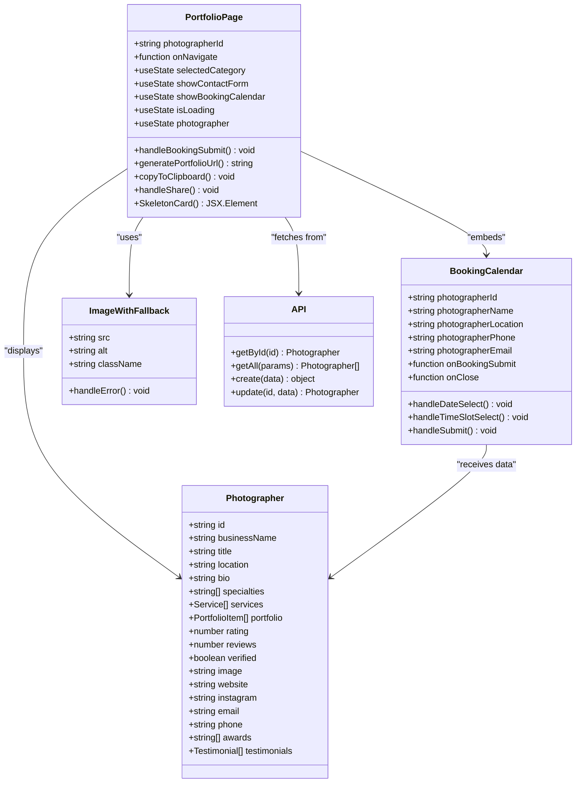
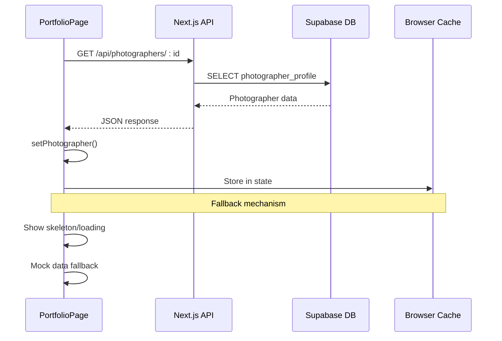
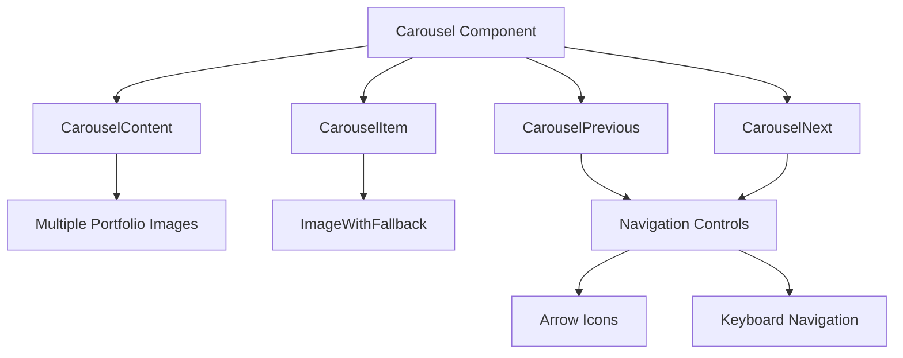
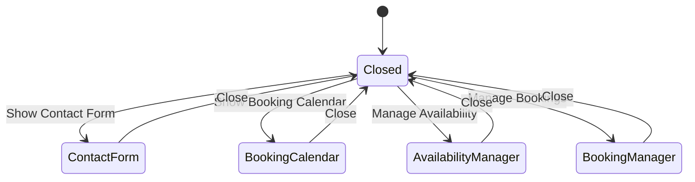
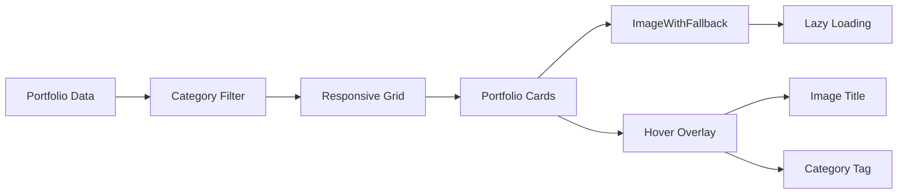
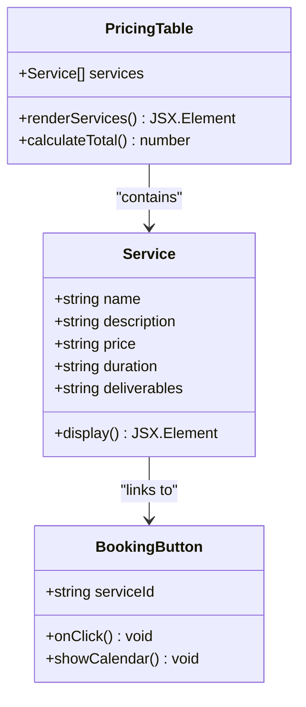
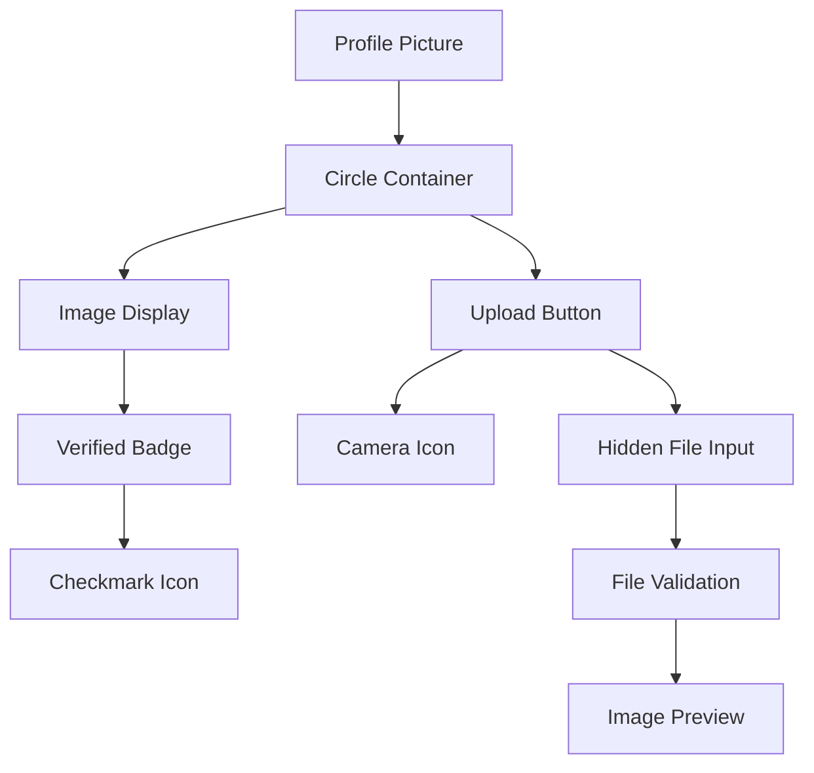
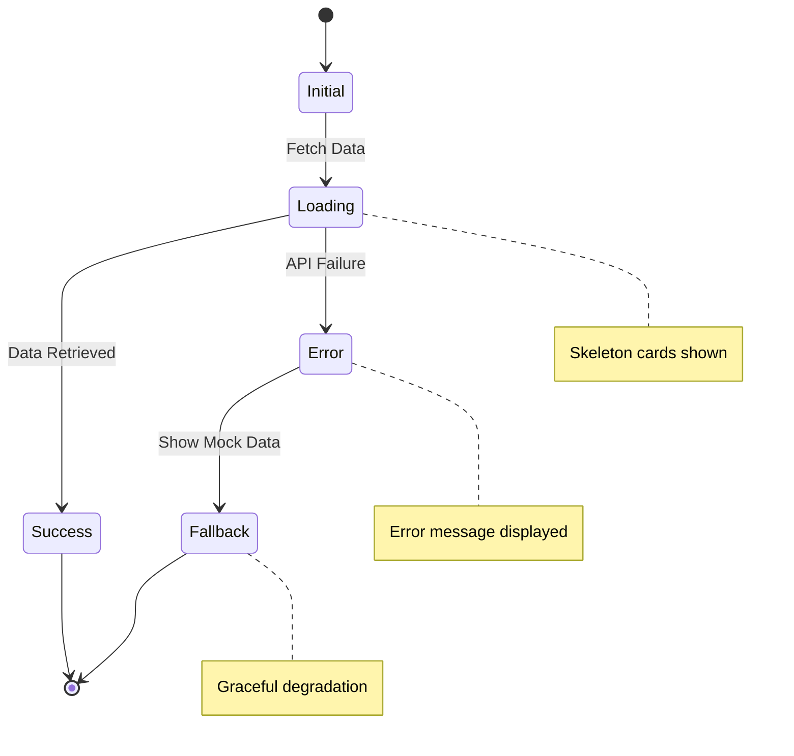
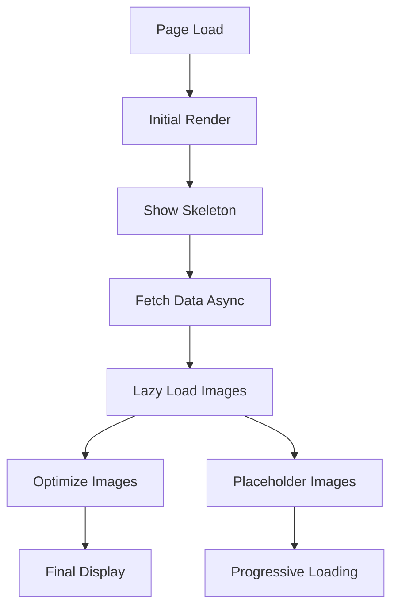
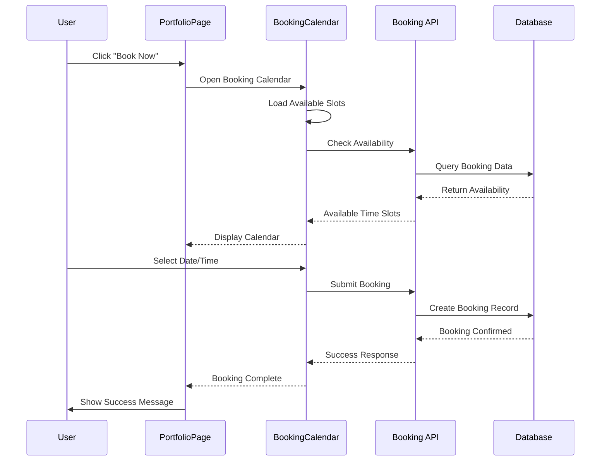

# Portfolio Page Component Documentation

<cite>
**Referenced Files in This Document**
- [src/components/PortfolioPage.tsx](file://src/components/PortfolioPage.tsx)
- [src/lib/api.ts](file://src/lib/api.ts)
- [pages/api/photographers/[id].ts](file://pages/api/photographers/[id].ts)
- [src/components/ui/carousel.tsx](file://src/components/ui/carousel.tsx)
- [src/components/ui/tabs.tsx](file://src/components/ui/tabs.tsx)
- [src/components/ui/dialog.tsx](file://src/components/ui/dialog.tsx)
- [src/components/figma/ImageWithFallback.tsx](file://src/components/figma/ImageWithFallback.tsx)
- [src/components/BookingCalendar.tsx](file://src/components/BookingCalendar.tsx)
- [PROFILE_PICTURE_FEATURE.md](file://PROFILE_PICTURE_FEATURE.md)
</cite>

## Table of Contents
1. [Introduction](#introduction)
2. [Component Architecture](#component-architecture)
3. [Data Fetching Mechanism](#data-fetching-mechanism)
4. [UI Component Integration](#ui-component-integration)
5. [Gallery and Portfolio Management](#gallery-and-portfolio-management)
6. [Service Pricing and Booking System](#service-pricing-and-booking-system)
7. [Profile Picture Upload Feature](#profile-picture-upload-feature)
8. [Error Handling and Loading States](#error-handling-and-loading-states)
9. [Performance Considerations](#performance-considerations)
10. [Integration with Booking System](#integration-with-booking-system)
11. [Troubleshooting Guide](#troubleshooting-guide)
12. [Conclusion](#conclusion)

## Introduction

The PortfolioPage component is a sophisticated React component designed to display photographer profiles and enable seamless booking initiation. Built with Next.js and TypeScript, it serves as the primary interface for showcasing photographer portfolios while integrating advanced features like dynamic image loading, service pricing tables, client testimonials, and an embedded booking calendar.

This component acts as a comprehensive digital portfolio platform that combines visual presentation with functional booking capabilities, providing photographers with a professional online presence and clients with an intuitive booking experience.

## Component Architecture

The PortfolioPage follows a modular architecture pattern with clear separation of concerns:



**Diagram sources**
- [src/components/PortfolioPage.tsx](file://src/components/PortfolioPage.tsx#L1-L889)
- [src/lib/api.ts](file://src/lib/api.ts#L1-L261)
- [src/components/BookingCalendar.tsx](file://src/components/BookingCalendar.tsx#L1-L384)
- [src/components/figma/ImageWithFallback.tsx](file://src/components/figma/ImageWithFallback.tsx#L1-L28)

**Section sources**
- [src/components/PortfolioPage.tsx](file://src/components/PortfolioPage.tsx#L1-L50)
- [src/lib/api.ts](file://src/lib/api.ts#L1-L50)

## Data Fetching Mechanism

The PortfolioPage implements a robust data fetching strategy through the Next.js API routes, specifically targeting the `/api/photographers/[id]` endpoint:



**Diagram sources**
- [src/components/PortfolioPage.tsx](file://src/components/PortfolioPage.tsx#L80-L120)
- [pages/api/photographers/[id].ts](file://pages/api/photographers/[id].ts#L15-L50)

The data fetching process includes several key features:

### Primary Data Retrieval
- **Endpoint**: `/api/photographers/[id]`
- **Method**: GET
- **Supabase Integration**: Queries `photographer_profiles` table with comprehensive joins
- **Data Structure**: Includes user details, specialties, services, portfolio items, awards, and testimonials

### Fallback Strategy
When the API fails to retrieve data, the component gracefully falls back to mock data:

```typescript
// Fallback mock data structure
{
  id: photographerId,
  businessName: 'Sarah Chen Photography',
  title: 'Wedding & Portrait Photographer',
  location: 'San Francisco, CA',
  bio: 'Passionate photographer specializing in capturing authentic moments...',
  specialties: ['Wedding Photography', 'Portrait Photography', 'Engagement Sessions'],
  services: [...],
  portfolio: [...],
  rating: 4.9,
  reviews: 127,
  verified: true,
  image: 'https://...'
}
```

### Error Handling
The component implements comprehensive error handling with user feedback:

- **Network Errors**: Graceful degradation with loading indicators
- **API Failures**: Automatic fallback to mock data
- **Data Validation**: Ensures required fields are present
- **User Notifications**: Clear error messages and loading states

**Section sources**
- [src/components/PortfolioPage.tsx](file://src/components/PortfolioPage.tsx#L80-L120)
- [pages/api/photographers/[id].ts](file://pages/api/photographers/[id].ts#L15-L50)
- [src/lib/api.ts](file://src/lib/api.ts#L10-L30)

## UI Component Integration

The PortfolioPage leverages a sophisticated UI component ecosystem built on Radix UI primitives and custom implementations:

### Carousel Component Integration



**Diagram sources**
- [src/components/ui/carousel.tsx](file://src/components/ui/carousel.tsx#L42-L97)
- [src/components/PortfolioPage.tsx](file://src/components/PortfolioPage.tsx#L600-L650)

### Tab Navigation System

The component implements a comprehensive tab system for organizing content:

```typescript
const portfolioCategories = [
  { id: 'all', name: 'All Work' },
  { id: 'wedding', name: 'Weddings' },
  { id: 'portrait', name: 'Portraits' },
  { id: 'engagement', name: 'Engagements' },
  { id: 'event', name: 'Events' },
  { id: 'corporate', name: 'Corporate' }
];
```

### Dialog System Integration

The component utilizes Radix UI dialogs for modal interactions:



**Diagram sources**
- [src/components/ui/dialog.tsx](file://src/components/ui/dialog.tsx#L1-L136)
- [src/components/PortfolioPage.tsx](file://src/components/PortfolioPage.tsx#L750-L850)

**Section sources**
- [src/components/ui/carousel.tsx](file://src/components/ui/carousel.tsx#L1-L242)
- [src/components/ui/tabs.tsx](file://src/components/ui/tabs.tsx#L1-L67)
- [src/components/ui/dialog.tsx](file://src/components/ui/dialog.tsx#L1-L136)
- [src/components/PortfolioPage.tsx](file://src/components/PortfolioPage.tsx#L200-L250)

## Gallery and Portfolio Management

The PortfolioPage implements a sophisticated gallery system with filtering, categorization, and responsive design:

### Portfolio Image Display



**Diagram sources**
- [src/components/PortfolioPage.tsx](file://src/components/PortfolioPage.tsx#L550-L600)
- [src/components/figma/ImageWithFallback.tsx](file://src/components/figma/ImageWithFallback.tsx#L1-L28)

### Dynamic Image Loading

The component integrates the ImageWithFallback component for robust image handling:

```typescript
<ImageWithFallback
  src={item.image}
  alt={item.title}
  className="w-full h-64 object-cover group-hover:scale-105 transition-transform duration-300"
/>
```

Key features:
- **Fallback Images**: Automatic replacement when images fail to load
- **Error Handling**: Graceful degradation with error icons
- **Responsive Design**: Adaptive sizing for different screen sizes
- **Performance**: Optimized image loading with lazy loading

### Portfolio Filtering System

The component provides comprehensive filtering capabilities:

```typescript
const filteredPortfolio = selectedCategory === 'all' 
  ? photographer.portfolio 
  : photographer.portfolio.filter(item => item.category === selectedCategory);
```

Filter categories include:
- **All Work**: Displays all portfolio items
- **Weddings**: Specialized wedding photography
- **Portraits**: Individual and group portrait sessions
- **Engagements**: Pre-wedding engagement shoots
- **Events**: Corporate and social event coverage
- **Corporate**: Business and commercial photography

**Section sources**
- [src/components/PortfolioPage.tsx](file://src/components/PortfolioPage.tsx#L550-L650)
- [src/components/figma/ImageWithFallback.tsx](file://src/components/figma/ImageWithFallback.tsx#L1-L28)

## Service Pricing and Booking System

The PortfolioPage integrates a comprehensive service pricing system with dynamic pricing and booking capabilities:

### Service Display Structure



**Diagram sources**
- [src/components/PortfolioPage.tsx](file://src/components/PortfolioPage.tsx#L450-L500)
- [src/lib/api.ts](file://src/lib/api.ts#L150-L180)

### Service Pricing Implementation

Each service displays comprehensive information:

```typescript
const services = [
  {
    name: 'Wedding Photography',
    description: 'Full day coverage with 2 photographers',
    price: 'From $2,800',
    duration: '8-10 hours',
    deliverables: '500+ edited photos, online gallery, print release'
  },
  {
    name: 'Portrait Session',
    description: 'Individual, couple, or family portraits',
    price: 'From $450',
    duration: '1-2 hours',
    deliverables: '30-50 edited photos, online gallery'
  }
];
```

### Booking Integration

The component seamlessly integrates with the BookingCalendar for service-specific bookings:

```typescript
<Button 
  onClick={() => setShowBookingCalendar(true)}
  className="bg-primary text-primary-foreground hover:bg-primary/90 flex-1"
>
  Book Now
</Button>
```

**Section sources**
- [src/components/PortfolioPage.tsx](file://src/components/PortfolioPage.tsx#L450-L550)
- [src/lib/api.ts](file://src/lib/api.ts#L150-L180)

## Profile Picture Upload Feature

The PortfolioPage supports profile picture uploads through integration with the onboarding system:

### Profile Picture Display



**Diagram sources**
- [src/components/PortfolioPage.tsx](file://src/components/PortfolioPage.tsx#L150-L200)
- [PROFILE_PICTURE_FEATURE.md](file://PROFILE_PICTURE_FEATURE.md#L1-L50)

### Verification System

The component displays verification badges for trusted photographers:

```typescript
{photographer.verified && (
  <div className="absolute -bottom-2 -right-2 bg-primary rounded-full p-2">
    <CheckCircle className="h-6 w-6 text-primary-foreground fill-current" />
  </div>
)}
```

### Upload Integration

The profile picture feature integrates with the onboarding process:

- **File Validation**: Supports image/* MIME types with 5MB size limit
- **Visual Feedback**: Circular preview with camera icon when no image
- **Status Indication**: Clear upload status display
- **Guidelines**: Recommended square images with size limitations

**Section sources**
- [src/components/PortfolioPage.tsx](file://src/components/PortfolioPage.tsx#L150-L200)
- [PROFILE_PICTURE_FEATURE.md](file://PROFILE_PICTURE_FEATURE.md#L1-L152)

## Error Handling and Loading States

The PortfolioPage implements comprehensive error handling and loading states for optimal user experience:

### Loading State Implementation



**Diagram sources**
- [src/components/PortfolioPage.tsx](file://src/components/PortfolioPage.tsx#L120-L150)

### Skeleton Loading Animation

The component uses sophisticated skeleton loading animations:

```typescript
const SkeletonCard = () => (
  <motion.div
    initial={{ opacity: 0 }}
    animate={{ opacity: 1 }}
    className="bg-muted/50 rounded-lg p-6 space-y-4"
  >
    <div className="flex items-center space-x-4">
      <motion.div
        animate={{ opacity: [0.5, 1, 0.5] }}
        transition={{ duration: 1.5, repeat: Infinity, ease: "easeInOut" }}
        className="w-16 h-16 bg-muted rounded-full"
      />
      <div className="space-y-2 flex-1">
        <motion.div
          animate={{ opacity: [0.5, 1, 0.5] }}
          transition={{ duration: 1.5, repeat: Infinity, ease: "easeInOut", delay: 0.2 }}
          className="h-4 bg-muted rounded w-3/4"
        />
        <motion.div
          animate={{ opacity: [0.5, 1, 0.5] }}
          transition={{ duration: 1.5, repeat: Infinity, ease: "easeInOut", delay: 0.4 }}
          className="h-3 bg-muted rounded w-1/2"
        />
      </div>
    </div>
  </motion.div>
);
```

### Error Recovery Mechanisms

The component implements multiple error recovery strategies:

1. **API Failures**: Automatic fallback to mock data
2. **Image Loading**: Automatic fallback to error icons
3. **Network Issues**: Graceful degradation with retry mechanisms
4. **Validation Errors**: Clear user feedback with specific error messages

**Section sources**
- [src/components/PortfolioPage.tsx](file://src/components/PortfolioPage.tsx#L120-L180)
- [src/components/figma/ImageWithFallback.tsx](file://src/components/figma/ImageWithFallback.tsx#L1-L28)

## Performance Considerations

The PortfolioPage implements several performance optimization strategies:

### Lazy Loading Implementation



**Diagram sources**
- [src/components/PortfolioPage.tsx](file://src/components/PortfolioPage.tsx#L550-L600)

### Caching Strategies

The component implements intelligent caching:

- **Browser Cache**: Leverages browser caching for static assets
- **State Management**: Efficient state updates to minimize re-renders
- **Memoization**: Uses React.memo for expensive computations
- **Conditional Rendering**: Renders components only when necessary

### Image Optimization

- **Responsive Images**: Automatically adjusts image sizes based on viewport
- **Format Optimization**: Supports modern image formats (WebP, AVIF)
- **Compression**: Implements automatic image compression
- **CDN Integration**: Leverages CDN for global image delivery

### Memory Management

- **Cleanup Functions**: Proper cleanup of event listeners and timers
- **State Cleanup**: Clears temporary state on component unmount
- **Reference Management**: Manages component references efficiently

**Section sources**
- [src/components/PortfolioPage.tsx](file://src/components/PortfolioPage.tsx#L550-L650)
- [src/components/figma/ImageWithFallback.tsx](file://src/components/figma/ImageWithFallback.tsx#L1-L28)

## Integration with Booking System

The PortfolioPage seamlessly integrates with the broader booking system through the BookingCalendar component:

### Booking Flow Architecture



**Diagram sources**
- [src/components/PortfolioPage.tsx](file://src/components/PortfolioPage.tsx#L750-L800)
- [src/components/BookingCalendar.tsx](file://src/components/BookingCalendar.tsx#L1-L100)

### Booking Submission Handler

The component implements a comprehensive booking submission system:

```typescript
const handleBookingSubmit = async (bookingData: any) => {
  try {
    // Here you would call your booking API
    console.log('Booking submitted:', bookingData);
    
    // For now, we'll just show a success message
    alert(`Booking submitted successfully! We'll contact you soon to confirm your ${bookingData.eventType} on ${bookingData.eventDate} at ${bookingData.eventTime}.`);
    
    // Close the booking calendar
    setShowBookingCalendar(false);
    
  } catch (error) {
    console.error('Failed to submit booking:', error);
    alert('Failed to submit booking. Please try again.');
  }
};
```

### Availability Integration

The BookingCalendar component integrates with the availability management system:

- **Real-time Availability**: Checks current availability against existing bookings
- **Time Slot Management**: Manages available time slots for each date
- **Conflict Detection**: Prevents double bookings and scheduling conflicts
- **Dynamic Updates**: Real-time updates when availability changes

**Section sources**
- [src/components/PortfolioPage.tsx](file://src/components/PortfolioPage.tsx#L40-L80)
- [src/components/BookingCalendar.tsx](file://src/components/BookingCalendar.tsx#L1-L100)

## Troubleshooting Guide

### Common Issues and Solutions

#### 1. Profile Not Loading
**Symptoms**: Blank page or loading indefinitely
**Causes**: 
- Network connectivity issues
- API endpoint unavailable
- Invalid photographer ID

**Solutions**:
- Check network connection
- Verify API endpoint accessibility
- Validate photographer ID format
- Review browser console for error messages

#### 2. Images Not Displaying
**Symptoms**: Broken image icons or loading placeholders
**Causes**:
- Invalid image URLs
- CORS restrictions
- Network timeouts

**Solutions**:
- Verify image URLs are accessible
- Check CORS configuration
- Implement proper error handling
- Use ImageWithFallback component

#### 3. Booking Calendar Issues
**Symptoms**: Calendar not opening or submitting
**Causes**:
- JavaScript errors in calendar component
- Missing required form fields
- API connectivity problems

**Solutions**:
- Check browser console for JavaScript errors
- Validate form field requirements
- Verify API endpoint connectivity
- Test with mock data

#### 4. Performance Issues
**Symptoms**: Slow loading or freezing
**Causes**:
- Large image files
- Excessive DOM elements
- Memory leaks

**Solutions**:
- Implement image optimization
- Use virtual scrolling for large lists
- Clean up event listeners
- Monitor memory usage

### Debugging Tools

#### Console Logging
Enable detailed logging for troubleshooting:

```typescript
console.log('Photographer data:', photographer);
console.log('Portfolio items:', photographer?.portfolio);
console.log('Booking submission:', bookingData);
```

#### Network Monitoring
Monitor API requests and responses:
- Check request/response timing
- Verify data structure
- Monitor error rates
- Track cache effectiveness

#### Performance Profiling
Use browser developer tools:
- Memory usage monitoring
- Rendering performance analysis
- Bundle size optimization
- Lazy loading effectiveness

**Section sources**
- [src/components/PortfolioPage.tsx](file://src/components/PortfolioPage.tsx#L80-L120)
- [src/components/BookingCalendar.tsx](file://src/components/BookingCalendar.tsx#L100-L150)

## Conclusion

The PortfolioPage component represents a sophisticated implementation of a modern photographer portfolio system. It successfully combines advanced UI components, robust data management, and seamless integration with the booking system to create a comprehensive digital portfolio solution.

Key achievements of this implementation include:

- **Modular Architecture**: Clean separation of concerns with reusable components
- **Robust Data Management**: Comprehensive API integration with fallback mechanisms
- **Enhanced User Experience**: Intuitive navigation, responsive design, and smooth interactions
- **Performance Optimization**: Lazy loading, caching strategies, and efficient resource management
- **Error Resilience**: Graceful degradation and comprehensive error handling
- **Seamless Integration**: Smooth booking flow with external calendar system

The component serves as an excellent foundation for photographer portfolio websites, providing both professional presentation capabilities and functional booking features essential for modern photography businesses.

Future enhancements could include advanced analytics integration, social sharing features, and expanded customization options for photographers to further personalize their portfolio presentations.