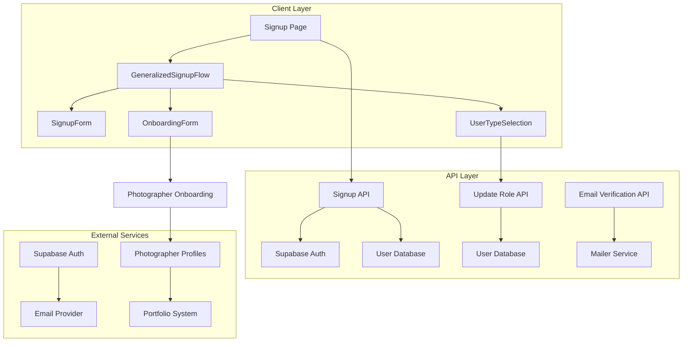
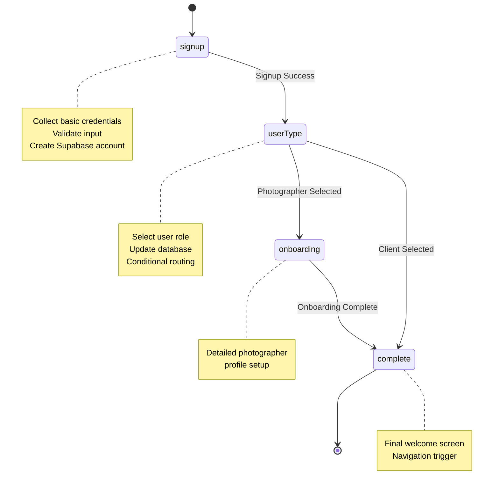
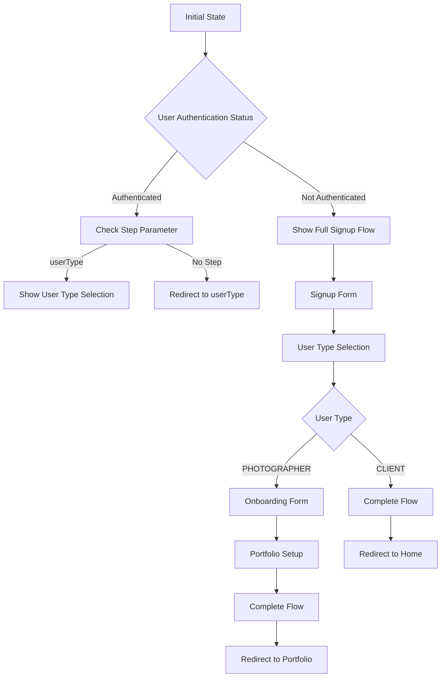
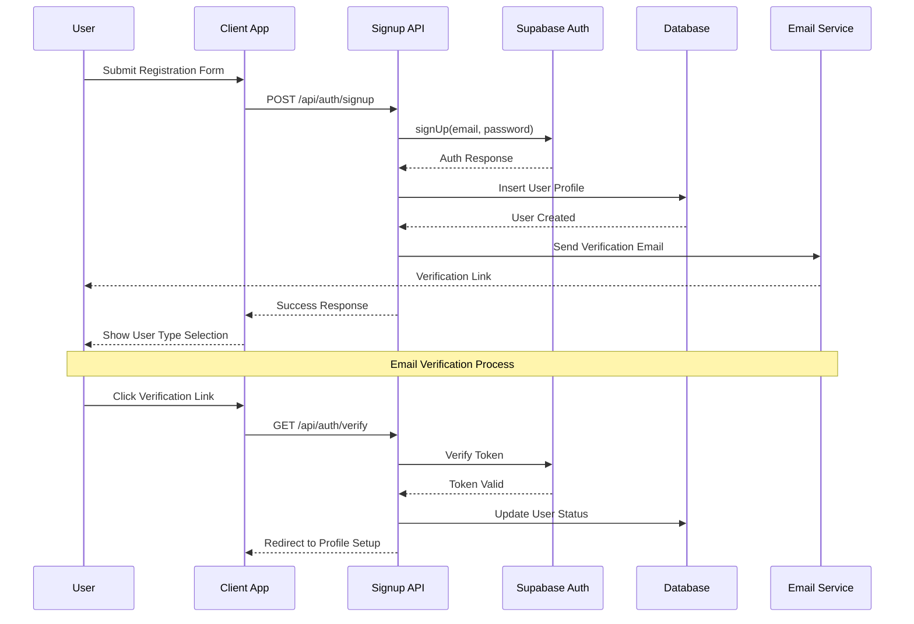
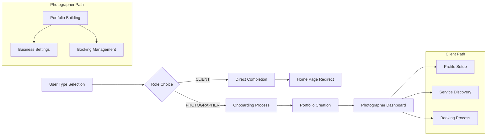
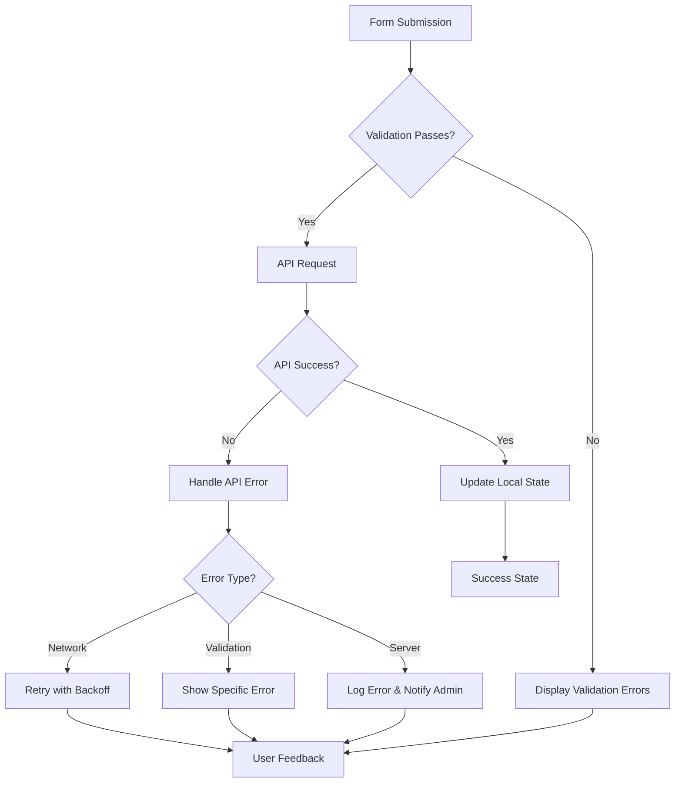
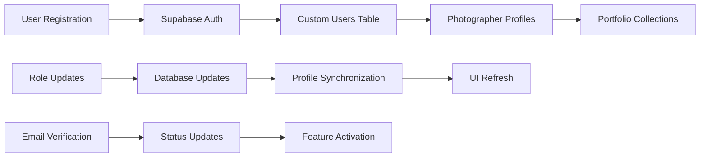
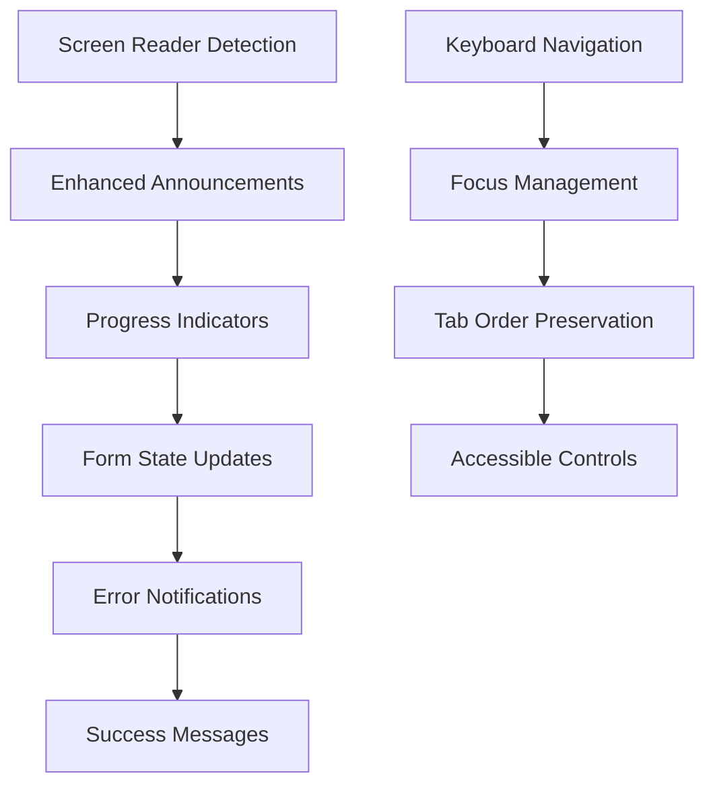

# Signup Flow

<cite>
**Referenced Files in This Document**
- [GeneralizedSignupFlow.tsx](file://src/components/GeneralizedSignupFlow.tsx)
- [SignupForm.tsx](file://src/components/SignupForm.tsx)
- [UserTypeSelection.tsx](file://src/components/UserTypeSelection.tsx)
- [OnboardingForm.tsx](file://src/components/OnboardingForm.tsx)
- [signup.tsx](file://pages/signup.tsx)
- [signup.ts](file://pages/api/auth/signup.ts)
- [update-role.ts](file://pages/api/auth/update-role.ts)
- [verify.ts](file://pages/api/auth/verify.ts)
- [supabase.ts](file://src/lib/supabase.ts)
- [mailer.ts](file://src/utils/mailer.ts)
</cite>

## Table of Contents
1. [Introduction](#introduction)
2. [System Architecture](#system-architecture)
3. [Core Components](#core-components)
4. [State Management](#state-management)
5. [Authentication Flow](#authentication-flow)
6. [Role-Based Navigation](#role-based-navigation)
7. [Validation and Error Handling](#validation-and-error-handling)
8. [Integration with Supabase](#integration-with-supabase)
9. [Accessibility Features](#accessibility-features)
10. [Common Issues and Solutions](#common-issues-and-solutions)
11. [Extending the Flow](#extending-the-flow)
12. [Conclusion](#conclusion)

## Introduction

The SnapEvent signup flow is a sophisticated multi-step user registration system designed to accommodate two distinct user types: clients seeking photography services and photographers offering their services. Built with React and TypeScript, this flow leverages a state machine pattern to manage complex user journeys while maintaining seamless transitions between different registration stages.

The system integrates deeply with Supabase authentication and database services, providing robust email verification workflows, role-based user management, and personalized onboarding experiences. The architecture emphasizes accessibility, performance, and extensibility, making it suitable for diverse user needs and future enhancements.

## System Architecture

The signup flow follows a modular architecture with clear separation of concerns across multiple layers:



**Diagram sources**
- [GeneralizedSignupFlow.tsx](file://src/components/GeneralizedSignupFlow.tsx#L1-L192)
- [signup.tsx](file://pages/signup.tsx#L1-L110)
- [signup.ts](file://pages/api/auth/signup.ts#L1-L80)

The architecture implements a client-server model with progressive enhancement, where the client-side components handle user interactions and state management, while the server-side APIs manage authentication, data persistence, and external integrations.

**Section sources**
- [GeneralizedSignupFlow.tsx](file://src/components/GeneralizedSignupFlow.tsx#L1-L192)
- [signup.tsx](file://pages/signup.tsx#L1-L110)

## Core Components

### GeneralizedSignupFlow Component

The `GeneralizedSignupFlow` serves as the orchestrator for the entire registration process, managing state transitions and coordinating between different form components.

```typescript
type SignupStep = 'signup' | 'userType' | 'onboarding' | 'complete';

interface GeneralizedSignupFlowProps {
  onComplete: (userType: 'CLIENT' | 'PHOTOGRAPHER') => void;
  onBack: () => void;
}
```

The component maintains three primary state variables:
- `currentStep`: Tracks the current stage of the registration flow
- `userType`: Stores the user's selected role (CLIENT or PHOTOGRAPHER)
- `userData`: Preserves form data across steps for partial submissions



**Diagram sources**
- [GeneralizedSignupFlow.tsx](file://src/components/GeneralizedSignupFlow.tsx#L10-L192)

### SignupForm Component

The `SignupForm` handles credential collection with comprehensive validation and real-time feedback:

```typescript
interface SignupFormProps {
  onSignupSuccess: () => void;
  onBack: () => void;
}

interface FormData {
  firstName: string;
  lastName: string;
  email: string;
  phone: string;
  password: string;
  confirmPassword: string;
}
```

The form implements multi-layer validation:
1. **Client-side validation** for immediate feedback
2. **Server-side validation** through API endpoints
3. **Duplicate detection** to prevent account creation conflicts

**Section sources**
- [SignupForm.tsx](file://src/components/SignupForm.tsx#L1-L294)
- [GeneralizedSignupFlow.tsx](file://src/components/GeneralizedSignupFlow.tsx#L10-L20)

### UserTypeSelection Component

This component provides an intuitive interface for users to choose between client and photographer roles:

```typescript
interface UserTypeSelectionProps {
  onUserTypeSelect: (userType: 'CLIENT' | 'PHOTOGRAPHER') => void;
  onBack: () => void;
}
```

The component features:
- **Visual differentiation** between client and photographer options
- **Interactive cards** with hover effects and animations
- **Progressive disclosure** of benefits for each role
- **Responsive design** supporting mobile and desktop interfaces

**Section sources**
- [UserTypeSelection.tsx](file://src/components/UserTypeSelection.tsx#L1-L188)

### OnboardingForm Component

Designed specifically for photographers, this multi-step form collects detailed professional information:

```typescript
interface OnboardingFormProps {
  onNavigate: (page: 'landing' | 'onboarding' | 'portfolio', photographerId?: string) => void;
  isEditMode?: boolean;
}

interface FormData {
  fullName: string;
  phoneNumber: string;
  email: string;
  location: string;
  cameraManufacturer: string;
  cameraModel: string;
  lenses: string;
  photographerType: string;
  experience: string;
  photoTypes: string[];
  additionalServices: string[];
  startingPrice: string;
  language: string;
}
```

The form includes advanced features:
- **Bilingual support** (English and Telugu)
- **Dynamic validation** with real-time error messaging
- **File upload capabilities** for portfolio samples
- **Progress tracking** with visual indicators

**Section sources**
- [OnboardingForm.tsx](file://src/components/OnboardingForm.tsx#L1-L933)

## State Management

The signup flow employs a sophisticated state management approach using React's built-in hooks combined with custom state machines:



**Diagram sources**
- [GeneralizedSignupFlow.tsx](file://src/components/GeneralizedSignupFlow.tsx#L15-L40)
- [signup.tsx](file://pages/signup.tsx#L35-L88)

The state machine ensures:
- **Atomic state transitions** preventing inconsistent UI states
- **Partial data preservation** allowing users to resume interrupted flows
- **Error recovery** mechanisms for failed operations
- **Memory efficiency** through controlled state updates

**Section sources**
- [GeneralizedSignupFlow.tsx](file://src/components/GeneralizedSignupFlow.tsx#L15-L40)
- [signup.tsx](file://pages/signup.tsx#L25-L110)

## Authentication Flow

The authentication process integrates seamlessly with Supabase Auth, providing secure user registration with email verification:



**Diagram sources**
- [signup.ts](file://pages/api/auth/signup.ts#L1-L80)
- [verify.ts](file://pages/api/auth/verify.ts#L1-L65)
- [mailer.ts](file://src/utils/mailer.ts#L1-L39)

The authentication flow includes several safety mechanisms:
- **Token-based verification** with configurable expiration
- **Duplicate prevention** through Supabase unique constraints
- **Graceful degradation** when external services fail
- **Session persistence** across browser sessions

**Section sources**
- [signup.ts](file://pages/api/auth/signup.ts#L1-L80)
- [verify.ts](file://pages/api/auth/verify.ts#L1-L65)
- [mailer.ts](file://src/utils/mailer.ts#L1-L39)

## Role-Based Navigation

The system implements intelligent routing based on user role selection, ensuring appropriate onboarding experiences:



**Diagram sources**
- [GeneralizedSignupFlow.tsx](file://src/components/GeneralizedSignupFlow.tsx#L30-L50)
- [signup.tsx](file://pages/signup.tsx#L35-L50)

The role-based navigation system:
- **Preserves user context** across different application sections
- **Provides role-appropriate guidance** and expectations
- **Maintains data consistency** across user profiles
- **Supports role upgrades** for existing users

**Section sources**
- [GeneralizedSignupFlow.tsx](file://src/components/GeneralizedSignupFlow.tsx#L30-L50)
- [signup.tsx](file://pages/signup.tsx#L35-L50)

## Validation and Error Handling

The signup flow implements comprehensive validation and error handling strategies:

### Client-Side Validation

```typescript
const validateForm = () => {
  if (!formData.firstName.trim()) {
    setError('First name is required');
    return false;
  }
  if (!/\S+@\S+\.\S+/.test(formData.email)) {
    setError('Please enter a valid email address');
    return false;
  }
  if (formData.password !== formData.confirmPassword) {
    setError('Passwords do not match');
    return false;
  }
  return true;
};
```

### Server-Side Validation

The backend APIs enforce additional validation rules:
- **Email format validation** using RFC standards
- **Password strength requirements** (minimum 6 characters)
- **Unique constraint enforcement** for emails and usernames
- **Rate limiting** to prevent abuse

### Error Recovery Mechanisms



**Diagram sources**
- [SignupForm.tsx](file://src/components/SignupForm.tsx#L40-L70)
- [signup.ts](file://pages/api/auth/signup.ts#L15-L35)

The error handling system provides:
- **Clear error messages** with actionable guidance
- **Persistent error states** until resolved
- **Graceful fallbacks** for failed operations
- **Comprehensive logging** for debugging and monitoring

**Section sources**
- [SignupForm.tsx](file://src/components/SignupForm.tsx#L40-L70)
- [signup.ts](file://pages/api/auth/signup.ts#L15-L35)

## Integration with Supabase

The signup flow leverages Supabase for authentication, database operations, and real-time capabilities:

### Database Schema Integration

```typescript
export type Database = {
  public: {
    Tables: {
      users: {
        Row: {
          id: string;
          email: string;
          first_name: string;
          last_name: string;
          phone: string | null;
          role: 'CLIENT' | 'PHOTOGRAPHER' | 'ADMIN';
          is_active: boolean;
          created_at: string;
          updated_at: string;
        };
      };
    };
  };
};
```

### Authentication Workflow

The integration with Supabase provides:
- **Secure authentication** with JWT tokens
- **Automatic session management** across browser sessions
- **Real-time database synchronization** for profile updates
- **Email verification** with customizable templates
- **Social login integration** support for future enhancements

### Data Persistence Strategies



**Diagram sources**
- [supabase.ts](file://src/lib/supabase.ts#L1-L242)
- [signup.ts](file://pages/api/auth/signup.ts#L25-L45)

**Section sources**
- [supabase.ts](file://src/lib/supabase.ts#L1-L242)
- [signup.ts](file://pages/api/auth/signup.ts#L25-L45)

## Accessibility Features

The signup flow incorporates comprehensive accessibility features to ensure usability for all users:

### Focus Management

```typescript
const handleBack = () => {
  switch (currentStep) {
    case 'userType':
      setCurrentStep('signup');
      break;
    case 'onboarding':
      setCurrentStep('userType');
      break;
    default:
      onBack();
  }
};
```

### ARIA Labels and Roles

Each interactive element includes appropriate ARIA attributes:
- **Landmark regions** for major sections
- **Descriptive labels** for form controls
- **Live regions** for validation messages
- **Keyboard navigation** support throughout

### Visual Accessibility

The component implements:
- **High contrast color schemes** for readability
- **Scalable typography** supporting zoom functionality
- **Motion reduction** options for sensitive users
- **Color independence** for users with color vision deficiencies

### Screen Reader Support



**Diagram sources**
- [SignupForm.tsx](file://src/components/SignupForm.tsx#L150-L200)
- [UserTypeSelection.tsx](file://src/components/UserTypeSelection.tsx#L100-L150)

**Section sources**
- [SignupForm.tsx](file://src/components/SignupForm.tsx#L150-L200)
- [UserTypeSelection.tsx](file://src/components/UserTypeSelection.tsx#L100-L150)

## Common Issues and Solutions

### Email Verification Token Expiration

**Problem**: Verification links become invalid after token expiration.

**Solution**: 
```typescript
const TOKEN_TTL_MINUTES = 30;

const verifyToken = (token: string) => {
  const secret = process.env.NEXTAUTH_SECRET || 'dev-secret';
  return jwt.verify(token, secret) as any;
};
```

**Prevention**: Implement token refresh mechanisms and provide clear error messaging.

### Duplicate Account Creation

**Problem**: Users attempting to create accounts with existing emails.

**Solution**: 
```typescript
try {
  const response = await supabase.auth.signUp({
    email,
    password,
    options: {
      data: {
        first_name: firstName,
        last_name: lastName,
        phone: phone
      }
    }
  });
  
  if (authError) {
    // Handle duplicate email errors
    if (authError.message.includes('already registered')) {
      return res.status(409).json({ error: 'Account already exists' });
    }
  }
} catch (error) {
  // Cleanup failed auth user
  await supabase.auth.admin.deleteUser(authData.user.id);
  return res.status(400).json({ error: userError.message });
}
```

### Social Login Integration Challenges

**Problem**: Social login providers require additional configuration and error handling.

**Solution**: Implement provider-specific error handling and fallback mechanisms:
```typescript
const handleSocialLogin = async (provider: 'google' | 'facebook') => {
  try {
    const { data, error } = await supabase.auth.signInWithOAuth({
      provider,
      options: {
        redirectTo: `${process.env.NEXT_PUBLIC_APP_URL}/auth/callback`
      }
    });
    
    if (error) throw error;
    // Handle successful login
  } catch (error) {
    // Handle OAuth errors gracefully
    console.error('Social login error:', error);
    // Show user-friendly error message
  }
};
```

### Performance Optimization

**Problem**: Slow form loading and validation delays.

**Solutions**:
1. **Code splitting** for lazy loading of heavy components
2. **Debounced validation** to reduce API calls
3. **Optimistic UI updates** for better perceived performance
4. **Caching strategies** for frequently accessed data

**Section sources**
- [verify.ts](file://pages/api/auth/verify.ts#L1-L65)
- [signup.ts](file://pages/api/auth/signup.ts#L15-L45)

## Extending the Flow

### Adding New Identity Providers

To integrate additional social login providers:

```typescript
// Add provider configuration
const supportedProviders = ['google', 'facebook', 'twitter'];

// Update authentication handlers
const handleProviderSignIn = async (provider: string) => {
  try {
    await supabase.auth.signInWithOAuth({
      provider,
      options: {
        redirectTo: `${process.env.NEXT_PUBLIC_APP_URL}/auth/callback`
      }
    });
  } catch (error) {
    console.error(`Failed to sign in with ${provider}:`, error);
  }
};
```

### Custom Registration Fields

To add new form fields:

```typescript
interface ExtendedFormData extends FormData {
  dateOfBirth: string;
  referralSource: string;
  newsletterConsent: boolean;
}

const handleExtendedFieldChange = (field: string, value: any) => {
  setFormData(prev => ({
    ...prev,
    [field]: value
  }));
};

// Add validation for new fields
const validateExtendedFields = () => {
  if (formData.dateOfBirth && !isValidDate(formData.dateOfBirth)) {
    setError('Please enter a valid date of birth');
    return false;
  }
  return true;
};
```

### Multi-Language Support Enhancement

To expand language support:

```typescript
const supportedLanguages = ['en', 'te', 'hi', 'fr'] as const;
type SupportedLanguage = typeof supportedLanguages[number];

interface TranslatedContent {
  [key: string]: {
    [lang in SupportedLanguage]: string;
  };
}

const translateContent = (key: string, lang: SupportedLanguage) => {
  return translations[key][lang];
};
```

### Advanced Onboarding Features

For enhanced photographer onboarding:

```typescript
interface EnhancedOnboardingData extends FormData {
  videoPortfolio: string;
  virtualTour: string;
  clientTestimonials: string[];
  certificationDocuments: File[];
}

const handleAdvancedOnboarding = async (data: EnhancedOnboardingData) => {
  // Handle file uploads
  const portfolioUrls = await uploadFiles(data.workSamples);
  
  // Create enhanced profile
  const enhancedProfile = {
    ...data,
    portfolioUrls,
    videoPortfolio: data.videoPortfolio,
    virtualTour: data.virtualTour
  };
  
  // Submit to backend
  await submitEnhancedProfile(enhancedProfile);
};
```

## Conclusion

The SnapEvent signup flow represents a sophisticated, user-centric approach to multi-step user registration. By leveraging modern React patterns, comprehensive validation, and seamless Supabase integration, the system provides an exceptional user experience while maintaining robust security and scalability.

Key strengths of the implementation include:

- **Modular architecture** enabling easy maintenance and extension
- **Role-based personalization** ensuring appropriate user experiences
- **Comprehensive accessibility** compliance across all interaction modes
- **Robust error handling** with graceful degradation scenarios
- **Performance optimization** through strategic code splitting and caching

The system's extensibility allows for future enhancements such as additional identity providers, custom registration fields, and advanced onboarding workflows. The clear separation of concerns and well-defined interfaces facilitate team collaboration and long-term maintainability.

Future development opportunities include expanding social login capabilities, implementing AI-powered recommendation systems during onboarding, and enhancing the multi-language support for global deployment. The foundation provided by this signup flow enables rapid iteration and feature expansion while maintaining the high standards of user experience and system reliability.