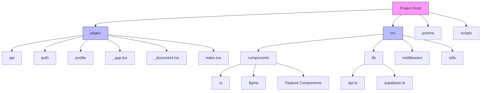
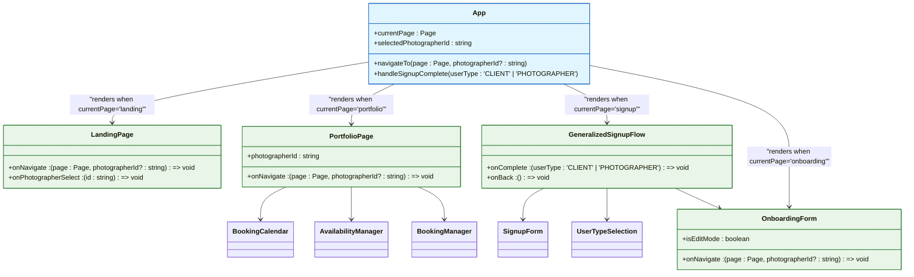
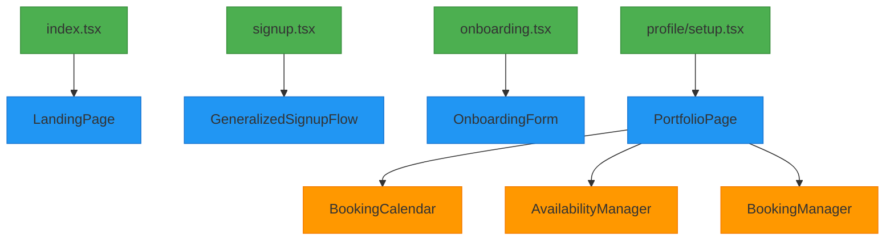
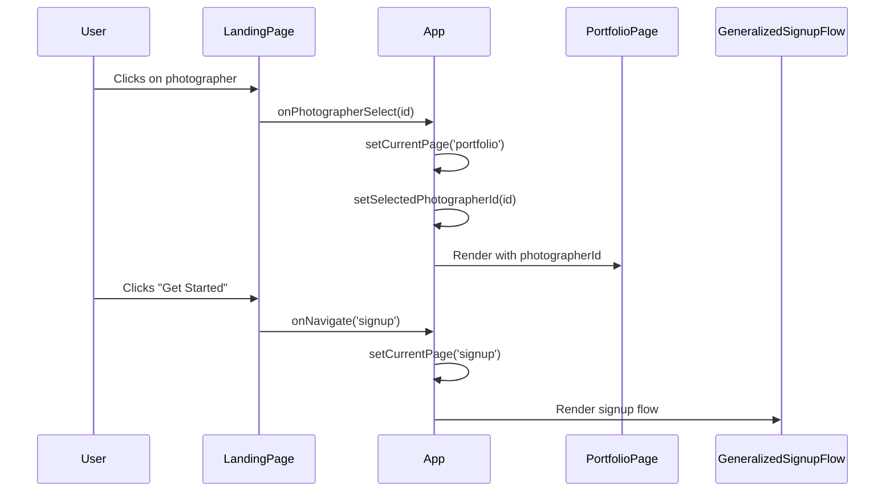
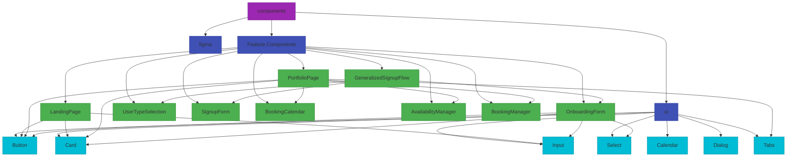
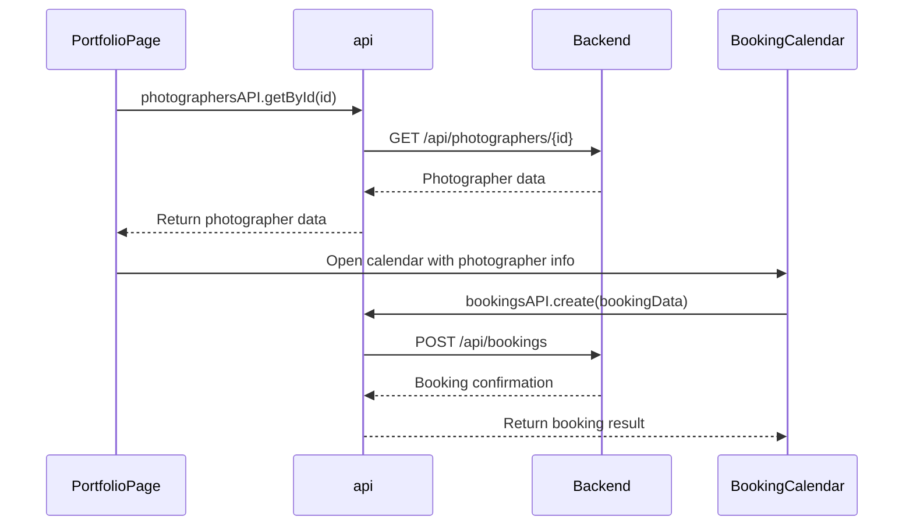

# Frontend Architecture

<cite>
**Referenced Files in This Document**   
- [App.tsx](file://src/App.tsx)
- [LandingPage.tsx](file://src/components/LandingPage.tsx)
- [PortfolioPage.tsx](file://src/components/PortfolioPage.tsx)
- [OnboardingForm.tsx](file://src/components/OnboardingForm.tsx)
- [GeneralizedSignupFlow.tsx](file://src/components/GeneralizedSignupFlow.tsx)
- [UserTypeSelection.tsx](file://src/components/UserTypeSelection.tsx)
- [SignupForm.tsx](file://src/components/SignupForm.tsx)
- [BookingCalendar.tsx](file://src/components/BookingCalendar.tsx)
- [AvailabilityManager.tsx](file://src/components/AvailabilityManager.tsx)
- [BookingManager.tsx](file://src/components/BookingManager.tsx)
- [api.ts](file://src/lib/api.ts)
- [_app.tsx](file://pages/_app.tsx)
</cite>

## Table of Contents
1. [Introduction](#introduction)
2. [Project Structure](#project-structure)
3. [Component Hierarchy](#component-hierarchy)
4. [Next.js Routing System](#nextjs-routing-system)
5. [State Management and Navigation](#state-management-and-navigation)
6. [UI Component Organization](#ui-component-organization)
7. [API Integration and Business Logic](#api-integration-and-business-logic)
8. [Responsive Design and Accessibility](#responsive-design-and-accessibility)
9. [Conclusion](#conclusion)

## Introduction

The SnapEvent frontend architecture is built on React with Next.js, implementing a component-based design pattern that separates concerns between presentation, business logic, and data management. The application features a dynamic single-page interface with multiple views managed through client-side state rather than traditional page navigation. The architecture centers around the App.tsx component as the root container, which orchestrates the display of different pages based on user interactions and application state.

The system leverages modern React patterns including hooks for state management, custom hooks for API interactions, and a comprehensive UI component library built with Radix UI primitives. The design emphasizes user experience with smooth transitions between views, responsive layouts that adapt to different screen sizes, and accessibility features throughout the interface.

**Section sources**
- [App.tsx](file://src/App.tsx#L1-L54)
- [LandingPage.tsx](file://src/components/LandingPage.tsx#L1-L844)

## Project Structure

The project follows a Next.js convention with a clear separation between pages and components. The `pages` directory contains the Next.js file-based routing configuration, with special files like `_app.tsx` and `_document.tsx` for application-level configuration. The `src` directory houses the majority of the application code, organized into logical subdirectories:

- `components`: Contains all React components, further organized into feature components and UI primitives
- `lib`: Houses utility functions and API service layers
- `middleware`: Contains authentication and validation middleware
- `utils`: Additional utility functions for specific domains like mail and portfolio management

The component organization follows a hybrid approach, with feature components at the top level of the components directory and reusable UI primitives organized within the `ui` subdirectory. This structure allows for easy discovery of major feature components while maintaining a clean separation of concerns for reusable elements.

**Diagram sources **
- [project_structure](#project_structure)

**Section sources**
- [project_structure](#project_structure)

## Component Hierarchy

The React component hierarchy is rooted in the App.tsx component, which serves as the main container for the application's different views. Unlike traditional multi-page applications, this implementation uses a single App component to manage the display of different pages through conditional rendering based on the currentPage state.

The component hierarchy flows from the root App component to major feature components including LandingPage, PortfolioPage, OnboardingForm, and GeneralizedSignupFlow. These top-level components are responsible for orchestrating their respective views and composing smaller, reusable components to build complete user interfaces.

**Diagram sources **
- [App.tsx](file://src/App.tsx#L1-L54)
- [LandingPage.tsx](file://src/components/LandingPage.tsx#L1-L844)
- [PortfolioPage.tsx](file://src/components/PortfolioPage.tsx#L1-L889)
- [GeneralizedSignupFlow.tsx](file://src/components/GeneralizedSignupFlow.tsx#L1-L192)
- [OnboardingForm.tsx](file://src/components/OnboardingForm.tsx#L1-L933)

**Section sources**
- [App.tsx](file://src/App.tsx#L1-L54)
- [LandingPage.tsx](file://src/components/LandingPage.tsx#L1-L844)
- [PortfolioPage.tsx](file://src/components/PortfolioPage.tsx#L1-L889)
- [GeneralizedSignupFlow.tsx](file://src/components/GeneralizedSignupFlow.tsx#L1-L192)
- [OnboardingForm.tsx](file://src/components/OnboardingForm.tsx#L1-L933)

## Next.js Routing System

The application implements Next.js file-based routing with a hybrid approach that combines traditional page routing with client-side view management. The `pages` directory contains the main entry points for the application, including index.tsx for the home page, signup.tsx, and onboarding.tsx. Special files like `_app.tsx` and `_document.tsx` provide application-level configuration and customization.

The `_app.tsx` file serves as a custom App component that wraps all pages and provides global styles and context. It imports the global CSS file and renders the Component prop, which represents the current page being displayed. This approach allows for consistent layout and styling across all pages while maintaining the benefits of Next.js's server-side rendering.

**Diagram sources **
- [index.tsx](file://pages/index.tsx)
- [signup.tsx](file://pages/signup.tsx)
- [onboarding.tsx](file://pages/onboarding.tsx)
- [profile/setup.tsx](file://pages/profile/setup.tsx)

**Section sources**
- [index.tsx](file://pages/index.tsx)
- [signup.tsx](file://pages/signup.tsx)
- [onboarding.tsx](file://pages/onboarding.tsx)
- [profile/setup.tsx](file://pages/profile/setup.tsx)
- [_app.tsx](file://pages/_app.tsx#L1-L7)

## State Management and Navigation

The application implements a centralized state management approach within the App component, which maintains the current page state and selected photographer ID. This state is managed using React's useState hook and is passed down to child components through props. The navigateTo function serves as the primary navigation mechanism, updating the currentPage state and optionally setting the selectedPhotographerId.

The state management pattern follows a unidirectional data flow, with state changes initiated by user interactions in child components and propagated up to the parent App component through callback functions. This approach ensures that the application state remains predictable and debuggable, as all state changes are centralized in a single location.

**Diagram sources **
- [App.tsx](file://src/App.tsx#L1-L54)
- [LandingPage.tsx](file://src/components/LandingPage.tsx#L1-L844)
- [PortfolioPage.tsx](file://src/components/PortfolioPage.tsx#L1-L889)

**Section sources**
- [App.tsx](file://src/App.tsx#L1-L54)
- [LandingPage.tsx](file://src/components/LandingPage.tsx#L1-L844)
- [PortfolioPage.tsx](file://src/components/PortfolioPage.tsx#L1-L889)

## UI Component Organization

The UI components are organized in the `src/components` directory with a clear distinction between feature components and reusable UI primitives. The `ui` subdirectory contains atomic components built with Radix UI primitives and Tailwind CSS, following the design system principles. These components include buttons, cards, inputs, and other interactive elements that maintain consistent styling and behavior throughout the application.

Feature components such as LandingPage, PortfolioPage, and OnboardingForm are located at the top level of the components directory and are responsible for composing the UI primitives into complete views. These components handle specific user journeys and coordinate interactions between multiple UI elements.

**Diagram sources **
- [components](file://src/components)
- [ui](file://src/components/ui)

**Section sources**
- [components](file://src/components)
- [ui](file://src/components/ui)

## API Integration and Business Logic

The application integrates with backend services through the `api.ts` file in the `src/lib` directory, which exports a service layer with typed functions for making HTTP requests. This service layer abstracts the API endpoints and provides type safety for request and response data. The API service includes functions for authentication, photographer management, and booking operations, with proper error handling and response parsing.

The business logic is distributed across components, with each feature component responsible for its specific domain logic. For example, the PortfolioPage component handles the logic for displaying photographer information and managing booking interactions, while the OnboardingForm component manages the multi-step form submission process.

**Diagram sources **
- [api.ts](file://src/lib/api.ts#L1-L261)
- [PortfolioPage.tsx](file://src/components/PortfolioPage.tsx#L1-L889)
- [BookingCalendar.tsx](file://src/components/BookingCalendar.tsx#L1-L384)

**Section sources**
- [api.ts](file://src/lib/api.ts#L1-L261)
- [PortfolioPage.tsx](file://src/components/PortfolioPage.tsx#L1-L889)
- [BookingCalendar.tsx](file://src/components/BookingCalendar.tsx#L1-L384)

## Responsive Design and Accessibility

The application implements responsive design principles using Tailwind CSS, with layout adjustments at various breakpoints to ensure optimal user experience across device sizes. The design uses a mobile-first approach, with the navigation pattern changing from a hamburger menu on mobile devices to a horizontal navigation bar on desktop screens.

Accessibility features are implemented throughout the interface, including proper semantic HTML elements, ARIA attributes, keyboard navigation support, and sufficient color contrast. Interactive elements include focus states and visual feedback for user actions. The application also uses framer-motion for smooth transitions and animations that enhance the user experience without compromising accessibility.

The responsive design is evident in components like the LandingPage, which adjusts its layout from a single-column mobile view to a multi-column desktop layout. Form elements and interactive components are sized appropriately for touch interaction on mobile devices, with adequate spacing between clickable elements.

**Section sources**
- [LandingPage.tsx](file://src/components/LandingPage.tsx#L1-L844)
- [PortfolioPage.tsx](file://src/components/PortfolioPage.tsx#L1-L889)
- [OnboardingForm.tsx](file://src/components/OnboardingForm.tsx#L1-L933)

## Conclusion

The SnapEvent frontend architecture demonstrates a well-structured React application built with Next.js, featuring a clear component hierarchy, effective state management, and a modular organization of UI elements. The application successfully combines server-side rendering with client-side interactivity, providing a seamless user experience across different views.

Key architectural strengths include the centralized state management in the App component, the clean separation between feature components and reusable UI primitives, and the typed API service layer that ensures type safety in data interactions. The implementation of Next.js file-based routing provides a solid foundation for SEO and performance, while the client-side view management enables smooth transitions between application states.

The component organization follows best practices with atomic UI elements in the `ui` directory and feature components at the top level, making the codebase maintainable and scalable. The integration of accessibility features and responsive design principles ensures the application is usable across different devices and accessible to users with various needs.

Overall, the architecture provides a solid foundation for the SnapEvent platform, balancing developer experience with end-user experience through thoughtful component design and state management patterns.