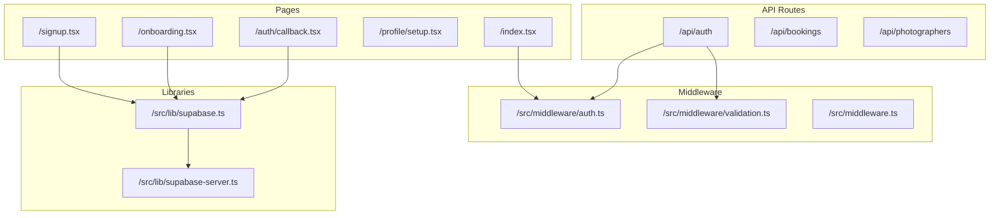
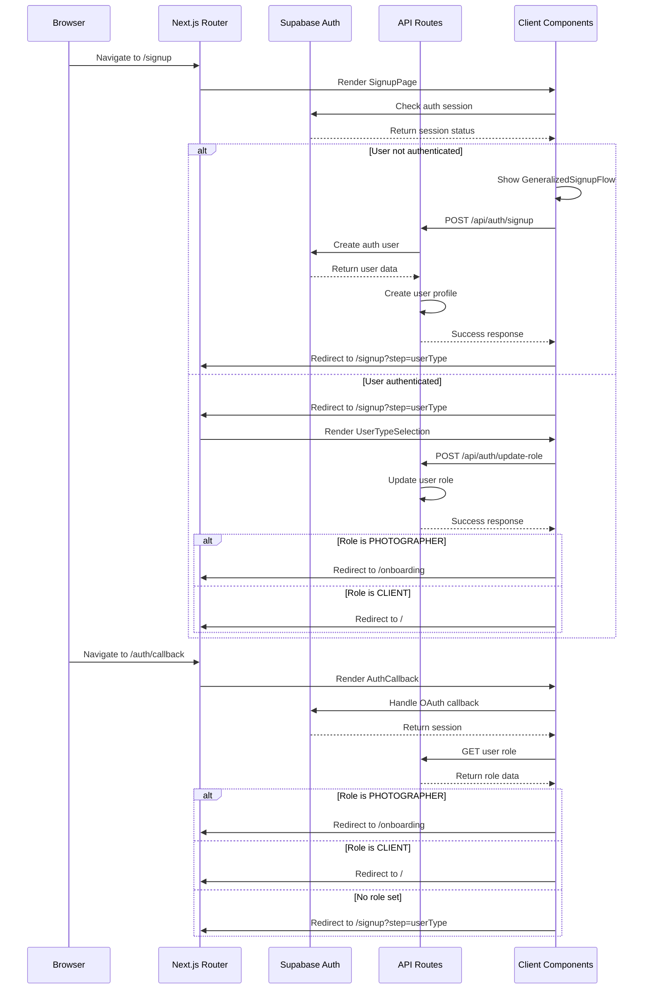
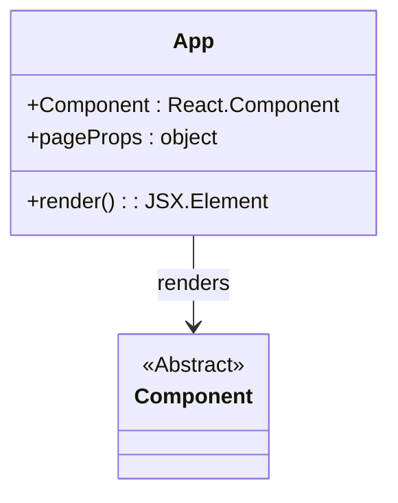
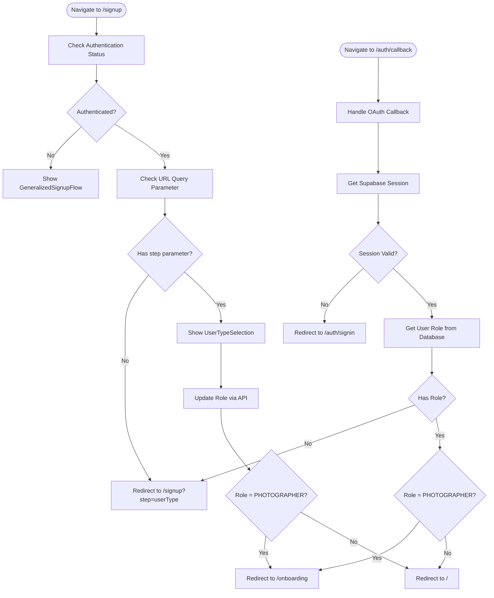
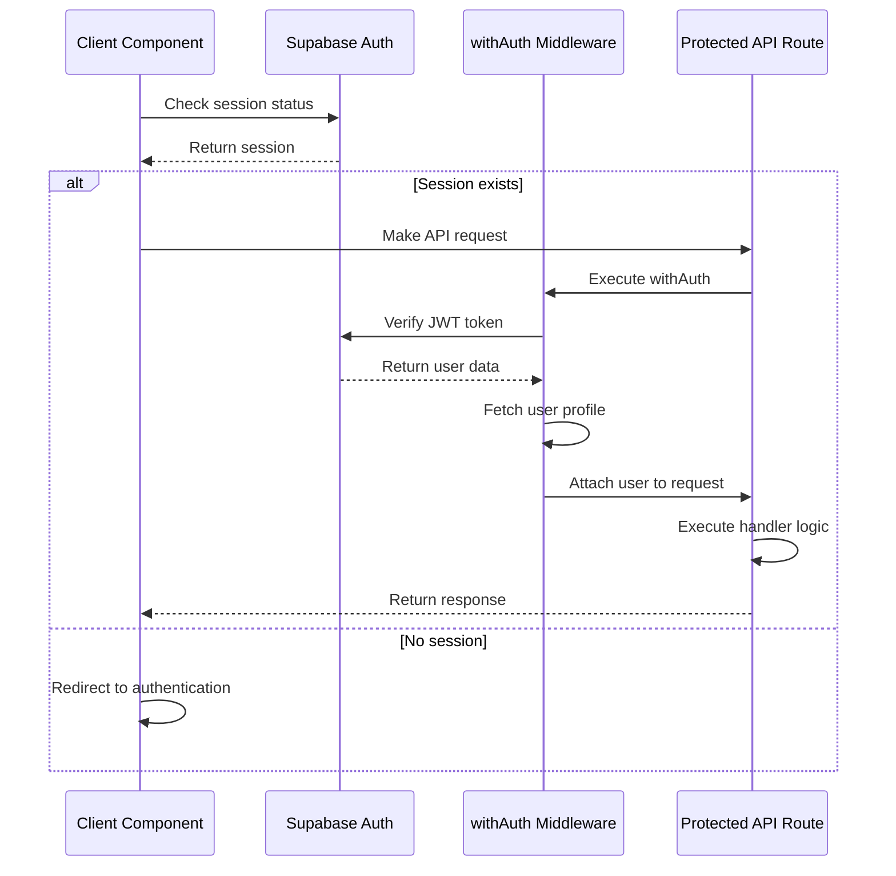
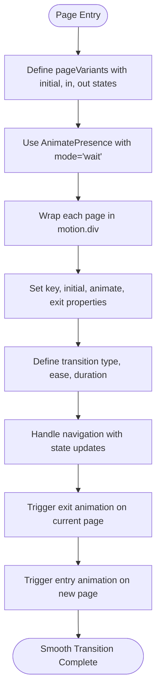
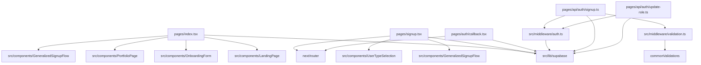

# Routing System

<cite>
**Referenced Files in This Document**   
- [pages/_app.tsx](file://pages/_app.tsx)
- [pages/index.tsx](file://pages/index.tsx)
- [pages/signup.tsx](file://pages/signup.tsx)
- [pages/onboarding.tsx](file://pages/onboarding.tsx)
- [pages/auth/callback.tsx](file://pages/auth/callback.tsx)
- [pages/profile/setup.tsx](file://pages/profile/setup.tsx)
- [src/middleware/auth.ts](file://src/middleware/auth.ts)
- [src/middleware/validation.ts](file://src/middleware/validation.ts)
- [src/middleware.ts](file://src/middleware.ts)
- [src/lib/supabase.ts](file://src/lib/supabase.ts)
- [src/lib/supabase-server.ts](file://src/lib/supabase-server.ts)
- [pages/api/auth/signin.ts](file://pages/api/auth/signin.ts)
- [pages/api/auth/signup.ts](file://pages/api/auth/signup.ts)
- [pages/api/auth/update-role.ts](file://pages/api/auth/update-role.ts)
</cite>

## Table of Contents
1. [Introduction](#introduction)
2. [Project Structure](#project-structure)
3. [Core Components](#core-components)
4. [Architecture Overview](#architecture-overview)
5. [Detailed Component Analysis](#detailed-component-analysis)
6. [Dependency Analysis](#dependency-analysis)
7. [Performance Considerations](#performance-considerations)
8. [Troubleshooting Guide](#troubleshooting-guide)
9. [Conclusion](#conclusion)

## Introduction
The SnapEvent application implements a comprehensive Next.js file-based routing system that manages user navigation, authentication flows, and role-based access control. This document details how the routing system works, including static and dynamic routes, authentication-aware navigation, protected routes, and client-side routing mechanisms. The system leverages Supabase for authentication and integrates with custom middleware for role-based access control.

## Project Structure

**Diagram sources**
- [pages/index.tsx](file://pages/index.tsx#L1-L115)
- [pages/signup.tsx](file://pages/signup.tsx#L1-L109)
- [pages/onboarding.tsx](file://pages/onboarding.tsx#L1-L24)
- [pages/auth/callback.tsx](file://pages/auth/callback.tsx#L1-L57)
- [src/middleware/auth.ts](file://src/middleware/auth.ts#L1-L95)
- [src/lib/supabase.ts](file://src/lib/supabase.ts#L1-L241)

**Section sources**
- [pages/index.tsx](file://pages/index.tsx#L1-L115)
- [pages/signup.tsx](file://pages/signup.tsx#L1-L109)
- [pages/onboarding.tsx](file://pages/onboarding.tsx#L1-L24)
- [pages/auth/callback.tsx](file://pages/auth/callback.tsx#L1-L57)

## Core Components

The routing system in SnapEvent is built on Next.js file-based routing conventions, where the `pages` directory structure directly maps to URL routes. Key components include static routes like `/signup` and `/onboarding`, dynamic authentication callbacks in `/auth/callback`, and API routes for authentication operations. The system implements role-based navigation where users are redirected based on their authentication state and role (client vs photographer). Client-side navigation is handled using the Next.js router with smooth transitions powered by Framer Motion.

**Section sources**
- [pages/index.tsx](file://pages/index.tsx#L1-L115)
- [pages/signup.tsx](file://pages/signup.tsx#L1-L109)
- [pages/onboarding.tsx](file://pages/onboarding.tsx#L1-L24)
- [pages/auth/callback.tsx](file://pages/auth/callback.tsx#L1-L57)

## Architecture Overview

**Diagram sources**
- [pages/signup.tsx](file://pages/signup.tsx#L1-L109)
- [pages/auth/callback.tsx](file://pages/auth/callback.tsx#L1-L57)
- [pages/api/auth/signup.ts](file://pages/api/auth/signup.ts#L1-L79)
- [pages/api/auth/update-role.ts](file://pages/api/auth/update-role.ts#L1-L48)
- [src/lib/supabase.ts](file://src/lib/supabase.ts#L1-L241)

## Detailed Component Analysis

### Static and Dynamic Routes

The application implements both static and dynamic routes through the Next.js file-based routing system. Static routes like `/signup`, `/onboarding`, and `/` are defined by corresponding files in the `pages` directory. The authentication callback route `/auth/callback` handles OAuth flows from Supabase, processing the authentication response and redirecting users based on their state. Dynamic API routes such as `/api/bookings/[id]` and `/api/photographers/[id]` enable parameterized endpoints for resource access.

**Section sources**
- [pages/signup.tsx](file://pages/signup.tsx#L1-L109)
- [pages/onboarding.tsx](file://pages/onboarding.tsx#L1-L24)
- [pages/auth/callback.tsx](file://pages/auth/callback.tsx#L1-L57)
- [pages/api/bookings/[id].ts](file://pages/api/bookings/[id].ts)
- [pages/api/photographers/[id].ts](file://pages/api/photographers/[id].ts)

### _app.tsx and Global Providers

The `_app.tsx` file serves as the root component that wraps all pages with global providers and layout components. It imports the global CSS and renders the active component with its page props. Unlike typical Next.js applications, this implementation does not include additional providers or context wrappers in `_app.tsx`, suggesting that authentication and state management are handled at the component level rather than globally.

**Diagram sources**
- [pages/_app.tsx](file://pages/_app.tsx#L1-L7)

**Section sources**
- [pages/_app.tsx](file://pages/_app.tsx#L1-L7)

### Authentication-Aware Routing Logic

The routing system implements sophisticated authentication-aware logic that redirects users based on their login state and role. The `signup.tsx` page checks authentication status on load and displays different content accordingly: unauthenticated users see the full signup flow, while authenticated users are directed to role selection. The `auth/callback.tsx` page handles post-authentication logic, checking the user's role in the database and redirecting to appropriate routes: photographers to `/onboarding`, clients to `/`, and users without roles to `/signup?step=userType`.

**Diagram sources**
- [pages/signup.tsx](file://pages/signup.tsx#L1-L109)
- [pages/auth/callback.tsx](file://pages/auth/callback.tsx#L1-L57)
- [pages/api/auth/update-role.ts](file://pages/api/auth/update-role.ts#L1-L48)

**Section sources**
- [pages/signup.tsx](file://pages/signup.tsx#L1-L109)
- [pages/auth/callback.tsx](file://pages/auth/callback.tsx#L1-L57)

### Protected Routes Implementation

Protected routes are implemented using a combination of client-side checks and server-side middleware. The `withAuth` middleware in `src/middleware/auth.ts` verifies JWT tokens from Supabase and enriches requests with user data. API routes use this middleware to protect endpoints, while client components perform session checks using `supabase.auth.getSession()`. The system also implements role-based access control through `withRole` and `withRoles` middleware functions that restrict access based on user roles.

**Diagram sources**
- [src/middleware/auth.ts](file://src/middleware/auth.ts#L1-L95)
- [src/lib/supabase.ts](file://src/lib/supabase.ts#L1-L241)
- [pages/api/auth/update-role.ts](file://pages/api/auth/update-role.ts#L1-L48)

**Section sources**
- [src/middleware/auth.ts](file://src/middleware/auth.ts#L1-L95)
- [src/lib/supabase.ts](file://src/lib/supabase.ts#L1-L241)

### Client-Side Navigation and Transitions

Client-side navigation is implemented using the Next.js router with enhanced user experience features. The `index.tsx` page uses React state to manage in-page navigation between different views (landing, onboarding, portfolio, signup) with smooth transitions powered by Framer Motion's `AnimatePresence` and `motion.div` components. The application implements page transition animations with defined variants for entry, active, and exit states, creating a seamless user experience during navigation.

**Diagram sources**
- [pages/index.tsx](file://pages/index.tsx#L1-L115)
- [ANIMATIONS_SUMMARY.md](file://ANIMATIONS_SUMMARY.md#L232-L283)

**Section sources**
- [pages/index.tsx](file://pages/index.tsx#L1-L115)

## Dependency Analysis

**Diagram sources**
- [pages/index.tsx](file://pages/index.tsx#L1-L115)
- [pages/signup.tsx](file://pages/signup.tsx#L1-L109)
- [pages/auth/callback.tsx](file://pages/auth/callback.tsx#L1-L57)
- [src/middleware/auth.ts](file://src/middleware/auth.ts#L1-L95)
- [src/middleware/validation.ts](file://src/middleware/validation.ts#L1-L160)
- [pages/api/auth/signup.ts](file://pages/api/auth/signup.ts#L1-L79)
- [pages/api/auth/update-role.ts](file://pages/api/auth/update-role.ts#L1-L48)
- [src/lib/supabase.ts](file://src/lib/supabase.ts#L1-L241)

**Section sources**
- [pages/index.tsx](file://pages/index.tsx#L1-L115)
- [pages/signup.tsx](file://pages/signup.tsx#L1-L109)
- [pages/auth/callback.tsx](file://pages/auth/callback.tsx#L1-L57)
- [src/middleware/auth.ts](file://src/middleware/auth.ts#L1-L95)
- [src/middleware/validation.ts](file://src/middleware/validation.ts#L1-L160)

## Performance Considerations

The routing system implements several performance optimizations. Components are lazily loaded using Next.js `dynamic` imports to reduce initial bundle size, particularly for complex components like `GeneralizedSignupFlow` and `PortfolioPage`. The authentication state is checked efficiently using `useEffect` with proper dependency arrays to prevent unnecessary re-execution. API routes are optimized with middleware composition, allowing validation and authentication checks to be applied consistently without code duplication. The client-side routing in `index.tsx` uses in-memory state management rather than full page reloads, creating a SPA-like experience with smooth transitions.

**Section sources**
- [pages/signup.tsx](file://pages/signup.tsx#L1-L109)
- [pages/onboarding.tsx](file://pages/onboarding.tsx#L1-L24)
- [pages/profile/setup.tsx](file://pages/profile/setup.tsx#L1-L20)
- [src/middleware/validation.ts](file://src/middleware/validation.ts#L1-L160)

## Troubleshooting Guide

Common routing issues in the SnapEvent application typically involve authentication state mismatches, incorrect redirects, or middleware configuration problems. When users experience unexpected redirects, check the authentication state and role in the database. For issues with the signup flow, verify that the `emailRedirectTo` parameter in the Supabase signup configuration points to the correct callback URL. If protected routes are accessible without authentication, ensure the `withAuth` middleware is properly applied to the API routes. For client-side navigation issues, confirm that the Next.js router is correctly imported and used with proper asynchronous handling.

**Section sources**
- [pages/auth/callback.tsx](file://pages/auth/callback.tsx#L1-L57)
- [pages/api/auth/signup.ts](file://pages/api/auth/signup.ts#L1-L79)
- [src/middleware/auth.ts](file://src/middleware/auth.ts#L1-L95)
- [src/lib/supabase.ts](file://src/lib/supabase.ts#L1-L241)

## Conclusion

The SnapEvent application implements a robust Next.js routing system that effectively handles both static and dynamic routes, authentication flows, and role-based access control. The system leverages file-based routing conventions with strategic use of client-side and server-side components to create a seamless user experience. Authentication-aware routing logic ensures users are directed to appropriate destinations based on their login state and role, while middleware components provide consistent protection for API routes. The implementation demonstrates best practices in modern web application routing, balancing functionality, security, and user experience.