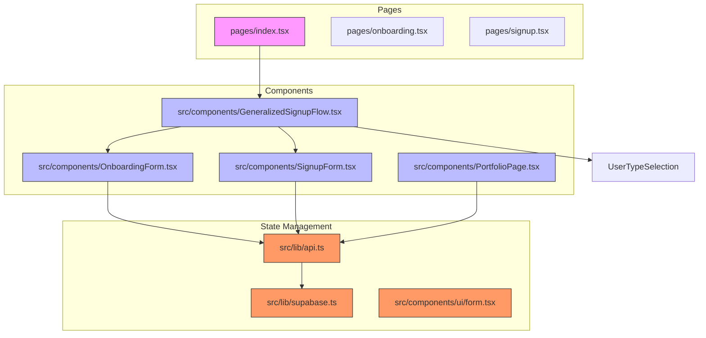
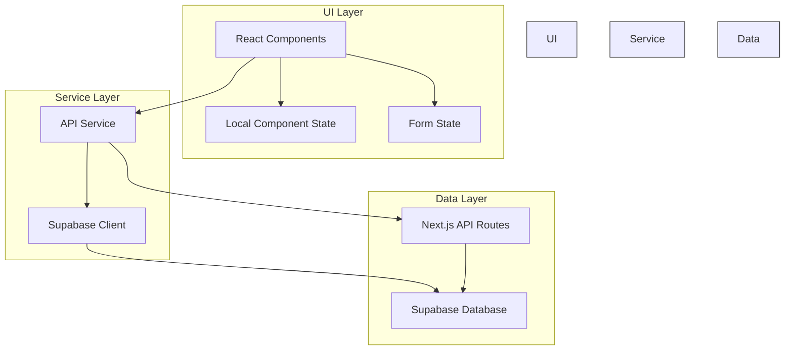
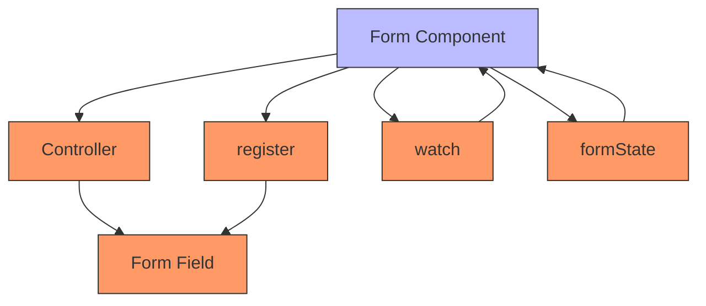
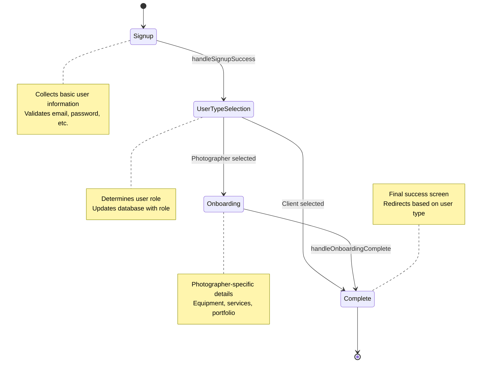
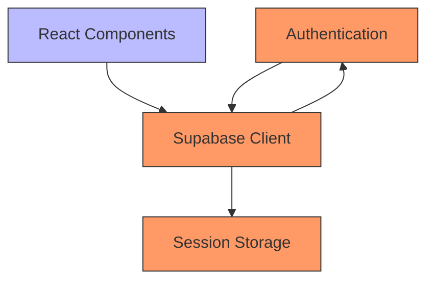
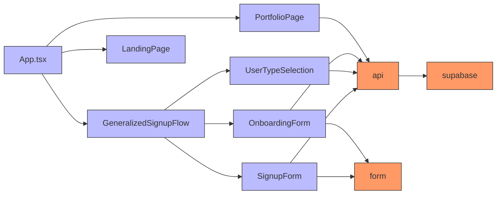

# State Management

<cite>
**Referenced Files in This Document**   
- [App.tsx](file://src/App.tsx)
- [GeneralizedSignupFlow.tsx](file://src/components/GeneralizedSignupFlow.tsx)
- [OnboardingForm.tsx](file://src/components/OnboardingForm.tsx)
- [SignupForm.tsx](file://src/components/SignupForm.tsx)
- [LandingPage.tsx](file://src/components/LandingPage.tsx)
- [PortfolioPage.tsx](file://src/components/PortfolioPage.tsx)
- [api.ts](file://src/lib/api.ts)
- [supabase.ts](file://src/lib/supabase.ts)
- [form.tsx](file://src/components/ui/form.tsx)
</cite>

## Table of Contents
1. [Introduction](#introduction)
2. [Project Structure](#project-structure)
3. [Core Components](#core-components)
4. [Architecture Overview](#architecture-overview)
5. [Detailed Component Analysis](#detailed-component-analysis)
6. [Dependency Analysis](#dependency-analysis)
7. [Performance Considerations](#performance-considerations)
8. [Troubleshooting Guide](#troubleshooting-guide)
9. [Conclusion](#conclusion)

## Introduction
This document provides comprehensive architectural documentation for the state management patterns used throughout the SnapEvent frontend application. The system implements a multi-layered state management approach combining React's built-in hooks, form-specific libraries, and external authentication services to create a seamless user experience across various user journeys including signup, onboarding, and portfolio management.

The application follows a client-side state management strategy with distinct patterns for different types of state: local component state for UI interactions, form state for data collection, and global authentication state for user sessions. The architecture is designed to support multi-step user flows while maintaining data consistency and providing appropriate feedback throughout the user journey.

## Project Structure
The SnapEvent application follows a component-based architecture with a clear separation of concerns between UI components, state management, and API integration. The project structure organizes components by feature and utility, with specific directories for different types of functionality.

The `src/components` directory contains all UI components, organized into subdirectories for reusable UI elements (`ui`), Figma-generated components (`figma`), and major application features. The `src/lib` directory houses shared utilities including API clients and Supabase integration. The `pages` directory follows Next.js conventions with API routes and page components.

This structure supports the state management patterns by isolating stateful components and their associated logic while providing shared services for authentication and data persistence.

**Diagram sources**
- [App.tsx](file://src/App.tsx)
- [GeneralizedSignupFlow.tsx](file://src/components/GeneralizedSignupFlow.tsx)
- [OnboardingForm.tsx](file://src/components/OnboardingForm.tsx)
- [SignupForm.tsx](file://src/components/SignupForm.tsx)
- [PortfolioPage.tsx](file://src/components/PortfolioPage.tsx)
- [api.ts](file://src/lib/api.ts)
- [supabase.ts](file://src/lib/supabase.ts)

**Section sources**
- [App.tsx](file://src/App.tsx)
- [GeneralizedSignupFlow.tsx](file://src/components/GeneralizedSignupFlow.tsx)
- [OnboardingForm.tsx](file://src/components/OnboardingForm.tsx)
- [SignupForm.tsx](file://src/components/SignupForm.tsx)
- [LandingPage.tsx](file://src/components/LandingPage.tsx)
- [PortfolioPage.tsx](file://src/components/PortfolioPage.tsx)

## Core Components
The SnapEvent application's state management revolves around several core components that handle user registration, onboarding, and profile management. These components work together to guide users through a multi-step process of creating an account and setting up their profile, with different flows for clients and photographers.

The `GeneralizedSignupFlow` component orchestrates the entire registration process, managing state transitions between signup, user type selection, and onboarding steps. It uses React's `useState` hook to track the current step in the flow and coordinate data passing between stages. The `SignupForm` component handles initial user registration with local state management for form fields and validation.

For photographers, the `OnboardingForm` component manages a complex multi-step form with extensive state requirements, including personal information, equipment details, and service offerings. The `PortfolioPage` component manages state for displaying photographer profiles and handling booking interactions.

**Section sources**
- [App.tsx](file://src/App.tsx#L1-L55)
- [GeneralizedSignupFlow.tsx](file://src/components/GeneralizedSignupFlow.tsx#L1-L192)
- [OnboardingForm.tsx](file://src/components/OnboardingForm.tsx#L1-L933)
- [SignupForm.tsx](file://src/components/SignupForm.tsx#L1-L294)
- [PortfolioPage.tsx](file://src/components/PortfolioPage.tsx#L1-L889)

## Architecture Overview
The state management architecture in SnapEvent follows a layered approach that combines React's built-in state management with specialized libraries for form handling and external services for authentication. This architecture supports the application's complex user flows while maintaining separation of concerns and code maintainability.

At the component level, React's `useState` hook manages local state for UI interactions such as form inputs, navigation steps, and loading states. For more complex forms, the application leverages react-hook-form to handle form state, validation, and submission. Global authentication state is managed through Supabase, which provides persistent user session management across the application.

The architecture also incorporates a service layer in `lib/api.ts` that abstracts API interactions and manages request state, including loading and error states. This separation allows components to focus on UI concerns while the service layer handles data fetching and mutation.

**Diagram sources**
- [api.ts](file://src/lib/api.ts#L1-L261)
- [supabase.ts](file://src/lib/supabase.ts#L1-L242)
- [App.tsx](file://src/App.tsx#L1-L55)

## Detailed Component Analysis

### Form State Management with react-hook-form
The application uses react-hook-form for managing complex form state in components like `OnboardingForm` and `SignupForm`. This library provides an efficient approach to form state management by registering form inputs and managing their values, validation, and submission lifecycle.

In the `SignupForm` component, react-hook-form is used through the UI components in `src/components/ui/form.tsx`, which wrap the react-hook-form API with a more accessible interface. The form components handle validation rules, error messages, and form submission states, reducing the need for manual state management in the parent components.

The `OnboardingForm` component demonstrates a more complex use case with multi-step form navigation and conditional fields. It combines react-hook-form for individual field management with component-level state for tracking the current step and overall form progress.

**Diagram sources**
- [form.tsx](file://src/components/ui/form.tsx#L1-L169)
- [SignupForm.tsx](file://src/components/SignupForm.tsx#L1-L294)
- [OnboardingForm.tsx](file://src/components/OnboardingForm.tsx#L1-L933)

**Section sources**
- [form.tsx](file://src/components/ui/form.tsx#L1-L169)
- [SignupForm.tsx](file://src/components/SignupForm.tsx#L1-L294)
- [OnboardingForm.tsx](file://src/components/OnboardingForm.tsx#L1-L933)

### Multi-Step User Flow State Management
The `GeneralizedSignupFlow` component implements a state machine pattern for managing the multi-step user registration process. It uses React's `useState` hook to track the current step in the flow, transitioning between signup, user type selection, and onboarding stages.

The component maintains state for the current step, selected user type, and collected user data, passing this information between stages as the user progresses through the flow. It uses framer-motion for animated transitions between steps, enhancing the user experience while maintaining state continuity.

The flow is designed to be extensible, allowing for additional steps to be added without significant refactoring. Each step is encapsulated in its own component, promoting reusability and testability.

**Diagram sources**
- [GeneralizedSignupFlow.tsx](file://src/components/GeneralizedSignupFlow.tsx#L1-L192)

**Section sources**
- [GeneralizedSignupFlow.tsx](file://src/components/GeneralizedSignupFlow.tsx#L1-L192)

### Global Authentication State Management
The application uses Supabase for global authentication state management, which handles user sessions, authentication, and authorization across the application. The `supabase.ts` file in the `lib` directory creates a Supabase client instance that is used throughout the application for authentication operations.

Supabase provides persistent authentication state that survives page refreshes through browser storage. The application integrates this with React's component lifecycle through useEffect hooks that check authentication status on component mount and respond to authentication events.

The authentication state is propagated through the component tree via props and callbacks rather than a context provider, with components requesting authentication status as needed through the Supabase client API.

**Diagram sources**
- [supabase.ts](file://src/lib/supabase.ts#L1-L242)
- [api.ts](file://src/lib/api.ts#L1-L261)

**Section sources**
- [supabase.ts](file://src/lib/supabase.ts#L1-L242)
- [api.ts](file://src/lib/api.ts#L1-L261)

## Dependency Analysis
The state management system in SnapEvent has a clear dependency hierarchy with well-defined boundaries between components and services. The dependency graph shows how state flows from the service layer through components to the UI.

The core dependencies are:
- Components depend on the API service layer for data operations
- The API service layer depends on Supabase for authentication
- UI components depend on react-hook-form for form state management
- The application root depends on all major components for routing

There are no circular dependencies in the state management system, which promotes maintainability and testability. The dependency inversion principle is applied where possible, with components depending on abstractions (API service) rather than concrete implementations.

**Diagram sources**
- [App.tsx](file://src/App.tsx#L1-L55)
- [GeneralizedSignupFlow.tsx](file://src/components/GeneralizedSignupFlow.tsx#L1-L192)
- [SignupForm.tsx](file://src/components/SignupForm.tsx#L1-L294)
- [OnboardingForm.tsx](file://src/components/OnboardingForm.tsx#L1-L933)
- [PortfolioPage.tsx](file://src/components/PortfolioPage.tsx#L1-L889)
- [api.ts](file://src/lib/api.ts#L1-L261)
- [supabase.ts](file://src/lib/supabase.ts#L1-L242)
- [form.tsx](file://src/components/ui/form.tsx#L1-L169)

**Section sources**
- [App.tsx](file://src/App.tsx#L1-L55)
- [GeneralizedSignupFlow.tsx](file://src/components/GeneralizedSignupFlow.tsx#L1-L192)
- [SignupForm.tsx](file://src/components/SignupForm.tsx#L1-L294)
- [OnboardingForm.tsx](file://src/components/OnboardingForm.tsx#L1-L933)
- [PortfolioPage.tsx](file://src/components/PortfolioPage.tsx#L1-L889)
- [api.ts](file://src/lib/api.ts#L1-L261)
- [supabase.ts](file://src/lib/supabase.ts#L1-L242)
- [form.tsx](file://src/components/ui/form.tsx#L1-L169)

## Performance Considerations
The state management implementation in SnapEvent incorporates several performance optimizations to ensure a responsive user experience. These optimizations address common React performance issues such as unnecessary re-renders and inefficient state updates.

The application uses framer-motion for animations, which leverages CSS transforms and opacity changes that are optimized by the browser's compositor thread. This ensures smooth animations during state transitions without blocking the main thread.

For form state management, react-hook-form uses uncontrolled components and refs rather than React state for individual inputs, reducing the number of re-renders during user interaction. This is particularly beneficial for complex forms like the onboarding form with many input fields.

The API service layer implements error handling and loading states to provide feedback during data operations, preventing UI freezes during network requests. The service uses async/await syntax with try/catch blocks to handle errors gracefully without crashing the application.

The component structure follows React best practices with proper separation of concerns, allowing React's reconciliation algorithm to efficiently update only the components that need to change. The use of React.memo is implicit in the component design, with pure components that only re-render when their props change.

**Section sources**
- [OnboardingForm.tsx](file://src/components/OnboardingForm.tsx#L1-L933)
- [SignupForm.tsx](file://src/components/SignupForm.tsx#L1-L294)
- [api.ts](file://src/lib/api.ts#L1-L261)
- [App.tsx](file://src/App.tsx#L1-L55)

## Troubleshooting Guide
When troubleshooting state management issues in the SnapEvent application, consider the following common problems and their solutions:

1. **Form state not updating**: Ensure that form fields are properly registered with react-hook-form using the FormField, FormItem, and FormControl components from `src/components/ui/form.tsx`. Check that the name prop matches between components.

2. **Authentication state not persisting**: Verify that the Supabase client is configured with `persistSession: true` and that the environment variables for Supabase URL and API key are correctly set in the application.

3. **Unnecessary re-renders**: Use React DevTools to identify components that are re-rendering unexpectedly. Ensure that callback functions are memoized with useCallback when passed as props to prevent re-renders of child components.

4. **API request failures**: Check the browser's network tab to verify that API requests are being sent correctly. Ensure that authentication headers are included when required and that the API endpoint URLs are correct.

5. **State synchronization issues**: When state needs to be shared between components, ensure that it is lifted to the nearest common ancestor rather than using multiple independent state variables.

**Section sources**
- [supabase.ts](file://src/lib/supabase.ts#L1-L242)
- [api.ts](file://src/lib/api.ts#L1-L261)
- [form.tsx](file://src/components/ui/form.tsx#L1-L169)
- [OnboardingForm.tsx](file://src/components/OnboardingForm.tsx#L1-L933)
- [SignupForm.tsx](file://src/components/SignupForm.tsx#L1-L294)

## Conclusion
The state management architecture in SnapEvent effectively combines React's built-in state management with specialized libraries and external services to create a robust system for handling complex user flows. The layered approach separates concerns between local component state, form state, and global authentication state, making the codebase maintainable and scalable.

The use of react-hook-form for form state management provides an efficient solution for handling complex forms with validation and submission workflows. The integration with Supabase for authentication state ensures persistent user sessions across the application. The multi-step user flow in the signup and onboarding process demonstrates effective state management for complex user journeys.

Performance optimizations such as the use of uncontrolled components for forms and efficient animation libraries contribute to a responsive user experience. The clear dependency hierarchy and separation of concerns make the system easier to understand, test, and extend.

Overall, the state management patterns in SnapEvent provide a solid foundation for the application's functionality while following React best practices and leveraging appropriate tools for specific use cases.