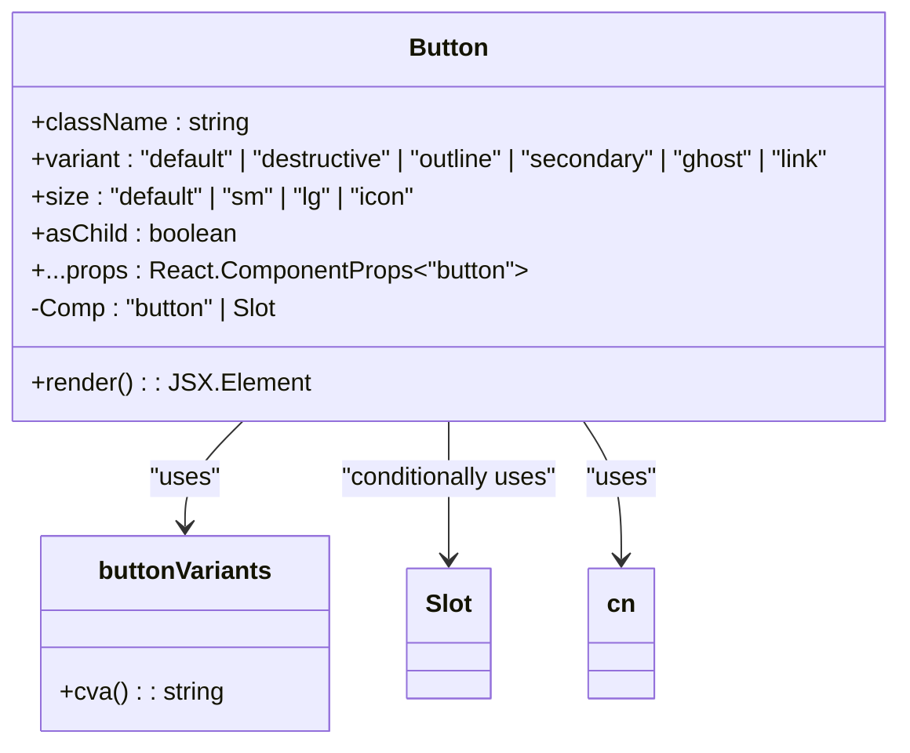
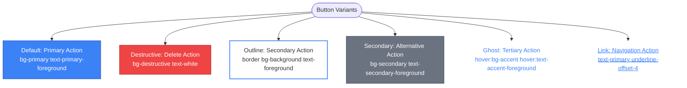
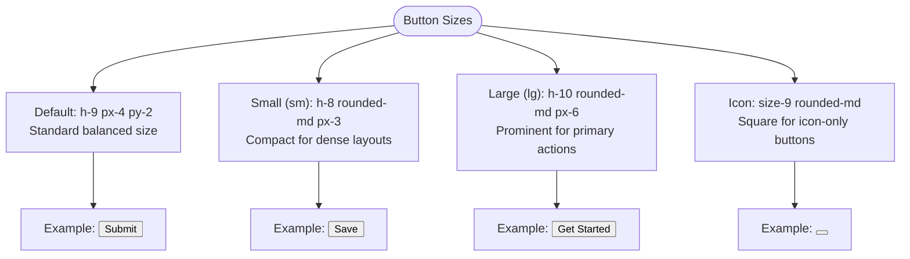
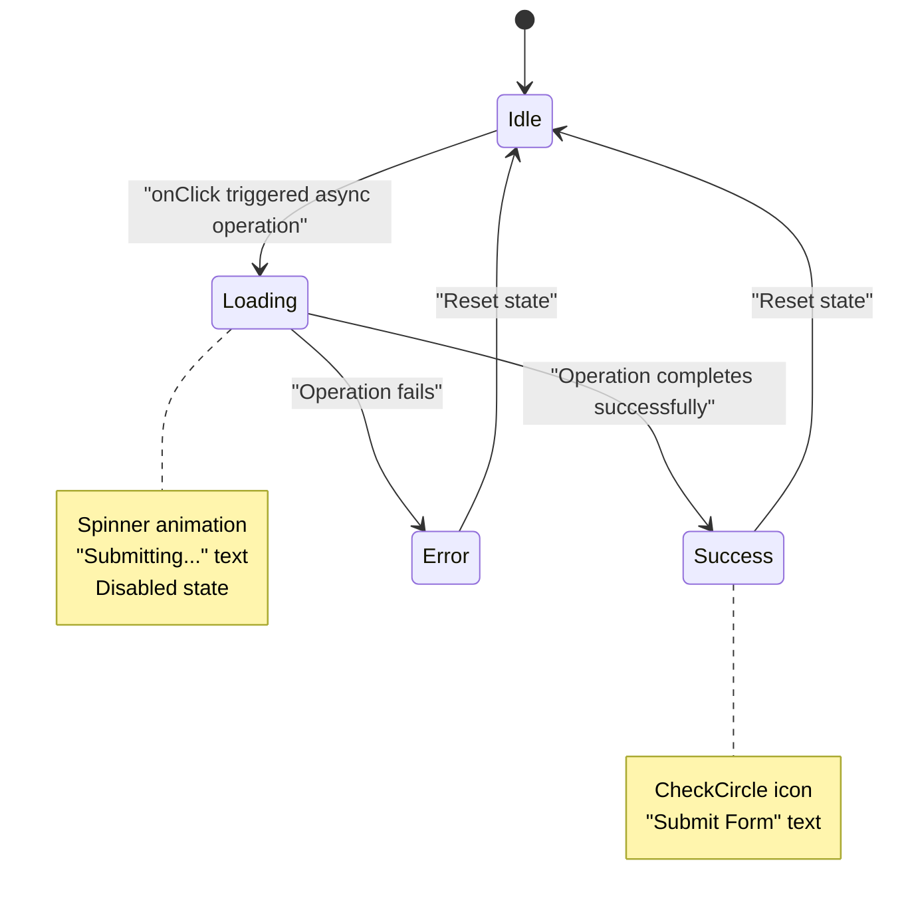
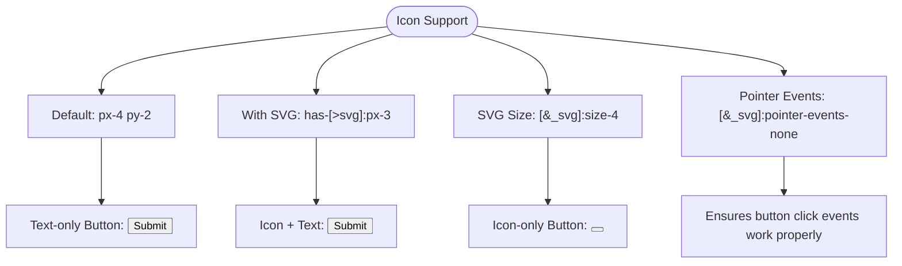
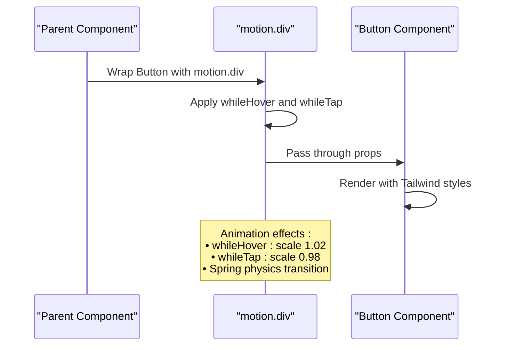
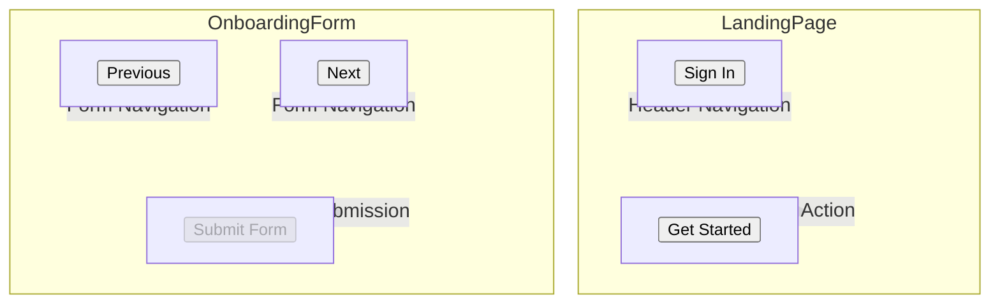
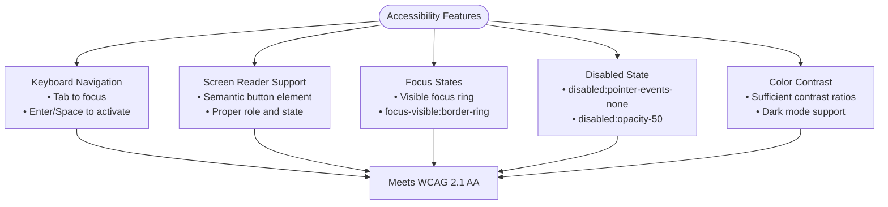
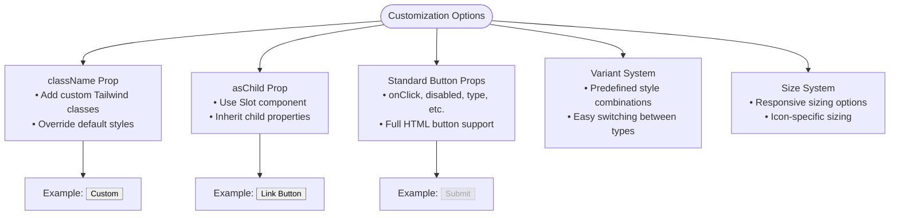

# Button Component

<cite>
**Referenced Files in This Document**   
- [button.tsx](file://src/components/ui/button.tsx)
- [LandingPage.tsx](file://src/components/LandingPage.tsx)
- [OnboardingForm.tsx](file://src/components/OnboardingForm.tsx)
- [utils.ts](file://src/components/ui/utils.ts)
- [tailwind.config.js](file://tailwind.config.js)
- [Guidelines.md](file://src/guidelines/Guidelines.md)
- [ANIMATIONS_SUMMARY.md](file://ANIMATIONS_SUMMARY.md)
- [LANDING_PAGE_ANIMATIONS.md](file://LANDING_PAGE_ANIMATIONS.md)
</cite>

## Table of Contents
1. [Introduction](#introduction)
2. [Core Implementation](#core-implementation)
3. [Variant Types](#variant-types)
4. [Size Options](#size-options)
5. [Loading States](#loading-states)
6. [Icon Support](#icon-support)
7. [React forwardRef Integration](#react-forwardref-integration)
8. [Framer Motion Integration](#framer-motion-integration)
9. [Usage Examples](#usage-examples)
10. [Accessibility Considerations](#accessibility-considerations)
11. [Customization Options](#customization-options)
12. [Performance Implications](#performance-implications)

## Introduction
The Button component is a fundamental interactive element in the SnapEvent design system, designed to trigger actions or navigate users through the application. It provides visual feedback and clear affordances to enhance user experience. The component is built using React and styled with Tailwind CSS, leveraging the class-variance-authority (CVA) library for variant management. It supports multiple variants, sizes, loading states, and icon integration, making it highly versatile for various use cases across the application.

**Section sources**
- [button.tsx](file://src/components/ui/button.tsx)
- [Guidelines.md](file://src/guidelines/Guidelines.md)

## Core Implementation
The Button component is implemented as a React functional component that uses the `cva` function from the class-variance-authority library to define and manage its variants. The component accepts standard button props along with custom props for variant, size, and whether to use the Slot component. The `cn` utility function from `utils.ts` is used to merge class names, ensuring that custom classes passed via the `className` prop are properly combined with the generated variant classes.

The component uses the `Slot` component from `@radix-ui/react-slot` when the `asChild` prop is true, allowing the button to inherit the properties of its child element. This is particularly useful for creating buttons that look like links or other elements while maintaining the semantic meaning of a button.



**Diagram sources**
- [button.tsx](file://src/components/ui/button.tsx)

**Section sources**
- [button.tsx](file://src/components/ui/button.tsx)
- [utils.ts](file://src/components/ui/utils.ts)

## Variant Types
The Button component supports six distinct variants, each designed for specific use cases within the application:

- **Default**: Used for primary actions, filled with the primary brand color
- **Destructive**: Used for actions that delete or remove content, filled with a destructive color
- **Outline**: Used for secondary actions, outlined with the primary color and transparent background
- **Secondary**: Used for alternative actions, filled with a secondary color
- **Ghost**: Used for tertiary actions, text-only with no border, providing minimal visual emphasis
- **Link**: Used for navigation actions, styled like a hyperlink with an underline on hover

These variants are defined in the `buttonVariants` constant using the `cva` function, which generates CSS classes based on the specified variants. The variants are designed to be consistent with the application's design system, ensuring a cohesive user experience across different pages and components.



**Diagram sources**
- [button.tsx](file://src/components/ui/button.tsx)

**Section sources**
- [button.tsx](file://src/components/ui/button.tsx)
- [Guidelines.md](file://src/guidelines/Guidelines.md)

## Size Options
The Button component provides four size options to accommodate different layout requirements:

- **Default**: Standard size with balanced padding and height
- **Small (sm)**: Compact size for dense layouts or secondary actions
- **Large (lg)**: Prominent size for primary actions or emphasis
- **Icon**: Square size designed specifically for icon-only buttons

The size variants are implemented using Tailwind CSS classes that control the height, padding, and other dimensions of the button. The `has-[>svg]:px-3` syntax in the default size variant ensures that buttons containing SVG icons have appropriate horizontal padding. This responsive sizing system allows the button to adapt to various contexts while maintaining visual consistency.



**Diagram sources**
- [button.tsx](file://src/components/ui/button.tsx)

**Section sources**
- [button.tsx](file://src/components/ui/button.tsx)

## Loading States
The Button component handles loading states through conditional rendering in parent components rather than having a dedicated loading prop. When a button is performing an asynchronous operation, such as form submission, the parent component renders a loading indicator within the button. This is typically implemented using a spinner icon and a loading message.

In the OnboardingForm component, for example, the submit button displays a loading spinner and "Submitting..." text when the form is being processed. This approach keeps the Button component itself simple and focused on its core functionality, while allowing parent components to manage complex states like loading.



**Diagram sources**
- [OnboardingForm.tsx](file://src/components/OnboardingForm.tsx)

**Section sources**
- [OnboardingForm.tsx](file://src/components/OnboardingForm.tsx)

## Icon Support
The Button component provides built-in support for icons through CSS selectors that automatically adjust padding when an SVG element is present. The `has-[>svg]:px-3` class in the default size variant ensures that buttons containing SVG icons have appropriate horizontal padding, preventing the icon from appearing too close to the button edges.

The component also includes styles that set a default size for SVG icons (`[&_svg]:size-4`) and prevent pointer events on icons (`[&_svg]:pointer-events-none`), ensuring that click events are properly handled by the button itself. This makes it easy to create icon buttons or buttons with icon-text combinations without additional styling.



**Diagram sources**
- [button.tsx](file://src/components/ui/button.tsx)

**Section sources**
- [button.tsx](file://src/components/ui/button.tsx)

## React forwardRef Integration
The Button component uses the `Slot` component from `@radix-ui/react-slot` to achieve functionality similar to `React.forwardRef`, allowing the button to pass through props and refs to its child element when the `asChild` prop is true. This pattern enables the creation of "polymorphic" components that can render as different HTML elements while maintaining the same visual styling and behavior.

When `asChild` is true, the component uses the `Slot` component instead of a native button element, which automatically inherits the props of its child. This is particularly useful for creating buttons that wrap other interactive elements like links or custom components, ensuring proper accessibility and event handling.

```mermaid
classDiagram
class Button {
+asChild : boolean
+props : any
-Comp : "button" | Slot
}
class Slot {
+children : ReactNode
+props : any
}
Button --> Slot : "uses when asChild=true"
Slot --> ChildElement : "passes props and ref"
note right of Button
When asChild=true :
Comp = Slot
Otherwise :
Comp = "button"
end note
```

**Diagram sources**
- [button.tsx](file://src/components/ui/button.tsx)

**Section sources**
- [button.tsx](file://src/components/ui/button.tsx)

## Framer Motion Integration
While the Button component itself does not directly import or use Framer Motion, it is commonly wrapped with Framer Motion components in parent components to add hover and click animations. The OnboardingForm and LandingPage components use Framer Motion's `whileHover` and `whileTap` props to create spring physics-based animations that provide natural, bouncy feedback for user interactions.

These animations are implemented by wrapping the Button component with a `motion.div` and applying the appropriate animation props. This separation of concerns keeps the Button component focused on its core functionality while allowing parent components to enhance the user experience with micro-interactions.



**Diagram sources**
- [OnboardingForm.tsx](file://src/components/OnboardingForm.tsx)
- [LandingPage.tsx](file://src/components/LandingPage.tsx)
- [ANIMATIONS_SUMMARY.md](file://ANIMATIONS_SUMMARY.md)

**Section sources**
- [OnboardingForm.tsx](file://src/components/OnboardingForm.tsx)
- [LandingPage.tsx](file://src/components/LandingPage.tsx)
- [ANIMATIONS_SUMMARY.md](file://ANIMATIONS_SUMMARY.md)
- [LANDING_PAGE_ANIMATIONS.md](file://LANDING_PAGE_ANIMATIONS.md)

## Usage Examples
The Button component is used extensively throughout the application in various contexts. In the LandingPage component, ghost buttons are used for navigation links in the header, providing a clean, minimalist appearance that doesn't distract from the main content. These buttons have a hover effect that changes the text color, creating a subtle but clear visual feedback.

In the OnboardingForm component, the Button component is used for navigation between form steps and for form submission. The navigation buttons use the outline variant, while the submit button uses a custom blue color scheme. The submit button also implements a loading state with a spinner animation when the form is being processed, providing clear feedback to the user.



**Diagram sources**
- [LandingPage.tsx](file://src/components/LandingPage.tsx)
- [OnboardingForm.tsx](file://src/components/OnboardingForm.tsx)

**Section sources**
- [LandingPage.tsx](file://src/components/LandingPage.tsx)
- [OnboardingForm.tsx](file://src/components/OnboardingForm.tsx)

## Accessibility Considerations
The Button component is designed with accessibility in mind, following web standards for interactive elements. As a native button element (or a properly implemented custom element via Slot), it is inherently accessible to screen readers and keyboard navigation. The component maintains proper focus states with visible focus rings, ensuring that keyboard users can easily identify the currently focused element.

The component also handles disabled states appropriately, using the `disabled` attribute which removes pointer events and reduces opacity, providing both visual and functional feedback that the button is not interactive. The focus ring is styled with a semi-transparent ring color (`focus-visible:ring-ring/50`) to ensure sufficient contrast while maintaining the aesthetic design.



**Diagram sources**
- [button.tsx](file://src/components/ui/button.tsx)

**Section sources**
- [button.tsx](file://src/components/ui/button.tsx)

## Customization Options
The Button component offers several customization options to adapt to different design requirements. The primary customization mechanism is through the `className` prop, which allows developers to add custom Tailwind CSS classes that override or extend the default styling. This can be used to change colors, add shadows, modify borders, or adjust spacing.

The component also supports the `asChild` prop, which enables the creation of polymorphic buttons that inherit the properties of their child elements. This is particularly useful for creating buttons that look like links or other elements while maintaining the semantic meaning of a button. Additionally, all standard button props are supported, allowing for full control over the button's behavior and attributes.



**Diagram sources**
- [button.tsx](file://src/components/ui/button.tsx)

**Section sources**
- [button.tsx](file://src/components/ui/button.tsx)

## Performance Implications
The Button component is designed to be lightweight and performant, with minimal impact on bundle size and runtime performance. The component itself is small, consisting primarily of a simple render function and CSS class generation. The use of Tailwind CSS and the `cva` library ensures that styles are efficiently generated and applied.

The component does not maintain internal state or perform expensive computations, making it highly efficient when rendered at scale. When used with Framer Motion for animations, the performance impact is minimal due to Framer Motion's optimization of transform and opacity properties, which are GPU-accelerated. The animations are also designed to respect the `prefers-reduced-motion` media query, ensuring a good experience for users who prefer reduced motion.

```mermaid
graph TD
A[Button Component] --> B[Tailwind CSS]
A --> C[class-variance-authority]
A --> D[React Functional Component]
B --> E[Utility-First CSS]
C --> F[Runtime Class Generation]
D --> G[No Internal State]
A --> H[Framer Motion Integration]
H --> I[Transform/Opacity Animations]
I --> J[GPU Accelerated]
H --> K[prefers-reduced-motion]
K --> L[Accessibility Support]
style A fill:#f9f,stroke:#333,stroke-width:2px
style E fill:#bbf,stroke:#333
style F fill:#bbf,stroke:#333
style G fill:#bbf,stroke:#333
style I fill:#bbf,stroke:#333
style J fill:#bbf,stroke:#333
style K fill:#bbf,stroke:#333
style L fill:#bbf,stroke:#333
note right of A
Lightweight component
No internal state
Efficient rendering
end note
note right of H
Optional dependency
Only when animated
Minimal bundle impact
end note
```

**Diagram sources**
- [button.tsx](file://src/components/ui/button.tsx)
- [ANIMATIONS_SUMMARY.md](file://ANIMATIONS_SUMMARY.md)

**Section sources**
- [button.tsx](file://src/components/ui/button.tsx)
- [ANIMATIONS_SUMMARY.md](file://ANIMATIONS_SUMMARY.md)