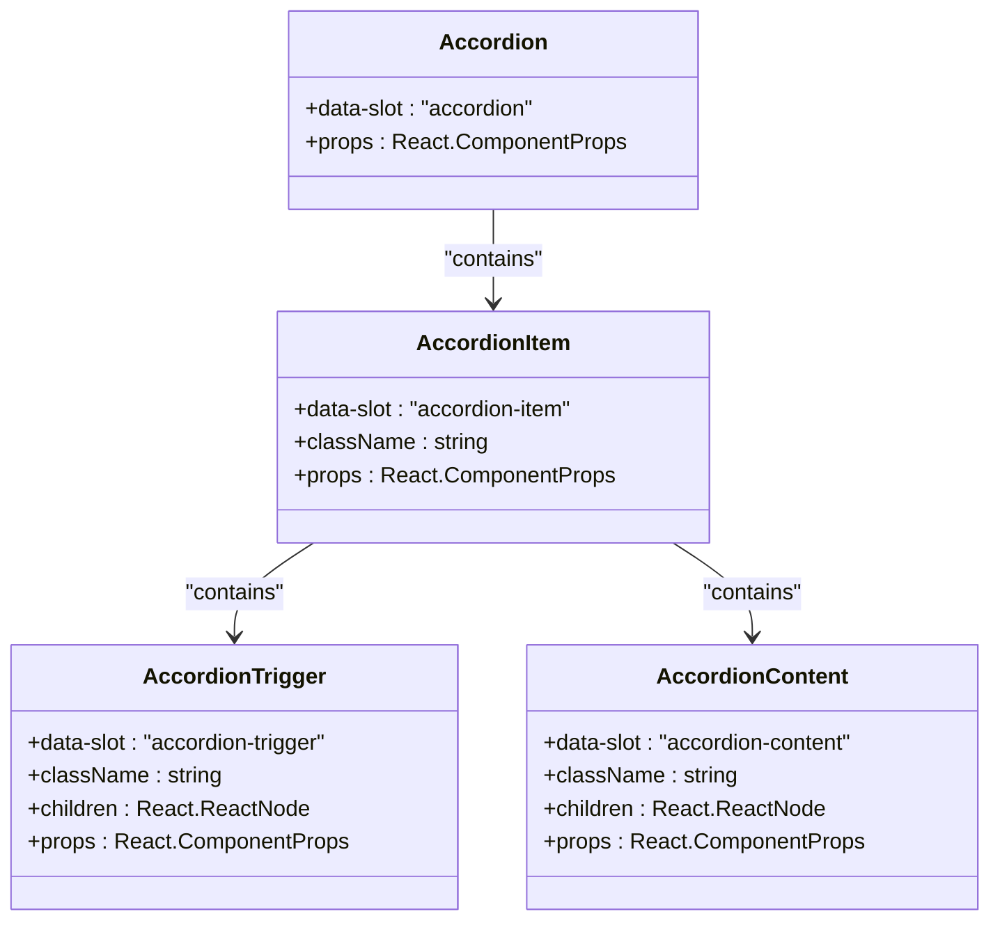

# Accordion Component

<cite>
**Referenced Files in This Document**   
- [accordion.tsx](file://src/components/ui/accordion.tsx)
- [PortfolioPage.tsx](file://src/components/PortfolioPage.tsx)
</cite>

## Table of Contents
1. [Introduction](#introduction)
2. [Core Components](#core-components)
3. [Implementation Details](#implementation-details)
4. [Usage in PortfolioPage](#usage-in-portfoliopage)
5. [Accessibility Features](#accessibility-features)
6. [Performance Considerations](#performance-considerations)
7. [Customization Options](#customization-options)

## Introduction
The Accordion component provides a progressive disclosure mechanism for organizing content in the SnapEvent landing page application. It enables users to expand and collapse sections of content, improving information hierarchy and user experience when viewing photographer details, service packages, and portfolio categories.

**Section sources**
- [accordion.tsx](file://src/components/ui/accordion.tsx#L1-L65)

## Core Components

The Accordion component is composed of four main parts that work together to create the expandable/collapsible interface:

- **Accordion**: The root component that manages the overall state and behavior
- **AccordionItem**: Represents an individual collapsible section
- **AccordionTrigger**: The clickable header that toggles the section's open/closed state
- **AccordionContent**: The container for the content that is revealed when expanded

These components are built using Radix UI's primitive components, ensuring accessibility and proper keyboard navigation.

**Section sources**
- [accordion.tsx](file://src/components/ui/accordion.tsx#L8-L65)

## Implementation Details

The Accordion implementation leverages Radix UI's accessible primitives with custom styling and behavior enhancements:

**Diagram sources**
- [accordion.tsx](file://src/components/ui/accordion.tsx#L8-L65)

The component uses Framer Motion for smooth transitions between open and closed states. The animation is implemented through CSS animations triggered by data-state attributes ("open" or "closed") that are automatically managed by Radix UI.

The AccordionTrigger includes a ChevronDownIcon that rotates 180 degrees when the section is open, providing visual feedback to users. This rotation is achieved through CSS transitions on the SVG element.

**Section sources**
- [accordion.tsx](file://src/components/ui/accordion.tsx#L27-L44)
- [accordion.tsx](file://src/components/ui/accordion.tsx#L49-L61)

## Usage in PortfolioPage

While the Accordion component is defined in the codebase, analysis of the PortfolioPage component reveals that it currently uses alternative UI patterns for content organization rather than the Accordion component. The PortfolioPage implements tab-based navigation for different content sections (Portfolio, About, Services, Reviews) using the Tabs component from the UI library.

The services, testimonials, and equipment lists are organized through direct rendering of data structures without the progressive disclosure pattern that the Accordion component provides. This suggests that while the Accordion component is available in the component library, it may not be currently utilized in the main PortfolioPage implementation.

**Section sources**
- [PortfolioPage.tsx](file://src/components/PortfolioPage.tsx#L479-L513)

## Accessibility Features

The Accordion component incorporates several accessibility features through its foundation on Radix UI primitives:

- **Keyboard Navigation**: Full keyboard support with arrow keys to navigate between items and Enter/Space to toggle open/close states
- **ARIA Attributes**: Proper ARIA roles and attributes are automatically applied, including aria-expanded to indicate the open/closed state
- **Focus Management**: Visual focus indicators and proper focus trapping within the component
- **Screen Reader Support**: Semantic HTML structure that provides clear announcements to assistive technologies

The component also includes visual focus states with a ring effect and ensures sufficient color contrast for users with visual impairments.

**Section sources**
- [accordion.tsx](file://src/components/ui/accordion.tsx#L33-L44)

## Performance Considerations

When considering the use of accordion components in nested structures, several performance considerations should be addressed:

- **Content Lazy Loading**: For deeply nested accordions, content should be loaded only when a section is expanded to reduce initial page load time
- **Virtualization**: In cases with many accordion items, virtualization techniques can be applied to render only visible items
- **Animation Optimization**: The current implementation uses CSS animations which are generally performant, but complex content within expanded panels should be optimized to prevent layout thrashing
- **Memory Management**: Event listeners and state should be properly cleaned up when accordion items are unmounted

While the current implementation doesn't include lazy loading, the component structure supports this enhancement through conditional rendering of content based on the open state.

**Section sources**
- [accordion.tsx](file://src/components/ui/accordion.tsx#L49-L61)

## Customization Options

The Accordion component offers several customization options:

### Styling with Tailwind Classes
The component accepts className props on all sub-components, allowing for extensive customization using Tailwind CSS classes. Developers can modify:
- Trigger appearance (padding, typography, colors)
- Content styling (spacing, text properties)
- Border and separator styles
- Animation duration and easing

### Icon Customization
While the default implementation uses a ChevronDownIcon, the component can be extended to support custom icons by modifying the trigger component or passing icon props.

### Animation Customization
The animation behavior can be customized by:
- Modifying the CSS animation classes
- Adjusting the transition duration in the icon rotation
- Implementing custom Framer Motion variants for more complex animations

### Expansion Behavior
The component supports both single and multiple item expansion through the type prop inherited from Radix UI's Accordion primitive, allowing developers to control whether only one item can be open at a time or multiple items can be expanded simultaneously.

**Section sources**
- [accordion.tsx](file://src/components/ui/accordion.tsx#L8-L65)