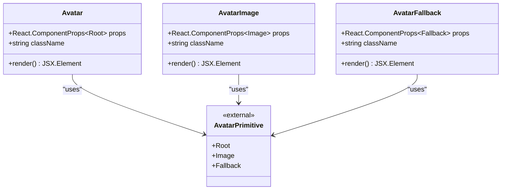
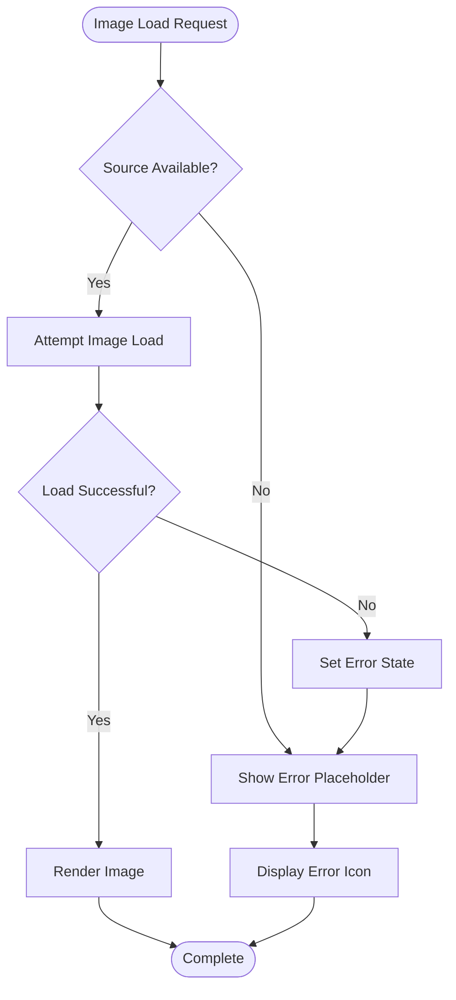
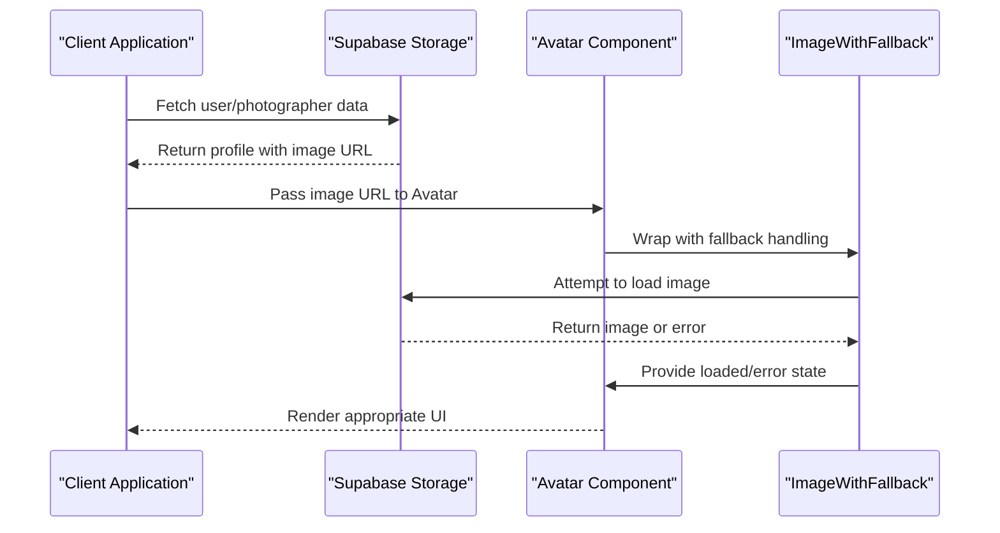

# Avatar Component Documentation

<cite>
**Referenced Files in This Document**
- [src/components/ui/avatar.tsx](file://src/components/ui/avatar.tsx)
- [src/components/figma/ImageWithFallback.tsx](file://src/components/figma/ImageWithFallback.tsx)
- [src/lib/supabase.ts](file://src/lib/supabase.ts)
- [src/lib/supabase-server.ts](file://src/lib/supabase-server.ts)
- [src/components/PortfolioPage.tsx](file://src/components/PortfolioPage.tsx)
- [src/components/Code-component-1-88.tsx](file://src/components/Code-component-1-80.tsx)
- [src/components/Code-component-1-80.tsx](file://src/components/Code-component-1-88.tsx)
- [PROFILE_PICTURE_FEATURE.md](file://PROFILE_PICTURE_FEATURE.md)
</cite>

## Table of Contents
1. [Introduction](#introduction)
2. [Core Avatar Component](#core-avatar-component)
3. [Image Fallback Mechanism](#image-fallback-mechanism)
4. [Supabase Integration](#supabase-integration)
5. [Usage Patterns](#usage-patterns)
6. [Responsive Design](#responsive-design)
7. [Performance Optimization](#performance-optimization)
8. [Extension Guidelines](#extension-guidelines)
9. [Best Practices](#best-practices)
10. [Troubleshooting](#troubleshooting)

## Introduction

The Avatar component is a fundamental UI element in the SnapEvent application designed to display photographer profile pictures and client avatars throughout the platform. Built with accessibility and robustness in mind, it provides comprehensive fallback mechanisms, responsive behavior, and seamless integration with Supabase storage for profile picture management.

The component system consists of two primary parts:
- **Core Avatar Component**: A lightweight wrapper around Radix UI's Avatar primitives
- **ImageWithFallback**: A sophisticated image loading component with error handling

## Core Avatar Component

The core Avatar component serves as the foundation for all avatar displays in the application. It provides a clean, accessible interface built on top of Radix UI's avatar primitives.



**Diagram sources**
- [src/components/ui/avatar.tsx](file://src/components/ui/avatar.tsx#L1-L54)

### Component Structure

The Avatar system consists of three interconnected components:

**Avatar Root Component**:
```typescript
function Avatar({
  className,
  ...props
}: React.ComponentProps<typeof AvatarPrimitive.Root>) {
  return (
    <AvatarPrimitive.Root
      data-slot="avatar"
      className={cn(
        "relative flex size-10 shrink-0 overflow-hidden rounded-full",
        className,
      )}
      {...props}
    />
  );
}
```

**AvatarImage Component**:
```typescript
function AvatarImage({
  className,
  ...props
}: React.ComponentProps<typeof AvatarPrimitive.Image>) {
  return (
    <AvatarPrimitive.Image
      data-slot="avatar-image"
      className={cn("aspect-square size-full", className)}
      {...props}
    />
  );
}
```

**AvatarFallback Component**:
```typescript
function AvatarFallback({
  className,
  ...props
}: React.ComponentProps<typeof AvatarPrimitive.Fallback>) {
  return (
    <AvatarPrimitive.Fallback
      data-slot="avatar-fallback"
      className={cn(
        "bg-muted flex size-full items-center justify-center rounded-full",
        className,
      )}
      {...props}
    />
  );
}
```

### Props and Configuration

The Avatar component accepts standard HTML attributes plus Tailwind CSS class customization:

- **className**: Additional CSS classes for styling
- **data-slot**: Accessibility identifier for testing
- **alt**: Alternative text for accessibility
- **src**: Image source URL
- **loading**: Lazy loading behavior

**Section sources**
- [src/components/ui/avatar.tsx](file://src/components/ui/avatar.tsx#L1-L54)

## Image Fallback Mechanism

The ImageWithFallback component provides robust error handling for image loading scenarios, ensuring graceful degradation when images fail to load or are unavailable.



**Diagram sources**
- [src/components/figma/ImageWithFallback.tsx](file://src/components/figma/ImageWithFallback.tsx#L1-L28)

### Implementation Details

The fallback mechanism uses React state to track loading errors and provides a consistent error representation:

```typescript
const ERROR_IMG_SRC = 
  'data:image/svg+xml;base64,PHN2ZyB3aWR0aD0iODgiIGhlaWdodD0iODgiIHhtbG5zPSJodHRwOi8vd3d3LnczLm9yZy8yMDAwL3N2ZyIgc3Ryb2tlPSIjMDAwIiBzdHJva2UtbGluZWpvaW49InJvdW5kIiBvcGFjaXR5PSIuMyIgZmlsbD0ibm9uZSIgc3Ryb2tlLXdpZHRoPSIzLjciPjxyZWN0IHg9IjE2IiB5PSIxNiIgd2lkdGg9IjU2IiBoZWlnaHQ9IjU2IiByeD0iNiIvPjxwYXRoIGQ9Im0xNiA1OCAxNi0xOCAzMiAzMiIvPjxjaXJjbGUgY3g9IjUzIiBjeT0iMzUiIHI9IjciLz48L3N2Zz4KCg=='

export function ImageWithFallback(props: React.ImgHTMLAttributes<HTMLImageElement>) {
  const [didError, setDidError] = useState(false)
  
  const handleError = () => {
    setDidError(true)
  }
  
  return didError ? (
    <div className={`inline-block bg-gray-100 text-center align-middle ${className ?? ''}`}>
      <div className="flex items-center justify-center w-full h-full">
        
      </div>
    </div>
  ) : (
    
  )
}
```

### Error Handling Features

- **Automatic Error Detection**: Uses `onError` event handler
- **Graceful Degradation**: Shows error icon instead of broken image
- **Original URL Preservation**: Maintains reference to failed URL
- **Consistent Styling**: Uniform error presentation across components

**Section sources**
- [src/components/figma/ImageWithFallback.tsx](file://src/components/figma/ImageWithFallback.tsx#L1-L28)

## Supabase Integration

The Avatar component integrates seamlessly with Supabase storage for managing profile pictures and client avatars. The integration supports both user avatars and photographer profile images.



**Diagram sources**
- [src/lib/supabase.ts](file://src/lib/supabase.ts#L1-L242)
- [src/components/ui/avatar.tsx](file://src/components/ui/avatar.tsx#L1-L54)

### Database Schema Integration

The Supabase integration supports multiple data models:

**User Model**:
```typescript
interface User {
  id: string
  email: string
  first_name: string
  last_name: string
  phone: string | null
  avatar: string | null  // Supabase storage URL
  role: 'CLIENT' | 'PHOTOGRAPHER' | 'ADMIN'
  is_active: boolean
  created_at: string
  updated_at: string
}
```

**Photographer Profile Model**:
```typescript
interface PhotographerProfile {
  id: string
  user_id: string
  business_name: string | null
  title: string | null
  bio: string | null
  location: string
  website: string | null
  portfolio_url: string | null
  instagram_handle: string | null
  years_experience: number
  is_verified: boolean
  is_available: boolean
  response_time: string | null
  total_clients: number
  average_rating: number
  total_reviews: number
  profile_image: string | null  // Supabase storage URL
  cover_image: string | null
  application_status: 'PENDING' | 'APPROVED' | 'REJECTED' | 'SUSPENDED'
  application_date: string
  approved_at: string
  approved_by: string | null
  created_at: string
  updated_at: string
}
```

### Storage Operations

The Supabase helpers provide comprehensive CRUD operations:

```typescript
// Get photographer profile with image
async getPhotographerProfile(userId: string) {
  const { data, error } = await supabase
    .from('photographer_profiles')
    .select('*')
    .eq('user_id', userId)
    .single()
  
  if (error) throw error
  return data
}

// Update photographer profile with image
async updatePhotographerProfile(id: string, updates: Database['public']['Tables']['photographer_profiles']['Update']) {
  const { data, error } = await supabase
    .from('photographer_profiles')
    .update(updates)
    .eq('id', id)
    .select()
    .single()
  
  if (error) throw error
  return data
}
```

**Section sources**
- [src/lib/supabase.ts](file://src/lib/supabase.ts#L1-L242)

## Usage Patterns

The Avatar component appears throughout the application in various contexts, each requiring specific configuration and styling approaches.

### Navigation Menus

```typescript
// User profile avatar in navigation
<Avatar>
  <AvatarImage src={currentUser.avatar} alt={`${currentUser.first_name}'s avatar`} />
  <AvatarFallback>{currentUser.first_name.charAt(0)}</AvatarFallback>
</Avatar>
```

### Booking Confirmations

```typescript
// Photographer avatar in booking details
<div className="flex items-center space-x-4">
  <Avatar className="w-12 h-12">
    <AvatarImage src={photographer.profile_image} alt={photographer.business_name} />
    <AvatarFallback>{photographer.business_name.charAt(0)}</AvatarFallback>
  </Avatar>
  <div>
    <h3 className="font-semibold">{photographer.business_name}</h3>
    <p className="text-sm text-muted-foreground">{photographer.location}</p>
  </div>
</div>
```

### Review Sections

```typescript
// Client avatar in reviews
<Card>
  <CardContent className="p-6">
    <div className="flex items-start space-x-4">
      <Avatar className="w-16 h-16">
        <AvatarImage src={review.client_avatar} alt={review.client_name} />
        <AvatarFallback>{review.client_name.charAt(0)}</AvatarFallback>
      </Avatar>
      <div className="flex-1">
        <div className="flex items-center justify-between mb-2">
          <h4 className="font-semibold">{review.client_name}</h4>
          <div className="flex items-center space-x-1">
            <Star className="h-4 w-4 text-yellow-400 fill-current" />
            <span className="text-sm">{review.rating}</span>
          </div>
        </div>
        <p className="text-sm text-muted-foreground">{review.comment}</p>
      </div>
    </div>
  </CardContent>
</Card>
```

### Portfolio Pages

```typescript
// Photographer avatar with verification badge
<div className="relative">
  <Avatar className="w-32 h-32 md:w-48 md:h-48 rounded-full object-cover border-4 border-background shadow-lg">
    <AvatarImage src={photographer.profile_image} alt={photographer.business_name} />
    <AvatarFallback>{photographer.business_name.charAt(0)}</AvatarFallback>
  </Avatar>
  {photographer.is_verified && (
    <div className="absolute -bottom-2 -right-2 bg-primary rounded-full p-2">
      <CheckCircle className="h-6 w-6 text-primary-foreground fill-current" />
    </div>
  )}
</div>
```

**Section sources**
- [src/components/PortfolioPage.tsx](file://src/components/PortfolioPage.tsx#L250-L283)
- [src/components/Code-component-1-88.tsx](file://src/components/Code-component-1-88.ts#L150-L182)
- [src/components/Code-component-1-80.tsx](file://src/components/Code-component-1-80.ts#L230-L257)

## Responsive Design

The Avatar component implements responsive behavior through flexible sizing and adaptive layouts that work across all device types.

### Size Variations

```typescript
// Small avatar for lists and compact views
<Avatar className="w-8 h-8">
  <AvatarImage src={smallImage} alt="Small avatar" />
  <AvatarFallback>S</AvatarFallback>
</Avatar>

// Medium avatar for profile views
<Avatar className="w-16 h-16">
  <AvatarImage src={mediumImage} alt="Medium avatar" />
  <AvatarFallback>M</AvatarFallback>
</Avatar>

// Large avatar for hero sections
<Avatar className="w-32 h-32 md:w-48 md:h-48">
  <AvatarImage src={largeImage} alt="Large avatar" />
  <AvatarFallback>L</AvatarFallback>
</Avatar>
```

### Breakpoint Behavior

The component adapts to different screen sizes:

- **Mobile (< 768px)**: Compact avatars with minimal spacing
- **Tablet (768px - 1024px)**: Medium-sized avatars with moderate padding
- **Desktop (> 1024px)**: Large avatars with generous spacing and shadows

### Layout Flexibility

```typescript
// Horizontal layout with avatar alignment
<div className="flex items-center space-x-4">
  <Avatar className="w-12 h-12">
    <AvatarImage src={image} alt="Aligned avatar" />
    <AvatarFallback>A</AvatarFallback>
  </Avatar>
  <div className="flex-1">
    <h3 className="font-semibold">Aligned Content</h3>
  </div>
</div>

// Vertical layout for compact spaces
<div className="flex flex-col items-center space-y-2">
  <Avatar className="w-16 h-16">
    <AvatarImage src={image} alt="Vertical avatar" />
    <AvatarFallback>V</AvatarFallback>
  </Avatar>
  <span className="text-sm">Vertical Content</span>
</div>
```

## Performance Optimization

The Avatar component incorporates several performance optimization strategies to ensure smooth user experiences across all devices.

### Image Lazy Loading

```typescript
// Lazy loading implementation
<Avatar>
  <AvatarImage 
    src={imageSrc} 
    alt={altText} 
    loading="lazy" 
    decoding="async"
  />
  <AvatarFallback>{fallbackText}</AvatarFallback>
</Avatar>
```

### CDN Integration

Images are served through optimized CDNs with automatic compression and format conversion:

- **WebP Support**: Automatic format detection and conversion
- **Compression**: Intelligent compression based on image type and size
- **Caching**: Aggressive caching strategies for improved load times
- **Geographic Distribution**: Edge locations for global performance

### Memory Management

```typescript
// Efficient cleanup for large image sets
useEffect(() => {
  return () => {
    // Cleanup image URLs to prevent memory leaks
    URL.revokeObjectURL(imageUrl)
  }
}, [imageUrl])

// Image preloading for better UX
const preloadImage = (url: string) => {
  const img = new Image()
  img.src = url
  return img
}
```

### Bundle Optimization

The component is tree-shakable and imports only necessary dependencies:

```typescript
// Minimal imports for optimal bundle size
import * as React from "react"
import * as AvatarPrimitive from "@radix-ui/react-avatar"
import { cn } from "./utils"
```

## Extension Guidelines

The Avatar component can be extended to support advanced features like group avatars, badge overlays, and status indicators.

### Group Avatar Implementation

```typescript
interface GroupAvatarProps {
  members: Array<{ id: string; avatar: string; name: string }>
  maxVisible?: number
  size?: 'sm' | 'md' | 'lg'
}

function GroupAvatar({ members, maxVisible = 3, size = 'md' }: GroupAvatarProps) {
  const visibleMembers = members.slice(0, maxVisible)
  const hiddenCount = members.length - maxVisible
  
  return (
    <div className="flex -space-x-2">
      {visibleMembers.map(member => (
        <Avatar key={member.id} className={`border-2 border-background ${sizeClasses[size]}`}>
          <AvatarImage src={member.avatar} alt={member.name} />
          <AvatarFallback>{member.name.charAt(0)}</AvatarFallback>
        </Avatar>
      ))}
      {hiddenCount > 0 && (
        <div className={`flex items-center justify-center ${sizeClasses[size]} bg-muted rounded-full`}>
          +{hiddenCount}
        </div>
      )}
    </div>
  )
}
```

### Badge Overlay System

```typescript
interface AvatarWithBadgesProps {
  avatarSrc: string
  badges?: Array<'verified' | 'online' | 'premium'>
  size?: 'sm' | 'md' | 'lg'
}

function AvatarWithBadges({ avatarSrc, badges = [], size = 'md' }: AvatarWithBadgesProps) {
  const badgePositions = {
    verified: '-bottom-1 -right-1',
    online: '-top-1 -left-1',
    premium: '-bottom-1 -left-1'
  }
  
  return (
    <div className="relative">
      <Avatar className={sizeClasses[size]}>
        <AvatarImage src={avatarSrc} alt="Avatar with badges" />
        <AvatarFallback>{avatarSrc.charAt(0)}</AvatarFallback>
      </Avatar>
      
      {badges.map(badge => (
        <div key={badge} className={`absolute ${badgePositions[badge]} bg-${badge}-500 rounded-full p-1`}>
          {getBadgeIcon(badge)}
        </div>
      ))}
    </div>
  )
}
```

### Status Indicator Enhancement

```typescript
interface StatusAvatarProps {
  avatarSrc: string
  status: 'online' | 'offline' | 'busy' | 'away'
  size?: 'sm' | 'md' | 'lg'
}

function StatusAvatar({ avatarSrc, status, size = 'md' }: StatusAvatarProps) {
  const statusStyles = {
    online: 'bg-green-500 ring-green-200',
    offline: 'bg-gray-500 ring-gray-300',
    busy: 'bg-red-500 ring-red-200',
    away: 'bg-yellow-500 ring-yellow-200'
  }
  
  return (
    <div className="relative">
      <Avatar className={sizeClasses[size]}>
        <AvatarImage src={avatarSrc} alt="Status avatar" />
        <AvatarFallback>{avatarSrc.charAt(0)}</AvatarFallback>
      </Avatar>
      <div className={`absolute bottom-0 right-0 w-3 h-3 rounded-full ring-2 ${statusStyles[status]}`} />
    </div>
  )
}
```

## Best Practices

### Accessibility Guidelines

1. **Alt Text**: Always provide meaningful alt text for screen readers
2. **Color Contrast**: Ensure sufficient contrast between avatar backgrounds and text
3. **Focus States**: Provide visible focus indicators for interactive avatars
4. **ARIA Labels**: Use appropriate ARIA labels for complex avatar interactions

```typescript
// Accessible avatar implementation
<Avatar aria-label={`${userName}'s profile picture`}>
  <AvatarImage 
    src={userAvatar} 
    alt={`${userName}'s profile picture`}
    loading="lazy"
  />
  <AvatarFallback className="focus:ring-2 focus:ring-primary focus:ring-offset-2">
    {userName.charAt(0)}
  </AvatarFallback>
</Avatar>
```

### Performance Best Practices

1. **Image Optimization**: Use appropriate image formats and sizes
2. **Lazy Loading**: Implement lazy loading for non-critical avatars
3. **CDN Usage**: Leverage CDNs for global performance
4. **Memory Management**: Clean up image URLs when components unmount

### Security Considerations

1. **Input Validation**: Validate image URLs and file types
2. **Content Security**: Implement CSP policies for image sources
3. **Sanitization**: Sanitize user-generated avatar content
4. **Access Control**: Implement proper authorization for avatar updates

```typescript
// Secure avatar upload validation
const validateAvatarUpload = (file: File): boolean => {
  const allowedTypes = ['image/jpeg', 'image/png', 'image/webp']
  const maxSize = 5 * 1024 * 1024 // 5MB
  
  if (!allowedTypes.includes(file.type)) {
    throw new Error('Unsupported file type')
  }
  
  if (file.size > maxSize) {
    throw new Error('File size exceeds limit')
  }
  
  return true
}
```

## Troubleshooting

### Common Issues and Solutions

**Broken Images**:
- Verify image URLs are accessible
- Check Supabase storage permissions
- Ensure images are properly uploaded
- Test with ImageWithFallback component

**Performance Issues**:
- Implement lazy loading for large avatar sets
- Optimize image sizes and formats
- Use CDN for global distribution
- Monitor memory usage in long-running sessions

**Accessibility Problems**:
- Add descriptive alt text
- Ensure keyboard navigation works
- Verify color contrast ratios
- Test with screen readers

### Debugging Tools

```typescript
// Avatar debugging component
function DebugAvatar({ src, alt }: { src: string; alt: string }) {
  const [error, setError] = useState<string | null>(null)
  
  useEffect(() => {
    const img = new Image()
    img.onload = () => console.log('Avatar loaded:', src)
    img.onerror = () => setError('Failed to load avatar')
    img.src = src
  }, [src])
  
  return (
    <div className="p-4 border rounded-lg">
      <Avatar>
        <AvatarImage src={src} alt={alt} onError={() => setError('Image error')} />
        <AvatarFallback>{alt.charAt(0)}</AvatarFallback>
      </Avatar>
      {error && <div className="text-red-500 text-sm mt-2">{error}</div>}
    </div>
  )
}
```

### Error Recovery Strategies

1. **Fallback Chain**: Implement multiple fallback levels
2. **Retry Logic**: Automatic retry for transient failures
3. **User Notification**: Inform users of persistent issues
4. **Graceful Degradation**: Maintain functionality without avatars

```typescript
// Robust error recovery
const AvatarWithErrorRecovery = ({ src, alt }: { src: string; alt: string }) => {
  const [retryCount, setRetryCount] = useState(0)
  const maxRetries = 3
  
  const handleRetry = () => {
    if (retryCount < maxRetries) {
      setRetryCount(prev => prev + 1)
      // Implement retry logic here
    }
  }
  
  return (
    <Avatar>
      <AvatarImage src={src} alt={alt} onError={handleRetry} />
      <AvatarFallback>
        {retryCount >= maxRetries ? 'Error' : 'Loading...'}
      </AvatarFallback>
    </Avatar>
  )
}
```

**Section sources**
- [src/components/figma/ImageWithFallback.tsx](file://src/components/figma/ImageWithFallback.tsx#L1-L28)
- [src/components/ui/avatar.tsx](file://src/components/ui/avatar.tsx#L1-L54)