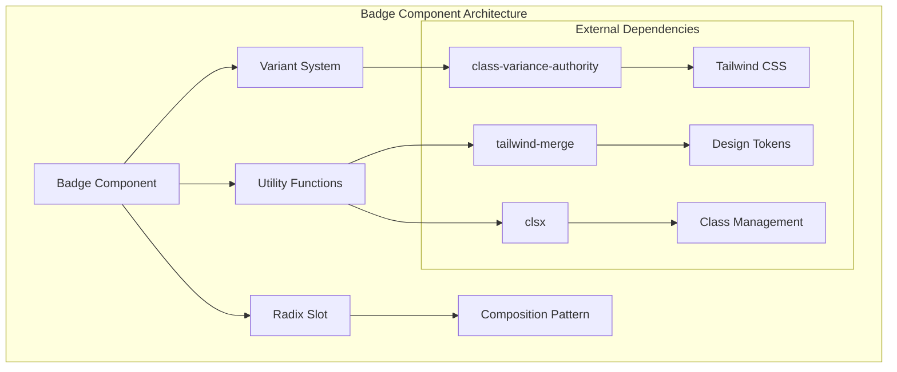
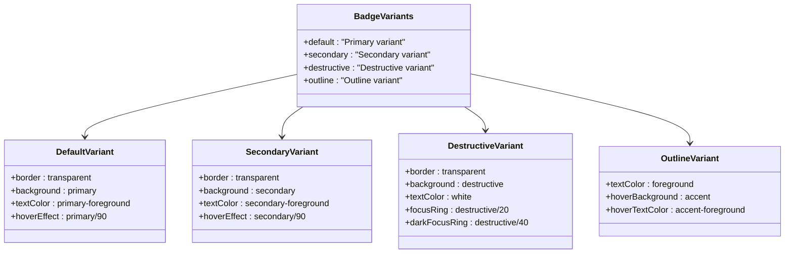
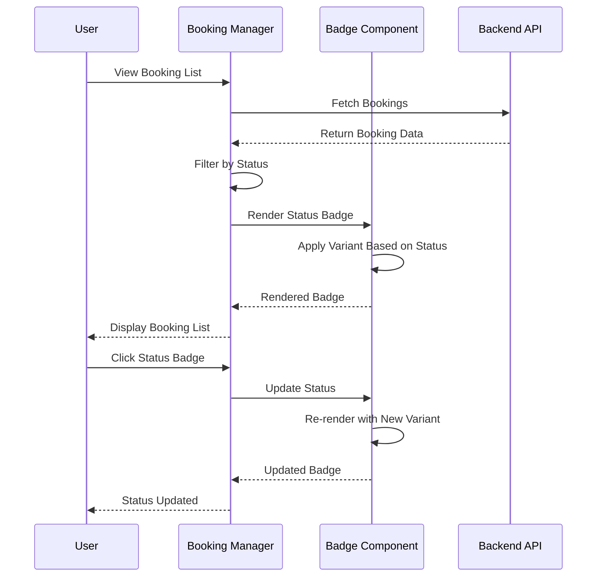

# Badge Component Documentation

<cite>
**Referenced Files in This Document**
- [badge.tsx](file://src/components/ui/badge.tsx)
- [utils.ts](file://src/components/ui/utils.ts)
- [LandingPage.tsx](file://src/components/LandingPage.tsx)
- [PortfolioPage.tsx](file://src/components/PortfolioPage.tsx)
- [BookingManager.tsx](file://src/components/BookingManager.tsx)
- [tailwind.config.js](file://tailwind.config.js)
- [index.css](file://src/index.css)
- [api.ts](file://src/lib/api.ts)
</cite>

## Table of Contents
1. [Introduction](#introduction)
2. [Component Architecture](#component-architecture)
3. [Core Implementation](#core-implementation)
4. [Variant System](#variant-system)
5. [Usage Patterns](#usage-patterns)
6. [Integration Examples](#integration-examples)
7. [Accessibility Features](#accessibility-features)
8. [Customization Options](#customization-options)
9. [Best Practices](#best-practices)
10. [Troubleshooting](#troubleshooting)

## Introduction

The Badge component is a versatile UI element designed to highlight photographer specialties, verification status, availability indicators, and booking statuses throughout the SnapEvent platform. Built with modern React patterns and Tailwind CSS, it provides consistent visual feedback and enhances user experience across various contexts.

The component leverages the `class-variance-authority` library for variant management and integrates seamlessly with the application's design system. It serves as a crucial element for conveying status information, categories, and important attributes in a compact, visually appealing format.

## Component Architecture

The Badge component follows a modular architecture that separates concerns between styling, behavior, and composition. The implementation utilizes several key technologies:



**Diagram sources**
- [badge.tsx](file://src/components/ui/badge.tsx#L1-L47)
- [utils.ts](file://src/components/ui/utils.ts#L1-L7)

**Section sources**
- [badge.tsx](file://src/components/ui/badge.tsx#L1-L47)
- [utils.ts](file://src/components/ui/utils.ts#L1-L7)

## Core Implementation

The Badge component is built around a sophisticated variant system that provides consistent styling across different contexts while maintaining flexibility for customization.

### Component Structure

```typescript
function Badge({
  className,
  variant,
  asChild = false,
  ...props
}: React.ComponentProps<"span"> & 
  VariantProps<typeof badgeVariants> & 
  { asChild?: boolean }) {
  const Comp = asChild ? Slot : "span";
  
  return (
    <Comp
      data-slot="badge"
      className={cn(badgeVariants({ variant }), className)}
      {...props}
    />
  );
}
```

### Key Features

1. **Variant-Based Styling**: Uses `class-variance-authority` for type-safe variant management
2. **Composition Pattern**: Supports both slot and native HTML element rendering
3. **Utility Integration**: Leverages `twMerge` and `clsx` for optimal class merging
4. **Accessibility Support**: Includes focus states and semantic attributes

### Design Token Integration

The component integrates deeply with the application's design system through Tailwind CSS variables:

```css
--primary: 222.2 47.4% 11.2%;
--primary-foreground: 210 40% 98%;
--secondary: 210 40% 96%;
--secondary-foreground: 222.2 47.4% 11.2%;
--destructive: 0 84.2% 60.2%;
--destructive-foreground: 210 40% 98%;
```

**Section sources**
- [badge.tsx](file://src/components/ui/badge.tsx#L18-L47)
- [index.css](file://src/index.css#L1-L59)

## Variant System

The Badge component provides four distinct variants, each optimized for specific use cases and visual hierarchy:



**Diagram sources**
- [badge.tsx](file://src/components/ui/badge.tsx#L10-L28)

### Variant Specifications

#### Default Variant
- **Purpose**: Primary emphasis, main actions
- **Colors**: Transparent border, primary background, primary foreground
- **Use Cases**: Primary status indicators, main categories

#### Secondary Variant
- **Purpose**: Secondary emphasis, supporting information
- **Colors**: Transparent border, secondary background, secondary foreground
- **Use Cases**: Supporting status, secondary categories

#### Destructive Variant
- **Purpose**: Negative actions, errors, warnings
- **Colors**: Transparent border, destructive background, white text
- **Use Cases**: Error states, negative feedback, destructive actions

#### Outline Variant
- **Purpose**: Minimal emphasis, neutral information
- **Colors**: Foreground text, accent hover effects
- **Use Cases**: Neutral categories, minimal emphasis

**Section sources**
- [badge.tsx](file://src/components/ui/badge.tsx#L10-L28)

## Usage Patterns

The Badge component demonstrates extensive usage patterns across the application, showcasing its versatility and adaptability to different contexts.

### Basic Usage Patterns

```typescript
// Verification Status
<Badge variant="secondary" className="text-xs">Verified</Badge>

// Specialty Tags
{photographer.specialties.map((specialty, index) => (
  <Badge key={index} variant="outline" className="text-xs">
    {specialty}
  </Badge>
))

// Booking Status Badges
const getStatusBadge = (status: string) => {
  const variants = {
    pending: { variant: 'secondary' as const, icon: AlertCircle, color: 'text-yellow-600' },
    confirmed: { variant: 'default' as const, icon: CheckCircle, color: 'text-green-600' },
    declined: { variant: 'destructive' as const, icon: XCircle, color: 'text-red-600' },
    cancelled: { variant: 'outline' as const, icon: XCircle, color: 'text-gray-600' }
  };
  
  const config = variants[status as keyof typeof variants] || variants.pending;
  const Icon = config.icon;
  
  return (
    <Badge variant={config.variant} className="flex items-center gap-1">
      <Icon className="h-3 w-3" />
      {status.charAt(0).toUpperCase() + status.slice(1)}
    </Badge>
  );
};
```

### Dynamic Badge Generation

The component supports dynamic generation based on photographer attributes:

```typescript
// Response Time Indicators
<Badge variant="secondary" className="text-xs">24h Response Time</Badge>

// Experience Levels
<Badge variant="outline" className="text-xs">8 Years Experience</Badge>

// Service Categories
<Badge variant="secondary" className="text-xs">Wedding Specialist</Badge>
```

**Section sources**
- [LandingPage.tsx](file://src/components/LandingPage.tsx#L605-L605)
- [PortfolioPage.tsx](file://src/components/PortfolioPage.tsx#L308-L314)
- [BookingManager.tsx](file://src/components/BookingManager.tsx#L162-L180)

## Integration Examples

### Booking Status Integration

The BookingManager component demonstrates sophisticated badge usage for status management:



**Diagram sources**
- [BookingManager.tsx](file://src/components/BookingManager.tsx#L162-L180)
- [BookingManager.tsx](file://src/components/BookingManager.tsx#L407-L428)

### Filtering System Integration

The LandingPage component showcases badge usage in filtering contexts:

```typescript
// Verified Status Filtering
{photographer.verified && (
  <Badge variant="secondary" className="text-xs">Verified</Badge>
)}

// Specialty Filtering
<div className="flex flex-wrap gap-2 mb-4">
  {photographer.specialties.map((specialty, index) => (
    <Badge key={index} variant="outline" className="text-xs">
      {specialty}
    </Badge>
  ))}
</div>
```

### Portfolio Page Integration

The PortfolioPage demonstrates badge usage for showcasing photographer attributes:

```typescript
// Rating and Verification
<div className="flex items-center space-x-1">
  <Star className="h-4 w-4 text-yellow-400 fill-current" />
  <span className="text-sm font-medium">{photographer.rating}</span>
  <span className="text-sm text-muted-foreground">({photographer.reviews})</span>
</div>
{photographer.verified && (
  <Badge variant="secondary" className="text-xs">Verified</Badge>
)}

// Specialties Display
<div className="flex flex-wrap gap-2 mb-4">
  {photographer.specialties.map((specialty, index) => (
    <Badge key={index} variant="outline" className="text-xs">
      {specialty}
    </Badge>
  ))}
</div>
```

**Section sources**
- [BookingManager.tsx](file://src/components/BookingManager.tsx#L162-L180)
- [LandingPage.tsx](file://src/components/LandingPage.tsx#L605-L605)
- [PortfolioPage.tsx](file://src/components/PortfolioPage.tsx#L308-L314)

## Accessibility Features

The Badge component incorporates comprehensive accessibility features to ensure optimal user experience across all devices and assistive technologies.

### Focus Management

```typescript
// Focus states are automatically handled through Tailwind CSS
"focus-visible:border-ring focus-visible:ring-ring/50 focus-visible:ring-[3px]"
```

### Screen Reader Support

The component includes semantic attributes and proper labeling:

```typescript
<Comp
  data-slot="badge"
  className={cn(badgeVariants({ variant }), className)}
  {...props}
/>
```

### Color Contrast Compliance

The component maintains WCAG AA compliance through:

1. **High Contrast Ratios**: All variants maintain appropriate contrast ratios
2. **Color Independence**: Information is conveyed through both color and text
3. **Focus Indicators**: Clear visual focus indicators for keyboard navigation

### Keyboard Navigation

```typescript
// Automatic focus management through Radix UI primitives
"focus-visible:border-ring focus-visible:ring-ring/50 focus-visible:ring-[3px]"
```

**Section sources**
- [badge.tsx](file://src/components/ui/badge.tsx#L3-L3)
- [badge.tsx](file://src/components/ui/badge.tsx#L35-L40)

## Customization Options

The Badge component offers extensive customization through Tailwind utility classes and design tokens.

### Size Variations

While the component primarily uses fixed sizing, it supports responsive adjustments:

```typescript
// Fixed size badges
className="inline-flex items-center justify-center rounded-md border px-2 py-0.5 text-xs"

// Responsive adjustments
className="w-fit whitespace-nowrap shrink-0"
```

### Color Customization

Direct color customization through Tailwind classes:

```typescript
// Custom background colors
<Badge className="bg-blue-500 text-white">Custom Badge</Badge>

// Custom border colors
<Badge className="border-purple-500">Custom Border</Badge>

// Custom text colors
<Badge className="text-red-600">Custom Text</Badge>
```

### Layout Flexibility

The component supports various layout patterns:

```typescript
// Horizontal layouts
<div className="flex items-center gap-1">
  <Icon className="h-3 w-3" />
  <span>Badge Content</span>
</div>

// Vertical layouts
<div className="flex flex-col items-start gap-1">
  <span>Primary Text</span>
  <span className="text-xs text-muted-foreground">Secondary Info</span>
</div>
```

### Animation Support

The component integrates with Framer Motion for animated transitions:

```typescript
// Animated badge appearance
<motion.div
  initial={{ opacity: 0, scale: 0 }}
  animate={{ opacity: 1, scale: 1 }}
  transition={{ delay: index * 0.1 + 0.7, type: "spring" }}
>
  <Badge variant="secondary" className="text-xs">Verified</Badge>
</motion.div>
```

**Section sources**
- [badge.tsx](file://src/components/ui/badge.tsx#L4-L4)
- [LandingPage.tsx](file://src/components/LandingPage.tsx#L600-L605)

## Best Practices

### Visual Consistency Guidelines

1. **Consistent Sizing**: Use the same size variants across similar contexts
2. **Color Harmony**: Maintain color consistency with the application's design system
3. **Spacing Standards**: Follow established spacing patterns (gap-1, px-2, py-0.5)

### Performance Optimization

1. **Minimal Props**: Only pass necessary props to avoid unnecessary re-renders
2. **Efficient Styling**: Leverage Tailwind's JIT compilation for optimal bundle size
3. **Conditional Rendering**: Use conditional rendering for optional badge elements

### Code Organization

```typescript
// Recommended pattern for complex badge logic
const getStatusBadge = (status: string) => {
  const variants = {
    pending: { variant: 'secondary' as const, icon: AlertCircle, color: 'text-yellow-600' },
    confirmed: { variant: 'default' as const, icon: CheckCircle, color: 'text-green-600' },
    declined: { variant: 'destructive' as const, icon: XCircle, color: 'text-red-600' },
    cancelled: { variant: 'outline' as const, icon: XCircle, color: 'text-gray-600' }
  };
  
  const config = variants[status as keyof typeof variants] || variants.pending;
  const Icon = config.icon;
  
  return (
    <Badge variant={config.variant} className="flex items-center gap-1">
      <Icon className="h-3 w-3" />
      {status.charAt(0).toUpperCase() + status.slice(1)}
    </Badge>
  );
};
```

### Testing Strategies

1. **Visual Regression Testing**: Test badge appearances across different themes
2. **Accessibility Testing**: Verify focus states and screen reader compatibility
3. **Responsive Testing**: Ensure badges render correctly on all screen sizes

## Troubleshooting

### Common Issues and Solutions

#### Issue: Badge Not Appearing
**Symptoms**: Badge component renders but is invisible
**Causes**: 
- Incorrect color combinations causing low contrast
- Missing `data-slot` attribute affecting styling
- CSS conflicts from external stylesheets

**Solutions**:
```typescript
// Ensure proper color usage
<Badge variant="default">Visible Badge</Badge>

// Check for CSS conflicts
className="!bg-primary !text-primary-foreground"

// Verify data-slot presence
<Badge data-slot="badge">Test Badge</Badge>
```

#### Issue: Focus States Not Working
**Symptoms**: No visual indication when badge receives focus
**Causes**:
- Missing focus-related Tailwind classes
- Conflicting focus management from parent components

**Solutions**:
```typescript
// Ensure focus classes are present
className="focus-visible:border-ring focus-visible:ring-ring/50"

// Check for conflicting focus handlers
// Remove custom focus handlers if using Radix UI primitives
```

#### Issue: Variant Not Applying Correctly
**Symptoms**: Badge uses default variant regardless of prop value
**Causes**:
- Typo in variant prop
- Missing variant registration in `badgeVariants`
- CSS specificity conflicts

**Solutions**:
```typescript
// Verify variant spelling
<Badge variant="secondary">Correct Variant</Badge>

// Check variant registration
// Ensure variants are properly defined in badgeVariants

// Increase CSS specificity if needed
className="!bg-secondary !text-secondary-foreground"
```

#### Issue: Layout Breaks with Long Text
**Symptoms**: Badge content overflows or wraps unexpectedly
**Causes**:
- Missing `whitespace-nowrap` class
- Incorrect width constraints
- Overflow hidden not applied

**Solutions**:
```typescript
// Add nowrap class
className="whitespace-nowrap"

// Control width with w-fit
className="w-fit"

// Prevent overflow
className="overflow-hidden"
```

### Debugging Tools

1. **React DevTools**: Inspect component props and state
2. **Browser DevTools**: Examine computed styles and layout
3. **Tailwind Debugger**: Verify Tailwind class application
4. **Accessibility Audit**: Use browser extensions for accessibility testing

**Section sources**
- [badge.tsx](file://src/components/ui/badge.tsx#L35-L40)
- [utils.ts](file://src/components/ui/utils.ts#L4-L6)