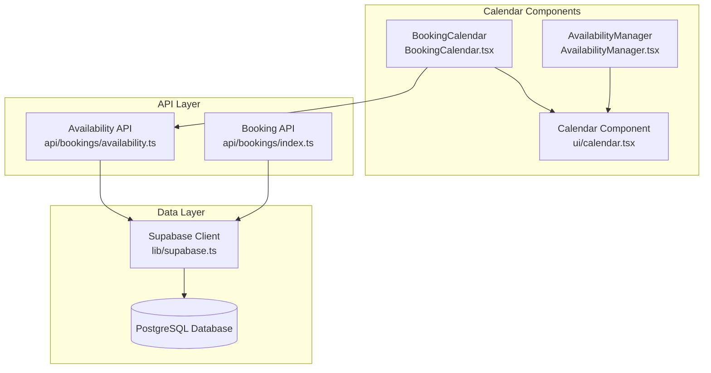
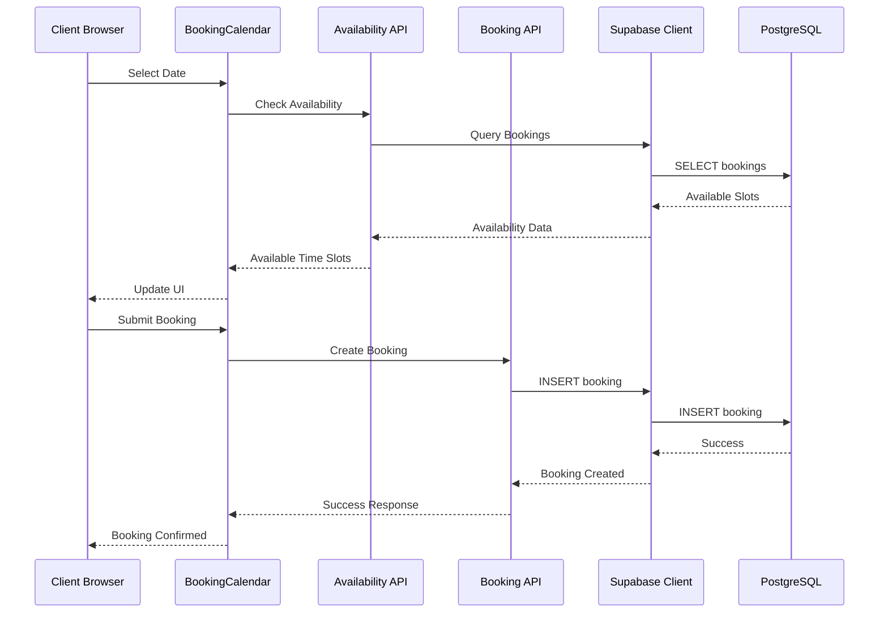
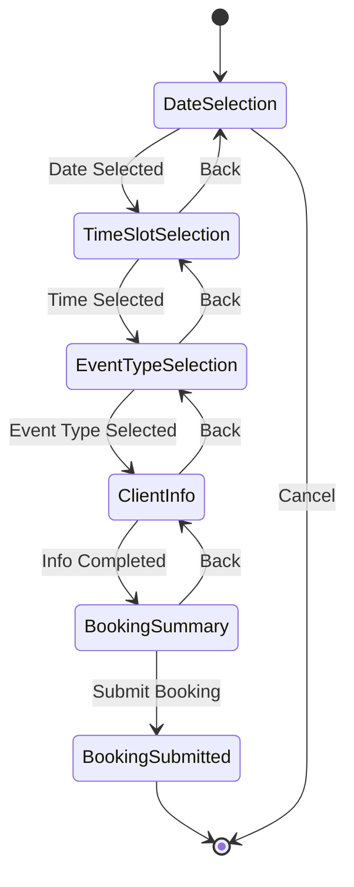
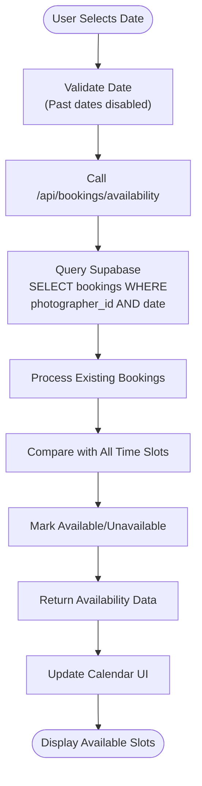
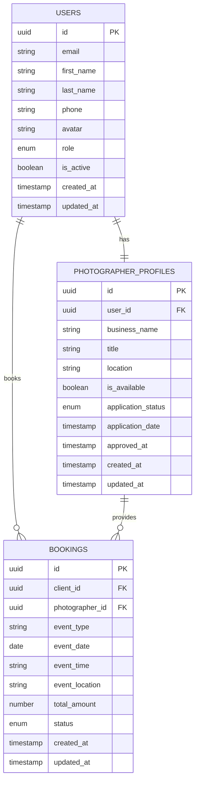

# Calendar Component Documentation

<cite>
**Referenced Files in This Document**
- [src/components/ui/calendar.tsx](file://src/components/ui/calendar.tsx)
- [src/components/BookingCalendar.tsx](file://src/components/BookingCalendar.tsx)
- [src/components/AvailabilityManager.tsx](file://src/components/AvailabilityManager.tsx)
- [pages/api/bookings/availability.ts](file://pages/api/bookings/availability.ts)
- [pages/api/bookings/index.ts](file://pages/api/bookings/index.ts)
- [src/lib/supabase.ts](file://src/lib/supabase.ts)
- [BOOKING_CALENDAR_GUIDE.md](file://BOOKING_CALENDAR_GUIDE.md)
- [test-booking-calendar.js](file://test-booking-calendar.js)
</cite>

## Table of Contents
1. [Introduction](#introduction)
2. [Project Structure](#project-structure)
3. [Core Components](#core-components)
4. [Architecture Overview](#architecture-overview)
5. [Detailed Component Analysis](#detailed-component-analysis)
6. [Supabase Integration](#supabase-integration)
7. [Time Zone Handling](#time-zone-handling)
8. [Performance Considerations](#performance-considerations)
9. [Troubleshooting Guide](#troubleshooting-guide)
10. [Conclusion](#conclusion)

## Introduction

The SnapEvent Calendar System provides a comprehensive solution for managing photographer availability and client bookings through an interactive calendar interface. Built with React and TypeScript, the system integrates seamlessly with Supabase for real-time data management and employs modern UI patterns for optimal user experience.

The calendar system consists of three primary components:
- **Calendar Component**: A customizable date picker built on react-day-picker
- **BookingCalendar**: A multi-step booking interface with availability checking
- **AvailabilityManager**: Photographer-facing tool for managing blocked dates

## Project Structure

The calendar system is organized within the `src/components` directory with clear separation of concerns:



**Diagram sources**
- [src/components/ui/calendar.tsx](file://src/components/ui/calendar.tsx#L1-L76)
- [src/components/BookingCalendar.tsx](file://src/components/BookingCalendar.tsx#L1-L50)
- [src/components/AvailabilityManager.tsx](file://src/components/AvailabilityManager.tsx#L1-L50)

**Section sources**
- [src/components/ui/calendar.tsx](file://src/components/ui/calendar.tsx#L1-L76)
- [src/components/BookingCalendar.tsx](file://src/components/BookingCalendar.tsx#L1-L384)
- [src/components/AvailabilityManager.tsx](file://src/components/AvailabilityManager.tsx#L1-L203)

## Core Components

### Calendar Component

The base Calendar component provides a foundation for date selection with extensive customization capabilities:

```typescript
interface CalendarProps {
  className?: string;
  classNames?: Record<string, string>;
  showOutsideDays?: boolean;
  mode?: "single" | "multiple" | "range";
  selected?: Date | Date[];
  onSelect?: (date: Date | undefined) => void;
  disabled?: ((date: Date) => boolean) | Date[];
}
```

Key features include:
- **Customizable Styling**: Tailwind CSS integration with theme-aware variants
- **Multiple Modes**: Single date, multiple dates, and date range selection
- **Responsive Design**: Adapts to different screen sizes
- **Accessibility**: Full ARIA compliance with keyboard navigation

### BookingCalendar Component

The BookingCalendar serves as the primary booking interface with sophisticated state management:

```typescript
interface BookingCalendarProps {
  photographerId: string;
  photographerName: string;
  photographerLocation: string;
  photographerPhone: string;
  photographerEmail: string;
  onBookingSubmit: (bookingData: BookingData) => void;
  onClose: () => void;
}
```

**Section sources**
- [src/components/ui/calendar.tsx](file://src/components/ui/calendar.tsx#L10-L76)
- [src/components/BookingCalendar.tsx](file://src/components/BookingCalendar.tsx#L25-L40)

## Architecture Overview

The calendar system follows a layered architecture with clear separation between presentation, business logic, and data persistence:



**Diagram sources**
- [src/components/BookingCalendar.tsx](file://src/components/BookingCalendar.tsx#L80-L120)
- [pages/api/bookings/availability.ts](file://pages/api/bookings/availability.ts#L10-L50)
- [pages/api/bookings/index.ts](file://pages/api/bookings/index.ts#L40-L100)

## Detailed Component Analysis

### BookingCalendar Implementation

The BookingCalendar implements a sophisticated multi-step booking process with real-time availability checking:



**Diagram sources**
- [src/components/BookingCalendar.tsx](file://src/components/BookingCalendar.tsx#L200-L384)

#### Time Slot Management

The system defines predefined time slots with dynamic pricing:

```typescript
const TIME_SLOTS: TimeSlot[] = [
  { id: 'morning-1', time: '09:00 AM', available: true, price: 150 },
  { id: 'morning-2', time: '10:00 AM', available: true, price: 150 },
  { id: 'morning-3', time: '11:00 AM', available: true, price: 150 },
  { id: 'afternoon-1', time: '12:00 PM', available: true, price: 175 },
  { id: 'afternoon-2', time: '01:00 PM', available: true, price: 175 },
  { id: 'afternoon-3', time: '02:00 PM', available: true, price: 175 },
  { id: 'afternoon-4', time: '03:00 PM', available: true, price: 175 },
  { id: 'evening-1', time: '04:00 PM', available: true, price: 200 },
  { id: 'evening-2', time: '05:00 PM', available: true, price: 200 },
  { id: 'evening-3', time: '06:00 PM', available: true, price: 200 },
];
```

#### Event Type Configuration

Different photography services with base pricing:

```typescript
const EVENT_TYPES = [
  { id: 'wedding', name: 'Wedding', basePrice: 200 },
  { id: 'portrait', name: 'Portrait Session', basePrice: 150 },
  { id: 'event', name: 'Event Photography', basePrice: 175 },
  { id: 'commercial', name: 'Commercial', basePrice: 250 },
];
```

**Section sources**
- [src/components/BookingCalendar.tsx](file://src/components/BookingCalendar.tsx#L43-L76)
- [src/components/BookingCalendar.tsx](file://src/components/BookingCalendar.tsx#L78-L85)

### Availability Checking System

The availability system performs real-time checks against the database:



**Diagram sources**
- [pages/api/bookings/availability.ts](file://pages/api/bookings/availability.ts#L15-L60)

**Section sources**
- [src/components/BookingCalendar.tsx](file://src/components/BookingCalendar.tsx#L80-L120)
- [pages/api/bookings/availability.ts](file://pages/api/bookings/availability.ts#L15-L60)

### AvailabilityManager Component

The AvailabilityManager allows photographers to manage blocked dates:

```typescript
interface BlockedDate {
  id: string;
  date: string;
  reason: string;
  timeSlots?: string[];
}
```

Features include:
- **Date Blocking**: Photographers can block specific dates with custom reasons
- **Visual Indicators**: Blocked dates visually marked on the calendar
- **Unblocking**: Easy removal of blocked dates
- **Real-time Updates**: Immediate UI updates without page refresh

**Section sources**
- [src/components/AvailabilityManager.tsx](file://src/components/AvailabilityManager.tsx#L15-L30)
- [src/components/AvailabilityManager.tsx](file://src/components/AvailabilityManager.tsx#L100-L150)

## Supabase Integration

The system integrates with Supabase for robust data management:

### Database Schema



**Diagram sources**
- [src/lib/supabase.ts](file://src/lib/supabase.ts#L15-L150)

### API Endpoints

#### Availability Check Endpoint

```typescript
// GET /api/bookings/availability?photographerId=123&date=2024-02-15
{
  "date": "2024-02-15",
  "photographerId": "123",
  "availability": [
    { "id": "morning-1", "time": "09:00 AM", "available": true, "price": 150 },
    { "id": "morning-2", "time": "10:00 AM", "available": false, "price": 150 }
  ],
  "totalSlots": 10,
  "availableSlots": 8
}
```

#### Booking Creation Endpoint

```typescript
// POST /api/bookings
{
  "photographerId": "123",
  "clientId": "456",
  "eventType": "Wedding",
  "eventDate": "2024-02-15",
  "eventTime": "10:00 AM",
  "eventLocation": "Golden Gate Park",
  "totalAmount": 350,
  "clientName": "John Doe",
  "clientEmail": "john@example.com",
  "clientPhone": "+1 (555) 123-4567",
  "notes": "Outdoor wedding ceremony",
  "status": "pending"
}
```

**Section sources**
- [pages/api/bookings/availability.ts](file://pages/api/bookings/availability.ts#L10-L69)
- [pages/api/bookings/index.ts](file://pages/api/bookings/index.ts#L40-L120)

## Time Zone Handling

The system handles time zones through careful date processing:

### Date Processing Strategy

1. **Server-side Storage**: All dates stored in UTC format
2. **Client-side Display**: Local time zone conversion for user display
3. **Validation**: Time slot validation based on photographer's local time
4. **Conflict Detection**: Cross-timezone booking conflict prevention

### Edge Cases

- **Overlapping Bookings**: System prevents double booking during the same time slot
- **Time Zone Differences**: Clear communication of time differences
- **Daylight Saving**: Automatic adjustment for DST changes
- **Leap Years**: Proper handling of February 29th

## Performance Considerations

### Month-Level Queries

To optimize performance for large date ranges:

```typescript
// Efficient monthly availability checking
const checkMonthAvailability = async (photographerId: string, year: number, month: number) => {
  const startDate = new Date(year, month, 1);
  const endDate = new Date(year, month + 1, 0);
  
  const { data: bookings, error } = await supabase
    .from('bookings')
    .select('event_date, event_time')
    .eq('photographer_id', photographerId)
    .gte('event_date', startDate.toISOString().split('T')[0])
    .lte('event_date', endDate.toISOString().split('T')[0])
    .eq('status', 'confirmed');
    
  return bookings;
};
```

### Rendering Optimization

- **Virtual Scrolling**: For large date ranges, consider virtual scrolling
- **Memoization**: Use React.memo for expensive calculations
- **Debouncing**: Debounce API calls during rapid date selection
- **Caching**: Implement client-side caching for frequently accessed data

### Bundle Size Impact

The calendar system adds minimal overhead:
- **Base Calendar**: ~2KB (react-day-picker + custom styling)
- **Booking System**: ~5KB (additional components and dependencies)
- **Supabase Integration**: ~1KB (client library)

## Troubleshooting Guide

### Common Issues

#### Availability Not Loading

**Symptoms**: Calendar shows all slots as available despite existing bookings

**Causes**:
- Supabase connection issues
- Incorrect API endpoint configuration
- Network connectivity problems

**Solutions**:
1. Check Supabase connection in browser console
2. Verify API endpoint accessibility
3. Enable debug logging:
```typescript
const DEBUG = process.env.NODE_ENV === 'development';
if (DEBUG) {
  console.log('Availability check:', { photographerId, date });
}
```

#### Booking Submission Fails

**Symptoms**: Booking form submits but receives error response

**Causes**:
- Missing required fields
- Network connectivity issues
- API endpoint misconfiguration

**Solutions**:
1. Validate all required fields before submission
2. Check network connection stability
3. Verify API endpoint is responding correctly

#### Calendar Not Displaying

**Symptoms**: Calendar component renders but shows no dates

**Causes**:
- date-fns library not installed
- Calendar component import issues
- CSS conflicts

**Solutions**:
1. Install date-fns: `npm install date-fns`
2. Verify Calendar import: `import { Calendar } from './ui/calendar'`
3. Check for CSS conflicts in Tailwind configuration

### Debug Mode

Enable comprehensive debugging:

```typescript
const enableDebugMode = () => {
  if (process.env.NODE_ENV === 'development') {
    console.log('📅 Calendar Debug Mode Enabled');
    console.log('Selected Date:', selectedDate);
    console.log('Available Time Slots:', availableTimeSlots);
    console.log('Booking Data:', bookingData);
  }
};
```

**Section sources**
- [BOOKING_CALENDAR_GUIDE.md](file://BOOKING_CALENDAR_GUIDE.md#L270-L315)
- [test-booking-calendar.js](file://test-booking-calendar.js#L158-L197)

## Conclusion

The SnapEvent Calendar System provides a robust, scalable solution for photography booking management. Key strengths include:

- **Real-time Availability**: Seamless integration with Supabase for live data updates
- **User-friendly Interface**: Intuitive multi-step booking process
- **Photographer Control**: Comprehensive availability management tools
- **Performance Optimization**: Efficient date range queries and caching strategies
- **Extensibility**: Modular architecture supporting future enhancements

The system successfully balances functionality with performance, providing photographers and clients with a professional booking experience while maintaining scalability for growth.

Future enhancements could include payment integration, calendar sync capabilities, and advanced scheduling features to further enhance the user experience.