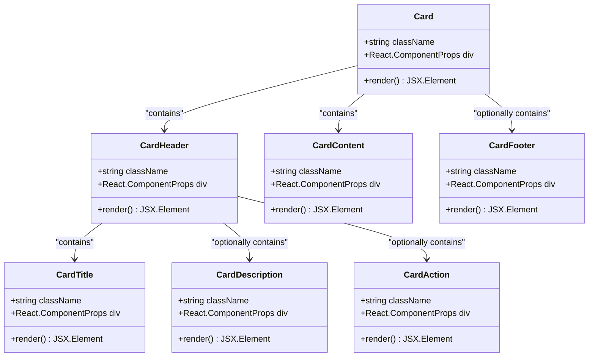

# Card Component Documentation

<cite>
**Referenced Files in This Document**
- [card.tsx](file://src/components/ui/card.tsx)
- [utils.ts](file://src/components/ui/utils.ts)
- [ImageWithFallback.tsx](file://src/components/figma/ImageWithFallback.tsx)
- [PortfolioPage.tsx](file://src/components/PortfolioPage.tsx)
- [LandingPage.tsx](file://src/components/LandingPage.tsx)
- [button.tsx](file://src/components/ui/button.tsx)
- [api.ts](file://src/lib/api.ts)
- [tailwind.config.js](file://tailwind.config.js)
- [index.css](file://src/index.css)
</cite>

## Table of Contents
1. [Introduction](#introduction)
2. [Component Architecture](#component-architecture)
3. [Core Implementation](#core-implementation)
4. [Props and Customization](#props-and-customization)
5. [Integration Examples](#integration-examples)
6. [Accessibility Features](#accessibility-features)
7. [Performance Considerations](#performance-considerations)
8. [Extending the Component](#extending-the-component)
9. [Best Practices](#best-practices)
10. [Troubleshooting](#troubleshooting)

## Introduction

The Card component is a versatile, responsive UI element designed for displaying photographer profiles, portfolio items, and booking summaries in the SnapEvent platform. Built with Tailwind CSS for modern styling and React TypeScript for type safety, the Card component follows a modular architecture that promotes reusability and maintainability across different contexts.

The component system consists of six interconnected parts: the main Card container, CardHeader for metadata, CardTitle for headings, CardDescription for explanatory text, CardAction for interactive elements, CardContent for primary content areas, and CardFooter for supplementary information. This design enables flexible composition while maintaining consistent visual hierarchy and responsive behavior.

## Component Architecture

The Card component follows a composite pattern where individual components work together to create a cohesive card interface. Each sub-component serves a specific semantic purpose and contributes to the overall structure.



**Diagram sources**
- [card.tsx](file://src/components/ui/card.tsx#L1-L93)

**Section sources**
- [card.tsx](file://src/components/ui/card.tsx#L1-L93)

## Core Implementation

### Base Card Component

The main Card component serves as the foundational container with essential styling and layout properties:

```typescript
function Card({ className, ...props }: React.ComponentProps<"div">) {
  return (
    <div
      data-slot="card"
      className={cn(
        "bg-card text-card-foreground flex flex-col gap-6 rounded-xl border",
        className,
      )}
      {...props}
    />
  );
}
```

Key implementation details:
- Uses Tailwind CSS utility classes for consistent styling
- Implements responsive design with flexbox layout
- Includes semantic `data-slot` attributes for testing and debugging
- Extends React's native div component with full prop support

### Utility Functions

The component leverages a sophisticated utility function for class name merging:

```typescript
import { clsx, type ClassValue } from "clsx";
import { twMerge } from "tailwind-merge";

export function cn(...inputs: ClassValue[]) {
  return twMerge(clsx(inputs));
}
```

This utility combines clsx for conditional class application with tailwind-merge for conflict resolution, ensuring optimal CSS output.

### Responsive Design System

The Card component integrates with Tailwind's responsive design system through CSS custom properties and container queries:

```css
@container/card-header grid auto-rows-min grid-rows-[auto_auto] items-start gap-1.5 px-6 pt-6 has-data-[slot=card-action]:grid-cols-[1fr_auto] [.border-b]:pb-6
```

This approach enables adaptive layouts that respond to content structure and parent container constraints.

**Section sources**
- [card.tsx](file://src/components/ui/card.tsx#L1-L93)
- [utils.ts](file://src/components/ui/utils.ts#L1-L7)

## Props and Customization

### Core Props Interface

The Card component supports extensive customization through its props interface:

```typescript
interface CardProps {
  className?: string;
  children?: React.ReactNode;
  [key: string]: any; // Spread operator support
}
```

### Sub-Component Props

Each sub-component inherits from React.ComponentProps<"div">, providing full HTML div capabilities:

```typescript
// CardHeader props
interface CardHeaderProps {
  className?: string;
  children?: React.ReactNode;
}

// CardTitle props  
interface CardTitleProps {
  className?: string;
  children?: React.ReactNode;
}

// CardDescription props
interface CardDescriptionProps {
  className?: string;
  children?: React.ReactNode;
}

// CardAction props
interface CardActionProps {
  className?: string;
  children?: React.ReactNode;
}

// CardContent props
interface CardContentProps {
  className?: string;
  children?: React.ReactNode;
}

// CardFooter props
interface CardFooterProps {
  className?: string;
  children?: React.ReactNode;
}
```

### Styling Customization Options

The component supports various customization approaches:

1. **Tailwind Classes**: Direct Tailwind CSS class application
2. **CSS Variables**: Theme-aware styling through CSS custom properties
3. **Component Composition**: Building complex layouts from basic components
4. **Responsive Breakpoints**: Automatic adaptation to screen sizes

Example customization scenarios:

```typescript
// Custom card with gradient background
<Card className="bg-gradient-to-br from-blue-500 to-purple-600 text-white">
  <CardHeader>
    <CardTitle>Custom Styled Card</CardTitle>
  </CardHeader>
  <CardContent>
    <p>This card uses custom styling with gradients.</p>
  </CardContent>
</Card>

// Responsive card with different layouts
<Card className="@container/card-header">
  <CardHeader>
    <CardTitle>Responsive Layout</CardTitle>
    <CardAction>
      <Button size="sm">Action</Button>
    </CardAction>
  </CardHeader>
  <CardContent>
    <p>This card adapts its layout based on container width.</p>
  </CardContent>
</Card>
```

**Section sources**
- [card.tsx](file://src/components/ui/card.tsx#L1-L93)

## Integration Examples

### Portfolio Page Integration

The Card component is extensively used in the PortfolioPage to display photographer portfolio items:

```typescript
// Portfolio item card with hover effects
<Card key={item.id} className="group cursor-pointer overflow-hidden hover:shadow-lg transition-all duration-300">
  <CardContent className="p-0">
    <div className="relative overflow-hidden">
      <ImageWithFallback
        src={item.image}
        alt={item.title}
        className="w-full h-64 object-cover group-hover:scale-105 transition-transform duration-300"
      />
      <div className="absolute inset-0 bg-black/40 opacity-0 group-hover:opacity-100 transition-opacity duration-300 flex items-center justify-center">
        <Button variant="ghost" size="icon">
          <EyeIcon />
        </Button>
      </div>
    </div>
  </CardContent>
</Card>
```

### Landing Page Integration

In the LandingPage, cards are used to showcase trending photographers with interactive elements:

```typescript
// Trending photographer card with animations
<Card className="group hover:scale-102 transition-transform duration-300">
  <CardContent className="p-0">
    <ImageWithFallback
      src={photographer.image}
      alt={`${photographer.businessName}'s profile`}
      className="w-full h-48 object-cover"
    />
  </CardContent>
  <CardHeader>
    <CardTitle>{photographer.businessName}</CardTitle>
    <CardDescription>{photographer.title}</CardDescription>
  </CardHeader>
  <CardFooter>
    <Badge variant="secondary">{photographer.specialties[0]}</Badge>
    <Button 
      size="sm" 
      className="ml-auto"
      onClick={() => onPhotographerSelect(photographer.id)}
    >
      View Profile
    </Button>
  </CardFooter>
</Card>
```

### Booking Summary Cards

Cards are used throughout the booking process to display service information and booking details:

```typescript
// Booking summary card
<Card className="border-l-4 border-primary">
  <CardHeader>
    <CardTitle className="text-lg">{service.name}</CardTitle>
    <CardDescription>{service.description}</CardDescription>
  </CardHeader>
  <CardContent>
    <div className="space-y-2">
      <p><span className="font-medium">Price:</span> {service.price}</p>
      <p><span className="font-medium">Duration:</span> {service.duration}</p>
      <p><span className="font-medium">Deliverables:</span> {service.deliverables}</p>
    </div>
  </CardContent>
</Card>
```

**Section sources**
- [PortfolioPage.tsx](file://src/components/PortfolioPage.tsx#L512-L537)
- [LandingPage.tsx](file://src/components/LandingPage.tsx#L1-L199)
- [PortfolioPage.tsx](file://src/components/PortfolioPage.tsx#L479-L513)

## Accessibility Features

### Semantic HTML Structure

The Card component uses semantic HTML elements and ARIA attributes to ensure accessibility:

```typescript
// Semantic slot attributes for testing
<div data-slot="card" className="...">
<div data-slot="card-header" className="...">
<h4 data-slot="card-title" className="...">
<p data-slot="card-description" className="...">
<div data-slot="card-action" className="...">
<div data-slot="card-content" className="...">
<div data-slot="card-footer" className="...">
```

### Focus Management

The component integrates with the Button component to provide proper focus management:

```typescript
// Button with focus-visible styles
<Button
  className="focus-visible:border-ring focus-visible:ring-ring/50 focus-visible:ring-[3px]"
  variant="outline"
>
  Action
</Button>
```

### Screen Reader Support

The component structure ensures proper reading order for screen readers:

1. CardHeader appears first, containing title and description
2. CardContent contains the main content
3. CardAction provides interactive elements
4. CardFooter contains supplementary information

### Color Contrast Compliance

The component uses Tailwind's color system to ensure adequate contrast ratios:

```css
/* Tailwind color system with sufficient contrast */
--card: 0 0% 100%;
--card-foreground: 222.2 84% 4.9%;
--primary: 222.2 47.4% 11.2%;
--primary-foreground: 210 40% 98%;
```

**Section sources**
- [card.tsx](file://src/components/ui/card.tsx#L1-L93)
- [button.tsx](file://src/components/ui/button.tsx#L1-L59)
- [index.css](file://src/index.css#L1-L59)

## Performance Considerations

### Rendering Optimization

The Card component is designed for efficient rendering in large lists:

```typescript
// Efficient list rendering with React.memo
const PortfolioGrid = memo(({ items }: { items: PortfolioItem[] }) => (
  <div className="grid grid-cols-1 md:grid-cols-2 lg:grid-cols-3 gap-6">
    {items.map(item => (
      <Card key={item.id} className="overflow-hidden">
        {/* Card content */}
      </Card>
    ))}
  </div>
))
```

### Memory Management

The component minimizes memory usage through:

1. **Lightweight Props**: Minimal prop requirements
2. **Efficient Styling**: Optimized CSS class generation
3. **Conditional Rendering**: Smart content display based on props

### Bundle Size Impact

The component contributes minimal bundle size overhead:

```typescript
// Tree-shakable imports
import { Card, CardHeader, CardTitle, CardDescription, CardContent, CardFooter } from './ui/card';
```

### Large List Performance

For rendering large lists of cards, consider these optimizations:

```typescript
// Virtual scrolling for large datasets
import { Virtuoso } from 'react-virtuoso';

<Virtuoso
  data={largePhotographerList}
  itemContent={(index, photographer) => (
    <Card key={photographer.id}>
      {/* Card content */}
    </Card>
  )}
/>
```

**Section sources**
- [card.tsx](file://src/components/ui/card.tsx#L1-L93)

## Extending the Component

### New Use Cases

The Card component architecture supports easy extension for new use cases:

#### Promotional Content Cards

```typescript
// Promotional card with discount badges
interface PromoCardProps {
  discount: string;
  expiresAt: Date;
  children: React.ReactNode;
}

const PromoCard: React.FC<PromoCardProps> = ({ discount, expiresAt, children }) => (
  <Card className="relative overflow-hidden">
    <Badge className="absolute top-2 right-2 bg-primary/90">
      {discount} OFF
    </Badge>
    <CardContent className="p-6">
      {children}
    </CardContent>
    <CardFooter className="text-sm text-muted-foreground">
      Expires: {expiresAt.toLocaleDateString()}
    </CardFooter>
  </Card>
);
```

#### Featured Photographer Cards

```typescript
// Featured photographer card with premium indicators
interface FeaturedCardProps {
  photographer: Photographer;
  isPremium: boolean;
}

const FeaturedCard: React.FC<FeaturedCardProps> = ({ photographer, isPremium }) => (
  <Card className="border-2 border-primary/20">
    <CardContent className="p-0">
      <ImageWithFallback
        src={photographer.image}
        alt={`${photographer.businessName}'s profile`}
        className="w-full h-48 object-cover"
      />
    </CardContent>
    <CardHeader>
      <CardTitle>{photographer.businessName}</CardTitle>
      <CardDescription>{photographer.title}</CardDescription>
      {isPremium && (
        <Badge variant="secondary" className="mt-2">
          Premium
        </Badge>
      )}
    </CardHeader>
    <CardFooter>
      <StarIcon className="h-4 w-4 text-yellow-400" />
      <span className="ml-1">{photographer.rating}</span>
      <span className="ml-2">({photographer.reviews} reviews)</span>
    </CardFooter>
  </Card>
);
```

### Custom Variants

Create custom variants for specific use cases:

```typescript
// Custom card variant for testimonials
const TestimonialCard = ({ testimonial }: { testimonial: Testimonial }) => (
  <Card className="bg-muted/50 border-l-4 border-primary/20">
    <CardHeader>
      <CardTitle className="text-sm">{testimonial.name}</CardTitle>
      <CardDescription className="text-xs">
        {testimonial.event} - {testimonial.rating}/5 stars
      </CardDescription>
    </CardHeader>
    <CardContent>
      <blockquote className="text-sm italic">
        "{testimonial.comment}"
      </blockquote>
    </CardContent>
  </Card>
);
```

### Integration Patterns

The component supports various integration patterns:

1. **Composition Pattern**: Building complex cards from basic components
2. **Decorator Pattern**: Adding functionality through higher-order components
3. **Strategy Pattern**: Different card layouts for different contexts

**Section sources**
- [card.tsx](file://src/components/ui/card.tsx#L1-L93)
- [api.ts](file://src/lib/api.ts#L200-L260)

## Best Practices

### Component Composition

Follow these composition patterns for optimal results:

```typescript
// Recommended: Semantic composition
<Card>
  <CardHeader>
    <CardTitle>Photographer Name</CardTitle>
    <CardDescription>Professional Title</CardDescription>
  </CardHeader>
  <CardContent>
    <ImageWithFallback src={photo} alt="Profile" />
  </CardContent>
  <CardFooter>
    <Button>Book Now</Button>
  </CardFooter>
</Card>

// Avoid: Overly complex single components
<Card className="complex-styling">
  {/* All content in one component */}
</Card>
```

### Styling Guidelines

1. **Use Tailwind Classes**: Leverage utility-first CSS for consistency
2. **Avoid Inline Styles**: Keep styling in CSS classes
3. **Maintain Responsive Design**: Use responsive breakpoints appropriately
4. **Consider Dark Mode**: Design with dark mode compatibility

### Performance Guidelines

1. **Memoize Components**: Use React.memo for expensive renders
2. **Lazy Load Images**: Implement lazy loading for image-heavy cards
3. **Optimize Lists**: Use virtualization for large datasets
4. **Minimize Re-renders**: Use appropriate keys and state management

### Accessibility Guidelines

1. **Semantic HTML**: Use appropriate HTML elements
2. **ARIA Attributes**: Add necessary ARIA roles and properties
3. **Keyboard Navigation**: Ensure keyboard accessibility
4. **Screen Reader Support**: Provide meaningful content structure

## Troubleshooting

### Common Issues and Solutions

#### Issue: Cards Not Responsive

**Problem**: Cards don't adapt to different screen sizes.

**Solution**: Use Tailwind's responsive utilities:

```typescript
// Correct responsive implementation
<Card className="md:grid md:grid-cols-2">
  <CardContent className="md:col-span-1">
    {/* Content */}
  </CardContent>
  <CardFooter className="md:col-span-1">
    {/* Footer */}
  </CardFooter>
</Card>
```

#### Issue: Hover Effects Not Working

**Problem**: Interactive elements don't respond to hover.

**Solution**: Ensure proper CSS class application:

```typescript
// Correct hover implementation
<Card className="group hover:shadow-lg transition-all duration-300">
  <CardContent className="group-hover:scale-105 transition-transform duration-300">
    {/* Content */}
  </CardContent>
</Card>
```

#### Issue: Image Loading Failures

**Problem**: Images fail to load and break the layout.

**Solution**: Use the integrated ImageWithFallback component:

```typescript
// Correct image handling
<ImageWithFallback
  src={imageUrl}
  alt="Photographer"
  className="w-full h-64 object-cover"
/>
```

#### Issue: Performance Problems with Large Lists

**Problem**: Rendering large lists causes performance degradation.

**Solution**: Implement virtualization:

```typescript
// Virtualized list implementation
import { Virtuoso } from 'react-virtuoso';

<Virtuoso
  data={photographerList}
  itemContent={(index, photographer) => (
    <Card key={photographer.id}>
      {/* Card content */}
    </Card>
  )}
/>
```

### Debugging Tips

1. **Use data-slot attributes**: These help identify components in development
2. **Inspect generated CSS**: Verify Tailwind classes are applied correctly
3. **Check browser console**: Look for JavaScript errors or warnings
4. **Validate HTML structure**: Ensure semantic HTML is maintained

### Testing Strategies

1. **Unit Tests**: Test component rendering and props
2. **Integration Tests**: Test component interactions
3. **Visual Regression Tests**: Ensure consistent appearance
4. **Accessibility Tests**: Verify WCAG compliance

**Section sources**
- [ImageWithFallback.tsx](file://src/components/figma/ImageWithFallback.tsx#L1-L28)
- [card.tsx](file://src/components/ui/card.tsx#L1-L93)