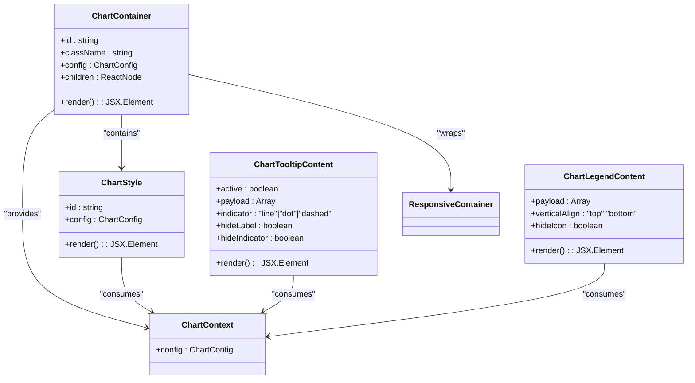
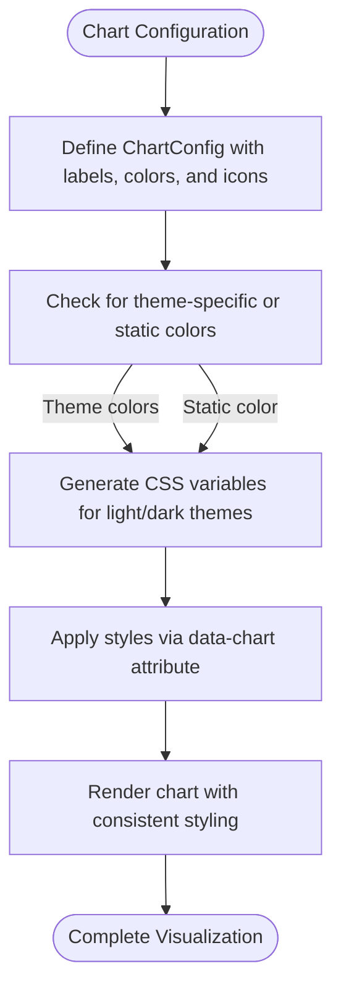
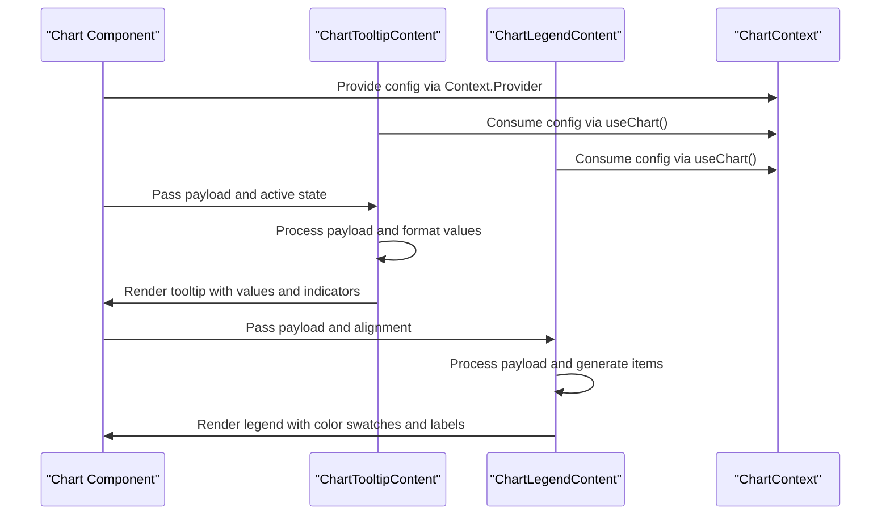

# Chart Component

<cite>
**Referenced Files in This Document**   
- [chart.tsx](file://src/components/ui/chart.tsx)
</cite>

## Table of Contents
1. [Introduction](#introduction)
2. [Core Components](#core-components)
3. [Configuration and Styling](#configuration-and-styling)
4. [Tooltip and Legend Implementation](#tooltip-and-legend-implementation)
5. [Integration and Usage](#integration-and-usage)
6. [Accessibility and Responsiveness](#accessibility-and-responsiveness)
7. [Performance Considerations](#performance-considerations)

## Introduction
The Chart component is a reusable visualization component built on top of Recharts, designed to display booking trends, availability patterns, and photographer performance metrics. It integrates seamlessly with Tailwind CSS for styling and supports dark mode through CSS variables. The component provides a flexible configuration system for customizing colors, labels, and tooltips across different chart types including bar, line, and pie charts.

**Section sources**
- [chart.tsx](file://src/components/ui/chart.tsx#L1-L354)

## Core Components

The Chart component consists of several key parts that work together to create data visualizations:

- **ChartContainer**: The main wrapper that provides context for the chart configuration and handles responsive layout
- **ChartStyle**: Dynamically generates CSS variables for chart colors based on the provided configuration
- **ChartTooltip**: Enhanced tooltip component with customizable content and styling
- **ChartLegend**: Custom legend implementation with support for icons and labels

The component uses React Context to share configuration between different parts of the chart, ensuring consistent styling and labeling across all elements. It leverages RechartsPrimitive components as the foundation while adding custom styling and behavior through Tailwind classes and CSS variables.

**Diagram sources**
- [chart.tsx](file://src/components/ui/chart.tsx#L36-L83)

**Section sources**
- [chart.tsx](file://src/components/ui/chart.tsx#L1-L354)

## Configuration and Styling

The Chart component uses a flexible configuration system through the ChartConfig type, which allows defining labels, icons, and colors for different data series. The configuration supports both static colors and theme-specific colors for light and dark modes.

Color configuration can be specified in two ways:
- Direct color values using the `color` property
- Theme-specific colors using the `theme` object with light and dark mode values

The component dynamically generates CSS variables based on the configuration, allowing for consistent styling across different chart elements. These variables are applied using data attributes and CSS selectors, ensuring that the styling is scoped to individual charts.

**Diagram sources**
- [chart.tsx](file://src/components/ui/chart.tsx#L77-L103)

**Section sources**
- [chart.tsx](file://src/components/ui/chart.tsx#L1-L354)

## Tooltip and Legend Implementation

The Chart component provides enhanced tooltip and legend functionality with customizable appearance and behavior. The tooltip displays data values with formatting options and supports different indicator styles (dot, line, or dashed). The legend displays series information with optional icons and consistent color representation.

Key features of the tooltip implementation:
- Conditional rendering based on active state and payload
- Customizable indicator styles (dot, line, dashed)
- Value formatting with locale-specific number formatting
- Support for custom formatter functions
- Accessible markup for screen readers

The legend component provides:
- Horizontal layout with consistent spacing
- Color swatches that match the chart series
- Optional icon display
- Responsive design that adapts to available space

**Diagram sources**
- [chart.tsx](file://src/components/ui/chart.tsx#L106-L292)

**Section sources**
- [chart.tsx](file://src/components/ui/chart.tsx#L1-L354)

## Integration and Usage

The Chart component is designed to be integrated with analytics data from Supabase and support real-time updates for booking statistics. While specific integration code is not present in the chart.tsx file, the component's architecture supports dynamic data updates through React's reactivity system.

To use the Chart component in photographer dashboards:
1. Wrap the chart content with ChartContainer and provide a configuration object
2. Use Recharts components (BarChart, LineChart, PieChart, etc.) within the ResponsiveContainer
3. Configure axes, labels, and tooltips according to the data being displayed
4. Connect to data sources like Supabase to populate chart data

The component supports various chart types for different visualization needs:
- Bar charts for comparing booking volume across months
- Line charts for showing trends in response rates over time
- Pie charts for displaying availability patterns

**Section sources**
- [chart.tsx](file://src/components/ui/chart.tsx#L1-L354)

## Accessibility and Responsiveness

The Chart component includes several features to ensure accessibility and responsiveness:

- Uses semantic HTML elements and ARIA attributes for screen reader compatibility
- Provides keyboard navigation support through Recharts components
- Implements responsive design using RechartsPrimitive.ResponsiveContainer
- Applies consistent text sizing with Tailwind's text-xs class
- Uses high-contrast colors for data elements
- Includes focus indicators for interactive elements

The component automatically adjusts its layout based on available space, maintaining readability across different device sizes. The aspect-video class ensures a consistent aspect ratio while allowing flexible sizing within the parent container.

**Section sources**
- [chart.tsx](file://src/components/ui/chart.tsx#L53-L83)

## Performance Considerations

The Chart component implements several performance optimizations:

- Uses React.memo and useMemo for expensive calculations
- Leverages React Context efficiently with stable references
- Minimizes re-renders through proper prop handling
- Uses CSS variables for dynamic styling instead of inline styles
- Implements virtualization through Recharts components for large datasets

For real-time data streams, the component can efficiently update visualizations by only re-rendering changed elements. The use of CSS variables for theming avoids expensive style recalculations when switching between light and dark modes.

**Section sources**
- [chart.tsx](file://src/components/ui/chart.tsx#L1-L354)