# Data Display Components

<cite>
**Referenced Files in This Document**   
- [card.tsx](file://src/components/ui/card.tsx)
- [table.tsx](file://src/components/ui/table.tsx)
- [accordion.tsx](file://src/components/ui/accordion.tsx)
- [avatar.tsx](file://src/components/ui/avatar.tsx)
- [badge.tsx](file://src/components/ui/badge.tsx)
- [chart.tsx](file://src/components/ui/chart.tsx)
- [calendar.tsx](file://src/components/ui/calendar.tsx)
- [progress.tsx](file://src/components/ui/progress.tsx)
- [skeleton.tsx](file://src/components/ui/skeleton.tsx)
- [BookingCalendar.tsx](file://src/components/BookingCalendar.tsx)
- [PortfolioPage.tsx](file://src/components/PortfolioPage.tsx)
- [api.ts](file://src/lib/api.ts)
- [utils.ts](file://src/components/ui/utils.ts)
</cite>

## Table of Contents
1. [Introduction](#introduction)
2. [Core Data Display Components](#core-data-display-components)
3. [Photographer Profile Presentation](#photographer-profile-presentation)
4. [Booking Schedule Management](#booking-schedule-management)
5. [Portfolio Item Display](#portfolio-item-display)
6. [Loading States and Skeleton Screens](#loading-states-and-skeleton-screens)
7. [Responsive Layout Considerations](#responsive-layout-considerations)
8. [Performance Optimization](#performance-optimization)
9. [Component Integration Patterns](#component-integration-patterns)
10. [Conclusion](#conclusion)

## Introduction
This document provides comprehensive documentation for the data display components used in the SnapEvent platform. The components are designed to present photographer profiles, booking schedules, and portfolio items in an intuitive and visually appealing manner. The documentation covers implementation details, integration patterns, and best practices for using these components effectively.

**Section sources**
- [card.tsx](file://src/components/ui/card.tsx)
- [table.tsx](file://src/components/ui/table.tsx)
- [accordion.tsx](file://src/components/ui/accordion.tsx)

## Core Data Display Components

### Card Component
The Card component provides a container for grouping related information with a consistent visual style. It supports multiple sub-components including CardHeader, CardTitle, CardDescription, CardContent, CardAction, and CardFooter, allowing for flexible composition of content.

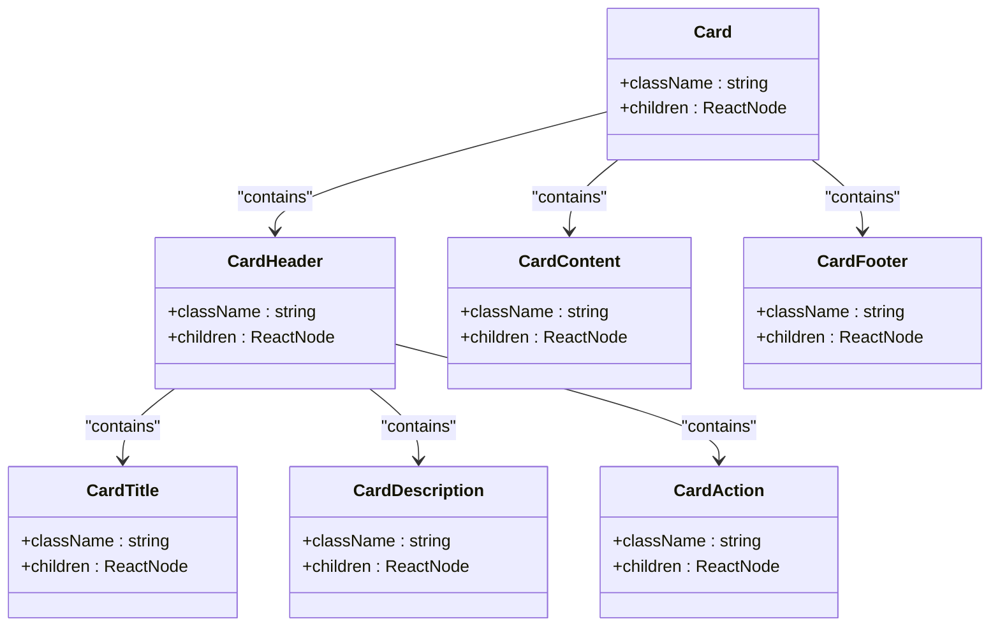

**Diagram sources**
- [card.tsx](file://src/components/ui/card.tsx)

**Section sources**
- [card.tsx](file://src/components/ui/card.tsx)

### Table Component
The Table component provides a structured way to display tabular data with responsive behavior. It includes TableHeader, TableBody, TableFooter, TableRow, TableHead, and TableCell sub-components that work together to create accessible and styled tables.

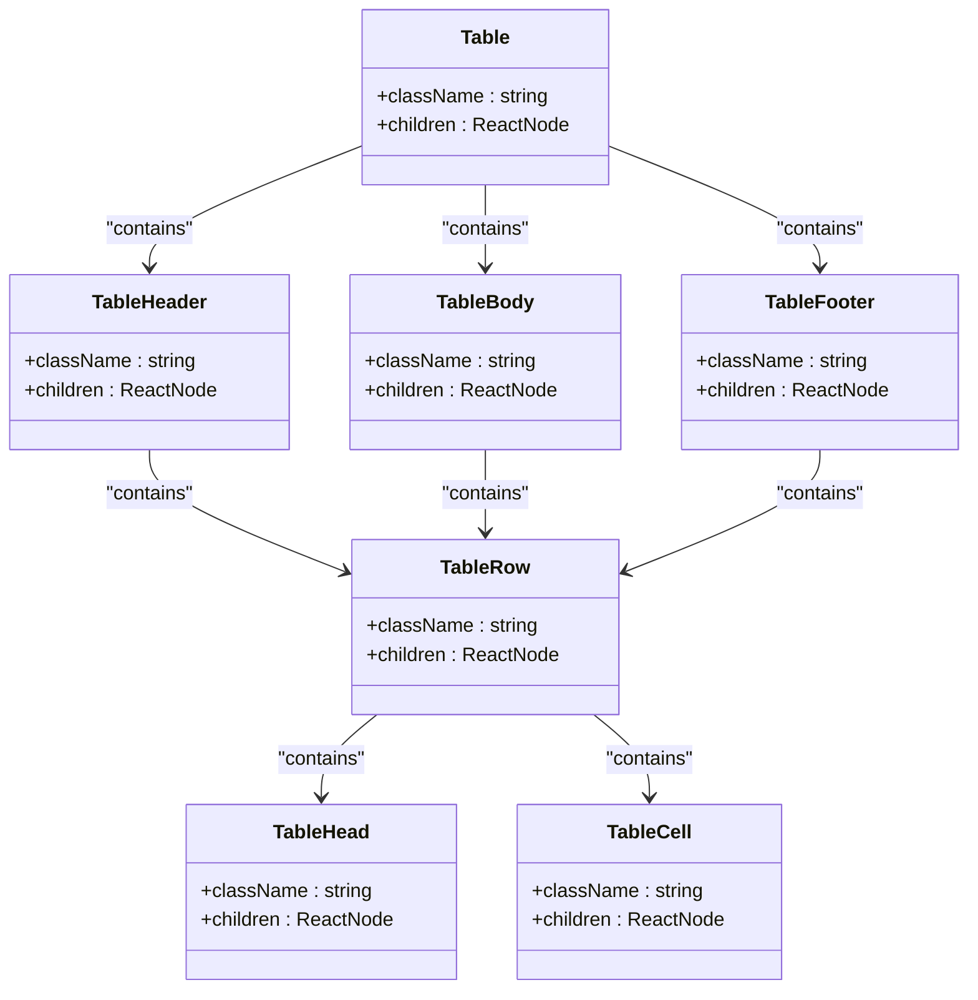

**Diagram sources**
- [table.tsx](file://src/components/ui/table.tsx)

**Section sources**
- [table.tsx](file://src/components/ui/table.tsx)

### Accordion Component
The Accordion component enables content organization through collapsible sections. It uses Radix UI's Accordion primitives to provide accessible interactions with smooth transitions between open and closed states.

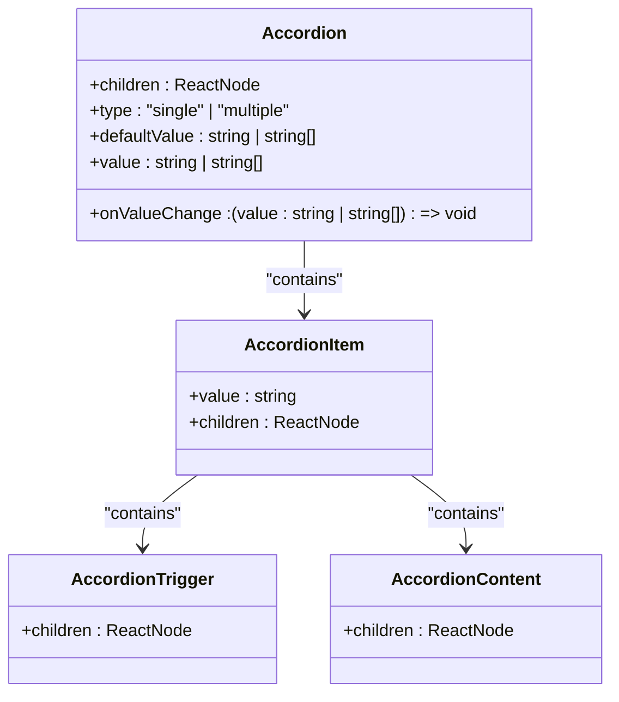

**Diagram sources**
- [accordion.tsx](file://src/components/ui/accordion.tsx)

**Section sources**
- [accordion.tsx](file://src/components/ui/accordion.tsx)

### Avatar Component
The Avatar component displays user profile images with fallback text when images are unavailable. It provides a consistent visual representation for users throughout the application.

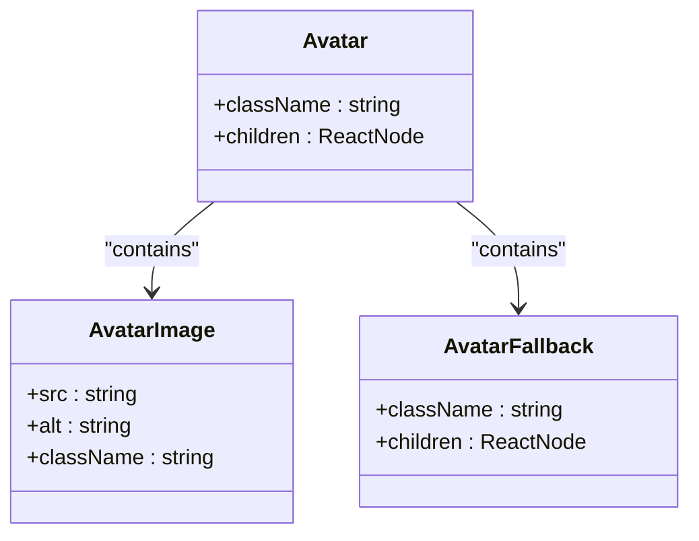

**Diagram sources**
- [avatar.tsx](file://src/components/ui/avatar.tsx)

**Section sources**
- [avatar.tsx](file://src/components/ui/avatar.tsx)

### Badge Component
The Badge component displays small pieces of information or status indicators with different visual variants. It supports custom icons and multiple styling options for different use cases.

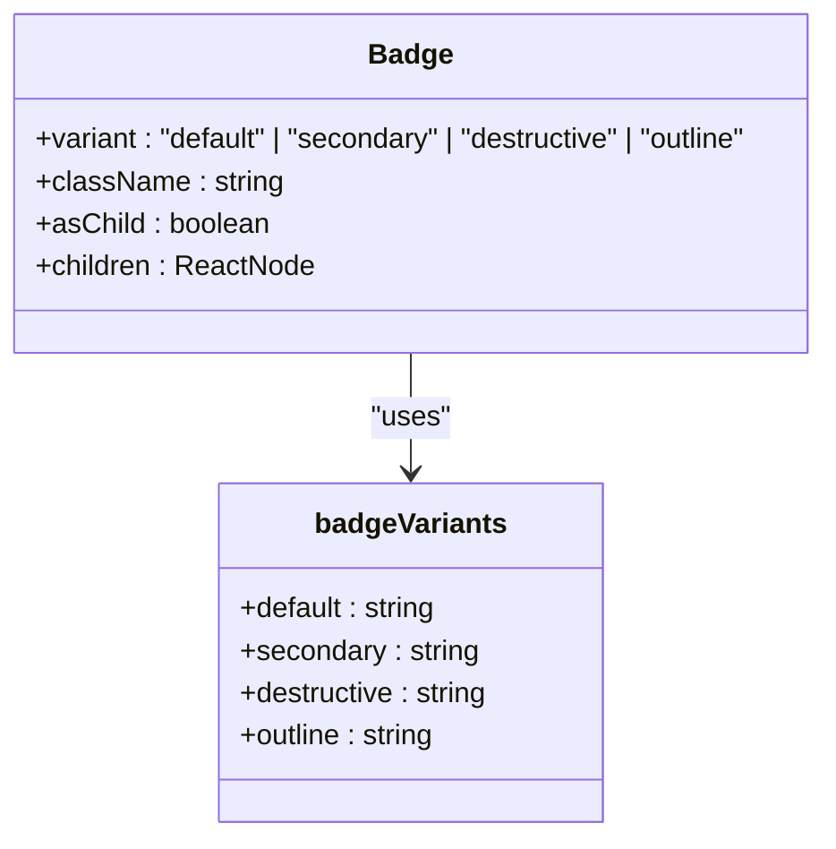

**Diagram sources**
- [badge.tsx](file://src/components/ui/badge.tsx)

**Section sources**
- [badge.tsx](file://src/components/ui/badge.tsx)

### Chart Component
The Chart component integrates Recharts for data visualization with a consistent styling system. It provides a wrapper around Recharts components with theme support and accessibility features.

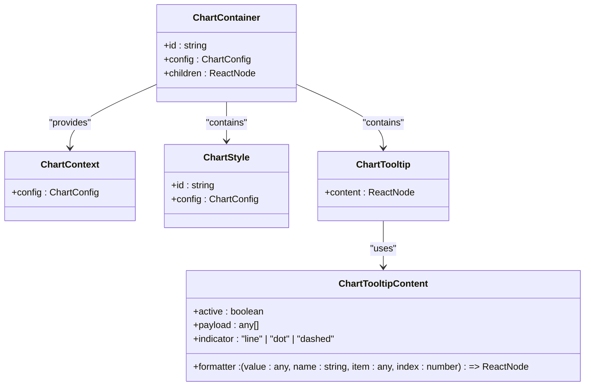

**Diagram sources**
- [chart.tsx](file://src/components/ui/chart.tsx)

**Section sources**
- [chart.tsx](file://src/components/ui/chart.tsx)

### Calendar Component
The Calendar component provides a date selection interface using React Day Picker. It includes navigation controls and visual indicators for different date states.

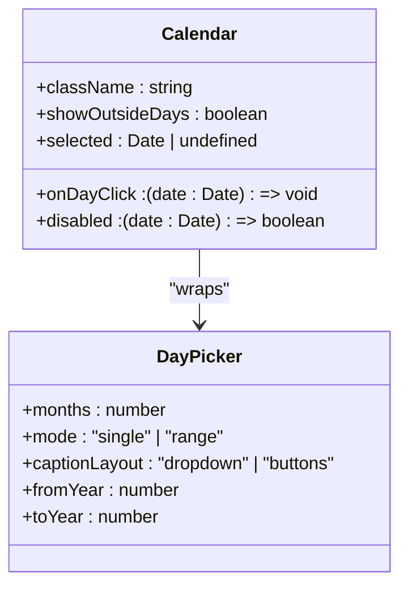

**Diagram sources**
- [calendar.tsx](file://src/components/ui/calendar.tsx)

**Section sources**
- [calendar.tsx](file://src/components/ui/calendar.tsx)

### Progress Component
The Progress component visually represents completion or progress status with a customizable bar. It uses Radix UI's Progress primitive for accessible implementation.

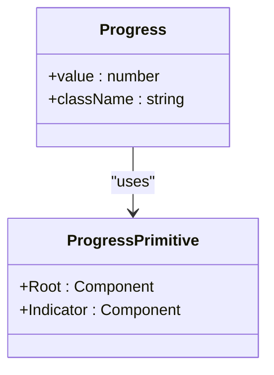

**Diagram sources**
- [progress.tsx](file://src/components/ui/progress.tsx)

**Section sources**
- [progress.tsx](file://src/components/ui/progress.tsx)

### Skeleton Component
The Skeleton component provides loading state visualization with animated placeholders. It uses CSS animations to indicate content loading.

```mermaid
classDiagram
class Skeleton {
+className : string
}
Skeleton --> "animate-pulse" : "applies"
Skeleton --> "bg-accent" : "applies"
Skeleton --> "rounded-md" : "applies"
```

**Diagram sources**
- [skeleton.tsx](file://src/components/ui/skeleton.tsx)

**Section sources**
- [skeleton.tsx](file://src/components/ui/skeleton.tsx)

## Photographer Profile Presentation

### Profile Layout Structure
The photographer profile is presented using a combination of card, avatar, badge, and other UI components to create a comprehensive view of the photographer's information, services, and portfolio.

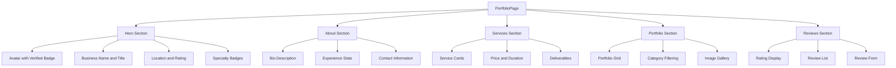

**Diagram sources**
- [PortfolioPage.tsx](file://src/components/PortfolioPage.tsx)
- [card.tsx](file://src/components/ui/card.tsx)
- [badge.tsx](file://src/components/ui/badge.tsx)
- [avatar.tsx](file://src/components/ui/avatar.tsx)

**Section sources**
- [PortfolioPage.tsx](file://src/components/PortfolioPage.tsx)

### Data Integration
The photographer profile data is retrieved from the API and displayed using the various UI components. The data structure includes business information, services, portfolio items, and ratings.

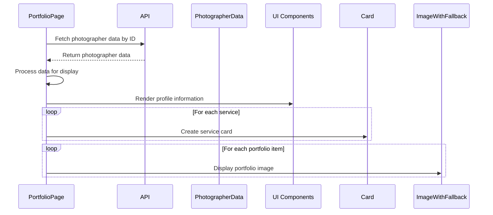

**Diagram sources**
- [PortfolioPage.tsx](file://src/components/PortfolioPage.tsx)
- [api.ts](file://src/lib/api.ts)

**Section sources**
- [PortfolioPage.tsx](file://src/components/PortfolioPage.tsx)
- [api.ts](file://src/lib/api.ts)

## Booking Schedule Management

### Booking Calendar Implementation
The BookingCalendar component integrates the Calendar component with time slot selection to enable clients to book photographer services. It manages date selection, time availability, and booking submission.

```mermaid
classDiagram
class BookingCalendar {
+photographerId : string
+photographerName : string
+photographerLocation : string
+onBookingSubmit : (bookingData : BookingData) => void
+onClose : () => void
}
class BookingData {
+eventDate : string
+eventTime : string
+eventType : string
+eventLocation : string
+clientName : string
+clientEmail : string
+clientPhone : string
+totalAmount : number
+notes? : string
}
class TimeSlot {
+id : string
+time : string
+available : boolean
+price? : number
}
BookingCalendar --> Calendar : "uses"
BookingCalendar --> Card : "uses"
BookingCalendar --> Badge : "uses"
BookingCalendar --> Button : "uses"
BookingCalendar --> "TimeSlot[]" : "manages"
BookingCalendar --> BookingData : "creates"
```

**Diagram sources**
- [BookingCalendar.tsx](file://src/components/BookingCalendar.tsx)
- [calendar.tsx](file://src/components/ui/calendar.tsx)
- [card.tsx](file://src/components/ui/card.tsx)

**Section sources**
- [BookingCalendar.tsx](file://src/components/BookingCalendar.tsx)

### Availability Integration
The booking system integrates with availability management by checking API endpoints to determine which time slots are available for booking on selected dates.

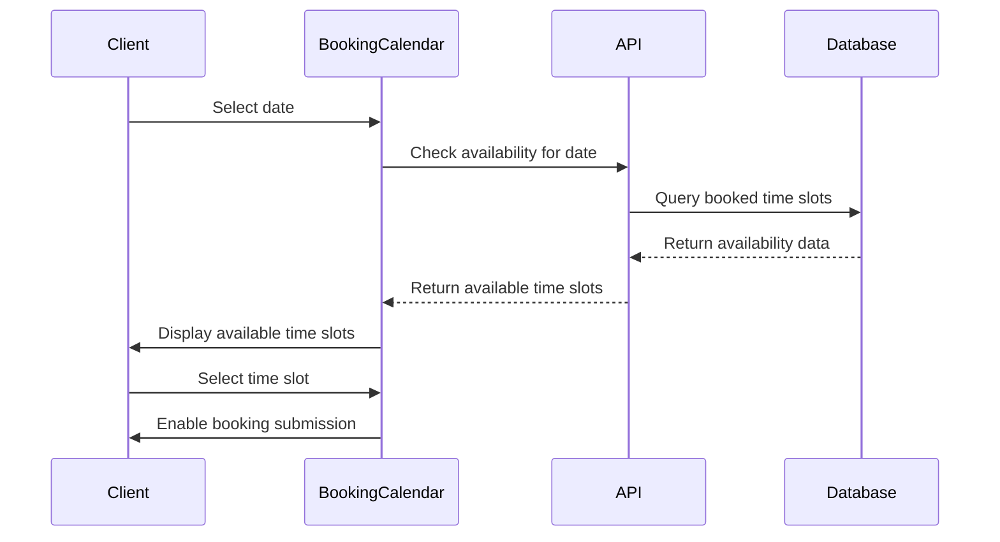

**Diagram sources**
- [BookingCalendar.tsx](file://src/components/BookingCalendar.tsx)
- [api.ts](file://src/lib/api.ts)

**Section sources**
- [BookingCalendar.tsx](file://src/components/BookingCalendar.tsx)

## Portfolio Item Display

### Portfolio Grid Layout
The portfolio items are displayed in a responsive grid layout that adapts to different screen sizes. The layout uses category filtering to allow users to view specific types of work.

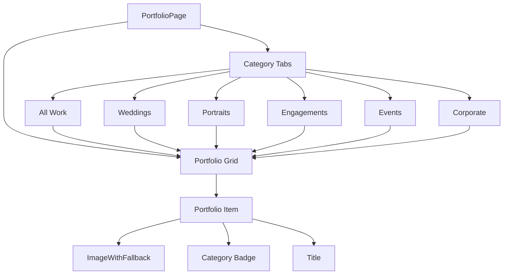

**Diagram sources**
- [PortfolioPage.tsx](file://src/components/PortfolioPage.tsx)

**Section sources**
- [PortfolioPage.tsx](file://src/components/PortfolioPage.tsx)

### Dynamic Filtering
The portfolio implements dynamic filtering based on category selection, updating the displayed items without requiring a page reload.

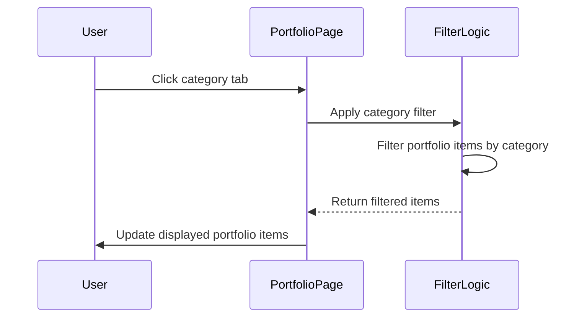

**Diagram sources**
- [PortfolioPage.tsx](file://src/components/PortfolioPage.tsx)

**Section sources**
- [PortfolioPage.tsx](file://src/components/PortfolioPage.tsx)

## Loading States and Skeleton Screens

### Skeleton Implementation
The skeleton screen components provide visual feedback during data loading, using animated placeholders that mimic the final content layout.

```mermaid
classDiagram
class SkeletonCard {
+animate : boolean
+delay : number
}
class Skeleton {
+className : string
}
SkeletonCard --> Skeleton : "uses multiple"
SkeletonCard --> "motion.div" : "wraps"
```

**Diagram sources**
- [skeleton.tsx](file://src/components/ui/skeleton.tsx)
- [PortfolioPage.tsx](file://src/components/PortfolioPage.tsx)

**Section sources**
- [skeleton.tsx](file://src/components/ui/skeleton.tsx)
- [PortfolioPage.tsx](file://src/components/PortfolioPage.tsx)

### Loading State Management
The application manages loading states through component state, displaying skeleton screens while data is being fetched from the API.

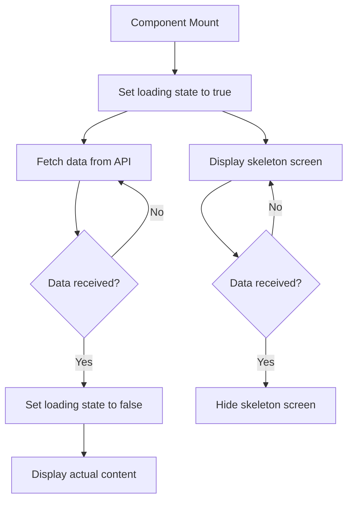

**Diagram sources**
- [PortfolioPage.tsx](file://src/components/PortfolioPage.tsx)

**Section sources**
- [PortfolioPage.tsx](file://src/components/PortfolioPage.tsx)

## Responsive Layout Considerations

### Breakpoint Strategy
The components are designed with responsive breakpoints to ensure optimal display across different device sizes, from mobile to desktop.

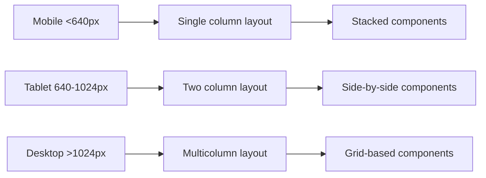

**Section sources**
- [PortfolioPage.tsx](file://src/components/PortfolioPage.tsx)
- [card.tsx](file://src/components/ui/card.tsx)

## Performance Optimization

### Large Dataset Handling
For large datasets, the components implement virtualization and lazy loading techniques to maintain performance and responsiveness.

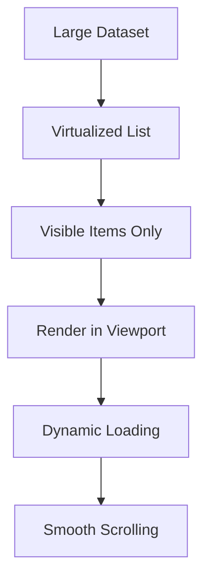

**Section sources**
- [PortfolioPage.tsx](file://src/components/PortfolioPage.tsx)

## Component Integration Patterns

### Composition Pattern
The components follow a composition pattern, allowing for flexible and reusable UI construction through component nesting and prop passing.

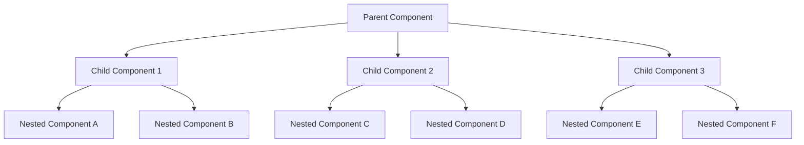

**Section sources**
- [PortfolioPage.tsx](file://src/components/PortfolioPage.tsx)
- [BookingCalendar.tsx](file://src/components/BookingCalendar.tsx)

## Conclusion
The data display components in the SnapEvent platform provide a comprehensive system for presenting photographer profiles, booking schedules, and portfolio items. Through thoughtful integration of UI components, responsive design, and performance optimization techniques, the system delivers an engaging user experience while maintaining code reusability and maintainability.

The components work together to create a cohesive interface that supports the platform's core functionality, from profile presentation to booking management. By following consistent design patterns and leveraging modern React practices, the components ensure a high-quality user experience across different devices and usage scenarios.