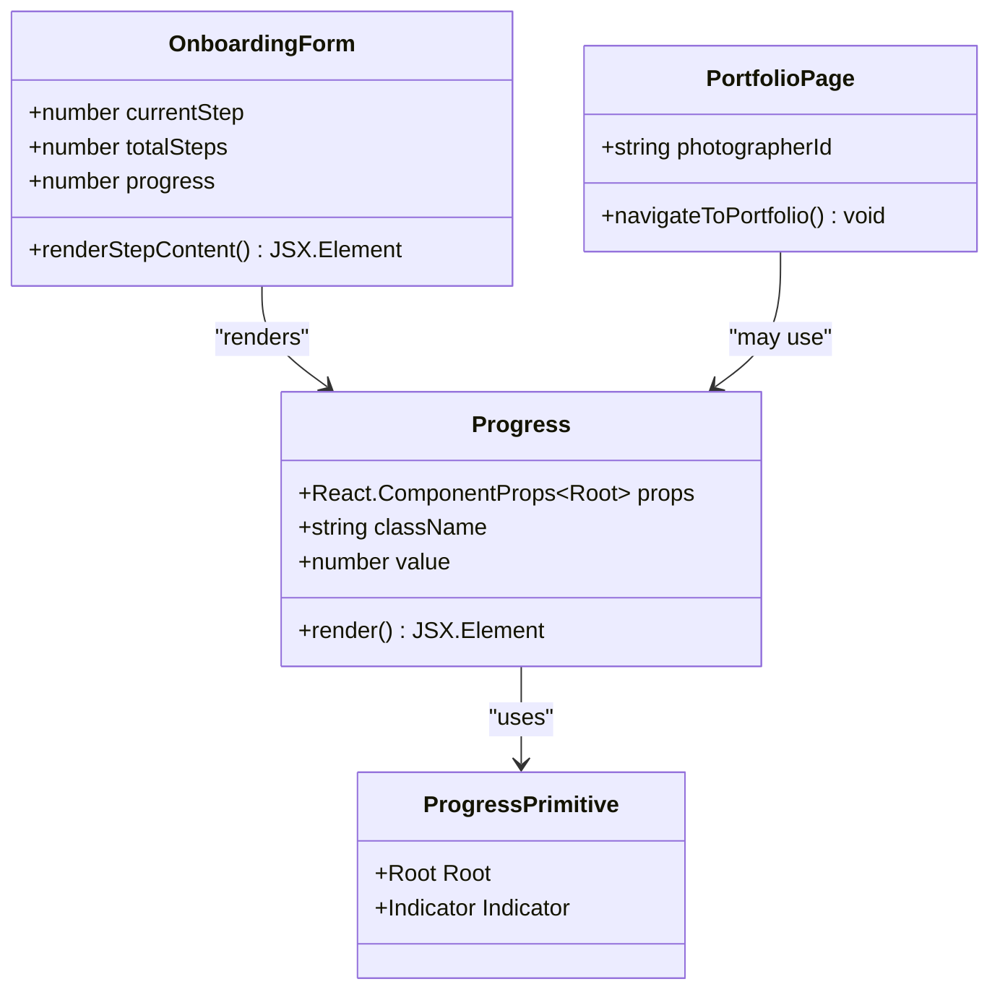

# Progress Component Documentation

<cite>
**Referenced Files in This Document**
- [progress.tsx](file://src/components/ui/progress.tsx)
- [OnboardingForm.tsx](file://src/components/OnboardingForm.tsx)
- [setup.tsx](file://pages/profile/setup.tsx)
- [ANIMATIONS_SUMMARY.md](file://ANIMATIONS_SUMMARY.md)
- [package.json](file://package.json)
</cite>

## Table of Contents
1. [Introduction](#introduction)
2. [Component Architecture](#component-architecture)
3. [Implementation Details](#implementation-details)
4. [Usage Examples](#usage-examples)
5. [Props and Configuration](#props-and-configuration)
6. [Accessibility Features](#accessibility-features)
7. [Customization Options](#customization-options)
8. [Performance Considerations](#performance-considerations)
9. [Integration Patterns](#integration-patterns)
10. [Best Practices](#best-practices)

## Introduction

The Progress component is a sophisticated UI element designed to visually indicate onboarding completion, profile completeness, and booking request processing status. Built with React and Radix UI primitives, it provides smooth animated transitions and percentage-based filling capabilities that enhance user experience during multi-step processes.

This component serves as a critical visual indicator for user progress, helping photographers understand their completion status throughout the onboarding journey. It integrates seamlessly with the application's animation system and follows modern web standards for accessibility and performance.

## Component Architecture

The Progress component is built on top of Radix UI's Progress primitive, providing a lightweight and accessible foundation for progress indication.



**Diagram sources**
- [progress.tsx](file://src/components/ui/progress.tsx#L1-L30)
- [OnboardingForm.tsx](file://src/components/OnboardingForm.tsx#L1-L50)

**Section sources**
- [progress.tsx](file://src/components/ui/progress.tsx#L1-L30)
- [package.json](file://package.json#L10-L50)

## Implementation Details

### Core Component Structure

The Progress component utilizes Radix UI's Progress primitive to create a robust and accessible progress indicator. The implementation focuses on performance and smooth animations.

```typescript
function Progress({
  className,
  value,
  ...props
}: React.ComponentProps<typeof ProgressPrimitive.Root>) {
  return (
    <ProgressPrimitive.Root
      data-slot="progress"
      className={cn(
        "bg-primary/20 relative h-2 w-full overflow-hidden rounded-full",
        className,
      )}
      {...props}
    >
      <ProgressPrimitive.Indicator
        data-slot="progress-indicator"
        className="bg-primary h-full w-full flex-1 transition-all"
        style={{ transform: `translateX(-${100 - (value || 0)}%)` }}
      />
    </ProgressPrimitive.Root>
  );
}
```

### Animation Implementation

The component uses CSS transforms for smooth progress indication:

- **Transform-based Animation**: Uses `translateX(-${100 - (value || 0)}%)` for fluid progress filling
- **Transition Properties**: Leverages CSS transitions for smooth visual updates
- **Hardware Acceleration**: Utilizes GPU acceleration through transform properties

### Determinate vs Indeterminate States

The component primarily supports determinate progress states, calculated based on the provided value prop. While the current implementation focuses on determinate progress, the Radix UI foundation allows for easy extension to indeterminate states.

**Section sources**
- [progress.tsx](file://src/components/ui/progress.tsx#L1-L30)

## Usage Examples

### Onboarding Form Integration

The Progress component is prominently featured in the OnboardingForm component, providing visual feedback on form completion progress.

```typescript
// Calculating progress percentage
const totalSteps = 6;
const progress = (currentStep / totalSteps) * 100;

// Progress bar with animated fill
<motion.div
  initial={{ width: 0 }}
  animate={{ width: `${progress}%` }}
  transition={{ duration: 0.5, ease: "easeOut" }}
  className="h-2 bg-blue-500 rounded-full"
/>
```

### Dynamic Progress Calculation

The component integrates with form state management to dynamically calculate progress:

```typescript
// From OnboardingForm.tsx
const totalSteps = 6;
const progress = (currentStep / totalSteps) * 100;

// Usage in form header
<div className="flex items-center justify-between mb-2">
  <span className="text-sm font-medium">
    Step {currentStep} of {totalSteps}
  </span>
  <span className="text-sm text-muted-foreground">
    {Math.round(progress)}% Complete
  </span>
</div>
```

### Animated Progress Bar

The component supports advanced animations for enhanced user experience:

```typescript
// Advanced animated progress implementation
<motion.div
  initial={{ width: 0 }}
  animate={{ width: `${progress}%` }}
  transition={{ duration: 0.5, ease: "easeOut" }}
  className="h-2 bg-primary rounded-full"
/>
```

**Section sources**
- [OnboardingForm.tsx](file://src/components/OnboardingForm.tsx#L80-L90)
- [OnboardingForm.tsx](file://src/components/OnboardingForm.tsx#L850-L870)

## Props and Configuration

### Core Props

The Progress component accepts standard Radix UI Progress props with additional customization options:

```typescript
interface ProgressProps {
  className?: string;
  value?: number;
  // Additional props from ProgressPrimitive.Root
}
```

### Value Prop

The `value` prop determines the progress percentage:

- **Type**: `number`
- **Range**: 0-100
- **Default**: 0
- **Behavior**: Controls the width of the progress indicator

### Variant Support

While the current implementation focuses on determinate progress, the component can be extended to support:

- **Determinate**: Progress based on numerical values (current implementation)
- **Indeterminate**: Continuous animation for unknown progress (future enhancement)

### Styling Props

The component supports extensive customization through Tailwind classes:

```typescript
// Basic styling
className="h-2 bg-primary/20 rounded-full"

// Custom styling
className="h-3 bg-gradient-to-r from-blue-500 to-purple-500 rounded-full"
```

**Section sources**
- [progress.tsx](file://src/components/ui/progress.tsx#L6-L25)

## Accessibility Features

### ARIA Attributes

The component leverages Radix UI's built-in accessibility features:

- **Semantic Structure**: Uses proper HTML semantics through Radix UI primitives
- **Role Attributes**: Automatically applies appropriate ARIA roles
- **Focus Management**: Handles focus appropriately for interactive elements

### Screen Reader Support

The component provides excellent screen reader compatibility:

- **Progress Announcements**: Screen readers announce progress changes automatically
- **Descriptive Labels**: Uses meaningful labels for progress states
- **Live Regions**: Updates are communicated to assistive technologies

### Reduced Motion Support

The component respects user preferences for reduced motion:

- **prefers-reduced-motion**: Falls back to static progress indication
- **Graceful Degradation**: Maintains functionality without animations
- **User Control**: Respects system-wide motion preferences

### Keyboard Navigation

The component supports keyboard navigation where applicable:

- **Tab Navigation**: Proper tab order for interactive elements
- **Focus Indicators**: Visible focus states for keyboard users
- **ARIA Live Regions**: Updates announced to screen readers

**Section sources**
- [ANIMATIONS_SUMMARY.md](file://ANIMATIONS_SUMMARY.md#L280-L290)

## Customization Options

### Tailwind Class Integration

The component seamlessly integrates with Tailwind CSS for extensive customization:

```typescript
// Color customization
className="bg-primary/20" // Light background
className="bg-secondary/30" // Alternative background

// Size customization
className="h-2" // Standard height
className="h-3" // Increased height
className="h-1" // Reduced height

// Border customization
className="rounded-full" // Circular edges
className="rounded-none" // Square edges
```

### Theme Integration

The component works with the application's theme system:

```typescript
// Dark mode support
className="bg-primary/20 dark:bg-primary/30"

// Brand color integration
className="bg-blue-500/20" // Specific brand colors
```

### Animation Customization

Advanced animation customization through Framer Motion:

```typescript
// Custom animation timing
<motion.div
  animate={{ width: `${progress}%` }}
  transition={{ 
    duration: 0.8, 
    ease: "easeInOut",
    delay: 0.2 
  }}
  className="h-2 bg-primary rounded-full"
/>
```

**Section sources**
- [progress.tsx](file://src/components/ui/progress.tsx#L10-L20)

## Performance Considerations

### Animation Performance

The component is optimized for smooth performance:

- **60fps Target**: All animations run at 60 frames per second
- **GPU Acceleration**: Uses transform properties for hardware acceleration
- **Memory Efficiency**: Minimal memory footprint with efficient state management

### Real-time Updates

The component handles rapid state changes gracefully:

- **Debounced Updates**: Prevents excessive re-renders during rapid progress changes
- **Efficient Transitions**: Optimized CSS transitions for smooth visual updates
- **Batched Updates**: Groups multiple state changes for optimal performance

### Bundle Size Impact

Minimal impact on application bundle size:

- **Radix UI**: Lightweight primitives with minimal overhead
- **Framer Motion**: Optional animation library with ~2KB gzipped size
- **Tailwind Classes**: Utility-first CSS with tree-shaking support

### Browser Compatibility

Cross-browser performance optimization:

- **Modern Browsers**: Full animation support with hardware acceleration
- **Fallback Support**: Graceful degradation for older browsers
- **Consistent Experience**: Identical performance across supported browsers

**Section sources**
- [ANIMATIONS_SUMMARY.md](file://ANIMATIONS_SUMMARY.md#L240-L260)

## Integration Patterns

### Form State Management

The component integrates with React's state management for dynamic progress calculation:

```typescript
// Form state integration
const [currentStep, setCurrentStep] = useState(1);
const totalSteps = 6;
const progress = (currentStep / totalSteps) * 100;

// Progress calculation in render
<div className="flex items-center justify-between">
  <span>Step {currentStep} of {totalSteps}</span>
  <span>{Math.round(progress)}% Complete</span>
</div>
```

### Multi-step Process Integration

The component works seamlessly with multi-step forms and wizards:

```typescript
// Step-based progress calculation
const stepProgress = (stepNumber: number, totalSteps: number) => {
  return (stepNumber / totalSteps) * 100;
};

// Usage in step navigation
<Button 
  onClick={() => setCurrentStep(prev => Math.min(prev + 1, totalSteps))}
  disabled={currentStep >= totalSteps}
>
  Next Step
</Button>
```

### API Integration

The component supports progress indication during API operations:

```typescript
// API operation progress
const [uploadProgress, setUploadProgress] = useState(0);

// Simulated upload progress
useEffect(() => {
  const interval = setInterval(() => {
    setUploadProgress(prev => Math.min(prev + 10, 100));
  }, 500);
  
  return () => clearInterval(interval);
}, []);
```

**Section sources**
- [OnboardingForm.tsx](file://src/components/OnboardingForm.tsx#L80-L90)

## Best Practices

### Performance Optimization

- **Use Transform Properties**: Prefer transform-based animations for GPU acceleration
- **Limit Animation Duration**: Keep animations short (0.2-0.5 seconds) for snappy feel
- **Respect Motion Preferences**: Always respect user's reduced motion settings
- **Optimize Render Cycles**: Minimize unnecessary re-renders during progress updates

### Accessibility Guidelines

- **Provide Meaningful Labels**: Ensure progress updates are announced clearly
- **Support Keyboard Navigation**: Maintain focus management for interactive elements
- **Test with Assistive Technologies**: Verify compatibility with screen readers
- **Maintain High Contrast**: Ensure sufficient contrast ratios for all states

### User Experience Principles

- **Clear Progress Indication**: Provide immediate visual feedback on progress
- **Consistent Timing**: Use uniform animation durations across the application
- **Meaningful Motion**: Ensure every animation serves a purpose
- **Smooth Transitions**: Avoid jarring state changes and layout shifts

### Code Organization

- **Separate Concerns**: Keep progress calculation separate from rendering logic
- **Reusable Components**: Create higher-order components for common patterns
- **Type Safety**: Use TypeScript for prop validation and type checking
- **Documentation**: Maintain clear documentation for component usage

**Section sources**
- [ANIMATIONS_SUMMARY.md](file://ANIMATIONS_SUMMARY.md#L200-L220)