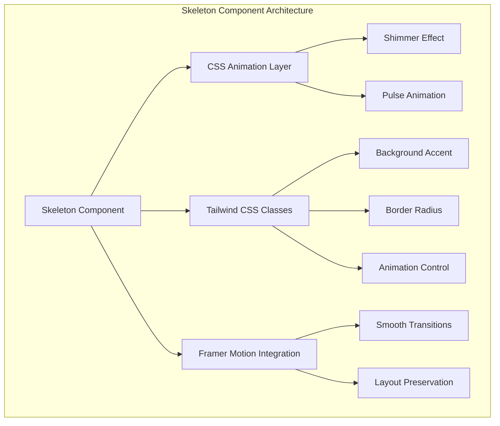
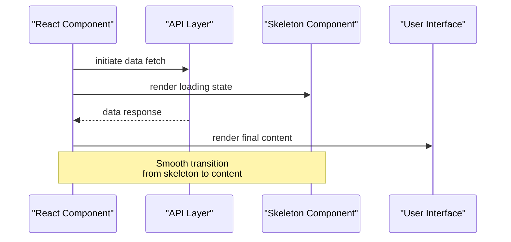
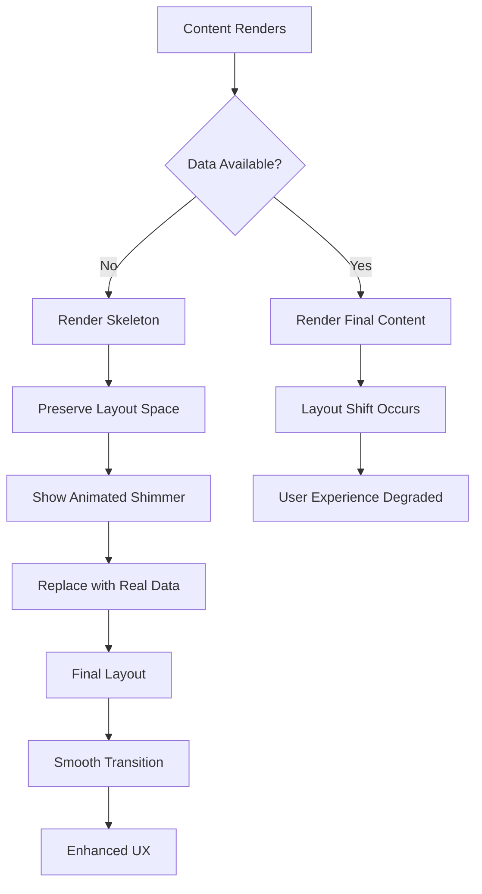

# Skeleton Component Documentation

<cite>
**Referenced Files in This Document**
- [skeleton.tsx](file://src/components/ui/skeleton.tsx)
- [utils.ts](file://src/components/ui/utils.ts)
- [LandingPage.tsx](file://src/components/LandingPage.tsx)
- [PortfolioPage.tsx](file://src/components/PortfolioPage.tsx)
- [api.ts](file://src/lib/api.ts)
- [tailwind.config.js](file://tailwind.config.js)
- [index.tsx](file://pages/index.tsx)
</cite>

## Table of Contents
1. [Introduction](#introduction)
2. [Component Architecture](#component-architecture)
3. [Implementation Details](#implementation-details)
4. [Usage Patterns](#usage-patterns)
5. [Integration with React Suspense](#integration-with-react-suspense)
6. [Performance Benefits](#performance-benefits)
7. [Accessibility Considerations](#accessibility-considerations)
8. [Customization Guide](#customization-guide)
9. [Best Practices](#best-practices)
10. [Troubleshooting](#troubleshooting)

## Introduction

The Skeleton component is a lightweight, highly optimized loading state indicator designed to enhance user experience during asynchronous data loading operations. Built with React and Framer Motion, it provides smooth animated shimmer effects using CSS gradients and sophisticated animation timing to create realistic loading placeholders that match the final content layout.

This component serves as a critical UX element in the SnapEvent application, particularly for loading states in photographer cards, booking calendars, and portfolio content. It helps maintain visual continuity and prevents layout shifts while data loads asynchronously from API routes.

## Component Architecture

The Skeleton component follows a minimalist design philosophy, focusing on performance and accessibility. Its architecture is built around three core principles:



**Diagram sources**
- [skeleton.tsx](file://src/components/ui/skeleton.tsx#L1-L14)

**Section sources**
- [skeleton.tsx](file://src/components/ui/skeleton.tsx#L1-L14)
- [utils.ts](file://src/components/ui/utils.ts#L1-L7)

## Implementation Details

### Core Component Structure

The Skeleton component is implemented as a simple wrapper around a div element with intelligent defaults for loading states:

```typescript
function Skeleton({ className, ...props }: React.ComponentProps<"div">) {
  return (
    <div
      data-slot="skeleton"
      className={cn("bg-accent animate-pulse rounded-md", className)}
      {...props}
    />
  );
}
```

### Key Features

1. **Minimal API Surface**: The component accepts all standard HTML div props while providing intelligent defaults
2. **Tailwind CSS Integration**: Uses the `cn` utility function for class composition
3. **Framer Motion Animation**: Leverages the `animate-pulse` class for smooth shimmer effects
4. **Accessibility Support**: Includes `data-slot` attribute for screen reader recognition

### Animation System

The component utilizes Tailwind's built-in `animate-pulse` class combined with the accent color palette:

```css
/* Generated CSS */
.animate-pulse {
  animation: pulse 2s cubic-bezier(0.4, 0, 0.6, 1) infinite;
}

@keyframes pulse {
  0%, 100% { opacity: 1; }
  50% { opacity: 0.5; }
}
```

**Section sources**
- [skeleton.tsx](file://src/components/ui/skeleton.tsx#L1-L14)
- [tailwind.config.js](file://tailwind.config.js#L20-L45)

## Usage Patterns

### Basic Implementation

The simplest usage involves wrapping content that needs loading indicators:

```typescript
// Basic skeleton usage
{isLoading && <Skeleton className="h-24 w-full" />}

// Multiple skeletons for lists
{isLoading && (
  <>
    <Skeleton className="h-24" />
    <Skeleton className="h-24" />
    <Skeleton className="h-24" />
  </>
)}
```

### Integration with API Data Loading

The component integrates seamlessly with the application's API layer for consistent loading states:



**Diagram sources**
- [LandingPage.tsx](file://src/components/LandingPage.tsx#L80-L120)
- [api.ts](file://src/lib/api.ts#L1-L50)

### Pattern Examples

#### Photographer Cards Loading

The LandingPage demonstrates sophisticated skeleton usage for photographer listings:

```typescript
// Loading state for photographer cards
{isLoading ? (
  Array.from({ length: 3 }).map((_, index) => (
    <motion.div key={index} variants={staggerItem}>
      <Card className="bg-card border-border">
        <CardContent className="p-6">
          <div className="flex items-start space-x-4">
            <div className="w-16 h-16 bg-muted rounded-full animate-pulse" />
            <div className="flex-1 space-y-2">
              <div className="h-4 bg-muted rounded animate-pulse" />
              <div className="h-3 bg-muted rounded w-3/4 animate-pulse" />
              <div className="h-3 bg-muted rounded w-1/2 animate-pulse" />
            </div>
          </div>
        </CardContent>
      </Card>
    </motion.div>
  ))
) : (
  // Render actual photographer data
)}
```

#### Portfolio Page Skeleton

The PortfolioPage uses a more complex skeleton with motion animations:

```typescript
const SkeletonCard = () => (
  <motion.div
    initial={{ opacity: 0 }}
    animate={{ opacity: 1 }}
    className="bg-muted/50 rounded-lg p-6 space-y-4"
  >
    <div className="flex items-center space-x-4">
      <motion.div
        animate={{ opacity: [0.5, 1, 0.5] }}
        transition={{ duration: 1.5, repeat: Infinity, ease: "easeInOut" }}
        className="w-16 h-16 bg-muted rounded-full"
      />
      <div className="space-y-2 flex-1">
        <motion.div
          animate={{ opacity: [0.5, 1, 0.5] }}
          transition={{ duration: 1.5, repeat: Infinity, ease: "easeInOut", delay: 0.2 }}
          className="h-4 bg-muted rounded w-3/4"
        />
        <motion.div
          animate={{ opacity: [0.5, 1, 0.5] }}
          transition={{ duration: 1.5, repeat: Infinity, ease: "easeInOut", delay: 0.4 }}
          className="h-3 bg-muted rounded w-1/2"
        />
      </div>
    </div>
    <motion.div
      animate={{ opacity: [0.5, 1, 0.5] }}
      transition={{ duration: 1.5, repeat: Infinity, ease: "easeInOut", delay: 0.6 }}
      className="h-3 bg-muted rounded w-full"
    />
    <motion.div
      animate={{ opacity: [0.5, 1, 0.5] }}
      transition={{ duration: 1.5, repeat: Infinity, ease: "easeInOut", delay: 0.8 }}
      className="h-3 bg-muted rounded w-2/3"
    />
  </motion.div>
);
```

**Section sources**
- [LandingPage.tsx](file://src/components/LandingPage.tsx#L540-L560)
- [PortfolioPage.tsx](file://src/components/PortfolioPage.tsx#L167-L190)

## Integration with React Suspense

While the current implementation doesn't directly use React Suspense, the Skeleton component is designed to work seamlessly with modern React data fetching patterns:

### Future Integration Possibilities

```typescript
// Potential Suspense integration
function SuspendedPhotographerList() {
  const photographers = useSuspense(photographersAPI.getAll);
  
  return (
    <div>
      {photographers.map(photographer => (
        <PhotographerCard key={photographer.id} data={photographer} />
      ))}
    </div>
  );
}

// Usage with Suspense boundary
<Suspense fallback={<Skeleton className="h-24 w-full" />}>
  <SuspendedPhotographerList />
</Suspense>
```

### Current Data Loading Pattern

The application currently uses traditional promise-based data fetching with explicit loading states:

```typescript
useEffect(() => {
  const fetchData = async () => {
    try {
      setIsLoading(true);
      const response = await photographersAPI.getAll({ limit: 6 });
      setData(response.photographers);
    } catch (error) {
      console.error('Failed to fetch data:', error);
    } finally {
      setIsLoading(false);
    }
  };
  
  fetchData();
}, []);
```

**Section sources**
- [LandingPage.tsx](file://src/components/LandingPage.tsx#L80-L120)
- [api.ts](file://src/lib/api.ts#L40-L60)

## Performance Benefits

### Layout Stability

The Skeleton component provides significant performance benefits by maintaining layout stability:



### Memory Efficiency

The component's minimal implementation ensures optimal memory usage:

- **Lightweight**: Single div wrapper with minimal DOM nodes
- **Efficient Animations**: Uses hardware-accelerated CSS transforms
- **Class Composition**: Leverages Tailwind's atomic CSS approach

### Rendering Performance

```typescript
// Optimized rendering with conditional skeletons
{isLoading ? (
  <div className="grid grid-cols-1 md:grid-cols-2 lg:grid-cols-3 gap-6">
    {Array.from({ length: 3 }).map((_, index) => (
      <Skeleton key={index} className="h-64 rounded-lg" />
    ))}
  </div>
) : (
  <div className="grid grid-cols-1 md:grid-cols-2 lg:grid-cols-3 gap-6">
    {photographers.map(photographer => (
      <PhotographerCard key={photographer.id} data={photographer} />
    ))}
  </div>
)}
```

**Section sources**
- [LandingPage.tsx](file://src/components/LandingPage.tsx#L540-L560)

## Accessibility Considerations

### Screen Reader Support

The Skeleton component includes accessibility features for assistive technologies:

```typescript
<div
  data-slot="skeleton"
  className={cn("bg-accent animate-pulse rounded-md", className)}
  {...props}
>
```

### Best Practices for Accessibility

1. **Semantic Structure**: Use appropriate HTML elements for content
2. **ARIA Attributes**: Consider adding `aria-busy` during loading states
3. **Focus Management**: Ensure keyboard navigation remains functional
4. **Color Contrast**: Maintain sufficient contrast ratios for accessibility

### Enhanced Accessibility Implementation

```typescript
// Enhanced accessibility version
function AccessibleSkeleton({
  className,
  role = "status",
  "aria-label": ariaLabel = "Loading content",
  ...props
}: React.ComponentProps<"div"> & {
  role?: string;
  "aria-label"?: string;
}) {
  return (
    <div
      data-slot="skeleton"
      role={role}
      aria-label={ariaLabel}
      className={cn("bg-accent animate-pulse rounded-md", className)}
      {...props}
    />
  );
}
```

**Section sources**
- [skeleton.tsx](file://src/components/ui/skeleton.tsx#L3-L10)

## Customization Guide

### Creating Custom Skeleton Shapes

The component's flexibility allows for various customizations to match different content layouts:

#### Text-Based Skeletons

```typescript
// Text skeleton variations
const TextSkeleton = ({ lines = 3, className = "" }) => (
  <div className={`space-y-2 ${className}`}>
    {Array.from({ length: lines }).map((_, i) => (
      <div
        key={i}
        className="h-4 bg-muted rounded animate-pulse"
        style={{
          width: i === 0 ? "75%" : i === 1 ? "50%" : "66%"
        }}
      />
    ))}
  </div>
);
```

#### Image Placeholder Skeletons

```typescript
// Image placeholder variation
const ImagePlaceholder = ({ width = 200, height = 200, className = "" }) => (
  <div
    className={`bg-muted rounded-lg overflow-hidden ${className}`}
    style={{ width, height }}
  >
    <div className="w-full h-full bg-gradient-to-r from-transparent via-muted/50 to-transparent animate-shimmer" />
  </div>
);
```

#### Card Skeleton Template

```typescript
// Comprehensive card skeleton
const CardSkeleton = () => (
  <div className="bg-card rounded-lg shadow-sm overflow-hidden">
    <div className="aspect-video bg-muted animate-pulse" />
    <div className="p-4 space-y-2">
      <div className="h-4 bg-muted rounded w-3/4 animate-pulse" />
      <div className="h-3 bg-muted rounded w-1/2 animate-pulse" />
      <div className="h-3 bg-muted rounded w-2/3 animate-pulse" />
    </div>
  </div>
);
```

### Theme Integration

The component seamlessly integrates with the application's Tailwind CSS theme:

```typescript
// Theme-aware customization
const themedSkeleton = (theme: 'light' | 'dark') => ({
  backgroundColor: theme === 'dark' ? 'bg-muted/20' : 'bg-muted/50',
  animationColor: theme === 'dark' ? 'bg-muted/30' : 'bg-muted/70'
});
```

**Section sources**
- [LandingPage.tsx](file://src/components/LandingPage.tsx#L540-L560)
- [PortfolioPage.tsx](file://src/components/PortfolioPage.tsx#L167-L190)

## Best Practices

### When to Use Skeletons

1. **Data Loading**: When fetching data from APIs
2. **Component Mounting**: During initial component rendering
3. **Navigation Transitions**: Between route changes
4. **Async Operations**: File uploads, form submissions

### Design Guidelines

1. **Match Content Dimensions**: Ensure skeleton dimensions match final content
2. **Consistent Animation Timing**: Use similar animation durations across components
3. **Proportional Elements**: Maintain aspect ratios and proportions
4. **Visual Hierarchy**: Preserve the visual structure of final content

### Performance Optimization

```typescript
// Optimized skeleton usage
const OptimizedSkeleton = memo(({ className, ...props }: React.ComponentProps<"div">) => (
  <Skeleton className={cn("bg-accent animate-pulse rounded-md", className)} {...props} />
));

// Conditional rendering optimization
const SkeletonWrapper = ({ isLoading, children }: { isLoading: boolean; children: React.ReactNode }) => {
  if (!isLoading) return <>{children}</>;
  
  return (
    <div className="animate-pulse space-y-4">
      <Skeleton className="h-64 rounded-lg" />
      <Skeleton className="h-48 rounded-lg" />
    </div>
  );
};
```

### Error Handling Integration

```typescript
// Combined loading and error states
const DataDisplay = ({ data, error, isLoading }: {
  data: any[];
  error: Error | null;
  isLoading: boolean;
}) => {
  if (error) {
    return <ErrorBoundary error={error} />;
  }
  
  if (isLoading) {
    return (
      <div className="grid grid-cols-1 md:grid-cols-2 lg:grid-cols-3 gap-6">
        {Array.from({ length: 3 }).map((_, index) => (
          <Skeleton key={index} className="h-64 rounded-lg" />
        ))}
      </div>
    );
  }
  
  return <DataGrid data={data} />;
};
```

**Section sources**
- [LandingPage.tsx](file://src/components/LandingPage.tsx#L80-L120)
- [PortfolioPage.tsx](file://src/components/PortfolioPage.tsx#L167-L190)

## Troubleshooting

### Common Issues and Solutions

#### Animation Not Working

**Problem**: Skeleton animations appear static or don't play

**Solution**: Ensure Tailwind CSS is properly configured and the `animate-pulse` class is included:

```typescript
// Verify Tailwind configuration
// tailwind.config.js
module.exports = {
  theme: {
    extend: {
      animation: {
        'pulse': 'pulse 2s cubic-bezier(0.4, 0, 0.6, 1) infinite'
      }
    }
  }
};
```

#### Layout Shifts During Transition

**Problem**: Content jumps when transitioning from skeleton to real data

**Solution**: Use consistent dimensions and preserve layout space:

```typescript
// Prevent layout shifts
const ConsistentSkeleton = () => (
  <div className="space-y-4">
    <div className="h-24 w-full bg-muted rounded-lg animate-pulse" />
    <div className="h-24 w-full bg-muted rounded-lg animate-pulse" />
  </div>
);
```

#### Performance Issues

**Problem**: Too many skeleton components causing performance degradation

**Solution**: Implement virtualization and lazy loading:

```typescript
// Efficient large list rendering
const VirtualizedSkeletonList = ({ count = 20 }: { count: number }) => {
  const [visibleCount, setVisibleCount] = useState(5);
  
  useEffect(() => {
    const timer = setTimeout(() => {
      setVisibleCount(count);
    }, 1000);
    
    return () => clearTimeout(timer);
  }, [count]);
  
  return (
    <div className="space-y-4">
      {Array.from({ length: visibleCount }).map((_, index) => (
        <Skeleton key={index} className="h-24 rounded-lg" />
      ))}
    </div>
  );
};
```

#### Accessibility Concerns

**Problem**: Screen readers don't announce loading states appropriately

**Solution**: Add proper ARIA attributes and roles:

```typescript
// Enhanced accessibility
const AccessibleSkeleton = ({ label = "Loading content" }: { label?: string }) => (
  <div
    role="status"
    aria-live="polite"
    aria-label={label}
    className="bg-accent animate-pulse rounded-md"
  />
);
```

### Debugging Tips

1. **Inspect Animation**: Use browser dev tools to verify animation classes are applied
2. **Check Dimensions**: Ensure skeleton dimensions match expected content sizes
3. **Test Responsiveness**: Verify skeletons work across different screen sizes
4. **Monitor Performance**: Use performance profiling to identify bottlenecks

**Section sources**
- [skeleton.tsx](file://src/components/ui/skeleton.tsx#L1-L14)
- [tailwind.config.js](file://tailwind.config.js#L20-L45)