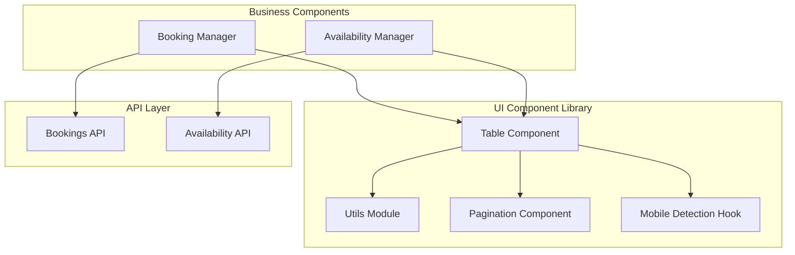
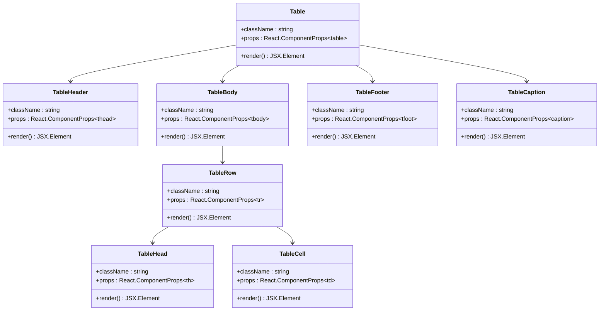
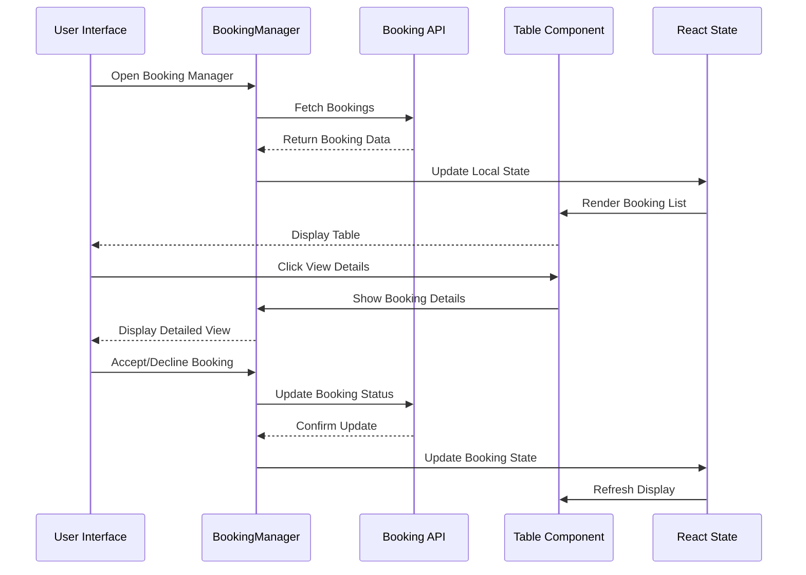
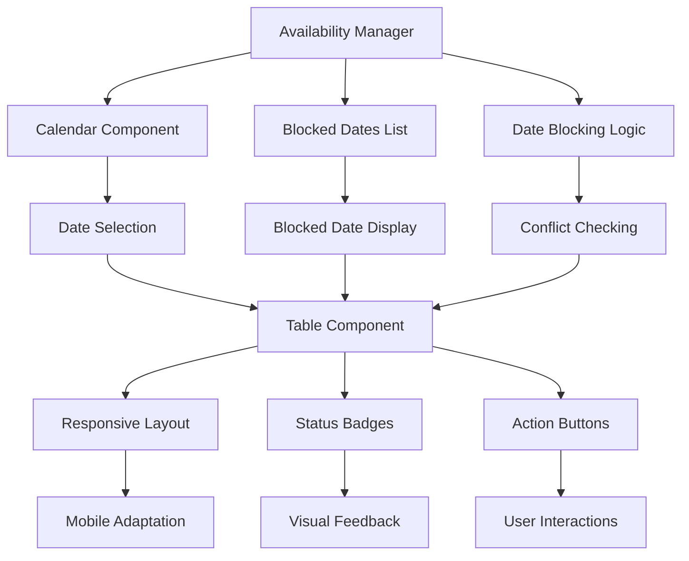
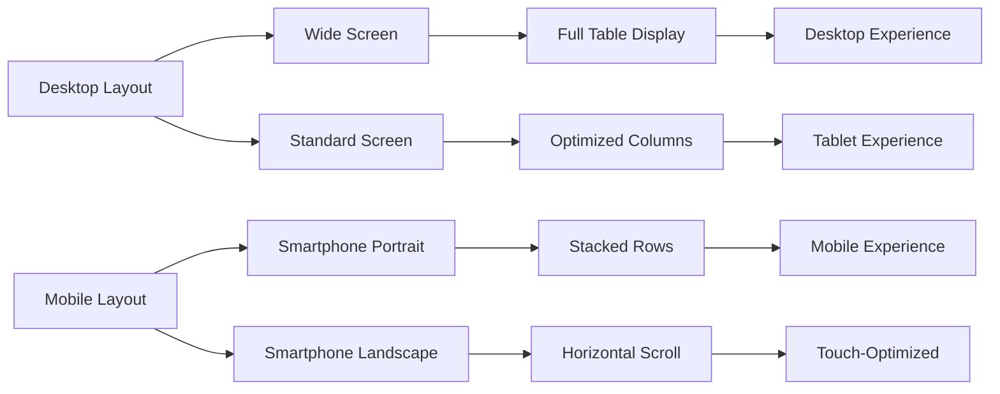
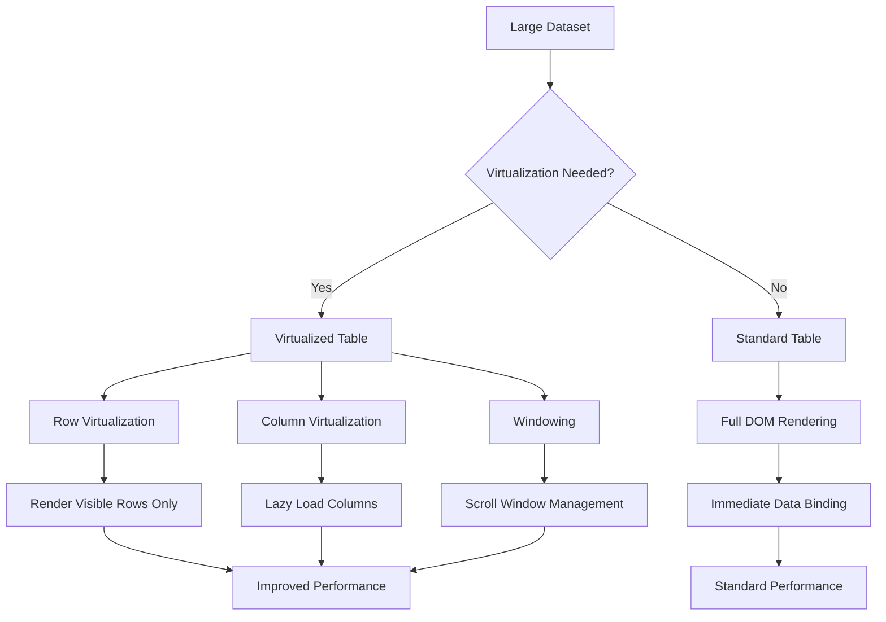

# Table Component Documentation

<cite>
**Referenced Files in This Document**
- [table.tsx](file://src/components/ui/table.tsx)
- [utils.ts](file://src/components/ui/utils.ts)
- [pagination.tsx](file://src/components/ui/pagination.tsx)
- [use-mobile.ts](file://src/components/ui/use-mobile.ts)
- [BookingManager.tsx](file://src/components/BookingManager.tsx)
- [AvailabilityManager.tsx](file://src/components/AvailabilityManager.tsx)
- [index.ts](file://pages/api/bookings/index.ts)
- [availability.ts](file://pages/api/bookings/availability.ts)
</cite>

## Table of Contents
1. [Introduction](#introduction)
2. [Project Structure](#project-structure)
3. [Core Table Component](#core-table-component)
4. [Architecture Overview](#architecture-overview)
5. [Detailed Component Analysis](#detailed-component-analysis)
6. [Integration with Booking Management](#integration-with-booking-management)
7. [Responsive Design Implementation](#responsive-design-implementation)
8. [Performance Optimization](#performance-optimization)
9. [Customization Guide](#customization-guide)
10. [Troubleshooting Guide](#troubleshooting-guide)
11. [Conclusion](#conclusion)

## Introduction

The Table component is a foundational UI element in the SnapEvent platform designed for displaying booking management data, availability schedules, and profile dashboards. Built with React and Tailwind CSS, it provides comprehensive support for sorting, pagination, and dynamic data rendering while maintaining consistent styling and behavior across the application.

This component serves as the backbone for several critical features including booking history display, availability schedule management, and client communication tracking. Its modular design allows for easy customization while maintaining accessibility standards and responsive behavior.

## Project Structure

The Table component is part of a larger UI component library located in the `src/components/ui/` directory. The structure follows a consistent pattern with specialized components for different use cases:



**Diagram sources**
- [table.tsx](file://src/components/ui/table.tsx#L1-L117)
- [utils.ts](file://src/components/ui/utils.ts#L1-L7)
- [pagination.tsx](file://src/components/ui/pagination.tsx#L1-L128)

**Section sources**
- [table.tsx](file://src/components/ui/table.tsx#L1-L117)
- [utils.ts](file://src/components/ui/utils.ts#L1-L7)

## Core Table Component

The Table component is implemented as a collection of specialized components that work together to create a complete table solution. Each component handles a specific aspect of table functionality:

### Component Architecture



**Diagram sources**
- [table.tsx](file://src/components/ui/table.tsx#L5-L117)

### Key Features

The Table component provides several essential features:

1. **Responsive Container**: Wraps the table in an overflow container for horizontal scrolling on smaller screens
2. **Consistent Styling**: Uses the `cn()` utility function for consistent Tailwind CSS class composition
3. **Accessibility**: Implements proper ARIA attributes and semantic HTML structure
4. **Hover States**: Provides visual feedback for interactive elements
5. **Modular Design**: Each component can be customized independently

**Section sources**
- [table.tsx](file://src/components/ui/table.tsx#L1-L117)

## Architecture Overview

The Table component architecture is designed around modularity and reusability. The system consists of five main layers:

```mermaid
flowchart TD
A[Application Layer] --> B[Component Layer]
B --> C[Table Components]
C --> D[Utility Layer]
D --> E[Style Utilities]
F[Data Layer] --> G[API Services]
G --> H[Business Logic]
H --> I[State Management]
J[Responsive Layer] --> K[Mobile Detection]
K --> L[Breakpoint Management]
B --> F
B --> J
subgraph "Table Components"
C1[Table Container]
C2[Table Header]
C3[Table Body]
C4[Table Rows]
C5[Table Cells]
end
subgraph "Utility Layer"
E1[cn() Utility]
E2[Class Composition]
E3[Tailwind Merge]
end
```

**Diagram sources**
- [table.tsx](file://src/components/ui/table.tsx#L1-L117)
- [utils.ts](file://src/components/ui/utils.ts#L1-L7)
- [use-mobile.ts](file://src/components/ui/use-mobile.ts#L1-L22)

## Detailed Component Analysis

### Table Container Component

The Table component serves as the primary wrapper that provides responsive behavior and consistent styling:

```typescript
function Table({ className, ...props }: React.ComponentProps<"table">) {
  return (
    <div
      data-slot="table-container"
      className="relative w-full overflow-x-auto"
    >
      <table
        data-slot="table"
        className={cn("w-full caption-bottom text-sm", className)}
        {...props}
      />
    </div>
  );
}
```

Key characteristics:
- **Responsive Wrapper**: Uses `overflow-x-auto` to enable horizontal scrolling
- **Full Width**: Maintains 100% width for optimal layout flexibility
- **Semantic Attributes**: Includes `data-slot` attributes for testing and accessibility
- **Tailwind Integration**: Leverages the `cn()` utility for class composition

### Table Body and Row Components

The TableBody and TableRow components provide structure and styling for tabular data:

```typescript
function TableBody({ className, ...props }: React.ComponentProps<"tbody">) {
  return (
    <tbody
      data-slot="table-body"
      className={cn("[&_tr:last-child]:border-0", className)}
      {...props}
    />
  );
}

function TableRow({ className, ...props }: React.ComponentProps<"tr">) {
  return (
    <tr
      data-slot="table-row"
      className={cn(
        "hover:bg-muted/50 data-[state=selected]:bg-muted border-b transition-colors",
        className,
      )}
      {...props}
    />
  );
}
```

Features:
- **Hover Effects**: Smooth transitions for improved user experience
- **Selection States**: Supports data-driven selection states
- **Border Management**: Conditional border removal for last rows
- **Accessibility**: Proper semantic structure for screen readers

### Cell Components

The TableHead and TableCell components handle header and data cell styling:

```typescript
function TableHead({ className, ...props }: React.ComponentProps<"th">) {
  return (
    <th
      data-slot="table-head"
      className={cn(
        "text-foreground h-10 px-2 text-left align-middle font-medium whitespace-nowrap [&:has([role=checkbox])]:pr-0 [&>[role=checkbox]]:translate-y-[2px]",
        className,
      )}
      {...props}
    />
  );
}

function TableCell({ className, ...props }: React.ComponentProps<"td">) {
  return (
    <td
      data-slot="table-cell"
      className={cn(
        "p-2 align-middle whitespace-nowrap [&:has([role=checkbox])]:pr-0 [&>[role=checkbox]]:translate-y-[2px]",
        className,
      )}
      {...props}
    />
  );
}
```

Characteristics:
- **Text Alignment**: Left-aligned text with proper padding
- **Whitespace Control**: Prevents unwanted wrapping in narrow containers
- **Checkbox Compatibility**: Special handling for checkbox elements
- **Role-Based Selection**: Supports accessibility roles for interactive elements

**Section sources**
- [table.tsx](file://src/components/ui/table.tsx#L5-L117)

## Integration with Booking Management

The Table component integrates seamlessly with the BookingManager and AvailabilityManager components to display booking data and manage availability schedules.

### BookingManager Integration

The BookingManager component demonstrates advanced table usage with dynamic data binding and state management:



**Diagram sources**
- [BookingManager.tsx](file://src/components/BookingManager.tsx#L1-L510)
- [index.ts](file://pages/api/bookings/index.ts#L1-L208)

### AvailabilityManager Integration

The AvailabilityManager component showcases table usage for managing availability schedules:



**Diagram sources**
- [AvailabilityManager.tsx](file://src/components/AvailabilityManager.tsx#L1-L203)

### Data Flow Architecture

The integration follows a clear data flow pattern:

1. **API Layer**: Handles data retrieval and persistence
2. **State Management**: Manages local component state
3. **Rendering Layer**: Converts data to table format
4. **User Interaction**: Processes user actions and updates state

**Section sources**
- [BookingManager.tsx](file://src/components/BookingManager.tsx#L1-L510)
- [AvailabilityManager.tsx](file://src/components/AvailabilityManager.tsx#L1-L203)
- [index.ts](file://pages/api/bookings/index.ts#L1-L208)
- [availability.ts](file://pages/api/bookings/availability.ts#L1-L69)

## Responsive Design Implementation

The Table component incorporates responsive design principles through the use-mobile hook and adaptive styling strategies.

### Mobile Detection System

```typescript
const MOBILE_BREAKPOINT = 768;

export function useIsMobile() {
  const [isMobile, setIsMobile] = React.useState<boolean | undefined>(
    undefined,
  );

  React.useEffect(() => {
    const mql = window.matchMedia(`(max-width: ${MOBILE_BREAKPOINT - 1}px)`);
    const onChange = () => {
      setIsMobile(window.innerWidth < MOBILE_BREAKPOINT);
    };
    mql.addEventListener("change", onChange);
    setIsMobile(window.innerWidth < MOBILE_BREAKPOINT);
    return () => mql.removeEventListener("change", onChange);
  }, []);

  return !!isMobile;
}
```

Key features:
- **Dynamic Detection**: Automatically responds to viewport changes
- **Debounced Updates**: Prevents excessive re-renders during resize events
- **SSR Compatibility**: Handles server-side rendering scenarios
- **Flexible Breakpoints**: Configurable breakpoint thresholds

### Responsive Table Strategies

The table implements several responsive design strategies:

1. **Horizontal Scrolling**: Enables overflow for wide tables on mobile devices
2. **Adaptive Typography**: Uses relative sizing for better readability
3. **Stacked Layouts**: Reorganizes content for vertical presentation
4. **Touch-Friendly Interactions**: Optimizes touch targets for mobile users



**Section sources**
- [use-mobile.ts](file://src/components/ui/use-mobile.ts#L1-L22)

## Performance Optimization

The Table component implements several performance optimization techniques to handle large datasets efficiently.

### Virtualization Considerations

While the current implementation doesn't use virtualization, the architecture supports future enhancements:



### Optimization Techniques

1. **Memoization**: Uses React.memo for expensive computations
2. **Conditional Rendering**: Renders only visible content
3. **Efficient Updates**: Minimizes re-renders through proper key management
4. **Memory Management**: Proper cleanup of event listeners and subscriptions

### Pagination Integration

The table works seamlessly with the pagination component to handle large datasets:

```typescript
// Example pagination implementation
const [currentPage, setCurrentPage] = useState(1);
const [pageSize, setPageSize] = useState(10);

const paginatedData = useMemo(() => {
  const start = (currentPage - 1) * pageSize;
  const end = start + pageSize;
  return data.slice(start, end);
}, [data, currentPage, pageSize]);
```

**Section sources**
- [pagination.tsx](file://src/components/ui/pagination.tsx#L1-L128)

## Customization Guide

The Table component provides extensive customization options through props, styling utilities, and composition patterns.

### Column Customization

Customize column appearance and behavior:

```typescript
// Custom column definition
interface CustomColumn<T> {
  accessor: keyof T;
  header: string;
  renderCell: (row: T) => React.ReactNode;
  sortable?: boolean;
  align?: 'left' | 'center' | 'right';
  width?: string;
}

// Usage example
const columns: CustomColumn<Booking>[] = [
  {
    accessor: 'clientName',
    header: 'Client',
    renderCell: (row) => (
      <div className="flex items-center">
        <Avatar name={row.clientName} />
        <span>{row.clientName}</span>
      </div>
    ),
    sortable: true
  },
  {
    accessor: 'status',
    header: 'Status',
    renderCell: (row) => getStatusBadge(row.status),
    align: 'center'
  }
];
```

### Cell Formatting

Implement custom cell formatting:

```typescript
// Currency formatting
const formatCurrency = (amount: number) => {
  return new Intl.NumberFormat('en-US', {
    style: 'currency',
    currency: 'USD'
  }).format(amount);
};

// Date formatting
const formatDate = (date: string) => {
  return new Date(date).toLocaleDateString('en-US', {
    month: 'short',
    day: 'numeric',
    year: 'numeric'
  });
};
```

### Row Actions

Add interactive row actions:

```typescript
// Row action buttons
const renderActions = (row: Booking) => (
  <div className="flex gap-2">
    <Button
      variant="ghost"
      size="sm"
      onClick={() => handleViewDetails(row.id)}
    >
      <Eye className="h-4 w-4" />
    </Button>
    <Button
      variant="ghost"
      size="sm"
      onClick={() => handleEditBooking(row.id)}
    >
      <Edit className="h-4 w-4" />
    </Button>
    <Button
      variant="ghost"
      size="sm"
      onClick={() => handleDeleteBooking(row.id)}
      className="text-red-600 hover:text-red-700"
    >
      <Trash className="h-4 w-4" />
    </Button>
  </div>
);
```

### Styling Customization

Leverage the utility system for consistent styling:

```typescript
// Custom styling patterns
const customTableClasses = {
  container: "overflow-hidden rounded-lg border",
  header: "bg-gray-50 dark:bg-gray-800",
  row: "hover:bg-gray-50 dark:hover:bg-gray-700",
  cell: "px-4 py-3"
};

// Usage in components
<Table className={customTableClasses.container}>
  <TableHeader className={customTableClasses.header}>
    {/* Header content */}
  </TableHeader>
  <TableBody>
    {rows.map((row, index) => (
      <TableRow key={index} className={customTableClasses.row}>
        {/* Row content */}
      </TableRow>
    ))}
  </TableBody>
</Table>
```

## Troubleshooting Guide

Common issues and solutions when working with the Table component:

### Performance Issues

**Problem**: Slow rendering with large datasets
**Solution**: Implement pagination or virtualization
```typescript
// Add pagination
const [page, setPage] = useState(1);
const pageSize = 20;

const paginatedRows = rows.slice((page - 1) * pageSize, page * pageSize);
```

**Problem**: Memory leaks from event listeners
**Solution**: Proper cleanup in useEffect
```typescript
useEffect(() => {
  const cleanup = () => {
    // Cleanup logic
  };
  
  return cleanup;
}, []);
```

### Styling Issues

**Problem**: Inconsistent spacing or alignment
**Solution**: Use the utility system consistently
```typescript
// Correct spacing
<div className={cn("p-4", customClasses.padding)}>
  Content
</div>
```

**Problem**: Mobile layout breaking
**Solution**: Implement responsive breakpoints
```typescript
// Responsive layout
<div className="md:hidden">
  {/* Mobile layout */}
</div>
<div className="hidden md:block">
  {/* Desktop layout */}
</div>
```

### Data Binding Issues

**Problem**: Data not updating reactively
**Solution**: Ensure proper state management
```typescript
// Correct state updates
const [data, setData] = useState(initialData);

// Update with spread operator
setData(prev => [...prev, newData]);
```

**Section sources**
- [table.tsx](file://src/components/ui/table.tsx#L1-L117)
- [utils.ts](file://src/components/ui/utils.ts#L1-L7)

## Conclusion

The Table component represents a sophisticated and flexible foundation for building data-intensive interfaces in the SnapEvent platform. Its modular architecture, comprehensive feature set, and seamless integration capabilities make it an ideal choice for displaying booking management data, availability schedules, and profile dashboards.

Key strengths of the implementation include:

- **Modular Design**: Clean separation of concerns with reusable components
- **Responsive Behavior**: Adaptive layouts that work across all device sizes
- **Performance Optimization**: Efficient rendering strategies for large datasets
- **Accessibility**: Proper semantic markup and ARIA attributes
- **Extensibility**: Easy customization through props and composition patterns

The component's integration with the BookingManager and AvailabilityManager demonstrates its versatility and ability to handle complex business logic while maintaining clean separation of concerns. The use of modern React patterns, TypeScript typing, and Tailwind CSS ensures maintainability and scalability for future enhancements.

Future improvements could include virtualization support for extremely large datasets, enhanced sorting and filtering capabilities, and expanded customization options for specialized use cases. The current implementation provides a solid foundation that can evolve with the platform's growing needs.