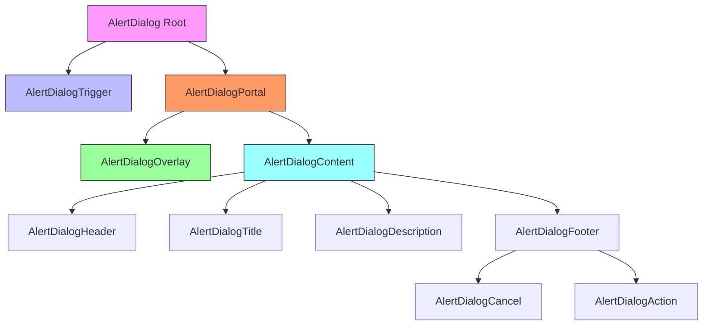
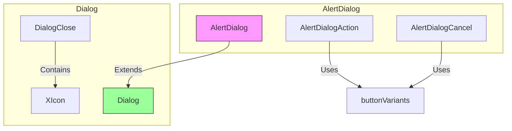
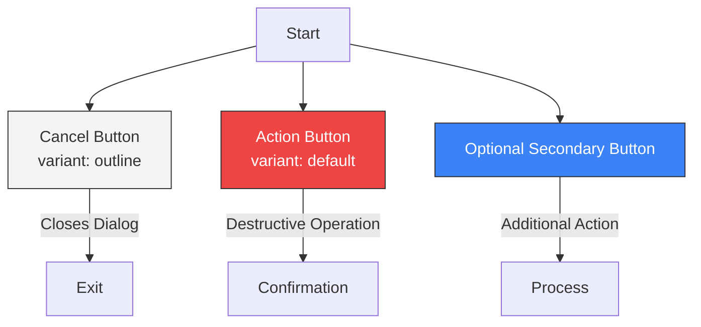
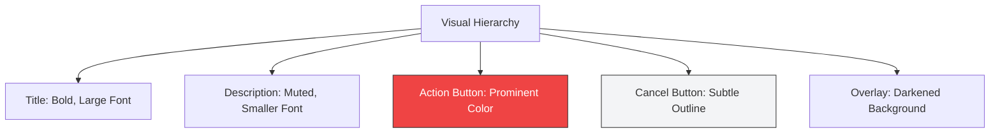

# Alert Dialog

<cite>
**Referenced Files in This Document**   
- [alert-dialog.tsx](file://src/components/ui/alert-dialog.tsx)
- [dialog.tsx](file://src/components/ui/dialog.tsx)
- [button.tsx](file://src/components/ui/button.tsx)
</cite>

## Table of Contents
1. [Introduction](#introduction)
2. [Core Components](#core-components)
3. [Architecture Overview](#architecture-overview)
4. [Detailed Component Analysis](#detailed-component-analysis)
5. [Three-Button Pattern Implementation](#three-button-pattern-implementation)
6. [Accessibility Features](#accessibility-features)
7. [Differences from Regular Dialog](#differences-from-regular-dialog)
8. [Conclusion](#conclusion)

## Introduction
The AlertDialog component is a specialized implementation of the base Dialog pattern designed specifically for handling destructive actions such as account deletion or booking cancellation. Built on top of Radix UI's AlertDialog primitive, it provides a safe confirmation mechanism for critical operations while maintaining accessibility and user experience standards. This documentation details its implementation, usage patterns, and integration with asynchronous operations.

## Core Components

The AlertDialog component is composed of several sub-components that work together to create a cohesive user experience for destructive action confirmation. These components follow the same architectural pattern as the base Dialog but with specialized styling and behavior for high-risk operations.

**Section sources**
- [alert-dialog.tsx](file://src/components/ui/alert-dialog.tsx)

## Architecture Overview



**Diagram sources**
- [alert-dialog.tsx](file://src/components/ui/alert-dialog.tsx)

## Detailed Component Analysis

### AlertDialog Implementation
The AlertDialog component extends the base Dialog pattern with specialized features for destructive action confirmation. It uses Radix UI's AlertDialog primitives to ensure accessibility and proper focus management.

The component structure follows a consistent pattern with specific data-slot attributes for styling and testing purposes. The AlertDialogContent is positioned centrally with appropriate animations for entrance and exit, while the overlay provides a backdrop with proper fade transitions.

```mermaid
classDiagram
class AlertDialog {
+Root : AlertDialogPrimitive.Root
+Trigger : AlertDialogPrimitive.Trigger
+Portal : AlertDialogPrimitive.Portal
+Overlay : AlertDialogPrimitive.Overlay
+Content : AlertDialogPrimitive.Content
}
class AlertDialogAction {
+variant : "default"
+className : buttonVariants()
}
class AlertDialogCancel {
+variant : "outline"
+className : buttonVariants({ variant : "outline" })
}
AlertDialog --> AlertDialogAction
AlertDialog --> AlertDialogCancel
AlertDialogAction --> buttonVariants
AlertDialogCancel --> buttonVariants
```

**Diagram sources**
- [alert-dialog.tsx](file://src/components/ui/alert-dialog.tsx)
- [button.tsx](file://src/components/ui/button.tsx)

**Section sources**
- [alert-dialog.tsx](file://src/components/ui/alert-dialog.tsx)

### Base Dialog Comparison
The AlertDialog shares structural similarities with the base Dialog component but differs in purpose and implementation details. While both use similar positioning and animation patterns, the AlertDialog is specifically designed for high-stakes decisions requiring explicit user confirmation.



**Diagram sources**
- [alert-dialog.tsx](file://src/components/ui/alert-dialog.tsx)
- [dialog.tsx](file://src/components/ui/dialog.tsx)

**Section sources**
- [alert-dialog.tsx](file://src/components/ui/alert-dialog.tsx)
- [dialog.tsx](file://src/components/ui/dialog.tsx)

## Three-Button Pattern Implementation

### Button Configuration
The AlertDialog implements a three-button pattern consisting of Cancel, Action, and optional Secondary actions. This pattern is designed to guide users through destructive operations with clear choices.

The primary action button (AlertDialogAction) uses the default button variant with enhanced visual prominence, while the cancel button (AlertDialogCancel) uses the outline variant to reduce visual weight and prevent accidental activation.



**Diagram sources**
- [alert-dialog.tsx](file://src/components/ui/alert-dialog.tsx)
- [button.tsx](file://src/components/ui/button.tsx)

### Asynchronous Operation Handling
The AlertDialog safely handles asynchronous operations by preventing the dialog from closing until the operation completes. This ensures that users cannot dismiss the dialog during critical operations, providing a reliable user experience.

When integrated with API calls, the AlertDialogAction can be configured to show loading states and handle success/failure scenarios appropriately, maintaining the confirmation requirement throughout the operation lifecycle.

**Section sources**
- [alert-dialog.tsx](file://src/components/ui/alert-dialog.tsx)

## Accessibility Features

### Visual Distinction
The AlertDialog provides clear visual distinction for destructive actions through:
- Color contrast between action and cancel buttons
- Strategic placement of buttons with destructive action on the right
- Clear typography hierarchy in title and description
- High-contrast overlay that focuses attention on the dialog content

The destructive action button uses the "destructive" variant from buttonVariants, which applies a red color scheme to visually communicate the severity of the action.



**Diagram sources**
- [alert-dialog.tsx](file://src/components/ui/alert-dialog.tsx)
- [button.tsx](file://src/components/ui/button.tsx)

### Focus Management
The AlertDialog implements proper focus management to ensure accessibility:
- Initial focus on the AlertDialogTrigger
- Automatic focus transfer to the AlertDialogContent when opened
- Focus trapping within the dialog during interaction
- Return focus to the trigger when the dialog is closed

This focus management pattern prevents users from interacting with background content while the dialog is active, ensuring that the confirmation requirement is met before proceeding with destructive operations.

**Section sources**
- [alert-dialog.tsx](file://src/components/ui/alert-dialog.tsx)

## Differences from Regular Dialog

### Visual Styling
The AlertDialog differs from the regular Dialog in several key visual aspects:
- Action buttons use more prominent styling to emphasize the decision
- Destructive actions are visually distinguished with color and placement
- The overall design emphasizes the seriousness of the operation
- Text content is more direct and explicit about consequences

### Action Emphasis
While the regular Dialog is designed for general information and actions, the AlertDialog specifically emphasizes the significance of the action being confirmed. This is achieved through:
- More prominent action button styling
- Clearer distinction between confirm and cancel actions
- Enhanced visual hierarchy that guides the user toward careful consideration

### User Intent Verification
The AlertDialog implements stronger user intent verification patterns compared to the regular Dialog:
- Requires explicit confirmation for destructive actions
- Prevents accidental activation through button placement and styling
- Maintains the dialog state during asynchronous operations
- Provides clear feedback about the consequences of the action

These patterns ensure that users are fully aware of the implications of their actions, particularly for critical operations like account deletion or booking cancellation.

**Section sources**
- [alert-dialog.tsx](file://src/components/ui/alert-dialog.tsx)
- [dialog.tsx](file://src/components/ui/dialog.tsx)

## Conclusion
The AlertDialog component provides a robust solution for handling destructive actions in the application. By extending the base Dialog pattern with specialized features for confirmation and safety, it ensures that critical operations require explicit user consent. The component's implementation follows accessibility best practices and provides clear visual cues to guide users through high-stakes decisions. Its integration with asynchronous operations ensures reliability and prevents accidental data loss, making it an essential component for maintaining data integrity in the application.