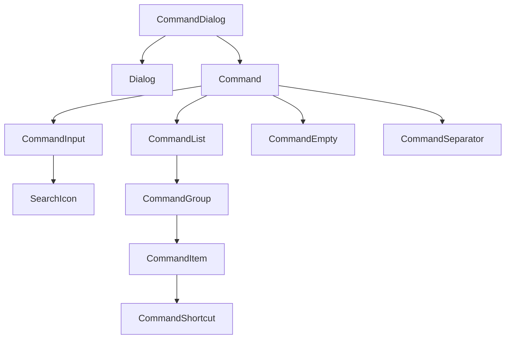
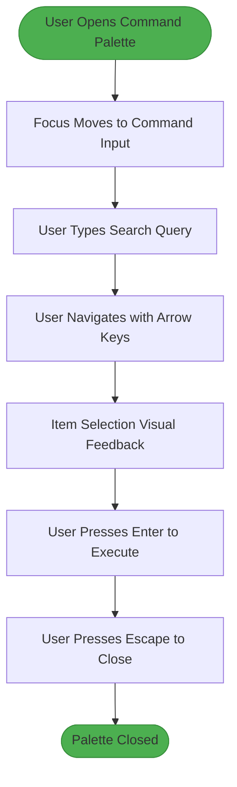

# Command

<cite>
**Referenced Files in This Document**   
- [command.tsx](file://src/components/ui/command.tsx)
- [package.json](file://package.json)
</cite>

## Table of Contents
1. [Introduction](#introduction)
2. [Core Components](#core-components)
3. [Architecture Overview](#architecture-overview)
4. [Detailed Component Analysis](#detailed-component-analysis)
5. [Accessibility Features](#accessibility-features)
6. [Integration Patterns](#integration-patterns)
7. [Performance Considerations](#performance-considerations)
8. [Conclusion](#conclusion)

## Introduction
The Command component implements a keyboard-driven interface for quick actions and navigation, functioning as a searchable command palette with category grouping and keyboard shortcuts. Built on top of the `cmdk` library, it provides a modal interface for executing commands through a search-based paradigm. The component supports accessibility features including ARIA live regions, full keyboard navigation (arrow keys, Enter, Escape), and search result highlighting. Although no direct usage examples were found in the application pages, the component is fully implemented and ready for integration into admin interfaces and power user workflows.

**Section sources**
- [command.tsx](file://src/components/ui/command.tsx#L1-L178)

## Core Components
The Command component suite consists of multiple subcomponents that work together to create a cohesive command palette experience. These include the main Command container, CommandDialog for modal presentation, CommandInput for search functionality, CommandList for result display, CommandGroup for categorization, CommandItem for individual actions, and CommandShortcut for displaying keyboard shortcuts. The implementation leverages the `cmdk` library as its foundation while applying project-specific styling and accessibility enhancements.

**Section sources**
- [command.tsx](file://src/components/ui/command.tsx#L1-L178)

## Architecture Overview
The Command component architecture follows a composition pattern where the main Command primitive from `cmdk` is wrapped with project-specific styling and accessibility features. The component tree is structured to provide a modal dialog experience through integration with the Dialog component, allowing the command palette to be presented as an overlay. The search functionality is handled by the CommandInput component, which includes a search icon and input field styled according to the application's design system.

**Diagram sources**
- [command.tsx](file://src/components/ui/command.tsx#L1-L178)

## Detailed Component Analysis

### CommandDialog Analysis
The CommandDialog component serves as the entry point for the command palette, wrapping the Command component in a Dialog for modal presentation. It accepts optional title and description props with default values of "Command Palette" and "Search for a command to run..." respectively. The component uses screen-reader-only elements for accessibility, ensuring that the dialog structure is properly announced to assistive technologies.

**Section sources**
- [command.tsx](file://src/components/ui/command.tsx#L31-L43)

### CommandInput Analysis
The CommandInput component provides the search interface for the command palette, featuring a search icon and input field. It is wrapped in a div with the data-slot attribute "command-input-wrapper" and styled with a border-bottom to create a focused input area. The input itself is configured with appropriate accessibility attributes and styling to match the application's design language.

**Section sources**
- [command.tsx](file://src/components/ui/command.tsx#L74-L94)

### CommandItem Analysis
The CommandItem component represents individual actionable items within the command palette. It includes conditional styling for selected and disabled states, with visual feedback for user interaction. The component supports keyboard navigation and is designed to be accessible through screen readers. The styling includes gap management, padding, and text appearance to ensure readability and usability.

**Section sources**
- [command.tsx](file://src/components/ui/command.tsx#L136-L152)

## Accessibility Features
The Command component implements several accessibility features to ensure usability for all users. The CommandDialog includes screen-reader-only header elements with proper ARIA labels. Keyboard navigation is fully supported with arrow keys for item selection, Enter for execution, and Escape for dismissal. The component uses data attributes (data-slot) to identify functional areas, which can be used by assistive technologies. Visual feedback is provided through conditional styling for selected and disabled states, ensuring clear indication of interactive elements.

**Diagram sources**
- [command.tsx](file://src/components/ui/command.tsx#L1-L178)

## Integration Patterns
The Command component is designed to integrate with application routing, user preferences, and dynamic action loading. While no direct usage examples were found in the codebase, the component's design suggests integration patterns for admin interfaces and power user workflows. The component could be triggered by a global keyboard shortcut (such as Ctrl+K or Cmd+K) and populated with context-specific actions based on user role or current application state. The category grouping functionality allows for organizing commands by functionality, making it easier for users to discover and execute actions.

**Section sources**
- [command.tsx](file://src/components/ui/command.tsx#L1-L178)

## Performance Considerations
The Command component includes performance optimizations for handling large command sets. The CommandList component has a fixed maximum height of 300px with overflow-y auto, ensuring that the interface remains responsive even with numerous results. The implementation leverages React's component composition pattern to minimize re-renders and uses efficient CSS selectors for styling. For applications with extensive command sets, lazy loading strategies could be implemented by dynamically loading command groups based on search input or user context, though this functionality would need to be implemented at the application level rather than within the component itself.

**Section sources**
- [command.tsx](file://src/components/ui/command.tsx#L108-L112)

## Conclusion
The Command component provides a robust foundation for implementing a keyboard-driven command palette interface. Its architecture leverages the `cmdk` library while applying project-specific styling and accessibility enhancements. The component suite offers all necessary functionality for a searchable command interface with category grouping and keyboard shortcuts. Although no direct usage examples were found in the application, the component is fully implemented and ready for integration into admin interfaces and power user workflows. The accessibility features ensure usability for all users, while the performance considerations address potential issues with large command sets.