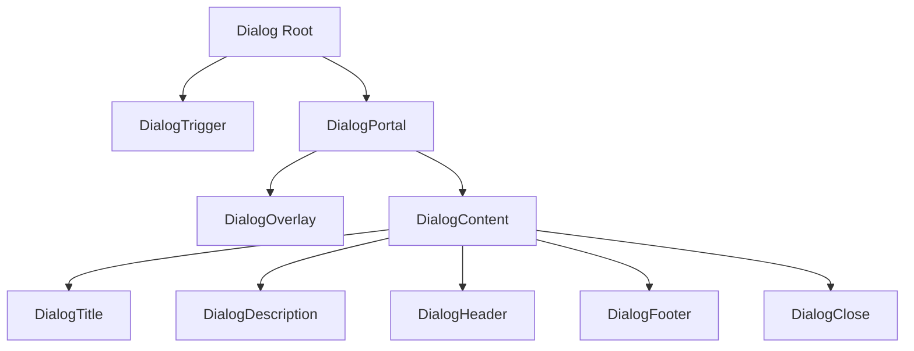
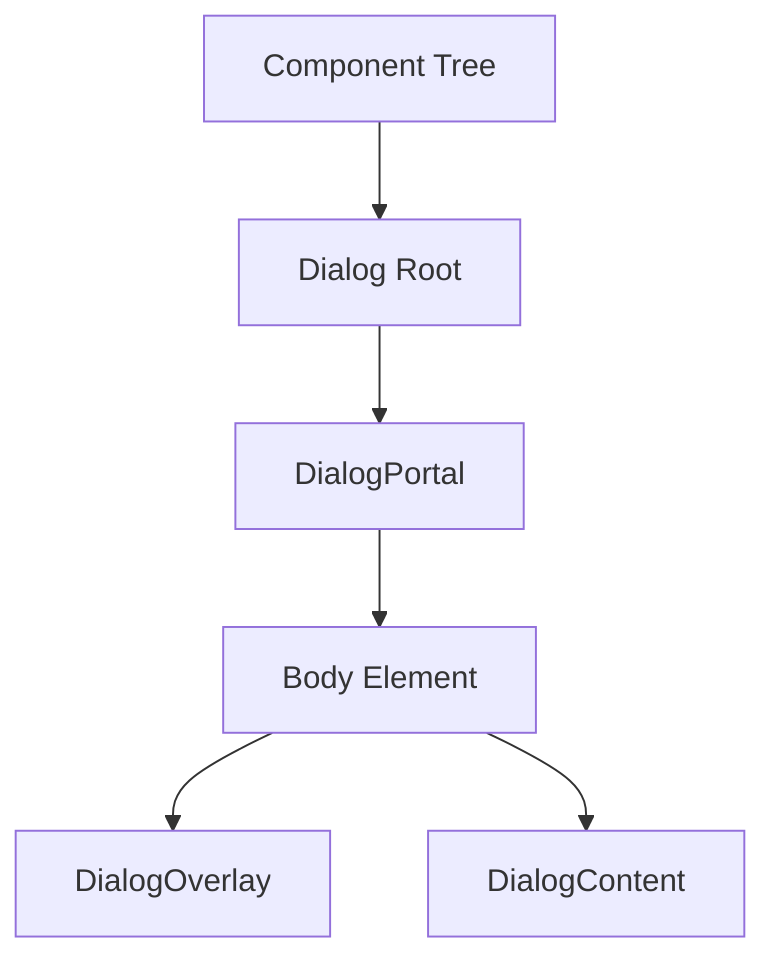
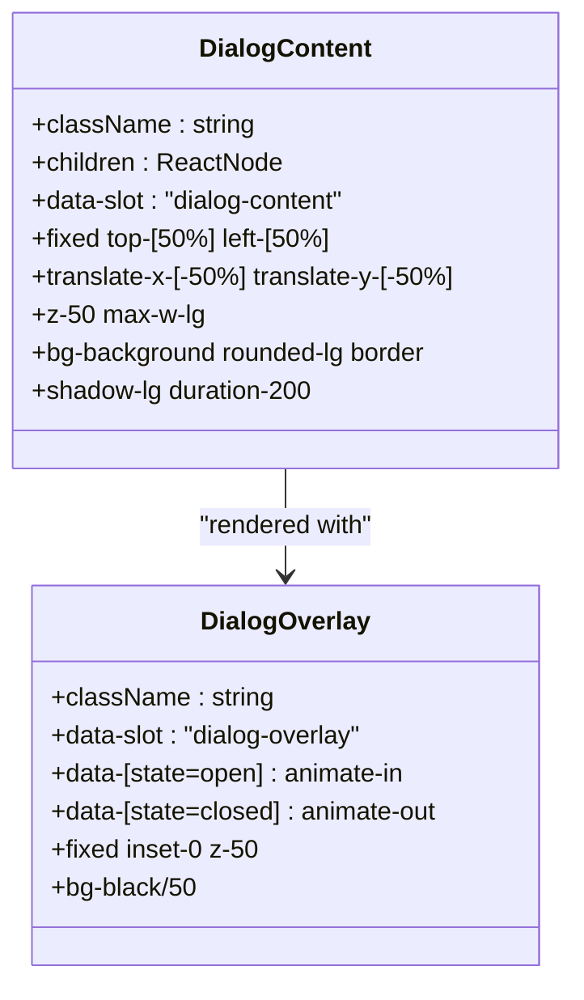

# Dialog

<cite>
**Referenced Files in This Document**   
- [dialog.tsx](file://src/components/ui/dialog.tsx)
</cite>

## Table of Contents
1. [Introduction](#introduction)
2. [Core Components](#core-components)
3. [Architecture Overview](#architecture-overview)
4. [Detailed Component Analysis](#detailed-component-analysis)
5. [Accessibility and User Interaction](#accessibility-and-user-interaction)
6. [Integration with Other Components](#integration-with-other-components)

## Introduction
The Dialog component is a reusable modal implementation built using Radix UI's `@radix-ui/react-dialog` primitives. It provides a fully accessible, animated, and composable modal system used throughout the application for critical user interactions such as booking confirmations and form submissions. The component leverages React portals for proper DOM rendering, implements focus trapping for accessibility compliance, and supports backdrop dismissal. It is integrated with Tailwind CSS for styling and uses Framer Motion via data attributes for entrance and exit animations.

**Section sources**
- [dialog.tsx](file://src/components/ui/dialog.tsx#L1-L135)

## Core Components
The Dialog component suite consists of multiple subcomponents that work together to create a complete modal experience:
- `Dialog`: Root component that manages open/closed state
- `DialogTrigger`: Button or element that opens the dialog
- `DialogContent`: The actual modal panel containing content
- `DialogOverlay`: Backdrop that covers the page when dialog is open
- `DialogTitle`: Accessible title for screen readers
- `DialogDescription`: Additional context for assistive technologies
- `DialogClose`: Close button with built-in dismissal behavior
- `DialogHeader` and `DialogFooter`: Layout helpers for consistent structure

These components are exported as a cohesive API that allows for flexible composition while maintaining consistent behavior and styling.

**Section sources**
- [dialog.tsx](file://src/components/ui/dialog.tsx#L1-L135)

## Architecture Overview
The Dialog component follows a compound component pattern, where the root `Dialog` component acts as a state container and the various subcomponents consume and interact with this state through Radix UI's context system. This architecture enables clean separation of concerns while allowing all parts to coordinate seamlessly.

**Diagram sources**
- [dialog.tsx](file://src/components/ui/dialog.tsx#L1-L135)

## Detailed Component Analysis

### Dialog Implementation
The Dialog component is implemented as a wrapper around Radix UI's primitives, enhancing them with project-specific styling and data attributes. It uses React portals via `DialogPortal` to render the modal content at the end of the document body, ensuring proper z-index stacking and avoiding clipping issues.

#### React Portals and DOM Rendering
The `DialogPortal` component ensures the dialog is rendered outside the normal component hierarchy, preventing CSS containment issues and ensuring the modal appears above all other content. This is critical for maintaining proper stacking context and avoiding overflow clipping from parent containers.

**Diagram sources**
- [dialog.tsx](file://src/components/ui/dialog.tsx#L31-L35)

#### Focus Trapping and Accessibility
The component automatically traps focus within the dialog when open, cycling through interactive elements and preventing focus from escaping to the background page. This is handled by Radix UI's `DialogPrimitive.Content` which implements WAI-ARIA modal dialog specifications.

#### Backdrop Interactions
The `DialogOverlay` component creates a semi-transparent backdrop that covers the entire viewport. Clicking on this overlay dismisses the dialog, providing an intuitive way for users to close the modal. The overlay is styled with a 50% black background and uses animation classes for smooth fade transitions.

**Diagram sources**
- [dialog.tsx](file://src/components/ui/dialog.tsx#L49-L73)

#### Animation System
The component integrates with Framer Motion through data attributes that trigger animations based on the dialog's state. The `data-[state=open]:animate-in` and `data-[state=closed]:animate-out` classes enable entrance and exit animations without requiring JavaScript animation logic. The content uses zoom transitions (`data-[state=closed]:zoom-out-95` and `data-[state=open]:zoom-in-95`) while the overlay uses fade transitions (`data-[state=closed]:fade-out-0` and `data-[state=open]:fade-in-0`).

**Section sources**
- [dialog.tsx](file://src/components/ui/dialog.tsx#L49-L73)

## Accessibility and User Interaction
The Dialog component implements comprehensive accessibility features to ensure usability for all users:

### ARIA Roles and Screen Reader Support
The component automatically applies appropriate ARIA roles and attributes through Radix UI's implementation. The `DialogTitle` component provides an accessible name for the dialog, while `DialogDescription` offers additional context for screen reader users. The `sr-only` class on the close button's span ensures "Close" is announced by screen readers without being visually displayed.

### Keyboard Navigation
The dialog supports standard keyboard interactions:
- **Escape key**: Closes the dialog when pressed
- **Tab/Shift+Tab**: Cycles through focusable elements within the dialog
- **Focus trapping**: Prevents focus from moving to elements outside the dialog

The close button is rendered as part of the `DialogContent` with absolute positioning in the top-right corner, making it consistently accessible across different dialog sizes and content configurations.

**Section sources**
- [dialog.tsx](file://src/components/ui/dialog.tsx#L68-L134)

## Integration with Other Components
The Dialog component is designed to work seamlessly with other UI components in the system:

### Button Integration
The `DialogClose` component is typically used with Button components to create action buttons that dismiss the dialog. While not shown in the dialog.tsx file itself, the component is designed to work with the project's Button component for consistent styling and behavior.

### Form Integration
The Dialog component is commonly used to contain forms, with `DialogHeader` providing space for titles and `DialogFooter` containing action buttons. The flexible `children` prop allows any content to be rendered within the dialog, making it suitable for complex forms with validation and submission states.

### State Management
The component accepts `open` and `onOpenChange` props to control its state externally, enabling integration with React's state management patterns. This allows parent components to control the dialog's visibility and respond to open/close events, facilitating data flow in critical user flows like booking confirmations.

**Section sources**
- [dialog.tsx](file://src/components/ui/dialog.tsx#L1-L135)