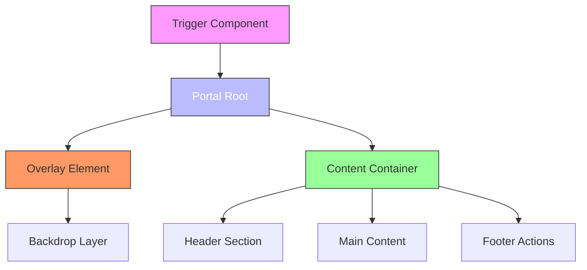
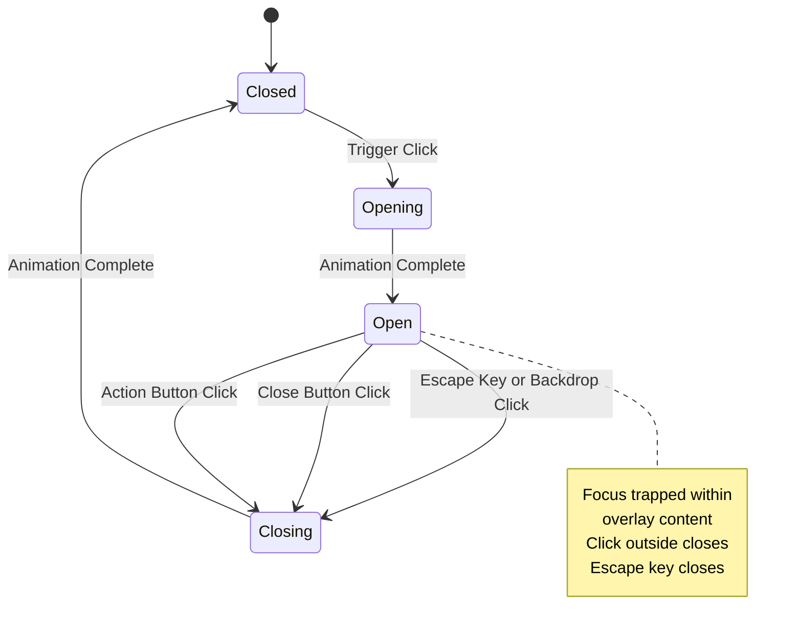
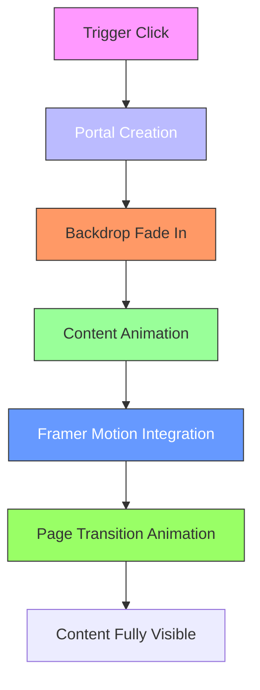
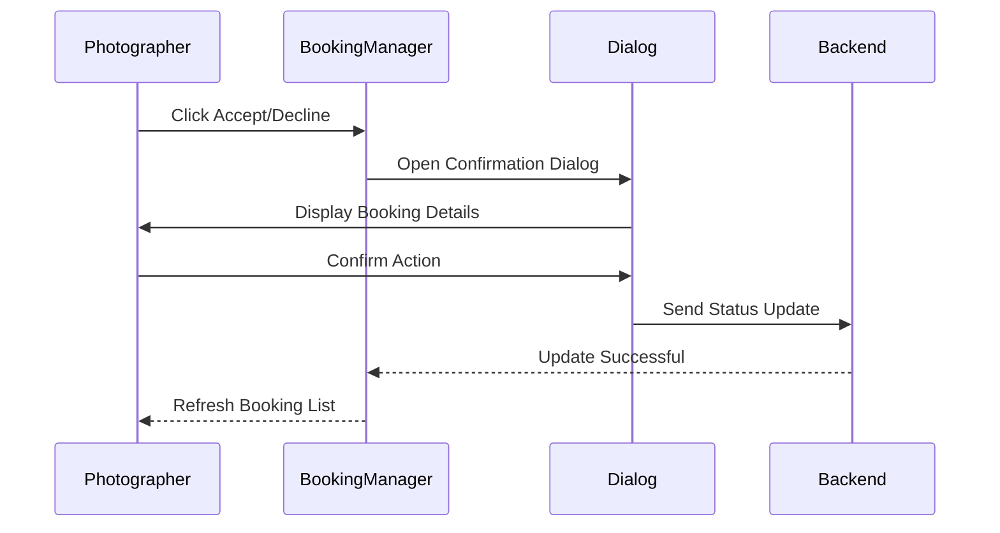
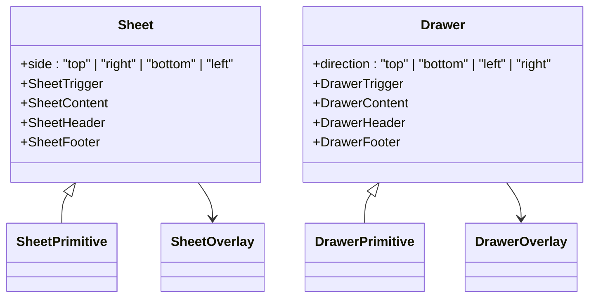

# Dialogs and Overlays

<cite>
**Referenced Files in This Document**   
- [dialog.tsx](file://src/components/ui/dialog.tsx)
- [alert-dialog.tsx](file://src/components/ui/alert-dialog.tsx)
- [popover.tsx](file://src/components/ui/popover.tsx)
- [sheet.tsx](file://src/components/ui/sheet.tsx)
- [drawer.tsx](file://src/components/ui/drawer.tsx)
- [command.tsx](file://src/components/ui/command.tsx)
- [tooltip.tsx](file://src/components/ui/tooltip.tsx)
- [hover-card.tsx](file://src/components/ui/hover-card.tsx)
- [utils.ts](file://src/components/ui/utils.ts)
- [PortfolioPage.tsx](file://src/components/PortfolioPage.tsx)
- [BookingManager.tsx](file://src/components/BookingManager.tsx)
</cite>

## Table of Contents
1. [Introduction](#introduction)
2. [Core Overlay Components](#core-overlay-components)
3. [Portal Implementation and DOM Management](#portal-implementation-and-dom-management)
4. [Focus Trapping and Keyboard Navigation](#focus-trapping-and-keyboard-navigation)
5. [Backdrop and Overlay Interactions](#backdrop-and-overlay-interactions)
6. [Animation Integration with Framer Motion](#animation-integration-with-framer-motion)
7. [Accessibility Implementation](#accessibility-implementation)
8. [State Management and Event Propagation](#state-management-and-event-propagation)
9. [Critical User Flows](#critical-user-flows)
10. [Component-Specific Analysis](#component-specific-analysis)

## Introduction
This document provides comprehensive documentation for the overlay components in the SnapEvent application, including dialog.tsx, alert-dialog.tsx, popover.tsx, sheet.tsx, drawer.tsx, command.tsx, tooltip.tsx, and hover-card.tsx. These components form the foundation of the application's interactive UI patterns, enabling modal interactions, contextual information display, and navigation flows. The documentation covers implementation details including portal usage, focus management, backdrop interactions, animation integration, accessibility requirements, and state management patterns.

## Core Overlay Components

The overlay components in the SnapEvent application are built using Radix UI primitives, providing accessible and composable building blocks for modal and non-modal interactions. Each component follows a consistent API pattern with trigger, content, overlay, and portal subcomponents, ensuring uniform behavior across different overlay types.

**Section sources**
- [dialog.tsx](file://src/components/ui/dialog.tsx#L1-L157)
- [alert-dialog.tsx](file://src/components/ui/alert-dialog.tsx#L1-L158)
- [popover.tsx](file://src/components/ui/popover.tsx#L1-L49)
- [sheet.tsx](file://src/components/ui/sheet.tsx#L1-L140)

## Portal Implementation and DOM Management

All overlay components utilize portals to render content outside the normal React component hierarchy, ensuring proper stacking context and preventing clipping issues. The components use Radix UI's Portal primitive to append overlay content to the end of the document body, maintaining proper z-index stacking and avoiding layout conflicts with parent containers.

The portal implementation ensures that overlays appear above all other content by using z-50 class and fixed positioning. This approach allows overlays to break out of confined containers and scrollable areas, providing a consistent user experience regardless of the component's position in the DOM tree.

**Diagram sources**
- [dialog.tsx](file://src/components/ui/dialog.tsx#L20-L23)
- [sheet.tsx](file://src/components/ui/sheet.tsx#L20-L23)
- [popover.tsx](file://src/components/ui/popover.tsx#L24-L27)

## Focus Trapping and Keyboard Navigation

The overlay components implement comprehensive focus trapping to ensure accessibility and proper keyboard navigation. When an overlay opens, focus is automatically moved to the first focusable element within the content, and subsequent tab presses cycle through focusable elements within the overlay. The Tab key is trapped within the overlay until it is dismissed, preventing users from accidentally navigating to background content.

All components support keyboard dismissal via the Escape key, which closes the overlay and returns focus to the triggering element. This behavior is consistent across all overlay types, providing a predictable user experience. The focus trap is implemented using Radix UI's built-in focus management, which handles edge cases like dynamically added focusable elements.

**Section sources**
- [dialog.tsx](file://src/components/ui/dialog.tsx#L50-L55)
- [sheet.tsx](file://src/components/ui/sheet.tsx#L40-L45)
- [alert-dialog.tsx](file://src/components/ui/alert-dialog.tsx#L40-L45)

## Backdrop and Overlay Interactions

Backdrop interactions are implemented consistently across all modal components to provide intuitive dismissal behavior. Clicking on the backdrop (the semi-transparent overlay behind the content) closes the component, with visual feedback provided through CSS transitions. The backdrop uses a 50% black background with fade-in/fade-out animations synchronized with the content animations.

The overlay components use data attributes to control animation states, with classes like `data-[state=open]:animate-in` and `data-[state=closed]:animate-out` enabling state-dependent animations. This approach allows for smooth transitions between open and closed states while maintaining accessibility by preserving the visual hierarchy.

**Diagram sources**
- [dialog.tsx](file://src/components/ui/dialog.tsx#L57-L68)
- [sheet.tsx](file://src/components/ui/sheet.tsx#L47-L58)
- [drawer.tsx](file://src/components/ui/drawer.tsx#L47-L58)

## Animation Integration with Framer Motion

While the base overlay components use CSS transitions for their animations, they are integrated with Framer Motion in higher-level components to create more sophisticated animation sequences. The components use data attributes to signal state changes, which are then used by Framer Motion to coordinate complex animations across multiple elements.

In the PortfolioPage component, Framer Motion is used to animate page transitions within the onboarding flow, with variants defined for initial, animate, and exit states. This allows for smooth transitions between different sections of the onboarding process while maintaining the modal nature of the sheet component that contains the entire flow.

**Diagram sources**
- [PortfolioPage.tsx](file://src/components/PortfolioPage.tsx#L132-L166)
- [dialog.tsx](file://src/components/ui/dialog.tsx#L70-L85)

## Accessibility Implementation

The overlay components prioritize accessibility through comprehensive screen reader support and keyboard navigation. Each component includes proper ARIA attributes and roles to ensure assistive technologies can properly interpret and navigate the content. Screen reader announcements are handled through semantic HTML structure and appropriate ARIA live regions.

All interactive elements include visible focus indicators and sufficient color contrast. The close buttons include screen reader-only text ("Close") to provide context for assistive technology users. The components also manage focus properly when opening and closing, ensuring that keyboard users can navigate the interface without becoming trapped or disoriented.

**Section sources**
- [dialog.tsx](file://src/components/ui/dialog.tsx#L85-L95)
- [sheet.tsx](file://src/components/ui/sheet.tsx#L105-L115)
- [tooltip.tsx](file://src/components/ui/tooltip.tsx#L30-L40)

## State Management and Event Propagation

The overlay components implement controlled and uncontrolled state patterns to accommodate different usage scenarios. They expose open/close state through props and callbacks, allowing parent components to manage the overlay's visibility. Event propagation is carefully managed to prevent unintended side effects, with events like onClickOutside and onEscapeKeyDown providing granular control over dismissal behavior.

The components use React's context API internally to share state between subcomponents (trigger, content, close buttons), eliminating the need for prop drilling while maintaining encapsulation. This approach allows for flexible composition while ensuring consistent behavior across different usage patterns.

**Section sources**
- [dialog.tsx](file://src/components/ui/dialog.tsx#L1-L10)
- [sheet.tsx](file://src/components/ui/sheet.tsx#L1-L10)
- [command.tsx](file://src/components/ui/command.tsx#L1-L10)

## Critical User Flows

### Booking Confirmation Flow
The booking confirmation flow uses the Dialog component to present a confirmation modal when a photographer accepts or declines a booking request. This critical interaction ensures that photographers intentionally confirm their availability, preventing accidental bookings. The dialog displays booking details and provides clear action buttons for acceptance or rejection.

**Diagram sources**
- [BookingManager.tsx](file://src/components/BookingManager.tsx#L195-L229)
- [dialog.tsx](file://src/components/ui/dialog.tsx#L1-L157)

### User Onboarding Flow
The user onboarding flow utilizes the Sheet component to guide new photographers through the profile setup process. The sheet provides a multi-step interface that slides in from the right, creating a focused experience that guides users through portfolio creation, service setup, and availability configuration. The sheet remains persistent throughout the onboarding process, with internal navigation between steps.

**Section sources**
- [PortfolioPage.tsx](file://src/components/PortfolioPage.tsx#L132-L166)
- [sheet.tsx](file://src/components/ui/sheet.tsx#L1-L140)

## Component-Specific Analysis

### Dialog and AlertDialog Components
The Dialog and AlertDialog components provide modal interfaces for important user interactions. While both share similar structural patterns, AlertDialog is specifically designed for destructive actions with dedicated action and cancel buttons. The components use Radix UI's Dialog primitive with custom styling and animation classes.

**Section sources**
- [dialog.tsx](file://src/components/ui/dialog.tsx#L1-L157)
- [alert-dialog.tsx](file://src/components/ui/alert-dialog.tsx#L1-L158)

### Sheet and Drawer Components
The Sheet and Drawer components provide sliding panel interfaces from different edges of the screen. The Sheet component uses Radix UI's Dialog primitive with directional slide animations, while the Drawer component uses the Vaul library for mobile-optimized bottom sheets. Both support multiple directions (top, right, bottom, left) and include swipe gestures on touch devices.

**Diagram sources**
- [sheet.tsx](file://src/components/ui/sheet.tsx#L1-L140)
- [drawer.tsx](file://src/components/ui/drawer.tsx#L1-L133)

### Popover, Tooltip, and HoverCard Components
These non-modal components provide contextual information without interrupting the user flow. Popover displays rich content on click, Tooltip shows brief text on hover, and HoverCard provides detailed information on hover with a delay. All three use Radix UI primitives with portal rendering to ensure proper positioning and stacking.

**Section sources**
- [popover.tsx](file://src/components/ui/popover.tsx#L1-L49)
- [tooltip.tsx](file://src/components/ui/tooltip.tsx#L1-L62)
- [hover-card.tsx](file://src/components/ui/hover-card.tsx#L1-L45)

### Command Component
The Command component implements a searchable command palette interface, combining the Cmdk library with the Dialog component for modal presentation. It supports keyboard navigation, fuzzy search, and nested command groups. The component is designed for power user interactions, allowing quick access to application functionality through a searchable interface.

**Section sources**
- [command.tsx](file://src/components/ui/command.tsx#L1-L178)
- [dialog.tsx](file://src/components/ui/dialog.tsx#L1-L157)