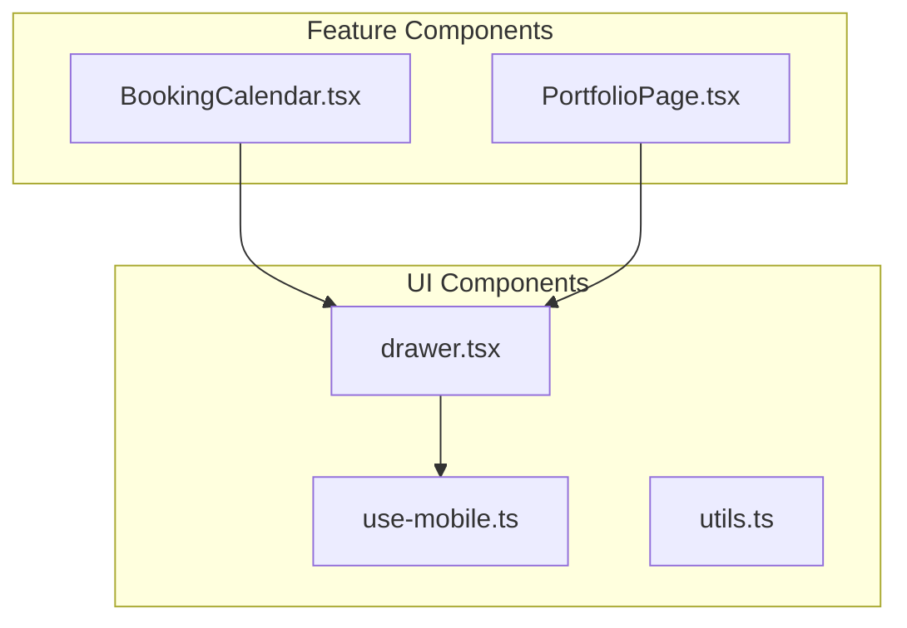
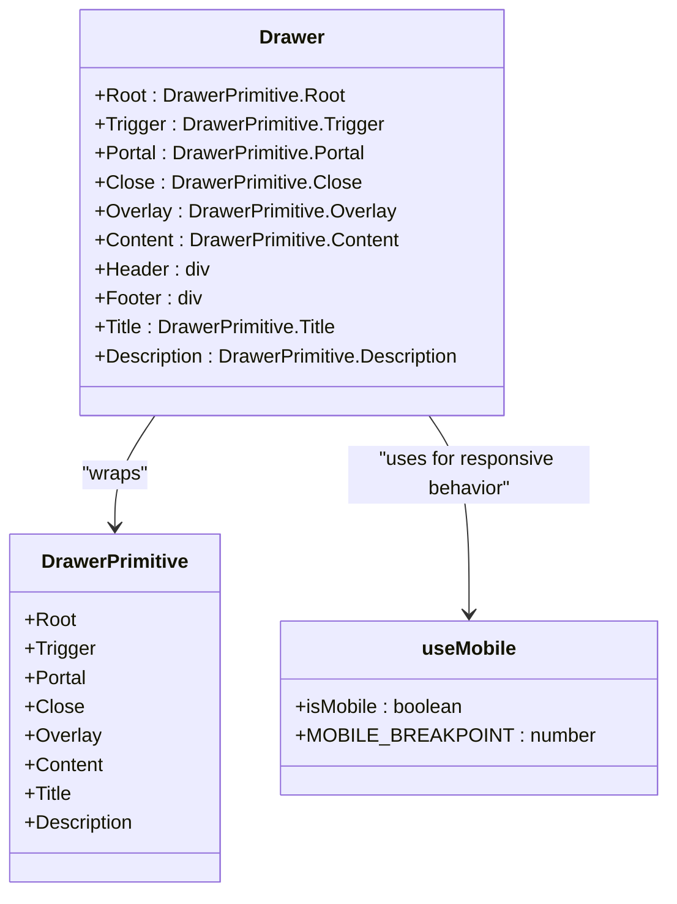
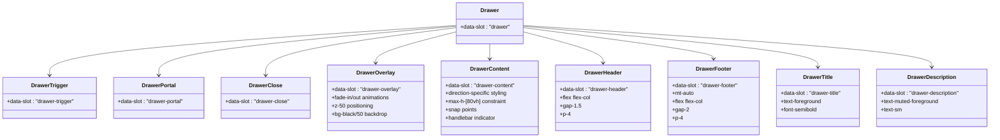
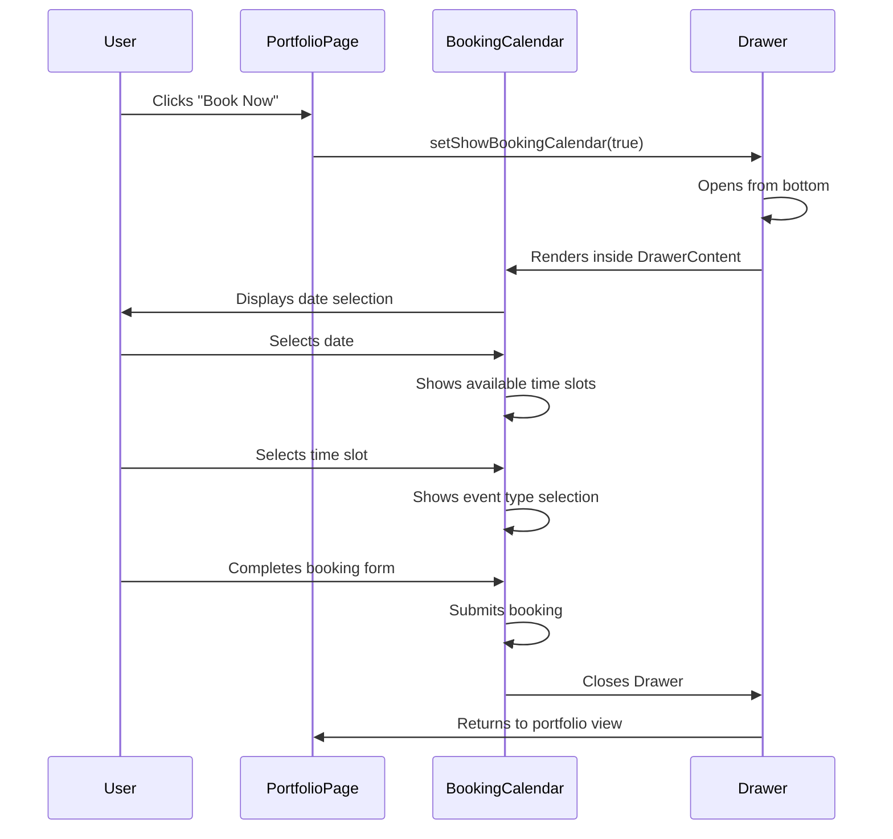
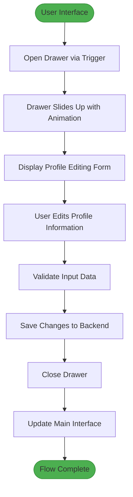
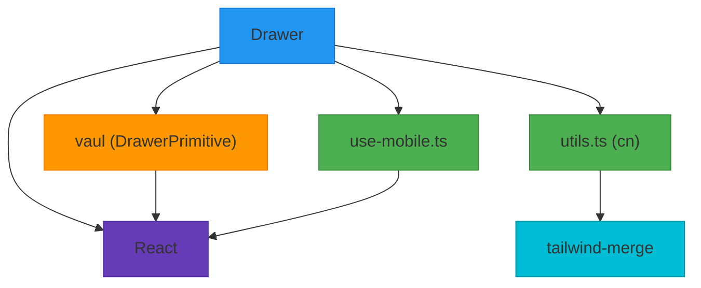

# Drawer

<cite>
**Referenced Files in This Document**   
- [drawer.tsx](file://src/components/ui/drawer.tsx)
- [use-mobile.ts](file://src/components/ui/use-mobile.ts)
- [BookingCalendar.tsx](file://src/components/BookingCalendar.tsx)
- [PortfolioPage.tsx](file://src/components/PortfolioPage.tsx)
</cite>

## Table of Contents
1. [Introduction](#introduction)
2. [Project Structure](#project-structure)
3. [Core Components](#core-components)
4. [Architecture Overview](#architecture-overview)
5. [Detailed Component Analysis](#detailed-component-analysis)
6. [Dependency Analysis](#dependency-analysis)
7. [Performance Considerations](#performance-considerations)
8. [Troubleshooting Guide](#troubleshooting-guide)
9. [Conclusion](#conclusion)

## Introduction
The Drawer component is a responsive, touch-optimized alternative to the Sheet component, designed specifically for mobile-first user experiences. Built on the Vaul library, it provides enhanced gesture support, snap points, and momentum scrolling for natural touch interactions. This documentation details its implementation, usage patterns in key interfaces like the booking calendar and photographer profile editing, and integration with Framer Motion for fluid animations. The component prioritizes mobile browser compatibility and performance while addressing accessibility challenges inherent in touch-only gesture interfaces.

## Project Structure
The Drawer component resides in the UI component library and is implemented as a wrapper around the Vaul library. It follows the component structure pattern used throughout the application's design system.

**Diagram sources**
- [drawer.tsx](file://src/components/ui/drawer.tsx)
- [use-mobile.ts](file://src/components/ui/use-mobile.ts)
- [BookingCalendar.tsx](file://src/components/BookingCalendar.tsx)
- [PortfolioPage.tsx](file://src/components/PortfolioPage.tsx)

**Section sources**
- [drawer.tsx](file://src/components/ui/drawer.tsx)
- [use-mobile.ts](file://src/components/ui/use-mobile.ts)

## Core Components
The Drawer component is implemented as a set of React components that wrap the Vaul library's primitives. It includes the main Drawer container, trigger, portal, overlay, content, header, footer, title, and description components. The implementation leverages data attributes for styling and uses the `cn` utility for class composition. The component is designed to be used as a mobile-optimized alternative to the Sheet component, with touch-first interactions and gesture support.

**Section sources**
- [drawer.tsx](file://src/components/ui/drawer.tsx)

## Architecture Overview
The Drawer component architecture is built on top of the Vaul library, providing a React wrapper with additional styling and data attributes. It integrates with the application's responsive design system through the useMobile hook and follows the same pattern as other UI components in the library.

**Diagram sources**
- [drawer.tsx](file://src/components/ui/drawer.tsx)
- [use-mobile.ts](file://src/components/ui/use-mobile.ts)

## Detailed Component Analysis

### Drawer Implementation Analysis
The Drawer component is implemented as a wrapper around the Vaul library's DrawerPrimitive components. It adds data-slot attributes for styling and uses the cn utility for class composition. The component supports multiple directions (top, bottom, right, left) and includes snap points for different screen sizes.

#### Component Structure:

**Diagram sources**
- [drawer.tsx](file://src/components/ui/drawer.tsx)

**Section sources**
- [drawer.tsx](file://src/components/ui/drawer.tsx)

### Usage in Booking Calendar Interface
The Drawer component is used in the booking calendar interface to provide a mobile-optimized booking experience. When a user selects a photographer, the booking calendar is presented in a Drawer that slides up from the bottom of the screen.

#### Booking Calendar Workflow:

**Diagram sources**
- [PortfolioPage.tsx](file://src/components/PortfolioPage.tsx)
- [BookingCalendar.tsx](file://src/components/BookingCalendar.tsx)

**Section sources**
- [PortfolioPage.tsx](file://src/components/PortfolioPage.tsx)
- [BookingCalendar.tsx](file://src/components/BookingCalendar.tsx)

### Usage in Photographer Profile Editing
The Drawer component is used in the photographer profile editing flow to provide a mobile-friendly interface for updating profile information. The component enables a seamless editing experience with gesture-based opening and closing.

#### Profile Editing Flow:

**Diagram sources**
- [PortfolioPage.tsx](file://src/components/PortfolioPage.tsx)

**Section sources**
- [PortfolioPage.tsx](file://src/components/PortfolioPage.tsx)

## Dependency Analysis
The Drawer component has dependencies on several key libraries and components within the application. These dependencies enable its responsive behavior, styling, and integration with the overall design system.

**Diagram sources**
- [drawer.tsx](file://src/components/ui/drawer.tsx)
- [use-mobile.ts](file://src/components/ui/use-mobile.ts)
- [utils.ts](file://src/components/ui/utils.ts)

**Section sources**
- [drawer.tsx](file://src/components/ui/drawer.tsx)
- [use-mobile.ts](file://src/components/ui/use-mobile.ts)
- [utils.ts](file://src/components/ui/utils.ts)

## Performance Considerations
The Drawer component is optimized for mobile performance with several key considerations:

1. **Gesture Sensitivity**: The component uses Vaul's gesture system which is optimized for touch interactions, providing smooth momentum scrolling and snap point transitions.

2. **Mobile Browser Compatibility**: The implementation accounts for mobile browser quirks, particularly around viewport units and touch events.

3. **Animation Performance**: Animations are handled through CSS transitions and transforms rather than JavaScript, ensuring 60fps performance on mobile devices.

4. **Memory Efficiency**: The component unmounts when closed, reducing memory footprint when not in use.

5. **Lazy Loading**: When used with Next.js dynamic imports, the Drawer content can be loaded on demand.

The component's performance is further enhanced by the use of React's memoization and the efficient rendering of the Vaul library.

**Section sources**
- [drawer.tsx](file://src/components/ui/drawer.tsx)

## Troubleshooting Guide
When working with the Drawer component, several common issues may arise:

1. **Accessibility Challenges**: The touch-only gestures can create accessibility barriers for keyboard and screen reader users.

2. **Z-Index Conflicts**: The Drawer's z-50 positioning may conflict with other overlay elements.

3. **Mobile Browser Viewport Issues**: Some mobile browsers handle viewport units differently, affecting the max-h-[80vh] constraint.

4. **Gesture Conflicts**: The swipe gestures may conflict with browser navigation gestures.

Solutions include:
- Implementing keyboard navigation support
- Adding ARIA labels and roles for screen readers
- Using the useMobile hook to adjust behavior based on device type
- Properly managing focus when the Drawer opens and closes
- Testing across multiple mobile browsers and devices

**Section sources**
- [drawer.tsx](file://src/components/ui/drawer.tsx)
- [use-mobile.ts](file://src/components/ui/use-mobile.ts)

## Conclusion
The Drawer component provides a mobile-optimized alternative to the Sheet component, with enhanced touch gestures, snap points, and momentum scrolling. Built on the Vaul library, it integrates seamlessly with the application's design system and provides a superior mobile user experience. The component is used in key interfaces like the booking calendar and profile editing, where its touch-first design improves usability. While the component excels in mobile performance and gesture support, attention should be paid to accessibility considerations for keyboard and screen reader users. The integration with Framer Motion in parent components enables fluid animations and state synchronization, creating a cohesive user experience across the application.