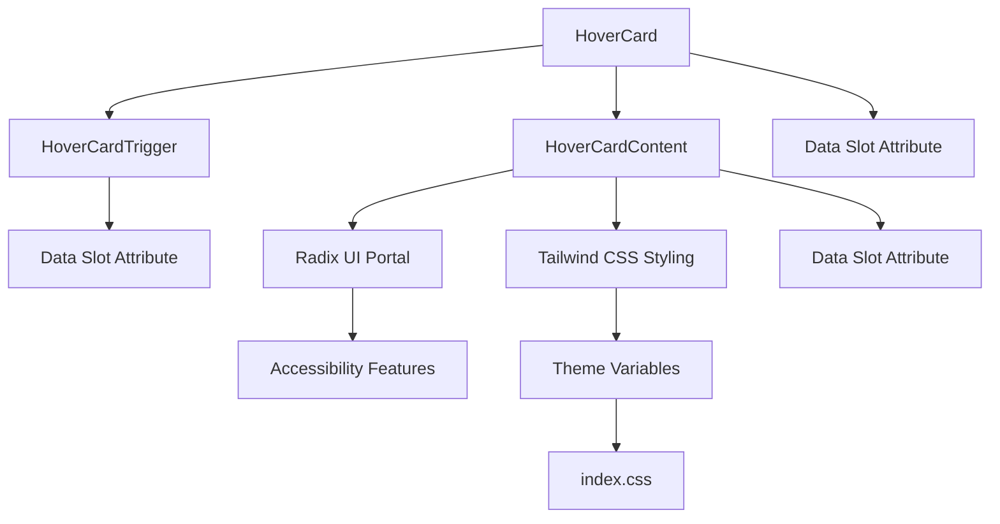
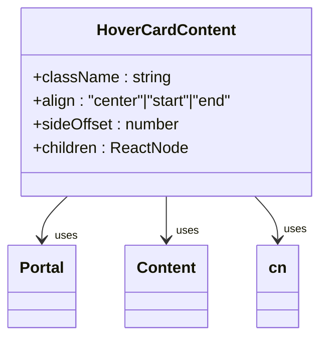
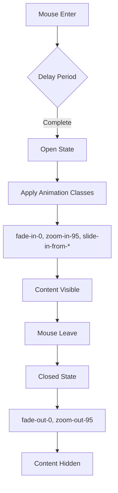

# Hover Card

<cite>
**Referenced Files in This Document**   
- [hover-card.tsx](file://src/components/ui/hover-card.tsx)
- [LandingPage.tsx](file://src/components/LandingPage.tsx)
- [utils.ts](file://src/components/ui/utils.ts)
- [package.json](file://package.json)
- [tailwind.config.js](file://tailwind.config.js)
- [index.css](file://src/index.css)
</cite>

## Table of Contents
1. [Introduction](#introduction)
2. [Core Components](#core-components)
3. [Architecture Overview](#architecture-overview)
4. [Detailed Component Analysis](#detailed-component-analysis)
5. [Integration and Usage](#integration-and-usage)
6. [Performance Considerations](#performance-considerations)
7. [Accessibility Features](#accessibility-features)
8. [Styling and Animation](#styling-and-animation)
9. [Conclusion](#conclusion)

## Introduction
The HoverCard component provides contextual information display on hover interactions within the SnapEvent application. It is primarily used in photographer discovery to show preview profiles without requiring navigation. The component leverages Radix UI's hover card primitive with custom styling and integration patterns specific to the application's design system.

**Section sources**
- [hover-card.tsx](file://src/components/ui/hover-card.tsx#L1-L43)

## Core Components
The HoverCard component consists of three main parts: HoverCard, HoverCardTrigger, and HoverCardContent. These components work together to create a seamless hover interaction experience. The implementation wraps Radix UI's hover card primitives with application-specific data attributes and styling through the utility class system.

**Section sources**
- [hover-card.tsx](file://src/components/ui/hover-card.tsx#L7-L43)

## Architecture Overview

**Diagram sources**
- [hover-card.tsx](file://src/components/ui/hover-card.tsx#L7-L43)
- [index.css](file://src/index.css#L1-L59)

## Detailed Component Analysis

### HoverCard Root Component
The HoverCard component serves as the root container that manages the open state and delay controls for the hover interaction. It uses Radix UI's HoverCardPrimitive.Root with a custom data-slot attribute for styling purposes.

**Section sources**
- [hover-card.tsx](file://src/components/ui/hover-card.tsx#L7-L11)

### HoverCard Trigger Component
The HoverCardTrigger component defines the element that activates the hover card when hovered. It wraps the Radix UI trigger with a consistent data-slot attribute for styling consistency across the application.

**Section sources**
- [hover-card.tsx](file://src/components/ui/hover-card.tsx#L13-L18)

### HoverCardContent Component
The HoverCardContent component displays the rich contextual information and includes several key features:

- Default alignment set to "center"
- Side offset of 4 pixels
- Custom styling through the cn utility function
- Animation classes for smooth appearance and disappearance
- Portal rendering to prevent z-index issues

The content is rendered through Radix UI's Portal component, ensuring proper layering in complex UI layouts.

**Diagram sources**
- [hover-card.tsx](file://src/components/ui/hover-card.tsx#L21-L39)
- [utils.ts](file://src/components/ui/utils.ts#L1-L7)

## Integration and Usage
While the HoverCard component is defined in the UI library, its primary usage is intended for photographer discovery scenarios. The component would be integrated with API calls through the photographersAPI service to dynamically load profile data. Caching strategies would prevent repeated requests when users hover over the same photographer multiple times.

The component is designed to work with the application's theme system, using CSS variables defined in index.css that support both light and dark modes. The styling leverages Tailwind CSS with theme extensions for consistent design language.

**Section sources**
- [hover-card.tsx](file://src/components/ui/hover-card.tsx#L1-L43)
- [tailwind.config.js](file://tailwind.config.js#L1-L77)
- [index.css](file://src/index.css#L1-L59)

## Performance Considerations
The HoverCard component is optimized for performance with several key features:

- Uses React's memoization patterns through Radix UI primitives
- Implements portal rendering to avoid layout thrashing
- Leverages CSS transitions for smooth animations instead of JavaScript-based animations
- Supports delay controls to prevent accidental triggers
- Designed to handle multiple simultaneous instances efficiently

The component's lightweight implementation ensures minimal impact on page performance even when multiple instances are present.

**Section sources**
- [hover-card.tsx](file://src/components/ui/hover-card.tsx#L1-L43)
- [package.json](file://package.json#L1-L94)

## Accessibility Features
The HoverCard component inherits accessibility features from Radix UI's implementation, including:

- Keyboard navigation support
- Screen reader compatibility
- Focus management
- Proper ARIA attributes

However, additional considerations are needed for keyboard-only users, such as providing alternative interaction patterns like click-to-open functionality or dedicated keyboard shortcuts to access hover card content.

**Section sources**
- [hover-card.tsx](file://src/components/ui/hover-card.tsx#L1-L43)

## Styling and Animation
The HoverCard component uses a sophisticated animation system powered by Tailwind CSS and the application's theme configuration:

- Fade in/out transitions based on open state
- Zoom effects (95% scale) for smooth appearance
- Slide-in animations from the appropriate side based on placement
- CSS custom properties for theme variables

The animations are defined in the Tailwind configuration with keyframes for accordion effects, and the component leverages data attributes (data-state, data-side) to control the appropriate animation states.

**Diagram sources**
- [hover-card.tsx](file://src/components/ui/hover-card.tsx#L28-L38)
- [tailwind.config.js](file://tailwind.config.js#L50-L77)

## Conclusion
The HoverCard component provides a robust solution for displaying contextual information on hover interactions within the SnapEvent application. Built on Radix UI's accessible primitives and enhanced with custom styling through Tailwind CSS, it offers a seamless user experience for photographer discovery. The component's architecture supports dynamic data loading, efficient rendering, and smooth animations while maintaining accessibility standards. Its implementation follows the application's design system principles and can be easily integrated into various parts of the interface where rich hover previews are needed.