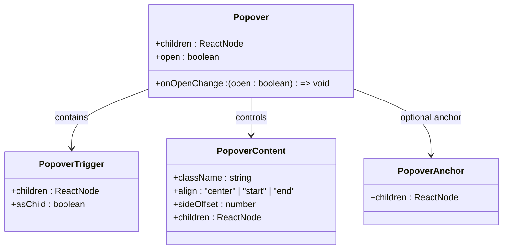
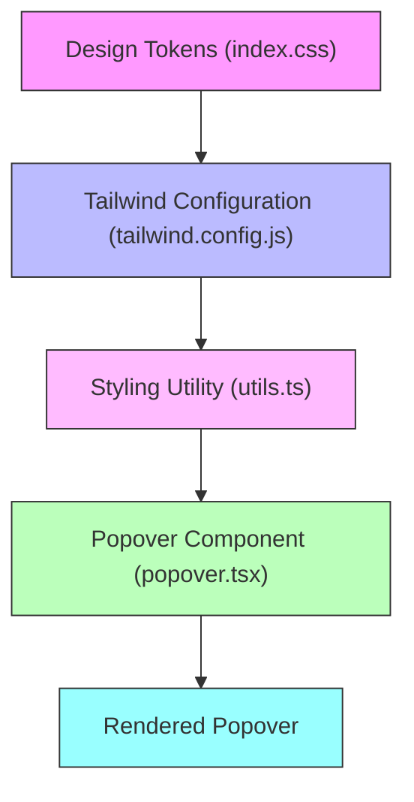
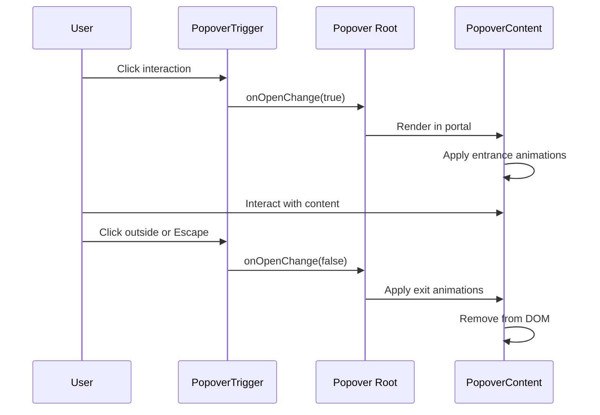

# Popover

<cite>
**Referenced Files in This Document**   
- [popover.tsx](file://src/components/ui/popover.tsx)
- [utils.ts](file://src/components/ui/utils.ts)
- [tailwind.config.js](file://tailwind.config.js)
- [index.css](file://src/index.css)
- [hover-card.tsx](file://src/components/ui/hover-card.tsx)
- [package.json](file://package.json)
</cite>

## Table of Contents
1. [Introduction](#introduction)
2. [Core Components](#core-components)
3. [Positioning and Layout](#positioning-and-layout)
4. [Styling and Appearance](#styling-and-appearance)
5. [Animation Patterns](#animation-patterns)
6. [Accessibility Considerations](#accessibility-considerations)
7. [Usage Scenarios](#usage-scenarios)
8. [Integration Examples](#integration-examples)
9. [Conclusion](#conclusion)

## Introduction
The Popover component is a lightweight overlay utility designed to display contextual information in a non-intrusive manner. Built on top of `@radix-ui/react-popover`, it provides a flexible and accessible solution for showing additional content such as profile details, filter options, or calendar event information. The component supports various trigger interactions (click and hover), dynamic positioning, and smooth animations powered by Tailwind CSS transitions and Framer Motion.

**Section sources**
- [popover.tsx](file://src/components/ui/popover.tsx#L1-L48)

## Core Components
The Popover implementation consists of four primary components that work together to create a fully functional overlay system:

- **Popover**: The root component that manages the open/closed state of the popover
- **PopoverTrigger**: The interactive element that toggles the popover visibility
- **PopoverContent**: The container for the popover's content, rendered in a portal
- **PopoverAnchor**: An optional anchor point for positioning the popover relative to a specific element

These components follow the headless UI pattern, allowing complete control over styling while maintaining accessibility standards. The implementation uses React's composition model to provide flexibility in usage patterns.

**Diagram sources**
- [popover.tsx](file://src/components/ui/popover.tsx#L7-L48)

**Section sources**
- [popover.tsx](file://src/components/ui/popover.tsx#L7-L48)

## Positioning and Layout
The Popover component leverages the positioning engine from `@radix-ui/react-popover` to handle complex layout calculations. The positioning system automatically detects collisions with the viewport and adjusts the popover placement accordingly. Key positioning features include:

- **Dynamic Alignment**: The `align` prop (default: "center") controls horizontal alignment when the popover is positioned above or below its trigger
- **Side Offset**: The `sideOffset` prop (default: 4) sets the distance between the popover and its trigger element in pixels
- **Automatic Collision Detection**: The underlying Radix UI library automatically repositions the popover to prevent overflow when space is limited
- **Supported Placement Directions**: top, bottom, left, and right orientations are supported through the Radix UI positioning engine

The component uses a portal (`PopoverPrimitive.Portal`) to render the content in the document body, ensuring it can break out of overflow-hidden containers and appear above other elements in the z-index stack.

**Section sources**
- [popover.tsx](file://src/components/ui/popover.tsx#L19-L37)

## Styling and Appearance
The Popover component's appearance is defined through a combination of Tailwind CSS utility classes and design tokens. The styling system uses the `cn()` utility function to merge custom class names with default styles.

Key visual characteristics:
- **Background and Text**: Uses CSS variables `--popover` and `--popover-foreground` for color theming, supporting both light and dark modes
- **Dimensions**: Fixed width of 72 (w-72) with responsive padding (p-4) and rounded corners (rounded-md)
- **Elevation**: Border (border) and shadow (shadow-md) provide visual separation from content
- **Z-Index**: Set to 50 (z-50) to ensure the popover appears above most other elements

The design tokens are defined in the CSS variables within `index.css`, with values that adapt to the user's preferred color scheme through the `.dark` class.

**Diagram sources**
- [index.css](file://src/index.css#L1-L59)
- [tailwind.config.js](file://tailwind.config.js#L1-L77)
- [utils.ts](file://src/components/ui/utils.ts#L1-L6)
- [popover.tsx](file://src/components/ui/popover.tsx#L26-L35)

**Section sources**
- [popover.tsx](file://src/components/ui/popover.tsx#L26-L35)
- [index.css](file://src/index.css#L1-L59)
- [tailwind.config.js](file://tailwind.config.js#L1-L77)

## Animation Patterns
The Popover component implements subtle entrance and exit animations using Tailwind CSS's data attribute-based animation system. The animations are triggered by the `data-state` attribute that reflects the popover's open/closed status.

Animation behaviors:
- **Fade Effects**: `fade-out-0` and `fade-in-0` classes control opacity transitions
- **Scale Transformations**: `zoom-out-95` and `zoom-in-95` create a subtle scaling effect
- **Directional Sliding**: Slide-in animations vary based on the side placement (`slide-in-from-top-2`, `slide-in-from-bottom-2`, etc.)
- **State Transitions**: `animate-in` and `animate-out` classes are applied conditionally based on the popover's state

Although Framer Motion is available in the project dependencies (`framer-motion` in package.json), the current implementation relies on Tailwind's built-in animation utilities rather than Framer Motion for the core popover transitions. This suggests Framer Motion may be used for more complex animations in other components or for custom popover content.

**Section sources**
- [popover.tsx](file://src/components/ui/popover.tsx#L26-L35)
- [package.json](file://package.json#L30-L94)

## Accessibility Considerations
The Popover component inherits accessibility features from `@radix-ui/react-popover`, ensuring compliance with WAI-ARIA standards. Key accessibility features include:

- **Keyboard Navigation**: The component supports keyboard interaction, including opening/closing with Enter/Space and closing with Escape
- **Focus Management**: Focus is automatically trapped within the popover when open and restored to the trigger element when closed
- **Screen Reader Support**: Proper ARIA roles and attributes are applied to ensure screen readers can interpret the popover's purpose and state
- **Data Attributes**: Custom data-slot attributes provide hooks for styling while maintaining semantic HTML

The implementation follows the WAI-ARIA Authoring Practices for dialog patterns, treating the popover as a lightweight dialog that provides additional context without requiring user interaction.

**Section sources**
- [popover.tsx](file://src/components/ui/popover.tsx#L1-L48)

## Usage Scenarios
The Popover component is designed for various contextual information display scenarios:

- **Profile Information Display**: Showing user details, contact information, or social links when clicking on a profile avatar
- **Filter Options**: Presenting filtering criteria or advanced search options in a compact overlay
- **Calendar Date Details**: Displaying event information or availability when hovering over calendar dates
- **Form Element Guidance**: Providing contextual help or validation information for form fields
- **Navigation Item Explanations**: Showing additional information about menu items or navigation links

The component's flexibility allows it to be used with various trigger types, including buttons, text links, icons, and interactive images.

**Section sources**
- [popover.tsx](file://src/components/ui/popover.tsx#L7-L48)

## Integration Examples
The Popover component can be integrated with various UI elements:

### Form Elements Integration
The Popover can be used to provide contextual help for form inputs by placing the trigger adjacent to the input field and displaying guidance content in the popover.

### Navigation Items Integration
When used with navigation menus, the Popover can display additional information about menu items, such as shortcuts, descriptions, or status indicators.

The component follows a consistent API pattern similar to other Radix UI components in the codebase, such as HoverCard, which shares nearly identical styling and positioning logic. This consistency enables developers to easily switch between different overlay types based on interaction requirements (click vs. hover).

**Diagram sources**
- [popover.tsx](file://src/components/ui/popover.tsx#L7-L48)

**Section sources**
- [popover.tsx](file://src/components/ui/popover.tsx#L7-L48)

## Conclusion
The Popover component provides a robust, accessible, and visually consistent solution for displaying contextual information in the application. Built on the reliable foundation of Radix UI, it offers automatic positioning, collision detection, and accessibility features out of the box. The styling system integrates seamlessly with the Tailwind CSS configuration and design tokens, ensuring visual consistency across light and dark themes. While the current implementation uses Tailwind's animation utilities, the presence of Framer Motion in dependencies suggests potential for more sophisticated animations in custom implementations. The component's modular design and clear separation of concerns make it easy to use and extend for various contextual information display needs.

**Section sources**
- [popover.tsx](file://src/components/ui/popover.tsx#L1-L48)
- [package.json](file://package.json#L30-L94)