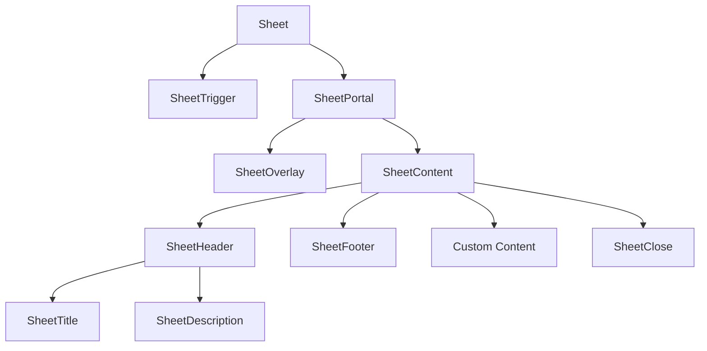
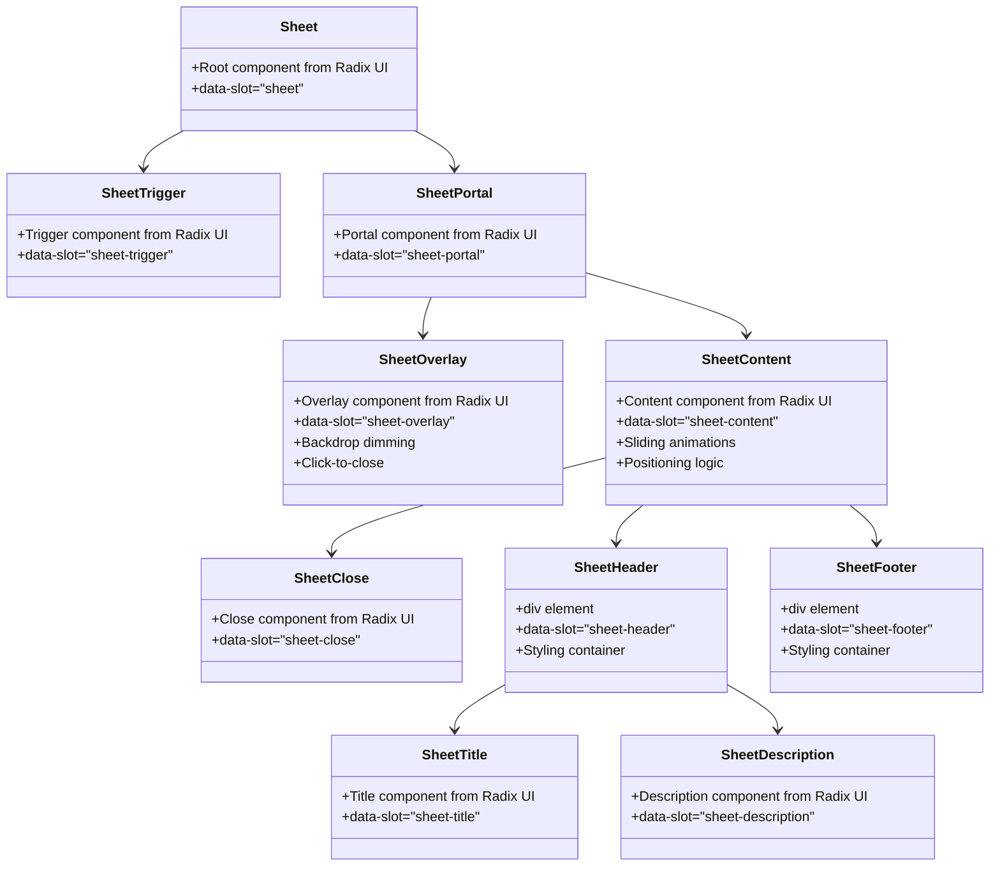
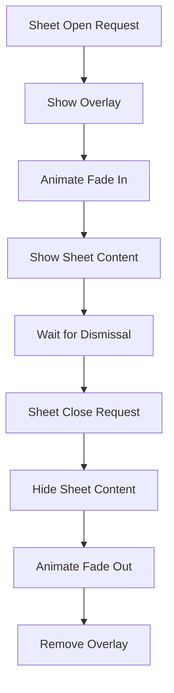
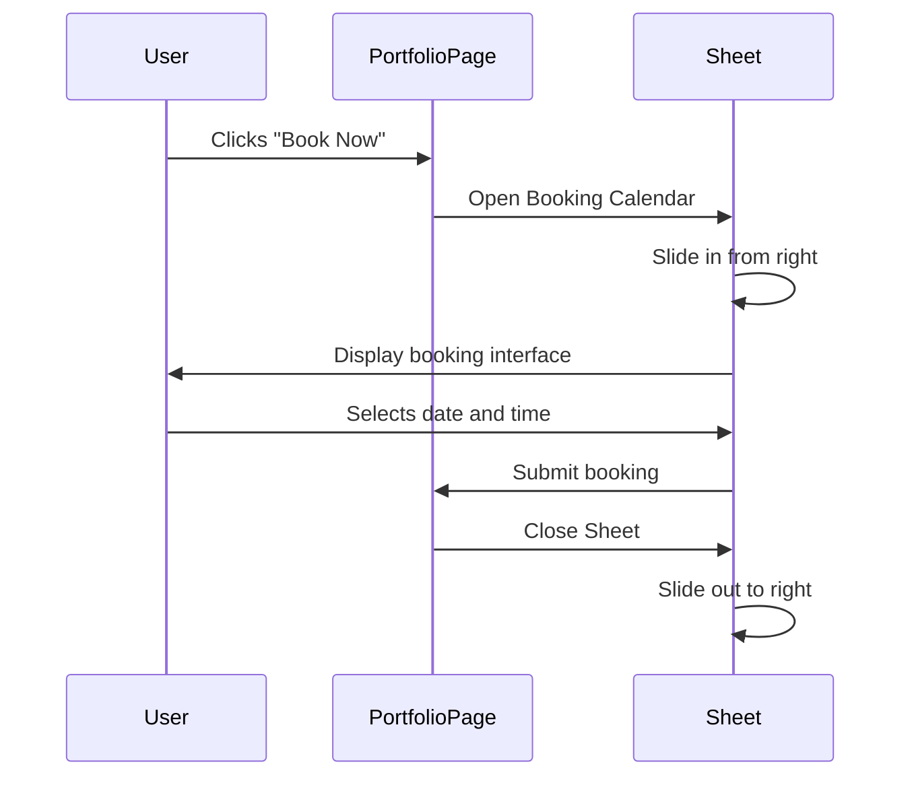

# Sheet

<cite>
**Referenced Files in This Document**   
- [sheet.tsx](file://src/components/ui/sheet.tsx)
- [OnboardingForm.tsx](file://src/components/OnboardingForm.tsx)
- [PortfolioPage.tsx](file://src/components/PortfolioPage.tsx)
- [ProfileSetup.tsx](file://pages/profile/setup.tsx)
- [utils.ts](file://src/components/ui/utils.ts)
</cite>

## Table of Contents
1. [Introduction](#introduction)
2. [Core Components](#core-components)
3. [Architecture Overview](#architecture-overview)
4. [Detailed Component Analysis](#detailed-component-analysis)
5. [Usage in Photographer Onboarding Flow](#usage-in-photographer-onboarding-flow)
6. [Mobile Navigation Integration](#mobile-navigation-integration)
7. [Configuration Options](#configuration-options)
8. [Accessibility Considerations](#accessibility-considerations)
9. [Conclusion](#conclusion)

## Introduction
The Sheet component is a mobile-inspired sliding panel that emerges from screen edges, providing an elegant way to present additional content without full page navigation. It supports touch gestures, swipe-to-dismiss functionality, and backdrop dimming for improved user experience. This document details its implementation, configuration options, and primary usage patterns within the application, particularly in the photographer onboarding flow and mobile navigation contexts.

**Section sources**
- [sheet.tsx](file://src/components/ui/sheet.tsx#L1-L140)

## Core Components
The Sheet component is built using Radix UI's Dialog primitive, extended with custom styling and positioning logic. It consists of several subcomponents that work together to create the sliding panel experience: Sheet (container), SheetTrigger (opener), SheetClose (closer), SheetPortal (render container), SheetOverlay (backdrop), SheetContent (main panel), SheetHeader, SheetFooter, SheetTitle, and SheetDescription. These components are designed to work together seamlessly while allowing individual customization.

**Section sources**
- [sheet.tsx](file://src/components/ui/sheet.tsx#L1-L140)

## Architecture Overview
The Sheet component follows a composition pattern, wrapping Radix UI's Dialog components with application-specific styling and behavior. It uses CSS animations for smooth transitions and leverages React's portal pattern to render the sheet outside the normal DOM hierarchy, ensuring proper z-index stacking and preventing layout interference.

**Diagram sources**
- [sheet.tsx](file://src/components/ui/sheet.tsx#L1-L140)

## Detailed Component Analysis

### Sheet Implementation
The Sheet component is implemented as a wrapper around Radix UI's Dialog components, enhancing them with mobile-friendly sliding animations and positioning options. The implementation leverages CSS classes and data attributes to control animation states and visual appearance.

#### Component Structure

**Diagram sources**
- [sheet.tsx](file://src/components/ui/sheet.tsx#L1-L140)

**Section sources**
- [sheet.tsx](file://src/components/ui/sheet.tsx#L1-L140)

### Touch Gesture Support
The Sheet component inherits touch gesture support from Radix UI's Dialog implementation, including swipe-to-dismiss functionality. The component responds to touch events on mobile devices, allowing users to drag the sheet down (or in the opposite direction of its origin) to dismiss it. The backdrop overlay also responds to taps, providing an alternative dismissal method.

**Section sources**
- [sheet.tsx](file://src/components/ui/sheet.tsx#L1-L140)

### Backdrop Dimming
The SheetOverlay component implements backdrop dimming using a semi-transparent black overlay that covers the entire viewport. The overlay uses CSS transitions to fade in and out, with different durations for opening and closing states (500ms for open, 300ms for close). The dimming effect helps focus user attention on the sheet content while visually indicating that the underlying content is temporarily inaccessible.

**Diagram sources**
- [sheet.tsx](file://src/components/ui/sheet.tsx#L30-L48)

**Section sources**
- [sheet.tsx](file://src/components/ui/sheet.tsx#L30-L48)

## Usage in Photographer Onboarding Flow
The Sheet component is used in the photographer onboarding flow to present multi-step forms and media upload interfaces. In the OnboardingForm component, sheets provide a focused environment for completing profile setup, equipment details, and portfolio submission. The sliding panel pattern prevents users from losing their place in the onboarding process while allowing access to additional information or secondary tasks.

**Section sources**
- [OnboardingForm.tsx](file://src/components/OnboardingForm.tsx#L1-L199)
- [sheet.tsx](file://src/components/ui/sheet.tsx#L1-L140)

## Mobile Navigation Integration
The Sheet component serves as a key navigation element in mobile views, sliding in from the right edge of the screen to reveal navigation options, user settings, or additional content. In the PortfolioPage component, sheets are used to display booking calendars, availability managers, and booking managers, providing a mobile-friendly interface for scheduling and management tasks without leaving the main portfolio view.

**Diagram sources**
- [PortfolioPage.tsx](file://src/components/PortfolioPage.tsx#L1-L199)
- [sheet.tsx](file://src/components/ui/sheet.tsx#L1-L140)

**Section sources**
- [PortfolioPage.tsx](file://src/components/PortfolioPage.tsx#L1-L199)

## Configuration Options

### Positioning
The Sheet component supports four positioning options: right (default), left, top, and bottom. The position is controlled by the `side` prop on the SheetContent component, which applies different CSS classes to position the sheet at the desired screen edge. Each position has specific styling to ensure proper alignment and animation direction.

**Section sources**
- [sheet.tsx](file://src/components/ui/sheet.tsx#L46-L74)

### Size Variants
The Sheet component offers responsive sizing with different width and height configurations based on position. For left and right sheets, it uses a width of 3/4 of the screen with a maximum width of sm:max-w-sm on larger screens. Top and bottom sheets use auto height to accommodate their content. The sizing is implemented through Tailwind CSS classes in the SheetContent component.

**Section sources**
- [sheet.tsx](file://src/components/ui/sheet.tsx#L46-L74)

### Animation Duration
The Sheet component uses different animation durations for opening and closing transitions to create a more natural feel. Opening animations use a 500ms duration with an ease-in-out timing function, while closing animations use a faster 300ms duration. These durations are applied through data-state attributes that trigger CSS transitions in the component's styling.

**Section sources**
- [sheet.tsx](file://src/components/ui/sheet.tsx#L46-L74)

## Accessibility Considerations
The Sheet component includes several accessibility features to support users with different needs. The close button includes a visually hidden "Close" label for screen readers, and the component manages focus properly when opened and closed. For non-touch users, keyboard navigation is supported through the close button and escape key dismissal. The component also ensures that focus is trapped within the sheet when open, preventing users from interacting with background content.

**Section sources**
- [sheet.tsx](file://src/components/ui/sheet.tsx#L74-L78)
- [sheet.tsx](file://src/components/ui/sheet.tsx#L35-L48)

## Conclusion
The Sheet component provides a versatile and mobile-friendly interface pattern for presenting additional content in the application. Its implementation leverages Radix UI's robust Dialog components while adding custom styling and positioning options to create a seamless user experience. The component is extensively used in critical user flows such as photographer onboarding and mobile navigation, where its sliding panel pattern helps maintain context while presenting complex forms and interactive elements. With support for touch gestures, configurable positioning, and proper accessibility features, the Sheet component serves as a fundamental building block for the application's mobile-first design approach.