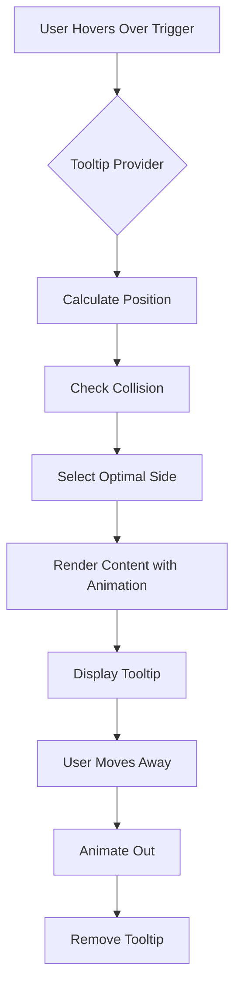

# Tooltip

<cite>
**Referenced Files in This Document**   
- [tooltip.tsx](file://src/components/ui/tooltip.tsx)
- [sidebar.tsx](file://src/components/ui/sidebar.tsx)
- [Code-component-1-41.tsx](file://src/components/ui/Code-component-1-41.tsx)
</cite>

## Table of Contents
1. [Introduction](#introduction)
2. [Core Components](#core-components)
3. [Positioning and Collision Avoidance](#positioning-and-collision-avoidance)
4. [Delay Controls and Timing](#delay-controls-and-timing)
5. [Usage Patterns](#usage-patterns)
6. [Accessibility Requirements](#accessibility-requirements)
7. [Animation and Performance](#animation-and-performance)
8. [Implementation Examples](#implementation-examples)
9. [Conclusion](#conclusion)

## Introduction
The Tooltip component provides contextual help and label extension functionality across the application. Built on Radix UI's Tooltip primitive, it enables non-intrusive information delivery for form field explanations, icon clarification, and truncated text expansion. The implementation prioritizes accessibility, performance, and seamless user experience through carefully designed positioning, timing, and animation behaviors.

## Core Components

The Tooltip system consists of four primary components that work together to create a cohesive experience:

- **TooltipProvider**: Manages global tooltip behavior, particularly delay duration
- **Tooltip**: The root component that controls the open/closed state
- **TooltipTrigger**: The element that activates the tooltip on hover or focus
- **TooltipContent**: The visual container displaying the tooltip message

These components follow the compound component pattern, allowing flexible composition while maintaining consistent behavior.

**Section sources**
- [tooltip.tsx](file://src/components/ui/tooltip.tsx#L1-L60)

## Positioning and Collision Avoidance

The Tooltip component leverages Radix UI's positioning engine to automatically handle placement and collision detection. Tooltips are positioned relative to their trigger element with a default side offset of 0 pixels. The system intelligently selects the optimal side (top, right, bottom, left) based on available space, preventing overflow from the viewport.

The implementation includes arrow indicators that point to the trigger element, maintaining visual connection. The tooltip container uses `w-fit` to size according to content while respecting text balance for optimal readability.

**Section sources**
- [tooltip.tsx](file://src/components/ui/tooltip.tsx#L44-L55)

## Delay Controls and Timing

Tooltip timing is managed through the TooltipProvider component, which accepts a `delayDuration` prop (default: 0). This controls how long the tooltip waits before appearing after the trigger is hovered or focused. The default zero delay provides immediate feedback, suitable for frequently accessed interface elements.

The provider wraps all tooltip instances, ensuring consistent timing behavior across the application. This centralized approach allows global adjustment of tooltip responsiveness based on user preferences or device characteristics.

**Section sources**
- [tooltip.tsx](file://src/components/ui/tooltip.tsx#L7-L15)

## Usage Patterns

### Form Field Explanations
Tooltips provide supplemental information for form fields, clarifying requirements or offering examples without cluttering the interface. They appear on hover over information icons adjacent to input fields.

### Icon Clarification
For icon-only buttons or navigation elements, tooltips display text labels to ensure functionality is clear. This is particularly important for accessibility and user onboarding.

### Truncated Text Expansion
When text content is truncated due to space constraints, tooltips display the complete content on hover, enabling users to access full information without layout disruption.

**Section sources**
- [sidebar.tsx](file://src/components/ui/sidebar.tsx#L536)

## Accessibility Requirements

The Tooltip implementation meets WCAG standards through several key features:

- **Keyboard Focus**: Tooltips appear on both hover and focus, ensuring keyboard navigability
- **Screen Reader Support**: ARIA attributes properly associate triggers with their content
- **Non-Disruptive Appearance**: Tooltips do not receive focus themselves, preventing keyboard trap
- **Dismissable**: Tooltips automatically hide when the trigger loses focus or hover state

The component maintains proper focus management, ensuring users can navigate past tooltip triggers without interruption.

**Section sources**
- [tooltip.tsx](file://src/components/ui/tooltip.tsx#L1-L60)

## Animation and Performance

Tooltips use Framer Motion's animation primitives for subtle entrance and exit effects. The animation sequence includes:
- Fade-in with slight zoom (fade-in-0, zoom-in-95)
- Slide-in from the selected side
- Reverse animations on exit

These transitions are optimized for 60fps performance with hardware acceleration. For high-frequency triggers, the implementation minimizes re-renders through React's memoization patterns and efficient event handling.

The animation duration and easing are tuned to be noticeable enough for orientation but subtle enough to avoid distraction, following the principle of progressive disclosure.

**Section sources**
- [tooltip.tsx](file://src/components/ui/tooltip.tsx#L48-L52)

## Implementation Examples

### Photographer Portfolio Interface
In the portfolio interface, tooltips display photographer specialties when hovering over category icons. This allows users to understand the nature of each specialty without navigating away from the browsing experience.

### Booking Form
Within the booking form, tooltips provide clarification for date selection requirements and duration options. Information icons next to form fields trigger tooltips explaining constraints like minimum booking times or availability rules.

**Diagram sources**
- [tooltip.tsx](file://src/components/ui/tooltip.tsx#L1-L60)

**Section sources**
- [Code-component-1-41.tsx](file://src/components/ui/Code-component-1-41.tsx#L535-L543)
- [sidebar.tsx](file://src/components/ui/sidebar.tsx#L536)

## Conclusion
The Tooltip component provides a robust solution for contextual information delivery, balancing usability, accessibility, and performance. Its implementation follows modern UI patterns while maintaining flexibility for various use cases across the application. By leveraging Radix UI's accessible primitives and enhancing them with custom styling and animation, the component delivers a polished user experience that supports both novice and experienced users.