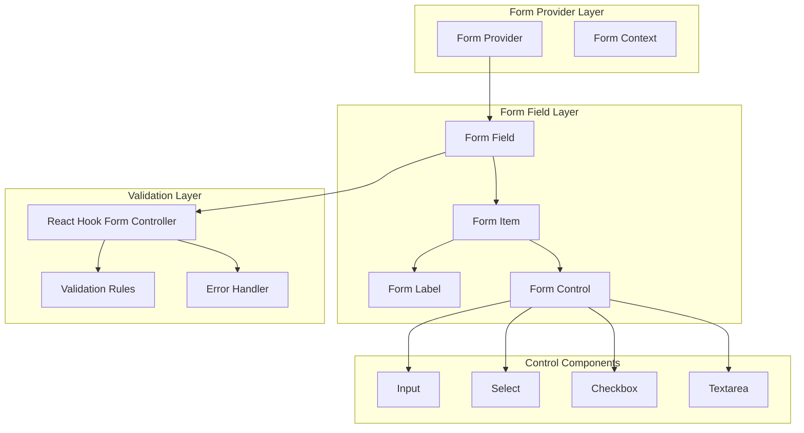
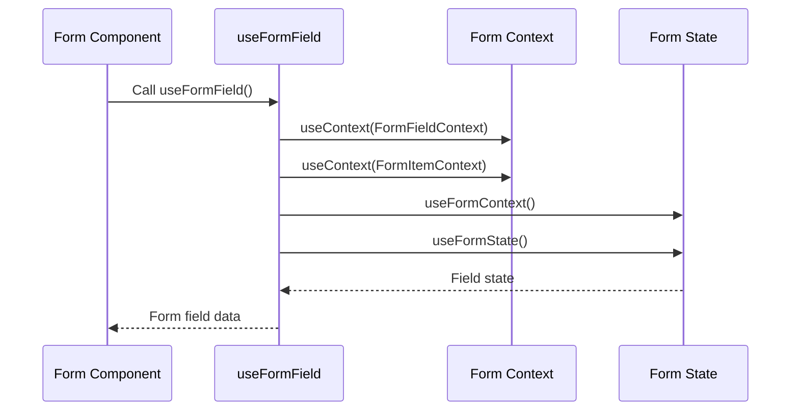
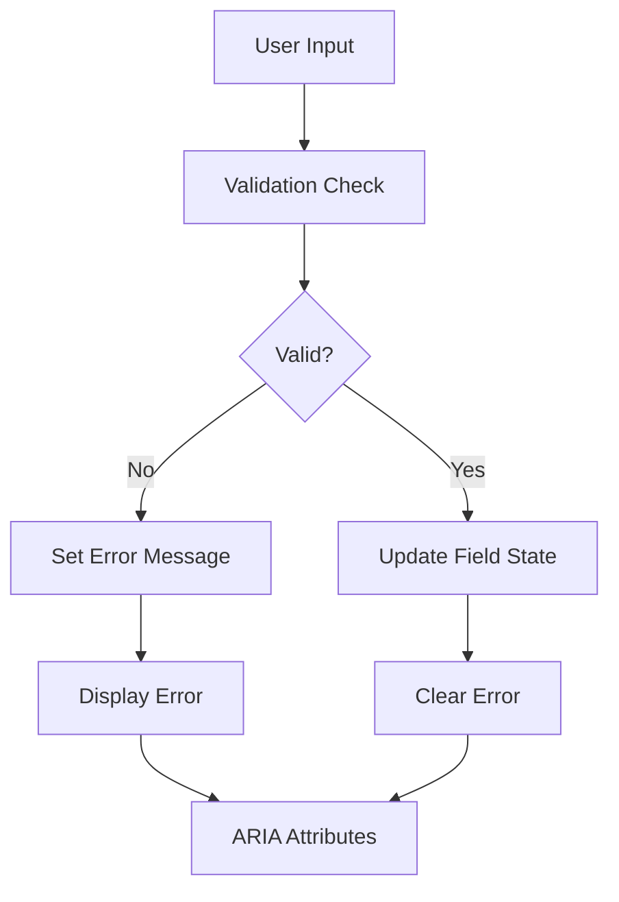
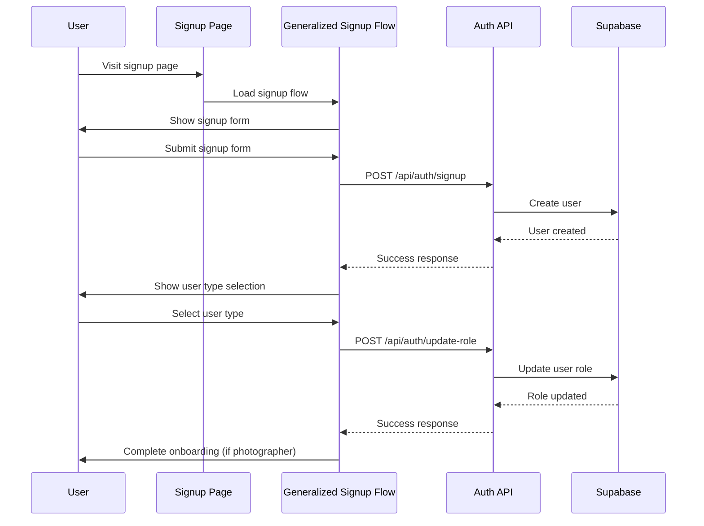

# Form Component Core Documentation

<cite>
**Referenced Files in This Document**
- [form.tsx](file://src/components/ui/form.tsx)
- [SignupForm.tsx](file://src/components/SignupForm.tsx)
- [OnboardingForm.tsx](file://src/components/OnboardingForm.tsx)
- [GeneralizedSignupFlow.tsx](file://src/components/GeneralizedSignupFlow.tsx)
- [signup.tsx](file://pages/signup.tsx)
- [signup.ts](file://pages/api/auth/signup.ts)
- [signin.ts](file://pages/api/auth/signin.ts)
- [update-role.ts](file://pages/api/auth/update-role.ts)
- [validation.ts](file://src/middleware/validation.ts)
- [api.ts](file://src/lib/api.ts)
- [supabase.ts](file://src/lib/supabase.ts)
- [utils.ts](file://src/components/ui/utils.ts)
</cite>

## Table of Contents
1. [Introduction](#introduction)
2. [Form Component Architecture](#form-component-architecture)
3. [Core Form Implementation](#core-form-implementation)
4. [Form Context Management](#form-context-management)
5. [Form Control Components](#form-control-components)
6. [Form Validation and Error Handling](#form-validation-and-error-handling)
7. [Integration with React Hook Form](#integration-with-react-hook-form)
8. [Form Submission Workflows](#form-submission-workflows)
9. [Custom Form Examples](#custom-form-examples)
10. [Advanced Form Features](#advanced-form-features)
11. [Troubleshooting Guide](#troubleshooting-guide)
12. [Best Practices](#best-practices)

## Introduction

The form.tsx component serves as the foundational form infrastructure for the SnapEvent application, built on top of React Hook Form for robust state and validation management. This component provides a comprehensive form system that handles everything from basic input validation to complex multi-step workflows involving Supabase authentication and user role management.

The form system is designed with accessibility, reusability, and maintainability in mind, featuring a modular architecture that separates concerns between form layout, validation logic, and submission handling. It seamlessly integrates with the application's authentication flow, supporting both client and photographer registration workflows.

## Form Component Architecture

The form system follows a hierarchical component structure that promotes code reuse and maintains consistent behavior across different form types.



**Diagram sources**
- [form.tsx](file://src/components/ui/form.tsx#L1-L169)

**Section sources**
- [form.tsx](file://src/components/ui/form.tsx#L1-L50)

## Core Form Implementation

The form.tsx component exports several key components that work together to create a comprehensive form system:

### Form Provider

The `Form` component acts as a wrapper around React Hook Form's `FormProvider`, establishing the form context for all child form fields:

```typescript
const Form = FormProvider;
```

This simple yet powerful abstraction allows developers to use the form system without worrying about the underlying React Hook Form implementation details.

### Form Field Context

The form system uses two primary contexts to manage state and coordinate between components:

```typescript
type FormFieldContextValue<TFieldValues extends FieldValues = FieldValues, TName extends FieldPath<TFieldValues> = FieldPath<TFieldValues>> = {
  name: TName;
};

const FormFieldContext = React.createContext<FormFieldContextValue>(
  {} as FormFieldContextValue,
);
```

The `FormFieldContext` stores the field name and is used by the `useFormField` hook to access field-specific information.

### Form Item Context

The `FormItemContext` manages unique identifiers for form elements, ensuring proper accessibility and DOM relationships:

```typescript
type FormItemContextValue = {
  id: string;
};

const FormItemContext = React.createContext<FormItemContextValue>(
  {} as FormItemContextValue,
);
```

**Section sources**
- [form.tsx](file://src/components/ui/form.tsx#L15-L45)

## Form Context Management

The `useFormField` hook is the central mechanism for accessing form field information and managing field state:

```typescript
const useFormField = () => {
  const fieldContext = React.useContext(FormFieldContext);
  const itemContext = React.useContext(FormItemContext);
  const { getFieldState } = useFormContext();
  const formState = useFormState({ name: fieldContext.name });
  const fieldState = getFieldState(fieldContext.name, formState);

  if (!fieldContext) {
    throw new Error("useFormField should be used within <FormField>");
  }

  const { id } = itemContext;

  return {
    id,
    name: fieldContext.name,
    formItemId: `${id}-form-item`,
    formDescriptionId: `${id}-form-item-description`,
    formMessageId: `${id}-form-item-message`,
    ...fieldState,
  };
};
```

This hook provides:

- **Field Identification**: Unique IDs for form elements
- **State Access**: Current field state including errors and touched status
- **Accessibility Support**: Proper ARIA attributes and labeling
- **Error Propagation**: Seamless error message display



**Diagram sources**
- [form.tsx](file://src/components/ui/form.tsx#L47-L75)

**Section sources**
- [form.tsx](file://src/components/ui/form.tsx#L47-L75)

## Form Control Components

The form system provides specialized components for different input types, each designed to work seamlessly with React Hook Form's controlled input pattern.

### FormItem Component

The `FormItem` component creates a container with proper spacing and accessibility support:

```typescript
function FormItem({ className, ...props }: React.ComponentProps<"div">) {
  const id = React.useId();

  return (
    <FormItemContext.Provider value={{ id }}>
      <div
        data-slot="form-item"
        className={cn("grid gap-2", className)}
        {...props}
      />
    </FormItemContext.Provider>
  );
}
```

### FormLabel Component

The `FormLabel` component automatically associates with its corresponding form control and applies error styling:

```typescript
function FormLabel({
  className,
  ...props
}: React.ComponentProps<typeof LabelPrimitive.Root>) {
  const { error, formItemId } = useFormField();

  return (
    <Label
      data-slot="form-label"
      data-error={!!error}
      className={cn("data-[error=true]:text-destructive", className)}
      htmlFor={formItemId}
      {...props}
    />
  );
}
```

### FormControl Component

The `FormControl` component wraps form controls and manages accessibility attributes:

```typescript
function FormControl({ ...props }: React.ComponentProps<typeof Slot>) {
  const { error, formItemId, formDescriptionId, formMessageId } =
    useFormField();

  return (
    <Slot
      data-slot="form-control"
      id={formItemId}
      aria-describedby={
        !error
          ? `${formDescriptionId}`
          : `${formDescriptionId} ${formMessageId}`
      }
      aria-invalid={!!error}
      {...props}
    />
  );
}
```

### Form Description and Message Components

These components provide structured feedback for form fields:

```typescript
function FormDescription({ className, ...props }: React.ComponentProps<"p">) {
  const { formDescriptionId } = useFormField();

  return (
    <p
      data-slot="form-description"
      id={formDescriptionId}
      className={cn("text-muted-foreground text-sm", className)}
      {...props}
    />
  );
}

function FormMessage({ className, ...props }: React.ComponentProps<"p">) {
  const { error, formMessageId } = useFormField();
  const body = error ? String(error?.message ?? "") : props.children;

  if (!body) {
    return null;
  }

  return (
    <p
      data-slot="form-message"
      id={formMessageId}
      className={cn("text-destructive text-sm", className)}
      {...props}
    >
      {body}
    </p>
  );
}
```

**Section sources**
- [form.tsx](file://src/components/ui/form.tsx#L77-L169)

## Form Validation and Error Handling

The form system integrates with React Hook Form's validation capabilities and provides additional error handling mechanisms.

### Built-in Validation

The system supports various validation scenarios:



**Diagram sources**
- [form.tsx](file://src/components/ui/form.tsx#L140-L169)

### Custom Validation Example

Here's how validation works in practice with the SignupForm:

```typescript
const validateForm = () => {
  if (!formData.firstName.trim()) {
    setError('First name is required');
    return false;
  }
  if (!formData.lastName.trim()) {
    setError('Last name is required');
    return false;
  }
  if (!formData.email.trim()) {
    setError('Email is required');
    return false;
  }
  if (!/\S+@\S+\.\S+/.test(formData.email)) {
    setError('Please enter a valid email address');
    return false;
  }
  // Additional validations...
  return true;
};
```

**Section sources**
- [SignupForm.tsx](file://src/components/SignupForm.tsx#L35-L65)

## Integration with React Hook Form

The form system leverages React Hook Form's powerful features for state management and validation:

### Controller Pattern

The `FormField` component uses React Hook Form's Controller pattern to wrap form controls:

```typescript
const FormField = <
  TFieldValues extends FieldValues = FieldValues,
  TName extends FieldPath<TFieldValues> = FieldPath<TFieldValues>,
>({
  ...props
}: ControllerProps<TFieldValues, TName>) => {
  return (
    <FormFieldContext.Provider value={{ name: props.name }}>
      <Controller {...props} />
    </FormFieldContext.Provider>
  );
};
```

### useFormContext Integration

Components can access the form context using `useFormContext()` to get access to form-wide state and methods:

```typescript
const { getFieldState } = useFormContext();
const formState = useFormState({ name: fieldContext.name });
const fieldState = getFieldState(fieldContext.name, formState);
```

**Section sources**
- [form.tsx](file://src/components/ui/form.tsx#L25-L45)

## Form Submission Workflows

The form system supports complex submission workflows, particularly evident in the authentication flow.

### Authentication Flow Architecture



**Diagram sources**
- [signup.tsx](file://pages/signup.tsx#L1-L110)
- [GeneralizedSignupFlow.tsx](file://src/components/GeneralizedSignupFlow.tsx#L1-L192)

### Form Submission Implementation

The SignupForm demonstrates a typical form submission workflow:

```typescript
const handleSubmit = async (e: React.FormEvent) => {
  e.preventDefault();
  
  if (!validateForm()) return;

  setIsLoading(true);
  setError('');

  try {
    const response = await fetch('/api/auth/signup', {
      method: 'POST',
      headers: {
        'Content-Type': 'application/json',
      },
      body: JSON.stringify({
        firstName: formData.firstName,
        lastName: formData.lastName,
        email: formData.email,
        phone: formData.phone || null,
        password: formData.password,
        role: 'CLIENT'
      }),
    });

    const data = await response.json();

    if (!response.ok) {
      throw new Error(data.error || 'Signup failed');
    }

    onSignupSuccess();
  } catch (error) {
    setError(error instanceof Error ? error.message : 'An error occurred during signup');
  } finally {
    setIsLoading(false);
  }
};
```

**Section sources**
- [SignupForm.tsx](file://src/components/SignupForm.tsx#L67-L95)

## Custom Form Examples

### Basic Form Structure

Here's how to create a basic form using the form components:

```typescript
<Form {...methods}>
  <form onSubmit={methods.handleSubmit(onSubmit)}>
    <FormField
      control={methods.control}
      name="email"
      render={({ field }) => (
        <FormItem>
          <FormLabel>Email</FormLabel>
          <FormControl>
            <Input placeholder="Enter your email" {...field} />
          </FormControl>
          <FormDescription>
            We'll never share your email.
          </FormDescription>
          <FormMessage />
        </FormItem>
      )}
    />
  </form>
</Form>
```

### Multi-Step Form Example

The OnboardingForm demonstrates a complex multi-step form:

```typescript
const [currentStep, setCurrentStep] = useState(1);
const [formData, setFormData] = useState<FormData>({
  fullName: '',
  phoneNumber: '',
  email: '',
  location: '',
  // ... other fields
});

const specialtyOptions = [
  'Wedding Photography', 'Portrait Photography', 'Event Photography',
  'Corporate Photography', 'Fashion Photography', 'Landscape Photography',
  'Street Photography', 'Product Photography', 'Food Photography'
];

const serviceOptions = [
  'Photo Shoots', 'Event Coverage', 'Post-Processing', 'Consultation',
  'Album Design', 'Prints & Products', 'Video Services', 'Drone Photography'
];
```

**Section sources**
- [OnboardingForm.tsx](file://src/components/OnboardingForm.tsx#L25-L100)

## Advanced Form Features

### Async Validation

The form system supports async validation through React Hook Form's resolver pattern:

```typescript
// Example async validation setup
const resolver = async (values: any) => {
  const errors: any = {};
  
  // Perform async validation
  const emailExists = await checkEmailExists(values.email);
  if (emailExists) {
    errors.email = 'Email already exists';
  }
  
  return {
    values,
    errors: Object.keys(errors).length > 0 ? errors : {},
  };
};
```

### Custom Form Control Integration

The form system can integrate with custom form controls:

```typescript
function CustomFormInput({ field, ...props }: { field: any } & React.ComponentProps<"input">) {
  return (
    <div className="relative">
      <input
        {...field}
        {...props}
        className={`form-input ${props.className}`}
      />
      {props.error && (
        <span className="text-red-500 text-sm">{props.error}</span>
      )}
    </div>
  );
}
```

### Form State Persistence

The system supports form state persistence across sessions:

```typescript
// Save form state to localStorage
const saveFormData = (formData: any) => {
  localStorage.setItem('formState', JSON.stringify(formData));
};

// Restore form state
const restoreFormData = () => {
  const saved = localStorage.getItem('formState');
  return saved ? JSON.parse(saved) : null;
};
```

**Section sources**
- [OnboardingForm.tsx](file://src/components/OnboardingForm.tsx#L100-L150)

## Troubleshooting Guide

### Common Issues and Solutions

#### Uncontrolled Input Warnings

**Problem**: React Hook Form warns about uncontrolled inputs.

**Solution**: Ensure all form fields are properly controlled:

```typescript
// ❌ Wrong - uncontrolled
<input />

// ✅ Correct - controlled
<Controller
  name="fieldName"
  control={control}
  render={({ field }) => <input {...field} />}
/>
```

#### Context Provider Missing

**Problem**: `useFormField` throws context provider error.

**Solution**: Wrap form components in FormProvider:

```typescript
<Form {...methods}>
  {/* Form fields */}
</Form>
```

#### Resolver Configuration Issues

**Problem**: Custom resolver not working correctly.

**Solution**: Ensure resolver returns proper format:

```typescript
const resolver = yupResolver(schema); // or custom resolver
```

#### Error Propagation Problems

**Problem**: Error messages not displaying.

**Solution**: Check FormMessage component usage:

```typescript
<FormItem>
  <FormLabel>Email</FormLabel>
  <FormControl>
    <Input {...field} />
  </FormControl>
  <FormMessage /> {/* Must be inside FormItem */}
</FormItem>
```

### Debugging Tips

1. **Enable React DevTools**: Use React DevTools to inspect form state
2. **Console Logging**: Add logging to track form submission flow
3. **Network Tab**: Monitor API requests in browser dev tools
4. **Form State Inspection**: Use `console.log(useFormState())` to debug form state

**Section sources**
- [form.tsx](file://src/components/ui/form.tsx#L47-L75)

## Best Practices

### Form Design Principles

1. **Progressive Disclosure**: Show only essential fields initially
2. **Clear Error Messages**: Provide actionable error feedback
3. **Accessibility First**: Ensure all form elements are accessible
4. **Mobile Responsive**: Design forms for mobile-first experience

### Code Organization

1. **Separate Concerns**: Keep validation logic separate from presentation
2. **Reusable Components**: Create reusable form field components
3. **Consistent Patterns**: Follow consistent naming and structure patterns
4. **Type Safety**: Use TypeScript for form field typing

### Performance Optimization

1. **Debounced Validation**: Use debouncing for expensive validation
2. **Conditional Rendering**: Render complex fields conditionally
3. **Memoization**: Use React.memo for expensive form components
4. **Lazy Loading**: Load form components on demand

### Security Considerations

1. **Input Sanitization**: Sanitize all user inputs
2. **CSRF Protection**: Implement CSRF protection for form submissions
3. **Rate Limiting**: Implement rate limiting for API endpoints
4. **HTTPS Only**: Ensure all form submissions use HTTPS

### Testing Strategies

1. **Unit Tests**: Test individual form components
2. **Integration Tests**: Test complete form workflows
3. **End-to-End Tests**: Test real user interactions
4. **Accessibility Tests**: Ensure WCAG compliance

The form component system provides a robust foundation for building complex forms while maintaining simplicity and accessibility. By following these patterns and best practices, developers can create reliable, user-friendly forms that integrate seamlessly with the application's authentication and data management systems.